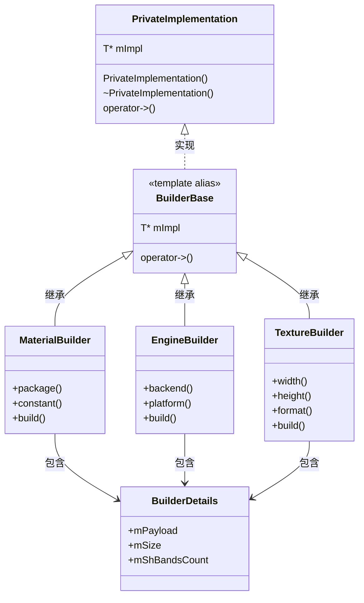
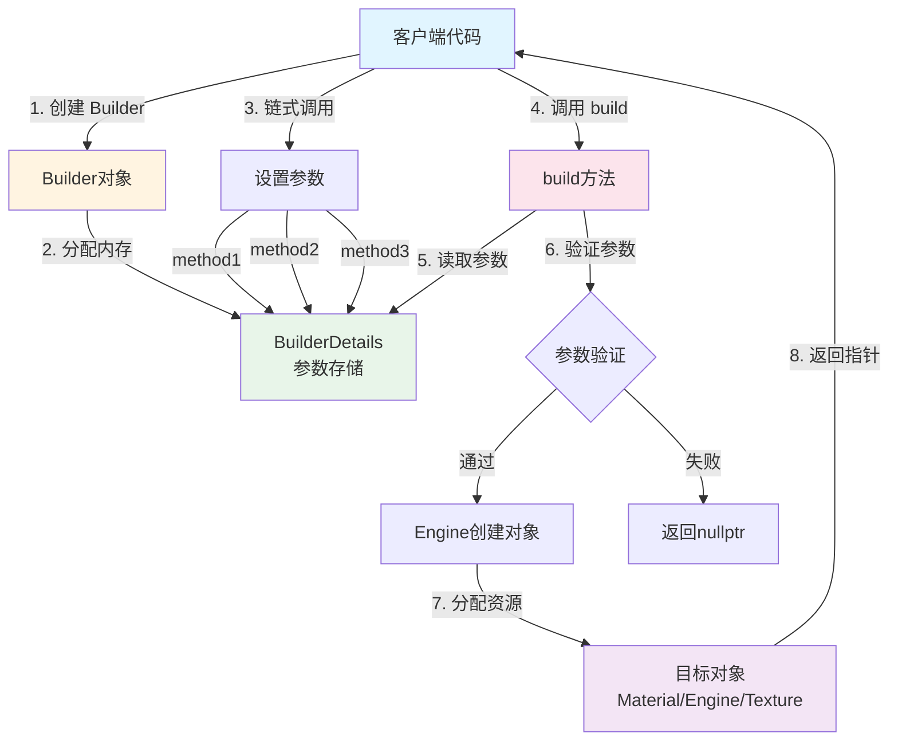
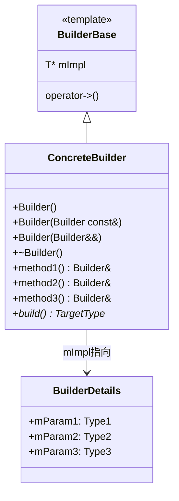
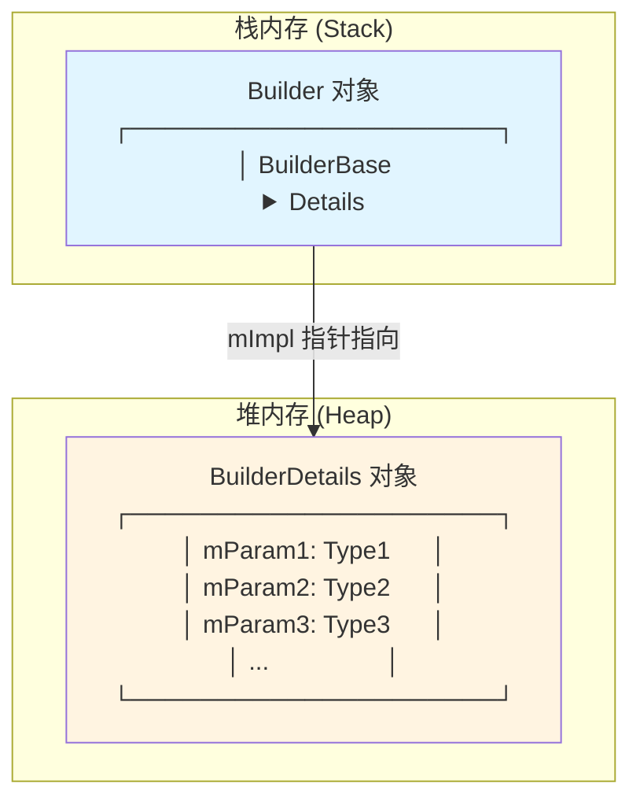
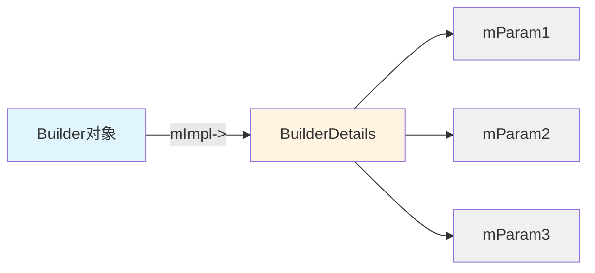
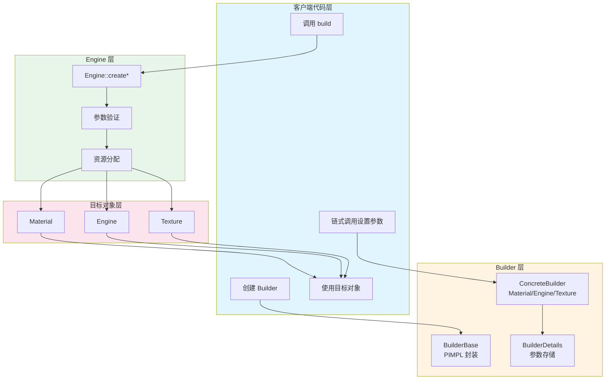

# Filament Builder 模式架构设计完整分析

## 目录
1. [概述](#概述)
2. [架构设计](#架构设计)
3. [核心组件](#核心组件)
4. [Builder 模式实现](#builder-模式实现)
5. [典型 Builder 示例](#典型-builder-示例)
6. [设计优势](#设计优势)
7. [使用示例](#使用示例)
8. [总结](#总结)

---

## 概述

### 1.1 设计目标

Filament 的 Builder 模式旨在提供：

- **类型安全**：编译时类型检查，防止参数错误
- **链式调用**：流畅的 API 设计，提高代码可读性
- **参数验证**：在构建时验证参数有效性
- **ABI 兼容性**：通过 PIMPL 模式隐藏实现细节
- **灵活配置**：支持可选参数和默认值

### 1.2 核心组件

#### 1.2.1 类层次结构图



#### 1.2.2 架构层次图

```
┌─────────────────────────────────────────────────────────────┐
│                    Builder 模式层次结构                       │
├─────────────────────────────────────────────────────────────┤
│                                                               │
│  ┌─────────────────────────────────────────────────────┐   │
│  │         BuilderBase<T> (模板别名)                      │   │
│  │  = utils::PrivateImplementation<T>                    │   │
│  │  提供 PIMPL 模式实现，隐藏实现细节                      │   │
│  │  - mImpl 指针指向 BuilderDetails                      │   │
│  │  - operator->() 提供便捷访问                          │   │
│  └─────────────────────────────────────────────────────┘   │
│                        ▲                                    │
│                        │ 继承                               │
│  ┌─────────────────────────────────────────────────────┐   │
│  │         ConcreteBuilder (具体构建器)                    │   │
│  │  如: Material::Builder, Engine::Builder               │   │
│  │  - 提供链式调用方法                                     │   │
│  │  - 返回自身引用 (Builder&)                             │   │
│  │  - build() 方法创建最终对象                            │   │
│  │  - 通过 mImpl-> 访问 BuilderDetails                    │   │
│  └─────────────────────────────────────────────────────┘   │
│                        │                                    │
│                        │ 包含 (mImpl 指向)                   │
│  ┌─────────────────────────────────────────────────────┐   │
│  │         BuilderDetails (构建详情结构)                   │   │
│  │  存储所有构建参数                                       │   │
│  │  - 成员变量存储配置                                     │   │
│  │  - 默认值初始化                                         │   │
│  │  - 在堆上分配                                           │   │
│  └─────────────────────────────────────────────────────┘   │
│                                                               │
└─────────────────────────────────────────────────────────────┘
```

---

## 架构设计

### 2.1 设计理念

#### 2.1.1 PIMPL 模式（Pointer to Implementation）

Filament 的 Builder 使用 PIMPL 模式实现：

```cpp
// BuilderBase 是模板别名
template<typename T>
using BuilderBase = utils::PrivateImplementation<T>;
```

**优势**：
- **ABI 兼容性**：实现细节改变不影响客户端代码
- **编译速度**：减少头文件依赖
- **二进制兼容**：库更新时无需重新编译客户端

#### 2.1.2 链式调用（Fluent Interface）

所有 Builder 方法返回自身引用，支持链式调用：

```cpp
Material* material = Material::Builder()
    .package(payload, size)
    .constant("myConstant", 42)
    .build(engine);
```

#### 2.1.3 参数分离

构建参数存储在独立的 `BuilderDetails` 结构体中：

```cpp
struct Material::BuilderDetails {
    const void* mPayload = nullptr;
    size_t mSize = 0;
    // ... 其他参数
};
```

### 2.2 数据流

#### 2.2.1 构建流程



#### 2.2.2 数据流图

```
客户端代码
  │
  │ 1. 创建 Builder
  │    Builder builder;
  ▼
Builder 对象 (栈分配)
  │
  │ 2. 链式调用设置参数
  │    builder.method1().method2().method3()
  │    │
  │    └─> 每次调用：
  │        - 修改 mImpl->mParamX
  │        - 返回 *this (Builder&)
  ▼
BuilderDetails (堆分配，由 mImpl 指向)
  │
  │ 存储所有参数：
  │ - mParam1 = value1
  │ - mParam2 = value2
  │ - mParam3 = value3
  │
  │ 3. 调用 build(engine)
  ▼
build() 方法
  │
  │ 4. 验证参数
  │    - 检查必需参数
  │    - 验证参数范围
  │
  │ 5. 创建目标对象
  │    - 使用 Engine::create*()
  │    - 传递 BuilderDetails 参数
  ▼
目标对象 (Material, Engine, Texture 等)
  │
  │ 6. 返回对象指针
  ▼
客户端代码
```

---

## 核心组件

### 3.1 BuilderBase

**位置**：`filament/include/filament/FilamentAPI.h`

```cpp
/**
 * BuilderBase 类型别名
 * 
 * 功能：
 * - 为 Builder 模式提供统一的基类实现
 * - 使用 PIMPL 模式隐藏 Builder 的实现细节
 * 
 * 模板参数：
 * @tparam T Builder 的内部实现类型（通常是 BuilderDetails）
 */
template<typename T>
using BuilderBase = utils::PrivateImplementation<T>;
```

**实际实现**：`libs/utils/include/utils/PrivateImplementation.h`

```cpp
template<typename T>
class PrivateImplementation {
protected:
    T* mImpl = nullptr;  // 指向实现对象的指针
    
    // 提供指针访问运算符
    inline T* operator->() noexcept { return mImpl; }
    inline T const* operator->() const noexcept { return mImpl; }
    
public:
    // 构造函数、析构函数、拷贝/移动语义
    template<typename ... ARGS>
    explicit PrivateImplementation(ARGS&& ...) noexcept;
    
    ~PrivateImplementation() noexcept;
    // ...
};
```

### 3.2 BuilderDetails

**作用**：存储所有构建参数

**特点**：
- 结构体或类，包含所有配置参数
- 使用默认值初始化
- 通过 Builder 的方法修改

**示例**：`Material::BuilderDetails`

```cpp
struct Material::BuilderDetails {
    const void* mPayload = nullptr;      // 材质包数据
    size_t mSize = 0;                    // 材质包大小
    bool mDefaultMaterial = false;       // 是否默认材质
    int32_t mShBandsCount = 3;          // 球谐函数频带数
    Builder::ShadowSamplingQuality mShadowSamplingQuality = 
        Builder::ShadowSamplingQuality::LOW;
    UboBatchingMode mUboBatchingMode = UboBatchingMode::DEFAULT;
    std::unordered_map<CString, std::variant<int32_t, float, bool>> 
        mConstantSpecializations;        // 常量特化映射
};
```

### 3.3 ConcreteBuilder

**结构**：

```cpp
class Material::Builder : public BuilderBase<BuilderDetails> {
    friend struct BuilderDetails;
    
public:
    Builder() noexcept;
    Builder(Builder const& rhs) noexcept;
    Builder(Builder&& rhs) noexcept;
    ~Builder() noexcept;
    
    // 链式调用方法
    Builder& package(const void* payload, size_t size);
    Builder& constant(const char* name, T value);
    Builder& sphericalHarmonicsBandCount(size_t count);
    // ...
    
    // 构建方法
    Material* build(Engine& engine) const;
};
```

---

## Builder 模式实现

### 4.1 基本结构

#### 4.1.1 类结构图



#### 4.1.2 代码结构

```
┌─────────────────────────────────────────────────────────────┐
│                      Builder 类结构                         │
├─────────────────────────────────────────────────────────────┤
│                                                               │
│  class ConcreteBuilder : public BuilderBase<Details> {      │
│      friend struct BuilderDetails;  // 友元声明              │
│  public:                                                     │
│      // 1. 构造函数                                          │
│      Builder() noexcept;                                     │
│      Builder(Builder const& rhs) noexcept;                   │
│      Builder(Builder&& rhs) noexcept;                       │
│      ~Builder() noexcept;                                    │
│                                                               │
│      // 2. 链式调用方法（返回 Builder&）                     │
│      Builder& method1(...) noexcept {                        │
│          mImpl->mParam1 = ...;                               │
│          return *this;                                        │
│      }                                                        │
│      Builder& method2(...) noexcept;                          │
│      Builder& method3(...) noexcept;                          │
│                                                               │
│      // 3. 构建方法（返回目标对象）                           │
│      TargetType* build(Engine& engine) const {               │
│          // 使用 mImpl->... 访问参数                          │
│          // 创建并返回目标对象                                │
│      }                                                        │
│  };                                                           │
│                                                               │
│  struct BuilderDetails {                                     │
│      // 存储所有构建参数                                     │
│      Type1 mParam1 = defaultValue1;                          │
│      Type2 mParam2 = defaultValue2;                          │
│      Type3 mParam3 = defaultValue3;                          │
│      // ...                                                  │
│  };                                                           │
│                                                               │
└─────────────────────────────────────────────────────────────┘
```

### 4.2 实现步骤

#### 步骤 1：定义 BuilderDetails

```cpp
struct Material::BuilderDetails {
    const void* mPayload = nullptr;
    size_t mSize = 0;
    // ... 其他参数
};
```

#### 步骤 2：定义 Builder 类

```cpp
class Material::Builder : public BuilderBase<BuilderDetails> {
    friend struct BuilderDetails;
public:
    Builder() noexcept = default;
    // ... 其他构造函数
    
    Builder& package(const void* payload, size_t size) {
        mImpl->mPayload = payload;
        mImpl->mSize = size;
        return *this;  // 返回自身引用，支持链式调用
    }
    
    Material* build(Engine& engine) const {
        // 使用 mImpl->... 访问 BuilderDetails
        // 创建并返回 Material 对象
    }
};
```

#### 步骤 3：实现链式调用方法

所有设置方法都遵循相同模式：

```cpp
Builder& methodName(ParamType param) noexcept {
    mImpl->mMember = param;  // 设置参数
    return *this;             // 返回自身引用
}
```

#### 步骤 4：实现 build() 方法

```cpp
TargetType* Builder::build(Engine& engine) const {
    // 1. 验证参数（可选）
    // 2. 使用 mImpl->... 访问参数
    // 3. 创建目标对象
    // 4. 返回对象指针
}
```

### 4.3 内存布局

#### 4.3.1 对象内存布局图



#### 4.3.2 详细内存布局

```
栈内存 (Stack)                   堆内存 (Heap)
┌─────────────────────────┐      ┌─────────────────────────┐
│  Builder 对象            │      │  BuilderDetails 对象    │
│  ┌───────────────────┐  │      │  ┌───────────────────┐  │
│  │ BuilderBase       │  │      │  │ mPayload: void*   │  │
│  │ ┌───────────────┐ │  │      │  │ mSize: size_t     │  │
│  │ │ T* mImpl ─────┼─┼──┼──────>│  │ mShBandsCount: 3  │  │
│  │ └───────────────┘ │  │      │  │ mShadowQuality    │  │
│  └───────────────────┘ │      │  │ ...               │  │
│  ┌───────────────────┐ │      │  └───────────────────┘  │
│  │ Builder 方法       │ │      └─────────────────────────┘
│  │ - package()        │ │
│  │ - constant()       │ │
│  │ - build()          │ │
│  └───────────────────┘ │
└─────────────────────────┘
```

#### 4.3.3 内存访问模式



---

## 典型 Builder 示例

### 5.1 Material::Builder

**位置**：`filament/include/filament/Material.h`

**BuilderDetails**：

```cpp
struct Material::BuilderDetails {
    const void* mPayload = nullptr;
    size_t mSize = 0;
    bool mDefaultMaterial = false;
    int32_t mShBandsCount = 3;
    Builder::ShadowSamplingQuality mShadowSamplingQuality = 
        Builder::ShadowSamplingQuality::LOW;
    UboBatchingMode mUboBatchingMode = UboBatchingMode::DEFAULT;
    std::unordered_map<CString, std::variant<int32_t, float, bool>> 
        mConstantSpecializations;
};
```

**Builder 类**：

```cpp
class Material::Builder : public BuilderBase<BuilderDetails> {
    friend struct BuilderDetails;
public:
    Builder() noexcept;
    
    // 设置材质包
    Builder& package(const void* payload, size_t size);
    
    // 设置常量特化
    template<typename T>
    Builder& constant(const char* name, T value);
    
    // 设置球谐函数频带数
    Builder& sphericalHarmonicsBandCount(size_t count);
    
    // 设置阴影采样质量
    Builder& shadowSamplingQuality(ShadowSamplingQuality quality);
    
    // 构建材质
    Material* build(Engine& engine) const;
};
```

**使用示例**：

```cpp
Material* material = Material::Builder()
    .package(payload, size)
    .constant("myConstant", 42)
    .sphericalHarmonicsBandCount(3)
    .shadowSamplingQuality(Material::Builder::ShadowSamplingQuality::LOW)
    .build(engine);
```

### 5.2 Engine::Builder

**位置**：`filament/include/filament/Engine.h`

**BuilderDetails**：

```cpp
struct Engine::BuilderDetails {
    Backend mBackend = Backend::DEFAULT;
    Platform* mPlatform = nullptr;
    Config mConfig;
    FeatureLevel mFeatureLevel = FeatureLevel::FEATURE_LEVEL_1;
    void* mSharedContext = nullptr;
    bool mPaused = false;
    std::unordered_map<CString, bool> mFeatureFlags;
    
    static Config validateConfig(Config config) noexcept;
};
```

**Builder 类**：

```cpp
class Engine::Builder : public BuilderBase<BuilderDetails> {
    friend struct BuilderDetails;
    friend class FEngine;
public:
    Builder() noexcept;
    
    Builder& backend(Backend backend) noexcept;
    Builder& platform(Platform* platform) noexcept;
    Builder& config(const Config* config) noexcept;
    Builder& sharedContext(void* sharedContext) noexcept;
    Builder& featureLevel(FeatureLevel level) noexcept;
    Builder& paused(bool paused) noexcept;
    Builder& feature(char const* name, bool value) noexcept;
    Builder& features(std::initializer_list<char const*> list) noexcept;
    
    Engine* build() const;
    
#if UTILS_HAS_THREADING
    void build(Invocable<void(void*)>&& callback) const;
#endif
};
```

**使用示例**：

```cpp
Engine* engine = Engine::Builder()
    .backend(Backend::OPENGL)
    .featureLevel(FeatureLevel::FEATURE_LEVEL_3)
    .config(&config)
    .build();
```

### 5.3 Texture::Builder

**位置**：`filament/include/filament/Texture.h`

**BuilderDetails**：

```cpp
struct Texture::BuilderDetails {
    intptr_t mImportedId = 0;
    uint32_t mWidth = 1;
    uint32_t mHeight = 1;
    uint32_t mDepth = 1;
    uint8_t mLevels = 1;
    uint8_t mSamples = 1;
    Sampler mTarget = Sampler::SAMPLER_2D;
    InternalFormat mFormat = InternalFormat::RGBA8;
    Usage mUsage = Usage::NONE;
    bool mHasBlitSrc = false;
    bool mTextureIsSwizzled = false;
    bool mExternal = false;
    std::array<Swizzle, 4> mSwizzle = {
        Swizzle::CHANNEL_0, Swizzle::CHANNEL_1,
        Swizzle::CHANNEL_2, Swizzle::CHANNEL_3
    };
};
```

**使用示例**：

```cpp
Texture* texture = Texture::Builder()
    .width(512)
    .height(512)
    .format(Texture::InternalFormat::RGBA8)
    .sampler(Texture::Sampler::SAMPLER_2D)
    .levels(1)
    .build(*engine);
```

### 5.4 RenderableManager::Builder

**位置**：`filament/include/filament/RenderableManager.h`

**BuilderDetails**：

```cpp
struct RenderableManager::BuilderDetails {
    std::vector<Entry> mEntries;
    Box mAABB;
    uint8_t mLayerMask = 0x1;
    uint8_t mPriority = 0x4;
    uint8_t mCommandChannel = Builder::DEFAULT_CHANNEL;
    uint8_t mLightChannels = 1;
    uint16_t mInstanceCount = 1;
    bool mCulling : 1;
    bool mCastShadows : 1;
    bool mReceiveShadows : 1;
    // ... 更多成员
};
```

**特点**：
- 构造函数接受图元数量参数
- 支持设置多个图元的几何数据

---

## Builder 模式 vs 传统方式对比

### 5.5 为什么需要 Builder 模式？

让我们通过对比来看看 Builder 模式解决了什么问题：

#### 5.5.1 问题场景：创建 Material 对象

假设我们要创建一个 Material 对象，需要以下参数：
- `payload`: 材质包数据指针
- `size`: 材质包大小
- `shBandsCount`: 球谐函数频带数（可选，默认3）
- `shadowQuality`: 阴影采样质量（可选，默认LOW）
- `constant`: 常量特化（可选，可以有多个）

#### 5.5.2 方案一：使用长参数列表构造函数（❌ 不推荐）

```cpp
// ❌ 问题1：参数太多，容易搞混顺序
Material* material = engine->createMaterial(
    payload,           // 哪个是哪个？
    size,             // 顺序容易错
    3,                 // 这是什么参数？
    ShadowQuality::LOW, // 这个枚举值是什么意思？
    nullptr,          // 常量特化？怎么传？
    0                  // 常量数量？
);

// ❌ 问题2：可选参数需要用特殊值表示"未设置"
// 如果我想用默认值，必须记住默认值是什么
Material* material = engine->createMaterial(
    payload, size,
    3,                    // 默认值是多少？3？还是其他？
    ShadowQuality::LOW,   // 默认是什么？
    nullptr, 0            // 如何表示"使用默认值"？
);

// ❌ 问题3：如果参数顺序改变，所有调用代码都要改
// 假设新版本把 shadowQuality 和 shBandsCount 顺序换了
Material* material = engine->createMaterial(
    payload, size,
    ShadowQuality::LOW,   // 顺序变了！
    3,                    // 位置也变了！
    nullptr, 0
);
```

**问题总结**：
- ❌ 参数顺序容易搞错
- ❌ 可读性差，不知道每个参数的含义
- ❌ 可选参数处理困难
- ❌ API 变更时破坏性大

#### 5.5.3 方案二：使用多个重载构造函数（❌ 不推荐）

```cpp
// ❌ 问题1：需要定义大量重载函数
class Material {
public:
    static Material* create(Engine& engine, const void* payload, size_t size);
    static Material* create(Engine& engine, const void* payload, size_t size, 
                           int shBandsCount);
    static Material* create(Engine& engine, const void* payload, size_t size,
                           ShadowQuality quality);
    static Material* create(Engine& engine, const void* payload, size_t size,
                           int shBandsCount, ShadowQuality quality);
    static Material* create(Engine& engine, const void* payload, size_t size,
                           const ConstantMap& constants);
    // ... 需要 N! 个重载（N 是可选参数数量）
    // 如果有 5 个可选参数，需要 2^5 = 32 个重载！
};

// ❌ 问题2：调用时仍然不够清晰
Material* material = Material::create(engine, payload, size, 3);
// 这个 3 是什么意思？球谐函数频带数？还是其他？

// ❌ 问题3：无法同时设置多个可选参数
// 如果我想同时设置 shBandsCount 和 shadowQuality，但没有对应的重载
```

**问题总结**：
- ❌ 需要定义大量重载函数（组合爆炸）
- ❌ 代码维护困难
- ❌ 仍然不够清晰

#### 5.5.4 方案三：使用配置结构体（⚠️ 部分解决）

```cpp
// 定义配置结构体
struct MaterialConfig {
    const void* payload = nullptr;
    size_t size = 0;
    int shBandsCount = 3;
    ShadowQuality shadowQuality = ShadowQuality::LOW;
    std::map<std::string, Variant> constants;
};

// 使用配置结构体
MaterialConfig config;
config.payload = payload;
config.size = size;
config.shBandsCount = 3;
config.shadowQuality = ShadowQuality::LOW;
config.constants["roughness"] = 0.5f;

Material* material = engine->createMaterial(config);
```

**优点**：
- ✅ 参数名称清晰
- ✅ 可选参数有默认值

**缺点**：
- ❌ 需要创建临时变量
- ❌ 代码冗长
- ❌ 不支持链式调用
- ❌ 如果配置结构体改变，可能破坏 ABI

#### 5.5.5 方案四：使用 Builder 模式（✅ 推荐）

```cpp
// ✅ 清晰、简洁、可读性强
Material* material = Material::Builder()
    .package(payload, size)                    // 明确：设置材质包
    .sphericalHarmonicsBandCount(3)            // 明确：设置球谐函数频带数
    .shadowSamplingQuality(                     // 明确：设置阴影质量
        Material::Builder::ShadowSamplingQuality::LOW
    )
    .constant("roughness", 0.5f)                // 明确：设置常量
    .constant("metallic", 0.0f)                // 可以链式调用多个
    .build(engine);                            // 最后构建
```

**优势对比**：

| 特性 | 长参数列表 | 重载函数 | 配置结构体 | Builder模式 |
|------|-----------|---------|-----------|------------|
| **可读性** | ❌ 差 | ⚠️ 一般 | ✅ 好 | ✅✅ 优秀 |
| **参数顺序** | ❌ 容易错 | ✅ 不敏感 | ✅ 不敏感 | ✅ 不敏感 |
| **可选参数** | ❌ 困难 | ⚠️ 需要重载 | ✅ 有默认值 | ✅ 有默认值 |
| **链式调用** | ❌ 不支持 | ❌ 不支持 | ❌ 不支持 | ✅ 支持 |
| **代码量** | ✅ 少 | ❌ 多（重载） | ⚠️ 中等 | ✅ 少 |
| **API稳定性** | ❌ 差 | ❌ 差 | ⚠️ 一般 | ✅ 好（PIMPL） |
| **IDE支持** | ⚠️ 一般 | ⚠️ 一般 | ✅ 好 | ✅✅ 优秀 |

### 5.6 Builder 模式的核心优势

#### 优势 1：自文档化代码（Self-Documenting Code）

```cpp
// ❌ 传统方式：需要查文档才知道参数含义
Material* m = engine->createMaterial(payload, size, 3, LOW, nullptr, 0);

// ✅ Builder模式：代码即文档，一目了然
Material* m = Material::Builder()
    .package(payload, size)
    .sphericalHarmonicsBandCount(3)
    .shadowSamplingQuality(ShadowSamplingQuality::LOW)
    .build(engine);
```

#### 优势 2：灵活的参数组合

```cpp
// ✅ 只设置需要的参数，其他使用默认值
Material* m1 = Material::Builder()
    .package(payload, size)
    .build(engine);

// ✅ 设置部分可选参数
Material* m2 = Material::Builder()
    .package(payload, size)
    .sphericalHarmonicsBandCount(2)  // 只设置这一个
    .build(engine);

// ✅ 设置所有参数
Material* m3 = Material::Builder()
    .package(payload, size)
    .sphericalHarmonicsBandCount(3)
    .shadowSamplingQuality(ShadowSamplingQuality::LOW)
    .constant("roughness", 0.5f)
    .build(engine);
```

#### 优势 3：参数验证集中化

```cpp
// ✅ 在 build() 方法中统一验证，而不是在每个参数设置时验证
Material* Material::Builder::build(Engine& engine) const {
    // 统一验证所有参数
    if (mImpl->mPayload == nullptr) {
        // 错误处理
        return nullptr;
    }
    if (mImpl->mSize == 0) {
        // 错误处理
        return nullptr;
    }
    // ... 其他验证
    
    // 创建对象
    return engine.createMaterial(*this);
}
```

#### 优势 4：ABI 兼容性（通过 PIMPL）

```cpp
// ✅ 添加新参数不会破坏现有代码
// 旧代码仍然可以工作：
Material* m = Material::Builder()
    .package(payload, size)
    .build(engine);

// 新代码可以使用新参数：
Material* m = Material::Builder()
    .package(payload, size)
    .newParameter(newValue)  // 新参数
    .build(engine);
```

#### 优势 5：类型安全

```cpp
// ❌ 传统方式：容易传错类型
engine->createMaterial(payload, size, "3", LOW);  // "3" 是字符串，但需要 int

// ✅ Builder模式：编译时类型检查
Material::Builder()
    .package(payload, size)
    .sphericalHarmonicsBandCount("3");  // ❌ 编译错误！类型不匹配
    .sphericalHarmonicsBandCount(3);     // ✅ 正确
```

#### 优势 6：IDE 自动补全

```cpp
// ✅ IDE 可以提示所有可用的方法
Material::Builder builder;
builder.  // ← IDE 会提示：package, constant, sphericalHarmonicsBandCount, ...
```

---

## 设计优势

### 6.1 类型安全

- **编译时检查**：所有参数类型在编译时确定
- **防止错误**：错误的参数类型无法编译通过
- **IDE 支持**：现代 IDE 可以提供自动补全和类型提示

**示例**：
```cpp
// ❌ 传统方式：运行时才发现错误
Material* m = engine->createMaterial(payload, size, "3");  // 字符串，但需要 int

// ✅ Builder模式：编译时就能发现错误
Material::Builder()
    .sphericalHarmonicsBandCount("3");  // ❌ 编译错误！
```

### 6.2 链式调用

- **可读性**：代码更接近自然语言
- **灵活性**：可以按任意顺序设置参数
- **简洁性**：减少临时变量

### 6.3 ABI 兼容性

- **PIMPL 模式**：实现细节隐藏在 `.cpp` 文件中
- **二进制兼容**：库更新时无需重新编译客户端
- **版本控制**：可以添加新参数而不破坏现有代码

### 6.4 参数验证

- **集中验证**：在 `build()` 方法中统一验证
- **默认值**：提供合理的默认值
- **错误处理**：可以返回 `nullptr` 或抛出异常

### 6.5 内存效率

- **按需分配**：BuilderDetails 只在需要时分配
- **栈分配**：Builder 对象通常分配在栈上
- **零开销**：链式调用不产生额外开销

---

## 使用示例

### 7.1 Material Builder

```cpp
// 创建材质构建器
Material::Builder builder;

// 设置材质包数据
builder.package(materialPackage, packageSize);

// 设置常量特化
builder.constant("roughness", 0.5f);
builder.constant("metallic", 0.0f);

// 设置球谐函数频带数
builder.sphericalHarmonicsBandCount(3);

// 设置阴影采样质量
builder.shadowSamplingQuality(
    Material::Builder::ShadowSamplingQuality::LOW
);

// 构建材质
Material* material = builder.build(*engine);

// 检查是否成功
if (material == nullptr) {
    // 处理错误
}
```

### 7.2 Engine Builder

```cpp
// 创建 Engine 配置
Engine::Config config;
config.stereoscopicEyeCount = 0;

// 创建 Engine 构建器
Engine* engine = Engine::Builder()
    .backend(Backend::OPENGL)
    .platform(platform)
    .config(&config)
    .featureLevel(FeatureLevel::FEATURE_LEVEL_3)
    .feature("enable_ibl", true)
    .build();

if (engine == nullptr) {
    // 处理错误
}
```

### 7.3 Texture Builder

```cpp
// 创建纹理构建器
Texture* texture = Texture::Builder()
    .width(1024)
    .height(1024)
    .depth(1)
    .levels(1)
    .samples(1)
    .format(Texture::InternalFormat::RGBA8)
    .sampler(Texture::Sampler::SAMPLER_2D)
    .usage(Texture::Usage::SAMPLEABLE | Texture::Usage::UPLOADABLE)
    .build(*engine);
```

### 7.4 RenderableManager Builder

```cpp
// 创建可渲染对象构建器（需要指定图元数量）
RenderableManager::Builder builder(1);  // 1 个图元

// 设置几何数据
builder.geometry(0, RenderableManager::PrimitiveType::TRIANGLES,
                 vertexBuffer, indexBuffer, 0, 3);

// 设置材质实例
builder.material(0, materialInstance);

// 设置包围盒
Box aabb;
aabb.min = float3(-1.0f);
aabb.max = float3(1.0f);
builder.boundingBox(aabb);

// 设置其他属性
builder.culling(true)
       .castShadows(true)
       .receiveShadows(true)
       .layerMask(0x1);

// 构建可渲染对象
Entity entity = EntityManager::get().create();
builder.build(*engine, entity);
```

---

## 总结

### 8.0 Builder 模式的核心价值

**一句话总结**：Builder 模式让复杂对象的创建变得**清晰、安全、灵活**。

**核心价值对比**：

```
传统方式的问题：
❌ createMaterial(payload, size, 3, LOW, nullptr, 0)
   - 参数顺序容易错
   - 不知道每个参数的含义
   - 可选参数处理困难
   - API 变更破坏性大

Builder 模式的优势：
✅ Material::Builder()
      .package(payload, size)
      .sphericalHarmonicsBandCount(3)
      .shadowSamplingQuality(LOW)
      .build(engine)
   - 参数名称清晰，自文档化
   - 参数顺序无关，不会搞错
   - 可选参数有默认值，灵活
   - PIMPL 保证 ABI 兼容性
```

**实际场景对比**：

想象你要创建一个复杂的 Texture 对象，需要设置：
- 宽度、高度、深度
- 格式、采样器类型
- Mip 级别、采样数
- 使用标志、重排配置

```cpp
// ❌ 传统方式：12个参数，顺序容易错
Texture* tex = engine->createTexture(
    1024, 1024, 1,           // 宽、高、深？还是高、宽、深？
    RGBA8, SAMPLER_2D,       // 格式和采样器
    1, 1,                    // 级别和采样数？
    USAGE_SAMPLEABLE,        // 使用标志
    false,                   // 某个布尔值？
    {CH0, CH1, CH2, CH3}     // 重排配置
);

// ✅ Builder模式：清晰明了
Texture* tex = Texture::Builder()
    .width(1024)
    .height(1024)
    .depth(1)
    .format(Texture::InternalFormat::RGBA8)
    .sampler(Texture::Sampler::SAMPLER_2D)
    .levels(1)
    .samples(1)
    .usage(Texture::Usage::SAMPLEABLE)
    .build(engine);
```

### 8.1 完整架构总览



### 8.1 核心设计原则

1. **统一接口**：所有 Builder 都继承自 `BuilderBase<T>`
2. **PIMPL 模式**：隐藏实现细节，保证 ABI 兼容性
3. **链式调用**：所有设置方法返回 `Builder&`
4. **参数分离**：参数存储在独立的 `BuilderDetails` 中
5. **类型安全**：编译时类型检查

### 8.2 架构优势

- ✅ **类型安全**：编译时检查，防止错误
- ✅ **可读性强**：链式调用，代码清晰
- ✅ **ABI 兼容**：PIMPL 模式，二进制兼容
- ✅ **灵活配置**：支持可选参数和默认值
- ✅ **易于扩展**：添加新参数不影响现有代码

### 8.3 适用场景

Builder 模式适用于：

- 需要多个可选参数的复杂对象创建
- 需要参数验证的对象创建
- 需要链式调用的流畅 API
- 需要 ABI 兼容性的库设计

### 8.4 与其他模式的关系

- **PIMPL 模式**：BuilderBase 使用 PIMPL 实现
- **模板模式**：BuilderBase 是模板别名
- **工厂模式**：`build()` 方法创建对象
- **策略模式**：通过 Builder 配置不同的创建策略

---

## 附录

### A. 相关文件

- `filament/include/filament/FilamentAPI.h` - BuilderBase 定义
- `libs/utils/include/utils/PrivateImplementation.h` - PIMPL 实现
- `filament/include/filament/Material.h` - Material::Builder
- `filament/include/filament/Engine.h` - Engine::Builder
- `filament/include/filament/Texture.h` - Texture::Builder
- `filament/include/filament/RenderableManager.h` - RenderableManager::Builder

### B. 设计模式参考

- **Builder 模式**：Gang of Four 设计模式
- **PIMPL 模式**：C++ 惯用法
- **Fluent Interface**：API 设计模式

---

**文档版本**：1.0  
**最后更新**：2024  
**作者**：Filament 架构分析

