# Filament ECS 架构完整分析

## 目录

1. [概述](#概述)
2. [ECS 架构设计](#ecs-架构设计)
3. [Entity（实体）系统](#entity实体系统)
4. [Component（组件）系统](#component组件系统)
5. [Component Manager（组件管理器）](#component-manager组件管理器)
6. [SoA 数据布局](#soa-数据布局)
7. [组件管理器详解](#组件管理器详解)
8. [层次结构管理](#层次结构管理)
9. [生命周期管理](#生命周期管理)
10. [性能优化](#性能优化)

---

## 概述

### 什么是 ECS？

**ECS（Entity Component System）**是一种软件架构模式，将游戏对象分解为三个核心概念：

- **Entity（实体）**：唯一标识符，本身不包含数据
- **Component（组件）**：数据容器，描述实体的某个方面
- **System（系统）**：处理具有特定组件组合的实体

### Filament 中的 ECS

Filament 使用 ECS 架构来管理场景中的所有对象：

- **Entity**：场景中的对象（如三角形、相机、光源）
- **Component**：对象的属性（如 Transform、Renderable、Camera、Light）
- **System**：渲染系统（如 TransformManager、RenderableManager）

### ECS 优势

1. **灵活性**：组件可以动态添加/删除
2. **性能**：SoA 布局提高缓存命中率
3. **可扩展性**：易于添加新组件类型
4. **解耦**：组件之间相互独立

---

## ECS 架构设计

### 整体架构图

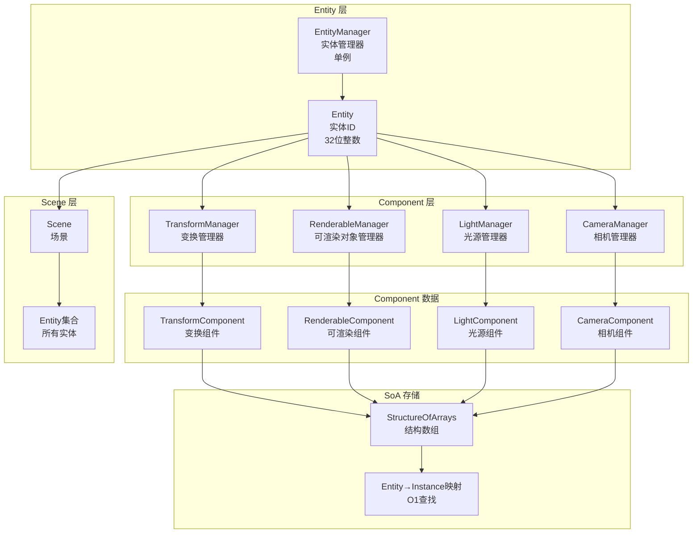

### 架构层次

```
┌─────────────────────────────────────────────────────────────┐
│                    EntityManager (单例)                       │
│  - 创建/销毁 Entity                                           │
│  - 管理 Entity 生命周期                                        │
│  - 支持最多 2^17 - 1 个 Entity                                │
└──────────────────────┬──────────────────────────────────────┘
                       │
        ┌──────────────┼──────────────┐
        │              │              │
        ▼              ▼              ▼
┌──────────────┐ ┌──────────────┐ ┌──────────────┐
│ Transform    │ │ Renderable   │ │ Camera       │
│ Manager      │ │ Manager      │ │ Manager      │
│              │ │              │ │              │
│ - Transform  │ │ - Renderable │ │ - Camera     │
│   Component │ │   Component │ │   Component  │
└──────────────┘ └──────────────┘ └──────────────┘
        │              │              │
        └──────────────┼──────────────┘
                       │
        ┌──────────────▼──────────────┐
        │      Scene (场景)             │
        │  - 包含所有 Entity            │
        │  - 管理 Entity 集合           │
        └──────────────────────────────┘
```

---

## Entity（实体）系统

### Entity 定义

**位置**：`libs/utils/include/utils/Entity.h`

```cpp
class Entity {
public:
    Entity() noexcept;  // 默认构造，创建空实体
    
    bool operator==(Entity e) const;
    bool operator!=(Entity e) const;
    bool operator<(Entity e) const;  // 可排序
    
    bool isNull() const noexcept;     // 检查是否为空
    uint32_t getId() const noexcept;  // 获取 ID
    
private:
    using Type = uint32_t;
    Type mIdentity = 0;  // 32位标识符
};
```

### Entity ID 编码

Entity 的 `mIdentity` 是一个 32 位整数，编码了以下信息：

```
┌─────────────────────────────────────────────────────────┐
│  32位 Entity ID                                         │
├──────────────────┬──────────────────────────────────────┤
│ Generation (15位)│ Index (17位)                         │
│                  │                                      │
│ 用于检测 Entity  │ 数组索引，最多支持 2^17 - 1 个 Entity │
│ 是否已被销毁     │                                      │
└──────────────────┴──────────────────────────────────────┘
```

**编码方式**：

```cpp
// EntityManager.h
static constexpr const int GENERATION_SHIFT = 17;
static constexpr const size_t RAW_INDEX_COUNT = (1 << GENERATION_SHIFT);  // 131072

static inline Entity::Type getGeneration(Entity e) noexcept {
    return e.getId() >> GENERATION_SHIFT;  // 高15位：Generation
}

static inline Entity::Type getIndex(Entity e) noexcept {
    return e.getId() & INDEX_MASK;  // 低17位：Index
}

static inline Entity::Type makeIdentity(Entity::Type g, Entity::Type i) noexcept {
    return (g << GENERATION_SHIFT) | (i & INDEX_MASK);
}
```

**为什么需要 Generation？**

- 当 Entity 被销毁后，其 Index 可以被重用
- Generation 递增，用于检测 Entity 是否有效
- 防止使用已销毁的 Entity

**示例**：

```cpp
// Entity 1: Index=1, Generation=0 → ID = 0x00000001
Entity e1 = EntityManager::get().create();
// e1.getId() = 0x00000001

// 销毁 Entity 1
EntityManager::get().destroy(e1);
// Generation[1] 从 0 变为 1

// 重用 Index 1，创建新 Entity
Entity e2 = EntityManager::get().create();
// e2.getId() = 0x00020001 (Index=1, Generation=1)

// 检查有效性
if (EntityManager::get().isAlive(e1)) {
    // false，因为 Generation 不匹配
}
if (EntityManager::get().isAlive(e2)) {
    // true，Generation 匹配
}
```

### EntityManager

**位置**：`libs/utils/include/utils/EntityManager.h`

**职责**：
- 创建和销毁 Entity
- 跟踪 Entity 的生命周期
- 检测 Entity 是否有效（isAlive）

**关键方法**：

```cpp
class EntityManager {
public:
    // 单例模式
    static EntityManager& get() noexcept;
    
    // 创建 Entity
    Entity create() {
        Entity e;
        create(1, &e);
        return e;
    }
    
    // 批量创建 Entity
    void create(size_t n, Entity* entities);
    
    // 销毁 Entity
    void destroy(Entity e) noexcept {
        destroy(1, &e);
    }
    
    // 批量销毁 Entity
    void destroy(size_t n, Entity* entities) noexcept;
    
    // 检查 Entity 是否有效
    bool isAlive(Entity e) const noexcept {
        return (!e.isNull()) && 
               (getGeneration(e) == mGens[getIndex(e)]);
    }
    
    // 获取最大 Entity 数量
    static size_t getMaxEntityCount() noexcept {
        return RAW_INDEX_COUNT - 1;  // 2^17 - 1 = 131071
    }
    
private:
    uint8_t* const mGens;  // Generation 数组（131072字节）
};
```

**Entity 创建流程**：

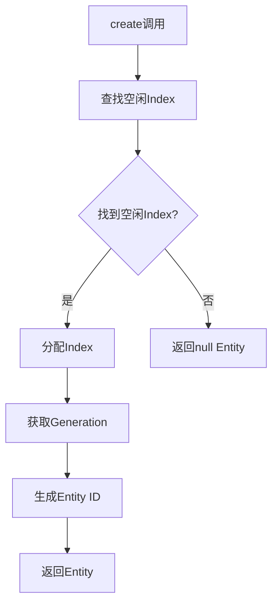

**Entity 销毁流程**：

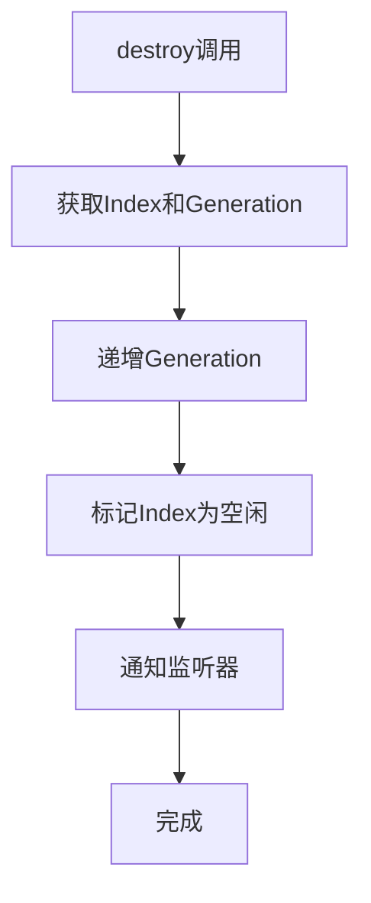

---

## Component（组件）系统

### Component 概念

在 Filament 中，Component 不是独立的类，而是通过 **Component Manager** 管理的**数据集合**。

### Filament 中的组件类型

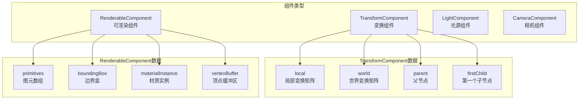

### 组件类型详解

#### 1. Transform Component

**数据**：
- `local`：局部变换矩阵（相对于父节点）
- `world`：世界变换矩阵（相对于根节点）
- `parent`：父节点 Instance
- `firstChild`：第一个子节点 Instance
- `next`：下一个兄弟节点 Instance
- `prev`：上一个兄弟节点 Instance

#### 2. Renderable Component

**数据**：
- `primitives`：图元数组（每个图元有自己的几何和材质）
- `boundingBox`：边界盒（用于视锥剔除）
- `materialInstance`：材质实例数组
- `vertexBuffer`：顶点缓冲区数组
- `indexBuffer`：索引缓冲区数组
- `flags`：渲染标志（阴影、剔除等）

#### 3. Light Component

**数据**：
- `type`：光源类型（方向光、点光源、聚光灯）
- `color`：颜色
- `intensity`：强度
- `position`：位置（点光源、聚光灯）
- `direction`：方向（方向光、聚光灯）
- `falloff`：衰减范围

#### 4. Camera Component

**数据**：
- `camera`：Camera 对象指针
- `ownsTransformComponent`：是否拥有 Transform 组件

---

## Component Manager（组件管理器）

### Component Manager 架构

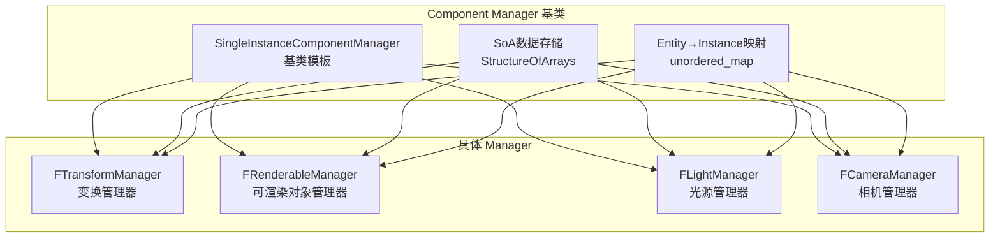

### SingleInstanceComponentManager

**位置**：`libs/utils/include/utils/SingleInstanceComponentManager.h`

这是所有 Component Manager 的**基类模板**，提供了组件管理的基础功能。

**模板定义**：

```cpp
template <typename ... Elements>
class SingleInstanceComponentManager {
public:
    using SoA = StructureOfArrays<Elements ..., Entity>;
    using Instance = EntityInstanceBase::Type;
    
private:
    SoA mData;  // SoA 数据存储
    std::unordered_map<Entity, Instance> mInstanceMap;  // Entity → Instance 映射
    
public:
    // 检查 Entity 是否有此组件
    bool hasComponent(Entity e) const noexcept {
        return mInstanceMap.find(e) != mInstanceMap.end();
    }
    
    // 获取组件实例
    Instance getInstance(Entity e) const noexcept {
        auto it = mInstanceMap.find(e);
        return (it != mInstanceMap.end()) ? it->second : Instance{0};
    }
    
    // 创建组件
    Instance addComponent(Entity e) {
        Instance instance = mData.size();
        mData.push_back(Structure{});  // 添加一行数据
        mInstanceMap[e] = instance;
        return instance;
    }
    
    // 移除组件
    Instance removeComponent(Entity e) {
        Instance instance = getInstance(e);
        if (instance) {
            // 移除映射
            mInstanceMap.erase(e);
            
            // 如果移除的不是最后一个，需要交换
            Instance last = mData.size() - 1;
            if (instance != last) {
                // 交换最后一个元素到当前位置
                mData[instance] = mData[last];
                
                // 更新被移动元素的映射
                Entity movedEntity = mData[instance].entity;
                mInstanceMap[movedEntity] = instance;
            }
            
            // 移除最后一个元素
            mData.pop_back();
        }
        return instance;
    }
    
    // 获取数据切片
    template<size_t N>
    Slice<const TypeAt<N>> slice() const noexcept {
        return mData.template data<N>();
    }
};
```

### Instance（实例）

**Instance** 是组件数组的索引，用于访问组件数据。

```cpp
template<typename Manager>
class EntityInstance {
public:
    using Type = uint32_t;
    
    Type mValue = 0;  // 组件数组索引（0表示无效）
    
    bool isValid() const noexcept {
        return mValue != 0;
    }
    
    operator bool() const noexcept {
        return isValid();
    }
};
```

**Entity → Instance 映射**：

```
Entity (32位ID)
    ↓ getInstance()
Instance (组件数组索引)
    ↓ mManager[instance]
Component Data (组件数据)
```

---

## SoA 数据布局

### AoS vs SoA

**AoS (Array of Structures) - 传统方式**：

```
┌─────────┬─────────┬─────────┐
│ Entity1 │ Entity2 │ Entity3 │
├─────────┼─────────┼─────────┤
│ Transform│Transform│Transform│
│ Renderable│Renderable│Renderable│
│ ...     │ ...     │ ...     │
└─────────┴─────────┴─────────┘

问题：
- 缓存不友好（不同类型数据混合）
- 难以批量处理
- 内存对齐浪费
```

**SoA (Structure of Arrays) - Filament 方式**：

```
┌─────────────┬─────────────┬─────────────┐
│ Transform[] │ Renderable[]│ Camera[]    │
├─────────────┼─────────────┼─────────────┤
│ Entity1     │ Entity1     │ Entity1     │
│ Entity2     │ Entity2     │ Entity2     │
│ Entity3     │ Entity3     │ Entity3     │
└─────────────┴─────────────┴─────────────┘

优势：
- 缓存友好（相同类型数据连续）
- 支持SIMD批量处理
- 内存对齐高效
```

### SoA 详细说明

**StructureOfArrays** 是 Filament 的核心数据结构，用于高效存储组件数据。

**定义**：

```cpp
template<typename... Types>
class StructureOfArrays {
private:
    // 每个类型一个数组
    std::tuple<std::vector<Types>...> mArrays;
    
public:
    // 获取第 N 个数组
    template<size_t N>
    std::vector<TypeAt<N>>& data() noexcept {
        return std::get<N>(mArrays);
    }
    
    // 添加一行数据（所有数组同时添加）
    void push_back(const Structure& s) {
        // 使用折叠表达式展开
        (std::get<Indices>(mArrays).push_back(s.template get<Indices>()), ...);
    }
    
    // 访问第 i 行的数据
    Structure operator[](size_t i) const {
        return Structure{
            std::get<Indices>(mArrays)[i]...
        };
    }
};
```

### TransformManager 的 SoA 布局

```cpp
// TransformManager 的 SoA 布局
using SoA = StructureOfArrays<
    mat4f,      // LOCAL（局部变换矩阵）
    mat4f,      // WORLD（世界变换矩阵）
    float3,     // localTranslationLo（高精度平移低位）
    float3,     // worldTranslationLo（高精度平移低位）
    Instance,   // PARENT（父节点 Instance）
    Instance,   // FIRST_CHILD（第一个子节点 Instance）
    Instance,   // NEXT（下一个兄弟节点 Instance）
    Instance,   // PREV（上一个兄弟节点 Instance）
    Entity      // ENTITY（Entity ID）
>;
```

**内存布局示例**：

```
SoA {
    // 数组 0: LOCAL（局部变换矩阵）
    mat4f[] local = [
        mat4f(...),  // instance 1 的局部变换
        mat4f(...),  // instance 2 的局部变换
        mat4f(...),  // instance 3 的局部变换
    ];
    
    // 数组 1: WORLD（世界变换矩阵）
    mat4f[] world = [
        mat4f(...),  // instance 1 的世界变换
        mat4f(...),  // instance 2 的世界变换
        mat4f(...),  // instance 3 的世界变换
    ];
    
    // 数组 2: PARENT（父节点 Instance）
    Instance[] parent = [
        0,    // instance 1 的父节点（无）
        1,    // instance 2 的父节点（instance 1）
        1,    // instance 3 的父节点（instance 1）
    ];
    
    // 数组 3: FIRST_CHILD（第一个子节点 Instance）
    Instance[] firstChild = [
        2,    // instance 1 的第一个子节点（instance 2）
        0,    // instance 2 无子节点
        0,    // instance 3 无子节点
    ];
    
    // ... 其他数组
}
```

### RenderableManager 的 SoA 布局

```cpp
// RenderableManager 的 SoA 布局
using SoA = StructureOfArrays<
    Box,                    // BOUNDING_BOX（边界盒）
    uint8_t,                // LAYER（层掩码）
    uint8_t,                // PRIORITY（优先级）
    uint8_t,                // CHANNELS（通道掩码）
    uint8_t,                // BLEND_ORDER（混合顺序）
    uint8_t,                // PRIMITIVE_COUNT（图元数量）
    uint16_t,               // RESERVED（保留字段）
    MaterialInstance*,       // MATERIAL_INSTANCE（材质实例数组）
    VertexBuffer*,          // VERTEX_BUFFER（顶点缓冲区数组）
    IndexBuffer*,           // INDEX_BUFFER（索引缓冲区数组）
    // ... 其他字段
    Entity                  // ENTITY（Entity ID）
>;
```

### SoA 的优势

#### 1. 缓存友好

```cpp
// 批量处理所有世界变换矩阵
const mat4f* worldTransforms = tcm.getWorldTransforms().data();
for (size_t i = 0; i < count; ++i) {
    // 连续内存访问，缓存命中率高
    processTransform(worldTransforms[i]);
}
```

#### 2. SIMD 优化

```cpp
// 可以批量处理相同类型的数据
#include <immintrin.h>

// 批量计算变换（使用AVX）
for (size_t i = 0; i < count; i += 8) {
    __m256 x = _mm256_load_ps(&transforms[i].x);
    __m256 y = _mm256_load_ps(&transforms[i].y);
    // ... SIMD 计算
}
```

#### 3. 内存对齐

```cpp
// 每个数组可以独立对齐
alignas(16) mat4f worldTransforms[];  // 16字节对齐
alignas(4) uint32_t flags[];          // 4字节对齐
```

---

## 组件管理器详解

### 1. TransformManager（变换管理器）

**位置**：
- 公共接口：`filament/include/filament/TransformManager.h`
- 实现：`filament/src/components/TransformManager.h/cpp`

**职责**：
- 管理实体的**变换组件**（位置、旋转、缩放）
- 提供变换矩阵的**设置和查询**接口
- 支持**父子关系**（Hierarchy）
- 计算**世界变换矩阵**

**关键方法**：

```cpp
class TransformManager {
public:
    using Instance = utils::EntityInstance<TransformManager>;
    
    // 创建组件
    Instance create(Entity entity);
    Instance create(Entity entity, Instance parent, mat4f const& localTransform);
    
    // 设置变换
    void setTransform(Instance instance, mat4f const& transform);
    void setTransform(Instance instance, float3 const& translation, 
                      quatf const& rotation, float3 const& scale);
    
    // 查询变换
    mat4f const& getTransform(Instance instance) const;
    mat4f getWorldTransform(Instance instance) const;
    
    // 父子关系
    void setParent(Instance instance, Instance parent);
    Instance getParent(Instance instance) const;
    
    // 批量获取
    utils::Slice<const mat4f> getWorldTransforms() const;
};
```

**变换矩阵计算**：

```
世界变换 = 父变换 × 本地变换

WorldTransform = ParentTransform × LocalTransform
```

**层次结构**：

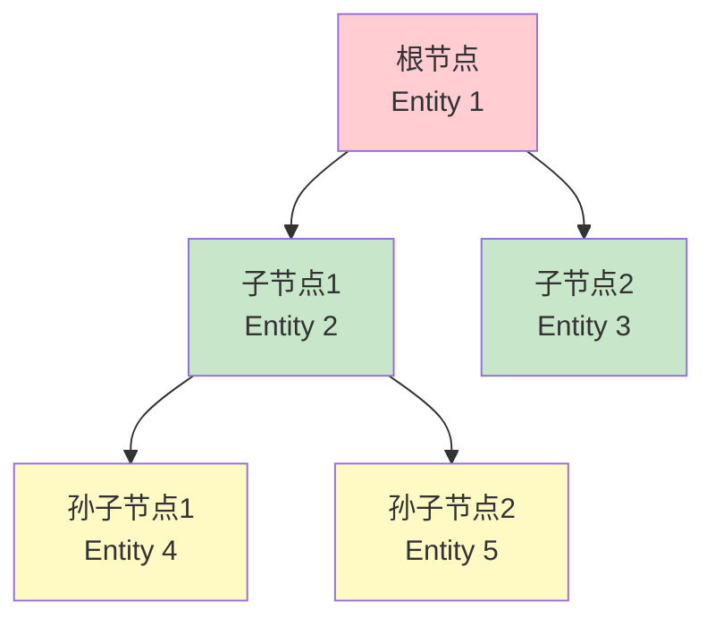

**世界变换计算流程**：

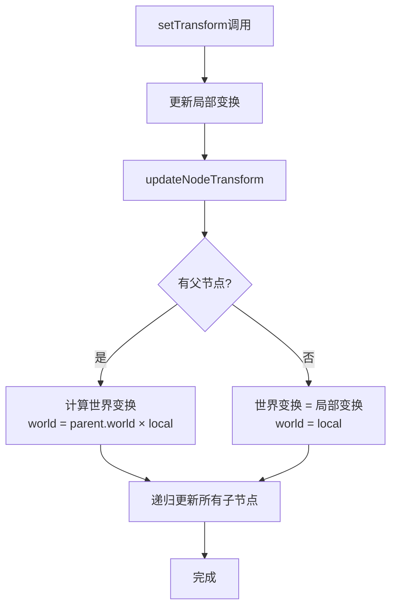

**实现代码**：

```cpp
void FTransformManager::updateNodeTransform(Instance const i) noexcept {
    auto& manager = mManager;
    
    // 1. 获取父节点
    Instance const parent = manager[i].parent;
    
    // 2. 计算世界变换
    if (parent) {
        // 有父节点：世界变换 = 父世界变换 × 局部变换
        computeWorldTransform(
            manager[i].world,
            manager[i].worldTranslationLo,
            manager[parent].world,      // 父世界变换
            manager[i].local,           // 局部变换
            manager[parent].worldTranslationLo,
            manager[i].localTranslationLo
        );
    } else {
        // 无父节点：世界变换 = 局部变换
        manager[i].world = manager[i].local;
        manager[i].worldTranslationLo = manager[i].localTranslationLo;
    }
    
    // 3. 递归更新所有子节点
    Instance child = manager[i].firstChild;
    while (child) {
        updateNodeTransform(child);
        child = manager[child].next;
    }
}
```

### 2. RenderableManager（可渲染对象管理器）

**位置**：
- 公共接口：`filament/include/filament/RenderableManager.h`
- 实现：`filament/src/components/RenderableManager.h/cpp`

**职责**：
- 管理实体的**可渲染组件**
- 配置**几何数据**（VertexBuffer、IndexBuffer）
- 配置**材质实例**（MaterialInstance）
- 管理**渲染选项**（剔除、阴影等）

**关键方法**：

```cpp
class RenderableManager {
public:
    using Instance = utils::EntityInstance<RenderableManager>;
    
    // 创建组件（Builder模式）
    class Builder {
    public:
        Builder& geometry(uint8_t index, PrimitiveType type,
                         VertexBuffer* vertices, IndexBuffer* indices,
                         uint32_t offset, uint32_t count);
        Builder& material(uint8_t index, MaterialInstance* materialInstance);
        Builder& boundingBox(Box const& aabb);
        Builder& culling(bool enabled);
        Builder& castShadows(bool enabled);
        Builder& receiveShadows(bool enabled);
        Instance build(Engine& engine, Entity entity);
    };
    
    // 查询
    MaterialInstance* getMaterialInstanceAt(Instance instance, 
                                             uint8_t primitiveIndex) const;
    Box getAxisAlignedBoundingBox(Instance instance) const;
};
```

**Renderable 结构**：

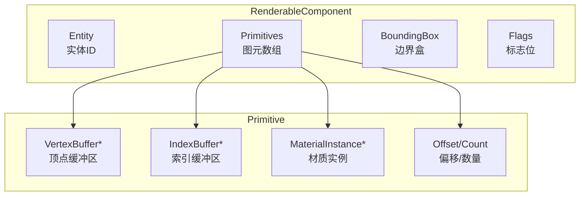

**使用示例**：

```cpp
// 创建可渲染对象
Entity renderable = EntityManager::get().create();

RenderableManager::Builder(1)  // 1个图元
    .boundingBox({{ -1, -1, -1 }, { 1, 1, 1 }})
    .geometry(0, 
        RenderableManager::PrimitiveType::TRIANGLES,
        vertexBuffer,
        indexBuffer,
        0,      // 索引起始位置
        3       // 索引数量
    )
    .material(0, materialInstance)
    .culling(false)
    .castShadows(false)
    .receiveShadows(false)
    .build(*engine, renderable);

scene->addEntity(renderable);
```

### 3. LightManager（光源管理器）

**位置**：
- 公共接口：`filament/include/filament/LightManager.h`
- 实现：`filament/src/components/LightManager.h/cpp`

**职责**：
- 管理场景中的**光源**
- 支持多种光源类型（方向光、点光源、聚光灯）
- 管理光源参数（颜色、强度、范围等）

**关键方法**：

```cpp
class LightManager {
public:
    enum class Type {
        SUN,           // 方向光（太阳光）
        DIRECTIONAL,   // 方向光
        POINT,         // 点光源
        FOCUSED_SPOT,  // 聚光灯
        SPOT           // 聚光灯
    };
    
    using Instance = utils::EntityInstance<LightManager>;
    
    // 创建组件（Builder模式）
    class Builder {
    public:
        Builder& type(Type type);
        Builder& color(float3 const& linearColor);
        Builder& intensity(float intensity);
        Builder& direction(float3 const& direction);
        Builder& position(float3 const& position);
        Builder& falloff(float radius);
        Builder& spotLightCone(float inner, float outer);
        Instance build(Engine& engine, Entity entity);
    };
    
    // 查询
    Type getType(Instance instance) const;
    float3 getColor(Instance instance) const;
    float getIntensity(Instance instance) const;
};
```

**光源类型**：

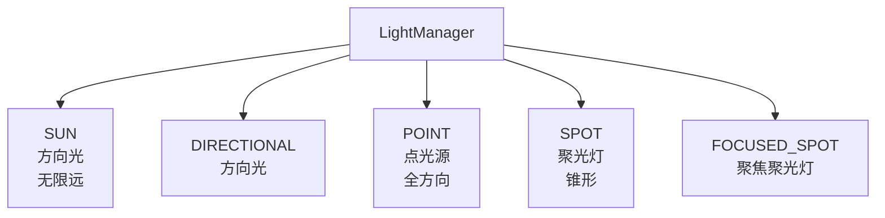

### 4. CameraManager（相机管理器）

**位置**：
- 公共接口：`filament/include/filament/Camera.h`（Camera类）
- 实现：`filament/src/components/CameraManager.h/cpp`

**职责**：
- 管理**相机组件**
- 自动创建 Transform 组件（如果不存在）
- 管理相机参数

**关键方法**：

```cpp
class CameraManager {
public:
    using Instance = utils::EntityInstance<CameraManager>;
    
    // 创建相机（通过Engine）
    Camera* createCamera(Entity entity);
    
    // 获取相机
    Camera* getCamera(Instance instance) const;
    
    // 检查是否拥有Transform组件
    bool ownsTransformComponent(Instance instance) const;
};
```

---

## 层次结构管理

### 父子关系

TransformManager 支持**层次结构**（Hierarchy），允许 Entity 之间有父子关系。

**数据结构**：

```cpp
struct TransformComponent {
    mat4f local;           // 局部变换
    mat4f world;           // 世界变换
    Instance parent;       // 父节点
    Instance firstChild;   // 第一个子节点
    Instance next;         // 下一个兄弟节点
    Instance prev;         // 上一个兄弟节点
};
```

**层次结构图**：

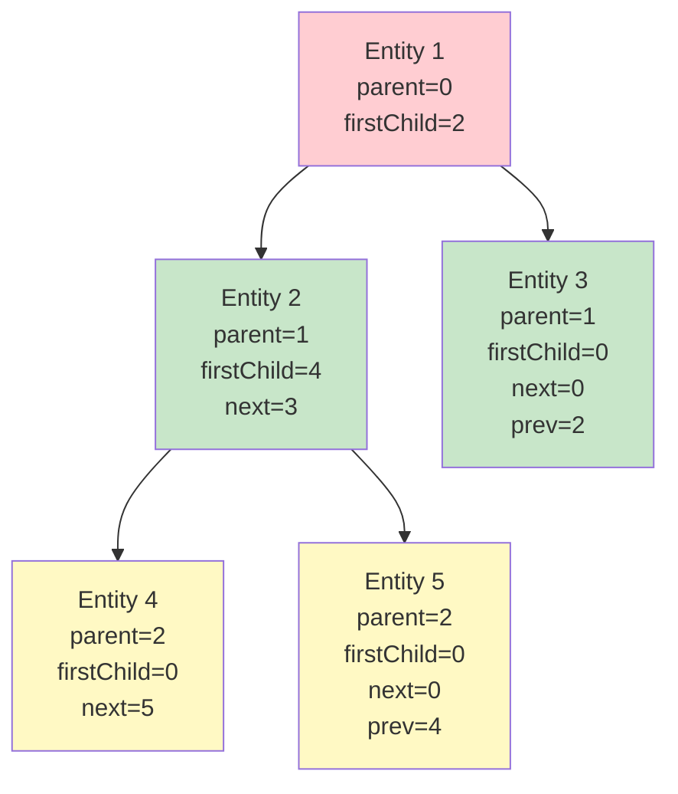

**设置父子关系**：

```cpp
void FTransformManager::setParent(Instance i, Instance newParent) noexcept {
    // 1. 从旧父节点移除
    removeNode(i);
    
    // 2. 设置新父节点
    mManager[i].parent = newParent;
    
    // 3. 添加到新父节点的子节点列表
    if (newParent) {
        Instance firstChild = mManager[newParent].firstChild;
        mManager[newParent].firstChild = i;
        mManager[i].next = firstChild;
        if (firstChild) {
            mManager[firstChild].prev = i;
        }
    }
    
    // 4. 更新世界变换
    updateNodeTransform(i);
}
```

**遍历子节点**：

```cpp
// 遍历所有子节点
Instance child = mManager[instance].firstChild;
while (child) {
    // 处理子节点
    processChild(child);
    
    // 移动到下一个兄弟节点
    child = mManager[child].next;
}
```

---

## 生命周期管理

### Entity 生命周期

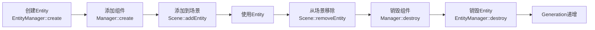

### 组件创建

```cpp
// 1. 创建 Entity
Entity entity = EntityManager::get().create();

// 2. 添加 Transform 组件
TransformManager& tcm = engine->getTransformManager();
TransformManager::Instance transformInstance = tcm.create(entity);

// 3. 添加 Renderable 组件
RenderableManager& rcm = engine->getRenderableManager();
RenderableManager::Builder(1)
    .geometry(...)
    .material(...)
    .build(*engine, entity);

// 4. 添加到场景
scene->addEntity(entity);
```

### 组件销毁

```cpp
// 1. 从场景移除
scene->removeEntity(entity);

// 2. 销毁组件（可选，GC会自动清理）
tcm.destroy(entity);
rcm.destroy(entity);

// 3. 销毁 Entity
EntityManager::get().destroy(entity);
// 此时 Entity 的 Generation 会递增
```

### 垃圾回收（GC）

**Component Manager 的 GC**：

```cpp
void FTransformManager::gc(EntityManager& em) noexcept {
    mManager.gc(em, [this](Entity e) {
        destroy(e);  // 清理组件
    });
}
```

**GC 流程**：

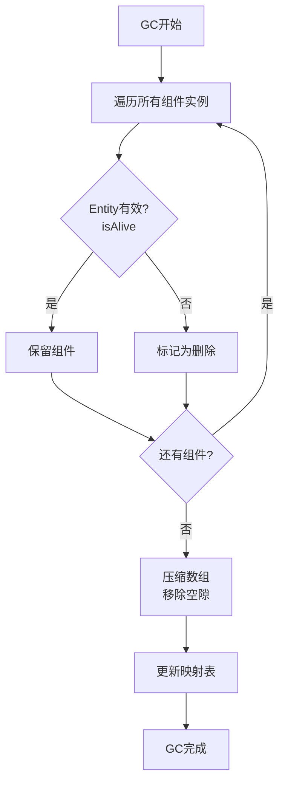

**GC 实现**：

```cpp
template<typename... Elements>
void SingleInstanceComponentManager::gc(EntityManager& em, 
                                        std::function<void(Entity)> destroy) {
    // 1. 遍历所有组件实例
    size_t writeIndex = 1;  // 跳过索引0（保留）
    for (size_t readIndex = 1; readIndex < mData.size(); readIndex++) {
        Entity e = mData[readIndex].entity;
        
        // 2. 检查 Entity 是否有效
        if (em.isAlive(e)) {
            // 3. 有效：保留组件（可能需要移动）
            if (writeIndex != readIndex) {
                mData[writeIndex] = mData[readIndex];
                mInstanceMap[e] = Instance(writeIndex);
            }
            writeIndex++;
        } else {
            // 4. 无效：调用销毁回调
            destroy(e);
            mInstanceMap.erase(e);
        }
    }
    
    // 5. 压缩数组（移除无效元素）
    mData.resize(writeIndex);
}
```

---

## 性能优化

### 1. SoA 布局优化

**缓存友好**：
- 相同类型的数据连续存储
- 提高缓存命中率
- 减少缓存未命中

**SIMD 优化**：
- 可以批量处理相同类型的数据
- 利用 SIMD 指令加速计算

**内存对齐**：
- 每个数组可以独立对齐
- 提高访问效率

### 2. 批量操作

**批量创建 Entity**：

```cpp
// 批量创建 Entity（更高效）
Entity entities[100];
EntityManager::get().create(100, entities);

// 批量添加组件
for (size_t i = 0; i < 100; ++i) {
    transformManager.create(entities[i]);
}
```

**批量更新变换**：

```cpp
// 使用事务批量更新（避免重复计算）
transformManager.openLocalTransformTransaction();
for (auto entity : entities) {
    transformManager.setTransform(instance, transform);
}
transformManager.commitLocalTransformTransaction();
// 只计算一次世界变换
```

### 3. 组件查询优化

**使用 hasComponent() 检查**：

```cpp
// 检查 Entity 是否有组件（O(1) 查找）
if (renderableManager.hasComponent(entity)) {
    // 处理 Renderable
}
```

**缓存 Instance**：

```cpp
// 避免重复查找
auto instance = renderableManager.getInstance(entity);
if (instance) {
    // 使用 instance 多次访问组件数据
    auto& box = renderableManager.getAxisAlignedBoundingBox(instance);
    auto* mat = renderableManager.getMaterialInstanceAt(instance, 0);
}
```

### 4. 内存管理优化

**预分配容量**：

```cpp
// 预分配 SoA 容量，减少重新分配
mData.reserve(expectedCount);
```

**及时 GC**：

```cpp
// 定期调用 GC，清理无效组件
transformManager.gc(EntityManager::get());
```

---

## 完整示例

### 创建完整的渲染对象

```cpp
// 1. 创建 Entity
Entity entity = EntityManager::get().create();

// 2. 创建 Transform 组件
auto& tcm = engine->getTransformManager();
tcm.create(entity);
auto transformInstance = tcm.getInstance(entity);
tcm.setTransform(transformInstance, 
    mat4f::translation({0, 0, -5}));

// 3. 创建 Renderable 组件
auto& rcm = engine->getRenderableManager();
RenderableManager::Builder(1)
    .boundingBox({{ -1, -1, -1 }, { 1, 1, 1 }})
    .geometry(0, 
        RenderableManager::PrimitiveType::TRIANGLES,
        vertexBuffer,
        indexBuffer,
        0, 3
    )
    .material(0, materialInstance)
    .build(*engine, entity);

// 4. 添加到场景
scene->addEntity(entity);
```

### 层次结构示例

```cpp
// 创建根节点
Entity root = EntityManager::get().create();
auto& tcm = engine->getTransformManager();
auto rootInstance = tcm.create(root);
tcm.setTransform(rootInstance, mat4f::translation({0, 0, 0}));

// 创建子节点
Entity child = EntityManager::get().create();
auto childInstance = tcm.create(child, rootInstance, 
    mat4f::translation({1, 0, 0}));

// 创建孙子节点
Entity grandchild = EntityManager::get().create();
auto grandchildInstance = tcm.create(grandchild, childInstance,
    mat4f::translation({0, 1, 0}));

// 层次结构：
// root (0, 0, 0)
//   └─ child (1, 0, 0)  [相对于root]
//       └─ grandchild (1, 1, 0)  [相对于child，世界坐标]
```

---

## 总结

### Filament ECS 架构特点

1. **轻量级 Entity**
   - Entity 只是一个 ID（32位整数）
   - 不包含任何数据
   - 支持最多 131,071 个 Entity

2. **SoA 数据布局**
   - 组件数据存储在 Structure of Arrays 中
   - 提高缓存命中率
   - 支持批量处理

3. **Component Manager**
   - 每个组件类型有自己的 Manager
   - Manager 管理组件的创建、查询、更新
   - 使用 Instance 作为组件数组索引

4. **高效查询**
   - Entity → Instance 映射（O(1)）
   - 批量获取组件数据
   - 支持迭代所有组件

5. **自动生命周期管理**
   - GC 机制自动清理无效组件
   - Entity 销毁时自动清理组件

### 关键设计模式

- **单例模式**：EntityManager 是单例
- **模板特化**：Component Manager 使用模板
- **SoA 布局**：提高性能
- **Instance 模式**：组件数组索引

### 性能优势

- **缓存友好**：SoA 布局提高缓存命中率
- **批量处理**：可以批量处理相同类型的数据
- **内存效率**：只存储需要的数据
- **查询高效**：O(1) 的 Entity → Instance 映射

### 关键文件

| 文件 | 说明 |
|------|------|
| `libs/utils/include/utils/Entity.h` | Entity 定义 |
| `libs/utils/include/utils/EntityManager.h` | EntityManager 实现 |
| `libs/utils/include/utils/SingleInstanceComponentManager.h` | Component Manager 基类 |
| `filament/include/filament/TransformManager.h` | TransformManager 接口 |
| `filament/src/components/TransformManager.h/cpp` | TransformManager 实现 |
| `filament/include/filament/RenderableManager.h` | RenderableManager 接口 |
| `filament/src/components/RenderableManager.h/cpp` | RenderableManager 实现 |

---

**文档版本**：1.0  
**最后更新**：2024年  
**作者**：Filament学习文档

