# Filament Froxel 架构设计分析

## 目录
1. [概述](#概述)
2. [Froxel 基本概念](#froxel-基本概念)
3. [Froxelizer 架构设计](#froxelizer-架构设计)
4. [核心数据结构](#核心数据结构)
5. [Froxelization 流程](#froxelization-流程)
6. [空间划分算法](#空间划分算法)
7. [光源分配算法](#光源分配算法)
8. [GPU 数据组织](#gpu-数据组织)
9. [着色器使用](#着色器使用)
10. [性能优化策略](#性能优化策略)
11. [内存管理](#内存管理)

---

## 概述

**Froxel**（Frustum Voxel）是 Filament 中用于高效光照计算的核心数据结构。它将视锥体空间划分为 3D 网格（体素），每个 Froxel 包含影响该区域的光源列表，从而在着色器中实现 O(1) 复杂度的光源查询。

### 核心特点

- **空间划分**：将视锥体划分为 3D 网格（通常 16×16×16 或 32×32×16）
- **高效查询**：着色器通过像素位置直接索引到对应的 Froxel，快速获取光源列表
- **动态分配**：每帧根据相机和视口动态计算 Froxel 网格
- **压缩存储**：使用位集和压缩算法减少内存占用
- **多线程处理**：支持并行光源分配

### 解决的问题

传统的光照计算需要遍历所有光源，时间复杂度为 O(N)。Froxel 系统通过空间划分，将复杂度降低到 O(1)（查询）+ O(K)（K 为影响该像素的光源数量，通常远小于 N）。

---

## Froxel 基本概念

### 什么是 Froxel

Froxel 是视锥体（Frustum）中的一个体素（Voxel）单元，类似于 3D 空间中的像素。每个 Froxel 代表视锥体中的一个 3D 区域，包含影响该区域的所有光源索引。

### Froxel 网格结构

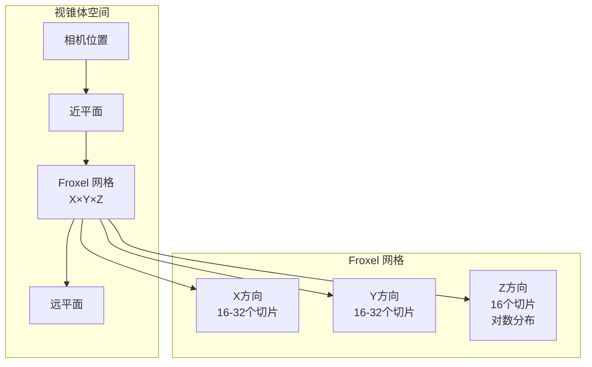

### Froxel 的边界

每个 Froxel 由 6 个平面定义：

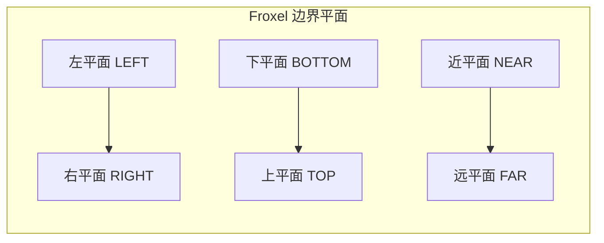

---

## Froxelizer 架构设计

### 类层次结构

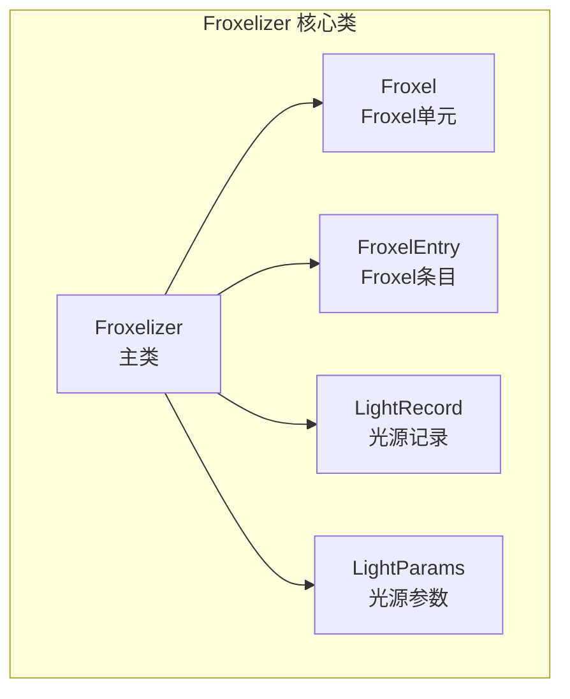

### Froxelizer 在渲染管线中的位置

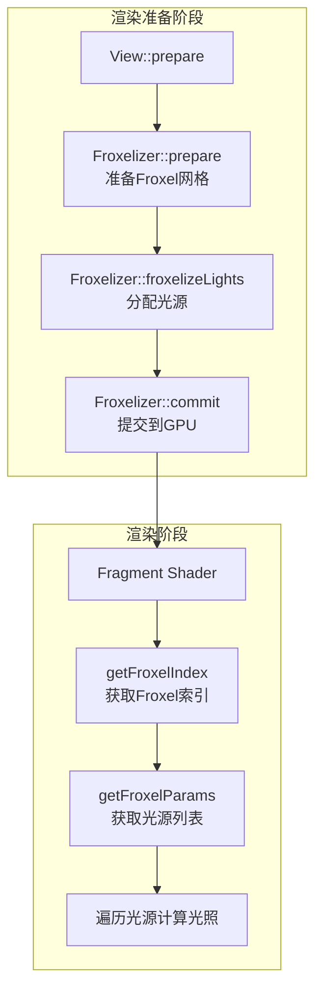

### 核心接口

```cpp
class Froxelizer {
public:
    // 设置选项（光源近远平面）
    void setOptions(float zLightNear, float zLightFar);
    
    // 准备 Froxelization（分配缓冲区）
    bool prepare(DriverApi& driverApi, RootArenaScope& rootArenaScope,
                 Viewport const& viewport,
                 const mat4f& projection, float projectionNear, float projectionFar,
                 float4 const& clipTransform);
    
    // Froxelize 光源（分配光源到 Froxel）
    void froxelizeLights(FEngine& engine, mat4f const& viewMatrix,
                         const FScene::LightSoA& lightData);
    
    // 提交数据到 GPU
    void commit(DriverApi& driverApi);
    
    // 更新 Uniform 数据
    void updateUniforms(PerViewUib& s);
    
    // 获取缓冲区句柄
    Handle<HwBufferObject> getRecordBuffer() const;
    Handle<HwBufferObject> getFroxelBuffer() const;
};
```

---

## 核心数据结构

### Froxel 类

```cpp
class Froxel {
public:
    enum Planes {
        LEFT,    // 左平面
        RIGHT,   // 右平面
        BOTTOM,  // 下平面
        TOP,     // 上平面
        NEAR,    // 近平面
        FAR      // 远平面
    };
    
    // 6 个边界平面（每个平面用 float4 表示：法向量 xyz + 距离 w）
    math::float4 planes[6];
};
```

### FroxelEntry 结构

```cpp
struct FroxelEntry {
    // 构造函数：打包 offset（16位）和 count（8位）到 32 位整数
    FroxelEntry(uint16_t offset, uint8_t count) noexcept
        : u32((offset << 16) | count) { }
    
    uint8_t count() const noexcept { return u32 & 0xFFu; }
    uint16_t offset() const noexcept { return u32 >> 16u; }
    
    uint32_t u32 = 0;  // 打包的 32 位值
};
```

**内存布局**：
```
+------------------+--------+
| offset (16 bits) | count  |
+------------------+--------+
|   高16位         | 低8位  |
+------------------+--------+
```

### LightRecord 结构

```cpp
struct LightRecord {
    // 位集：每个位代表一个光源（最多 256 个光源）
    using bitset = utils::bitset<uint64_t, (CONFIG_MAX_LIGHT_COUNT + 63) / 64>;
    bitset lights;  // 光源位集
};
```

### LightParams 结构

```cpp
struct LightParams {
    math::float3 position;  // 光源位置（视图空间）
    float cosSqr;           // 聚光灯外角余弦的平方
    math::float3 axis;      // 聚光灯方向轴
    float invSin;           // 1/sin(外角)，点光源为无穷大
    float radius;           // 光源半径
};
```

### 数据流结构

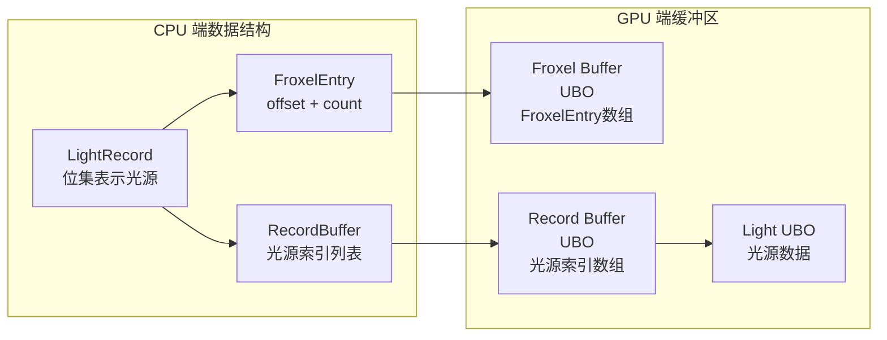

---

## Froxelization 流程

### 完整流程图

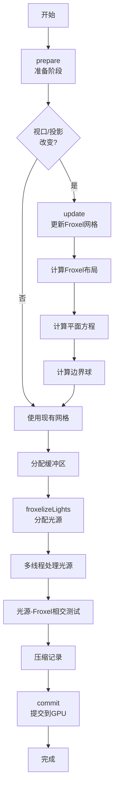

### 准备阶段（prepare）

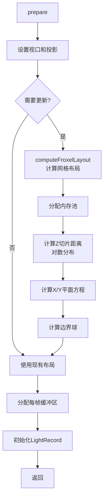

### 光源分配阶段（froxelizeLights）

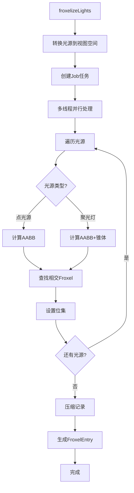

---

## 空间划分算法

### Froxel 网格计算

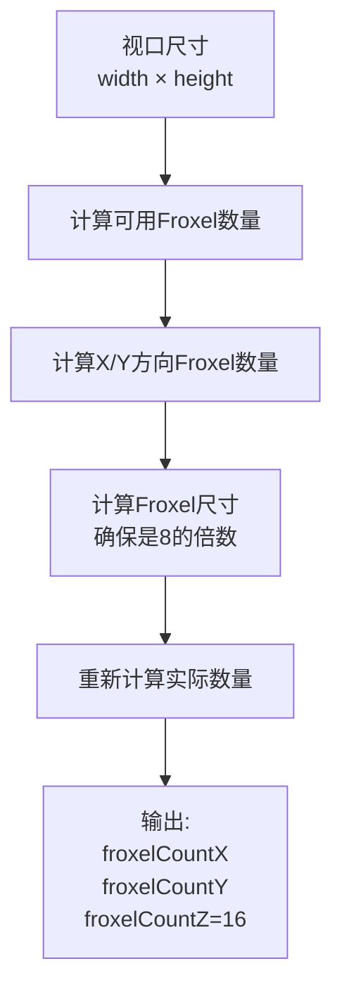

**算法步骤**：

1. **计算可用 Froxel 数量**：
   ```
   froxelPlaneCount = froxelBufferEntryCount / FROXEL_SLICE_COUNT
   ```

2. **计算 X/Y 方向数量**（保持宽高比）：
   ```
   froxelCountX = sqrt(froxelPlaneCount * width / height)
   froxelCountY = sqrt(froxelPlaneCount * height / width)
   ```

3. **计算 Froxel 尺寸**（向上舍入到 8 的倍数）：
   ```
   froxelSizeX = (width + froxelCountX - 1) / froxelCountX
   froxelSizeY = (height + froxelCountY - 1) / froxelCountY
   froxelDimension = roundTo8(max(froxelSizeX, froxelSizeY))
   ```

4. **重新计算实际数量**：
   ```
   froxelCountX = (width + froxelDimension - 1) / froxelDimension
   froxelCountY = (height + froxelDimension - 1) / froxelDimension
   ```

### Z 方向对数分布

Z 方向使用对数分布，在近处提供更高的分辨率：

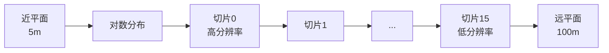

**计算公式**：
```
linearizer = log2(zLightFar / zLightNear) / (froxelCountZ - 1)
z[i] = zLightFar * exp2((i - froxelCountZ) * linearizer)
```

### 平面方程计算

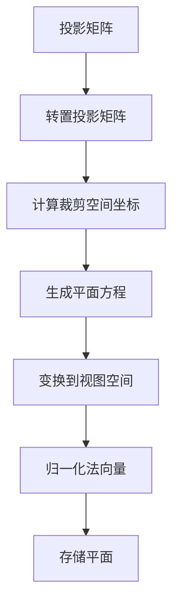

**X 方向平面**：
```cpp
for (i = 0; i <= froxelCountX; i++) {
    float x = (i * froxelWidthInClipSpace) - 1.0f;
    float4 p = transpose(projection) * float4{-1, 0, 0, x};
    planesX[i] = float4{normalize(p.xyz), 0};
}
```

**Y 方向平面**：
```cpp
for (i = 0; i <= froxelCountY; i++) {
    float y = (i * froxelHeightInClipSpace) - 1.0f;
    float4 p = transpose(projection) * float4{0, 1, 0, -y};
    planesY[i] = float4{normalize(p.xyz), 0};
}
```

### 边界球计算

每个 Froxel 的边界球用于聚光灯的快速相交测试：

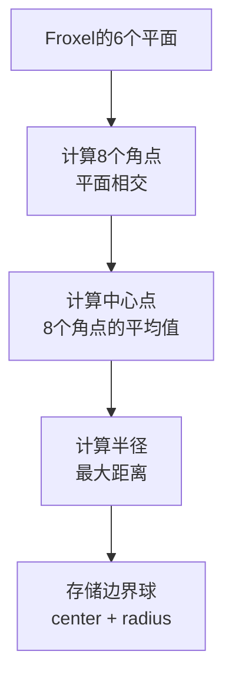

---

## 光源分配算法

### 点光源分配

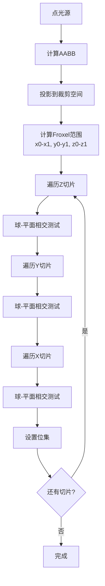

### 聚光灯分配

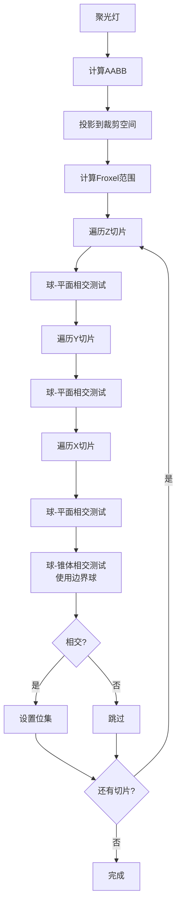

### 相交测试优化

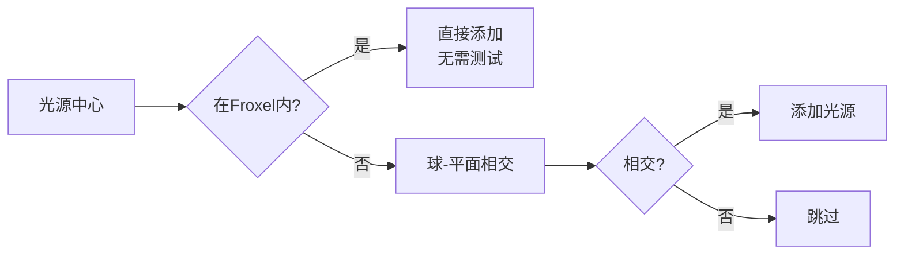

**优化策略**：
- 如果光源中心在 Froxel 内，直接添加（无需相交测试）
- 使用球-平面相交测试快速剔除
- 聚光灯使用球-锥体相交测试（使用边界球）

---

## GPU 数据组织

### 缓冲区结构

```mermaid
graph TB
    subgraph "Froxel Buffer (UBO)"
        A[FroxelEntry[0]<br/>offset:0, count:3]
        B[FroxelEntry[1]<br/>offset:3, count:2]
        C[FroxelEntry[2]<br/>offset:5, count:0]
        D[...]
    end
    
    subgraph "Record Buffer (UBO)"
        E[LightIndex[0]=2]
        F[LightIndex[1]=5]
        G[LightIndex[2]=8]
        H[LightIndex[3]=1]
        I[LightIndex[4]=3]
        J[...]
    end
    
    subgraph "Light UBO"
        K[Light[0]数据]
        L[Light[1]数据]
        M[Light[2]数据]
        N[...]
    end
    
    A --> E
    A --> F
    A --> G
    B --> H
    B --> I
    E --> L
    F --> M
    G --> K
    H --> L
    I --> N
```

### 数据访问流程

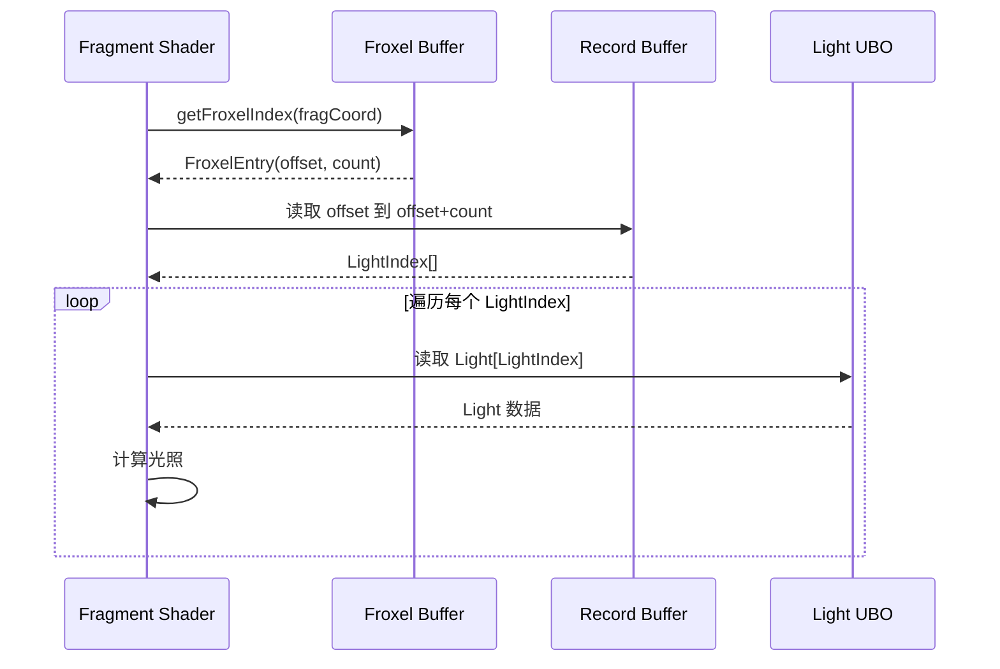

### 记录压缩算法

为了节省内存，Froxelizer 使用压缩算法：

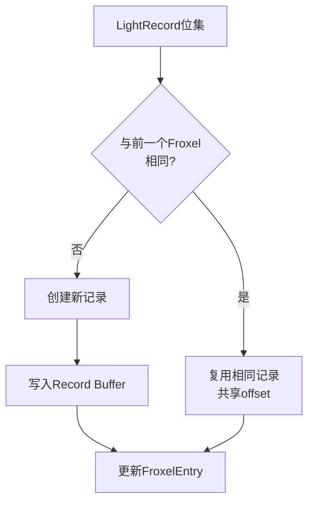

**压缩策略**：
- 如果相邻 Froxel 有相同的光源列表，共享同一个记录
- 使用位集快速比较光源列表
- 实际测试中可节省 10%+ 的记录空间

---

## 着色器使用

### 获取 Froxel 索引

```glsl
// 从片段坐标计算 Froxel 坐标
uvec3 getFroxelCoords(const highp vec3 fragCoords) {
    uvec3 froxelCoord;
    
    // X、Y 坐标直接映射
    froxelCoord.xy = uvec2(fragCoords.xy * frameUniforms.froxelCountXY);
    
    // Z 坐标使用对数映射（因为深度是非线性的）
    highp float viewSpaceNormalizedZ = 
        frameUniforms.zParams.x * fragCoords.z + frameUniforms.zParams.y;
    float zSliceCount = frameUniforms.zParams.w;
    float sliceZWithoutOffset = log2(viewSpaceNormalizedZ) * frameUniforms.zParams.z;
    froxelCoord.z = uint(clamp(sliceZWithoutOffset + zSliceCount, 0.0, zSliceCount - 1.0));
    
    return froxelCoord;
}

// 计算 Froxel 索引
uint getFroxelIndex(const highp vec3 fragCoords) {
    uvec3 froxelCoord = getFroxelCoords(fragCoords);
    return froxelCoord.x * frameUniforms.fParams.x +
           froxelCoord.y * frameUniforms.fParams.y +
           froxelCoord.z * frameUniforms.fParams.z;
}
```

### 获取光源列表

```glsl
// 获取 Froxel 参数（offset 和 count）
FroxelParams getFroxelParams(const uint froxelIndex) {
    uint w = froxelIndex >> 2u;  // 除以 4（每个 uvec4 包含 4 个 FroxelEntry）
    uint c = froxelIndex & 0x3u;  // 取模 4
    highp uvec4 d = froxelsUniforms.records[w];
    highp uint f = d[c];
    
    FroxelParams froxel;
    froxel.recordOffset = f >> 16u;  // 高 16 位是 offset
    froxel.count = f & 0xFFu;         // 低 8 位是 count
    return froxel;
}

// 从记录索引获取光源索引
uint getLightIndex(const uint index) {
    uint v = index >> 4u;        // 除以 16（每个 uvec4 包含 16 个索引）
    uint c = (index >> 2u) & 0x3u; // 取模 4
    uint s = (index & 0x3u) * 8u;   // 位偏移
    highp uvec4 d = froxelRecordUniforms.records[v];
    return (d[c] >> s) & 0xFFu;     // 提取 8 位光源索引
}
```

### 光照计算流程

```glsl
void evaluatePunctualLights(const MaterialInputs material,
                            const PixelParams pixel, 
                            inout vec3 color) {
    // 1. 获取当前像素所在的 Froxel
    FroxelParams froxel = getFroxelParams(
        getFroxelIndex(getNormalizedPhysicalViewportCoord())
    );
    
    // 2. 遍历该 Froxel 中的所有光源
    uint index = froxel.recordOffset;
    uint end = index + froxel.count;
    
    for (uint i = index; i < end; i++) {
        // 3. 获取光源索引
        uint lightIndex = getLightIndex(i);
        
        // 4. 从 Light UBO 读取光源数据
        Light light = getLight(lightIndex, pixel.worldPosition, ...);
        
        // 5. 计算光照贡献
        color += evaluateLight(light, material, pixel);
    }
}
```

---

## 性能优化策略

### 多线程处理

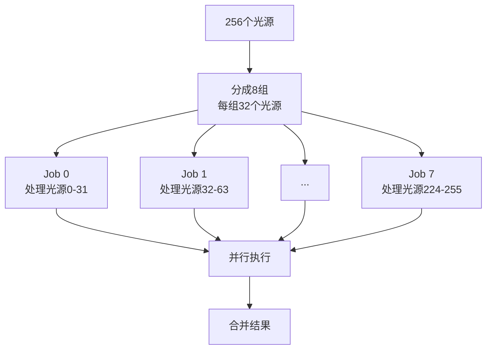

**优化点**：
- 使用 JobSystem 并行处理光源
- 每组 32 个光源（对应 uint32_t 的位数）
- 使用位集避免锁竞争

### 向量化优化


**优化点**：
- 确保 Froxel 数量是 16 的倍数（便于向量化）
- 使用 `UTILS_UNROLL` 提示编译器展开循环
- 使用 `UTILS_RESTRICT` 提示指针不重叠

### 内存优化

```mermaid
graph TB
    A[内存分配策略] --> B[私有内存池<br/>~256 KiB]
    A --> C[每帧内存池<br/>~512 KiB]
    A --> D[命令流内存<br/>~16-64 KiB]
    B --> E[Froxel网格数据<br/>持久化]
    C --> F[LightRecord<br/>临时数据]
    D --> G[GPU缓冲区<br/>提交数据]
```

**优化点**：
- 使用 LinearAllocator 减少内存分配开销
- 记录压缩减少内存占用
- 使用位集减少内存占用

### 缓存优化

```mermaid
graph LR
    A[数据布局] --> B[连续内存]
    B --> C[提高缓存命中率]
    C --> D[减少内存访问延迟]
```

**优化点**：
- Froxel 数据按 Z、Y、X 顺序存储（提高空间局部性）
- 使用 `CACHELINE_SIZE` 对齐减少 false sharing
- 位集操作使用 SIMD 指令

---

## 内存管理

### 内存分配

```mermaid
graph TB
    subgraph "构造函数"
        A[创建内存池<br/>~256 KiB]
        B[创建GPU缓冲区<br/>Froxel Buffer<br/>Record Buffer]
    end
    
    subgraph "prepare()"
        C[分配每帧内存<br/>LightRecord<br/>FroxelThreadData]
        D[分配命令流内存<br/>FroxelBufferUser<br/>RecordBufferUser]
    end
    
    subgraph "commit()"
        E[上传数据到GPU]
        F[释放命令流内存]
    end
    
    A --> C
    B --> D
    C --> E
    D --> E
    E --> F
```

### 内存大小估算

| 组件 | 大小 | 说明 |
|------|------|------|
| Froxel Buffer | 16 KiB | 4096 个 FroxelEntry × 4 字节 |
| Record Buffer | 16-64 KiB | 光源索引列表，动态大小 |
| LightRecord | ~256 KiB | 4096 个 Froxel × 64 字节 |
| FroxelThreadData | ~256 KiB | 8 组 × 8192 × 4 字节 |
| 平面数组 | ~4 KiB | X/Y 平面 + Z 距离 |
| 边界球数组 | ~64 KiB | 4096 个 × 16 字节 |

**总计**：约 600 KiB 的 CPU 端内存 + 32-80 KiB 的 GPU 端内存

### 内存对齐

```cpp
// 确保 Froxel 数量是 16 的倍数（便于向量化）
mFroxelBufferEntryCount &= ~0xF;

// 使用缓存行对齐（减少 false sharing）
mLightRecords.set(
    rootArenaScope.allocate<LightRecord>(count, CACHELINE_SIZE),
    count
);
```

---

## 总结

Froxel 系统是 Filament 中实现高效光照计算的关键技术：

1. **空间划分**：将视锥体划分为 3D 网格，实现 O(1) 光源查询
2. **动态适应**：根据视口和投影动态调整网格布局
3. **高效分配**：使用多线程和向量化优化光源分配过程
4. **内存优化**：使用压缩和位集减少内存占用
5. **GPU 友好**：数据组织便于 GPU 快速访问

通过这套系统，Filament 能够在支持大量动态光源的同时保持高性能渲染。

---

## 参考资料

- `filament/src/Froxelizer.h` - Froxelizer 头文件
- `filament/src/Froxelizer.cpp` - Froxelizer 实现
- `shaders/src/surface_light_punctual.fs` - 着色器实现
- Filament 官方文档

