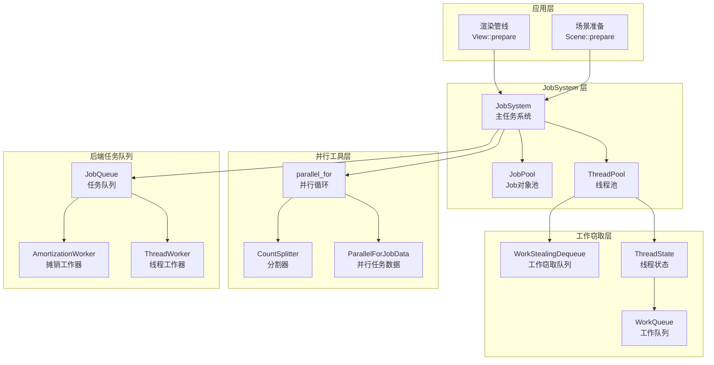
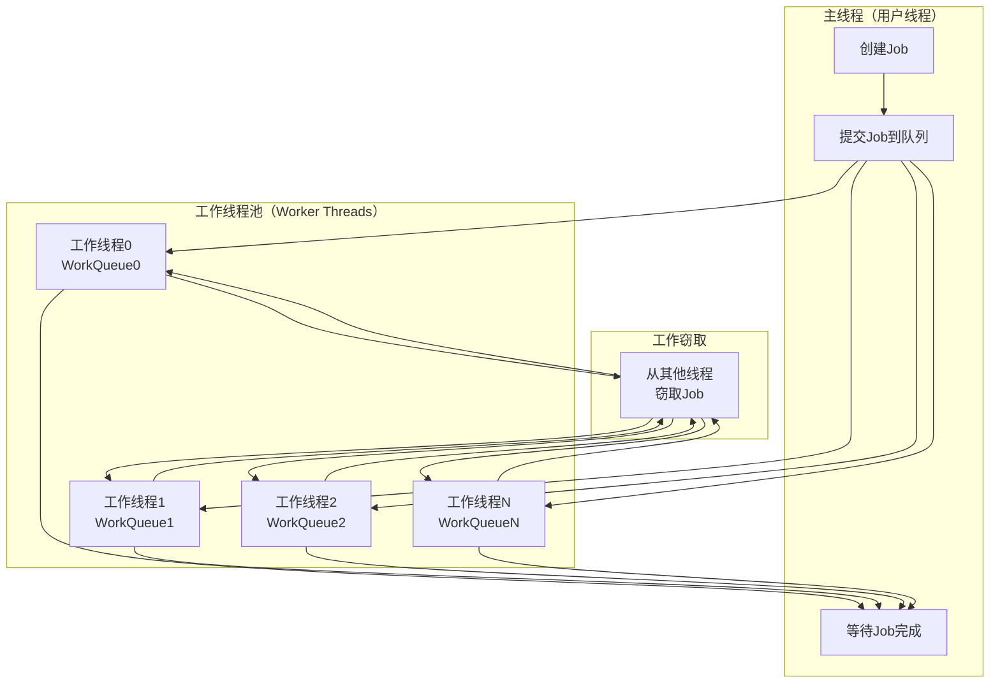
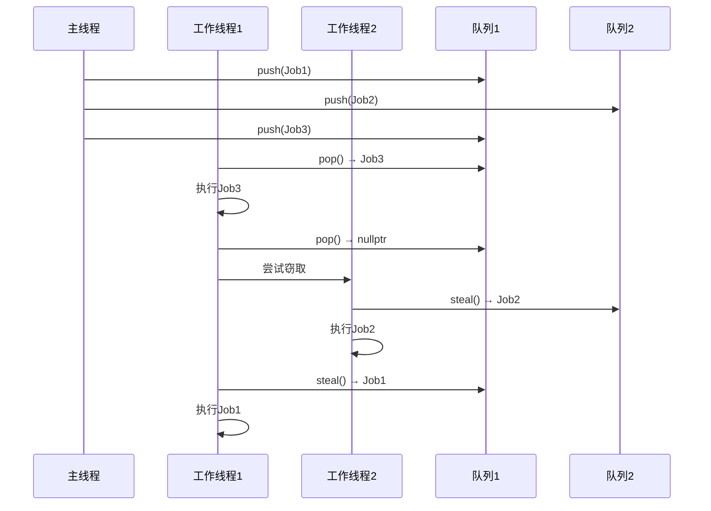
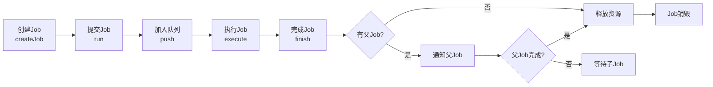
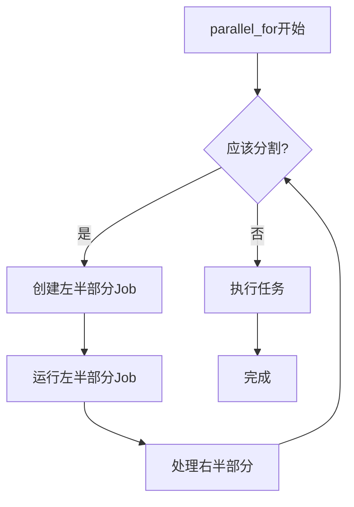
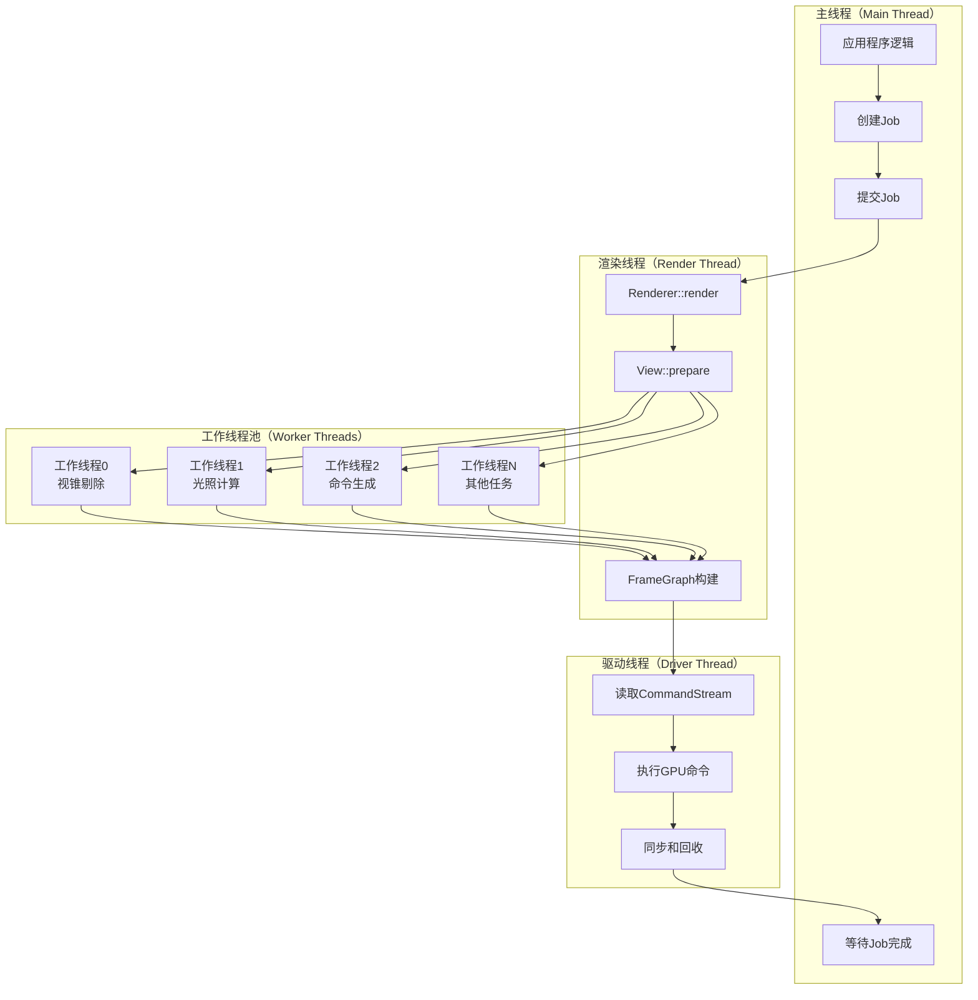
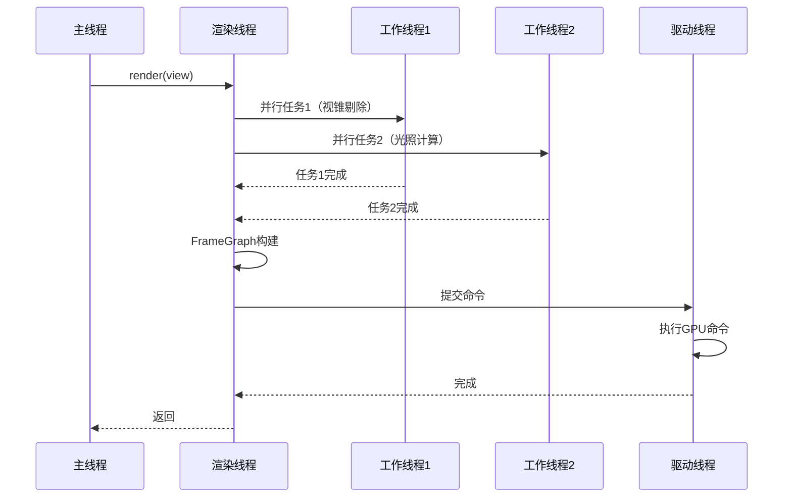

# Filament Job 系统与多线程调度完整分析

## 目录

1. [概述](#概述)
2. [整体架构](#整体架构)
3. [JobSystem 核心组件](#jobsystem-核心组件)
4. [工作窃取算法](#工作窃取算法)
5. [Job 生命周期管理](#job-生命周期管理)
6. [parallel_for 并行循环](#parallel_for-并行循环)
7. [JobQueue 后端任务队列](#jobqueue-后端任务队列)
8. [线程模型与调度](#线程模型与调度)
9. [在渲染管线中的应用](#在渲染管线中的应用)
10. [性能优化策略](#性能优化策略)

---

## 概述

Filament 使用基于**工作窃取（Work-Stealing）**的 Job 系统来实现高效的多线程并行处理。该系统设计用于在渲染管线中并行执行各种任务，如视锥剔除、光照剔除、命令生成等。

### 核心特性

- **工作窃取**：空闲线程从其他线程窃取任务，实现负载均衡
- **无锁设计**：使用无锁数据结构，减少同步开销
- **缓存友好**：缓存行对齐，避免伪共享
- **灵活调度**：支持 Job 依赖、并行循环、异步任务

### 系统组成

```
┌─────────────────────────────────────────────────────────┐
│  JobSystem（主任务系统）                                  │
│  - 工作窃取队列（Work-Stealing Dequeue）                 │
│  - 线程池管理                                             │
│  - Job 生命周期管理                                       │
└──────────────┬──────────────────────────────────────────┘
               │
       ┌───────┴───────┬───────────┬──────────┐
       ▼               ▼           ▼          ▼
┌──────────┐  ┌──────────┐  ┌──────────┐  ┌──────────┐
│JobQueue  │  │AsyncJob  │  │parallel_│  │WorkSteal │
│（后端）   │  │Queue     │  │for      │  │Dequeue   │
└──────────┘  └──────────┘  └──────────┘  └──────────┘
```

---

## 整体架构

### 系统架构图



### 线程模型



---

## JobSystem 核心组件

### 1. JobSystem 初始化

**位置**：`libs/utils/src/JobSystem.cpp:197`

**线程数计算策略**：

```cpp
JobSystem::JobSystem(const size_t userThreadCount, 
                     const size_t adoptableThreadsCount) noexcept {
    unsigned int threadPoolCount = userThreadCount;
    
    if (threadPoolCount == 0) {
        // 自动检测线程数
        unsigned int hwThreads = std::thread::hardware_concurrency();
        
        // 超线程处理：避免使用超线程，简化性能分析
        if (UTILS_HAS_HYPER_THREADING) {
            hwThreads = (hwThreads + 1) / 2;
        }
        
        // 主线程占用一个核心，所以工作线程数 = 总核心数 - 1
        threadPoolCount = hwThreads - 1;
    }
    
    // 限制范围：至少1个线程，最多32个线程
    threadPoolCount = std::max(1u, threadPoolCount);
    threadPoolCount = std::min(UTILS_HAS_THREADING ? 32u : 0u, threadPoolCount);
    
    // 初始化线程状态
    mThreadStates = aligned_vector<ThreadState>(threadPoolCount + adoptableThreadsCount);
    mThreadCount = uint16_t(threadPoolCount);
    
    // 计算并行分割次数：log2(总线程数)
    mParallelSplitCount = (uint8_t)std::ceil(
        std::log2f(threadPoolCount + adoptableThreadsCount)
    );
}
```

**关键参数**：

| 参数 | 值 | 说明 |
|------|-----|------|
| `MAX_JOB_COUNT` | 16384 | 最大Job数量 |
| `CACHELINE_SIZE` | 64字节 | 缓存行大小，用于避免伪共享 |
| `JOB_STORAGE_SIZE_BYTES` | 48字节 | Job数据存储大小 |
| `mParallelSplitCount` | log2(线程数) | parallel_for最大分割深度 |

### 2. Job 结构

**位置**：`libs/utils/include/utils/JobSystem.h:64`

```cpp
class alignas(CACHELINE_SIZE) Job {
private:
    void* storage[JOB_STORAGE_SIZE_WORDS];      // Job数据存储（48字节）
    JobFunc function;                           // Job执行函数指针
    uint16_t parent;                            // 父Job索引
    mutable ThreadId id = invalidThreadId;       // 执行线程ID
    mutable std::atomic<uint8_t> refCount = {1}; // 引用计数
    std::atomic<uint32_t> runningJobCount = {1}; // 运行中的子Job计数
};
```

**设计要点**：

1. **缓存行对齐**：`alignas(CACHELINE_SIZE)` 避免伪共享（False Sharing）
2. **引用计数**：支持多线程等待同一个Job
3. **父子关系**：支持Job依赖和同步
4. **运行计数**：跟踪子Job完成情况

**内存布局**：

```
┌─────────────────────────────────────────┐
│  Job 结构（64字节，缓存行对齐）            │
├─────────────────────────────────────────┤
│  storage[6]        : 48字节（数据存储）   │
│  function          : 4/8字节（函数指针）  │
│  parent            : 2字节（父Job索引）   │
│  id                : 1字节（线程ID）      │
│  refCount          : 1字节（引用计数）    │
│  runningJobCount   : 4字节（运行计数）    │
│  padding           : 4字节（对齐）        │
└─────────────────────────────────────────┘
```

### 3. ThreadState（线程状态）

```cpp
struct alignas(CACHELINE_SIZE) ThreadState {
    WorkQueue workQueue;        // 工作队列（工作窃取队列）
    std::atomic<bool> exit;     // 退出标志
    std::mt19937 rndGen;        // 随机数生成器（用于工作窃取）
};
```

**设计要点**：
- **缓存行对齐**：每个线程状态独立缓存行，避免伪共享
- **独立队列**：每个线程有自己的工作队列
- **随机数生成器**：用于随机选择窃取目标

### 4. WorkStealingDequeue（工作窃取队列）

**位置**：`libs/utils/include/utils/WorkStealingDequeue.h`

**数据结构**：

```cpp
template<typename T, size_t SIZE>
class WorkStealingDequeue {
    std::atomic<size_t> mTop;      // 顶部索引（窃取端）
    std::atomic<size_t> mBottom;   // 底部索引（本地端）
    T mData[SIZE];                 // 数据数组
};
```

**操作**：

1. **push**：从底部添加（本地线程）
2. **pop**：从底部移除（本地线程，LIFO）
3. **steal**：从顶部移除（其他线程，FIFO）

**设计优势**：
- **减少竞争**：本地线程和其他线程操作队列的不同端
- **提高缓存局部性**：本地线程操作最近添加的Job
- **负载均衡**：空闲线程可以从其他线程窃取工作

---

## 工作窃取算法

### 工作窃取流程



### 窃取算法实现

**位置**：`libs/utils/src/JobSystem.cpp:474`

```cpp
JobSystem::Job* JobSystem::steal(ThreadState& state) noexcept {
    Job* job = nullptr;
    do {
        // 1. 随机选择一个目标线程
        ThreadState* const stateToStealFrom = getStateToStealFrom(state);
        
        if (stateToStealFrom) {
            // 2. 从目标线程的队列顶部窃取（FIFO）
            job = steal(stateToStealFrom->workQueue);
        }
        
        // 3. 如果窃取失败且仍有活跃Job，继续尝试
    } while (!job && hasActiveJobs());
    
    return job;
}
```

**窃取策略**：

1. **随机选择**：使用随机数生成器选择目标线程，避免所有线程都窃取同一个线程
2. **避免自窃取**：不窃取自己的队列
3. **重试机制**：如果没有可窃取的Job，继续尝试（可能有其他线程正在添加Job）

**getStateToStealFrom**：

```cpp
ThreadState* JobSystem::getStateToStealFrom(ThreadState& state) noexcept {
    uint16_t const threadCount = mThreadCount + mAdoptedThreads.load();
    
    if (threadCount >= 2) {
        do {
            // 随机选择一个线程索引
            uint16_t const index = uint16_t(state.rndGen() % threadCount);
            ThreadState* target = &mThreadStates[index];
            
            // 不窃取自己的队列
            if (target != &state) {
                return target;
            }
        } while (true);
    }
    return nullptr;
}
```

### 工作窃取队列操作

**push（本地线程）**：

```cpp
void push(T item) {
    size_t b = mBottom.load(std::memory_order_relaxed);
    mData[b & MASK] = item;
    mBottom.store(b + 1, std::memory_order_release);
}
```

**pop（本地线程，LIFO）**：

```cpp
T pop() {
    size_t b = mBottom.load(std::memory_order_relaxed) - 1;
    mBottom.store(b, std::memory_order_relaxed);
    
    size_t t = mTop.load(std::memory_order_acquire);
    
    if (t <= b) {
        // 队列非空
        T item = mData[b & MASK];
        if (t != b) {
            // 队列中还有多个元素
            return item;
        }
        // 队列中只有一个元素，需要与steal竞争
        if (mTop.compare_exchange_strong(t, t + 1, 
                                         std::memory_order_seq_cst,
                                         std::memory_order_relaxed)) {
            return item;
        }
        // 被steal抢走了
        return nullptr;
    }
    
    // 队列为空
    mBottom.store(t, std::memory_order_relaxed);
    return nullptr;
}
```

**steal（其他线程，FIFO）**：

```cpp
T steal() {
    size_t t = mTop.load(std::memory_order_acquire);
    size_t b = mBottom.load(std::memory_order_acquire);
    
    if (t < b) {
        // 队列非空
        T item = mData[t & MASK];
        if (mTop.compare_exchange_strong(t, t + 1,
                                        std::memory_order_seq_cst,
                                        std::memory_order_relaxed)) {
            return item;
        }
        // 竞争失败
        return nullptr;
    }
    
    // 队列为空
    return nullptr;
}
```

---

## Job 生命周期管理

### Job 生命周期



### Job 创建

```cpp
Job* JobSystem::create(Job* parent, JobFunc func) noexcept {
    // 1. 从对象池分配Job
    Job* const job = mJobPool.allocate<Job>();
    
    // 2. 初始化Job
    job->function = func;
    job->parent = parent ? (parent - mJobStorageBase) : 0;
    job->refCount.store(1, std::memory_order_relaxed);
    job->runningJobCount.store(1, std::memory_order_relaxed);
    
    // 3. 如果有父Job，增加父Job的运行计数
    if (parent) {
        parent->runningJobCount.fetch_add(1, std::memory_order_relaxed);
    }
    
    return job;
}
```

### Job 执行

**位置**：`libs/utils/src/JobSystem.cpp:521`

```cpp
bool JobSystem::execute(ThreadState& state) noexcept {
    // 1. 从自己的队列中获取Job（LIFO）
    Job* job = pop(state.workQueue);
    
    // 2. 如果队列为空，尝试工作窃取
    if (!job) {
        constexpr size_t const STEAL_TRY_COUNT = 1;
        for (size_t i = 0; i < STEAL_TRY_COUNT; i++) {
            job = steal(state);
            if (job) break;
        }
    }
    
    // 3. 执行Job
    if (job) {
        // 设置执行线程ID
        job->id = std::distance(mThreadStates.data(), &state);
        
        // 执行Job函数
        if (job->function) {
            job->function(job->storage, *this, job);
        }
        
        // 清除线程ID
        job->id = invalidThreadId;
        
        // 4. 完成Job
        finish(job);
    }
    
    return job != nullptr;
}
```

### Job 完成

**位置**：`libs/utils/src/JobSystem.cpp:652`

```cpp
void JobSystem::finish(Job* job) noexcept {
    // 1. 减少运行计数
    uint32_t const running = job->runningJobCount.fetch_sub(1, std::memory_order_acq_rel) - 1;
    
    // 2. 如果Job完成（所有子Job都完成）
    if (running == 0) {
        // 3. 如果有父Job，通知父Job
        if (job->parent) {
            Job* const parent = &mJobStorageBase[job->parent];
            finish(parent);  // 递归完成父Job
        }
        
        // 4. 减少引用计数
        uint8_t const refs = job->refCount.fetch_sub(1, std::memory_order_acq_rel) - 1;
        
        // 5. 如果引用计数为0，释放Job
        if (refs == 0) {
            mJobPool.deallocate(job);
        }
        
        // 6. 唤醒等待的线程
        wakeAll();
    }
}
```

### Job 等待

```cpp
void JobSystem::wait(Job* job) noexcept {
    // 1. 增加引用计数（防止Job被释放）
    job->refCount.fetch_add(1, std::memory_order_relaxed);
    
    // 2. 等待Job完成
    while (job->runningJobCount.load(std::memory_order_acquire) != 0) {
        // 3. 尝试执行其他Job（避免死锁）
        ThreadState* state = getState();
        if (state) {
            execute(*state);
        } else {
            // 如果没有线程状态，等待条件变量
            std::unique_lock lock(mWaiterLock);
            while (job->runningJobCount.load(std::memory_order_acquire) != 0) {
                wait(lock);
            }
        }
    }
    
    // 4. 减少引用计数
    job->refCount.fetch_sub(1, std::memory_order_acq_rel);
}
```

---

## parallel_for 并行循环

### parallel_for 概述

`parallel_for` 是 JobSystem 提供的并行循环工具，用于将大任务递归分割成多个小任务并行执行。

**使用示例**：

```cpp
// 并行处理数组
auto* job = jobs::parallel_for(js, parent,
    0, count,  // 起始索引和数量
    [](uint32_t start, uint32_t count) {
        // 处理 [start, start + count) 范围的数据
        for (uint32_t i = start; i < start + count; i++) {
            process(data[i]);
        }
    },
    jobs::CountSplitter<64>()  // 分割器：当 count >= 128 时分割
);
js.runAndWait(job);
```

### 分割策略

**CountSplitter**：

```cpp
template<size_t COUNT, size_t MAX_SPLITS = 12>
class CountSplitter {
public:
    bool split(size_t splits, size_t count) const noexcept {
        // 分割条件：
        // 1. 分割深度 < MAX_SPLITS
        // 2. 任务数量 >= COUNT * 2
        return (splits < MAX_SPLITS && count >= COUNT * 2);
    }
};
```

**分割逻辑**：
- 当 `count >= COUNT * 2` 且 `splits < MAX_SPLITS` 时分割
- 分割为两个子任务：`[start, start + count/2)` 和 `[start + count/2, start + count)`
- 递归分割直到满足停止条件

### parallel_for 执行流程



**实现代码**：

```cpp
void ParallelForJobData::parallelWithJobs(JobSystem& js, Job* parent) noexcept {
right_side:
    // 检查是否应该继续分割
    if (splitter.split(splits, count)) {
        // 应该分割：创建左半部分的子Job
        size_type const leftCount = count / 2;
        size_type const rightStart = start + leftCount;
        size_type const rightCount = count - leftCount;
        
        // 创建左半部分的Job
        Job* leftJob = js.emplaceJob<JobData, &JobData::parallelWithJobs>(
            parent,
            start, leftCount, splits + 1,
            functor, splitter
        );
        
        // 运行左半部分的Job（可能在其他线程执行）
        js.run(leftJob);
        
        // 在当前线程处理右半部分（重用当前Job，避免创建开销）
        start = rightStart;
        count = rightCount;
        splits++;
        goto right_side;  // 继续处理右半部分（可能继续分割）
    } else {
        // 不应该分割：直接执行任务
execute:
        functor(start, count);
    }
}
```

### 并行执行示例

**示例：处理1000个元素，CountSplitter<64>**：

```
parallel_for(start=0, count=1000)
    │
    ├─> split: [0, 500) 和 [500, 1000)
    │
    ├─> Job 1: [0, 500)
    │   ├─> split: [0, 250) 和 [250, 500)
    │   │   ├─> Job 1.1: [0, 250)
    │   │   │   ├─> split: [0, 125) 和 [125, 250)
    │   │   │   │   ├─> Job 1.1.1: [0, 125) → execute
    │   │   │   │   └─> Job 1.1.2: [125, 250) → execute
    │   │   │   └─> (如果count < 128，直接执行)
    │   │   └─> Job 1.2: [250, 500) → execute
    │
    └─> Job 2: [500, 1000)
        ├─> split: [500, 750) 和 [750, 1000)
        │   ├─> Job 2.1: [500, 750) → execute
        │   └─> Job 2.2: [750, 1000) → execute
```

---

## JobQueue 后端任务队列

### JobQueue 概述

`JobQueue` 是 Filament 后端（Backend）使用的任务队列，用于处理异步操作（如回调、资源清理等）。

**位置**：`filament/backend/src/JobQueue.h`

**特点**：
- **线程安全**：支持多生产者多消费者
- **批处理**：支持批量获取任务
- **任务取消**：支持取消未执行的任务
- **有序执行**：保证任务按提交顺序执行

### JobQueue 结构

```cpp
class JobQueue {
private:
    std::mutex mQueueMutex;                    // 队列互斥锁
    std::condition_variable mQueueCondition;   // 条件变量
    std::unordered_map<JobId, Job> mJobsMap;  // 任务映射表
    std::queue<JobId> mJobOrder;              // 任务顺序队列
    JobId mNextJobId = 0;                     // 下一个任务ID
    bool mIsStopping = false;                 // 停止标志
};
```

### Worker 类型

#### 1. AmortizationWorker（摊销工作器）

**特点**：
- **非阻塞**：在主线程中定期调用 `process()`
- **批处理**：一次处理多个任务
- **低延迟**：适合需要快速响应的场景

**使用场景**：
- 每帧处理少量异步任务
- 资源清理
- 回调执行

**实现**：

```cpp
class AmortizationWorker : public JobWorker {
public:
    void process(int jobCount) override {
        if (jobCount == 0) return;
        
        if (jobCount == 1) {
            // 优化：只处理一个任务
            Job job = mQueue->pop(false);
            if (job) {
                job();
            }
        } else {
            // 批量处理
            auto jobs = mQueue->popBatch(jobCount);
            for (auto& job : jobs) {
                job();
            }
        }
    }
};
```

**使用示例**：

```cpp
auto worker = AmortizationWorker::create(queue);

// 每帧调用
void renderFrame() {
    // 处理最多2个任务
    worker->process(2);
}
```

#### 2. ThreadWorker（线程工作器）

**特点**：
- **专用线程**：在独立线程中运行
- **阻塞等待**：队列为空时阻塞
- **顺序执行**：保证任务按顺序执行

**使用场景**：
- 长时间运行的任务
- 需要等待的操作（如栅栏等待）
- 后台处理

**实现**：

```cpp
class ThreadWorker : public JobWorker {
private:
    std::thread mThread;
    Config mConfig;
    
public:
    ThreadWorker(JobQueue::Ptr queue, Config config) 
        : JobWorker(std::move(queue)), mConfig(std::move(config)) {
        mThread = std::thread([this]() {
            setThreadName(mConfig.name);
            setThreadPriority(mConfig.priority);
            
            if (mConfig.onBegin) {
                mConfig.onBegin();
            }
            
            // 主循环
            while (true) {
                Job job = mQueue->pop(true);  // 阻塞等待
                if (!job) {
                    // 停止信号
                    break;
                }
                job();
            }
            
            if (mConfig.onEnd) {
                mConfig.onEnd();
            }
        });
    }
};
```

**使用示例**：

```cpp
ThreadWorker::Config config{
    .name = "BackendWorker",
    .priority = Priority::DISPLAY
};
auto worker = ThreadWorker::create(queue, config);
```

---

## 线程模型与调度

### 完整线程模型



### 线程同步



### 线程优先级

Filament 使用平台特定的线程优先级设置：

```cpp
enum class Priority {
    LOW,        // 低优先级
    NORMAL,     // 正常优先级
    HIGH,       // 高优先级
    DISPLAY     // 显示优先级（最高）
};
```

**优先级分配**：
- **工作线程**：`Priority::DISPLAY`（确保渲染任务优先执行）
- **驱动线程**：`Priority::DISPLAY`（GPU命令执行）
- **后端工作线程**：`Priority::DISPLAY`（资源清理等）

---

## 在渲染管线中的应用

### 1. 视锥剔除（Frustum Culling）

**位置**：`filament/src/details/View.cpp`

```cpp
// 并行执行视锥剔除
auto* cullingJob = jobs::parallel_for(js, parent,
    visibleRenderables.first, visibleRenderables.size(),
    [&](uint32_t start, uint32_t count) {
        // 对 [start, start + count) 范围的物体进行视锥剔除
        cull(soa, {start, start + count}, camera);
    },
    jobs::CountSplitter<CULLING_JOB_SPLIT_COUNT>()
);
js.runAndWait(cullingJob);
```

### 2. 场景准备（Scene Preparation）

**位置**：`filament/src/details/Scene.cpp:369`

```cpp
// 创建根Job（所有并行Job的父节点）
JobSystem::Job* rootJob = js.createJob();

// 创建Renderable并行Job
// CountSplitter<64>: 每批处理64个Renderable
auto* renderableJob = parallel_for(js, rootJob,
    renderableInstances.data(), renderableInstances.size(),
    std::cref(renderableWork), 
    jobs::CountSplitter<64>()
);

// 创建Light并行Job
// CountSplitter<32, 5>: 每批处理32个Light，最多5个批次并行
auto* lightJob = parallel_for(js, rootJob,
    lightInstances.data(), lightInstances.size(),
    std::cref(lightWork), 
    jobs::CountSplitter<32, 5>()
);

// 启动并行Job（它们会并行执行）
js.run(renderableJob);
js.run(lightJob);

// 等待所有Job完成
js.waitAndRelease(rootJob);
```

### 3. 命令生成（Command Generation）

**位置**：`filament/src/RenderPass.cpp:207`

```cpp
// 并行生成渲染命令
if (visibleRenderables.size() > JOBS_PARALLEL_FOR_COMMANDS_COUNT) {
    auto* jobCommandsParallel = parallel_for(js, nullptr,
        visibleRenderables.first, visibleRenderables.size(),
        work,  // 命令生成函数
        jobs::CountSplitter<JOBS_PARALLEL_FOR_COMMANDS_COUNT>()
    );
    js.runAndWait(jobCommandsParallel);
} else {
    // 任务数量少，直接执行
    work(visibleRenderables.first, visibleRenderables.size());
}
```

### 4. 光照网格化（Froxelization）

**位置**：`filament/src/details/View.cpp`

```cpp
// 并行处理光照网格化
auto* froxelizeJob = jobs::parallel_for(js, parent,
    0, lightCount,
    [&](uint32_t start, uint32_t count) {
        // 处理 [start, start + count) 范围的光照
        froxelize(lights, {start, start + count});
    },
    jobs::CountSplitter<FROXELIZE_JOB_SPLIT_COUNT>()
);
js.runAndWait(froxelizeJob);
```

---

## 性能优化策略

### 1. 缓存优化

**缓存行对齐**：

```cpp
// Job和ThreadState都使用缓存行对齐
class alignas(CACHELINE_SIZE) Job { ... };
struct alignas(CACHELINE_SIZE) ThreadState { ... };
```

**避免伪共享**：
- 每个线程的状态独立缓存行
- 减少缓存一致性开销

### 2. 无锁优化

**原子操作**：

```cpp
// 使用memory_order_relaxed减少同步开销
mActiveJobs.fetch_add(1, std::memory_order_relaxed);
```

**无锁队列**：
- WorkStealingDequeue使用原子操作实现无锁
- 减少互斥锁竞争

### 3. 负载均衡

**工作窃取**：
- 空闲线程主动窃取工作
- 自动负载均衡
- 减少线程空闲时间

**随机选择**：
- 使用随机数生成器选择窃取目标
- 避免所有线程都窃取同一个线程

### 4. 任务分割优化

**递归分割**：
- 大任务递归分割成小任务
- 充分利用多核CPU
- 避免任务过大导致负载不均

**分割阈值**：
- 根据任务类型调整分割阈值
- 平衡分割开销和执行效率

### 5. 批处理优化

**批量处理**：
- AmortizationWorker支持批量处理
- 减少函数调用开销
- 提高缓存效率

---

## 总结

### JobSystem 核心特点

1. **工作窃取**
   - 高效的负载均衡
   - 减少线程空闲时间
   - 自动适应负载变化

2. **无锁设计**
   - 使用原子操作
   - 减少同步开销
   - 提高并发性能

3. **缓存友好**
   - 缓存行对齐
   - 避免伪共享
   - 提高缓存命中率

4. **灵活调度**
   - 支持Job依赖
   - 支持并行循环
   - 支持异步任务

### 关键文件

| 文件 | 说明 |
|------|------|
| `libs/utils/include/utils/JobSystem.h` | JobSystem公共接口 |
| `libs/utils/src/JobSystem.cpp` | JobSystem实现 |
| `libs/utils/include/utils/WorkStealingDequeue.h` | 工作窃取队列 |
| `filament/backend/src/JobQueue.h` | 后端任务队列 |

### 使用建议

1. **合理设置线程数**：根据CPU核心数自动计算
2. **选择合适的分割器**：根据任务类型调整分割阈值
3. **避免过度并行化**：任务太小反而降低性能
4. **使用批处理**：对于大量小任务，使用批处理提高效率

---

**文档版本**：1.0  
**最后更新**：2024年  
**作者**：Filament学习文档

