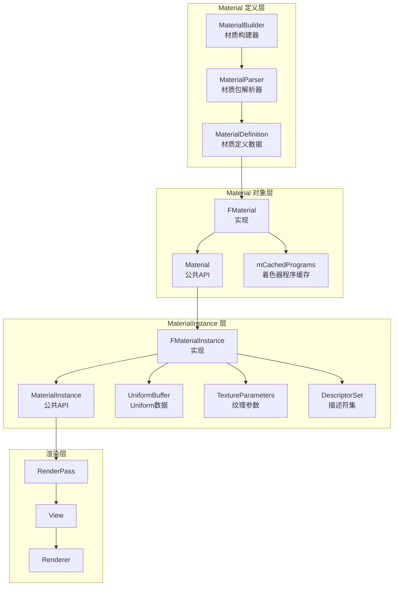
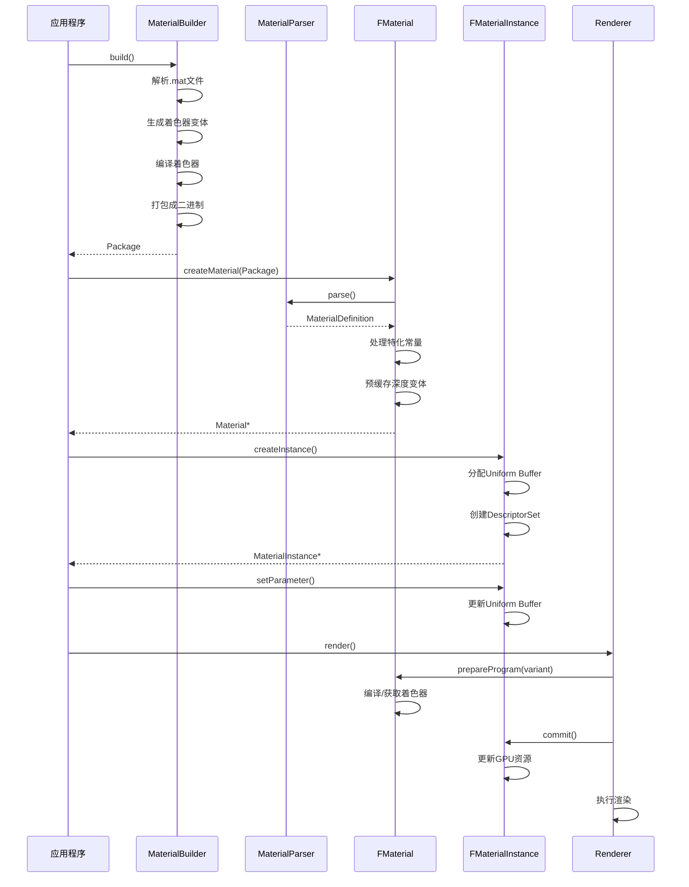
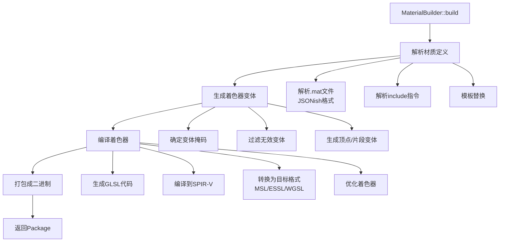
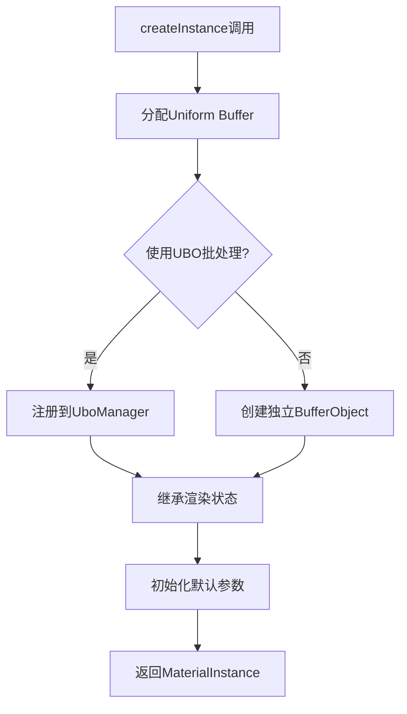
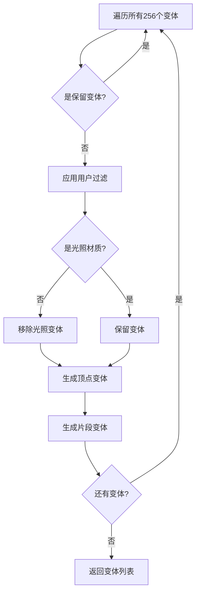
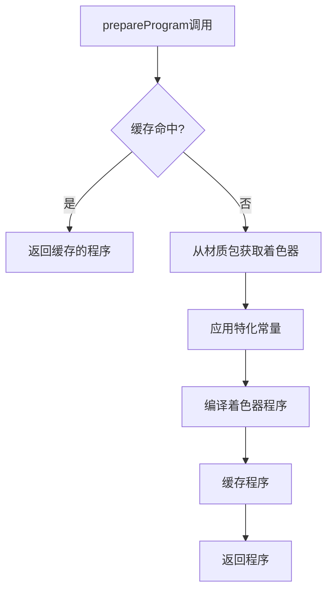

# Filament Material 系统架构完整分析

## 目录

1. [概述](#概述)
2. [Material 系统架构](#material-系统架构)
3. [Material 定义与编译](#material-定义与编译)
4. [Material 实例化](#material-实例化)
5. [Variant 系统](#variant-系统)
6. [着色器编译与缓存](#着色器编译与缓存)
7. [参数管理](#参数管理)
8. [UBO 批处理](#ubo-批处理)
9. [材质包格式](#材质包格式)
10. [性能优化](#性能优化)

---

## 概述

### Material 系统核心概念

Filament 的 Material 系统是渲染管线的核心组件之一，负责管理材质定义、着色器变体、参数绑定和渲染状态。Material 系统采用**材质定义（Material Definition）**和**材质实例（Material Instance）**的分离设计，实现了高效的材质管理和参数定制。

### 核心组件

- **Material（材质）**：不可变的材质定义，包含着色器代码、参数接口、渲染状态等
- **MaterialInstance（材质实例）**：Material 的可变实例，包含具体的参数值、纹理绑定等
- **Variant（变体）**：根据渲染条件（光照、阴影、雾效等）生成的着色器变体
- **MaterialBuilder**：材质构建器，用于从 `.mat` 文件或代码创建材质包
- **MaterialParser**：材质包解析器，从二进制包中提取着色器和元数据

### Material 系统优势

1. **分离设计**：Material（定义）和 MaterialInstance（实例）分离，支持一个定义多个实例
2. **变体系统**：根据渲染条件自动生成着色器变体，避免运行时分支
3. **参数反射**：支持参数查询和类型检查，便于工具和编辑器集成
4. **性能优化**：UBO 批处理、着色器缓存、延迟编译等优化策略

---

## Material 系统架构

### 整体架构图



### 类层次结构

```
Material (公共 API)
  └── FMaterial (实现)
      ├── MaterialDefinition (材质定义数据)
      │   ├── MaterialParser (材质包解析器)
      │   ├── BufferInterfaceBlock (Uniform 接口块)
      │   ├── SamplerInterfaceBlock (Sampler 接口块)
      │   └── RasterState (光栅化状态)
      ├── mCachedPrograms[256] (缓存的着色器程序)
      └── mSpecializationConstants (特化常量)

MaterialInstance (公共 API)
  └── FMaterialInstance (实现)
      ├── mMaterial (关联的 Material)
      ├── mUniforms (Uniform Buffer)
      ├── mTextureParameters (纹理参数映射)
      ├── mDescriptorSet (描述符堆)
      ├── mUboData (UBO 数据：独立或批处理)
      └── mRasterState (渲染状态)
```

### 数据流



---

## Material 定义与编译

### MaterialBuilder

**位置**：`libs/filamat/include/filamat/MaterialBuilder.h`

`MaterialBuilder` 是材质构建器，负责从 `.mat` 文件或代码构建材质包。

**关键方法**：

```cpp
class MaterialBuilder {
public:
    // 初始化/关闭
    static void init();
    static void shutdown();
    
    // 材质配置
    MaterialBuilder& name(const char* name);
    MaterialBuilder& material(const char* code);  // 材质代码
    MaterialBuilder& vertex(const char* code);    // 顶点着色器
    MaterialBuilder& fragment(const char* code);  // 片段着色器
    
    // 渲染状态
    MaterialBuilder& shading(Shading shading);           // 着色模型
    MaterialBuilder& blending(BlendingMode mode);       // 混合模式
    MaterialBuilder& culling(CullingMode mode);          // 面剔除
    MaterialBuilder& colorWrite(bool enable);            // 颜色写入
    MaterialBuilder& depthWrite(bool enable);           // 深度写入
    
    // 参数定义
    MaterialBuilder& parameter(const char* name, UniformType type);
    MaterialBuilder& parameter(const char* name, SamplerType type);
    
    // 构建
    Package build(JobSystem& jobSystem);
};
```

**构建流程**：



**构建代码示例**：

```cpp
MaterialBuilder::init();

MaterialBuilder builder;
builder
    .name("MyMaterial")
    .shading(Shading::LIT)
    .blending(BlendingMode::OPAQUE)
    .material(R"(
        void material(inout MaterialInputs material) {
            prepareMaterial(material);
            material.baseColor.rgb = float3(1.0, 0.0, 0.0);
            material.roughness = 0.5;
            material.metallic = 0.0;
        }
    )")
    .parameter("myFloat", UniformType::FLOAT)
    .parameter("myTexture", SamplerType::SAMPLER_2D);

JobSystem js;
Package package = builder.build(js);

MaterialBuilder::shutdown();
```

### MaterialDefinition

**位置**：`filament/src/MaterialParser.h`

`MaterialDefinition` 存储解析后的材质定义数据，是一个**只读**的数据结构。

**关键字段**：

```cpp
struct MaterialDefinition {
    // 渲染状态
    RasterState rasterState;        // 光栅化状态（深度测试、面剔除等）
    BlendingMode blendingMode;     // 混合模式
    Shading shading;                // 着色模型（LIT/UNLIT）
    TransparencyMode transparencyMode;  // 透明度模式
    
    // 接口块
    BufferInterfaceBlock uniformInterfaceBlock;   // Uniform 参数接口
    SamplerInterfaceBlock samplerInterfaceBlock;   // Sampler 参数接口
    
    // 描述符堆布局
    DescriptorSetLayout descriptorSetLayout;           // 材质描述符堆布局
    DescriptorSetLayout perViewDescriptorSetLayout;     // Per-View 描述符堆布局
    DescriptorSetLayout perViewDescriptorSetLayoutVsm; // VSM 描述符堆布局
    
    // 变体过滤
    UserVariantFilterMask variantFilterMask;  // 变体过滤掩码
    
    // 材质解析器
    std::unique_ptr<MaterialParser> mMaterialParser;  // 材质包解析器
    
    // 材质元数据
    utils::CString name;           // 材质名称
    MaterialDomain materialDomain;  // 材质域（SURFACE/POST_PROCESS/COMPUTE）
};
```

### MaterialParser

**位置**：`filament/src/MaterialParser.h/cpp`

`MaterialParser` 负责从材质包中提取着色器代码和元数据。

**关键方法**：

```cpp
class MaterialParser {
public:
    // 解析材质包
    bool parse(ChunkContainer const& container);
    
    // 获取着色器代码
    bool getShader(ShaderContent& content, 
                   ShaderModel model,
                   Variant variant, 
                   ShaderStage stage);
    
    // 获取材质元数据
    bool getName(utils::CString* name);
    bool getUIB(BufferInterfaceBlock* uib);  // Uniform 接口块
    bool getSIB(SamplerInterfaceBlock* sib);  // Sampler 接口块
    bool getRasterState(RasterState* rasterState);
    
    // 获取特化常量
    bool getSpecializationConstants(
        std::vector<SpecializationConstant>* constants);
};
```

---

## Material 实例化

### FMaterial 创建

**位置**：`filament/src/details/Material.cpp`

**构造函数流程**：

```cpp
FMaterial::FMaterial(FEngine& engine, 
                     const Builder& builder, 
                     MaterialDefinition const& definition)
    : mDefinition(definition),
      mIsDefaultMaterial(builder->mDefaultMaterial),
      mUseUboBatching(shouldEnableBatching(engine, builder->mUboBatchingMode,
                                           definition.materialDomain)),
      mEngine(engine),
      mMaterialId(engine.getMaterialId())
{
    // 1. 验证 UBO 批处理配置
    FILAMENT_CHECK_PRECONDITION(!mUseUboBatching || engine.isUboBatchingEnabled())
        << "UBO batching is not enabled.";
    
    // 2. 处理特化常量
    mSpecializationConstants = processSpecializationConstants(builder);
    
    // 3. 预缓存深度变体
    precacheDepthVariants(engine);
}
```

**关键步骤**：

1. **验证配置**：检查 UBO 批处理是否可用
2. **处理特化常量**：处理编译时常量替换
3. **预缓存深度变体**：预编译深度渲染变体，优化首次渲染性能

### FMaterialInstance 创建

**位置**：`filament/src/details/MaterialInstance.cpp`

**构造函数流程**：

```cpp
FMaterialInstance::FMaterialInstance(FEngine& engine,
                                     FMaterial const* material,
                                     const char* name)
    : mMaterial(material),
      mUseUboBatching(material->useUboBatching()),
      mName(name ? CString(name) : material->getName())
{
    FEngine::DriverApi& driver = engine.getDriverApi();
    
    // 1. 分配 Uniform Buffer（最小 16 字节）
    size_t const uboSize = std::max(size_t(16), 
                                    material->getUniformInterfaceBlock().getSize());
    mUniforms = UniformBuffer(uboSize);
    
    // 2. 创建 UBO 或使用 UBO 批处理
    if (mUseUboBatching) {
        // UBO 批处理模式：不立即分配，由 UboManager 统一管理
        mUboData = BufferAllocator::UNALLOCATED;
        engine.getUboManager()->manageMaterialInstance(this);
    } else {
        // 独立 UBO 模式：立即创建独立的 BufferObject
        mUboData = driver.createBufferObject(uboSize, 
                                            BufferObjectBinding::UNIFORM,
                                            BufferUsage::STATIC,
                                            ImmutableCString{ material->getName().c_str_safe() });
        // 设置 UBO 到描述符堆
        mDescriptorSet.setBuffer(material->getDescriptorSetLayout(),
                                 0, 
                                 std::get<Handle<HwBufferObject>>(mUboData),
                                 0, 
                                 uboSize);
    }
    
    // 3. 继承 Material 的渲染状态
    const RasterState& rasterState = material->getRasterState();
    mCulling = rasterState.culling;
    mShadowCulling = rasterState.culling;
    mColorWrite = rasterState.colorWrite;
    mDepthWrite = rasterState.depthWrite;
    mDepthFunc = rasterState.depthFunc;
    
    // 4. 初始化默认参数
    if (material->getBlendingMode() == BlendingMode::MASKED) {
        setMaskThreshold(material->getMaskThreshold());
    }
}
```

**创建流程图**：



---

## Variant 系统

### Variant 位掩码

Variant 使用 8 位掩码表示不同的渲染条件，支持 256 种不同的变体组合。

**位掩码定义**：

```
位 7   6   5   4   3   2   1   0
+---+---+---+---+---+---+---+---+
|STE|VSM|FOG|DEP|SKN|SRE|DYN|DIR|
+---+---+---+---+---+---+---+---+
```

**位含义**：

| 位 | 名称 | 说明 |
|----|------|------|
| 0 | DIR | 方向光（Directional Light）存在 |
| 1 | DYN | 动态光源（Point/Spot/Area Light）存在 |
| 2 | SRE | 阴影接收（Shadow Receiver） |
| 3 | SKN | 蒙皮/变形（Skinning/Morphing） |
| 4 | DEP | 仅深度（Depth Only）变体 |
| 5 | FOG/PCK | 雾效（标准变体）/ 拾取（深度变体） |
| 6 | VSM | 方差阴影贴图（深度变体）/ 采样器类型（标准变体） |
| 7 | STE | 实例化立体渲染（Stereo） |

**代码定义**：

```cpp
struct Variant {
    using type_t = uint8_t;
    type_t key = 0u;  // 8 位变体键值
    
    static constexpr type_t DIR   = 0x01; // 方向光
    static constexpr type_t DYN   = 0x02; // 动态光源
    static constexpr type_t SRE   = 0x04; // 阴影接收
    static constexpr type_t SKN   = 0x08; // 蒙皮/变形
    static constexpr type_t DEP   = 0x10; // 仅深度变体
    static constexpr type_t FOG   = 0x20; // 雾效（标准变体）
    static constexpr type_t PCK   = 0x20; // 拾取（深度变体，与FOG共享位）
    static constexpr type_t VSM   = 0x40; // 方差阴影贴图/采样器类型
    static constexpr type_t STE   = 0x80; // 实例化立体渲染
};
```

### Variant 类型

#### 1. 标准变体（Standard Variants）

**特征**：`DEP = 0`

**有效变体数量**：128 - 44 = 84 个

**顶点着色器关心的位**：`STE | SKN | SRE | DYN | DIR`

**片段着色器关心的位**：`VSM | FOG | SRE | DYN | DIR`

#### 2. 深度变体（Depth Variants）

**特征**：`DEP = 1`

**有效变体数量**：16 - 4 = 12 个

**顶点深度着色器关心的位**：`STE | VSM | SKN | DEP`

**片段深度着色器关心的位**：`VSM | PCK | DEP`（无VSM）或 `VSM | DEP`（有VSM）

### Variant 过滤

**Vertex Variant 过滤**：

```cpp
static constexpr Variant filterVariantVertex(Variant variant) {
    if (isStandardVariant(variant)) {
        // 顶点着色器只关心：立体、蒙皮、阴影接收、动态光源、方向光
        return variant & (STE | SKN | SRE | DYN | DIR);
    }
    if (isDepthVariant(variant)) {
        // 深度变体只关心：立体、VSM、蒙皮
        return variant & (STE | VSM | SKN | DEP);
    }
    return {};
}
```

**Fragment Variant 过滤**：

```cpp
static constexpr Variant filterVariantFragment(Variant variant) {
    if (isStandardVariant(variant)) {
        // 片段着色器只关心：VSM、雾效、阴影接收、动态光源、方向光
        return variant & (VSM | FOG | SRE | DYN | DIR);
    }
    if (isDepthVariant(variant)) {
        // 深度变体只关心：VSM、拾取
        return variant & (VSM | PCK | DEP);
    }
    return {};
}
```

### Variant 生成

在 `MaterialBuilder::build()` 中，根据材质属性生成所有需要的变体：

```cpp
std::vector<Variant> determineSurfaceVariants(
        UserVariantFilterMask filter, 
        bool isLit, 
        bool shadowMultiplier) {
    std::vector<Variant> variants;
    for (size_t k = 0; k < VARIANT_COUNT; k++) {
        Variant variant(k);
        
        // 跳过保留变体
        if (Variant::isReserved(variant)) continue;
        
        // 应用用户过滤
        Variant filtered = Variant::filterUserVariant(variant, filter);
        
        // 移除未光照材质的变体
        filtered = Variant::filterVariant(filtered, isLit || shadowMultiplier);
        
        // 分别生成顶点和片段变体
        auto vertexVariant = Variant::filterVariantVertex(filtered);
        if (vertexVariant == variant) {
            variants.emplace_back(variant, ShaderStage::VERTEX);
        }
        
        auto fragmentVariant = Variant::filterVariantFragment(filtered);
        if (fragmentVariant == variant) {
            variants.emplace_back(variant, ShaderStage::FRAGMENT);
        }
    }
    return variants;
}
```

**Variant 生成流程图**：



---

## 着色器编译与缓存

### 程序准备流程

**prepareProgram()**：

```cpp
void FMaterial::prepareProgram(Variant variant, 
                               CompilerPriorityQueue priority) const {
    // 快速路径：检查缓存
    if (UTILS_UNLIKELY(!isCached(variant))) {
        prepareProgramSlow(variant, priority);
    }
}
```

**prepareProgramSlow()**：

```cpp
void FMaterial::prepareProgramSlow(Variant variant,
                                   CompilerPriorityQueue priority) const {
    // 1. 从材质包获取着色器代码
    ShaderContent vertexShader, fragmentShader;
    mMaterialParser->getShader(vertexShader, shaderModel, variant, ShaderStage::VERTEX);
    mMaterialParser->getShader(fragmentShader, shaderModel, variant, ShaderStage::FRAGMENT);
    
    // 2. 应用特化常量
    applySpecializationConstants(vertexShader, fragmentShader);
    
    // 3. 编译着色器程序
    Program program = driver.createProgram(
        Program::Builder()
            .vertex(vertexShader.data, vertexShader.size)
            .fragment(fragmentShader.data, fragmentShader.size)
            .specializationConstants(mSpecializationConstants)
    );
    
    // 4. 缓存程序
    mCachedPrograms[variant.key] = program;
}
```

### 着色器编译流程



### 异步编译

Filament 支持异步编译材质变体，避免阻塞渲染线程：

```cpp
void FMaterial::compile(CompilerPriorityQueue const priority,
                       UserVariantFilterMask variantSpec,
                       CallbackHandler* handler,
                       Invocable<void(Material*)>&& callback) noexcept {
    // 如果后端不支持立体渲染，则关闭 STE 变体
    if (!mEngine.getDriverApi().isStereoSupported()) {
        variantSpec &= ~UserVariantFilterMask(UserVariantFilterBit::STE);
    }
    
    // 计算要过滤掉的变体掩码
    UserVariantFilterMask const variantFilter =
            ~variantSpec & UserVariantFilterMask(UserVariantFilterBit::ALL);
    
    // 如果后端支持并行着色器编译，则并行编译所有变体
    if (mEngine.getDriverApi().isParallelShaderCompilationSupported()) {
        for (size_t k = 0; k < VARIANT_COUNT; k++) {
            Variant variant(k);
            if (Variant::isReserved(variant)) continue;
            
            // 检查是否应该编译此变体
            if (shouldCompileVariant(variant, variantFilter)) {
                // 异步编译
                mEngine.getDriverApi().compileProgram(
                    priority,
                    variant,
                    [this, variant, handler, callback = std::move(callback)]() {
                        // 编译完成回调
                        if (callback) {
                            handler->post(callback, this);
                        }
                    }
                );
            }
        }
    }
}
```

---

## 参数管理

### Uniform 参数

**设置 Uniform 参数**：

```cpp
template<typename T>
void FMaterialInstance::setParameter(const char* name, T const& value) {
    // 1. 查找参数定义
    auto* field = mMaterial->reflect(name);
    if (!field) {
        utils::slog.e << "Parameter '" << name << "' not found" << utils::io::endl;
        return;
    }
    
    // 2. 验证类型
    if (field->type != getUniformType<T>()) {
        utils::slog.e << "Parameter type mismatch for '" << name << "'" << utils::io::endl;
        return;
    }
    
    // 3. 设置 Uniform Buffer 中的值
    mUniforms.setUniform(field->offset, value);
    
    // 4. 标记为脏
    mUniforms.markDirty();
}
```

**支持的 Uniform 类型**：

- `float`, `float2`, `float3`, `float4`
- `int`, `int2`, `int3`, `int4`
- `uint`, `uint2`, `uint3`, `uint4`
- `bool`, `bool2`, `bool3`, `bool4`
- `mat3`, `mat4`

### 纹理参数

**设置纹理参数**：

```cpp
void FMaterialInstance::setParameter(const char* name,
                                    Texture const* texture,
                                    TextureSampler const& sampler) {
    // 1. 获取 Sampler 绑定点
    auto binding = mMaterial->getSamplerBinding(name);
    if (binding == SamplerBinding::UNUSED) {
        utils::slog.e << "Sampler '" << name << "' not found" << utils::io::endl;
        return;
    }
    
    // 2. 根据纹理句柄是否可变选择不同的绑定策略
    if (texture && texture->textureHandleCanMutate()) {
        // 可变纹理句柄：存储纹理指针和采样器参数，延迟绑定
        mTextureParameters[binding] = { texture, sampler.getSamplerParams() };
    } else {
        // 固定纹理句柄：立即绑定到描述符集
        mTextureParameters.erase(binding);
        
        Handle<HwTexture> handle{};
        if (texture) {
            handle = texture->getHwHandleForSampling();
        }
        
        // 立即设置采样器到描述符集
        mDescriptorSet.setSampler(mMaterial->getDescriptorSetLayout(),
                                  binding,
                                  handle,
                                  sampler.getSamplerParams());
    }
}
```

### 参数查询

**查询材质参数**：

```cpp
// 检查参数是否存在
bool hasParameter = material->hasParameter("myFloat");

// 获取参数信息
Material::ParameterInfo info;
if (material->getParameterInfo("myFloat", &info)) {
    // info.name: 参数名称
    // info.isSampler: 是否为采样器
    // info.type: 参数类型（如果不是采样器）
    // info.samplerType: 采样器类型（如果是采样器）
}
```

---

## UBO 批处理

### UBO 批处理概述

UBO（Uniform Buffer Object）批处理是一种优化技术，将多个材质实例的 uniform 数据打包到单个 UBO 中，减少绘制调用和状态切换。

### UBO 批处理 vs 独立 UBO

**独立 UBO 模式**：

```
MaterialInstance 1 → UBO 1 → DescriptorSet 1
MaterialInstance 2 → UBO 2 → DescriptorSet 2
MaterialInstance 3 → UBO 3 → DescriptorSet 3
```

**UBO 批处理模式**：

```
MaterialInstance 1 ┐
MaterialInstance 2 ├─→ UBO Manager → 单个大 UBO → DescriptorSet
MaterialInstance 3 ┘
```

### UBO 批处理实现

**UboManager**：

```cpp
class UboManager {
public:
    // 管理材质实例
    void manageMaterialInstance(FMaterialInstance* instance);
    void unmanageMaterialInstance(FMaterialInstance* instance);
    
    // 更新槽位
    void updateSlot(DriverApi& driver, 
                   uint32_t allocationId,
                   BufferDescriptor const& buffer);
    
    // 提交批处理
    void commit(DriverApi& driver);
    
private:
    struct Allocation {
        uint32_t offset;      // UBO 中的偏移
        uint32_t size;        // 分配的大小
        bool dirty;            // 是否脏
    };
    
    Handle<HwBufferObject> mUbo;  // 批处理 UBO
    std::unordered_map<FMaterialInstance*, Allocation> mAllocations;
    uint32_t mNextOffset = 0;
};
```

**MaterialInstance 中的使用**：

```cpp
// 创建时
if (mUseUboBatching) {
    mUboData = BufferAllocator::UNALLOCATED;
    engine.getUboManager()->manageMaterialInstance(this);
}

// 更新时
void FMaterialInstance::commit(DriverApi& driver, UboManager* uboManager) {
    if (mUniforms.isDirty()) {
        if (mUseUboBatching) {
            // 更新批处理 UBO 中的槽位
            uboManager->updateSlot(driver, 
                                  getAllocationId(),
                                  mUniforms.toBufferDescriptor(driver));
        } else {
            // 更新独立 UBO
            driver.updateBufferObject(mUboData,
                                     mUniforms.toBufferDescriptor(driver),
                                     0);
        }
        mUniforms.clearDirty();
    }
}
```

### UBO 批处理优势

1. **减少状态切换**：多个材质实例共享同一个 UBO
2. **减少绘制调用**：可以批量提交多个材质实例
3. **提高缓存效率**：Uniform 数据连续存储
4. **降低内存开销**：减少 UBO 对象数量

---

## 材质包格式

### 材质包结构

材质包（Material Package）是一个二进制格式，包含以下块（Chunks）：

```
┌─────────────────────────────────────────┐
│ Material Package                         │
├─────────────────────────────────────────┤
│ Material Chunk                           │
│  - 材质元数据（名称、混合模式、着色模型等）│
├─────────────────────────────────────────┤
│ Dictionary Chunk                        │
│  - 字符串字典（用于压缩）                │
├─────────────────────────────────────────┤
│ Interface Block Chunks                  │
│  - Uniform Interface Block              │
│  - Sampler Interface Block              │
├─────────────────────────────────────────┤
│ Shader Chunks                           │
│  - Vertex Shader (GLSL/SPIR-V/MSL/WGSL) │
│  - Fragment Shader (GLSL/SPIR-V/MSL/WGSL)│
│  - 各种变体的着色器代码                 │
├─────────────────────────────────────────┤
│ Specialization Constants Chunk          │
│  - 特化常量定义                         │
└─────────────────────────────────────────┘
```

### Chunk 类型

**Material Chunk**：
- 材质名称
- 混合模式
- 着色模型
- 渲染状态
- 材质域

**Shader Chunks**：
- 每个变体的着色器代码
- 支持多种格式：GLSL、SPIR-V、MSL、WGSL
- 按 ShaderModel 和 Variant 组织

**Interface Block Chunks**：
- Uniform 接口块定义（参数名称、类型、偏移）
- Sampler 接口块定义（采样器名称、类型、绑定点）

### 材质包解析

```cpp
bool MaterialParser::parse(ChunkContainer const& container) {
    // 1. 解析 Material Chunk
    ChunkType materialChunk = container.getChunk(ChunkType::Material);
    parseMaterialChunk(materialChunk);
    
    // 2. 解析 Dictionary Chunk
    ChunkType dictChunk = container.getChunk(ChunkType::Dictionary);
    parseDictionaryChunk(dictChunk);
    
    // 3. 解析 Interface Block Chunks
    ChunkType uibChunk = container.getChunk(ChunkType::UniformInterfaceBlock);
    parseUniformInterfaceBlock(uibChunk);
    
    ChunkType sibChunk = container.getChunk(ChunkType::SamplerInterfaceBlock);
    parseSamplerInterfaceBlock(sibChunk);
    
    // 4. 解析 Shader Chunks（延迟加载）
    // 着色器代码在需要时才加载
    
    return true;
}
```

---

## 性能优化

### 1. 着色器缓存

**缓存策略**：

- 每个 Material 缓存最多 256 个着色器程序（对应 256 个变体）
- 使用变体键值作为缓存索引
- 延迟编译：只在需要时编译着色器

**缓存命中优化**：

```cpp
// 快速路径：检查缓存
if (UTILS_LIKELY(isCached(variant))) {
    return mCachedPrograms[variant.key];
}

// 慢速路径：编译并缓存
auto program = compileProgram(variant);
mCachedPrograms[variant.key] = program;
return program;
```

### 2. 预缓存深度变体

**预缓存策略**：

```cpp
void FMaterial::precacheDepthVariants(FEngine& engine) {
    // 对于默认材质：预编译所有深度变体
    if (mIsDefaultMaterial) {
        for (size_t k = 0; k < VARIANT_COUNT; k++) {
            Variant variant(k);
            if (Variant::isDepthVariant(variant)) {
                prepareProgram(variant, CompilerPriorityQueue::HIGH);
            }
        }
    } else {
        // 对于其他材质：从默认材质继承深度变体（如果没有自定义深度着色器）
        if (!hasCustomDepthShader()) {
            // 使用默认材质的深度变体
        }
    }
}
```

### 3. 异步编译

**并行编译**：

```cpp
// 如果后端支持并行着色器编译，则并行编译所有变体
if (mEngine.getDriverApi().isParallelShaderCompilationSupported()) {
    for (auto variant : variants) {
        mEngine.getDriverApi().compileProgram(
            CompilerPriorityQueue::LOW,
            variant,
            [](Material* material) {
                // 编译完成回调
            }
        );
    }
}
```

### 4. UBO 批处理优化

**批处理优势**：

- 减少 UBO 对象数量
- 减少状态切换
- 提高缓存效率
- 支持批量提交

**使用建议**：

- 对于大量使用相同材质的场景，启用 UBO 批处理
- 对于少量材质实例，使用独立 UBO 模式

### 5. 参数更新优化

**脏标记机制**：

```cpp
// 只有参数被修改时才更新 GPU
if (mUniforms.isDirty()) {
    driver.updateBufferObject(mUboData, ...);
    mUniforms.clearDirty();
}
```

**延迟提交**：

```cpp
// 在渲染前统一提交所有材质实例的参数
void RenderPass::commit() {
    for (auto instance : materialInstances) {
        instance->commit(driver, uboManager);
    }
}
```

---

## 总结

### Material 系统特点

1. **分离设计**
   - Material（定义）和 MaterialInstance（实例）分离
   - 支持一个定义多个实例
   - 减少内存开销

2. **变体系统**
   - 根据渲染条件自动生成着色器变体
   - 避免运行时分支
   - 提高渲染性能

3. **参数反射**
   - 支持参数查询和类型检查
   - 便于工具和编辑器集成
   - 类型安全的参数设置

4. **性能优化**
   - UBO 批处理
   - 着色器缓存
   - 延迟编译
   - 异步编译

### 关键文件

| 文件 | 说明 |
|------|------|
| `libs/filamat/include/filamat/MaterialBuilder.h` | MaterialBuilder 接口 |
| `libs/filamat/src/MaterialBuilder.cpp` | MaterialBuilder 实现 |
| `filament/include/filament/Material.h` | Material 公共接口 |
| `filament/src/details/Material.h/cpp` | Material 实现 |
| `filament/include/filament/MaterialInstance.h` | MaterialInstance 公共接口 |
| `filament/src/details/MaterialInstance.h/cpp` | MaterialInstance 实现 |
| `filament/src/MaterialParser.h/cpp` | 材质包解析器 |
| `libs/filabridge/include/private/filament/Variant.h` | Variant 系统定义 |

### 使用建议

1. **材质定义**：使用 `.mat` 文件定义材质，便于维护和版本控制
2. **变体过滤**：根据实际需求过滤不需要的变体，减少编译时间
3. **UBO 批处理**：对于大量材质实例，启用 UBO 批处理提高性能
4. **异步编译**：在加载时异步编译材质变体，避免阻塞渲染
5. **参数管理**：批量更新参数，减少 GPU 更新次数

---

**文档版本**：1.0  
**最后更新**：2024年  
**作者**：Filament学习文档

