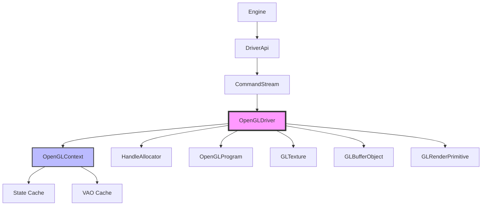
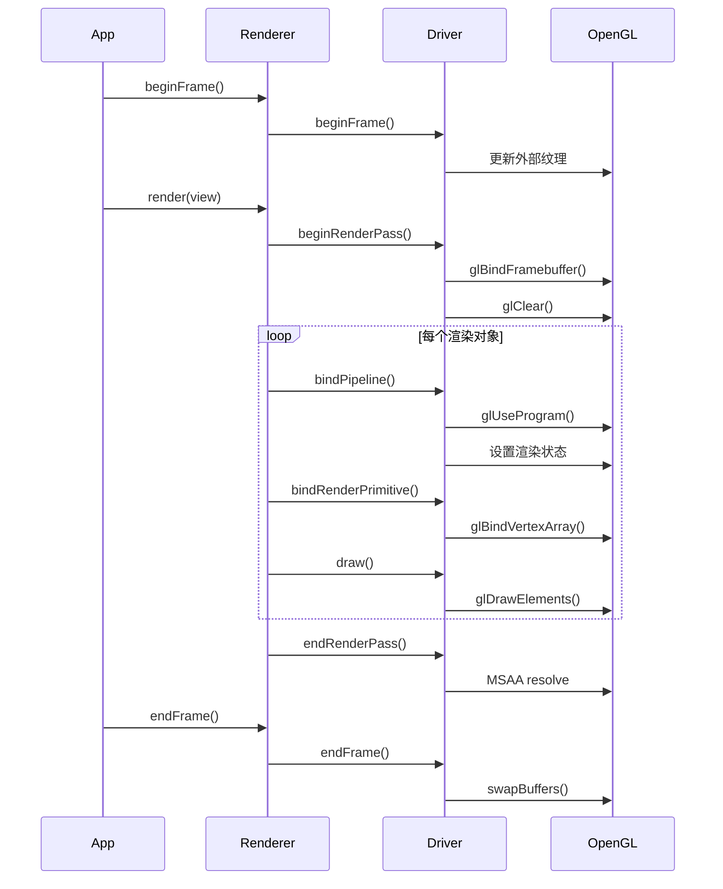
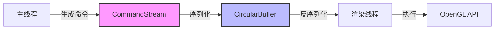

# Filament OpenGL 具体应用完整分析

## 目录
1. [概述](#概述)
2. [OpenGL 驱动架构](#opengl-驱动架构)
3. [资源管理](#资源管理)
4. [渲染流程](#渲染流程)
5. [状态管理](#状态管理)
6. [多线程支持](#多线程支持)
7. [性能优化](#性能优化)
8. [代码示例](#代码示例)

---

## 概述

Filament 的 OpenGL 后端实现了完整的 OpenGL/OpenGL ES 驱动，支持从 OpenGL ES 2.0 到桌面 OpenGL 4.1+ 的广泛版本。OpenGL 驱动是 Filament 渲染引擎的核心组件之一，负责将高级渲染命令转换为 OpenGL API 调用。

### 核心特性
- **多版本支持**：OpenGL ES 2.0/3.0/3.1 和桌面 OpenGL 4.1+
- **状态缓存**：通过 OpenGLContext 减少状态切换开销
- **多线程渲染**：命令在主线程生成，在渲染线程执行
- **资源管理**：使用 HandleAllocator 管理 GPU 资源句柄
- **着色器编译**：支持异步着色器编译和缓存

---

## OpenGL 驱动架构

### 架构图



### 类层次结构

```
Driver (接口)
  └── DriverBase (基类)
      └── OpenGLDriverBase (OpenGL 基类)
          └── OpenGLDriver (OpenGL 驱动实现)
```

### 核心组件

#### 1. OpenGLDriver
OpenGL 驱动的核心实现类，负责：
- 管理 OpenGL 上下文和状态
- 创建和管理 GPU 资源
- 执行渲染命令
- 处理帧生命周期

**关键字段**：
```cpp
class OpenGLDriver {
    OpenGLContext mContext;              // OpenGL 上下文（状态管理）
    HandleAllocator mHandleAllocator;     // 句柄分配器
    ShaderCompilerService mShaderCompiler; // 着色器编译服务
    // ... 其他资源管理器
};
```

#### 2. OpenGLContext
OpenGL 状态管理器，负责：
- 缓存 OpenGL 状态，减少状态切换
- 管理 VAO（顶点数组对象）
- 管理 FBO（帧缓冲区对象）
- 管理纹理绑定状态

**状态缓存机制**：
```cpp
class OpenGLContext {
    // 状态缓存
    State mState;                        // 当前 OpenGL 状态
    State mDefaultState;                 // 默认状态
    
    // VAO 缓存
    std::unordered_map<VAOKey, GLuint> mVAOCache;
    
    // 纹理绑定缓存
    std::array<GLuint, MAX_TEXTURE_UNITS> mTextureUnits;
};
```

---

## 资源管理

### 资源类型

#### 1. 纹理 (GLTexture)
```cpp
struct GLTexture : public HwTexture {
    GLuint texture;                      // OpenGL 纹理对象 ID
    GLenum target;                       // 纹理目标（GL_TEXTURE_2D 等）
    GLenum internalFormat;               // 内部格式
    GLenum format;                       // 像素格式
    GLenum type;                         // 数据类型
    uint32_t width, height, depth;       // 尺寸
    uint8_t levels;                      // Mip 级别数
    SamplerParams samplerParams;         // 采样器参数
};
```

**创建流程**：
```cpp
void OpenGLDriver::createTextureR(Handle<HwTexture> th, ...) {
    GLTexture* t = construct<GLTexture>(th, ...);
    
    // 生成纹理对象
    glGenTextures(1, &t->gl.id);
    
    // 绑定纹理
    gl.bindTexture(t->target, t->gl.id);
    
    // 设置纹理参数
    setTextureParameters(t->target, t->samplerParams);
    
    // 分配纹理存储
    glTexStorage2D(t->target, levels, internalFormat, width, height);
}
```

#### 2. 缓冲区对象 (GLBufferObject)
```cpp
struct GLBufferObject : public HwBufferObject {
    GLuint id;                           // OpenGL 缓冲区对象 ID
    GLenum binding;                      // 绑定目标（GL_ARRAY_BUFFER 等）
    BufferUsage usage;                   // 使用方式（STATIC/DYNAMIC/STREAM）
    uint32_t size;                       // 缓冲区大小
};
```

**创建流程**：
```cpp
void OpenGLDriver::createBufferObjectR(Handle<HwBufferObject> boh, ...) {
    GLBufferObject* bo = construct<GLBufferObject>(boh, ...);
    
    // ES 2.0 特殊处理：uniform 缓冲区使用 CPU 内存模拟
    if (bindingType == UNIFORM && gl.isES2()) {
        bo->gl.buffer = malloc(byteCount);
        memset(bo->gl.buffer, 0, byteCount);
    } else {
        // 标准 OpenGL 缓冲区创建
        glGenBuffers(1, &bo->gl.id);
        gl.bindBuffer(bo->gl.binding, bo->gl.id);
        glBufferData(bo->gl.binding, byteCount, nullptr, usage);
    }
}
```

#### 3. 顶点缓冲区 (GLVertexBuffer)
```cpp
struct GLVertexBuffer : public HwVertexBuffer {
    Handle<HwVertexBufferInfo> vbih;     // 顶点缓冲区信息句柄
    std::array<GLuint, MAX_VERTEX_ATTRIBUTE_COUNT> buffers; // 缓冲区对象 ID 数组
};
```

#### 4. 索引缓冲区 (GLIndexBuffer)
```cpp
struct GLIndexBuffer : public HwIndexBuffer {
    GLuint buffer;                       // OpenGL 索引缓冲区对象 ID
};
```

#### 5. 渲染图元 (GLRenderPrimitive)
```cpp
struct GLRenderPrimitive : public HwRenderPrimitive {
    OpenGLContext::RenderPrimitive gl;   // OpenGL VAO 状态
    Handle<HwVertexBufferInfo> vbih;     // 顶点缓冲区信息句柄
};
```

---

## 渲染流程

### 帧生命周期



### 关键方法实现

#### 1. beginFrame
```cpp
void OpenGLDriver::beginFrame(int64_t monotonic_clock_ns,
        uint32_t frameId) {
    // 更新外部纹理（如相机预览、视频流）
    updateStreams(monotonic_clock_ns);
    
    // 执行 GPU 命令完成回调
    executeGpuCommandsCompleteOps();
    
    // 执行"偶尔执行"的回调
    executeEveryNowAndThenOps();
}
```

#### 2. beginRenderPass
```cpp
void OpenGLDriver::beginRenderPass(Handle<HwRenderTarget> rth,
        const RenderPassParams& params) {
    // 获取渲染目标
    GLRenderTarget const* rt = handle_cast<GLRenderTarget*>(rth);
    
    // 绑定 FBO
    gl.bindFramebuffer(GL_FRAMEBUFFER, rt->gl.fbo);
    
    // 设置视口
    gl.viewport(params.viewport.left, params.viewport.bottom,
                params.viewport.width, params.viewport.height);
    
    // 清除缓冲区
    if (params.flags.clear) {
        clear(params.flags.discardStart, params.clearColor,
              params.clearDepth, params.clearStencil);
    }
}
```

#### 3. bindPipeline
```cpp
void OpenGLDriver::bindPipeline(PipelineState const& state) {
    // 设置光栅化状态
    setRasterState(state.rasterState);
    
    // 设置模板状态
    setStencilState(state.stencilState);
    
    // 设置多边形偏移
    gl.polygonOffset(state.polygonOffset.slope,
                     state.polygonOffset.constant);
    
    // 绑定着色器程序
    OpenGLProgram* p = handle_cast<OpenGLProgram*>(state.program);
    mValidProgram = useProgram(p);
    
    // 更新推送常量
    (*mCurrentPushConstants) = p->getPushConstants();
}
```

#### 4. draw
```cpp
void OpenGLDriver::draw(PipelineState state,
        Handle<HwRenderPrimitive> rph,
        uint32_t indexOffset, uint32_t indexCount,
        uint32_t instanceCount) {
    GLRenderPrimitive const* rp = handle_cast<GLRenderPrimitive*>(rph);
    
    // 从渲染图元获取图元类型和顶点缓冲区信息
    state.primitiveType = rp->type;
    state.vertexBufferInfo = rp->vbih;
    
    // 绑定管线
    bindPipeline(state);
    
    // 绑定渲染图元
    bindRenderPrimitive(rph);
    
    // 根据 OpenGL 版本选择绘制方法
    if (mContext.isES2()) {
        draw2GLES2(indexOffset, indexCount, instanceCount);
    } else {
        draw2(indexOffset, indexCount, instanceCount);
    }
}
```

---

## 状态管理

### OpenGLContext 状态缓存

OpenGLContext 通过状态缓存机制减少 OpenGL 状态切换开销：

```cpp
class OpenGLContext {
    struct State {
        // 光栅化状态
        struct {
            bool culling = false;
            CullingMode cullingMode = CullingMode::BACK;
            bool frontFaceCCW = true;
            bool depthTest = false;
            bool depthWrite = true;
            bool blend = false;
            BlendEquation blendEquationRGB = BlendEquation::ADD;
            BlendEquation blendEquationAlpha = BlendEquation::ADD;
            BlendFunction blendFunctionSrcRGB = BlendFunction::ONE;
            BlendFunction blendFunctionDstRGB = BlendFunction::ZERO;
            BlendFunction blendFunctionSrcAlpha = BlendFunction::ONE;
            BlendFunction blendFunctionDstAlpha = BlendFunction::ZERO;
        } raster;
        
        // 模板状态
        struct {
            bool test = false;
            StencilFunction function = StencilFunction::ALWAYS;
            uint8_t functionRef = 0;
            uint8_t functionMask = 0xFF;
            StencilOperation opStencilFail = StencilOperation::KEEP;
            StencilOperation opDepthFail = StencilOperation::KEEP;
            StencilOperation opDepthStencilPass = StencilOperation::KEEP;
        } stencil;
        
        // 深度状态
        struct {
            bool test = false;
            bool write = true;
            CompareFunc func = CompareFunc::LESS;
        } depth;
    } mState;
};
```

### 状态设置优化

```cpp
void OpenGLContext::setRasterState(const RasterState& rs) {
    auto& s = mState.raster;
    
    // 只更新改变的状态
    if (s.culling != rs.culling) {
        s.culling = rs.culling;
        if (rs.culling) {
            glEnable(GL_CULL_FACE);
        } else {
            glDisable(GL_CULL_FACE);
        }
    }
    
    if (s.cullingMode != rs.cullingMode) {
        s.cullingMode = rs.cullingMode;
        glCullFace(getCullingMode(rs.cullingMode));
    }
    
    // ... 其他状态更新
}
```

### VAO 缓存

VAO（顶点数组对象）缓存机制：

```cpp
struct VAOKey {
    Handle<HwVertexBufferInfo> vbih;
    Handle<HwIndexBuffer> ibh;
    uint32_t stateVersion;
    
    bool operator==(const VAOKey& other) const {
        return vbih == other.vbih && ibh == other.ibh &&
               stateVersion == other.stateVersion;
    }
};

std::unordered_map<VAOKey, GLuint> mVAOCache;
```

---

## 多线程支持

### 命令流架构



### 命令序列化

```cpp
// 主线程：生成命令
driverApi.draw(pipelineState, rph, indexOffset, indexCount, instanceCount);

// CommandStream：序列化命令
template<typename T>
void CommandStream::queue(CommandBase* base, T* data) {
    // 写入命令类型
    *mCurrent++ = CommandType::DRAW;
    
    // 写入命令数据
    *mCurrent++ = data;
    
    // 检查缓冲区是否已满
    if (mCurrent >= mEnd) {
        flush();
    }
}
```

### 命令执行

```cpp
// 渲染线程：执行命令
void CommandStream::execute(OpenGLDriver* driver) {
    while (mCurrent < mEnd) {
        CommandType type = *mCurrent++;
        
        switch (type) {
            case CommandType::DRAW: {
                DrawCommand* cmd = *mCurrent++;
                driver->draw(cmd->state, cmd->rph,
                            cmd->indexOffset, cmd->indexCount,
                            cmd->instanceCount);
                break;
            }
            // ... 其他命令类型
        }
    }
}
```

---

## 性能优化

### 1. 状态缓存
- **减少状态切换**：OpenGLContext 缓存所有 OpenGL 状态，只在状态改变时调用 OpenGL API
- **批量状态更新**：合并多个状态更新，减少 API 调用次数

### 2. VAO 缓存
- **重用 VAO**：相同配置的 VAO 会被缓存和重用
- **状态版本检查**：通过状态版本号检测 VAO 是否过期

### 3. 着色器编译优化
- **异步编译**：着色器在后台线程异步编译
- **编译缓存**：已编译的着色器程序会被缓存

### 4. 缓冲区更新优化
- **动态缓冲区**：频繁更新的缓冲区使用 DYNAMIC 或 STREAM 使用方式
- **缓冲区映射**：支持缓冲区映射，减少数据拷贝

### 5. 纹理绑定优化
- **纹理单元缓存**：缓存纹理单元绑定状态
- **批量绑定**：合并多个纹理绑定操作

---

## 代码示例

### 创建纹理

```cpp
// 1. 创建纹理句柄
Handle<HwTexture> texture = driverApi.createTexture(
    SamplerType::SAMPLER_2D,
    1,                          // 级别数
    TextureFormat::RGBA8,      // 格式
    1,                          // 使用标志
    1024, 1024,                 // 宽度、高度
    1,                          // 深度
    1                           // 样本数
);

// 2. 上传纹理数据
PixelBufferDescriptor desc(data, size, format, type);
driverApi.updateTexture(texture, 0, 0, 0, 1024, 1024, 1, desc);
```

### 创建顶点缓冲区

```cpp
// 1. 创建顶点缓冲区
VertexBuffer::Builder builder;
builder.vertexCount(vertexCount)
       .bufferCount(1)
       .attribute(VertexAttribute::POSITION, 0,
                  VertexBuffer::AttributeType::FLOAT3, 0)
       .attribute(VertexAttribute::COLOR, 0,
                  VertexBuffer::AttributeType::FLOAT4, 12);

VertexBuffer* vb = builder.build(*engine);

// 2. 设置缓冲区数据
VertexBuffer::BufferDescriptor bd(vertexData, vertexDataSize);
vb->setBufferAt(*engine, 0, std::move(bd));
```

### 渲染循环

```cpp
void renderFrame() {
    // 开始帧
    renderer->beginFrame(swapChain);
    
    // 渲染视图
    renderer->render(view);
    
    // 结束帧
    renderer->endFrame();
}
```

---

## 总结

Filament 的 OpenGL 驱动通过以下机制实现了高性能渲染：

1. **状态缓存**：OpenGLContext 缓存所有 OpenGL 状态，减少状态切换开销
2. **资源管理**：使用 HandleAllocator 统一管理 GPU 资源句柄
3. **多线程渲染**：命令在主线程生成，在渲染线程执行，提高 CPU 利用率
4. **性能优化**：VAO 缓存、着色器编译缓存、缓冲区更新优化等
5. **版本兼容**：支持从 OpenGL ES 2.0 到桌面 OpenGL 4.1+ 的广泛版本

这些机制使得 Filament 能够在各种 OpenGL 设备上实现高效渲染。

