# Filament PBR 实现全流程分析

## 目录

1. [概述](#概述)
2. [PBR理论基础](#pbr理论基础)
3. [Filament PBR架构](#filament-pbr架构)
4. [BRDF实现详解](#brdf实现详解)
5. [材质参数系统](#材质参数系统)
6. [光照计算系统](#光照计算系统)
7. [IBL实现](#ibl实现)
8. [着色器流程](#着色器流程)
9. [完整渲染流程](#完整渲染流程)
10. [性能优化](#性能优化)

---

## 概述

**PBR（Physically Based Rendering，物理基于渲染）**是一种基于物理的渲染方法，提供比传统实时渲染模型更准确的材料表示和光照交互。

### Filament PBR 特点

- **物理准确性**：基于物理的光照模型（Cook-Torrance微表面模型）
- **材质分离**：材质和光照分离，便于资产创作
- **多材质模型**：支持标准、次表面、布料等多种材质模型
- **IBL支持**：完整的基于图像的光照（Image Based Lighting）
- **实时性能**：优化的着色器实现，适合实时渲染

### PBR 核心概念

```
材质参数 → BRDF计算 → 光照计算 → 最终颜色

材质参数：
- baseColor（基础颜色）
- metallic（金属度）
- roughness（粗糙度）
- reflectance（反射率）

BRDF计算：
- 漫反射（Diffuse）
- 镜面反射（Specular）

光照计算：
- 直射光（Direct Light）
- 环境光（IBL）
- 阴影（Shadow）
```

---

## PBR理论基础

### 渲染方程（Rendering Equation）

**基本渲染方程**：

$$L_{out}(v) = \int_\Omega f(l, v) L_i(l) \langle n \cdot l \rangle dl$$

其中：
- $L_{out}(v)$：出射辐射度（最终颜色）
- $f(l, v)$：BRDF（双向反射分布函数）
- $L_i(l)$：入射辐射度（光照）
- $\langle n \cdot l \rangle$：Lambert余弦定律

### BRDF（双向反射分布函数）

BRDF描述表面如何反射入射光：

$$f(l, v) = f_d(l, v) + f_r(l, v)$$

- **$f_d$**：漫反射项（Diffuse）
- **$f_r$**：镜面反射项（Specular）

### Cook-Torrance 微表面模型

Filament 使用 **Cook-Torrance 微表面模型**计算镜面反射：

$$f_r(l, v) = \frac{D(h) \cdot F(v, h) \cdot G(l, v, h)}{4 \cdot (n \cdot l) \cdot (n \cdot v)}$$

其中：
- **$D(h)$**：法线分布函数（Normal Distribution Function）
- **$F(v, h)$**：菲涅耳项（Fresnel Term）
- **$G(l, v, h)$**：几何遮蔽项（Geometry Term）

### 材质参数

**标准PBR材质参数**：

| 参数 | 说明 | 范围 |
|------|------|------|
| **baseColor** | 基础颜色（漫反射/镜面反射） | [0, 1] |
| **metallic** | 金属度（0=介电质，1=导体） | [0, 1] |
| **roughness** | 粗糙度（0=光滑，1=粗糙） | [0, 1] |
| **reflectance** | 介电质反射率 | [0, 1] |

**材质分类**：

```
介电质（Dielectric，metallic=0）：
- 塑料、木材、石头等
- 漫反射：baseColor
- 镜面反射：reflectance（通常0.04）

导体（Conductor，metallic=1）：
- 金属
- 漫反射：黑色（几乎无）
- 镜面反射：baseColor（金属颜色）
```

---

## Filament PBR架构

### PBR系统架构图

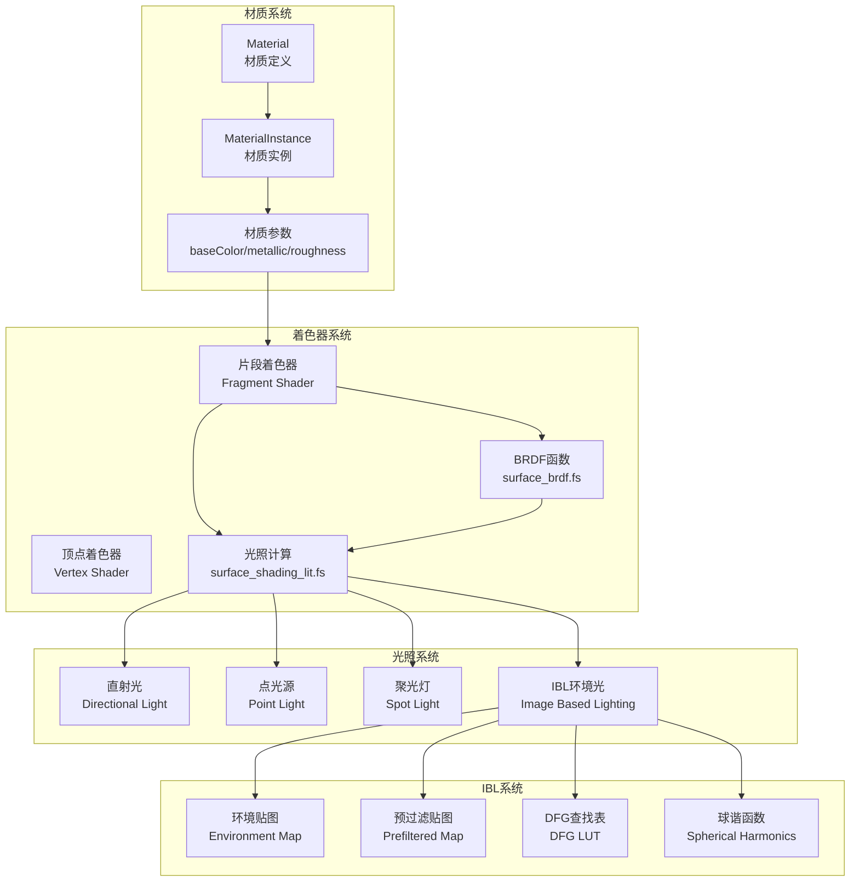

### PBR渲染流程

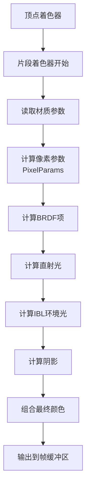

---

## BRDF实现详解

### BRDF函数结构

Filament的BRDF实现在 `shaders/src/surface_brdf.fs` 中：

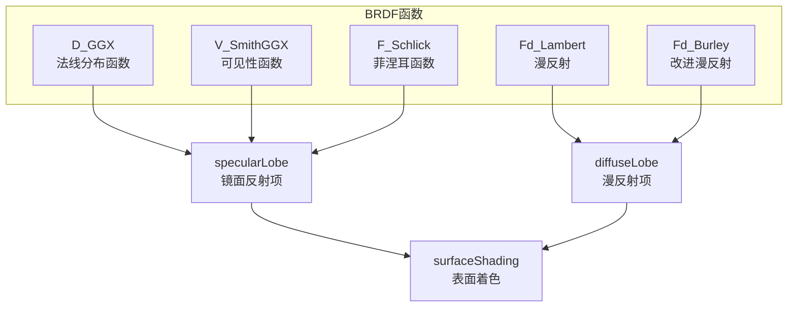

### 1. 法线分布函数（NDF）- D_GGX

**GGX分布**（Walter 2007）：

$$D_{GGX}(h) = \frac{\alpha^2}{\pi((n \cdot h)^2(\alpha^2 - 1) + 1)^2}$$

其中 $\alpha = roughness^2$

**实现代码**：

```glsl
float D_GGX(float roughness, float NoH, const vec3 h) {
    float a = NoH * roughness;
    float k = roughness / (1.0 - NoH * NoH + a * a);
    float d = k * k * (1.0 / PI);
    return d;
}
```

**特点**：
- 决定高光的**形状和宽度**
- 粗糙度越大，高光越宽
- 使用GGX分布，适合实时渲染

### 2. 几何遮蔽项（Geometry Term）- V_SmithGGX

**Smith相关可见性函数**（Heitz 2014）：

$$G(l, v, h) = \frac{G_1(l) \cdot G_1(v)}{4(n \cdot l)(n \cdot v)}$$

其中：
$$G_1(v) = \frac{2}{1 + \sqrt{1 + \alpha^2 \tan^2\theta}}$$

**实现代码**：

```glsl
float V_SmithGGXCorrelated(float roughness, float NoV, float NoL) {
    float a2 = roughness * roughness;
    float lambdaV = NoL * sqrt((NoV - a2 * NoV) * NoV + a2);
    float lambdaL = NoV * sqrt((NoL - a2 * NoL) * NoL + a2);
    float v = 0.5 / (lambdaV + lambdaL);
    return v;
}
```

**快速版本**（移动平台优化）：

```glsl
float V_SmithGGXCorrelated_Fast(float roughness, float NoV, float NoL) {
    float v = 0.5 / mix(2.0 * NoL * NoV, NoL + NoV, roughness);
    return v;
}
```

### 3. 菲涅耳项（Fresnel Term）- F_Schlick

**Schlick近似**（1994）：

$$F_{Schlick}(v, h) = f_0 + (f_{90} - f_0)(1 - (v \cdot h))^5$$

其中：
- $f_0$：垂直入射时的反射率
- $f_{90}$：掠射角时的反射率（通常为1.0）

**实现代码**：

```glsl
vec3 F_Schlick(const vec3 f0, float f90, float VoH) {
    return f0 + (f90 - f0) * pow(1.0 - VoH, 5.0);
}
```

**$f_0$计算**：

```glsl
// 介电质（非金属）
f0 = reflectance (通常0.04)

// 导体（金属）
f0 = baseColor (金属颜色)

// 混合
f0 = mix(reflectance, baseColor, metallic)
```

### 4. 漫反射项（Diffuse Term）

**Lambert漫反射**：

$$f_d = \frac{1}{\pi}$$

**Burley改进漫反射**（Disney 2012）：

$$f_d = \frac{1}{\pi} \cdot F_{Schlick}(1.0, f_{90}, n \cdot l) \cdot F_{Schlick}(1.0, f_{90}, n \cdot v)$$

其中 $f_{90} = 0.5 + 2 \cdot roughness \cdot (l \cdot h)^2$

**实现代码**：

```glsl
float Fd_Burley(float roughness, float NoV, float NoL, float LoH) {
    float f90 = 0.5 + 2.0 * roughness * LoH * LoH;
    float lightScatter = F_Schlick(1.0, f90, NoL);
    float viewScatter  = F_Schlick(1.0, f90, NoV);
    return lightScatter * viewScatter * (1.0 / PI);
}
```

### 5. 完整BRDF计算

**镜面反射项**：

```glsl
vec3 specularLobe(PixelParams pixel, Light light, vec3 h, 
                  float NoV, float NoL, float NoH, float LoH) {
    float D = distribution(pixel.roughness, NoH, h);
    float V = visibility(pixel.roughness, NoV, NoL);
    vec3 F = fresnel(pixel.f0, LoH);
    
    vec3 Fr = (D * V) * F;
    return Fr / (4.0 * NoL * NoV);
}
```

**漫反射项**：

```glsl
vec3 diffuseLobe(PixelParams pixel, float NoV, float NoL, float LoH) {
    return pixel.diffuseColor * diffuse(pixel.roughness, NoV, NoL, LoH);
}
```

**表面着色**：

```glsl
vec3 surfaceShading(PixelParams pixel, Light light, float occlusion) {
    vec3 h = normalize(view + light.l);
    float NoV = dot(normal, view);
    float NoL = saturate(dot(normal, light.l));
    float NoH = saturate(dot(normal, h));
    float LoH = saturate(dot(light.l, h));
    
    vec3 Fr = specularLobe(pixel, light, h, NoV, NoL, NoH, LoH);
    vec3 Fd = diffuseLobe(pixel, NoV, NoL, LoH);
    
    // 能量补偿（Energy Compensation）
    vec3 color = Fd + Fr * pixel.energyCompensation;
    
    return color * light.color * light.intensity * NoL * occlusion;
}
```

---

## 材质参数系统

### 材质参数结构

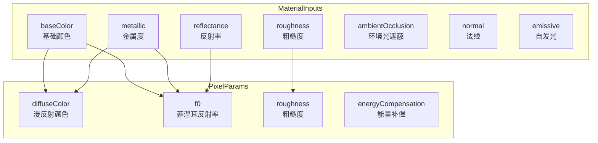

### 参数计算流程

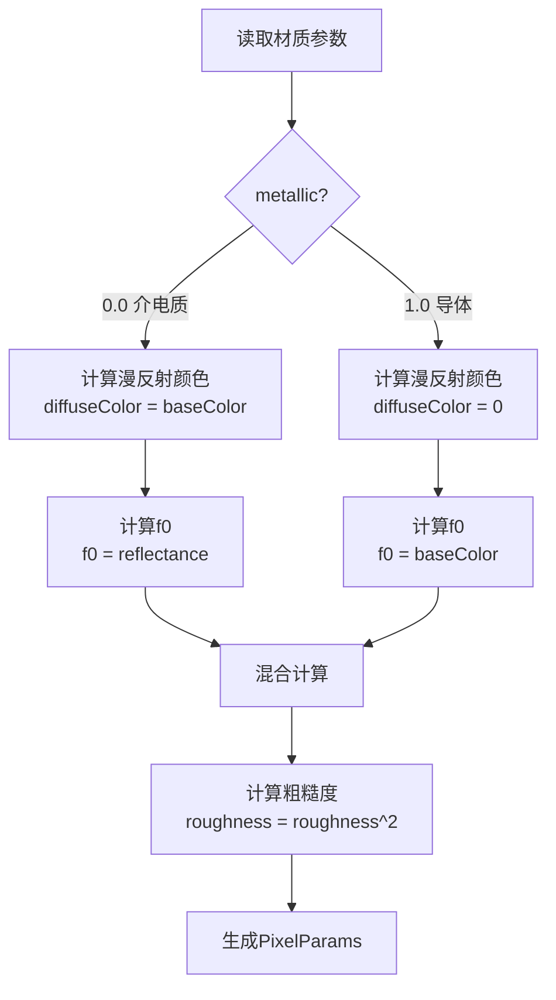

### 参数计算代码

```glsl
void getCommonPixelParams(const MaterialInputs material, inout PixelParams pixel) {
    vec4 baseColor = material.baseColor;
    
    // 计算漫反射颜色
    pixel.diffuseColor = computeDiffuseColor(baseColor, material.metallic);
    
    // 计算菲涅耳反射率f0
    float reflectance = computeDielectricF0(material.reflectance);
    pixel.f0 = computeF0(baseColor, material.metallic, reflectance);
    
    // 计算粗糙度（转换为线性粗糙度）
    pixel.roughness = perceptualRoughnessToRoughness(material.roughness);
}
```

**computeDiffuseColor**：

```glsl
vec3 computeDiffuseColor(vec4 baseColor, float metallic) {
    return baseColor.rgb * (1.0 - metallic);
}
```

**computeF0**：

```glsl
vec3 computeF0(vec3 baseColor, float metallic, float reflectance) {
    return mix(vec3(reflectance), baseColor.rgb, metallic);
}
```

---

## 光照计算系统

### 光照类型

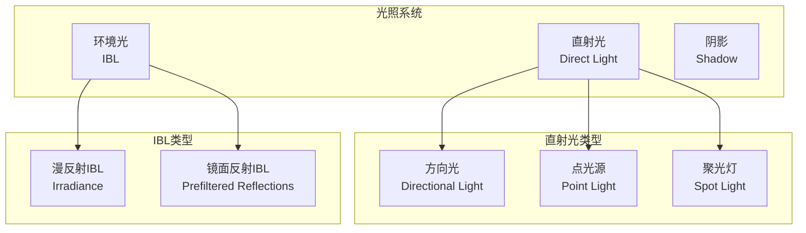

### 光照计算流程

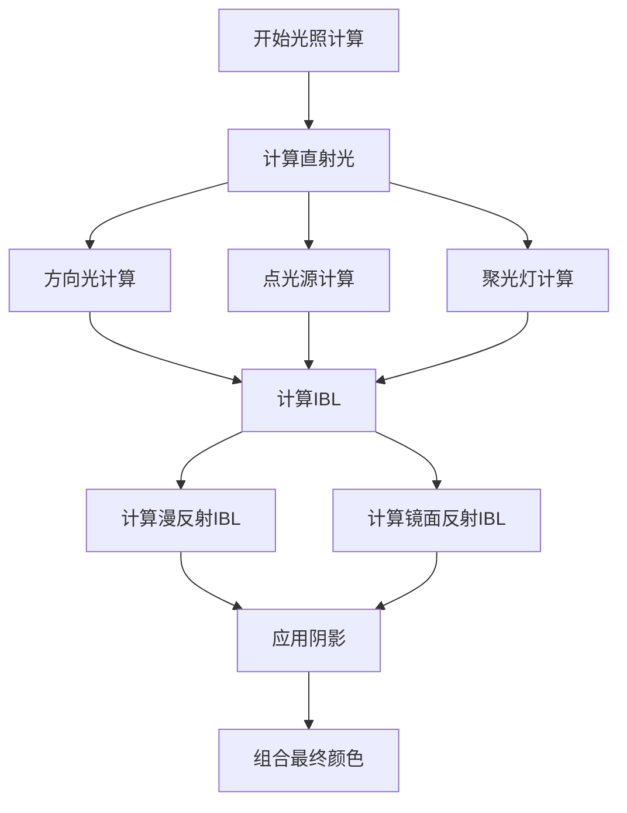

### 直射光计算

**方向光（Directional Light）**：

```glsl
void evaluateDirectionalLight(const MaterialInputs material, 
                             const PixelParams pixel, inout vec3 color) {
    Light light;
    light.color = frameUniforms.lightColor;
    light.l = frameUniforms.lightDirection;
    light.intensity = frameUniforms.lightIntensity;
    light.NoL = dot(shading_normal, light.l);
    
    float occlusion = material.ambientOcclusion;
    color += surfaceShading(pixel, light, occlusion);
}
```

**点光源（Point Light）**：

```glsl
void evaluatePunctualLights(const MaterialInputs material, 
                           const PixelParams pixel, inout vec3 color) {
    // 遍历所有点光源
    for (int i = 0; i < frameUniforms.lightCount; i++) {
        Light light;
        light.color = lights[i].color;
        light.l = normalize(lights[i].position - shading_position);
        light.intensity = lights[i].intensity;
        light.NoL = dot(shading_normal, light.l);
        
        // 距离衰减
        float distance = length(lights[i].position - shading_position);
        float attenuation = 1.0 / (distance * distance);
        light.intensity *= attenuation;
        
        float occlusion = material.ambientOcclusion;
        color += surfaceShading(pixel, light, occlusion);
    }
}
```

---

## IBL实现

### IBL概述

**IBL（Image Based Lighting）**使用环境贴图提供环境光照：

$$L_{out}(n, v) = \int_\Omega f(l, v) L_{\bot}(l) \langle n \cdot l \rangle dl$$

### IBL类型

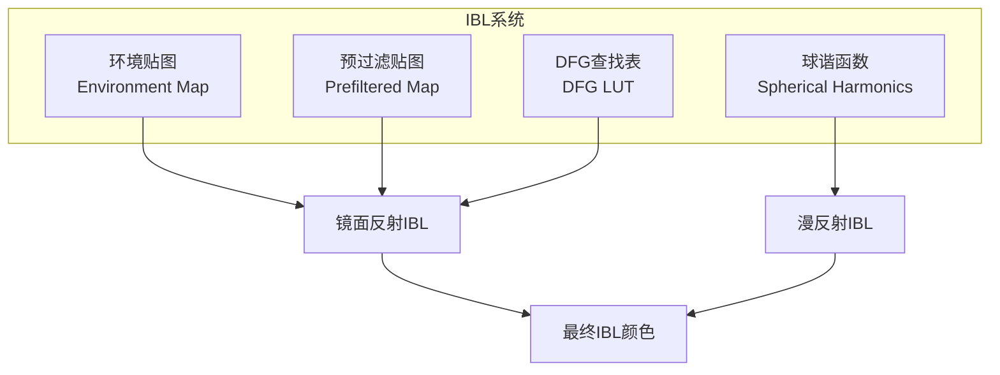

### 漫反射IBL

**使用球谐函数（Spherical Harmonics）**：

```glsl
vec3 Irradiance_SphericalHarmonics(const vec3 n) {
    vec3 result = frameUniforms.iblSH[0];
    
    if (CONFIG_SH_BANDS_COUNT >= 2) {
        result += frameUniforms.iblSH[1] * n.y;
        result += frameUniforms.iblSH[2] * n.z;
        result += frameUniforms.iblSH[3] * n.x;
    }
    
    if (CONFIG_SH_BANDS_COUNT >= 3) {
        // 更多球谐函数项...
    }
    
    return max(result, 0.0);
}
```

**使用立方体贴图**：

```glsl
vec3 Irradiance_Cubemap(const vec3 n) {
    return textureLod(sampler0_iblSH, n, 0.0).rgb;
}
```

### 镜面反射IBL

**使用预过滤环境贴图 + DFG查找表**：

```glsl
vec3 evaluateIBL(const MaterialInputs material, const PixelParams pixel, inout vec3 color) {
    float NoV = shading_NoV;
    vec3 n = shading_normal;
    vec3 r = reflect(-shading_view, n);
    
    // 计算DFG项
    vec3 dfg = prefilteredDFG(pixel.roughness, NoV);
    vec3 E = dfg.x;  // 环境BRDF的标量项
    vec3 f_avg = dfg.y;  // 平均菲涅耳项
    vec3 f_scale = dfg.z;  // 菲涅耳缩放项
    
    // 计算镜面反射
    float lod = computeLOD(pixel.roughness);
    vec3 prefilteredColor = textureLod(sampler0_iblDFG, r, lod).rgb;
    
    vec3 Fr = prefilteredColor * (pixel.f0 * f_scale + f_avg);
    
    // 计算漫反射
    vec3 diffuseIrradiance = diffuseIrradiance(n);
    vec3 Fd = pixel.diffuseColor * diffuseIrradiance * (1.0 - E);
    
    // 应用环境光遮蔽
    float ao = material.ambientOcclusion;
    Fr *= ao;
    Fd *= ao;
    
    color += Fr + Fd;
}
```

**DFG查找表**：

DFG查找表预计算了不同粗糙度和视角下的环境BRDF积分：

```glsl
vec3 prefilteredDFG(float perceptualRoughness, float NoV) {
    // LOD = sqrt(roughness) = perceptualRoughness
    return textureLod(sampler0_iblDFG, vec2(NoV, perceptualRoughness), 0.0).rgb;
}
```

### IBL预处理

IBL需要预处理才能使用：

1. **环境贴图**：HDR环境贴图（通常为立方体贴图）
2. **预过滤贴图**：不同粗糙度级别的预过滤环境贴图
3. **DFG查找表**：预计算的DFG项查找表
4. **球谐函数**：环境贴图的球谐函数表示

**预处理流程**：

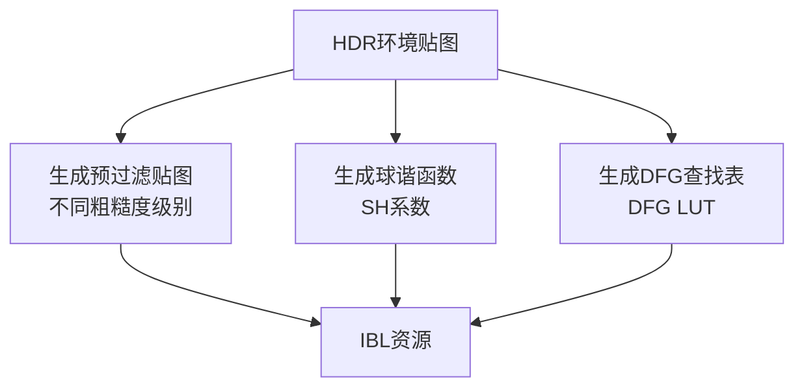

---

## 着色器流程

### 完整着色器流程

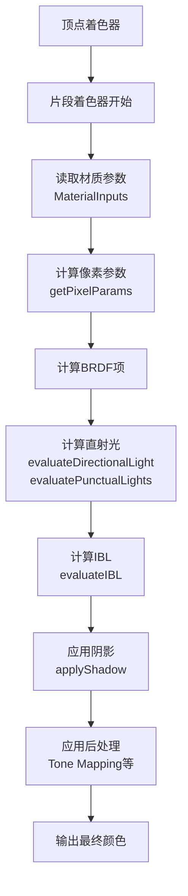

### 顶点着色器

```glsl
void main() {
    // 变换顶点位置
    vec4 position = vec4(getPosition(), 1.0);
    position = frameUniforms.clipFromWorldMatrix * position;
    gl_Position = position;
    
    // 计算世界空间法线
    shading_normal = normalize((frameUniforms.worldFromModelMatrix * 
                               vec4(getNormal(), 0.0)).xyz);
    
    // 计算世界空间位置
    shading_position = (frameUniforms.worldFromModelMatrix * 
                       vec4(getPosition(), 1.0)).xyz;
    
    // 计算UV坐标
    shading_uv = getUV0();
}
```

### 片段着色器主流程

```glsl
void main() {
    // 1. 准备材质输入
    MaterialInputs material;
    prepareMaterial(material);
    
    // 2. 计算像素参数
    PixelParams pixel;
    getPixelParams(material, pixel);
    
    // 3. 计算光照
    vec3 color = vec3(0.0);
    
    // 3.1 计算IBL（环境光）
    evaluateIBL(material, pixel, color);
    
    // 3.2 计算直射光
    #if defined(VARIANT_HAS_DIRECTIONAL_LIGHTING)
        evaluateDirectionalLight(material, pixel, color);
    #endif
    
    #if defined(VARIANT_HAS_DYNAMIC_LIGHTING)
        evaluatePunctualLights(material, pixel, color);
    #endif
    
    // 4. 添加自发光
    color += emissive(material, color.a);
    
    // 5. 输出最终颜色
    gl_FragColor = vec4(color, computeDiffuseAlpha(material.baseColor.a));
}
```

### surfaceShading函数

```glsl
vec3 surfaceShading(const PixelParams pixel, const Light light, float occlusion) {
    // 计算半向量
    vec3 h = normalize(shading_view + light.l);
    
    // 计算点积
    float NoV = shading_NoV;
    float NoL = saturate(light.NoL);
    float NoH = saturate(dot(shading_normal, h));
    float LoH = saturate(dot(light.l, h));
    
    // 计算镜面反射项
    vec3 Fr = specularLobe(pixel, light, h, NoV, NoL, NoH, LoH);
    
    // 计算漫反射项
    vec3 Fd = diffuseLobe(pixel, NoV, NoL, LoH);
    
    // 能量补偿
    vec3 color = Fd + Fr * pixel.energyCompensation;
    
    // 应用光照和遮蔽
    return color * light.color * light.intensity * NoL * occlusion;
}
```

---

## 完整渲染流程

### PBR渲染完整流程

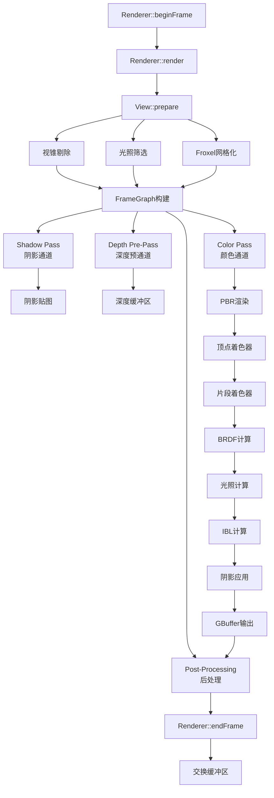

### Color Pass详细流程

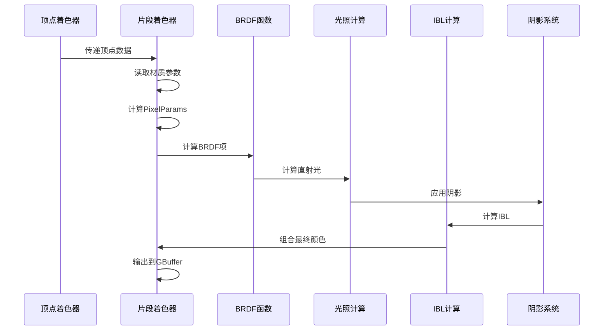

### 数据流

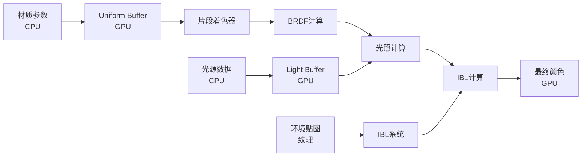

---

## 性能优化

### 1. BRDF优化

**快速版本**：

```glsl
// 标准版本（高质量）
float V_SmithGGXCorrelated(float roughness, float NoV, float NoL);

// 快速版本（移动平台）
float V_SmithGGXCorrelated_Fast(float roughness, float NoV, float NoL);
```

**质量级别**：

```glsl
#if FILAMENT_QUALITY < FILAMENT_QUALITY_HIGH
    #define BRDF_SPECULAR_V SPECULAR_V_SMITH_GGX_FAST
#else
    #define BRDF_SPECULAR_V SPECULAR_V_SMITH_GGX
#endif
```

### 2. IBL优化

**球谐函数 vs 立方体贴图**：

- **球谐函数**：内存占用小，计算快，适合漫反射
- **立方体贴图**：质量高，内存占用大，适合镜面反射

**DFG查找表**：

- 预计算DFG项，避免实时积分计算
- 使用2D查找表，查询速度快

### 3. 光照优化

**Froxel网格化**：

- 将光源分配到3D网格（Froxel）
- 只计算影响当前像素的光源
- 减少光照计算量

**光源剔除**：

- 视锥剔除
- 距离剔除
- 亮度剔除

### 4. 材质优化

**变体系统**：

- 根据材质特性生成不同的着色器变体
- 避免不必要的计算
- 减少分支

**参数打包**：

- 将相关参数打包到同一个Uniform
- 减少Uniform绑定次数
- 提高缓存效率

---

## 总结

### Filament PBR核心特点

1. **物理准确性**
   - Cook-Torrance微表面模型
   - 能量守恒
   - 正确的菲涅耳反射

2. **性能优化**
   - 快速BRDF实现
   - 预计算的IBL
   - 高效的光照系统

3. **灵活性**
   - 多种材质模型
   - 可配置的质量级别
   - 丰富的材质参数

4. **完整性**
   - 直射光 + IBL
   - 阴影支持
   - 后处理集成

### 关键文件

| 文件 | 说明 |
|------|------|
| `shaders/src/surface_brdf.fs` | BRDF函数实现 |
| `shaders/src/surface_shading_lit.fs` | 光照计算 |
| `shaders/src/surface_light_indirect.fs` | IBL实现 |
| `shaders/src/surface_shading_model_standard.fs` | 标准材质模型 |
| `filament/include/filament/Material.h` | 材质API |

### 学习路径

1. **理论基础**：理解渲染方程和BRDF
2. **实现细节**：学习BRDF函数实现
3. **材质系统**：理解材质参数和计算
4. **光照系统**：学习直射光和IBL计算
5. **优化技巧**：掌握性能优化方法

---

**文档版本**：1.0  
**最后更新**：2024年  
**作者**：Filament学习文档

