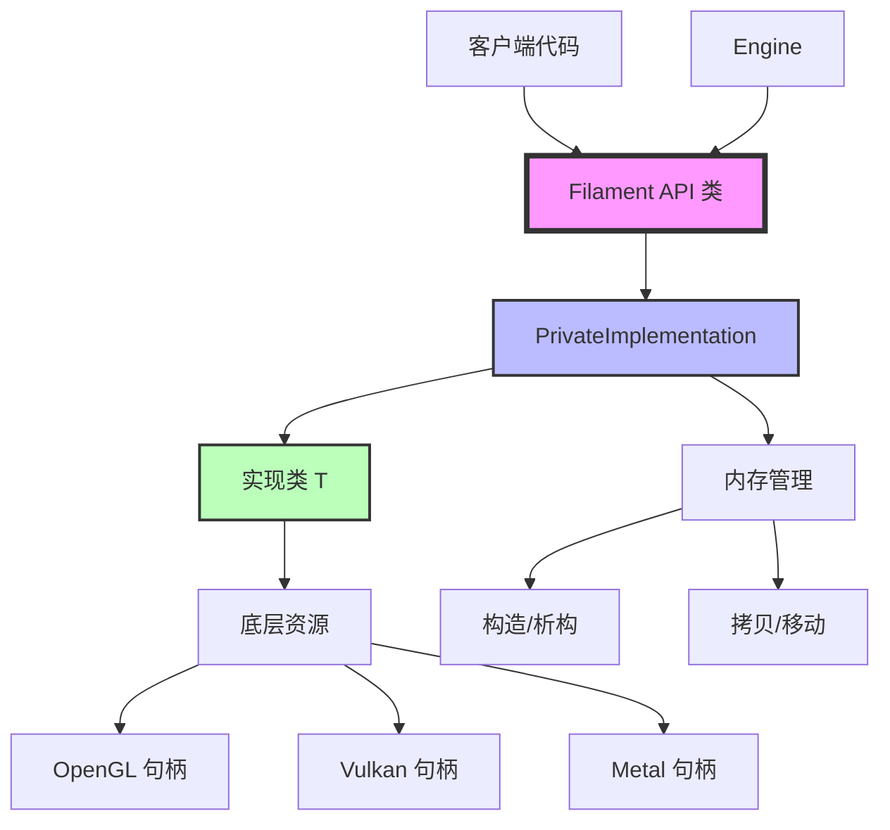

# Filament PIMPL 架构设计完整分析

## 目录
1. [概述](#概述)
2. [PIMPL 模式介绍](#pimpl-模式介绍)
3. [Filament 中的 PIMPL 实现](#filament-中的-pimpl-实现)
4. [架构设计](#架构设计)
5. [核心组件分析](#核心组件分析)
6. [使用场景](#使用场景)
7. [性能与内存分析](#性能与内存分析)
8. [优缺点分析](#优缺点分析)
9. [最佳实践](#最佳实践)
10. [代码示例](#代码示例)

---

## 概述

Filament 渲染引擎广泛使用 **PIMPL（Pointer to Implementation）** 设计模式来隐藏实现细节、提高二进制兼容性、减少编译依赖。这是 Filament 架构设计的核心模式之一。

### 核心特性
- **实现隐藏**：将实现细节与公共接口完全分离
- **ABI 兼容性**：实现变更不影响客户端二进制文件
- **编译隔离**：减少头文件依赖，加快编译速度
- **资源封装**：封装底层渲染资源（OpenGL/Vulkan/Metal 句柄）
- **模板化实现**：通过 `PrivateImplementation<T>` 模板类统一管理

---

## PIMPL 模式介绍

### 什么是 PIMPL？

**PIMPL（Pointer to Implementation）**，也称为 **Opaque Pointer（不透明指针）** 或 **Handle/Body 模式**，是一种 C++ 设计模式，通过将类的实现细节隐藏在一个指针后面来实现接口与实现的分离。

### 基本结构

```cpp
// 头文件（Public API）
class MyClass {
public:
    MyClass();
    ~MyClass();
    void doSomething();
    
private:
    class Impl;        // 前向声明，不暴露实现细节
    Impl* pImpl;       // 指向实现的指针
};

// 源文件（Implementation）
class MyClass::Impl {
    // 所有私有成员变量和方法都在这里
    int data;
    void helperFunction();
};

MyClass::MyClass() : pImpl(new Impl) {}
MyClass::~MyClass() { delete pImpl; }
void MyClass::doSomething() {
    pImpl->helperFunction();
}
```

### 设计目标

1. **编译隔离**：实现变更不触发客户端重新编译
2. **二进制兼容**：保持 ABI 稳定，支持库版本升级
3. **接口稳定**：公共头文件更简洁，接口更清晰
4. **依赖隐藏**：实现细节（包括依赖）不暴露给客户端

---

## Filament 中的 PIMPL 实现

### PrivateImplementation 模板类

Filament 通过 `utils::PrivateImplementation<T>` 模板类统一实现 PIMPL 模式：

**位置**：`libs/utils/include/utils/PrivateImplementation.h`

**核心设计**：
```cpp
template<typename T>
class PrivateImplementation {
public:
    // 构造函数（非内联，隐藏实现）
    template<typename ... ARGS>
    explicit PrivateImplementation(ARGS&& ...) noexcept;
    
    PrivateImplementation() noexcept;
    ~PrivateImplementation() noexcept;
    
    // 拷贝语义（深拷贝）
    PrivateImplementation(PrivateImplementation const& rhs) noexcept;
    PrivateImplementation& operator=(PrivateImplementation const& rhs) noexcept;
    
    // 移动语义（指针交换）
    PrivateImplementation(PrivateImplementation&& rhs) noexcept;
    PrivateImplementation& operator=(PrivateImplementation&& rhs) noexcept;

protected:
    T* mImpl = nullptr;  // 指向实现的指针
    
    // 便捷访问运算符
    inline T* operator->() noexcept { return mImpl; }
    inline T const* operator->() const noexcept { return mImpl; }
};
```

### 实现分离

**头文件**（`PrivateImplementation.h`）：
- 只包含接口声明
- 不包含实现细节
- 使用前向声明

**实现文件**（`PrivateImplementation-impl.h`）：
- 包含所有实现细节
- 通过显式实例化避免在头文件中暴露
- 实现内存管理和对象生命周期

---

## 架构设计

### 架构图



### 类层次结构

```
FilamentAPI (基类)
  ├── Texture
  │     └── PrivateImplementation<TextureImpl>
  │           └── TextureImpl (包含 OpenGL/Vulkan 句柄)
  │
  ├── Material
  │     └── PrivateImplementation<MaterialImpl>
  │           └── MaterialImpl (包含着色器、参数等)
  │
  ├── VertexBuffer
  │     └── PrivateImplementation<VertexBufferImpl>
  │           └── VertexBufferImpl (包含 GPU 缓冲区句柄)
  │
  └── ... (其他资源类)
```

### 内存布局

```
┌─────────────────────┐
│  Public API 类      │
│  (如 Texture)       │
├─────────────────────┤
│  mImpl (指针)       │ ───┐
└─────────────────────┘    │
                            │ 指向
                            ▼
                   ┌─────────────────────┐
                   │  PrivateImplementation │
                   │  <TextureImpl>       │
                   ├─────────────────────┤
                   │  mImpl (指针)       │ ───┐
                   └─────────────────────┘    │
                                               │ 指向
                                               ▼
                                      ┌─────────────────────┐
                                      │  TextureImpl        │
                                      │  (实际实现)         │
                                      ├─────────────────────┤
                                      │  glTextureId        │
                                      │  width, height      │
                                      │  format, type       │
                                      │  ...                │
                                      └─────────────────────┘
```

---

## 核心组件分析

### 1. 构造函数

#### 默认构造函数
```cpp
template<typename T>
PrivateImplementation<T>::PrivateImplementation() noexcept
    : mImpl(new T) {
}
```

**实现过程**：
1. 使用 `new` 在堆上分配 `T` 类型对象
2. 调用 `T` 的默认构造函数
3. 将指针赋值给 `mImpl`

#### 可变参数构造函数
```cpp
template<typename T>
template<typename ... ARGS>
PrivateImplementation<T>::PrivateImplementation(ARGS&& ... args) noexcept
    : mImpl(new T(std::forward<ARGS>(args)...)) {
}
```

**实现过程**：
1. 使用完美转发（`std::forward`）保持参数的值类别
2. 将参数转发给 `T` 的构造函数
3. 在堆上构造 `T` 对象

**完美转发说明**：
- 如果传入右值，转发为右值
- 如果传入左值，转发为左值引用
- 避免不必要的拷贝，提高性能

### 2. 析构函数

```cpp
template<typename T>
PrivateImplementation<T>::~PrivateImplementation() noexcept {
    delete mImpl;
}
```

**实现过程**：
1. 调用 `delete` 释放 `mImpl` 指向的内存
2. `delete` 会自动调用 `T` 的析构函数
3. 然后释放内存

**内存安全**：
- `delete nullptr` 是安全的（C++ 标准保证）
- 使用 `noexcept` 确保不抛出异常

### 3. 拷贝语义

```cpp
// 拷贝构造函数
template<typename T>
PrivateImplementation<T>::PrivateImplementation(PrivateImplementation const& rhs) noexcept
    : mImpl(new T(*rhs.mImpl)) {
}

// 拷贝赋值运算符
template<typename T>
PrivateImplementation<T>& PrivateImplementation<T>::operator=(PrivateImplementation<T> const& rhs) noexcept {
    if (this != &rhs) {
        *mImpl = *rhs.mImpl;  // 深拷贝
    }
    return *this;
}
```

**深拷贝说明**：
- 创建 `rhs.mImpl` 指向对象的完整副本
- 两个对象拥有独立的实现，互不影响
- 在渲染引擎中，可能需要复制底层资源（如纹理数据）

### 4. 移动语义

```cpp
// 移动构造函数
PrivateImplementation(PrivateImplementation&& rhs) noexcept 
    : mImpl(rhs.mImpl) { 
    rhs.mImpl = nullptr; 
}

// 移动赋值运算符
PrivateImplementation& operator=(PrivateImplementation&& rhs) noexcept {
    auto temp = mImpl;
    mImpl = rhs.mImpl;
    rhs.mImpl = temp;
    return *this;
}
```

**指针交换**：
- 移动构造：转移指针所有权，原对象置空
- 移动赋值：交换两个对象的指针
- 避免深拷贝，提高性能

### 5. 访问运算符

```cpp
inline T* operator->() noexcept { return mImpl; }
inline T const* operator->() const noexcept { return mImpl; }
```

**使用方式**：
```cpp
PrivateImplementation<MyImpl> p;
p->method();  // 等价于 p.mImpl->method()
```

---

## 使用场景

### 1. 渲染资源封装

**Texture 类示例**：
```cpp
// 头文件：filament/include/filament/Texture.h
class Texture : public FilamentAPI {
public:
    void setImage(Engine& engine, size_t level, 
                  PixelBufferDescriptor&& buffer) const;
    // ... 其他公共接口
    
private:
    struct Details;
    utils::PrivateImplementation<Details> mImpl;
};

// 实现文件：filament/src/details/Texture.cpp
struct Texture::Details {
    Handle<HwTexture> hwHandle;      // 硬件纹理句柄
    uint32_t width, height;           // 纹理尺寸
    TextureFormat format;             // 纹理格式
    SamplerType samplerType;          // 采样器类型
    // ... 其他实现细节
};
```

**优势**：
- 隐藏底层 API（OpenGL/Vulkan/Metal）细节
- 客户端代码不依赖特定渲染后端
- 实现变更不影响客户端

### 2. Material 系统

```cpp
class Material : public FilamentAPI {
private:
    struct Details;
    utils::PrivateImplementation<Details> mImpl;
};

struct Material::Details {
    MaterialKey key;                  // 材质键值
    std::vector<UniformInfo> uniforms; // 统一变量信息
    ShaderBlob shaderBlob;            // 着色器二进制数据
    // ... 材质参数、纹理绑定等
};
```

### 3. Builder 模式

```cpp
template<typename T>
using BuilderBase = utils::PrivateImplementation<T>;

class Material::Builder : public BuilderBase<MaterialBuilderImpl> {
    // Builder 实现也使用 PIMPL
};
```

---

## 性能与内存分析

### 内存开销

**每个对象的内存开销**：
```
Public API 类大小 = sizeof(PrivateImplementation<T>)
                 = sizeof(T*) 
                 = 8 字节（64位系统）
                 
实际实现对象大小 = sizeof(T)
                 = 实现类的实际大小（可能很大）
```

**总内存**：
- 对象本身：8 字节（指针）
- 实现对象：实现类的实际大小
- **额外开销**：一个指针的大小（通常可忽略）

### 性能影响

#### 优点
1. **编译速度**：减少头文件依赖，加快编译
2. **链接优化**：实现变更只需重新链接，无需重新编译客户端
3. **缓存友好**：实现对象在堆上，可能影响缓存局部性

#### 缺点
1. **间接访问**：每次访问需要一次指针解引用
2. **堆分配**：每次构造都需要堆分配（可通过对象池优化）
3. **缓存未命中**：实现对象可能在不同的内存页

### 性能优化建议

1. **对象池**：对于频繁创建/销毁的对象，使用对象池
2. **内联关键路径**：对于性能关键的方法，考虑内联实现
3. **缓存友好布局**：合理安排实现类的成员变量顺序

---

## 优缺点分析

### 优点

#### 1. 编译隔离
- **减少编译依赖**：实现变更不触发客户端重新编译
- **加快编译速度**：头文件更小，包含的依赖更少
- **并行编译**：不同模块可以并行编译

#### 2. 二进制兼容性
- **ABI 稳定**：实现变更不影响已编译的二进制文件
- **库版本升级**：可以升级库版本而无需重新编译客户端
- **接口稳定**：公共接口保持稳定

#### 3. 实现隐藏
- **封装细节**：隐藏底层实现（OpenGL/Vulkan/Metal）
- **依赖隐藏**：不暴露内部依赖给客户端
- **接口清晰**：公共接口更简洁

#### 4. 灵活性
- **多后端支持**：同一接口可以有不同的实现
- **平台特定优化**：可以为不同平台优化实现
- **测试友好**：可以轻松替换实现进行测试

### 缺点

#### 1. 性能开销
- **间接访问**：每次访问需要指针解引用
- **堆分配**：每次构造都需要堆分配
- **缓存未命中**：可能影响缓存局部性

#### 2. 内存开销
- **额外指针**：每个对象需要一个指针
- **堆碎片**：频繁分配可能导致堆碎片

#### 3. 调试复杂性
- **间接性**：调试时需要多一层间接
- **符号信息**：实现类的符号信息可能不完整

#### 4. 代码复杂性
- **模板复杂性**：模板代码可能难以理解
- **错误信息**：模板错误信息可能不友好

---

## 最佳实践

### 1. 何时使用 PIMPL

**适合使用 PIMPL 的场景**：
- ✅ 公共 API 类，需要保持 ABI 兼容性
- ✅ 实现细节复杂，包含大量私有成员
- ✅ 需要隐藏底层依赖（如渲染 API）
- ✅ 实现可能频繁变更
- ✅ 需要支持多平台/多后端

**不适合使用 PIMPL 的场景**：
- ❌ 简单的数据类（如 `vec3`、`mat4`）
- ❌ 性能关键的热路径代码
- ❌ 需要频繁访问的小对象
- ❌ 模板类（PIMPL 会增加复杂性）

### 2. 实现建议

#### 内存管理
```cpp
// ✅ 正确：使用 RAII
class MyClass {
    utils::PrivateImplementation<Details> mImpl;
    // 自动管理内存
};

// ❌ 错误：手动管理
class MyClass {
    Details* mImpl;  // 需要手动 delete
};
```

#### 异常安全
```cpp
// ✅ 正确：使用 noexcept
PrivateImplementation() noexcept;

// ❌ 错误：可能抛出异常
PrivateImplementation() {
    mImpl = new T;  // 如果失败会抛出异常
}
```

#### 拷贝语义
```cpp
// ✅ 正确：明确拷贝语义
PrivateImplementation(const PrivateImplementation& rhs) noexcept
    : mImpl(new T(*rhs.mImpl)) {}

// ❌ 错误：浅拷贝（如果不需要拷贝，应该删除）
PrivateImplementation(const PrivateImplementation& rhs)
    : mImpl(rhs.mImpl) {}  // 危险！双重释放
```

### 3. 性能优化

#### 对象池
```cpp
// 对于频繁创建的对象，使用对象池
class ObjectPool {
    std::vector<std::unique_ptr<Impl>> pool;
    // 复用对象，避免频繁分配
};
```

#### 小对象优化
```cpp
// 对于小对象，考虑不使用 PIMPL
class SmallObject {
    int data;  // 直接存储，避免间接访问
};
```

---

## 代码示例

### 完整示例：Texture 类

#### 头文件（Public API）
```cpp
// filament/include/filament/Texture.h
namespace filament {

class Texture : public FilamentAPI {
public:
    // 公共接口
    void setImage(Engine& engine, size_t level, 
                  PixelBufferDescriptor&& buffer) const;
    
    uint32_t getWidth() const noexcept;
    uint32_t getHeight() const noexcept;
    TextureFormat getFormat() const noexcept;
    
private:
    struct Details;  // 前向声明
    utils::PrivateImplementation<Details> mImpl;
    
    // 友元函数，允许访问实现
    friend class Engine;
};

} // namespace filament
```

#### 实现文件
```cpp
// filament/src/details/Texture.cpp
namespace filament {

// 实现类定义
struct Texture::Details {
    Handle<HwTexture> hwHandle;      // 硬件纹理句柄
    uint32_t width = 0;               // 纹理宽度
    uint32_t height = 0;              // 纹理高度
    TextureFormat format;             // 纹理格式
    SamplerType samplerType;          // 采样器类型
    // ... 其他实现细节
};

// 方法实现
void Texture::setImage(Engine& engine, size_t level, 
                       PixelBufferDescriptor&& buffer) const {
    auto& impl = *mImpl;  // 访问实现
    // 使用 impl 访问实现细节
    engine.getDriverApi().loadTexture(impl.hwHandle, level, buffer);
}

uint32_t Texture::getWidth() const noexcept {
    return mImpl->width;  // 通过 operator-> 访问
}

} // namespace filament
```

### Builder 模式示例

```cpp
// Material::Builder 使用 PIMPL
class Material::Builder : 
    public BuilderBase<MaterialBuilderImpl>,
    public BuilderNameMixin<Material::Builder> {
public:
    Builder& package(const void* data, size_t size);
    Material* build(Engine& engine);
    
    // BuilderBase 提供 mImpl 成员
    // 通过 mImpl-> 访问实现
};

// 使用示例
Material::Builder builder;
builder.package(data, size)
       .name("MyMaterial")
       .build(engine);
```

### 多后端支持示例

```cpp
// 同一接口，不同实现
struct Texture::Details {
    #ifdef FILAMENT_DRIVER_SUPPORTS_OPENGL
        GLuint glTextureId;
    #endif
    
    #ifdef FILAMENT_DRIVER_SUPPORTS_VULKAN
        VkImage vkImage;
        VkImageView vkImageView;
    #endif
    
    #ifdef FILAMENT_DRIVER_SUPPORTS_METAL
        id<MTLTexture> mtlTexture;
    #endif
};
```

---

## 总结

PIMPL 模式是 Filament 渲染引擎架构设计的核心模式之一，它提供了：

1. **接口与实现的完全分离**：公共接口稳定，实现可以自由变更
2. **优秀的二进制兼容性**：支持库版本升级而无需重新编译
3. **编译速度优化**：减少头文件依赖，加快编译
4. **多后端支持**：同一接口可以有不同的底层实现

虽然 PIMPL 模式带来了一些性能开销（间接访问、堆分配），但在渲染引擎这种需要稳定 API 和良好兼容性的场景中，这些开销是值得的。

Filament 通过 `PrivateImplementation<T>` 模板类统一实现了 PIMPL 模式，提供了：
- 自动内存管理（RAII）
- 完整的拷贝/移动语义
- 类型安全的实现封装
- 便捷的访问接口

这使得 Filament 的 API 既稳定又灵活，既高效又易用。

---

## 参考资料

- [Filament 源码](https://github.com/google/filament)
- `libs/utils/include/utils/PrivateImplementation.h`
- `libs/utils/include/utils/PrivateImplementation-impl.h`
- `filament/include/filament/FilamentAPI.h`

---

*文档生成时间：2024年*
*Filament 版本：最新*

