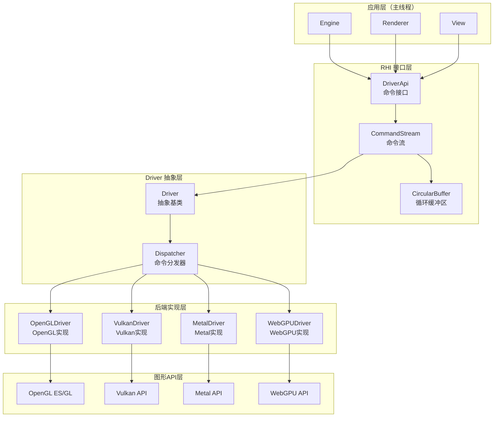
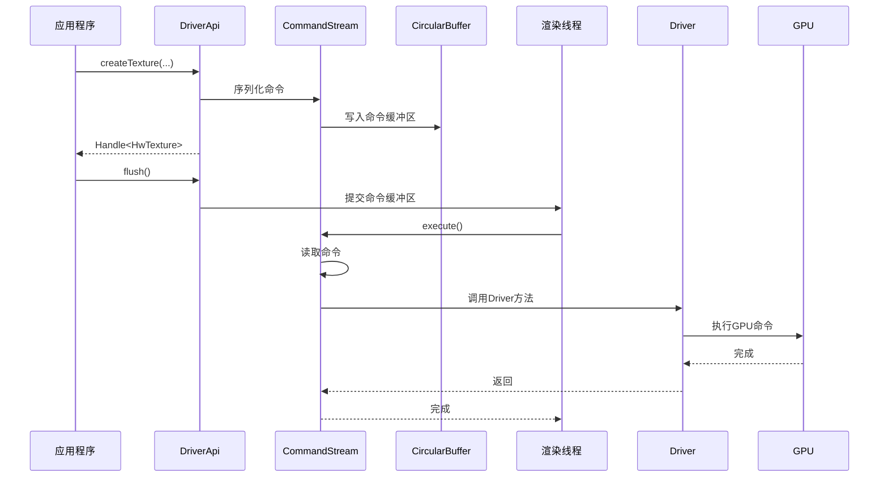
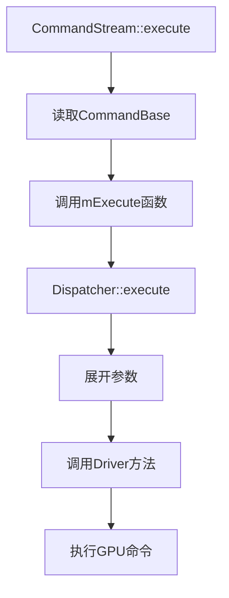
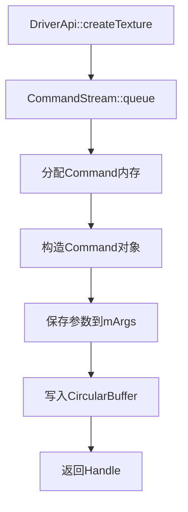
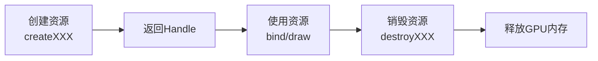

# Filament RHI 架构完整分析

## 目录

1. [概述](#概述)
2. [RHI 架构设计](#rhi-架构设计)
3. [Driver 抽象层](#driver-抽象层)
4. [DriverApi 命令接口](#driverapi-命令接口)
5. [CommandStream 命令流](#commandstream-命令流)
6. [后端实现](#后端实现)
7. [资源管理](#资源管理)
8. [性能优化](#性能优化)

---

## 概述

### RHI 定义

**RHI（Render Hardware Interface）**是 Filament 的渲染硬件接口层，负责将高级渲染命令转换为具体图形 API（OpenGL、Vulkan、Metal、WebGPU）的调用。RHI 层采用**命令流（Command Stream）**架构，实现主线程和渲染线程的解耦。

### 核心特性

1. **多后端支持**：统一接口支持 OpenGL、Vulkan、Metal、WebGPU
2. **命令流架构**：异步命令执行，主线程和渲染线程解耦
3. **资源抽象**：统一的资源句柄（Handle）系统
4. **类型安全**：使用模板和类型系统确保类型安全

### 架构优势

- **跨平台**：一套代码支持多个图形 API
- **高性能**：命令流减少线程同步开销
- **易扩展**：添加新后端只需实现 Driver 接口
- **易调试**：统一的命令流便于调试和性能分析

---

## RHI 架构设计

### 整体架构图



### 架构层次

```
┌─────────────────────────────────────────────────────────┐
│  Engine / Renderer (主线程)                              │
│  - 生成渲染命令                                          │
│  - 调用 DriverApi                                        │
└──────────────┬──────────────────────────────────────────┘
               │
               ▼
┌─────────────────────────────────────────────────────────┐
│  DriverApi (命令流接口)                                  │
│  - 序列化命令到 CircularBuffer                           │
│  - 异步执行                                              │
└──────────────┬──────────────────────────────────────────┘
               │
               ▼
┌─────────────────────────────────────────────────────────┐
│  CommandStream (命令流)                                  │
│  - 命令序列化/反序列化                                    │
│  - 命令执行调度                                          │
└──────────────┬──────────────────────────────────────────┘
               │
               ▼
┌─────────────────────────────────────────────────────────┐
│  Driver (抽象基类)                                        │
│  - 定义所有后端 API                                      │
│  - 提供虚函数接口                                        │
└──────────────┬──────────────────────────────────────────┘
               │
       ┌───────┴───────┬───────────┬──────────┐
       ▼               ▼           ▼          ▼
┌──────────┐  ┌──────────┐  ┌──────────┐  ┌──────────┐
│ OpenGL   │  │ Vulkan   │  │ Metal    │  │ WebGPU   │
│ Driver   │  │ Driver   │  │ Driver   │  │ Driver   │
└──────────┘  └──────────┘  └──────────┘  └──────────┘
```

### 数据流



---

## Driver 抽象层

### Driver 基类

**位置**：`filament/backend/include/private/backend/Driver.h`

Driver 是所有后端实现的抽象基类，定义了所有渲染 API 的接口。

**关键特性**：
- **虚函数接口**：所有 API 方法都是虚函数，由具体后端实现
- **命令流支持**：通过 `getDispatcher()` 返回命令分发器
- **调试支持**：`debugCommandBegin/End()` 用于命令调试

**主要方法分类**：

#### 1. 帧管理

```cpp
virtual void beginFrame(int64_t monotonic_clock_ns, 
                       int64_t refreshIntervalNs, 
                       backend::FrameScheduledCallback callback, 
                       void* user) = 0;
virtual void endFrame(uint32_t frameId) = 0;
virtual void flush() = 0;
virtual void finish() = 0;
virtual void tick(int64_t monotonic_clock_ns) = 0;
```

#### 2. 资源创建

```cpp
virtual Handle<HwVertexBuffer> createVertexBuffer(
    VertexBuffer::Builder const& builder) = 0;
virtual Handle<HwIndexBuffer> createIndexBuffer(
    IndexBuffer::Builder const& builder) = 0;
virtual Handle<HwTexture> createTexture(
    SamplerType target, uint8_t levels,
    TextureFormat format, uint8_t samples,
    uint32_t width, uint32_t height, uint32_t depth,
    TextureUsage usage) = 0;
virtual Handle<HwRenderTarget> createRenderTarget(
    TargetBufferFlags targetBufferFlags,
    uint32_t width, uint32_t height,
    uint8_t samples, TargetBufferInfo color,
    TargetBufferInfo depth, TargetBufferInfo stencil) = 0;
virtual Handle<HwProgram> createProgram(
    Program::Builder const& builder) = 0;
virtual Handle<HwSamplerGroup> createSamplerGroup(
    size_t count) = 0;
```

#### 3. 资源更新

```cpp
virtual void updateBufferObject(Handle<HwBufferObject> handle,
                               BufferDescriptor&& data,
                               uint32_t byteOffset) = 0;
virtual void update3DImage(Handle<HwTexture> handle,
                          uint32_t level, uint32_t xoffset,
                          uint32_t yoffset, uint32_t zoffset,
                          uint32_t width, uint32_t height,
                          uint32_t depth,
                          PixelBufferDescriptor&& data) = 0;
virtual void updateSamplerGroup(Handle<HwSamplerGroup> handle,
                               SamplerGroup const& samplerGroup) = 0;
```

#### 4. 渲染命令

```cpp
virtual void beginRenderPass(Handle<HwRenderTarget> renderTarget,
                            const RenderPassParams& params) = 0;
virtual void endRenderPass() = 0;
virtual void setViewport(Viewport const& viewport) = 0;
virtual void setScissor(uint32_t left, uint32_t bottom,
                       uint32_t width, uint32_t height) = 0;
virtual void draw(PipelineState const& pipelineState,
                 Handle<HwRenderPrimitive> rph) = 0;
virtual void drawIndexed(PipelineState const& pipelineState,
                        Handle<HwRenderPrimitive> rph,
                        uint32_t indexOffset, uint32_t indexCount) = 0;
```

### Dispatcher 分发器

**位置**：`filament/backend/include/private/backend/Dispatcher.h`

Dispatcher 负责将命令分发到对应的 Driver 方法。

**工作原理**：

```cpp
class Dispatcher {
public:
    using Execute = void(*)(Driver&, CommandBase*, intptr_t*);
    
    // 获取方法的执行函数
    template<void(Driver::*METHOD)(ARGS...)>
    static Execute getExecute() {
        return &CommandType<void(Driver::*)(ARGS...)>::
            template Command<METHOD>::execute;
    }
    
    // 执行命令
    void execute(Driver& driver, CommandBase* cmd) {
        cmd->execute(driver);
    }
};
```

**命令分发流程**：



---

## DriverApi 命令接口

### DriverApi 设计

**位置**：`filament/backend/include/private/backend/DriverApi.h`

DriverApi 是主线程访问 Driver 的接口，所有调用都被序列化到命令流。

**关键特性**：
- **命令序列化**：所有调用都被序列化到 CircularBuffer
- **异步执行**：命令在渲染线程执行
- **内存分配**：提供 `allocate()` 方法在命令流中分配内存

**接口定义**：

```cpp
class DriverApi {
public:
    // 资源创建（返回句柄）
    Handle<HwVertexBuffer> createVertexBuffer(...);
    Handle<HwIndexBuffer> createIndexBuffer(...);
    Handle<HwTexture> createTexture(...);
    Handle<HwRenderTarget> createRenderTarget(...);
    Handle<HwProgram> createProgram(...);
    
    // 资源更新（异步）
    void updateBufferObject(Handle<HwBufferObject> handle, ...);
    void update3DImage(Handle<HwTexture> handle, ...);
    void updateSamplerGroup(Handle<HwSamplerGroup> handle, ...);
    
    // 渲染命令（异步）
    void beginRenderPass(Handle<HwRenderTarget> renderTarget, ...);
    void endRenderPass();
    void draw(PipelineState const& pipelineState, ...);
    
    // 帧管理
    void beginFrame(...);
    void endFrame(uint32_t frameId);
    void flush();
    void finish();
    
    // 内存分配
    void* allocate(size_t size, size_t alignment);
};
```

### 命令序列化

**命令结构**：

```cpp
template<void(Driver::*METHOD)(ARGS...)>>
class Command : public CommandBase {
    std::tuple<std::remove_reference_t<ARGS>...> mArgs;  // 保存参数
    
public:
    // 构造函数：保存参数
    template<typename... A>
    Command(A&&... args) : CommandBase(execute), mArgs(std::forward<A>(args)...) {}
    
    // 执行函数：展开参数并调用 Driver 方法
    static void execute(Driver& driver, CommandBase* base, intptr_t* next) {
        Command* self = static_cast<Command*>(base);
        *next = align(sizeof(Command));
        
        // 使用 apply 展开参数并调用方法
        apply(METHOD, driver, std::move(self->mArgs));
        
        self->~Command();
    }
};
```

**序列化流程**：



---

## CommandStream 命令流

### CommandStream 设计

**位置**：`filament/backend/include/private/backend/CommandStream.h`

CommandStream 负责命令的序列化和执行。

**关键组件**：

1. **CircularBuffer**：命令存储缓冲区
2. **Dispatcher**：命令分发器
3. **Command 模板**：命令类型系统

**命令执行流程**：

```cpp
void CommandStream::execute(void* buffer) {
    // 1. 启动性能分析器（如果启用）
    Profiler* profiler = mDriver.getProfiler();
    if (profiler) {
        profiler->start();
    }
    
    // 2. 通过 Driver::execute() 包装执行
    mDriver.execute([this, buffer]() {
        CommandBase* cmd = static_cast<CommandBase*>(buffer);
        
        // 3. 循环执行所有命令
        while (cmd) {
            cmd = cmd->execute(mDriver);
        }
    });
    
    // 4. 停止性能分析器
    if (profiler) {
        profiler->stop();
    }
}
```

### CircularBuffer 循环缓冲区

**位置**：`filament/backend/src/CircularBuffer.cpp`

CircularBuffer 是命令流的存储缓冲区，采用循环缓冲区设计。

**特性**：
- **双缓冲**：写入和读取可以并行进行
- **自动扩容**：当空间不足时自动分配新缓冲区
- **内存管理**：自动管理缓冲区的生命周期

**实现**：

```cpp
class CircularBuffer {
private:
    void* mBegin;      // 缓冲区起始地址
    void* mEnd;        // 缓冲区结束地址
    void* mWrite;      // 写入指针
    void* mRead;       // 读取指针（渲染线程）
    
public:
    // 分配内存
    void* allocate(size_t size, size_t alignment) {
        // 对齐写入指针
        void* ptr = align(mWrite, alignment);
        
        // 检查空间是否足够
        if (ptr + size > mEnd) {
            // 扩容或等待
            grow();
        }
        
        mWrite = ptr + size;
        return ptr;
    }
    
    // 提交到渲染线程
    void commit() {
        // 交换读写缓冲区
        swap(mRead, mWrite);
    }
};
```

---

## 后端实现

### OpenGL Driver

**位置**：`filament/backend/src/opengl/OpenGLDriver.cpp`

OpenGL Driver 实现 OpenGL/OpenGL ES 后端。

**关键特性**：
- **状态管理**：维护 OpenGL 状态机
- **扩展检测**：检测并启用 OpenGL 扩展
- **错误检查**：检查 OpenGL 错误

**实现示例**：

```cpp
class OpenGLDriver : public Driver {
public:
    Handle<HwTexture> createTexture(SamplerType target, ...) override {
        GLuint textureId;
        glGenTextures(1, &textureId);
        glBindTexture(target, textureId);
        glTexImage2D(target, level, format, width, height, ...);
        return Handle<HwTexture>(textureId);
    }
    
    void draw(PipelineState const& pipelineState, ...) override {
        // 设置 OpenGL 状态
        setPipelineState(pipelineState);
        
        // 绑定资源
        bindResources(pipelineState);
        
        // 执行绘制
        glDrawElements(mode, count, type, indices);
    }
};
```

### Vulkan Driver

**位置**：`filament/backend/src/vulkan/VulkanDriver.cpp`

Vulkan Driver 实现 Vulkan 后端。

**关键特性**：
- **命令缓冲区**：使用 VkCommandBuffer 记录命令
- **描述符集**：管理 VkDescriptorSet
- **同步**：使用 VkSemaphore 和 VkFence 同步

**实现示例**：

```cpp
class VulkanDriver : public Driver {
public:
    Handle<HwTexture> createTexture(...) override {
        VkImageCreateInfo info = {};
        info.imageType = VK_IMAGE_TYPE_2D;
        info.format = convertFormat(format);
        info.extent = {width, height, depth};
        
        VkImage image;
        vkCreateImage(mDevice, &info, nullptr, &image);
        
        return Handle<HwTexture>(image);
    }
    
    void draw(PipelineState const& pipelineState, ...) override {
        // 记录到命令缓冲区
        vkCmdBindPipeline(mCommandBuffer, 
                         VK_PIPELINE_BIND_POINT_GRAPHICS,
                         pipelineState.pipeline);
        vkCmdDrawIndexed(mCommandBuffer, indexCount, ...);
    }
};
```

### Metal Driver

**位置**：`filament/backend/src/metal/MetalDriver.cpp`

Metal Driver 实现 Metal 后端。

**关键特性**：
- **命令编码器**：使用 MTLRenderCommandEncoder
- **资源绑定**：使用 MTLBuffer 和 MTLTexture
- **着色器库**：使用 MTLLibrary 管理着色器

### WebGPU Driver

**位置**：`filament/backend/src/webgpu/WebGPUDriver.cpp`

WebGPU Driver 实现 WebGPU 后端。

**关键特性**：
- **命令编码器**：使用 GPUCommandEncoder
- **资源绑定**：使用 GPUBuffer 和 GPUTexture
- **着色器模块**：使用 GPUShaderModule

---

## 资源管理

### Handle 系统

Filament 使用类型安全的 Handle 系统管理 GPU 资源。

**Handle 定义**：

```cpp
template<typename T>
class Handle {
private:
    uint32_t mId;  // 资源 ID
    
public:
    Handle() : mId(0) {}
    explicit Handle(uint32_t id) : mId(id) {}
    
    bool isValid() const { return mId != 0; }
    uint32_t getId() const { return mId; }
    
    bool operator==(Handle<T> other) const { return mId == other.mId; }
    bool operator!=(Handle<T> other) const { return mId != other.mId; }
};
```

**资源类型**：

- `Handle<HwVertexBuffer>`：顶点缓冲区
- `Handle<HwIndexBuffer>`：索引缓冲区
- `Handle<HwTexture>`：纹理
- `Handle<HwRenderTarget>`：渲染目标
- `Handle<HwProgram>`：着色器程序
- `Handle<HwSamplerGroup>`：采样器组

### 资源生命周期



---

## 性能优化

### 1. 命令批处理

**批处理策略**：
- 多个命令打包到一个命令缓冲区
- 减少命令流切换开销
- 提高 GPU 利用率

### 2. 状态缓存

**状态管理**：
- 缓存 OpenGL 状态，避免冗余设置
- 只在状态改变时更新
- 减少状态切换开销

### 3. 资源池化

**资源复用**：
- 复用临时资源（如临时纹理）
- 减少分配/释放开销
- 提高内存利用率

### 4. 异步执行

**异步策略**：
- 命令在渲染线程异步执行
- 主线程不阻塞
- 提高并行度

---

## 总结

### RHI 架构特点

1. **统一接口**
   - 一套 API 支持多个后端
   - 类型安全的 Handle 系统
   - 清晰的资源生命周期管理

2. **命令流架构**
   - 主线程和渲染线程解耦
   - 异步命令执行
   - 减少线程同步开销

3. **易于扩展**
   - 添加新后端只需实现 Driver 接口
   - 命令系统自动处理序列化
   - 统一的调试和性能分析接口

### 关键文件

| 文件 | 说明 |
|------|------|
| `filament/backend/include/private/backend/Driver.h` | Driver 抽象基类 |
| `filament/backend/include/private/backend/DriverApi.h` | DriverApi 接口 |
| `filament/backend/include/private/backend/CommandStream.h` | CommandStream 实现 |
| `filament/backend/src/opengl/OpenGLDriver.cpp` | OpenGL 后端 |
| `filament/backend/src/vulkan/VulkanDriver.cpp` | Vulkan 后端 |
| `filament/backend/src/metal/MetalDriver.cpp` | Metal 后端 |
| `filament/backend/src/webgpu/WebGPUDriver.cpp` | WebGPU 后端 |

---

**文档版本**：1.0  
**最后更新**：2024年  
**作者**：Filament学习文档

