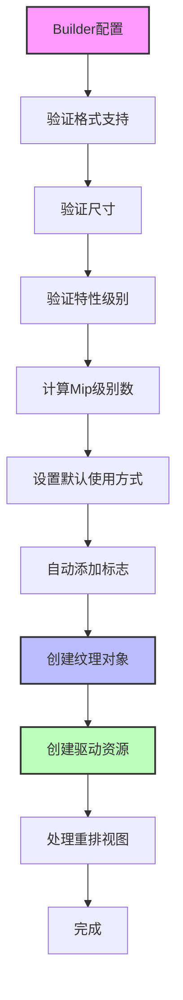
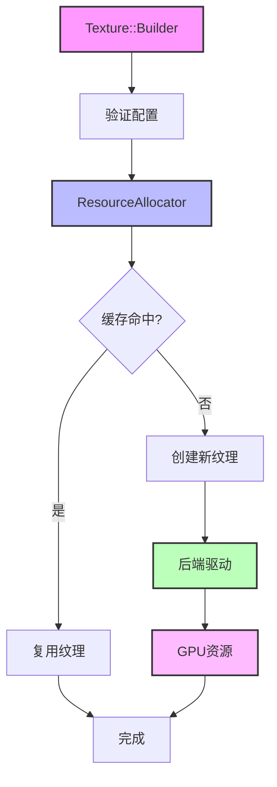
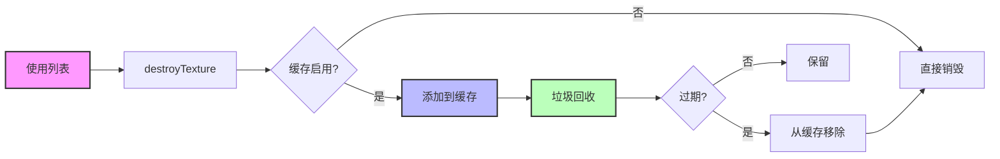

# Filament Texture 架构完整分析

## 目录
1. [概述](#概述)
2. [纹理类型体系](#纹理类型体系)
3. [纹理创建与配置](#纹理创建与配置)
4. [纹理数据上传](#纹理数据上传)
5. [Mipmap 生成](#mipmap-生成)
6. [纹理缓存与资源管理](#纹理缓存与资源管理)
7. [纹理格式与压缩](#纹理格式与压缩)
8. [外部纹理与流式纹理](#外部纹理与流式纹理)
9. [后端实现差异](#后端实现差异)
10. [性能优化策略](#性能优化策略)
11. [架构图](#架构图)

---

## 概述

Filament 的纹理系统提供了统一的纹理管理接口，支持多种纹理类型（2D、3D、Cube、Array）、格式（压缩/非压缩）、使用方式（采样、渲染目标、上传），并实现了高效的缓存和资源管理。

### 核心设计原则

1. **统一抽象**：通过 Driver API 抽象不同后端的纹理实现
2. **延迟分配**：通过 ResourceAllocator 实现纹理缓存和复用
3. **格式转换**：自动处理格式转换和压缩
4. **异步上传**：支持异步纹理数据上传

### 关键组件

- **FTexture**：纹理对象，管理纹理生命周期
- **ResourceAllocator**：纹理缓存和资源分配器
- **TextureBuilder**：构建器模式，配置纹理参数
- **后端驱动**：OpenGL/Vulkan/Metal/WebGPU 的具体实现

---

## 纹理类型体系

### 1. 纹理采样器类型（SamplerType）

**定义**：定义纹理的维度和平铺方式

**类型**：

```cpp
enum class SamplerType {
    SAMPLER_2D,              // 2D 纹理
    SAMPLER_3D,              // 3D 纹理
    SAMPLER_CUBEMAP,         // 立方体贴图
    SAMPLER_2D_ARRAY,        // 2D 数组纹理
    SAMPLER_CUBEMAP_ARRAY,   // 立方体贴图数组
    SAMPLER_EXTERNAL,        // 外部纹理（相机预览等）
};
```

**特性级别要求**：

| 类型 | 特性级别要求 |
|------|-------------|
| SAMPLER_2D | FEATURE_LEVEL_0 |
| SAMPLER_CUBEMAP | FEATURE_LEVEL_0 |
| SAMPLER_EXTERNAL | FEATURE_LEVEL_0 |
| SAMPLER_3D | FEATURE_LEVEL_1 |
| SAMPLER_2D_ARRAY | FEATURE_LEVEL_1 |
| SAMPLER_CUBEMAP_ARRAY | FEATURE_LEVEL_2 |

### 2. 纹理使用方式（TextureUsage）

**定义**：定义纹理的用途，影响内存布局和优化

**标志位**：

```cpp
enum class TextureUsage : uint8_t {
    NONE = 0x0,                    // 无使用方式
    DEFAULT = 0x1,                 // 默认（可采样）
    SAMPLEABLE = 0x2,              // 可采样（着色器中可读取）
    COLOR_ATTACHMENT = 0x4,        // 颜色附件（渲染目标）
    DEPTH_ATTACHMENT = 0x8,        // 深度附件（深度缓冲区）
    STENCIL_ATTACHMENT = 0x10,     // 模板附件（模板缓冲区）
    UPLOADABLE = 0x20,             // 可上传（CPU 可写入）
    BLIT_SRC = 0x40,               // Blit 源（readPixels 等）
    BLIT_DST = 0x80,               // Blit 目标
    GEN_MIPMAPPABLE = 0x100,       // 可生成 Mipmap
    PROTECTED = 0x200,             // 受保护内存（DRM 内容）
};
```

**组合使用**：

```cpp
// 可采样且可上传
Usage usage = Usage::SAMPLEABLE | Usage::UPLOADABLE;

// 渲染目标（颜色附件）
Usage usage = Usage::COLOR_ATTACHMENT;

// 可采样且可生成 Mipmap
Usage usage = Usage::SAMPLEABLE | Usage::GEN_MIPMAPPABLE;
```

### 3. 纹理格式（TextureFormat）

**定义**：定义纹理的内部存储格式

**分类**：

#### 非压缩格式

```cpp
// 8 位格式
RGBA8, RGB8, RG8, R8
SRGB8_A8, SRGB8

// 16 位格式
RGBA16F, RGB16F, RG16F, R16F
RGBA16UI, RGB16UI, RG16UI, R16UI

// 32 位格式
RGBA32F, RGB32F, RG32F, R32F
RGBA32UI, RGB32UI, RG32UI, R32UI

// 特殊格式
R11F_G11F_B10F  // 11+11+10 位浮点（HDR）
RGB10_A2         // 10+10+10+2 位（HDR）
DEPTH16, DEPTH24, DEPTH32F  // 深度格式
DEPTH24_STENCIL8, DEPTH32F_STENCIL8  // 深度+模板格式
```

#### 压缩格式

```cpp
// DXT/BC 压缩
DXT1_RGB, DXT1_RGBA
DXT3_RGBA, DXT5_RGBA
BC4_R, BC5_RG
BC6H_RGBF, BC6H_RGBUF
BC7_RGBA

// ETC2 压缩
ETC2_RGB8, ETC2_RGB8_A1, ETC2_RGBA8
ETC2_EAC_R11, ETC2_EAC_RG11

// ASTC 压缩
ASTC_4x4_RGBA, ASTC_5x4_RGBA, ...
ASTC_8x8_RGBA, ASTC_12x12_RGBA

// 其他
RGB_ETC1, RGB_PVRTC_2BPPV1, RGB_PVRTC_4BPPV1
```

### 4. 纹理数据结构

```cpp
struct FTexture {
    uint32_t mWidth;           // 宽度
    uint32_t mHeight;          // 高度
    uint32_t mDepth;           // 深度（3D/Array）
    TextureFormat mFormat;      // 格式
    TextureUsage mUsage;        // 使用方式
    SamplerType mTarget;        // 采样器类型
    uint8_t mLevelCount;        // Mip 级别数
    uint8_t mSampleCount;       // 采样数（MSAA）
    TextureSwizzle mSwizzle[4]; // 通道重排
    Handle<HwTexture> mHandle;  // 纹理句柄
    Handle<HwTexture> mHandleForSampling;  // 采样句柄（可能被重排视图替换）
    bool mExternal;             // 是否外部纹理
    bool mHasBlitSrc;           // 是否有 Blit 源标志
};
```

---

## 纹理创建与配置

### 1. Builder 模式

**使用示例**：

```cpp
Texture* texture = Texture::Builder()
    .width(1024)
    .height(1024)
    .levels(0xff)  // 自动计算 Mip 级别数
    .sampler(Texture::Sampler::SAMPLER_2D)
    .format(Texture::InternalFormat::SRGB8_A8)
    .usage(Texture::Usage::DEFAULT | Texture::Usage::GEN_MIPMAPPABLE)
    .build(engine);
```

### 2. 构建流程



### 3. 验证步骤

#### 格式支持验证

```cpp
FILAMENT_CHECK_PRECONDITION(
    Texture::isTextureFormatSupported(engine, format))
    << "Texture format not supported";
```

#### 尺寸验证

```cpp
size_t maxSize = Texture::getMaxTextureSize(engine, target);
FILAMENT_CHECK_PRECONDITION(
    width <= maxSize && height <= maxSize)
    << "Texture dimensions out of range";
```

#### Mip 级别数计算

```cpp
uint8_t maxLevelCount = FTexture::maxLevelCount(width, height);
// maxLevelCount = floor(log2(max(width, height))) + 1
levels = std::min(levels, maxLevelCount);
```

### 4. 自动标志添加

#### GEN_MIPMAPPABLE

```cpp
// 如果满足以下条件，自动添加 GEN_MIPMAPPABLE：
// - 格式可生成 Mipmap
// - 级别数 > 1
// - 尺寸 > 1
// - 非外部纹理
if (formatGenMipmappable && levels > 1 && 
    (width > 1 || height > 1) && !external) {
    usage |= Usage::GEN_MIPMAPPABLE;
}
```

#### BLIT_SRC

```cpp
// 如果纹理是颜色附件，自动添加 BLIT_SRC（用于 readPixels）
if (usage & Usage::COLOR_ATTACHMENT) {
    usage |= Usage::BLIT_SRC;
}
```

### 5. 纹理创建

```cpp
FTexture::FTexture(FEngine& engine, const Builder& builder) {
    // 1. 保存参数
    mWidth = builder->mWidth;
    mHeight = builder->mHeight;
    mFormat = builder->mFormat;
    // ...
    
    // 2. 处理外部纹理
    if (mExternal && !isImported) {
        // 延迟创建，在 setExternalImage() 中创建
        return;
    }
    
    // 3. 创建驱动资源
    if (!isImported) {
        mHandle = driver.createTexture(
            mTarget, mLevelCount, mFormat, mSampleCount,
            mWidth, mHeight, mDepth, mUsage, tag);
    } else {
        mHandle = driver.importTexture(
            builder->mImportedId, ...);
    }
    
    // 4. 处理重排视图
    if (builder->mTextureIsSwizzled) {
        auto swizzleView = driver.createTextureViewSwizzle(
            mHandle, swizzle[0], swizzle[1], 
            swizzle[2], swizzle[3]);
        driver.destroyTexture(mHandle);
        mHandle = swizzleView;
    }
    
    mHandleForSampling = mHandle;
}
```

---

## 纹理数据上传

### 1. PixelBufferDescriptor

**定义**：描述像素缓冲区的格式、类型、对齐、步长等

**数据结构**：

```cpp
struct PixelBufferDescriptor {
    void* buffer;              // 数据指针
    size_t size;               // 数据大小（字节）
    PixelDataFormat format;    // 像素格式（RGB/RGBA 等）
    PixelDataType type;        // 数据类型（UBYTE/FLOAT 等）
    uint8_t alignment;        // 对齐（1/2/4/8 字节）
    uint32_t left;            // 左偏移
    uint32_t top;             // 上偏移
    uint32_t stride;          // 行步长（0 = 紧凑）
    std::function<void()> callback;  // 完成回调
};
```

### 2. setImage() 方法

**功能**：上传像素数据到纹理

**使用示例**：

```cpp
// 创建像素缓冲区描述符
Texture::PixelBufferDescriptor descriptor(
    pixelData,                    // 数据指针
    pixelDataSize,                // 数据大小
    Texture::Format::RGBA,        // 格式
    Texture::Type::UBYTE,         // 类型
    [](void* buffer, size_t size, void* user) {
        // 上传完成回调
        free(buffer);
    }
);

// 上传到 Mip 级别 0
texture->setImage(engine, 0, std::move(descriptor));
```

**实现流程**：

```cpp
void FTexture::setImage(FEngine& engine, size_t level,
                        uint32_t xoffset, uint32_t yoffset, uint32_t zoffset,
                        uint32_t width, uint32_t height, uint32_t depth,
                        PixelBufferDescriptor&& p) {
    // 1. 验证格式和类型组合
    FILAMENT_CHECK_PRECONDITION(
        p.type == PixelDataType::COMPRESSED ||
        validatePixelFormatAndType(mFormat, p.format, p.type));
    
    // 2. 调用驱动 API
    engine.getDriverApi().update3DImage(
        mHandle, level, xoffset, yoffset, zoffset,
        width, height, depth, std::move(p));
}
```

### 3. 后端实现

#### OpenGL 实现

```cpp
void OpenGLDriver::update3DImage(Handle<HwTexture> th, ...,
                                  PixelBufferDescriptor&& data) {
    GLTexture* t = handle_cast<GLTexture*>(th);
    
    // 根据数据类型选择更新方法
    if (data.type == PixelDataType::COMPRESSED) {
        setCompressedTextureData(t, ...);
    } else {
        setTextureData(t, ...);
    }
}

void OpenGLDriver::setTextureData(GLTexture* t, ...,
                                   PixelBufferDescriptor&& p) {
    // 1. 设置像素解包参数
    gl.pixelStore(GL_UNPACK_ALIGNMENT, p.alignment);
    if (!gl.isES2()) {
        gl.pixelStore(GL_UNPACK_ROW_LENGTH, p.stride);
    }
    
    // 2. 计算缓冲区指针
    size_t bpp = computeBytesPerPixel(p.format, p.type);
    size_t bpr = computeBytesPerRow(p.format, p.type, stride, alignment);
    void* buffer = computeBufferPointer(p.buffer, xoffset, yoffset, bpr);
    
    // 3. 根据纹理类型调用相应的 API
    switch (t->gl.target) {
        case GL_TEXTURE_2D:
            glTexSubImage2D(GL_TEXTURE_2D, level, xoffset, yoffset,
                           width, height, format, type, buffer);
            break;
        case GL_TEXTURE_3D:
            glTexSubImage3D(GL_TEXTURE_3D, level, xoffset, yoffset, zoffset,
                           width, height, depth, format, type, buffer);
            break;
        case GL_TEXTURE_CUBE_MAP:
            // 逐面更新
            for (uint8_t face = 0; face < 6; face++) {
                glTexSubImage2D(GL_TEXTURE_CUBE_MAP_POSITIVE_X + face, ...);
            }
            break;
    }
    
    // 4. 调度销毁缓冲区描述符
    scheduleDestroy(std::move(p));
}
```

#### Vulkan 实现

```cpp
void VulkanDriver::update3DImage(Handle<HwTexture> th, ...,
                                  PixelBufferDescriptor&& data) {
    VulkanTexture* texture = handle_cast<VulkanTexture*>(th);
    
    // 1. 创建暂存缓冲区
    VulkanStageImage* stage = mStagePool.acquireImage(...);
    
    // 2. 复制数据到暂存缓冲区
    memcpy(stage->getMappedPointer(), data.buffer, data.size);
    
    // 3. 记录复制命令
    VkBufferImageCopy region{...};
    vkCmdCopyBufferToImage(commandBuffer,
                          stage->buffer,
                          texture->texture.image,
                          VK_IMAGE_LAYOUT_TRANSFER_DST_OPTIMAL,
                          1, &region);
    
    // 4. 调度销毁
    scheduleDestroy(std::move(data));
}
```

#### Metal 实现

```cpp
void MetalTexture::load(..., PixelBufferDescriptor const& data) {
    // 1. 检查是否需要格式转换或大上传
    bool conversionNecessary = ...;
    bool largeUpload = stagingBufferSize > deviceMaxBufferLength;
    
    if (conversionNecessary || largeUpload) {
        loadWithBlit(...);  // 使用纹理 Blit
    } else {
        loadWithCopyBuffer(...);  // 使用缓冲区复制
    }
}

void MetalTexture::loadWithCopyBuffer(...) {
    // 1. 从缓冲区池获取暂存缓冲区
    auto entry = context.bufferPool->acquireBuffer(stagingBufferSize);
    
    // 2. 复制数据
    memcpy(entry->buffer.get().contents, data.buffer, stagingBufferSize);
    
    // 3. 记录 Blit 命令
    id<MTLBlitCommandEncoder> encoder = [commandBuffer blitCommandEncoder];
    [encoder copyFromBuffer:entry->buffer
                sourceOffset:0
           sourceBytesPerRow:bytesPerRow
         sourceBytesPerImage:bytesPerSlice
                  sourceSize:region.size
                   toTexture:texture
            destinationSlice:slice
            destinationLevel:level
           destinationOrigin:region.origin];
    [encoder endEncoding];
    
    // 4. 完成回调释放缓冲区
    [commandBuffer addCompletedHandler:^(id<MTLCommandBuffer> cb) {
        bufferPool->releaseBuffer(entry);
    }];
}
```

### 4. 压缩纹理上传

**特点**：
- 压缩纹理使用不同的上传路径
- 数据大小由压缩格式决定
- 不需要格式转换

**实现**：

```cpp
void OpenGLDriver::setCompressedTextureData(GLTexture* t, ...,
                                             PixelBufferDescriptor&& p) {
    // 计算压缩数据大小
    size_t compressedSize = computeCompressedSize(
        format, width, height, depth);
    
    // 根据纹理类型调用相应的 API
    switch (t->gl.target) {
        case GL_TEXTURE_2D:
            glCompressedTexSubImage2D(
                GL_TEXTURE_2D, level, xoffset, yoffset,
                width, height, format, compressedSize, p.buffer);
            break;
        // ...
    }
}
```

---

## Mipmap 生成

### 1. 自动生成

**使用方式**：

```cpp
Texture::Builder()
    .usage(Usage::GEN_MIPMAPPABLE)
    .levels(0xff)  // 自动计算级别数
    .build(engine);

// 上传基础级别数据
texture->setImage(engine, 0, descriptor);

// 生成 Mipmap
texture->generateMipmaps(engine);
```

### 2. 生成方法

#### OpenGL 实现

```cpp
void OpenGLDriver::generateMipmaps(Handle<HwTexture> th) {
    GLTexture* t = handle_cast<GLTexture*>(th);
    
    // 验证不是多采样纹理
    assert_invariant(t->samples <= 1);
    
    // 绑定纹理
    gl.bindTexture(t->gl.target, t->gl.id);
    
    // 生成 Mipmap
    glGenerateMipmap(t->gl.target);
}
```

#### Vulkan 实现

```cpp
void VulkanDriver::generateMipmaps(Handle<HwTexture> th) {
    VulkanTexture* texture = handle_cast<VulkanTexture*>(th);
    
    // 使用计算着色器生成 Mipmap（如果支持）
    if (supportsComputeMipmapGeneration) {
        generateMipmapsWithCompute(texture);
    } else {
        // 使用 Blit 生成 Mipmap
        generateMipmapsWithBlit(texture);
    }
}
```

#### Metal 实现

```cpp
void MetalTexture::generateMipmaps() {
    id<MTLBlitCommandEncoder> encoder = [commandBuffer blitCommandEncoder];
    [encoder generateMipmapsForTexture:texture];
    [encoder endEncoding];
}
```

### 3. Mipmap 级别计算

```cpp
uint8_t FTexture::maxLevelCount(uint32_t dimension) {
    // 计算最大 Mip 级别数
    // maxLevelCount = floor(log2(dimension)) + 1
    uint8_t levels = 0;
    while (dimension > 0) {
        levels++;
        dimension >>= 1;
    }
    return levels;
}

uint8_t FTexture::maxLevelCount(uint32_t width, uint32_t height) {
    return maxLevelCount(std::max(width, height));
}
```

### 4. 预生成 Mipmap

**工具**：`mipgen`

```bash
# 生成 Mipmap
mipgen input.png output.ktx2

# 生成压缩 Mipmap
mipgen --compression=uastc input.png output.ktx2

# 生成法线贴图 Mipmap
mipgen --kernel=NORMALS --linear normal.png normal.ktx2
```

**优势**：
- 离线生成，减少运行时开销
- 可以使用更高质量的过滤算法
- 支持压缩格式

---

## 纹理缓存与资源管理

### 1. ResourceAllocator

**职责**：
- 纹理缓存管理
- 资源复用
- 垃圾回收

**缓存键**：

```cpp
struct TextureKey {
    StaticString name;           // 纹理名称
    SamplerType target;          // 采样器类型
    uint8_t levels;              // Mip 级别数
    TextureFormat format;        // 格式
    uint8_t samples;             // 采样数
    uint32_t width;              // 宽度
    uint32_t height;             // 高度
    uint32_t depth;              // 深度
    TextureUsage usage;          // 使用方式
    std::array<TextureSwizzle, 4> swizzle;  // 重排配置
};
```

### 2. 纹理创建流程

```cpp
TextureHandle ResourceAllocator::createTexture(...) {
    TextureKey key{name, target, levels, format, ...};
    
    // 1. 查找缓存
    if (mEnabled) {
        auto it = mTextureCache.find(key);
        if (it != mTextureCache.end()) {
            // 缓存命中，复用纹理
            handle = it->second.handle;
            mCacheSize -= it->second.size;
            mTextureCache.erase(it);
            return handle;
        }
    }
    
    // 2. 创建新纹理
    handle = mBackend.createTexture(...);
    
    // 3. 处理重排视图
    if (swizzle != defaultSwizzle) {
        TextureHandle swizzledHandle = 
            mBackend.createTextureViewSwizzle(handle, ...);
        mBackend.destroyTexture(handle);
        handle = swizzledHandle;
    }
    
    // 4. 登记到使用列表
    mDisposer->checkout(handle, key);
    return handle;
}
```

### 3. 纹理销毁流程

```cpp
void ResourceAllocator::destroyTexture(TextureHandle h) {
    // 1. 从使用列表移除
    auto key = mDisposer->checkin(h);
    
    if (mEnabled && key.has_value()) {
        // 2. 添加到缓存
        uint32_t size = key.value().getSize();
        mTextureCache.emplace(key.value(), 
            TextureCachePayload{h, mAge, size});
        mCacheSize += size;
    } else {
        // 3. 直接销毁
        mBackend.destroyTexture(h);
    }
}
```

### 4. 垃圾回收

```cpp
void ResourceAllocator::gc(bool skippedFrame) {
    // 1. 更新年龄
    if (!skippedFrame) {
        mAge++;
    }
    
    // 2. 清理策略
    size_t maxAge = skippedFrame ? 
        MAX_AGE_SKIPPED_FRAME : mCacheMaxAge;
    
    // 3. 移除过期项
    for (auto it = mTextureCache.begin(); 
         it != mTextureCache.end();) {
        if (mAge - it->second.age >= maxAge) {
            mBackend.destroyTexture(it->second.handle);
            mCacheSize -= it->second.size;
            it = mTextureCache.erase(it);
        } else {
            ++it;
        }
    }
    
    // 4. 限制缓存大小
    while (mCacheSize > mCacheMaxSize) {
        // 移除最旧的项
        auto oldest = findOldestTexture();
        mBackend.destroyTexture(oldest->second.handle);
        mCacheSize -= oldest->second.size;
        mTextureCache.erase(oldest);
    }
}
```

### 5. 缓存策略

**年龄跟踪**：
- 每个纹理记录创建时的年龄（`mAge`）
- 每帧增加年龄计数器
- 超过最大年龄的纹理被回收

**大小限制**：
- 缓存总大小限制（`mCacheMaxSize`）
- 超过限制时移除最旧的纹理

**跳过帧处理**：
- 跳过帧时使用更激进的清理策略
- 移除所有超过 `MAX_AGE_SKIPPED_FRAME` 的纹理

---

## 纹理格式与压缩

### 1. 格式检测

```cpp
// 检查格式是否支持
bool Texture::isTextureFormatSupported(Engine& engine, 
                                       InternalFormat format);

// 检查格式是否可生成 Mipmap
bool Texture::isTextureFormatMipmappable(Engine& engine, 
                                          InternalFormat format);

// 检查格式是否压缩
bool Texture::isTextureFormatCompressed(InternalFormat format);
```

### 2. 压缩格式支持

**检测方法**：

```cpp
// OpenGL
bool isFormatSupported = 
    glIsTextureFormatSupported(format);

// Vulkan
VkFormatProperties props;
vkGetPhysicalDeviceFormatProperties(physicalDevice, 
                                    vkFormat, &props);
bool isFormatSupported = 
    (props.optimalTilingFeatures & requiredFeatures) != 0;
```

**常见压缩格式**：

| 格式 | 压缩比 | 质量 | 平台支持 |
|------|--------|------|----------|
| **DXT1/BC1** | 6:1 | 中等 | Desktop |
| **DXT5/BC3** | 4:1 | 中等 | Desktop |
| **ETC2** | 4:1 | 中等 | Mobile |
| **ASTC** | 可变 | 高 | Mobile |
| **BC6H** | 6:1 | 高（HDR） | Desktop |
| **BC7** | 4:1 | 高 | Desktop |

### 3. 格式转换

**自动转换**：
- 某些后端不支持某些格式，需要转换
- Filament 自动处理格式转换

**转换策略**：

```cpp
// Metal：格式转换
if (stagingPixelFormat != devicePixelFormat) {
    // 使用纹理 Blit 进行格式转换
    loadWithBlit(...);
} else {
    // 直接复制
    loadWithCopyBuffer(...);
}
```

---

## 外部纹理与流式纹理

### 1. 外部纹理（External Texture）

**用途**：
- 相机预览
- 视频播放
- 外部渲染系统集成

**创建**：

```cpp
Texture* texture = Texture::Builder()
    .external()  // 标记为外部纹理
    .sampler(Texture::Sampler::SAMPLER_EXTERNAL)
    .build(engine);

// 设置外部图像
texture->setExternalImage(engine, externalImageHandle);
```

**实现**：

```cpp
void FTexture::setExternalImage(FEngine& engine,
                                 ExternalImageHandle image) {
    if (!mHandle) {
        // 延迟创建占位符纹理
        mHandle = driver.createTexture(...);
    }
    
    // 更新外部图像
    driver.setExternalTexture(mHandle, image);
}
```

### 2. 流式纹理（Stream）

**用途**：
- 动态更新纹理内容
- 视频流
- 实时生成的内容

**使用**：

```cpp
// 创建流
Stream* stream = Stream::Builder()
    .stream(streamSource)  // 流源（如相机）
    .build(engine);

// 关联到纹理
texture->setExternalStream(engine, stream);
```

**更新**：

```cpp
// 流自动更新纹理内容
// 无需手动调用 setImage()
```

---

## 后端实现差异

### 1. OpenGL 后端

**纹理创建**：

```cpp
void OpenGLDriver::createTextureR(...) {
    // 决定使用纹理还是渲染缓冲区
    if (usage & TextureUsage::SAMPLEABLE) {
        // 使用纹理
        glGenTextures(1, &texture->gl.id);
        gl.bindTexture(target, texture->gl.id);
        glTexStorage2D(target, levels, format, width, height);
    } else {
        // 使用渲染缓冲区（性能更好）
        glGenRenderbuffers(1, &texture->gl.id);
        gl.bindRenderbuffer(GL_RENDERBUFFER, texture->gl.id);
        glRenderbufferStorage(GL_RENDERBUFFER, format, width, height);
    }
}
```

**特点**：
- 使用 `glTexStorage*` 分配不可变存储
- 对于纯渲染目标，使用渲染缓冲区
- ES 2.0 特殊处理（格式限制）

### 2. Vulkan 后端

**纹理创建**：

```cpp
void VulkanDriver::createTextureR(...) {
    // 1. 创建图像
    VkImageCreateInfo imageInfo{...};
    vkCreateImage(device, &imageInfo, nullptr, &image);
    
    // 2. 分配内存
    VmaAllocationCreateInfo allocInfo{...};
    vmaAllocateMemoryForImage(allocator, image, &allocInfo, 
                              &allocation, nullptr);
    vmaBindImageMemory(allocator, allocation, image);
    
    // 3. 创建图像视图
    VkImageViewCreateInfo viewInfo{...};
    vkCreateImageView(device, &viewInfo, nullptr, &imageView);
}
```

**特点**：
- 使用 VMA 管理内存
- 需要显式创建图像视图
- 支持图像布局转换

### 3. Metal 后端

**纹理创建**：

```cpp
void MetalDriver::createTextureR(...) {
    MTLTextureDescriptor* desc = [MTLTextureDescriptor new];
    desc.textureType = getMetalTextureType(target);
    desc.pixelFormat = getMetalPixelFormat(format);
    desc.width = width;
    desc.height = height;
    desc.mipmapLevelCount = levels;
    desc.sampleCount = samples;
    desc.usage = getMetalTextureUsage(usage);
    
    id<MTLTexture> texture = [device newTextureWithDescriptor:desc];
}
```

**特点**：
- 使用 MTLTextureDescriptor 配置
- 支持 UMA（统一内存架构）
- 自动管理内存

### 4. WebGPU 后端

**纹理创建**：

```cpp
void WebGPUDriver::createTextureR(...) {
    wgpu::TextureDescriptor desc{...};
    wgpu::Texture texture = device.CreateTexture(&desc);
    
    wgpu::TextureViewDescriptor viewDesc{...};
    wgpu::TextureView view = texture.CreateView(&viewDesc);
}
```

**特点**：
- 使用 WebGPU API
- 需要显式创建纹理视图
- 支持多平台（Web/Desktop）

---

## 性能优化策略

### 1. 纹理缓存

**优势**：
- 复用相同配置的纹理
- 减少分配/释放开销
- 提高内存利用率

**策略**：
- 基于配置的缓存键
- 年龄跟踪和自动回收
- 大小限制

### 2. 压缩纹理

**优势**：
- 减少内存占用
- 提高加载速度
- 减少带宽

**使用建议**：
- 颜色贴图：ASTC/DXT
- 法线贴图：BC5/ETC2_EAC
- HDR 贴图：BC6H
- 细节贴图：BC7

### 3. Mipmap 优化

**预生成 Mipmap**：
- 离线生成，减少运行时开销
- 使用高质量过滤算法

**自动生成 Mipmap**：
- 运行时生成，灵活性高
- 使用 GPU 硬件加速

### 4. 异步上传

**实现**：

```cpp
// 异步上传纹理数据
texture->setImage(engine, 0, PixelBufferDescriptor(
    data, size, format, type,
    [](void* buffer, size_t size, void* user) {
        // 上传完成回调
        free(buffer);
    }
));
```

**优势**：
- 不阻塞主线程
- 提高响应性

### 5. 纹理视图

**用途**：
- 通道重排（Swizzle）
- Mip 级别范围
- 数组切片

**优势**：
- 无需复制数据
- 零开销抽象

---

## 架构图

### 1. 纹理创建流程



### 2. 纹理上传流程

```mermaid
sequenceDiagram
    participant CPU
    participant FTexture
    participant DriverApi
    participant Backend
    participant GPU
    
    CPU->>FTexture: setImage(descriptor)
    FTexture->>DriverApi: update3DImage()
    DriverApi->>Backend: 序列化命令
    Backend->>GPU: 上传数据
    GPU-->>CPU: 完成回调
    
    style CPU fill:#f9f,stroke:#333,stroke-width:2px
    style GPU fill:#fbf,stroke:#333,stroke-width:2px
```

### 3. 纹理缓存管理



---

## 总结

Filament 的纹理架构通过以下设计实现了高效、灵活的纹理管理：

1. **统一抽象**：Driver API 屏蔽后端差异
2. **智能缓存**：ResourceAllocator 实现纹理复用
3. **格式支持**：自动检测和处理格式转换
4. **异步上传**：支持异步纹理数据上传
5. **Mipmap 管理**：支持自动和预生成 Mipmap
6. **外部纹理**：支持相机预览和视频流

该架构在保证功能完整性的同时，最大化利用了不同 GPU 架构的特性，实现了跨平台的高性能纹理管理。

