# Filament View 架构设计分析

## 目录
1. [概述](#概述)
2. [View 的职责与定位](#view-的职责与定位)
3. [View 架构组件](#view-架构组件)
4. [View 核心数据结构](#view-核心数据结构)
5. [View 渲染流程](#view-渲染流程)
6. [View 与其他组件的关系](#view-与其他组件的关系)
7. [View::prepare() 详解](#viewprepare-详解)
8. [View 的高级特性](#view-的高级特性)

---

## 概述

**View** 是 Filament 渲染系统的核心组件之一，它封装了渲染一个场景所需的所有状态和配置。View 是连接应用程序和渲染管线的桥梁，负责准备渲染数据、管理渲染资源、协调渲染通道。

### 核心特点

- **重量级对象**：View 实例内部缓存大量渲染所需的数据，不建议创建过多实例
- **独立配置**：每个 View 可以独立配置渲染参数（抗锯齿、动态分辨率、阴影等）
- **多用途**：可用于主场景渲染、UI 渲染、特殊效果渲染等
- **状态管理**：管理相机、场景、视口、渲染选项等所有渲染状态

---

## View 的职责与定位

### 在渲染管线中的位置

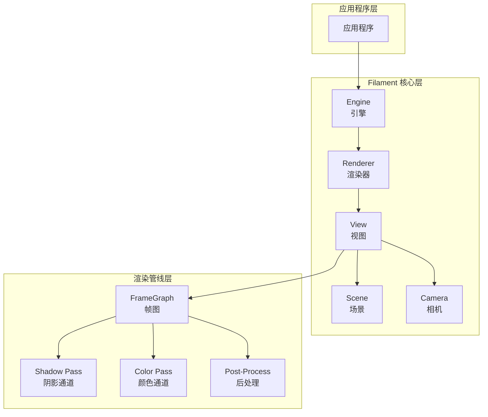

### View 的核心职责

1. **渲染状态管理**
   - 管理相机（Culling Camera 和 Viewing Camera）
   - 管理场景引用
   - 管理视口（Viewport）
   - 管理渲染目标（RenderTarget）

2. **渲染数据准备**
   - 视锥剔除（Frustum Culling）
   - 光源筛选和排序
   - 阴影投射者收集
   - Uniform 缓冲区准备

3. **渲染选项配置**
   - 抗锯齿（FXAA、TAA、MSAA）
   - 动态分辨率
   - 阴影类型（PCF、VSM、DPCF、PCSS）
   - 后处理效果（Bloom、DOF、SSAO、SSR等）

4. **资源管理**
   - 描述符集（Descriptor Set）管理
   - Uniform 缓冲区管理
   - 帧历史管理（用于 TAA、SSR）

---

## View 架构组件

### View 类层次结构

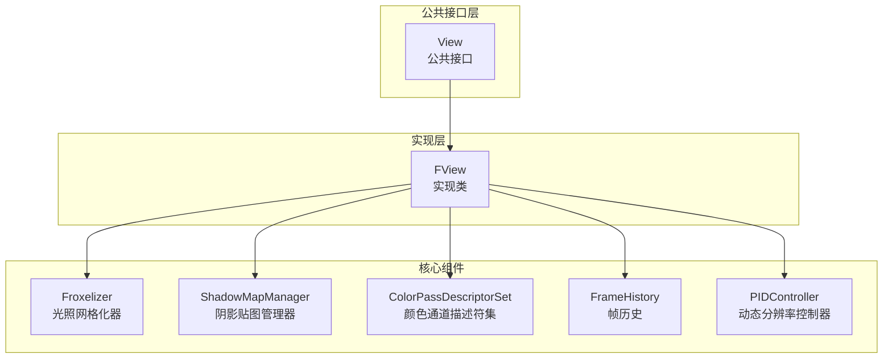

### View 内部组件架构

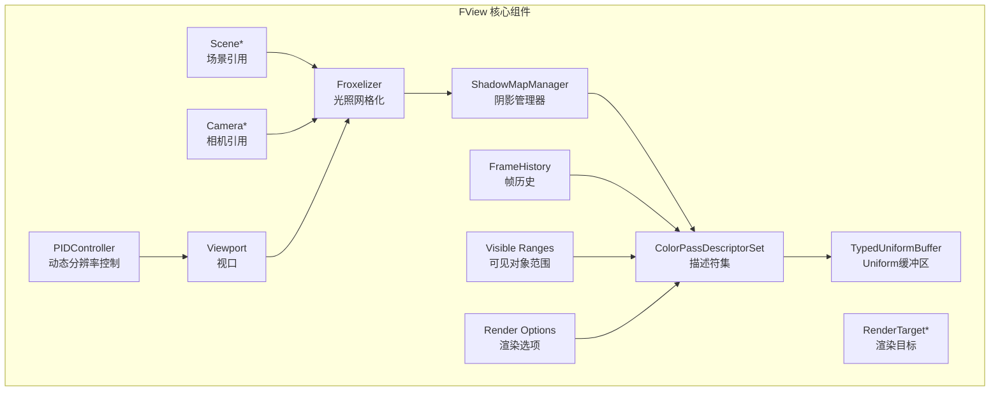

### 组件详细说明

#### 1. Froxelizer（光照网格化器）

**职责**：将3D空间划分为Froxel网格，用于高效的光照计算

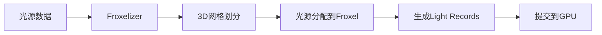

**关键特性**：
- 使用3D网格（通常16x16x16或32x32x16）划分视锥空间
- 每个Froxel包含影响该区域的光源列表
- 支持动态光源的高效查询

#### 2. ShadowMapManager（阴影贴图管理器）

**职责**：管理所有阴影贴图的生成和更新

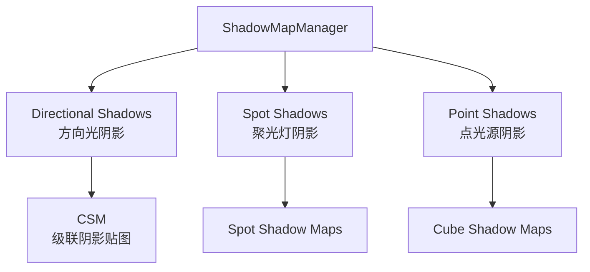

**支持的阴影类型**：
- **PCF**：Percentage Closer Filtering（默认）
- **VSM**：Variance Shadow Maps
- **DPCF**：Denoised Percentage Closer Filtering
- **PCSS**：Percentage Closer Soft Shadows

#### 3. ColorPassDescriptorSet（颜色通道描述符集）

**职责**：管理颜色通道所需的所有GPU资源绑定

**包含的资源**：
- 相机Uniform（投影矩阵、视图矩阵等）
- 光源Uniform（方向光、动态光源）
- 阴影Uniform（阴影贴图、级联参数）
- 环境光Uniform（IBL、曝光）
- 纹理资源（阴影贴图、SSAO、SSR等）

#### 4. FrameHistory（帧历史）

**职责**：存储前一帧的渲染结果，用于时间性效果

**用途**：
- **TAA**（Temporal Anti-Aliasing）：时间抗锯齿
- **SSR**（Screen Space Reflections）：屏幕空间反射
- **动态分辨率**：历史帧用于上采样

---

## View 核心数据结构

### FView 主要成员变量

```cpp
class FView : public View {
private:
    // 场景和相机
    FScene* mScene = nullptr;
    FCamera* mCullingCamera = nullptr;      // 用于剔除的相机
    FCamera* mViewingCamera = nullptr;       // 用于渲染的相机（可选）
    
    // 视口和渲染目标
    Viewport mViewport;
    FRenderTarget* mRenderTarget = nullptr;
    
    // 核心组件
    Froxelizer mFroxelizer;                  // 光照网格化器
    std::unique_ptr<ShadowMapManager> mShadowMapManager;  // 阴影管理器
    TypedUniformBuffer<PerViewUib> mUniforms;  // Uniform缓冲区
    ColorPassDescriptorSet mColorPassDescriptorSet[2];  // 描述符集（两个变体）
    FrameHistory mFrameHistory;              // 帧历史
    
    // 可见性数据（由prepare()设置）
    Range mVisibleRenderables;               // 可见可渲染对象范围
    Range mVisibleDirectionalShadowCasters;  // 可见方向光阴影投射者
    Range mSpotLightShadowCasters;           // 聚光灯阴影投射者
    
    // 渲染选项
    AntiAliasing mAntiAliasing = AntiAliasing::FXAA;
    ShadowType mShadowType = ShadowType::PCF;
    BloomOptions mBloomOptions;
    FogOptions mFogOptions;
    AmbientOcclusionOptions mAmbientOcclusionOptions;
    TemporalAntiAliasingOptions mTemporalAntiAliasingOptions;
    // ... 更多选项
    
    // 动态分辨率
    PIDController mPidController;           // PID控制器
    DynamicResolutionOptions mDynamicResolution;
    math::float2 mScale = 1.0f;              // 当前缩放比例
    
    // 状态标志
    bool mHasDirectionalLighting = false;
    bool mHasDynamicLighting = false;
    bool mHasShadowing = false;
    bool mNeedsShadowMap = false;
    bool mHasPostProcessPass = true;
};
```

### 数据结构关系图

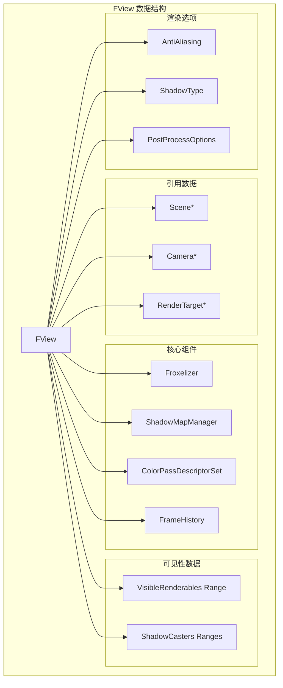

---

## View 渲染流程

### 完整渲染流程图

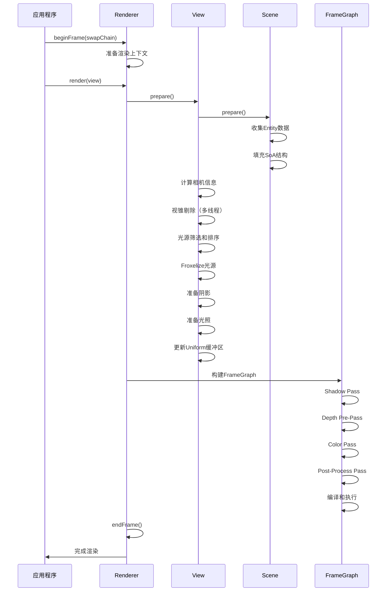

### View::prepare() 详细流程

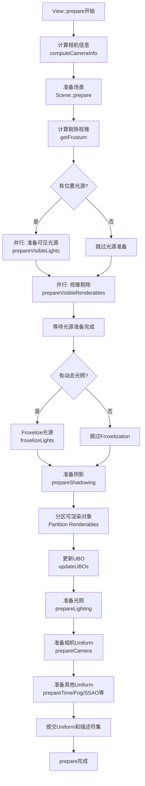

---

## View 与其他组件的关系

### View 与核心组件的关系图

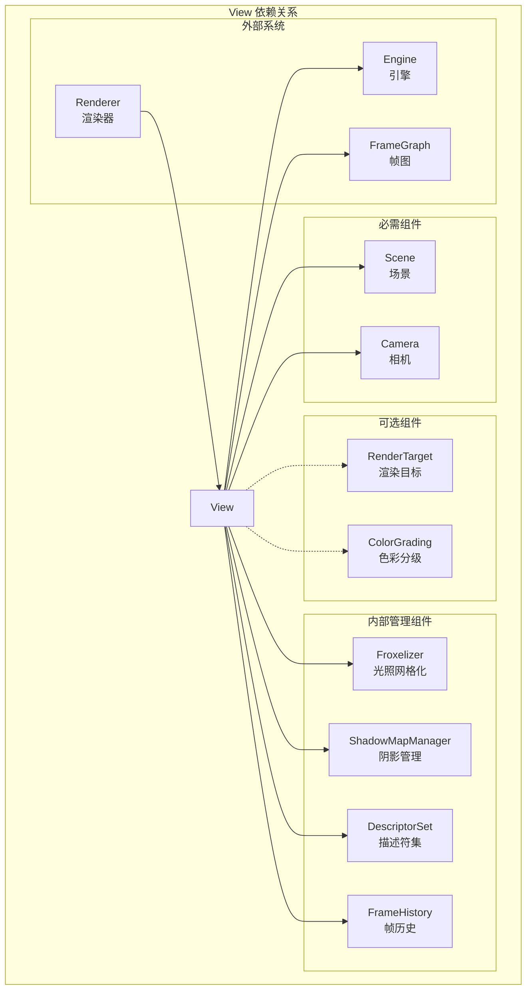

### View 与 Scene 的交互

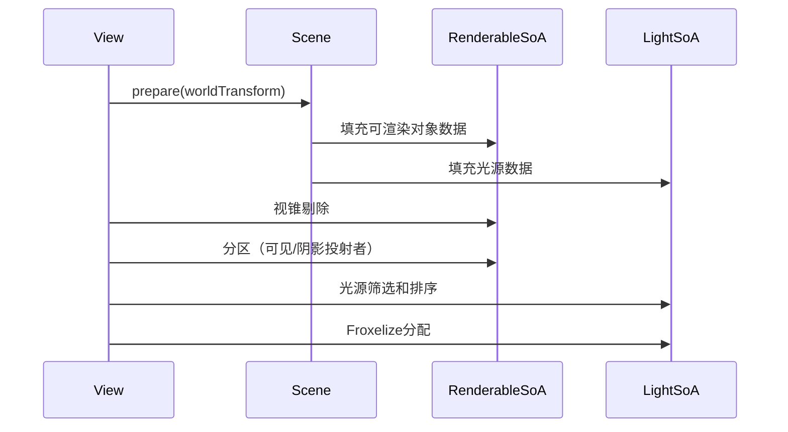

### View 与 Renderer 的交互

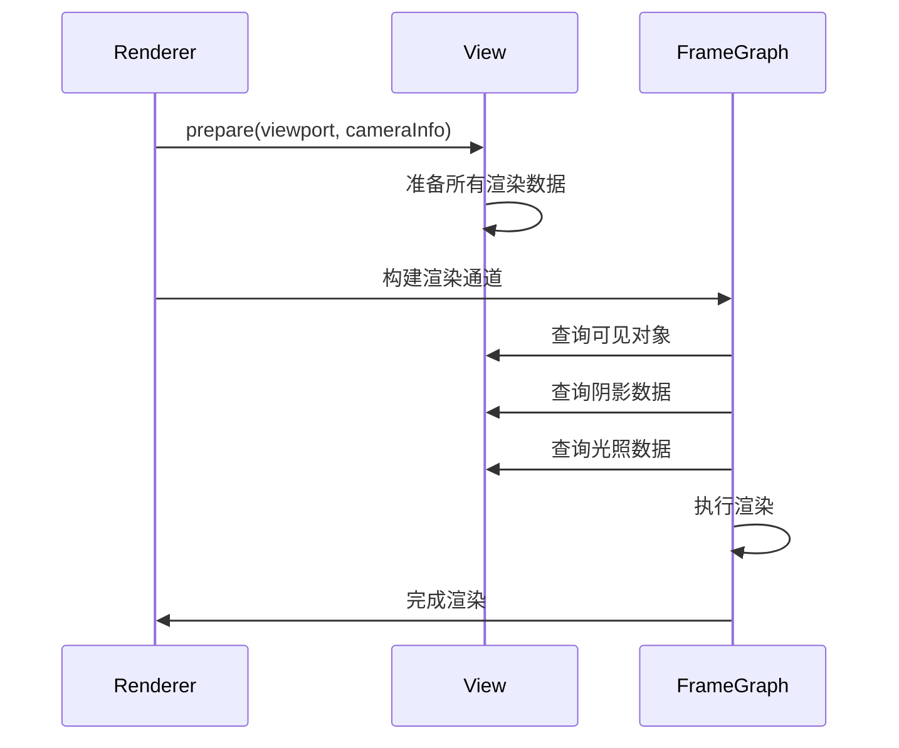

---

## View::prepare() 详解

### prepare() 方法签名

```cpp
void FView::prepare(FEngine& engine, backend::DriverApi& driver, 
                    RootArenaScope& rootArenaScope,
                    Viewport viewport, CameraInfo cameraInfo,
                    math::float4 const& userTime, 
                    bool needsAlphaChannel) noexcept
```

### prepare() 执行步骤详解

#### 1. 计算相机信息

```cpp
CameraInfo cameraInfo = computeCameraInfo(engine);
```

**功能**：
- 计算投影矩阵和视图矩阵
- 应用世界原点变换（提高大场景浮点精度）
- 处理IBL旋转

#### 2. 准备场景

```cpp
scene->prepare(js, rootArenaScope, cameraInfo.worldTransform, hasVSM());
```

**功能**：
- 收集所有Entity的渲染数据
- 填充RenderableSoA和LightSoA
- 应用世界变换到所有对象

#### 3. 视锥剔除

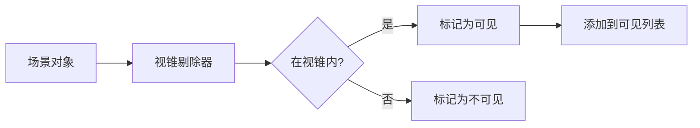

**并行执行**：
- 可渲染对象剔除
- 光源剔除
- 使用JobSystem多线程加速

#### 4. 光源处理

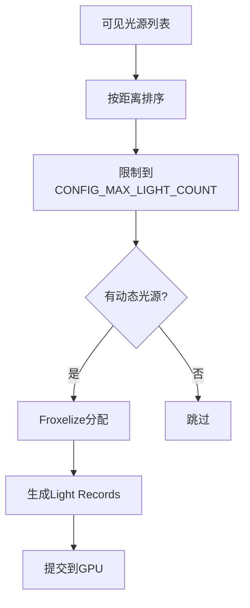

#### 5. 阴影准备

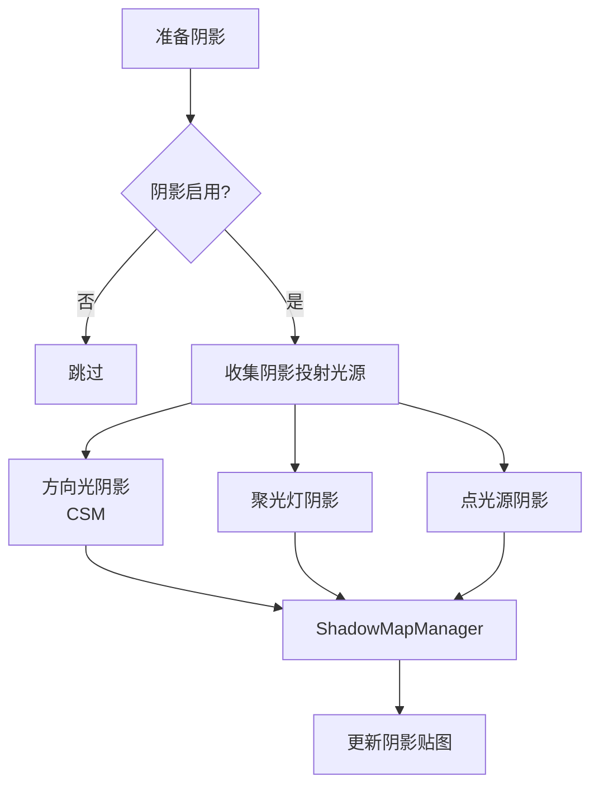

#### 6. 可渲染对象分区

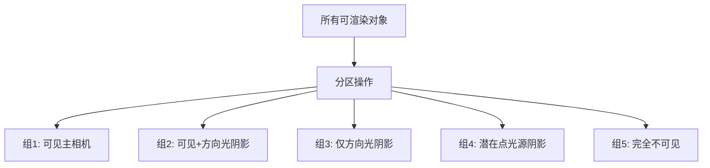

**分区目的**：
- 优化渲染顺序
- 减少不必要的渲染调用
- 提高缓存局部性

#### 7. Uniform缓冲区更新

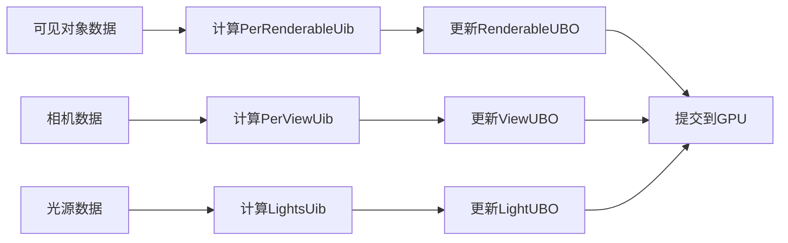

---

## View 的高级特性

### 1. 动态分辨率（Dynamic Resolution）

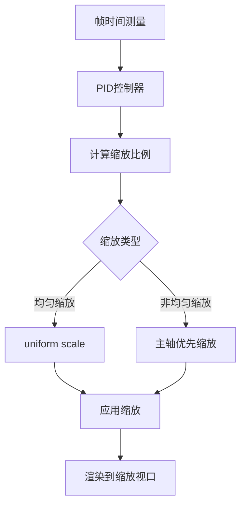

**特性**：
- 使用PID控制器根据帧时间自动调整分辨率
- 支持均匀和非均匀缩放
- 限制在minScale和maxScale之间

### 2. 时间抗锯齿（TAA）

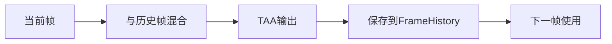

**流程**：
1. 当前帧渲染
2. 与前一帧混合（使用运动向量）
3. 输出结果
4. 保存到FrameHistory供下一帧使用

### 3. 屏幕空间反射（SSR）

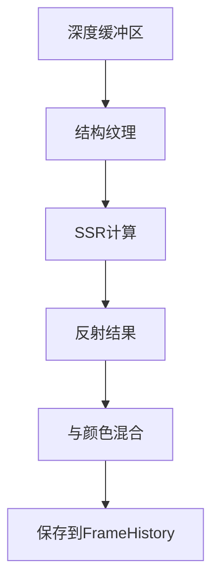

### 4. 立体渲染（Stereoscopic Rendering）

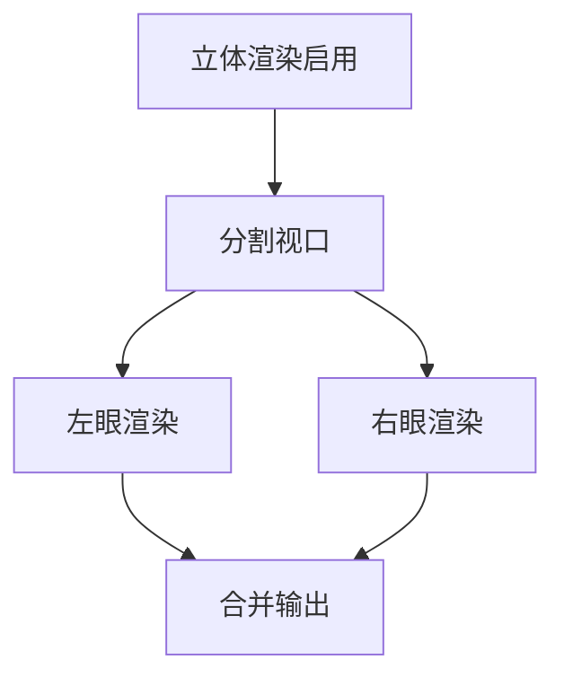

**限制**：
- 不支持后处理
- 不支持阴影
- 不支持点光源

### 5. 拾取查询（Picking Query）

```mermaid
sequenceDiagram
    participant App
    participant View
    participant Driver
    participant GPU
    
    App->>View: pick(x, y, callback)
    View->>View: 添加到查询列表
    
    View->>Driver: 渲染时执行查询
    Driver->>GPU: 读取像素数据
    GPU->>Driver: 返回Entity和深度
    Driver->>App: 调用callback
```

---

## View 使用示例

### 基本使用

```cpp
// 创建View
View* view = engine->createView();

// 设置场景和相机
view->setScene(scene);
view->setCamera(camera);

// 设置视口
view->setViewport({0, 0, width, height});

// 配置渲染选项
view->setAntiAliasing(View::AntiAliasing::FXAA);
view->setShadowingEnabled(true);
view->setBloomOptions({...});

// 渲染
renderer->render(view);
```

### 多View使用场景

```mermaid
graph TB
    A[应用程序] --> B[主场景View]
    A --> C[UI View]
    A --> D[反射View]
    
    B --> E[完整渲染管线]
    C --> F[简化渲染管线]
    D --> G[离屏渲染]
```

**典型场景**：
- **主场景View**：完整渲染，包含所有效果
- **UI View**：简化渲染，禁用后处理
- **反射View**：离屏渲染，用于镜面反射

---

## 总结

### View 的核心价值

1. **状态封装**：将渲染所需的所有状态集中管理
2. **性能优化**：通过剔除、分区、并行处理提高性能
3. **灵活配置**：支持丰富的渲染选项和效果
4. **资源管理**：统一管理GPU资源（UBO、描述符集等）

### View 的设计原则

1. **重量级对象**：内部缓存大量数据，避免频繁创建
2. **独立配置**：每个View独立配置，互不影响
3. **多线程友好**：prepare()内部大量使用并行处理
4. **资源复用**：描述符集、UBO等资源在帧间复用

### View 的性能考虑

1. **剔除优化**：视锥剔除、光源剔除减少渲染负担
2. **数据局部性**：SoA布局、分区操作提高缓存命中率
3. **并行处理**：多线程剔除、Froxelization提高CPU利用率
4. **动态分辨率**：根据性能自动调整分辨率保持帧率

---

## 参考资料

- `filament/include/filament/View.h` - View公共接口
- `filament/src/details/View.h` - View实现类
- `filament/src/details/View.cpp` - View实现代码
- Filament官方文档：https://google.github.io/filament/

---

**文档版本**：1.0  
**最后更新**：2024年


