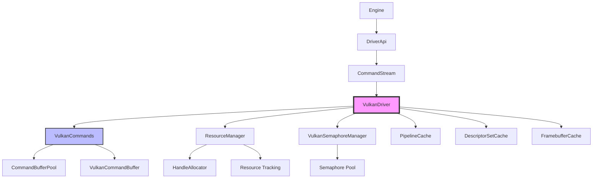
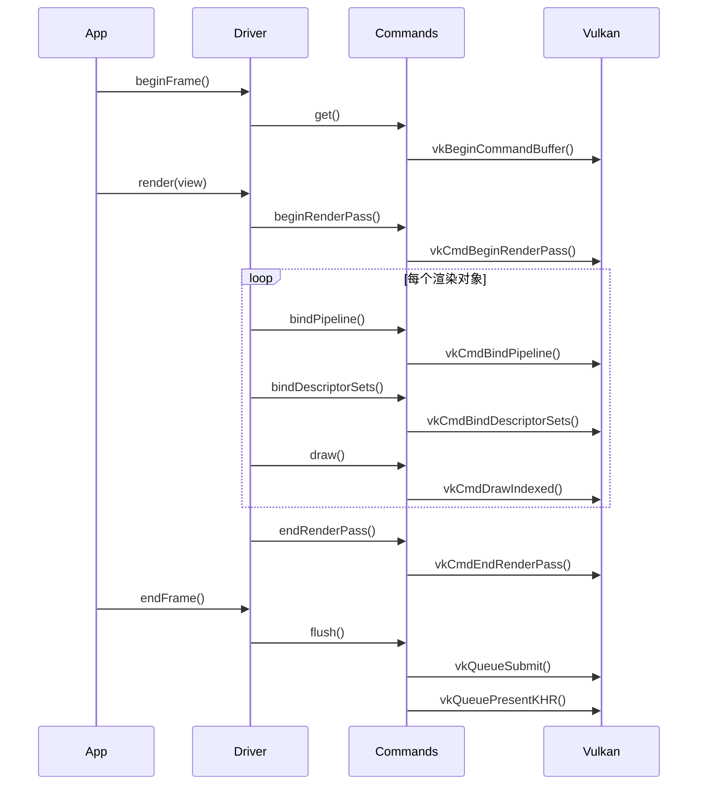

# Filament Vulkan 具体应用完整分析

## 目录
1. [概述](#概述)
2. [架构设计](#架构设计)
3. [资源管理](#资源管理)
4. [命令缓冲区管理](#命令缓冲区管理)
5. [同步机制](#同步机制)
6. [渲染流程](#渲染流程)
7. [描述符管理](#描述符管理)
8. [内存管理](#内存管理)
9. [性能优化](#性能优化)
10. [代码示例](#代码示例)

---

## 概述

Filament 的 Vulkan 后端实现了完整的 Vulkan 驱动，提供了高性能的渲染能力。Vulkan 驱动是 Filament 渲染引擎的核心组件之一，负责将高级渲染命令转换为 Vulkan API 调用。

### 核心特性
- **命令缓冲区池**：管理命令缓冲区的生命周期
- **信号量管理**：使用信号量实现命令缓冲区之间的依赖
- **栅栏同步**：使用栅栏实现 CPU-GPU 同步
- **资源引用计数**：自动管理 GPU 资源的生命周期
- **描述符缓存**：缓存描述符堆和布局，减少创建开销
- **管线缓存**：缓存 Vulkan 管线对象，提高性能

---

## 架构设计

### 架构图



### 类层次结构

```
Driver (接口)
  └── DriverBase (基类)
      └── VulkanDriver (Vulkan 驱动实现)
          ├── VulkanCommands (命令缓冲区管理)
          ├── ResourceManager (资源管理)
          ├── VulkanSemaphoreManager (信号量管理)
          └── 各种缓存管理器
```

---

## 资源管理

### ResourceManager

Vulkan 后端使用 ResourceManager 管理所有 GPU 资源。

**关键字段**：
```cpp
class ResourceManager {
    HandleAllocatorVK mHandleAllocatorImpl;  // 句柄分配器
    
    template<typename D, typename B, typename... ARGS>
    D* construct(Handle<B> const& handle, ARGS&&... args) {
        // 构造资源对象
        D* obj = mHandleAllocatorImpl.construct<D, B>(
            handle, std::forward<ARGS>(args)...
        );
        
        // 初始化资源
        if constexpr (requires_thread_safety<D>::value) {
            ((ThreadSafeResource*) obj)->init<D>(handle.getId(), this);
        } else {
            ((Resource*) obj)->init<D>(handle.getId(), this);
        }
        
        return obj;
    }
};
```

### 资源类型

#### 1. VulkanTexture
```cpp
struct VulkanTexture : public HwTexture {
    VkImage image;                      // Vulkan 图像对象
    VkDeviceMemory memory;              // 设备内存
    VkFormat format;                   // 图像格式
    VulkanLayout layout;                // 当前布局
    VkImageView primaryView;           // 主视图
    // ... 其他字段
};
```

#### 2. VulkanBufferObject
```cpp
struct VulkanBufferObject : public HwBufferObject {
    VkBuffer buffer;                    // Vulkan 缓冲区对象
    VkDeviceMemory memory;              // 设备内存
    VmaAllocation allocation;           // VMA 分配
    // ... 其他字段
};
```

#### 3. VulkanRenderPrimitive
```cpp
struct VulkanRenderPrimitive : public HwRenderPrimitive {
    resource_ptr<VulkanVertexBuffer> vb;  // 顶点缓冲区
    resource_ptr<VulkanIndexBuffer> ib;   // 索引缓冲区
    PrimitiveType type;                   // 图元类型
};
```

---

## 命令缓冲区管理

### VulkanCommands

VulkanCommands 管理命令缓冲区和信号量，提供简化的 API。

**关键字段**：
```cpp
class VulkanCommands {
    VkDevice const mDevice;
    VkQueue const mProtectedQueue;
    VulkanContext const& mContext;
    VulkanSemaphoreManager* mSemaphoreManager;
    
    std::unique_ptr<CommandBufferPool> mPool;        // 普通命令缓冲区池
    std::unique_ptr<CommandBufferPool> mProtectedPool; // 受保护命令缓冲区池
    
    VkSemaphore mInjectedDependency = VK_NULL_HANDLE;  // 注入的依赖信号量
    resource_ptr<VulkanSemaphore> mLastSubmit;          // 最后一次提交的信号量
    VkFence mLastFence = VK_NULL_HANDLE;               // 最后一次提交的栅栏
};
```

### CommandBufferPool

命令缓冲区池管理多个命令缓冲区。

**关键字段**：
```cpp
struct CommandBufferPool {
    VkDevice mDevice;
    VkCommandPool mPool;
    ActiveBuffers mSubmitted;  // 已提交的缓冲区位集
    std::vector<std::unique_ptr<VulkanCommandBuffer>> mBuffers;  // 缓冲区列表
    int8_t mRecording;  // 当前正在录制的缓冲区索引
};
```

### VulkanCommandBuffer

单个命令缓冲区。

**关键字段**：
```cpp
struct VulkanCommandBuffer {
    VkCommandBuffer mBuffer;           // Vulkan 命令缓冲区
    VkFence mFence;                    // 提交栅栏
    std::shared_ptr<VulkanCmdFence> mFenceStatus;  // 栅栏状态
    
    fvkutils::StaticVector<VkSemaphore, 2> mWaitSemaphores;  // 等待信号量
    fvkutils::StaticVector<VkPipelineStageFlags, 2> mWaitSemaphoreStages;  // 等待阶段
    
    resource_ptr<VulkanSemaphore> mSubmission;  // 提交信号量
    std::vector<resource_ptr<Resource>> mResources;  // 资源引用
    uint32_t mAge;  // 年龄（用于垃圾回收）
};
```

### 命令缓冲区获取

```cpp
VulkanCommandBuffer& VulkanCommands::get() {
    auto& ret = mPool->getRecording();
    return ret;
}

VulkanCommandBuffer& CommandBufferPool::getRecording() {
    if (isRecording()) {
        return *mBuffers[mRecording];
    }
    
    // 查找下一个可用的缓冲区
    auto const findNext = [this]() {
        for (int8_t i = 0; i < CAPACITY; ++i) {
            if (!mSubmitted[i]) {
                return i;
            }
        }
        return INVALID;
    };
    
    while ((mRecording = findNext()) == INVALID) {
        wait();  // 等待缓冲区完成
        gc();    // 垃圾回收
    }
    
    auto& recording = *mBuffers[mRecording];
    recording.begin();  // 开始录制
    
    return recording;
}
```

### 命令缓冲区提交

```cpp
fvkmemory::resource_ptr<VulkanSemaphore> VulkanCommandBuffer::submit() {
    // 结束所有标记
    while (mMarkerCount > 0) {
        popMarker();
    }
    
    // 结束命令缓冲区
    vkEndCommandBuffer(mBuffer);
    
    // 准备提交信息
    VkSemaphore submissionSemaphore = mSubmission->getVkSemaphore();
    VkSubmitInfo submitInfo{
        .sType = VK_STRUCTURE_TYPE_SUBMIT_INFO,
        .waitSemaphoreCount = mWaitSemaphores.size(),
        .pWaitSemaphores = mWaitSemaphores.data(),
        .pWaitDstStageMask = mWaitSemaphoreStages.data(),
        .commandBufferCount = 1u,
        .pCommandBuffers = &mBuffer,
        .signalSemaphoreCount = 1u,
        .pSignalSemaphores = &submissionSemaphore,
    };
    
    // 提交到队列
    vkQueueSubmit(mQueue, 1, &submitInfo, mFence);
    mFenceStatus->setStatus(VK_NOT_READY);
    
    return mSubmission;
}
```

---

## 同步机制

### 信号量管理

VulkanSemaphoreManager 管理信号量池。

```cpp
class VulkanSemaphoreManager {
    VkDevice mDevice;
    ResourceManager* mResourceManager;
    
    // 信号量池
    std::vector<resource_ptr<VulkanSemaphore>> mPool;
    
    resource_ptr<VulkanSemaphore> acquire() {
        if (mPool.empty()) {
            // 创建新信号量
            return resource_ptr<VulkanSemaphore>::make(
                mResourceManager, mDevice
            );
        }
        
        // 从池中获取
        auto sem = mPool.back();
        mPool.pop_back();
        return sem;
    }
    
    void release(resource_ptr<VulkanSemaphore> sem) {
        mPool.push_back(sem);
    }
};
```

### 栅栏同步

```cpp
struct VulkanCmdFence {
    VkFence mFence;
    std::atomic<VkResult> mStatus;
    
    void setStatus(VkResult status) {
        mStatus.store(status, std::memory_order_release);
    }
    
    VkResult getStatus() const {
        return mStatus.load(std::memory_order_acquire);
    }
    
    void resetFence(VkDevice device) {
        // 等待栅栏完成（如果需要）
        if (mStatus.load() == VK_NOT_READY) {
            vkWaitForFences(device, 1, &mFence, VK_TRUE, UINT64_MAX);
        }
        vkResetFences(device, 1, &mFence);
    }
};
```

### 依赖链

命令缓冲区通过信号量形成依赖链：

```cpp
bool VulkanCommands::flush() {
    VkSemaphore injectedDependency = mInjectedDependency;
    resource_ptr<VulkanSemaphore> dependency;
    
    // 提交普通命令缓冲区池
    if (mPool) {
        if (injectedDependency != VK_NULL_HANDLE) {
            mPool->waitFor(injectedDependency, mInjectedDependencyWaitStage);
            injectedDependency = VK_NULL_HANDLE;
        }
        
        dependency = mPool->flush();
        if (dependency) {
            mLastSubmit = dependency;
            mLastFence = mPool->getMostRecentFence();
            mLastFenceStatus = mPool->getMostRecentFenceStatus();
            hasFlushed = true;
        }
    }
    
    // 提交受保护命令缓冲区池
    if (mProtectedPool && hasFlushed) {
        mProtectedPool->waitFor(
            dependency->getVkSemaphore(),
            VK_PIPELINE_STAGE_ALL_GRAPHICS_BIT
        );
        mProtectedPool->flush();
    }
    
    mInjectedDependency = VK_NULL_HANDLE;
    return hasFlushed;
}
```

---

## 渲染流程

### 帧生命周期



### 关键方法实现

#### 1. beginFrame
```cpp
void VulkanDriver::beginFrame(int64_t monotonic_clock_ns, uint32_t frameId) {
    // 更新流式纹理
    updateStreams(monotonic_clock_ns);
    
    // 垃圾回收
    collectGarbage();
    
    // 更新栅栏状态
    mCommands.updateFences();
}
```

#### 2. beginRenderPass
```cpp
void VulkanDriver::beginRenderPass(Handle<HwRenderTarget> rth,
        const RenderPassParams& params) {
    // 获取命令缓冲区
    VulkanCommandBuffer& commands = mCommands.get();
    VkCommandBuffer cmdbuffer = commands.buffer();
    
    // 获取渲染目标
    auto rt = resource_ptr<VulkanRenderTarget>::cast(&mResourceManager, rth);
    
    // 准备渲染通道
    VulkanRenderPass renderPass = rt->getRenderPass(params);
    
    // 开始渲染通道
    VkRenderPassBeginInfo beginInfo{
        .sType = VK_STRUCTURE_TYPE_RENDER_PASS_BEGIN_INFO,
        .renderPass = renderPass.renderPass,
        .framebuffer = renderPass.framebuffer,
        .renderArea = {0, 0, params.viewport.width, params.viewport.height},
        .clearValueCount = params.clearColor.size(),
        .pClearValues = params.clearColor.data(),
    };
    
    vkCmdBeginRenderPass(cmdbuffer, &beginInfo,
        VK_SUBPASS_CONTENTS_INLINE);
    
    // 设置视口
    VkViewport viewport{
        .x = float(params.viewport.left),
        .y = float(params.viewport.bottom),
        .width = float(params.viewport.width),
        .height = float(params.viewport.height),
        .minDepth = 0.0f,
        .maxDepth = 1.0f,
    };
    vkCmdSetViewport(cmdbuffer, 0, 1, &viewport);
    
    // 设置裁剪矩形
    VkRect2D scissor{
        .offset = {int32_t(params.viewport.left), int32_t(params.viewport.bottom)},
        .extent = {params.viewport.width, params.viewport.height},
    };
    vkCmdSetScissor(cmdbuffer, 0, 1, &scissor);
    
    mCurrentRenderPass = renderPass;
    mCurrentRenderPass.commandBuffer = &commands;
}
```

#### 3. bindPipeline
```cpp
void VulkanDriver::bindPipeline(PipelineState const& state) {
    // 获取程序
    auto program = resource_ptr<VulkanProgram>::cast(
        &mResourceManager, state.program
    );
    
    // 获取描述符堆布局
    DescriptorSetLayoutHandleList dsLayoutHandles = 
        getDescriptorSetLayouts(program, state);
    
    // 获取管线布局
    VkPipelineLayout pipelineLayout = mPipelineLayoutCache.getLayout(
        dsLayoutHandles, program
    );
    
    // 绑定管线
    bindPipelineImpl(state, pipelineLayout, descriptorSetMask);
}
```

#### 4. draw
```cpp
void VulkanDriver::draw(PipelineState state,
        Handle<HwRenderPrimitive> rph,
        uint32_t indexOffset, uint32_t indexCount,
        uint32_t instanceCount) {
    VkCommandBuffer cmdbuffer = mCurrentRenderPass.commandBuffer->buffer();
    
    // 绑定描述符堆
    mDescriptorSetCache.commit(
        mCurrentRenderPass.commandBuffer,
        mPipelineState.pipelineLayout,
        setsWithExternalSamplers,
        mPipelineState.descriptorSetMask
    );
    
    // 执行绘制调用
    vkCmdDrawIndexed(
        cmdbuffer,
        indexCount,
        instanceCount,
        indexOffset,
        0,  // vertexOffset
        0   // firstInstance
    );
}
```

---

## 描述符管理

### DescriptorSetCache

描述符堆缓存管理描述符堆的分配和更新。

```cpp
class VulkanDescriptorSetCache {
    VkDevice mDevice;
    ResourceManager* mResourceManager;
    
    // 描述符堆池
    std::vector<VkDescriptorPool> mPools;
    
    // 描述符堆缓存
    std::unordered_map<DescriptorSetKey, VkDescriptorSet> mCache;
    
    void updateSampler(uint8_t set, uint8_t binding,
            VulkanTexture* texture, VkSampler sampler) {
        // 获取或创建描述符堆
        VkDescriptorSet descriptorSet = getOrCreateDescriptorSet(set);
        
        // 更新描述符
        VkDescriptorImageInfo imageInfo{
            .sampler = sampler,
            .imageView = texture->getPrimaryImageView(),
            .imageLayout = texture->getLayout(),
        };
        
        VkWriteDescriptorSet write{
            .sType = VK_STRUCTURE_TYPE_WRITE_DESCRIPTOR_SET,
            .dstSet = descriptorSet,
            .dstBinding = binding,
            .descriptorCount = 1,
            .descriptorType = VK_DESCRIPTOR_TYPE_COMBINED_IMAGE_SAMPLER,
            .pImageInfo = &imageInfo,
        };
        
        vkUpdateDescriptorSets(mDevice, 1, &write, 0, nullptr);
    }
};
```

### DescriptorSetLayoutCache

描述符堆布局缓存管理描述符堆布局的创建。

```cpp
class VulkanDescriptorSetLayoutCache {
    VkDevice mDevice;
    ResourceManager* mResourceManager;
    
    // 布局缓存
    std::unordered_map<LayoutKey, resource_ptr<VulkanDescriptorSetLayout>> mCache;
    
    resource_ptr<VulkanDescriptorSetLayout> getLayout(
            const LayoutKey& key) {
        auto it = mCache.find(key);
        if (it != mCache.end()) {
            return it->second;
        }
        
        // 创建新布局
        auto layout = resource_ptr<VulkanDescriptorSetLayout>::make(
            mResourceManager, mDevice, key
        );
        mCache[key] = layout;
        return layout;
    }
};
```

---

## 内存管理

### VMA 分配器

Vulkan 后端使用 VMA（Vulkan Memory Allocator）管理内存。

```cpp
VmaAllocator createAllocator(VkInstance instance,
        VkPhysicalDevice physicalDevice, VkDevice device) {
    VmaAllocatorCreateInfo allocatorInfo{
        .flags = VMA_ALLOCATOR_CREATE_EXTERNALLY_SYNCHRONIZED_BIT,
        .physicalDevice = physicalDevice,
        .device = device,
        .instance = instance,
    };
    VmaAllocator allocator;
    vmaCreateAllocator(&allocatorInfo, &allocator);
    return allocator;
}
```

### 缓冲区分配

```cpp
void VulkanDriver::createBufferObjectR(Handle<HwBufferObject> boh,
        uint32_t byteCount, BufferObjectBinding bindingType,
        BufferUsage usage, ImmutableCString&& tag) {
    VkBufferCreateInfo bufferInfo{
        .sType = VK_STRUCTURE_TYPE_BUFFER_CREATE_INFO,
        .size = byteCount,
        .usage = getVkBufferUsage(bindingType, usage),
    };
    
    VmaAllocationCreateInfo allocInfo{
        .usage = VMA_MEMORY_USAGE_AUTO,
        .flags = VMA_ALLOCATION_CREATE_STRATEGY_BEST_FIT_BIT,
    };
    
    VkBuffer buffer;
    VmaAllocation allocation;
    vmaCreateBuffer(mAllocator, &bufferInfo, &allocInfo,
        &buffer, &allocation, nullptr);
    
    auto bo = resource_ptr<VulkanBufferObject>::make(
        &mResourceManager, boh, buffer, allocation, byteCount
    );
    bo.inc();
}
```

---

## 性能优化

### 1. 命令缓冲区池
- **重用命令缓冲区**：减少创建和销毁开销
- **批量提交**：合并多个命令缓冲区提交

### 2. 描述符缓存
- **缓存描述符堆**：避免重复创建
- **缓存描述符堆布局**：减少布局创建开销

### 3. 管线缓存
- **缓存 Vulkan 管线**：避免重复编译
- **持久化缓存**：跨运行保存管线缓存

### 4. 资源引用计数
- **自动管理生命周期**：减少手动管理开销
- **延迟释放**：确保资源在使用完毕后才释放

### 5. 信号量复用
- **信号量池**：重用信号量对象
- **减少创建开销**：避免频繁创建和销毁

---

## 代码示例

### 创建纹理

```cpp
// 1. 创建纹理句柄
Handle<HwTexture> texture = driverApi.createTexture(
    SamplerType::SAMPLER_2D,
    1,                          // 级别数
    TextureFormat::RGBA8,      // 格式
    1,                          // 使用标志
    1024, 1024,                 // 宽度、高度
    1,                          // 深度
    1                           // 样本数
);

// 2. 上传纹理数据
PixelBufferDescriptor desc(data, size, format, type);
driverApi.updateTexture(texture, 0, 0, 0, 1024, 1024, 1, desc);
```

### 创建缓冲区

```cpp
// 创建顶点缓冲区
Handle<HwVertexBuffer> vb = driverApi.createVertexBuffer(
    vertexCount, vbih
);

// 设置缓冲区数据
BufferDescriptor bd(vertexData, vertexDataSize);
driverApi.setVertexBufferObject(vb, 0, std::move(bd));
```

### 渲染循环

```cpp
void renderFrame() {
    // 开始帧
    renderer->beginFrame(swapChain);
    
    // 渲染视图
    renderer->render(view);
    
    // 结束帧
    renderer->endFrame();
}
```

---

## 总结

Filament 的 Vulkan 驱动通过以下机制实现了高性能渲染：

1. **命令缓冲区池**：重用命令缓冲区，减少创建开销
2. **信号量管理**：使用信号量实现命令缓冲区依赖链
3. **栅栏同步**：实现 CPU-GPU 同步
4. **资源引用计数**：自动管理 GPU 资源生命周期
5. **描述符缓存**：缓存描述符堆和布局，减少创建开销
6. **管线缓存**：缓存 Vulkan 管线对象，提高性能
7. **VMA 分配器**：高效的内存管理

这些机制使得 Filament 能够在 Vulkan 平台上实现高效渲染。

