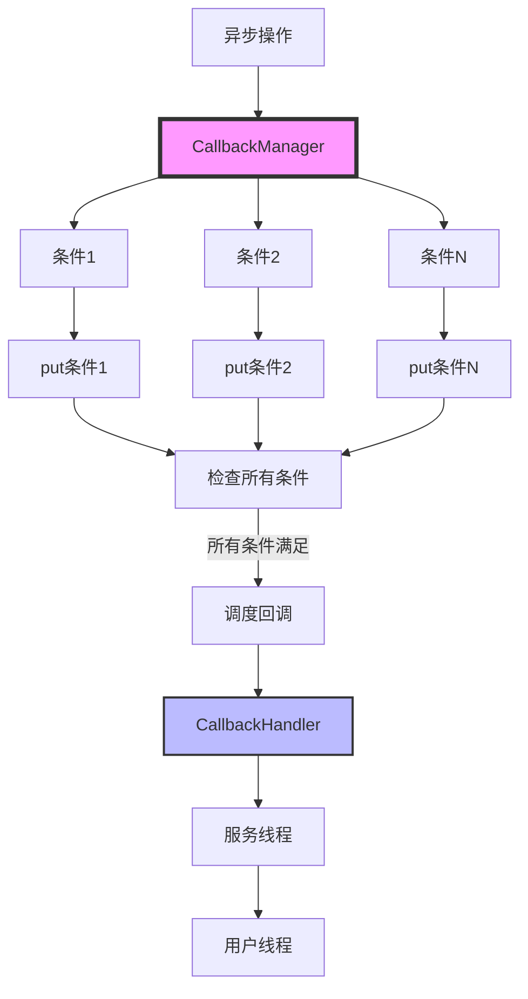
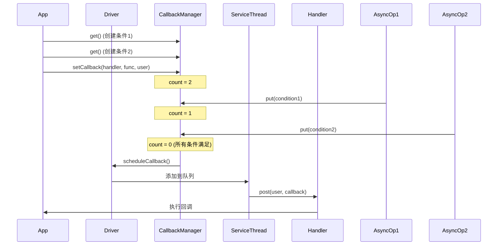

# Filament 事件系统完整分析

## 目录
1. [概述](#概述)
2. [架构设计](#架构设计)
3. [CallbackHandler](#callbackhandler)
4. [CallbackManager](#callbackmanager)
5. [DriverBase 回调系统](#driverbase-回调系统)
6. [事件流程](#事件流程)
7. [使用场景](#使用场景)
8. [使用示例](#使用示例)

---

## 概述

Filament 的事件系统基于回调机制，用于处理异步操作完成后的通知。事件系统允许回调与平台/操作系统的消息系统互操作，支持自定义回调调度逻辑。

### 核心特性
- **回调处理器接口**：允许自定义回调调度逻辑
- **条件管理**：支持等待多个异步操作完成
- **线程安全**：支持多线程环境下的回调调度
- **延迟执行**：回调在服务线程中执行，不阻塞渲染线程
- **平台互操作**：可以与平台消息系统集成

---

## 架构设计

### 架构图



### 类层次结构

```
CallbackHandler (接口)
  └── 用户实现

CallbackManager
  └── 管理条件和回调

DriverBase
  ├── scheduleCallback (调度回调)
  ├── purge (执行回调)
  └── 服务线程 (执行回调)
```

---

## CallbackHandler

### 接口定义

```cpp
class CallbackHandler {
public:
    /**
     * 回调函数类型
     * 
     * 签名：void(*)(void* user)
     * - user: 用户数据指针，在调用 post() 时提供
     */
    using Callback = void(*)(void* user);

    /**
     * 调度回调到适当的线程
     * 
     * 将回调调度到适当的线程执行。通常这将是应用程序的主线程。
     * 
     * @param user     用户数据指针，传递给回调函数
     * @param callback 要执行的回调函数
     * 
     * 实现要求：
     * - 必须是线程安全的
     * - 可能从服务线程调用（永远不会是主线程）
     * - 负责将回调调度到用户期望的线程
     */
    virtual void post(void* user, Callback callback) = 0;

protected:
    virtual ~CallbackHandler() = default;
};
```

### 工作原理

1. **回调创建**：异步操作创建回调，指定 CallbackHandler
2. **回调调度**：操作完成时，通过 CallbackHandler::post() 调度回调
3. **线程执行**：CallbackHandler 负责将回调调度到目标线程执行

### 默认行为

如果 CallbackHandler* 为 nullptr，使用默认处理器：
- 默认处理器在 Filament 主线程上机会性地分发回调
- 通过 `DriverBase::purge()` 在主线程执行

---

## CallbackManager

### 功能

CallbackManager 在所有先前的条件都满足时调度用户回调。

**工作流程**：
1. 通过调用 `get()` 创建"条件"，返回一个句柄
2. 通过调用 `put()` 满足条件（通常从不同线程调用）
3. 通过 `setCallback()` 设置回调，当所有条件都满足时回调会被调度

### 数据结构

```cpp
class CallbackManager {
    /**
     * 回调结构
     * 
     * 存储回调信息和引用计数（条件计数）。
     */
    struct Callback {
        mutable std::atomic_int count{};  // 引用计数（条件计数）
        CallbackHandler* handler = nullptr;  // 回调处理器
        CallbackHandler::Callback func = {};  // 回调函数
        void* user = nullptr;  // 用户数据指针
    };

    using Container = std::list<Callback>;  // 回调容器（双向链表）
    
    DriverBase& mDriver;  // DriverBase 引用
    mutable utils::Mutex mLock;  // 互斥锁
    Container mCallbacks;  // 回调列表
};
```

### 关键方法

#### 1. get() - 创建条件

```cpp
CallbackManager::Handle CallbackManager::get() const noexcept {
    Container::const_iterator const curr = getCurrent();
    curr->count.fetch_add(1);  // 增加引用计数（创建新条件）
    return curr;
}
```

**功能**：
- 创建新的条件（通过增加引用计数）
- 返回条件句柄
- 这个句柄必须通过 `put()` 来满足条件

#### 2. put() - 满足条件

```cpp
void CallbackManager::put(Handle& curr) noexcept {
    // 减少引用计数，如果降为 0，说明所有条件都已满足
    if (curr->count.fetch_sub(1) == 1) {
        // 如果设置了回调，调度它
        if (curr->func) {
            mDriver.scheduleCallback(
                curr->handler, curr->user, curr->func);
            destroySlot(curr);
        }
    }
    curr = {};  // 清空句柄
}
```

**功能**：
- 满足指定条件（通过减少引用计数）
- 如果所有条件都已满足且设置了回调，则调度回调

#### 3. setCallback() - 设置回调

```cpp
void CallbackManager::setCallback(
        CallbackHandler* handler, 
        CallbackHandler::Callback func, 
        void* user) {
    assert_invariant(func);
    Container::iterator const curr = allocateNewSlot();
    curr->handler = handler;
    curr->func = func;
    curr->user = user;
    
    // 如果当前槽位的引用计数为 0，说明所有条件都已满足，立即调度回调
    if (curr->count == 0) {
        mDriver.scheduleCallback(
            curr->handler, curr->user, curr->func);
        destroySlot(curr);
    }
}
```

**功能**：
- 设置回调函数
- 当所有之前创建的条件都满足时，回调会被调度
- 如果没有创建条件，或者所有条件都已满足，回调会立即被调度

---

## DriverBase 回调系统

### 服务线程

DriverBase 创建一个服务线程用于处理回调：

```cpp
DriverBase::DriverBase() noexcept {
    if constexpr (UTILS_HAS_THREADING) {
        // 创建服务线程，用于处理用户回调
        mServiceThread = std::thread([this]() {
            do {
                // 等待有回调需要处理
                std::unique_lock<std::mutex> lock(mServiceThreadLock);
                while (mServiceThreadCallbackQueue.empty() && !mExitRequested) {
                    mServiceThreadCondition.wait(lock);
                }
                if (mExitRequested) {
                    break;
                }
                // 将回调队列移动到临时向量（避免长时间持有锁）
                auto callbacks(std::move(mServiceThreadCallbackQueue));
                lock.unlock();
                // 执行所有回调（此时不持有锁，避免死锁）
                for (auto[handler, callback, user]: callbacks) {
                    handler->post(user, callback);
                }
            } while (true);
        });
    }
}
```

### 回调调度

```cpp
void DriverBase::scheduleCallback(
        CallbackHandler* handler, 
        void* user, 
        CallbackHandler::Callback callback) {
    if (handler && UTILS_HAS_THREADING) {
        // 多线程模式：添加到服务线程队列
        std::lock_guard<std::mutex> const lock(mServiceThreadLock);
        mServiceThreadCallbackQueue.emplace_back(handler, callback, user);
        mServiceThreadCondition.notify_one();  // 唤醒服务线程
    } else {
        // 单线程模式：添加到主线程队列
        std::lock_guard<std::mutex> const lock(mPurgeLock);
        mCallbacks.emplace_back(user, callback);
    }
}
```

### 回调执行

```cpp
void DriverBase::purge() noexcept {
    decltype(mCallbacks) callbacks;
    std::unique_lock<std::mutex> lock(mPurgeLock);
    std::swap(callbacks, mCallbacks);  // 快速交换，清空队列
    lock.unlock(); // 确保回调执行时不持有锁
    // 执行所有回调（此时不持有锁）
    for (auto& item : callbacks) {
        item.second(item.first);  // 调用回调函数
    }
}
```

### 模板版本调度

```cpp
template<typename T>
void DriverBase::scheduleCallback(CallbackHandler* handler, T&& functor) {
    CallbackData* data = CallbackData::obtain(this);
    static_assert(sizeof(T) <= sizeof(data->storage), "functor too large");
    // 使用 placement new 在 storage 中构造 functor
    new(data->storage) T(std::forward<T>(functor));
    // 调度回调
    scheduleCallback(handler, data, [](void* data) {
        CallbackData* details = static_cast<CallbackData*>(data);
        void* user = details->storage;
        T& functor = *static_cast<T*>(user);
        functor();  // 执行回调
        functor.~T();  // 析构 functor
        CallbackData::release(details);
    });
}
```

---

## 事件流程

### 基本流程



### 多条件等待

```cpp
// 1. 创建多个条件
auto condition1 = callbackManager.get();
auto condition2 = callbackManager.get();
auto condition3 = callbackManager.get();

// 2. 设置回调（当所有条件满足时执行）
callbackManager.setCallback(handler, [](void* user) {
    // 所有异步操作完成
    std::cout << "All operations completed!" << std::endl;
}, nullptr);

// 3. 启动异步操作
asyncOperation1([&]() {
    callbackManager.put(condition1);
});

asyncOperation2([&]() {
    callbackManager.put(condition2);
});

asyncOperation3([&]() {
    callbackManager.put(condition3);
});
```

---

## 使用场景

### 1. GPU 命令完成回调

```cpp
// 创建栅栏
Fence* fence = engine->createFence();

// 设置回调
fence->wait(Fence::Mode::DONT_FLUSH, [](void* user) {
    // GPU 命令完成
    std::cout << "GPU commands completed!" << std::endl;
}, nullptr);
```

### 2. 资源释放回调

```cpp
// 创建资源
Texture* texture = Texture::Builder()
    .width(1024)
    .height(1024)
    .build(*engine);

// 使用资源
// ...

// 销毁资源（带回调）
engine->destroy(texture, [](void* user) {
    // 资源已释放
    std::cout << "Texture destroyed!" << std::endl;
}, nullptr);
```

### 3. 异步操作完成

```cpp
// 创建条件
auto condition = callbackManager.get();

// 启动异步操作
asyncOperation([&]() {
    // 操作完成
    callbackManager.put(condition);
});

// 设置回调
callbackManager.setCallback(handler, [](void* user) {
    // 异步操作完成
    std::cout << "Async operation completed!" << std::endl;
}, nullptr);
```

---

## 使用示例

### 自定义 CallbackHandler

```cpp
class MyCallbackHandler : public CallbackHandler {
public:
    void post(void* user, Callback callback) override {
        // 将回调添加到消息队列
        std::lock_guard<std::mutex> lock(mMutex);
        mCallbacks.push({user, callback});
        
        // 通知主线程
        mCondition.notify_one();
    }
    
    void processCallbacks() {
        std::unique_lock<std::mutex> lock(mMutex);
        while (!mCallbacks.empty()) {
            auto [user, callback] = mCallbacks.front();
            mCallbacks.pop();
            lock.unlock();
            
            // 执行回调
            callback(user);
            
            lock.lock();
        }
    }
    
private:
    std::mutex mMutex;
    std::condition_variable mCondition;
    std::queue<std::pair<void*, Callback>> mCallbacks;
};
```

### 使用自定义 Handler

```cpp
// 创建自定义 Handler
MyCallbackHandler handler;

// 创建引擎时指定 Handler
Engine* engine = Engine::create(&handler);

// 在消息循环中处理回调
while (running) {
    handler.processCallbacks();
    // ... 其他消息处理
}
```

### 等待多个异步操作

```cpp
CallbackManager& callbackManager = driver->getCallbackManager();

// 创建条件
auto condition1 = callbackManager.get();
auto condition2 = callbackManager.get();

// 设置回调
callbackManager.setCallback(&handler, [](void* user) {
    std::cout << "All operations completed!" << std::endl;
}, nullptr);

// 启动异步操作
startAsyncOperation1([&]() {
    callbackManager.put(condition1);
});

startAsyncOperation2([&]() {
    callbackManager.put(condition2);
});
```

---

## 总结

Filament 的事件系统提供了灵活的回调机制：

1. **CallbackHandler 接口**：允许自定义回调调度逻辑
2. **CallbackManager**：管理条件和回调，支持等待多个异步操作
3. **服务线程**：在后台执行回调，不阻塞渲染线程
4. **线程安全**：支持多线程环境下的回调调度
5. **平台互操作**：可以与平台消息系统集成

这些机制使得 Filament 能够高效地处理异步操作完成后的通知，同时保持与平台消息系统的互操作性。

