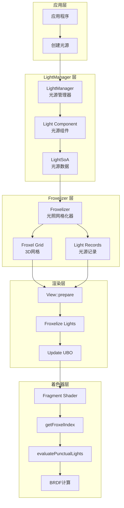
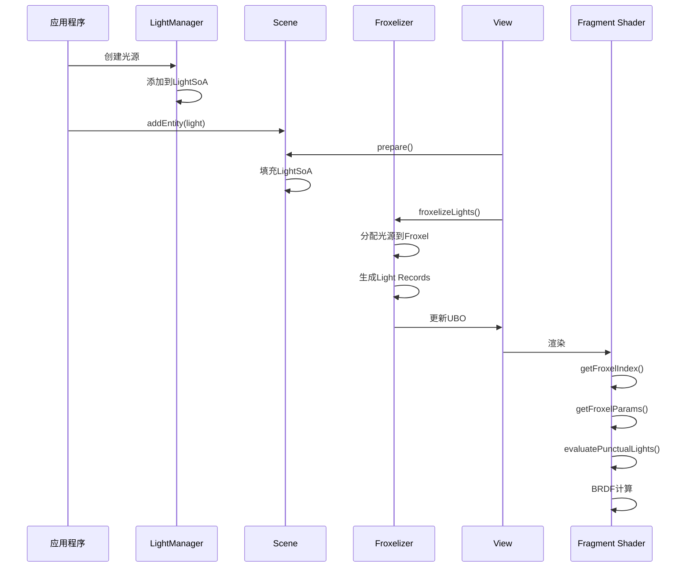
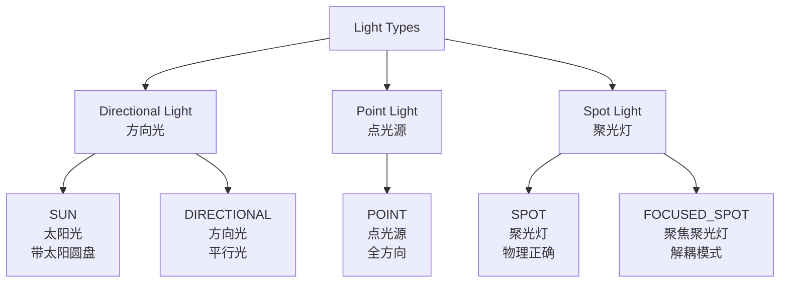
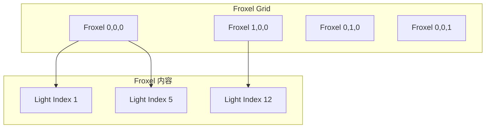
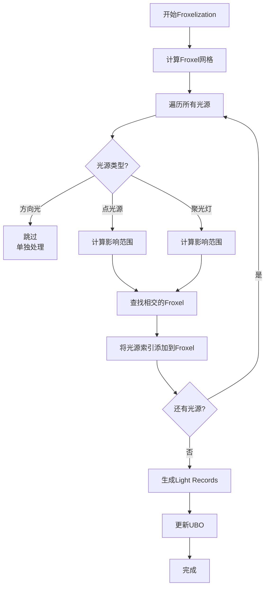
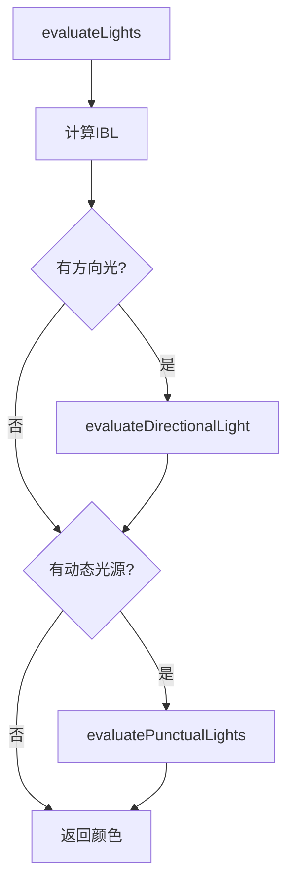
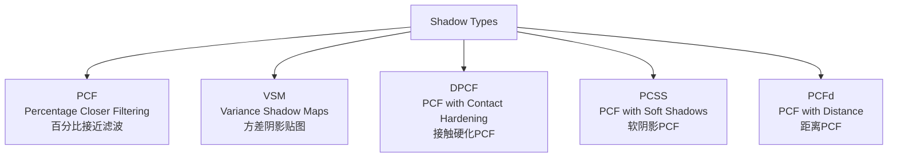
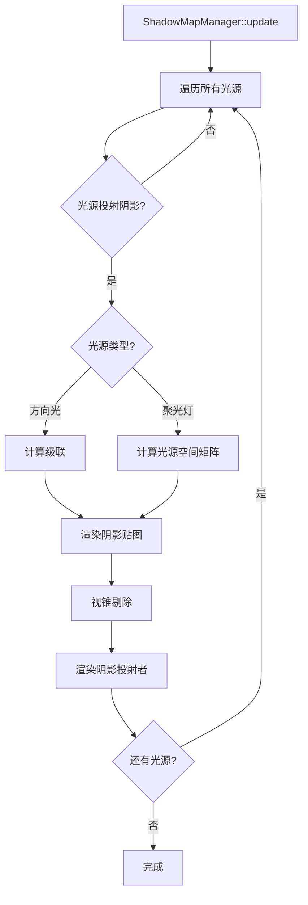

# Filament 光照与阴影系统完整分析

## 目录

1. [概述](#概述)
2. [光照系统架构](#光照系统架构)
3. [光照类型](#光照类型)
4. [Froxelization 光照网格化](#froxelization-光照网格化)
5. [光照计算](#光照计算)
6. [阴影系统](#阴影系统)
7. [阴影贴图管理](#阴影贴图管理)
8. [性能优化](#性能优化)

---

## 概述

### 系统定位

Filament 的光照与阴影系统是 PBR 渲染的核心，负责管理场景中的所有光源、计算光照贡献以及渲染阴影。系统采用**Froxelization（光照网格化）**技术实现高效的多光源处理，支持多种阴影算法（PCF、VSM、DPCF、PCSS）。

### 核心组件

- **LightManager**：光源管理器，管理场景中的所有光源
- **Froxelizer**：光照网格化器，将光源分配到空间网格中
- **ShadowMapManager**：阴影贴图管理器，管理阴影贴图的渲染和更新
- **光照计算着色器**：PBR 光照计算（BRDF、方向光、点光源、聚光灯）

### 设计特点

1. **多光源支持**：支持数百个光源（通过 Froxelization）
2. **多种阴影算法**：PCF、VSM、DPCF、PCSS
3. **级联阴影贴图**：方向光支持级联阴影（CSM）
4. **高效剔除**：基于 Froxel 的光源剔除

---

## 光照系统架构

### 整体架构图



### 数据流



---

## 光照类型

### 光源类型

Filament 支持三种主要光源类型：



### 1. 方向光（Directional Light）

**特性**：
- 具有方向，但没有位置
- 所有光线平行，来自无限远处
- 通常用于模拟太阳
- 支持阴影投射

**参数**：
- `direction`：光照方向
- `color`：颜色（线性空间）
- `intensity`：强度（lux）
- `sunAngularRadius`：太阳角半径（SUN 类型）

**代码示例**：

```cpp
Entity sun = EntityManager::get().create();

LightManager::Builder(Type::SUN)
    .direction({0.0f, -1.0f, 0.0f})
    .color(Color::toLinear<ACCURATE>({1.0f, 0.9f, 0.8f}))
    .intensity(110000.0f)  // lux
    .sunAngularRadius(0.00935f)  // 0.535度
    .castShadows(true)
    .build(*engine, sun);

scene->addEntity(sun);
```

### 2. 点光源（Point Light）

**特性**：
- 具有位置，在所有方向发光
- 强度随距离平方反比衰减
- 场景可以有多个点光源
- 不支持阴影投射（点光源阴影需要立方体贴图，开销大）

**参数**：
- `position`：光源位置
- `color`：颜色（线性空间）
- `intensity`：强度（lumen）
- `falloff`：衰减距离（超过此距离无影响）

**衰减公式**：

```
attenuation = (1 - (distance / falloff)²)² / distance²
```

**代码示例**：

```cpp
Entity pointLight = EntityManager::get().create();

LightManager::Builder(Type::POINT)
    .position({0.0f, 2.0f, 0.0f})
    .color(Color::toLinear<ACCURATE>({1.0f, 1.0f, 1.0f}))
    .intensity(1000.0f)  // lumen
    .falloff(10.0f)  // 10米
    .build(*engine, pointLight);

scene->addEntity(pointLight);
```

### 3. 聚光灯（Spot Light）

**特性**：
- 具有位置和方向
- 光照限制在圆锥内
- 支持阴影投射
- 两种模式：SPOT（解耦）和 FOCUSED_SPOT（物理正确）

**参数**：
- `position`：光源位置
- `direction`：光照方向
- `color`：颜色（线性空间）
- `intensity`：强度（lumen）
- `falloff`：衰减距离
- `spotLightCone`：圆锥角度（内角、外角）

**代码示例**：

```cpp
Entity spotLight = EntityManager::get().create();

LightManager::Builder(Type::SPOT)
    .position({0.0f, 5.0f, 0.0f})
    .direction({0.0f, -1.0f, 0.0f})
    .color(Color::toLinear<ACCURATE>({1.0f, 1.0f, 1.0f}))
    .intensity(1000.0f)  // lumen
    .falloff(10.0f)  // 10米
    .spotLightCone(innerCone, outerCone)  // 内角、外角（弧度）
    .castShadows(true)
    .build(*engine, spotLight);

scene->addEntity(spotLight);
```

---

## Froxelization 光照网格化

### Froxel 概念

**Froxel（Frustum Voxel）**是将视锥体划分为 3D 网格的体素单元，用于将光源分配到空间区域中，以便在着色器中高效地查找影响像素的光源。

### Froxel 网格结构



### Froxelizer 实现

**位置**：`filament/src/Froxelizer.h/cpp`

**关键方法**：

```cpp
class Froxelizer {
public:
    // 设置选项
    void setOptions(float zLightNear, float zLightFar);
    
    // 设置视口
    void setViewport(Viewport const& viewport);
    
    // 设置投影矩阵
    void setProjection(mat4 const& projection, float near, float far);
    
    // Froxelize 光源
    void froxelizeLights(FEngine& engine, 
                         mat4f const& viewMatrix,
                         const FScene::LightSoA& lightData);
    
    // 获取 Froxel 数量
    size_t getFroxelCountX() const noexcept;
    size_t getFroxelCountY() const noexcept;
    size_t getFroxelCountZ() const noexcept;
};
```

### Froxelization 流程



### Froxel 数据结构

**Froxel 定义**：

```cpp
class Froxel {
public:
    enum Planes {
        LEFT,    // 左平面
        RIGHT,   // 右平面
        BOTTOM,  // 下平面
        TOP,     // 上平面
        NEAR,    // 近平面
        FAR      // 远平面
    };
    
    float4 planes[6];  // 6个边界平面（法向量xyz + 距离w）
};
```

**Light Records**：

```
Froxel Record UBO:
  {index into light texture}
  {uint4 -> 16 indices}

  +-+
 0| |  <-- Froxel 0 的记录偏移
 1| |  <-- Froxel 1 的记录偏移
 2|0|  <-- Froxel 2 的记录偏移 = 0
 3|3|  <-- Froxel 3 的记录偏移 = 3
 :1:  <-- Froxel 4 的记录偏移 = 1
 : :
```

**Froxel 纹理**：

```
per-froxel light list texture
RG_U16 {offset, point-count, spot-count}

+----+
|0230|  <-- offset=02, 3点光源, 0聚光灯
|    |
|    |
:    :
+----+
h = num froxels
```

### 着色器中的使用

**获取 Froxel 索引**：

```glsl
// 从片段坐标计算 Froxel 索引
uvec3 getFroxelCoords(const highp vec3 fragCoords) {
    uvec3 froxelCoord;
    
    // X、Y 坐标直接映射
    froxelCoord.xy = uvec2(fragCoords.xy * frameUniforms.froxelCountXY);
    
    // Z 坐标使用对数映射（因为深度是非线性的）
    highp float viewSpaceNormalizedZ = frameUniforms.zParams.x * fragCoords.z + frameUniforms.zParams.y;
    float zSliceCount = frameUniforms.zParams.w;
    float sliceZWithoutOffset = log2(viewSpaceNormalizedZ) * frameUniforms.zParams.z;
    froxelCoord.z = uint(clamp(sliceZWithoutOffset + zSliceCount, 0.0, zSliceCount - 1.0));
    
    return froxelCoord;
}

uint getFroxelIndex(const highp vec3 fragCoords) {
    uvec3 froxelCoord = getFroxelCoords(fragCoords);
    return froxelCoord.x * frameUniforms.fParams.x +
           froxelCoord.y * frameUniforms.fParams.y +
           froxelCoord.z * frameUniforms.fParams.z;
}
```

**获取光源列表**：

```glsl
FroxelParams getFroxelParams(const uint froxelIndex) {
    uint w = froxelIndex >> 2u;
    uint c = froxelIndex & 0x3u;
    highp uvec4 d = froxelsUniforms.records[w];
    highp uint f = d[c];
    FroxelParams froxel;
    froxel.recordOffset = f >> 16u;  // 记录偏移
    froxel.count = f & 0xFFu;        // 光源数量
    return froxel;
}
```

---

## 光照计算

### PBR 光照模型

Filament 使用基于物理的渲染（PBR）模型，光照计算分为：

1. **直接光照**：方向光、点光源、聚光灯
2. **间接光照**：IBL（Image Based Lighting）

### 光照计算流程



### 方向光计算

**位置**：`shaders/src/surface_light_directional.fs`

**计算流程**：

```glsl
void evaluateDirectionalLight(const MaterialInputs material,
                              const PixelParams pixel, 
                              inout vec3 color) {
    // 1. 获取方向光
    Light light = getDirectionalLight();
    
    // 2. 检查通道掩码
    int channels = object_uniforms_flagsChannels & 0xFF;
    if ((light.channels & channels) == 0) {
        return;
    }
    
    // 3. 计算阴影可见性
    float visibility = 1.0;
    #if defined(VARIANT_HAS_SHADOWING)
    if (light.NoL > 0.0) {
        int cascade = getShadowCascade();
        visibility = shadow(true, shadowMap, cascade, 
                           getShadowPosition(cascade), 0.0);
    }
    #endif
    
    // 4. 计算光照贡献
    vec3 contribution = surfaceShading(pixel, light, visibility);
    color += contribution;
}
```

**太阳作为面光源**：

```glsl
vec3 sampleSunAreaLight(const vec3 lightDirection) {
    #if defined(SUN_AS_AREA_LIGHT)
    if (frameUniforms.sun.w >= 0.0) {
        // 模拟太阳为圆盘面光源
        float LoR = dot(lightDirection, shading_reflected);
        float d = frameUniforms.sun.x;  // 太阳角半径
        highp vec3 s = shading_reflected - LoR * lightDirection;
        return LoR < d ?
                normalize(lightDirection * d + normalize(s) * frameUniforms.sun.y) : 
                shading_reflected;
    }
    #endif
    return lightDirection;
}
```

### 点光源和聚光灯计算

**位置**：`shaders/src/surface_light_punctual.fs`

**计算流程**：

```glsl
void evaluatePunctualLights(const MaterialInputs material,
                            const PixelParams pixel, 
                            inout vec3 color) {
    // 1. 获取当前片段所在的 Froxel
    FroxelParams froxel = getFroxelParams(
        getFroxelIndex(getNormalizedPhysicalViewportCoord())
    );
    
    // 2. 遍历 Froxel 中的所有光源
    uint index = froxel.recordOffset;
    uint end = index + froxel.count;
    
    for (uint i = index; i < end; i++) {
        // 3. 获取光源索引
        uint lightIndex = getLightIndex(i);
        
        // 4. 获取光源数据
        Light light = getLight(lightIndex);
        
        // 5. 检查通道掩码
        int channels = object_uniforms_flagsChannels & 0xFF;
        if ((light.channels & channels) == 0) {
            continue;
        }
        
        // 6. 计算阴影可见性（如果是聚光灯）
        float visibility = 1.0;
        #if defined(VARIANT_HAS_SHADOWING)
        if (light.castsShadows && light.NoL > 0.0) {
            visibility = shadow(false, shadowMap, light.shadowIndex,
                                getShadowPosition(light.shadowIndex, light.direction, light.zLight),
                                light.zLight);
        }
        #endif
        
        // 7. 计算光照贡献
        vec3 contribution = surfaceShading(pixel, light, visibility);
        color += contribution;
    }
}
```

**光源衰减**：

```glsl
// 距离衰减
float getDistanceAttenuation(const highp vec3 posToLight, float falloff) {
    float distanceSquare = dot(posToLight, posToLight);
    float attenuation = getSquareFalloffAttenuation(distanceSquare, falloff);
    
    // 远距离衰减（避免光源影响太远）
    highp vec3 v = getWorldPosition() - getWorldCameraPosition();
    attenuation *= saturate(frameUniforms.lightFarAttenuationParams.x - 
                           dot(v, v) * frameUniforms.lightFarAttenuationParams.y);
    
    // 平方反比衰减
    return attenuation / max(distanceSquare, 1e-4);
}

// 角度衰减（聚光灯）
float getAngleAttenuation(const highp vec3 lightDir, 
                         const highp vec3 l, 
                         const highp vec2 scaleOffset) {
    float cd = dot(lightDir, l);
    float attenuation = saturate(cd * scaleOffset.x + scaleOffset.y);
    return attenuation * attenuation;
}
```

### BRDF 计算

**位置**：`shaders/src/surface_shading_model_standard.fs`

**表面着色**：

```glsl
vec3 surfaceShading(const PixelParams pixel, const Light light, float occlusion) {
    vec3 h = normalize(shading_view + light.l);
    
    float NoV = shading_NoV;
    float NoL = saturate(light.NoL);
    float NoH = saturate(dot(shading_normal, h));
    float LoH = saturate(dot(light.l, h));
    
    // 镜面反射项（Cook-Torrance BRDF）
    vec3 Fr = specularLobe(pixel, light, h, NoV, NoL, NoH, LoH);
    
    // 漫反射项
    vec3 Fd = diffuseLobe(pixel, NoV, NoL, LoH);
    
    // 能量补偿（抵消高粗糙度下的变暗）
    vec3 color = Fd + Fr * pixel.energyCompensation;
    
    // 清漆层（Clear Coat）
    #if defined(MATERIAL_HAS_CLEAR_COAT)
    float Fcc;
    float clearCoat = clearCoatLobe(pixel, h, NoH, LoH, Fcc);
    float attenuation = 1.0 - Fcc;
    color *= attenuation * NoL;
    color += clearCoat;
    #endif
    
    return color * light.colorIntensity.rgb * 
           (light.colorIntensity.w * light.attenuation) * 
           light.NoL * occlusion;
}
```

---

## 阴影系统

### 阴影类型

Filament 支持多种阴影算法：



### 1. PCF（Percentage Closer Filtering）

**特点**：
- 标准阴影贴图 + 多重采样
- 硬件支持（`sampler2DArrayShadow`）
- 性能好，质量中等

**实现**：

```glsl
float ShadowSample_PCF_Hard(const mediump sampler2DArrayShadow shadowMap,
                            const highp vec4 scissorNormalized,
                            const uint layer,
                            const highp vec4 shadowPosition) {
    highp vec3 position = vec3(shadowPosition.xy * (1.0 / shadowPosition.w), 
                               shadowPosition.z);
    
    // 硬阴影：单次采样
    return texture(shadowMap, vec4(position.xy, layer, position.z));
}

float ShadowSample_PCF_Low(const mediump sampler2DArrayShadow shadowMap,
                          const highp vec4 scissorNormalized,
                          const uint layer,
                          const highp vec4 shadowPosition) {
    highp vec3 position = vec3(shadowPosition.xy * (1.0 / shadowPosition.w), 
                               shadowPosition.z);
    
    // 低质量PCF：2x2采样
    float depth = position.z;
    vec2 uv = position.xy;
    vec2 texelSize = 1.0 / vec2(textureSize(shadowMap, 0));
    
    float shadow = 0.0;
    for (int y = -1; y <= 1; y++) {
        for (int x = -1; x <= 1; x++) {
            vec2 offset = vec2(x, y) * texelSize;
            shadow += texture(shadowMap, vec4(uv + offset, layer, depth));
        }
    }
    return shadow / 9.0;
}
```

### 2. VSM（Variance Shadow Maps）

**特点**：
- 使用矩（Moments）存储深度信息
- 支持软阴影和过滤
- 可以使用 Mipmap
- 可能有光泄漏（Light Bleeding）

**实现**：

```glsl
float evaluateShadowVSM(const highp vec2 moments, const highp float depth) {
    highp float depthScale = frameUniforms.vsmDepthScale * depth;
    highp float minVariance = depthScale * depthScale;
    return chebyshevUpperBound(moments, depth, minVariance, 
                              frameUniforms.vsmLightBleedReduction);
}

float chebyshevUpperBound(const highp vec2 moments, 
                         const highp float mean,
                         const highp float minVariance, 
                         const float lightBleedReduction) {
    // Donnelly and Lauritzen 2006, "Variance Shadow Maps"
    
    highp float variance = moments.y - (moments.x * moments.x);
    variance = max(variance, minVariance);
    
    highp float d = mean - moments.x;
    float pMax = variance / (variance + d * d);
    
    // 减少光泄漏
    pMax = reduceLightBleed(pMax, lightBleedReduction);
    
    return mean <= moments.x ? 1.0 : pMax;
}
```

### 3. DPCF（PCF with Contact Hardening）

**特点**：
- 基于距离的接触硬化
- 近处硬阴影，远处软阴影
- 性能中等

### 4. PCSS（PCF with Soft Shadows）

**特点**：
- 软阴影 + 接触硬化
- 基于遮挡物距离调整采样范围
- 质量最好，性能最差

### 阴影贴图类型

#### 1. 方向光阴影

**级联阴影贴图（CSM）**：

- 将视锥体分为多个级联
- 每个级联使用独立的阴影贴图
- 近处高分辨率，远处低分辨率

**级联选择**：

```glsl
int getShadowCascade() {
    highp vec3 viewPos = mulMat4x4Float3(getViewFromWorldMatrix(), 
                                         getWorldPosition()).xyz;
    highp float z = abs(viewPos.z);
    
    // 根据深度选择级联
    for (int i = 0; i < SHADOW_CASCADE_COUNT; i++) {
        if (z < frameUniforms.cascadeSplits[i]) {
            return i;
        }
    }
    return SHADOW_CASCADE_COUNT - 1;
}
```

#### 2. 聚光灯阴影

**单张阴影贴图**：

- 从光源视角渲染
- 使用透视投影
- 支持 PCF、VSM、DPCF、PCSS

#### 3. 点光源阴影

**立方体贴图阴影**：

- 6 个面的立方体贴图
- 开销较大，通常不使用

---

## 阴影贴图管理

### ShadowMapManager

**位置**：`filament/src/ShadowMapManager.h/cpp`

ShadowMapManager 负责管理所有阴影贴图的渲染和更新。

**关键方法**：

```cpp
class ShadowMapManager {
public:
    // 更新阴影贴图
    void update(FEngine& engine, FView& view, 
                FScene::RenderableSoa& renderableData, 
                FScene::LightSoa& lightData);
    
    // 渲染阴影贴图
    void render(FEngine& engine, FView& view, 
                RenderPass const& pass, 
                FScene::RenderableSoa& renderableData);
    
    // 获取阴影贴图信息
    ShadowMapInfo getShadowMapInfo() const;
};
```

### ShadowMap

**位置**：`filament/src/ShadowMap.h/cpp`

ShadowMap 表示单个光源的阴影贴图。

**关键方法**：

```cpp
class ShadowMap {
public:
    enum class ShadowType {
        DIRECTIONAL,  // 方向光
        SPOT,         // 聚光灯
        POINT         // 点光源
    };
    
    // 更新阴影贴图
    void update(FEngine& engine, FView& view, 
                CameraInfo const& camera,
                FScene::RenderableSoa& renderableData,
                FScene::LightSoa& lightData);
    
    // 渲染阴影贴图
    void render(FEngine& engine, FView& view, 
                RenderPass const& pass,
                FScene::RenderableSoa& renderableData);
    
    // 计算光源空间矩阵
    mat4 computeLightSpaceMatrix(CameraInfo const& camera,
                                 SceneInfo const& scene);
};
```

### 阴影贴图渲染流程



### 阴影贴图图集

**图集布局**：

```
┌─────────────────────────────────────────┐
│ Shadow Map Atlas (1024x1024)            │
├─────────────────────────────────────────┤
│ ┌──────────┬──────────┐                │
│ │ Cascade0 │ Cascade1 │                │
│ │ (512x512)│ (512x512)│                │
│ ├──────────┼──────────┤                │
│ │ Cascade2 │ Cascade3 │                │
│ │ (512x512)│ (512x512)│                │
│ └──────────┴──────────┘                │
└─────────────────────────────────────────┘
```

**图集管理**：

- 使用纹理图集存储多个阴影贴图
- 每个阴影贴图占用图集的一个区域
- 支持动态分配和回收

---

## 性能优化

### 1. Froxelization 优化

**光源剔除**：
- 只处理影响当前 Froxel 的光源
- 减少着色器中的光源数量
- 提高渲染性能

**网格大小**：
- 默认：16x9x16（X×Y×Z）
- 可根据场景调整
- 更大的网格 = 更少的 Froxel，但每个 Froxel 包含更多光源

### 2. 阴影优化

**级联阴影优化**：
- 根据距离选择合适的级联
- 近处使用高分辨率，远处使用低分辨率
- 减少阴影贴图大小

**阴影贴图分辨率**：
- 方向光：通常 2048x2048 或 4096x4096
- 聚光灯：通常 1024x1024 或 2048x2048
- 可根据性能需求调整

**阴影距离**：
- 设置合理的阴影距离
- 超出距离的物体不投射阴影
- 减少阴影贴图渲染开销

### 3. 光照优化

**衰减距离**：
- 使用尽可能小的衰减距离
- 减少光源重叠
- 提高性能

**光源类型选择**：
- 优先使用聚光灯而不是点光源
- 使用最小的外圆锥角
- 减少光源影响范围

### 4. 着色器优化

**变体系统**：
- 根据是否有光源生成不同的着色器变体
- 避免运行时分支
- 提高着色器性能

**通道掩码**：
- 使用通道掩码过滤不需要的光源
- 减少光照计算
- 提高性能

---

## 总结

### 光照与阴影系统特点

1. **多光源支持**
   - 通过 Froxelization 支持数百个光源
   - 高效的光源剔除
   - 基于网格的光源分配

2. **多种阴影算法**
   - PCF：标准阴影，性能好
   - VSM：软阴影，支持过滤
   - DPCF/PCSS：接触硬化，质量高

3. **级联阴影**
   - 方向光支持级联阴影
   - 近处高分辨率，远处低分辨率
   - 平衡质量和性能

4. **PBR 光照**
   - 基于物理的 BRDF
   - 支持多种材质模型
   - 能量守恒

### 关键文件

| 文件 | 说明 |
|------|------|
| `filament/include/filament/LightManager.h` | LightManager 公共接口 |
| `filament/src/components/LightManager.h/cpp` | LightManager 实现 |
| `filament/src/Froxelizer.h/cpp` | Froxelizer 实现 |
| `filament/src/ShadowMap.h/cpp` | ShadowMap 实现 |
| `filament/src/ShadowMapManager.h/cpp` | ShadowMapManager 实现 |
| `shaders/src/surface_light_directional.fs` | 方向光计算 |
| `shaders/src/surface_light_punctual.fs` | 点光源/聚光灯计算 |
| `shaders/src/surface_shadowing.fs` | 阴影采样 |

### 使用建议

1. **光源设置**
   - 使用尽可能小的衰减距离
   - 优先使用聚光灯
   - 避免光源过度重叠

2. **阴影设置**
   - 根据性能需求选择阴影算法
   - 设置合理的阴影距离
   - 调整阴影贴图分辨率

3. **性能监控**
   - 监控 Froxel 中的光源数量
   - 监控阴影贴图渲染时间
   - 根据性能调整参数

---

**文档版本**：1.0  
**最后更新**：2024年  
**作者**：Filament学习文档

