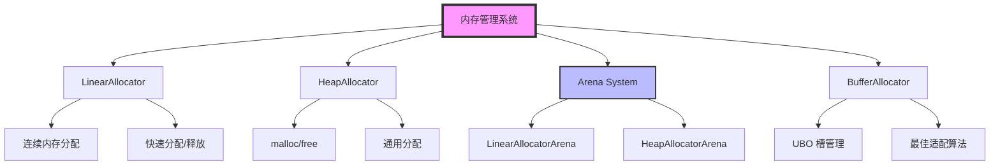

# Filament 内存管理架构完整分析

## 目录
1. [概述](#概述)
2. [架构设计](#架构设计)
3. [分配器类型](#分配器类型)
4. [Arena 系统](#arena-系统)
5. [缓冲区分配器](#缓冲区分配器)
6. [资源管理](#资源管理)
7. [内存对齐](#内存对齐)
8. [性能优化](#性能优化)
9. [使用示例](#使用示例)

---

## 概述

Filament 使用多层次的内存管理系统，包括线性分配器、堆分配器、Arena 系统等。内存管理系统的设计目标是减少内存分配开销、提高缓存局部性、支持多线程安全。

### 核心特性
- **多种分配器**：线性分配器、堆分配器、Arena 系统
- **内存对齐**：支持自定义对齐要求
- **缓冲区管理**：专门的缓冲区分配器用于 UBO 管理
- **资源跟踪**：调试模式下跟踪内存分配
- **线程安全**：支持多线程环境下的内存分配

---

## 架构设计

### 架构图



### 类层次结构

```
Allocator (接口)
  ├── LinearAllocator (线性分配器)
  ├── HeapAllocator (堆分配器)
  └── LinearAllocatorWithFallback (带回退的线性分配器)

Arena<Allocator, LockingPolicy, TrackingPolicy>
  ├── LinearAllocatorArena (线性分配器 Arena)
  └── HeapAllocatorArena (堆分配器 Arena)

BufferAllocator (缓冲区分配器)
```

---

## 分配器类型

### 1. LinearAllocator

线性分配器提供快速的内存分配，但只能从顶部释放。

**特点**：
- 连续内存分配
- 只能从顶部释放（rewind）
- 不调用析构函数
- 适合临时对象分配

**实现**：
```cpp
class LinearAllocator {
    void* mBegin;      // 内存区域起始地址
    uint32_t mSize;    // 内存区域大小
    uint32_t mCur;     // 当前分配位置
    
    void* alloc(size_t size, size_t alignment = alignof(std::max_align_t)) {
        // 对齐当前指针
        void* p = align(current(), alignment);
        void* c = add(p, size);
        
        // 检查是否超出边界
        if (c <= end()) {
            set_current(c);
            return p;
        }
        return nullptr;  // 内存不足
    }
    
    void rewind(void* p) {
        // 释放内存回到指定位置
        assert(p >= mBegin && p < end());
        set_current(p);
    }
    
    void reset() {
        // 重置所有分配
        rewind(mBegin);
    }
};
```

**使用场景**：
- 临时对象分配
- 帧内临时数据
- 命令缓冲区

### 2. HeapAllocator

堆分配器使用标准的 `malloc/free`。

**特点**：
- 使用系统堆分配
- 支持任意大小的分配和释放
- 线程安全（系统堆本身是同步的）

**实现**：
```cpp
class HeapAllocator {
    void* alloc(size_t size, size_t alignment = alignof(std::max_align_t)) {
        return aligned_alloc(size, alignment);
    }
    
    void free(void* p) noexcept {
        aligned_free(p);
    }
};
```

**使用场景**：
- 长期存在的对象
- 大小不固定的分配
- 需要单独释放的对象

### 3. LinearAllocatorWithFallback

带回退的线性分配器，当线性分配器内存不足时回退到堆分配器。

**特点**：
- 优先使用线性分配器
- 内存不足时使用堆分配器
- 重置时释放所有堆分配

**实现**：
```cpp
class LinearAllocatorWithFallback 
    : private LinearAllocator, private HeapAllocator {
    std::vector<void*> mHeapAllocations;  // 堆分配列表
    
    void* alloc(size_t size, size_t alignment) {
        // 先尝试线性分配
        void* p = LinearAllocator::alloc(size, alignment);
        if (p) {
            return p;
        }
        
        // 线性分配失败，使用堆分配
        p = HeapAllocator::alloc(size, alignment);
        if (p) {
            mHeapAllocations.push_back(p);
        }
        return p;
    }
    
    void reset() {
        // 释放所有堆分配
        for (void* p : mHeapAllocations) {
            HeapAllocator::free(p);
        }
        mHeapAllocations.clear();
        
        // 重置线性分配器
        LinearAllocator::reset();
    }
};
```

---

## Arena 系统

### Arena 模板

Arena 是一个通用的内存管理包装器，提供分配器、锁定策略、跟踪策略的组合。

**模板参数**：
```cpp
template<
    typename Allocator,              // 分配器类型
    typename LockingPolicy,          // 锁定策略
    typename TrackingPolicy,          // 跟踪策略
    typename AreaPolicy = NullArea   // 区域策略
>
class Arena;
```

### 锁定策略

```cpp
namespace LockingPolicy {
    struct NoLock {
        // 无锁策略（单线程使用）
    };
    
    struct Mutex {
        // 互斥锁策略（多线程使用）
        Mutex mMutex;
    };
}
```

### 跟踪策略

```cpp
namespace TrackingPolicy {
    struct Untracked {
        // 不跟踪分配（发布版本）
    };
    
    struct DebugAndHighWatermark {
        // 调试和高水位标记跟踪（调试版本）
        size_t mAllocatedBytes;
        size_t mHighWatermark;
    };
}
```

### LinearAllocatorArena

```cpp
// 调试版本
using LinearAllocatorArena = Arena<
    LinearAllocator,
    LockingPolicy::NoLock,
    TrackingPolicy::DebugAndHighWatermark
>;

// 发布版本
using LinearAllocatorArena = Arena<
    LinearAllocator,
    LockingPolicy::NoLock
>;
```

### HeapAllocatorArena

```cpp
// 调试版本
using HeapAllocatorArena = Arena<
    HeapAllocator,
    LockingPolicy::Mutex,
    TrackingPolicy::DebugAndHighWatermark,
    AreaPolicy::NullArea
>;

// 发布版本
using HeapAllocatorArena = Arena<
    HeapAllocator,
    LockingPolicy::NoLock,
    TrackingPolicy::Untracked,
    AreaPolicy::NullArea
>;
```

---

## 缓冲区分配器

### BufferAllocator

缓冲区分配器用于管理统一缓冲区对象（UBO）中的槽分配。

**特点**：
- 最佳适配算法
- 槽合并
- GPU 使用计数
- 非线程安全（需要外部同步）

**槽结构**：
```cpp
struct Slot {
    const allocation_size_t offset;   // 偏移量
    allocation_size_t slotSize;       // 槽大小
    bool isAllocated;                 // 是否已分配
    uint32_t gpuUseCount;             // GPU 使用计数
};
```

**数据结构**：
```cpp
class BufferAllocator {
    allocation_size_t mTotalSize;     // 总大小
    const allocation_size_t mSlotSize; // 槽大小（必须是 2 的幂）
    
    // 所有槽（包括已分配和已释放的）
    std::list<InternalSlotNode> mSlotPool;
    
    // 空闲列表（按槽大小排序）
    std::multimap<allocation_size_t, InternalSlotNode*> mFreeList;
    
    // 偏移映射（按槽偏移索引）
    std::unordered_map<allocation_size_t, InternalSlotNode*> mOffsetMap;
};
```

### 分配算法

```cpp
std::pair<AllocationId, allocation_size_t> 
    BufferAllocator::allocate(allocation_size_t size) {
    // 1. 对齐大小
    const allocation_size_t alignedSize = alignUp(size);
    
    // 2. 查找最佳适配（大于等于请求大小的最小槽）
    auto bestFitIter = mFreeList.lower_bound(alignedSize);
    
    if (bestFitIter == mFreeList.end()) {
        // 没有足够大的槽
        return {REALLOCATION_REQUIRED, 0};
    }
    
    // 3. 获取节点
    InternalSlotNode* node = bestFitIter->second;
    Slot& slot = node->slot;
    
    // 4. 从空闲列表移除
    mFreeList.erase(bestFitIter);
    
    // 5. 如果槽大于请求大小，分割槽
    if (slot.slotSize > alignedSize) {
        // 创建新槽（剩余部分）
        InternalSlotNode* newNode = createNewSlot(
            slot.offset + alignedSize,
            slot.slotSize - alignedSize
        );
        
        // 更新原槽大小
        slot.slotSize = alignedSize;
    }
    
    // 6. 标记为已分配
    slot.isAllocated = true;
    
    // 7. 计算分配 ID
    AllocationId id = calculateIdByOffset(slot.offset);
    
    return {id, slot.offset};
}
```

### 回收算法

```cpp
void BufferAllocator::retire(AllocationId id) {
    InternalSlotNode* node = getNodeById(id);
    if (!node) {
        return;
    }
    
    Slot& slot = node->slot;
    
    // 标记为未分配
    slot.isAllocated = false;
    
    // 标记有待释放的槽
    mHasPendingFrees = true;
}

void BufferAllocator::releaseFreeSlots() {
    // 遍历所有槽，释放既不被 CPU 也不被 GPU 使用的槽
    for (auto it = mSlotPool.begin(); it != mSlotPool.end();) {
        InternalSlotNode& node = *it;
        Slot& slot = node.slot;
        
        if (slot.isFree()) {
            // 尝试合并相邻的空闲槽
            mergeAdjacentFreeSlots(node);
            
            // 从空闲列表移除
            mFreeList.erase(node.freeListIterator);
            mOffsetMap.erase(node.offsetMapIterator);
            
            // 从槽池移除
            it = mSlotPool.erase(it);
        } else {
            ++it;
        }
    }
    
    mHasPendingFrees = false;
}
```

### GPU 使用计数

```cpp
void BufferAllocator::acquireGpu(AllocationId id) {
    InternalSlotNode* node = getNodeById(id);
    if (node) {
        node->slot.gpuUseCount++;
    }
}

void BufferAllocator::releaseGpu(AllocationId id) {
    InternalSlotNode* node = getNodeById(id);
    if (node) {
        node->slot.gpuUseCount--;
        mHasPendingFrees = true;
    }
}
```

---

## 资源管理

### HandleAllocator

HandleAllocator 用于管理 GPU 资源句柄。

**特点**：
- 句柄池管理
- 引用计数
- 调试标签支持

**实现**：
```cpp
class HandleAllocator {
    LinearAllocatorArena mArena;      // 内存 Arena
    std::vector<HandleBase*> mHandles; // 句柄数组
    std::unordered_map<HandleId, ImmutableCString> mTags; // 调试标签
    
    template<typename T>
    Handle<T> allocate() {
        // 分配句柄
        HandleId id = allocateId();
        
        // 分配对象内存
        T* obj = mArena.alloc<T>();
        
        // 构造对象
        new (obj) T();
        
        // 保存句柄
        mHandles[id] = obj;
        
        return Handle<T>(id);
    }
    
    template<typename T>
    void deallocate(Handle<T> handle) {
        // 获取对象
        T* obj = getObject<T>(handle);
        
        // 析构对象
        obj->~T();
        
        // 释放句柄 ID
        deallocateId(handle.getId());
    }
};
```

### ResourceManager (Vulkan)

Vulkan 后端的资源管理器。

**特点**：
- 资源引用计数
- 自动垃圾回收
- 线程安全资源支持

**实现**：
```cpp
class ResourceManager {
    HandleAllocatorVK mHandleAllocatorImpl;
    
    template<typename D, typename B, typename... ARGS>
    D* construct(Handle<B> const& handle, ARGS&&... args) {
        // 构造资源对象
        D* obj = mHandleAllocatorImpl.construct<D, B>(
            handle, std::forward<ARGS>(args)...
        );
        
        // 初始化资源
        if constexpr (requires_thread_safety<D>::value) {
            ((ThreadSafeResource*) obj)->init<D>(handle.getId(), this);
        } else {
            ((Resource*) obj)->init<D>(handle.getId(), this);
        }
        
        return obj;
    }
    
    void gc() {
        // 垃圾回收：释放引用计数为 0 的资源
        mHandleAllocatorImpl.gc();
    }
};
```

---

## 内存对齐

### 对齐函数

```cpp
namespace pointermath {
    template<typename P>
    static P* align(P* p, size_t alignment) noexcept {
        // alignment 必须是 2 的幂
        assert(alignment && !(alignment & alignment-1));
        return (P*) ((uintptr_t(p) + alignment - 1) & ~(alignment - 1));
    }
    
    template<typename P>
    static P* align(P* p, size_t alignment, size_t offset) noexcept {
        P* const r = align(add(p, offset), alignment);
        assert(r >= add(p, offset));
        return r;
    }
}
```

### 对齐分配

```cpp
void* LinearAllocator::alloc(size_t size, size_t alignment, size_t extra) {
    // 对齐当前指针（考虑额外偏移）
    void* p = pointermath::align(current(), alignment, extra);
    void* c = pointermath::add(p, size);
    
    // 检查是否超出边界
    bool success = c <= end();
    set_current(success ? c : current());
    return success ? p : nullptr;
}
```

---

## 性能优化

### 1. 线性分配器
- **快速分配**：O(1) 时间复杂度
- **缓存友好**：连续内存分配
- **无碎片**：不会产生内存碎片

### 2. Arena 系统
- **批量分配**：减少系统调用
- **局部性**：相关对象分配在一起
- **快速释放**：重置整个 Arena

### 3. 缓冲区分配器
- **最佳适配**：减少内存浪费
- **槽合并**：减少碎片
- **延迟释放**：批量释放空闲槽

### 4. 内存对齐
- **SIMD 优化**：对齐到 SIMD 宽度
- **缓存行对齐**：减少 false sharing
- **GPU 对齐**：满足 GPU 对齐要求

---

## 使用示例

### 线性分配器

```cpp
// 创建内存区域
char buffer[1024 * 1024];
LinearAllocator allocator(buffer, buffer + sizeof(buffer));

// 分配内存
void* p1 = allocator.alloc(100);
void* p2 = allocator.alloc(200);

// 释放到指定位置
allocator.rewind(p1);

// 重置所有分配
allocator.reset();
```

### Arena 系统

```cpp
// 创建 Arena
LinearAllocatorArena arena(1024 * 1024);

// 分配对象
MyObject* obj = arena.alloc<MyObject>();
new (obj) MyObject();

// 重置 Arena（释放所有对象）
arena.reset();
```

### 缓冲区分配器

```cpp
// 创建缓冲区分配器
BufferAllocator allocator(1024 * 1024, 256);  // 总大小 1MB，槽大小 256 字节

// 分配槽
auto [id, offset] = allocator.allocate(512);  // 分配 512 字节

// 获取 GPU 读取锁
allocator.acquireGpu(id);

// 释放 GPU 读取锁
allocator.releaseGpu(id);

// 回收分配
allocator.retire(id);

// 释放空闲槽
allocator.releaseFreeSlots();
```

### HandleAllocator

```cpp
// 创建 HandleAllocator
HandleAllocator allocator(4 * 1024 * 1024);  // 4MB Arena

// 分配句柄
Handle<MyResource> handle = allocator.allocate<MyResource>();

// 获取对象
MyResource* obj = allocator.getObject<MyResource>(handle);

// 释放句柄
allocator.deallocate(handle);
```

---

## 总结

Filament 的内存管理系统提供了多层次的内存分配策略：

1. **多种分配器**：线性分配器、堆分配器、Arena 系统
2. **缓冲区管理**：专门的缓冲区分配器用于 UBO 管理
3. **资源跟踪**：调试模式下跟踪内存分配
4. **性能优化**：缓存友好、无碎片、快速分配
5. **线程安全**：支持多线程环境下的内存分配
6. **内存对齐**：支持自定义对齐要求，优化 SIMD 和 GPU 访问

这些机制使得 Filament 能够高效地管理内存，减少分配开销，提高渲染性能。

