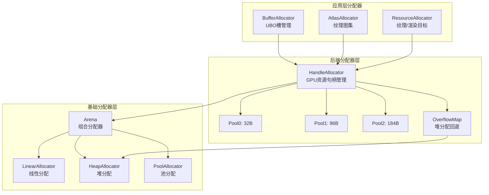
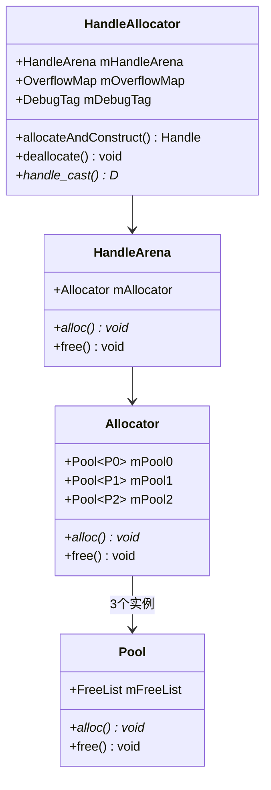
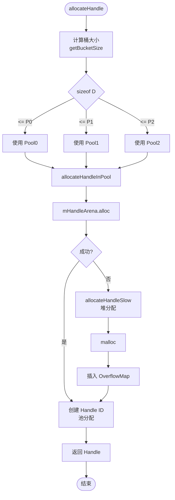
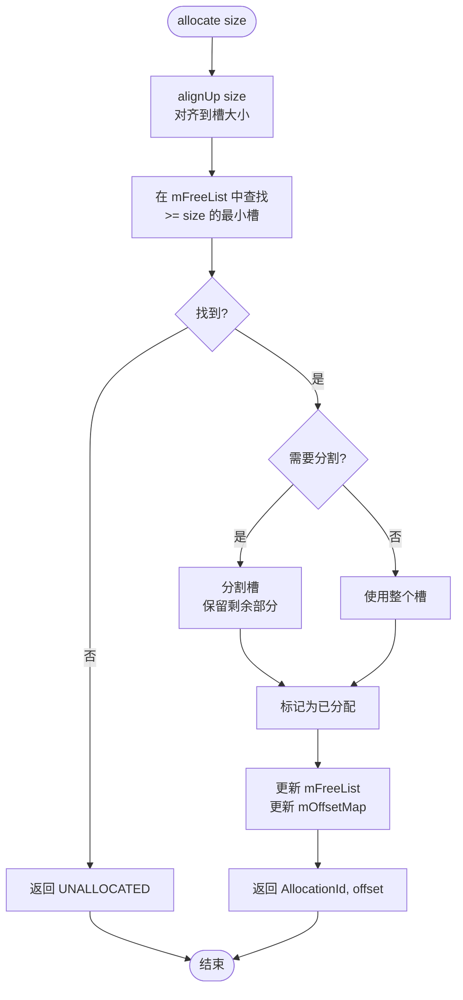
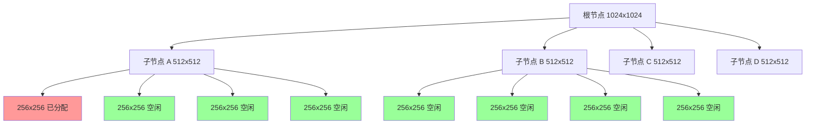
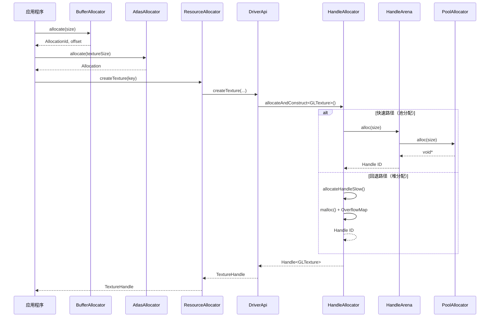

# Filament 分配器架构设计完整分析

## 目录

1. [概述](#概述)
2. [架构层次](#架构层次)
3. [基础分配器层](#基础分配器层)
4. [后端分配器层](#后端分配器层)
5. [应用层分配器](#应用层分配器)
6. [分配器关系图](#分配器关系图)
7. [设计模式](#设计模式)
8. [性能优化策略](#性能优化策略)

---

## 概述

Filament 使用**分层分配器架构**来管理不同层次的内存需求：

- **基础分配器层**：提供底层内存分配能力（线性、堆、池）
- **后端分配器层**：管理 GPU 资源句柄的生命周期
- **应用层分配器**：管理特定应用场景的内存分配（缓冲区、图集、资源）

### 核心设计原则

1. **分层抽象**：不同层次使用不同的分配策略
2. **性能优先**：关键路径使用池分配和线性分配
3. **类型安全**：使用模板和类型系统保证安全
4. **调试支持**：提供调试版本和发布版本的差异化实现

---

## 架构层次

### 整体架构图

```
┌─────────────────────────────────────────────────────────────┐
│                    应用层分配器                                │
│  ┌──────────────┐  ┌──────────────┐  ┌──────────────┐     │
│  │BufferAllocator│  │AtlasAllocator │  │ResourceAllocator│  │
│  │(UBO槽管理)   │  │(纹理图集)    │  │(纹理/渲染目标) │     │
│  └──────────────┘  └──────────────┘  └──────────────┘     │
└─────────────────────────────────────────────────────────────┘
                            │
                            │ 使用
                            ▼
┌─────────────────────────────────────────────────────────────┐
│                    后端分配器层                                │
│  ┌──────────────────────────────────────────────────────┐  │
│  │         HandleAllocator                               │  │
│  │  (GPU资源句柄管理: Texture, Buffer, RenderTarget等)   │  │
│  │                                                       │  │
│  │  ┌──────────┐  ┌──────────┐  ┌──────────┐          │  │
│  │  │ Pool0    │  │ Pool1    │  │ Pool2    │          │  │
│  │  │ (32B)    │  │ (96B)    │  │ (184B)   │          │  │
│  │  └──────────┘  └──────────┘  └──────────┘          │  │
│  └──────────────────────────────────────────────────────┘  │
└─────────────────────────────────────────────────────────────┘
                            │
                            │ 基于
                            ▼
┌─────────────────────────────────────────────────────────────┐
│                    基础分配器层                                │
│  ┌──────────────┐  ┌──────────────┐  ┌──────────────┐     │
│  │LinearAllocator│  │HeapAllocator │  │PoolAllocator │     │
│  │(线性分配)    │  │(堆分配)      │  │(池分配)      │     │
│  │              │  │              │  │              │     │
│  │ O(1) 分配    │  │ malloc/free │  │ 空闲列表     │     │
│  │ 连续内存     │  │ 通用分配    │  │ 固定大小     │     │
│  └──────────────┘  └──────────────┘  └──────────────┘     │
│                                                              │
│  ┌──────────────────────────────────────────────────────┐  │
│  │              Arena (竞技场)                          │  │
│  │  ┌────────────┐  ┌────────────┐  ┌────────────┐   │  │
│  │  │Allocator   │  │Locking     │  │Tracking   │   │  │
│  │  │Policy      │  │Policy      │  │Policy     │   │  │
│  │  └────────────┘  └────────────┘  └────────────┘   │  │
│  └──────────────────────────────────────────────────────┘  │
└─────────────────────────────────────────────────────────────┘
```

### Mermaid 架构图



---

## 基础分配器层

### 1. LinearAllocator（线性分配器）

**设计目的**：提供快速、连续的内存分配，适用于临时对象和栈式分配。

**特性**：
- ✅ 分配速度快（O(1)）
- ✅ 内存局部性好
- ✅ 支持回退（rewind）到指定位置
- ❌ 不支持单独释放
- ❌ 只能整体重置

**实现原理**：
```
内存布局：
┌─────────────────────────────────────────┐
│ 已分配区域  │  空闲区域  │               │
└─────────────────────────────────────────┘
             ↑
          current指针

分配过程：
1. 对齐 current 指针到 alignment
2. 检查是否有足够空间 (current + size <= end)
3. 更新 current 指针
4. 返回分配地址
```

**关键代码**：
```cpp
void* alloc(size_t size, size_t alignment, size_t extra) {
    void* const p = align(current(), alignment, extra);
    void* const c = add(p, size);
    bool const success = c <= end();
    set_current(success ? c : current());
    return success ? p : nullptr;
}
```

**使用场景**：
- 帧内临时对象
- 命令缓冲区
- 单次渲染的临时数据

---

### 2. HeapAllocator（堆分配器）

**设计目的**：提供通用的堆内存分配，作为回退机制。

**特性**：
- ✅ 支持任意大小的分配
- ✅ 支持单独释放
- ❌ 分配速度较慢
- ❌ 可能产生碎片

**实现**：封装 `malloc/free`

**使用场景**：
- 大对象分配
- 长期存在的对象
- 线性分配器的回退

---

### 3. PoolAllocator（池分配器）

**设计目的**：为固定大小的对象提供快速分配，避免碎片。

**特性**：
- ✅ 分配/释放速度快（O(1)）
- ✅ 无内存碎片
- ✅ 内存局部性好
- ❌ 只能分配固定大小

**实现原理**：
```
空闲列表（FreeList）：
┌─────┐    ┌─────┐    ┌─────┐
│Node1│───▶│Node2│───▶│Node3│───▶nullptr
└─────┘    └─────┘    └─────┘
   ↑
  head

分配流程：
pop() → 从头部取出节点 → 更新 head → 返回地址

释放流程：
push(p) → 在地址 p 构造 Node → 插入到头部 → 更新 head
```

**关键代码**：
```cpp
void* pop() {
    Node* const head = mHead;
    mHead = head ? head->next : nullptr;
    return head;
}

void push(void* p) {
    Node* const head = new (p) Node;
    head->next = mHead;
    mHead = head;
}
```

**使用场景**：
- HandleAllocator 中的多池分配
- 频繁分配/释放的小对象

---

### 4. Arena（竞技场分配器）

**设计目的**：组合多种策略，提供统一的分配接口。

**架构**：
```
Arena = Allocator + LockingPolicy + TrackingPolicy + AreaPolicy
```

**组件说明**：

#### 4.1 Allocator（分配器策略）
- `LinearAllocator`：线性分配
- `HeapAllocator`：堆分配
- `PoolAllocator`：池分配

#### 4.2 LockingPolicy（锁定策略）
- `NoLock`：无锁（单线程）
- `Mutex`：互斥锁（多线程）

#### 4.3 TrackingPolicy（跟踪策略）
- `Untracked`：不跟踪（发布版本）
- `DebugAndHighWatermark`：调试和高水位标记（调试版本）

#### 4.4 AreaPolicy（区域策略）
- `NullArea`：不使用预分配区域
- `HeapArea`：使用堆区域

**示例配置**：

```cpp
// 调试版本
using HeapAllocatorArena = Arena<
    HeapAllocator,
    LockingPolicy::Mutex,              // 需要同步
    TrackingPolicy::DebugAndHighWatermark,  // 调试跟踪
    AreaPolicy::NullArea>;

// 发布版本
using HeapAllocatorArena = Arena<
    HeapAllocator,
    LockingPolicy::NoLock,             // 无锁（HeapAllocator本身同步）
    TrackingPolicy::Untracked,          // 不跟踪
    AreaPolicy::NullArea>;
```

---

## 后端分配器层

### HandleAllocator（句柄分配器）

**设计目的**：高效管理 GPU 资源句柄（Texture、Buffer、RenderTarget 等）。

**架构图**：
```
HandleAllocator
├── HandleArena (Arena<Allocator, Mutex>)
│   └── Allocator (内部类)
│       ├── Pool<P0> (小对象池，如 32 字节)
│       ├── Pool<P1> (中对象池，如 96 字节)
│       └── Pool<P2> (大对象池，如 184 字节)
│
├── OverflowMap (堆分配回退)
│   └── robin_map<HandleId, void*>
│
└── DebugTag (调试标签管理)
    └── robin_map<HandleId, ImmutableCString>
```

**Mermaid 结构图**：


**Handle ID 编码**：
```
31        27        0
├─────────┼─────────┤
│ Age/Tag │  Index  │
└─────────┴─────────┘
  4 bits    27 bits

位域说明：
┌─────────────────────────────────────────┐
│ 31  │ 30-27 │ 26-0                      │
├─────┼───────┼───────────────────────────┤
│Heap │ Age   │ Index (池内偏移/索引)      │
│Flag │       │                           │
└─────┴───────┴───────────────────────────┘

特殊标志：
- HANDLE_HEAP_FLAG (0x80000000): 堆分配标志
- HANDLE_AGE_MASK: 年龄掩码（用于检测 use-after-free）
- HANDLE_INDEX_MASK: 索引掩码（27位，支持134M个句柄）

示例：
Handle ID = 0x12345678
├─ Heap Flag: 0 (池分配)
├─ Age: 0x1 (年龄为1)
└─ Index: 0x2345678 (索引)
```

**多池分配策略**：

不同后端使用不同的池大小配置：

```cpp
// OpenGL
HandleAllocatorGL = HandleAllocator<32, 96, 184>
// ~4520 handles / pool / MiB

// Vulkan
HandleAllocatorVK = HandleAllocator<64, 160, 312>
// ~1820 handles / pool / MiB

// Metal
HandleAllocatorMTL = HandleAllocator<32, 64, 552>
// ~1660 handles / pool / MiB

// WebGPU
HandleAllocatorWGPU = HandleAllocator<64, 160, 552>
// ~1820 handles / pool / MiB
```

**分配流程**：
```
allocateHandle<D>()
    │
    ├─▶ 计算桶大小 (getBucketSize<D>())
    │   ├─ sizeof(D) <= P0 → P0
    │   ├─ sizeof(D) <= P1 → P1
    │   └─ sizeof(D) <= P2 → P2
    │
    ├─▶ allocateHandleInPool<SIZE>()
    │   ├─ mHandleArena.alloc(SIZE) → 成功
    │   │   └─▶ 返回 Handle ID (池分配)
    │   │
    │   └─ 失败 → allocateHandleSlow()
    │       └─▶ malloc() + OverflowMap (堆分配)
    │
    └─▶ 返回 Handle<D>
```

**Mermaid 流程图**：


**Use-After-Free 检测**：

使用 Age 机制检测：
```cpp
// 分配时
uint8_t age = pNode[-1].age;  // 读取当前 age
tag = (age << HANDLE_AGE_SHIFT) & HANDLE_AGE_MASK;

// 释放时
expectedAge = pNode[-1].age;
FILAMENT_CHECK_POSTCONDITION(expectedAge == age)  // 检测双重释放
pNode[-1].age = (expectedAge + 1) & 0xF;  // 增加 age

// 使用时
expectedAge = pNode[-1].age;
age = (tag & HANDLE_AGE_MASK) >> HANDLE_AGE_SHIFT;
FILAMENT_CHECK_POSTCONDITION(expectedAge == age)  // 检测 use-after-free
```

**Age 机制示意图**：
```
分配阶段：
┌─────────┐
│ age = 0 │ ← 节点元数据
├─────────┤
│ 对象数据 │
└─────────┘
Handle ID = (age=0) << 27 | index

释放阶段：
┌─────────┐
│ age = 1 │ ← 增加 age（防止重用）
├─────────┤
│ 空闲     │
└─────────┘

使用阶段（检测）：
Handle ID 中的 age (0) ≠ 节点中的 age (1)
→ 检测到 use-after-free！
```

**关键 API**：

```cpp
// 分配并构造
template<typename D, typename ... ARGS>
Handle<D> allocateAndConstruct(ARGS&& ... args);

// 分配（不构造）
template<typename D>
Handle<D> allocate();

// 销毁并释放
template<typename B, typename D>
void deallocate(Handle<B>& handle, D const* p);

// 句柄转指针
template<typename Dp, typename B>
Dp handle_cast(Handle<B>& handle);
```

---

## 应用层分配器

### 1. BufferAllocator（缓冲区分配器）

**设计目的**：管理统一缓冲区对象（UBO）中的槽分配。

**数据结构**：
```
BufferAllocator
├── mSlotPool: list<InternalSlotNode>
│   └── 所有槽（已分配 + 空闲）
│
├── mFreeList: multimap<size_t, InternalSlotNode*>
│   └── 空闲列表（按大小排序，最佳适配）
│
└── mOffsetMap: unordered_map<offset, InternalSlotNode*>
    └── 偏移映射（快速查找）
```

**Slot 结构**：
```cpp
struct Slot {
    const allocation_size_t offset;    // 偏移量
    allocation_size_t slotSize;        // 槽大小
    bool isAllocated;                  // 是否已分配
    uint32_t gpuUseCount;              // GPU 使用计数
};
```

**分配算法**：最佳适配（Best Fit）

```
allocate(size)
    │
    ├─▶ alignUp(size)  // 对齐到槽大小
    │
    ├─▶ 在 mFreeList 中查找 >= size 的最小槽
    │
    ├─▶ 找到 → 分割槽（如果需要）
    │   └─▶ 返回 (AllocationId, offset)
    │
    └─▶ 未找到 → 返回 (UNALLOCATED, 0)
```

**Mermaid 流程图**：


**GPU 同步机制**：

```cpp
// CPU 分配
AllocationId id = allocate(size);

// GPU 使用前
acquireGpu(id);  // gpuUseCount++

// GPU 使用后
releaseGpu(id);  // gpuUseCount--

// CPU 释放
retire(id);  // isAllocated = false

// 延迟释放（当 gpuUseCount == 0）
releaseFreeSlots();  // 合并相邻空闲槽
```

**槽合并算法**：
```
releaseFreeSlots()
    │
    ├─▶ 遍历所有槽
    │
    ├─▶ 找到空闲槽 (isAllocated == false && gpuUseCount == 0)
    │
    ├─▶ 检查相邻槽是否空闲
    │   ├─ 前一个槽空闲 → 合并
    │   └─ 后一个槽空闲 → 合并
    │
    └─▶ 更新 mFreeList 和 mOffsetMap
```

**合并示例**：
```
初始状态：
┌─────┬─────┬─────┬─────┐
│槽0  │槽1  │槽2  │槽3  │
│已分 │空闲 │空闲 │已分 │
└─────┴─────┴─────┴─────┘

合并后：
┌─────┬───────────┬─────┐
│槽0  │槽1+槽2     │槽3  │
│已分 │空闲(合并)  │已分 │
└─────┴───────────┴─────┘
```

---

### 2. AtlasAllocator（图集分配器）

**设计目的**：管理纹理图集中的 2D 空间分配。

**数据结构**：四叉树（QuadTree）

```
AtlasAllocator
└── QuadTree (四叉树数组)
    ├── Layer 0 (最大纹理)
    │   └── 1024x1024
    ├── Layer 1
    │   └── 512x512
    ├── Layer 2
    │   └── 256x256
    └── Layer 3
        └── 128x128
```

**Node 结构**：
```cpp
struct Node {
    bool allocated : 1;      // 是否已分配
    uint8_t children : 3;   // 子节点数量 (0-4)
};
```

**分配算法**：四叉树递归分配

```
allocate(textureSize)
    │
    ├─▶ 计算层索引 (log2(maxTextureSize / textureSize))
    │
    ├─▶ allocateInLayer(layer)
    │   │
    │   ├─▶ 在四叉树中查找空闲节点
    │   │
    │   ├─▶ 找到叶子节点 → 分配
    │   │   └─▶ 返回 NodeId
    │   │
    │   └─▶ 未找到 → 分割父节点
    │       └─▶ 递归分配子节点
    │
    └─▶ 返回 Allocation {layer, viewport}
```

**四叉树分割示例**：
```
初始状态：
┌─────────────┐
│             │
│   (空闲)    │
│             │
└─────────────┘

分配 512x512：
┌──────┬──────┐
│ 512  │      │
│(已分)│      │
├──────┼──────┤
│      │      │
│      │      │
└──────┴──────┘

分配 256x256：
┌──────┬──────┐
│ 512  │ 256  │
│(已分)│(已分)│
├──────┼──────┤
│      │      │
│      │      │
└──────┴──────┘
```

**Mermaid 四叉树结构图**：


**约束**：
- 分配必须是正方形
- 大小必须是 2 的幂
- 最多 4 种分配大小（QUAD_TREE_DEPTH = 4）
- 最多 64 层（LAYERS_DEPTH = 3）

---

### 3. ResourceAllocator（资源分配器）

**设计目的**：管理 GPU 资源（纹理、渲染目标）的分配和缓存。

**架构**：
```
ResourceAllocator
├── TextureCache (纹理缓存)
│   └── unordered_map<TextureKey, TextureEntry>
│
├── RenderTargetCache (渲染目标缓存)
│   └── unordered_map<RenderTargetKey, RenderTargetEntry>
│
└── ResourceAllocatorDisposer
    └── 延迟销毁接口
```

**缓存键（TextureKey）**：
```cpp
struct TextureKey {
    SamplerType target;
    TextureFormat format;
    uint8_t levels;
    uint8_t samples;
    uint32_t width;
    uint32_t height;
    uint32_t depth;
    TextureUsage usage;
};
```

**分配流程**：
```
createTexture(key)
    │
    ├─▶ 查找缓存
    │   ├─ 找到 → 返回缓存的 Handle
    │   └─ 未找到 → 继续
    │
    ├─▶ driverApi.createTexture()
    │
    ├─▶ 插入缓存
    │
    └─▶ 返回 Handle
```

**引用计数**：
```cpp
struct TextureEntry {
    backend::TextureHandle handle;
    uint32_t refCount;  // 引用计数
    bool inUse;         // 是否在使用
};
```

**延迟销毁**：
```cpp
destroyTexture(handle)
    │
    ├─▶ 减少引用计数
    │
    ├─▶ refCount == 0 → 标记为可回收
    │
    └─▶ 延迟销毁（下一帧或资源不足时）
```

---

## 分配器关系图

### 完整调用链

```
应用程序
    │
    ├─▶ BufferAllocator.allocate()
    │   └─▶ 管理 UBO 槽
    │
    ├─▶ AtlasAllocator.allocate()
    │   └─▶ 管理纹理图集空间
    │
    └─▶ ResourceAllocator.createTexture()
        │
        └─▶ DriverApi.createTexture()
            │
            └─▶ HandleAllocator.allocateAndConstruct<GLTexture>()
                │
                ├─▶ HandleArena.alloc()  [快速路径]
                │   └─▶ PoolAllocator.alloc()
                │
                └─▶ malloc() + OverflowMap  [回退路径]
                    └─▶ HeapAllocator
```

**Mermaid 调用链图**：


### 内存布局示例

```
HandleArena (4MB)
├── Pool0 (32字节) ────┐
│   ├── Handle[0]      │
│   ├── Handle[1]      │
│   └── ...            │
│                      │
├── Pool1 (96字节) ────┤
│   ├── Handle[N]     │
│   └── ...            │
│                      │
└── Pool2 (184字节) ───┘
    └── Handle[M]

BufferAllocator (UBO, 64KB)
├── Slot[0] (offset=0,    size=256, allocated=true)
├── Slot[1] (offset=256,  size=512, allocated=false)
└── Slot[2] (offset=768,  size=256, allocated=true)

AtlasAllocator (1024x1024)
└── QuadTree
    ├── Layer[0]: 1024x1024 (空闲)
    ├── Layer[1]: 512x512 (已分配 @ 0,0)
    └── Layer[2]: 256x256 (已分配 @ 512,0)
```

---

## 设计模式

### 1. 策略模式（Strategy Pattern）

**Arena 使用策略模式组合不同的分配策略**：

```cpp
template<
    typename AllocatorPolicy,
    typename LockingPolicy,
    typename TrackingPolicy,
    typename AreaPolicy>
class Arena {
    AllocatorPolicy mAllocator;
    LockingPolicy mLock;
    TrackingPolicy mTracker;
    AreaPolicy mArea;
};
```

### 2. 适配器模式（Adapter Pattern）

**HandleAllocator 适配不同的后端**：

```cpp
// 不同后端使用不同的模板参数
HandleAllocatorGL   = HandleAllocator<32, 96, 184>
HandleAllocatorVK  = HandleAllocator<64, 160, 312>
HandleAllocatorMTL = HandleAllocator<32, 64, 552>
```

### 3. 对象池模式（Object Pool Pattern）

**PoolAllocator 实现对象池**：

```cpp
class PoolAllocator {
    FreeList mFreeList;  // 空闲对象列表
    void* alloc() { return mFreeList.pop(); }
    void free(void* p) { mFreeList.push(p); }
};
```

### 4. 装饰器模式（Decorator Pattern）

**Arena 装饰基础分配器**：

```cpp
// 基础分配器
LinearAllocator allocator;

// 装饰后（添加锁定和跟踪）
Arena<LinearAllocator, Mutex, DebugTracking> arena;
```

---

## 性能优化策略

### 1. 多池分配（Multi-Pool Allocation）

**HandleAllocator 使用三个池**：
- 减少内存浪费
- 提高分配速度
- 减少碎片

```
小对象 (≤32B)  → Pool0
中对象 (≤96B)  → Pool1
大对象 (≤184B) → Pool2
```

### 2. 编译时决策（Compile-Time Decisions）

**使用模板和 constexpr**：

```cpp
template<typename D>
static constexpr size_t getBucketSize() {
    if constexpr (sizeof(D) <= P0) return P0;
    if constexpr (sizeof(D) <= P1) return P1;
    return P2;
}
```

**优势**：
- 零运行时开销
- 编译器优化
- 类型安全

### 3. 内联优化（Inline Optimization）

**关键路径函数内联**：

```cpp
// 内联：快速路径
template<typename D>
Handle<D> allocate() {
    Handle<D> h{ allocateHandle<D>() };
    return h;
}

// 非内联：慢速路径
UTILS_NOINLINE
HandleBase::HandleId allocateHandleSlow(size_t size);
```

### 4. 延迟释放（Deferred Deallocation）

**BufferAllocator 延迟释放**：

```cpp
// 不立即释放，等待 GPU 完成
retire(id);           // 标记为可释放
releaseFreeSlots();   // 延迟释放 + 合并
```

**优势**：
- 避免 GPU 读取时释放
- 减少同步开销
- 提高合并效率

### 5. 缓存机制（Caching）

**ResourceAllocator 缓存资源**：

```cpp
// 重用相同规格的资源
TextureHandle h = cache.find(key);
if (h) return h;
h = createNew(key);
cache.insert(key, h);
return h;
```

### 6. 内存对齐（Memory Alignment）

**所有分配器保证对齐**：

```cpp
void* alloc(size_t size, size_t alignment) {
    return align(current(), alignment);
}
```

**优势**：
- 提高访问速度
- 满足 GPU 对齐要求
- 减少缓存未命中

---

## 总结

Filament 的分配器架构体现了以下设计理念：

1. **分层抽象**：不同层次使用不同的分配策略
2. **性能优先**：关键路径使用池分配和线性分配
3. **类型安全**：使用模板和类型系统保证安全
4. **调试支持**：提供调试版本和发布版本的差异化实现
5. **可扩展性**：通过策略模式支持不同的分配策略

这种架构设计使得 Filament 能够在不同场景下高效地管理内存，同时保持代码的可维护性和可扩展性。

