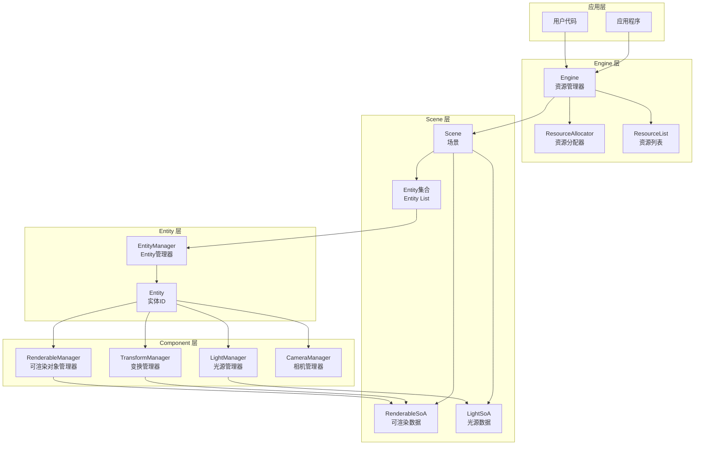
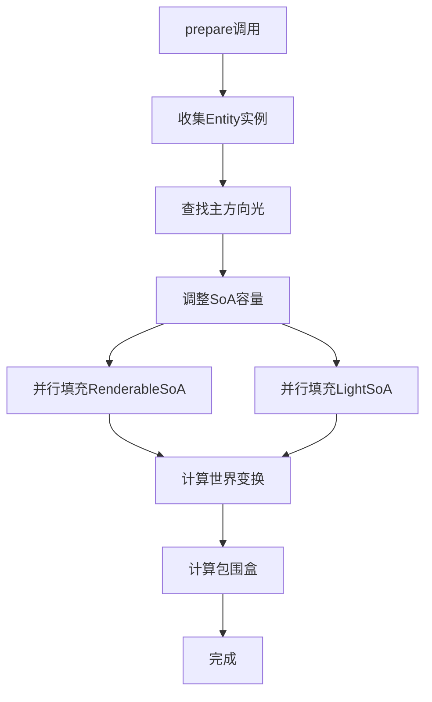
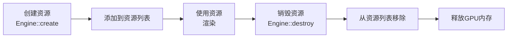
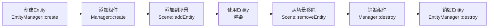

# Filament 场景与资源管理完整分析

## 目录

1. [概述](#概述)
2. [架构设计](#架构设计)
3. [Engine 资源管理](#engine-资源管理)
4. [Scene 场景管理](#scene-场景管理)
5. [Entity 管理](#entity-管理)
6. [组件管理器](#组件管理器)
7. [SoA 数据布局](#soa-数据布局)
8. [资源分配器](#资源分配器)
9. [生命周期管理](#生命周期管理)
10. [性能优化](#性能优化)

---

## 概述

### 系统定位

Filament 的场景与资源管理系统是渲染引擎的核心，负责管理场景中的所有对象（Entity、Renderable、Light、Camera）以及所有 GPU 资源（纹理、缓冲区、材质等）。系统采用 **ECS（Entity Component System）** 架构和 **SoA（Structure of Arrays）** 数据布局，实现了高效的场景管理和渲染数据准备。

### 核心组件

- **Engine**：资源管理器，跟踪所有创建的资源
- **Scene**：场景容器，管理 Entity 集合
- **EntityManager**：Entity 生命周期管理
- **Component Managers**：组件管理器（Transform、Renderable、Light、Camera）
- **ResourceAllocator**：GPU 资源分配器

### 设计特点

1. **ECS 架构**：Entity-Component-System 分离设计
2. **SoA 布局**：Structure of Arrays 提高缓存效率
3. **资源跟踪**：自动跟踪所有资源，防止泄漏
4. **并行处理**：使用 JobSystem 并行准备渲染数据

---

## 架构设计

### 整体架构图



### 架构层次

```
┌─────────────────────────────────────────────────────────┐
│  Engine（引擎）                                          │
│  - 资源管理器                                            │
│  - 线程管理                                              │
│  - 组件管理器（TransformManager、RenderableManager等）  │
└──────────────┬──────────────────────────────────────────┘
               │
               ▼
┌─────────────────────────────────────────────────────────┐
│  Scene（场景）                                          │
│  - Entity 集合管理                                       │
│  - Skybox、IndirectLight 设置                           │
│  - 渲染数据准备（RenderableSoA、LightSoA）              │
└──────────────┬──────────────────────────────────────────┘
               │
       ┌───────┴───────┬───────────┬──────────┐
       ▼               ▼           ▼          ▼
┌──────────┐  ┌──────────┐  ┌──────────┐  ┌──────────┐
│Transform │  │Renderable│  │  Light   │  │  Camera  │
│ Manager  │  │ Manager  │  │ Manager  │  │ Manager  │
└──────────┘  └──────────┘  └──────────┘  └──────────┘
       │               │           │          │
       └───────────────┴───────────┴──────────┘
                       │
                       ▼
              ┌─────────────────┐
              │  EntityManager  │
              │  - Entity 创建   │
              │  - 生命周期管理  │
              └─────────────────┘
```

---

## Engine 资源管理

### Engine 职责

**位置**：`filament/include/filament/Engine.h`

Engine 是 Filament 的主入口点，负责：

1. **资源跟踪**：跟踪所有创建的资源（纹理、缓冲区、材质等）
2. **线程管理**：创建并管理渲染线程和工作线程
3. **组件管理器**：提供 TransformManager、RenderableManager、LightManager 等
4. **Driver 管理**：创建和管理底层 Driver 实例
5. **资源创建/销毁**：提供统一的资源创建和销毁接口

### 资源跟踪

**资源列表**：

```cpp
class FEngine {
private:
    // 资源列表（按类型组织）
    ResourceList<FTexture> mTextures;
    ResourceList<FVertexBuffer> mVertexBuffers;
    ResourceList<FIndexBuffer> mIndexBuffers;
    ResourceList<FMaterial> mMaterials;
    ResourceList<FMaterialInstance> mMaterialInstances;
    ResourceList<FScene> mScenes;
    ResourceList<FView> mViews;
    ResourceList<FRenderer> mRenderers;
    ResourceList<FSwapChain> mSwapChains;
    // ... 其他资源类型
};
```

**资源创建**：

```cpp
template <typename T, typename ... ARGS>
T* FEngine::create(ResourceList<T>& list, 
                   typename T::Builder const& builder, 
                   ARGS&& ... args) noexcept {
    // 1. 创建资源对象
    T* resource = new T(*this, builder, std::forward<ARGS>(args)...);
    
    // 2. 添加到资源列表
    list.insert(resource);
    
    // 3. 返回资源指针
    return resource;
}
```

**资源销毁**：

```cpp
template <typename T>
void FEngine::destroy(ResourceList<T>& list, T* resource) noexcept {
    if (resource) {
        // 1. 从资源列表移除
        list.remove(resource);
        
        // 2. 销毁资源对象
        resource->terminate(*this);
        delete resource;
    }
}
```

### 资源验证

**检查资源有效性**：

```cpp
template <typename T>
bool FEngine::isValid(ResourceList<T> const& list, T const* resource) const noexcept {
    return resource && list.contains(resource);
}
```

**资源泄漏检测**：

```cpp
void FEngine::shutdown() {
    // 检查资源泄漏
    #ifndef NDEBUG
    if (!mTextures.empty()) {
        utils::slog.w << "Leaked " << mTextures.size() << " textures" << utils::io::endl;
    }
    if (!mMaterials.empty()) {
        utils::slog.w << "Leaked " << mMaterials.size() << " materials" << utils::io::endl;
    }
    // ... 检查其他资源类型
    #endif
}
```

---

## Scene 场景管理

### Scene 职责

**位置**：`filament/include/filament/Scene.h`

Scene 是 Renderable 和 Light 实例的扁平容器，负责：

1. **Entity 集合管理**：管理场景中的所有 Entity
2. **渲染数据准备**：准备 RenderableSoA 和 LightSoA
3. **环境设置**：管理 Skybox 和 IndirectLight

### Entity 管理

**添加/移除 Entity**：

```cpp
class FScene {
private:
    utils::EntityList mEntities;  // Entity 集合
    
public:
    void addEntity(Entity entity) {
        mEntities.insert(entity);
    }
    
    void removeEntity(Entity entity) {
        mEntities.erase(entity);
    }
    
    size_t getEntityCount() const noexcept {
        return mEntities.size();
    }
};
```

### 渲染数据准备

**prepare() 方法**：

```cpp
void FScene::prepare(JobSystem& js,
                    RootArenaScope& rootArenaScope,
                    mat4 const& worldTransform,
                    bool shadowReceiversAreCasters) noexcept {
    // 1. 收集所有 Entity 的 Renderable 和 Light 实例
    // 2. 查找主方向光（强度最大的）
    // 3. 调整 SoA 容量（对齐到 16 字节）
    // 4. 并行填充 RenderableSoA
    // 5. 并行填充 LightSoA
    // 6. 计算世界变换
    // 7. 计算包围盒
}
```

**准备流程**：



### RenderableSoA 结构

**SoA 定义**：

```cpp
using RenderableSoa = utils::StructureOfArrays<
    utils::EntityInstance<RenderableManager>,   // RENDERABLE_INSTANCE
    math::mat4f,                                // WORLD_TRANSFORM
    FRenderableManager::Visibility,             // VISIBILITY_STATE
    FRenderableManager::SkinningBindingInfo,    // SKINNING_BUFFER
    FRenderableManager::MorphingBindingInfo,    // MORPHING_BUFFER
    FRenderableManager::InstancesInfo,          // INSTANCES
    math::float3,                               // WORLD_AABB_CENTER
    VisibleMaskType,                            // VISIBLE_MASK
    uint8_t,                                    // CHANNELS
    uint8_t,                                    // LAYERS
    math::float3,                               // WORLD_AABB_EXTENT
    utils::Slice<const FRenderPrimitive>,       // PRIMITIVES
    uint32_t,                                   // SUMMED_PRIMITIVE_COUNT
    PerRenderableData,                          // UBO
    backend::DescriptorSetHandle,               // DESCRIPTOR_SET_HANDLE
    float                                       // USER_DATA
>;
```

### LightSoA 结构

**SoA 定义**：

```cpp
using LightSoa = utils::StructureOfArrays<
    utils::EntityInstance<LightManager>,        // LIGHT_INSTANCE
    utils::EntityInstance<TransformManager>,     // TRANSFORM_INSTANCE
    math::float3,                               // POSITION_RADIUS
    math::float4,                               // DIRECTION
    math::float3,                               // COLOR_INTENSITY
    math::float4,                               // LIGHT_PARAMS
    ShadowParams,                               // SHADOW_PARAMS
    uint8_t,                                    // TYPE
    uint8_t,                                    // CHANNELS
    bool                                        // CASTS_SHADOW
>;
```

---

## Entity 管理

### EntityManager

**位置**：`libs/utils/include/utils/EntityManager.h`

EntityManager 负责 Entity 的创建和销毁。

**关键方法**：

```cpp
class EntityManager {
public:
    // 单例模式
    static EntityManager& get() noexcept;
    
    // 创建 Entity
    Entity create() {
        Entity e;
        create(1, &e);
        return e;
    }
    
    // 批量创建 Entity
    void create(size_t n, Entity* entities);
    
    // 销毁 Entity
    void destroy(Entity e) noexcept {
        destroy(1, &e);
    }
    
    // 检查 Entity 是否有效
    bool isAlive(Entity e) const noexcept {
        return (!e.isNull()) && 
               (getGeneration(e) == mGens[getIndex(e)]);
    }
    
private:
    uint8_t* const mGens;  // Generation 数组
};
```

### Entity ID 编码

Entity 的 ID 是一个 32 位整数，编码了以下信息：

```
┌─────────────────────────────────────────────────────────┐
│  32位 Entity ID                                         │
├──────────────────┬──────────────────────────────────────┤
│ Generation (15位)│ Index (17位)                         │
│                  │                                      │
│ 用于检测 Entity  │ 数组索引，最多支持 2^17 - 1 个 Entity │
│ 是否已被销毁     │                                      │
└──────────────────┴──────────────────────────────────────┘
```

**编码方式**：

```cpp
static constexpr const int GENERATION_SHIFT = 17;
static constexpr const size_t RAW_INDEX_COUNT = (1 << GENERATION_SHIFT);  // 131072

static inline Entity::Type getGeneration(Entity e) noexcept {
    return e.getId() >> GENERATION_SHIFT;  // 高15位：Generation
}

static inline Entity::Type getIndex(Entity e) noexcept {
    return e.getId() & INDEX_MASK;  // 低17位：Index
}
```

---

## 组件管理器

### TransformManager

**职责**：
- 管理实体的变换组件（位置、旋转、缩放）
- 支持父子关系（Hierarchy）
- 计算世界变换矩阵

**关键方法**：

```cpp
class TransformManager {
public:
    // 创建组件
    Instance create(Entity entity);
    Instance create(Entity entity, Instance parent, mat4f const& localTransform);
    
    // 设置变换
    void setTransform(Instance instance, mat4f const& transform);
    
    // 查询变换
    mat4f const& getTransform(Instance instance) const;
    mat4f getWorldTransform(Instance instance) const;
    
    // 父子关系
    void setParent(Instance instance, Instance parent);
    Instance getParent(Instance instance) const;
};
```

### RenderableManager

**职责**：
- 管理实体的可渲染组件
- 配置几何数据（VertexBuffer、IndexBuffer）
- 配置材质实例（MaterialInstance）

**关键方法**：

```cpp
class RenderableManager {
public:
    // 创建组件（Builder模式）
    class Builder {
    public:
        Builder& geometry(uint8_t index, PrimitiveType type,
                         VertexBuffer* vertices, IndexBuffer* indices,
                         uint32_t offset, uint32_t count);
        Builder& material(uint8_t index, MaterialInstance* materialInstance);
        Builder& boundingBox(Box const& aabb);
        Instance build(Engine& engine, Entity entity);
    };
    
    // 查询
    MaterialInstance* getMaterialInstanceAt(Instance instance, 
                                             uint8_t primitiveIndex) const;
    Box getAxisAlignedBoundingBox(Instance instance) const;
};
```

### LightManager

**职责**：
- 管理场景中的光源
- 支持多种光源类型（方向光、点光源、聚光灯）
- 管理光源参数（颜色、强度、范围等）

**关键方法**：

```cpp
class LightManager {
public:
    enum class Type {
        SUN,           // 方向光（太阳光）
        DIRECTIONAL,   // 方向光
        POINT,         // 点光源
        FOCUSED_SPOT,  // 聚光灯
        SPOT           // 聚光灯
    };
    
    // 创建组件（Builder模式）
    class Builder {
    public:
        Builder& type(Type type);
        Builder& color(float3 const& linearColor);
        Builder& intensity(float intensity);
        Builder& direction(float3 const& direction);
        Builder& position(float3 const& position);
        Builder& falloff(float radius);
        Instance build(Engine& engine, Entity entity);
    };
};
```

---

## SoA 数据布局

### SoA vs AoS

**AoS (Array of Structures) - 传统方式**：

```
┌─────────┬─────────┬─────────┐
│ Entity1 │ Entity2 │ Entity3 │
├─────────┼─────────┼─────────┤
│ Transform│Transform│Transform│
│ Renderable│Renderable│Renderable│
│ ...     │ ...     │ ...     │
└─────────┴─────────┴─────────┘
```

**SoA (Structure of Arrays) - Filament 方式**：

```
┌─────────────┬─────────────┬─────────────┐
│ Transform[] │ Renderable[]│ Light[]     │
├─────────────┼─────────────┼─────────────┤
│ Entity1     │ Entity1     │ Entity1     │
│ Entity2     │ Entity2     │ Entity2     │
│ Entity3     │ Entity3     │ Entity3     │
└─────────────┴─────────────┴─────────────┘
```

### SoA 优势

1. **缓存友好**：相同类型的数据连续存储，提高缓存命中率
2. **SIMD 优化**：可以批量处理相同类型的数据
3. **内存对齐**：每个数组可以独立对齐

### RenderableSoA 使用示例

```cpp
// 批量处理所有世界变换矩阵
const mat4f* worldTransforms = sceneData.elementAt<WORLD_TRANSFORM>().data();
for (size_t i = 0; i < count; ++i) {
    // 连续内存访问，缓存命中率高
    processTransform(worldTransforms[i]);
}
```

---

## 资源分配器

### ResourceAllocator

**位置**：`filament/src/ResourceAllocator.cpp`

ResourceAllocator 负责 GPU 资源的分配和管理。

**关键功能**：

1. **纹理缓存**：缓存已创建的纹理，避免重复创建
2. **渲染目标管理**：管理 RenderTarget 的创建和销毁
3. **资源复用**：复用临时资源，减少分配开销

**纹理缓存**：

```cpp
class ResourceAllocator {
private:
    struct TextureKey {
        StaticString name;
        SamplerType target;
        uint8_t levels;
        TextureFormat format;
        // ... 其他字段
    };
    
    std::unordered_map<TextureKey, TextureHandle> mTextureCache;
    
public:
    TextureHandle createTexture(StaticString name, ...) {
        TextureKey key{name, target, levels, format, ...};
        
        // 检查缓存
        auto it = mTextureCache.find(key);
        if (it != mTextureCache.end()) {
            return it->second;  // 返回缓存的纹理
        }
        
        // 创建新纹理
        TextureHandle handle = mBackend.createTexture(...);
        mTextureCache[key] = handle;
        return handle;
    }
};
```

---

## 生命周期管理

### 资源生命周期



### Entity 生命周期



### 清理流程

**Engine::shutdown()**：

```cpp
void FEngine::shutdown() {
    // 1. 验证在主线程中调用
    FILAMENT_CHECK_PRECONDITION(ThreadUtils::isThisThread(mMainThreadId));
    
    // 2. 释放后处理管理器资源
    mPostProcessManager.terminate(driver);
    
    // 3. 释放资源分配器
    mResourceAllocatorDisposer->terminate();
    
    // 4. 释放所有组件管理器
    mRenderableManager.terminate();
    mLightManager.terminate();
    mTransformManager.terminate();
    
    // 5. 清理用户创建的资源列表
    // （如果资源列表不为空，说明有资源泄漏）
    
    // 6. 关闭后端
    mDriver->terminate();
}
```

---

## 性能优化

### 1. SoA 布局优化

**缓存友好**：
- 相同类型的数据连续存储
- 提高缓存命中率
- 减少缓存未命中

**SIMD 优化**：
- 可以批量处理相同类型的数据
- 利用 SIMD 指令加速计算

### 2. 并行处理

**并行填充数据**：

```cpp
// 并行填充 RenderableSoA
auto* renderableJob = parallel_for(js, rootJob,
    renderableInstances.data(), renderableInstances.size(),
    std::cref(renderableWork), 
    jobs::CountSplitter<64>()
);

// 并行填充 LightSoA
auto* lightJob = parallel_for(js, rootJob,
    lightInstances.data(), lightInstances.size(),
    std::cref(lightWork), 
    jobs::CountSplitter<32, 5>()
);

// 启动并行 Job
js.run(renderableJob);
js.run(lightJob);

// 等待所有 Job 完成
js.waitAndRelease(rootJob);
```

### 3. 资源缓存

**纹理缓存**：
- 缓存已创建的纹理，避免重复创建
- 减少 GPU 内存分配开销
- 提高资源复用率

### 4. 内存对齐

**SoA 容量对齐**：

```cpp
// 容量需要是 16 的倍数，以便使用 SIMD 指令优化循环
size_t renderableCapacity = (renderableInstances.size() + 15) & ~15;
size_t lightCapacity = (lightInstances.size() + 15) & ~15;

sceneData.setCapacity(renderableCapacity);
lightData.setCapacity(lightCapacity);
```

---

## 总结

### 系统特点

1. **ECS 架构**
   - Entity-Component-System 分离设计
   - 灵活的组件组合
   - 高效的组件查询

2. **SoA 数据布局**
   - Structure of Arrays 提高缓存效率
   - 支持 SIMD 优化
   - 内存对齐优化

3. **资源跟踪**
   - 自动跟踪所有资源
   - 资源泄漏检测
   - 统一的资源生命周期管理

4. **并行处理**
   - 使用 JobSystem 并行准备渲染数据
   - 减少主线程阻塞
   - 提高渲染性能

### 关键文件

| 文件 | 说明 |
|------|------|
| `filament/include/filament/Engine.h` | Engine 公共接口 |
| `filament/src/details/Engine.h/cpp` | Engine 实现 |
| `filament/include/filament/Scene.h` | Scene 公共接口 |
| `filament/src/details/Scene.h/cpp` | Scene 实现 |
| `libs/utils/include/utils/EntityManager.h` | EntityManager 实现 |
| `filament/src/ResourceAllocator.cpp` | ResourceAllocator 实现 |

---

**文档版本**：1.0  
**最后更新**：2024年  
**作者**：Filament学习文档

