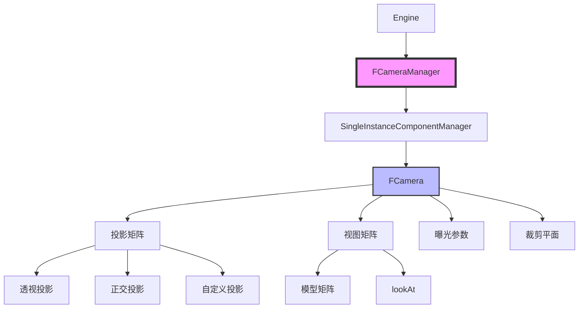
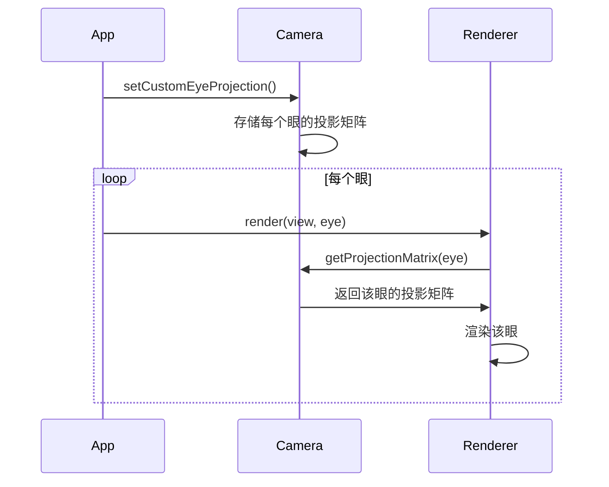

# Filament 摄像机管理架构完整分析

## 目录
1. [概述](#概述)
2. [架构设计](#架构设计)
3. [核心组件](#核心组件)
4. [相机组件](#相机组件)
5. [投影系统](#投影系统)
6. [视图矩阵计算](#视图矩阵计算)
7. [立体渲染支持](#立体渲染支持)
8. [曝光系统](#曝光系统)
9. [使用示例](#使用示例)

---

## 概述

Filament 的摄像机管理系统基于 ECS（实体组件系统）架构，将相机作为组件附加到实体上。相机系统负责管理观察场景的视角，包括投影矩阵、视图矩阵、曝光参数等。

### 核心特性
- **ECS 架构**：相机作为组件附加到实体
- **多种投影类型**：透视投影、正交投影、自定义投影
- **立体渲染支持**：支持多眼（Eye）渲染
- **曝光控制**：支持光圈、快门速度、ISO 设置
- **裁剪平面管理**：近平面和远平面管理
- **视图变换**：支持 lookAt、模型矩阵设置

---

## 架构设计

### 架构图



### 类层次结构

```
CameraManager (公共接口)
  └── FCameraManager (实现类)
      └── SingleInstanceComponentManager<FCamera*, bool>
          └── 管理相机组件生命周期

Camera (公共接口)
  └── FCamera (实现类)
      └── 相机功能实现
```

---

## 核心组件

### 1. FCameraManager

相机管理器负责管理所有相机组件的生命周期。

**关键字段**：
```cpp
class FCameraManager {
    struct CameraManagerImpl : public Base {
        // 存储相机指针和是否拥有变换组件标志
        SingleInstanceComponentManager<FCamera*, bool> mManager;
    } mManager;
};
```

**主要方法**：
```cpp
// 创建相机组件
FCamera* create(FEngine& engine, utils::Entity entity);

// 销毁相机组件
void destroy(FEngine& engine, utils::Entity e) noexcept;

// 检查实体是否有相机组件
bool hasComponent(utils::Entity const e) const noexcept;

// 获取相机指针
FCamera* getCamera(Instance const i) noexcept;
```

### 2. FCamera

相机实现类，包含所有相机功能。

**关键字段**：
```cpp
class FCamera {
    FEngine& mEngine;                    // 引擎引用
    utils::Entity mEntity;              // 关联的实体
    
    // 投影矩阵（每个眼一个，无限远平面）
    math::mat4 mEyeProjection[CONFIG_MAX_STEREOSCOPIC_EYES];
    
    // 用于剔除的投影矩阵（有远平面）
    math::mat4 mProjectionForCulling;
    
    // 从主视图空间到每个眼的视图空间的变换
    math::mat4 mEyeFromView[CONFIG_MAX_STEREOSCOPIC_EYES];
    
    // 投影缩放和偏移
    math::double2 mScalingCS = {1.0};
    math::double2 mShiftCS = {0.0};
    
    // 裁剪平面
    double mNear{};
    double mFar{};
    
    // 曝光设置
    float mAperture = 16.0f;            // 光圈（f-stop）
    float mShutterSpeed = 1.0f / 125.0f; // 快门速度（秒）
    float mSensitivity = 100.0f;        // ISO 感光度
    float mFocusDistance = 0.0f;       // 对焦距离
};
```

---

## 相机组件

### 创建相机

```cpp
// 1. 创建实体
utils::Entity cameraEntity = utils::EntityManager::get().create();

// 2. 创建相机组件
Camera* camera = engine->createCamera(cameraEntity);

// 3. 设置投影
camera->setProjection(45.0, 16.0/9.0, 0.1, 100.0);

// 4. 设置视图
camera->lookAt({0, 1.60, 1}, {0, 0, 0}, {0, 1, 0});
```

### 销毁相机

```cpp
// 销毁相机组件
engine->destroyCameraComponent(cameraEntity);

// 销毁实体
utils::EntityManager::get().destroy(cameraEntity);
```

### 相机与实体关联

相机组件通过 ECS 系统与实体关联：

```cpp
// 检查实体是否有相机组件
bool hasCamera = engine->getCameraManager().hasComponent(entity);

// 获取相机指针
if (hasCamera) {
    CameraManager::Instance instance = 
        engine->getCameraManager().getInstance(entity);
    FCamera* camera = engine->getCameraManager().getCamera(instance);
}
```

---

## 投影系统

### 投影类型

#### 1. 透视投影

```cpp
// 使用视野角度（FOV）
camera->setProjection(
    Projection::PERSPECTIVE,
    left, right, bottom, top,
    near, far
);

// 或使用 FOV 和宽高比
camera->setProjection(
    45.0,           // FOV（度）
    16.0/9.0,       // 宽高比
    0.1,            // 近平面
    100.0           // 远平面
);
```

**透视投影矩阵计算**：
```cpp
static math::mat4 projection(Fov direction, double fovInDegrees,
        double aspect, double near, double far) {
    double h = std::tan(fovInDegrees * math::d::DEG_TO_RAD * 0.5) * near;
    double w = h * aspect;
    return frustum(-w, w, -h, h, near, far);
}
```

#### 2. 正交投影

```cpp
camera->setProjection(
    Projection::ORTHO,
    left, right, bottom, top,
    near, far
);
```

#### 3. 自定义投影

```cpp
// 设置自定义投影矩阵
math::mat4 customProjection = ...;
camera->setCustomProjection(
    customProjection,      // 用于渲染的投影矩阵
    customProjection,      // 用于剔除的投影矩阵
    near, far
);
```

### 投影矩阵获取

```cpp
// 获取渲染用的投影矩阵（无限远平面）
math::mat4 projection = camera->getProjectionMatrix(eye);

// 获取剔除用的投影矩阵（有远平面）
math::mat4 cullingProjection = camera->getCullingProjectionMatrix();
```

### 投影缩放和偏移

```cpp
// 设置投影缩放
camera->setScaling({1.0, 1.0});

// 设置投影偏移
camera->setShift({0.0, 0.0});
```

---

## 视图矩阵计算

### 模型矩阵

相机的模型矩阵定义了相机在世界空间中的位置和方向。

```cpp
// 设置模型矩阵（必须是刚体变换）
math::mat4 modelMatrix = ...;
camera->setModelMatrix(modelMatrix);

// 获取模型矩阵
math::mat4 model = camera->getModelMatrix();
```

### 视图矩阵

视图矩阵是模型矩阵的逆矩阵，用于将世界空间坐标转换到相机空间。

```cpp
// 获取视图矩阵
math::mat4 view = camera->getViewMatrix();

// 视图矩阵计算（刚体变换的逆）
static math::mat4 rigidTransformInverse(const math::mat4& v) {
    const auto rt = transpose(v.upperLeft());  // 转置旋转部分
    const auto t = rt * v[3].xyz;              // 计算新的平移部分
    return { rt, -t };                         // 返回逆矩阵
}
```

### lookAt 方法

```cpp
// 设置相机观察点
camera->lookAt(
    {0, 1.60, 1},    // 相机位置（eye）
    {0, 0, 0},        // 目标位置（center）
    {0, 1, 0}         // 上向量（up）
);
```

**lookAt 实现**：
```cpp
void lookAt(const math::double3& eye, 
            const math::double3& center, 
            const math::double3& up) {
    // 计算前向量（从目标到相机）
    math::double3 f = normalize(center - eye);
    
    // 计算右向量
    math::double3 s = normalize(cross(f, up));
    
    // 计算上向量
    math::double3 u = cross(s, f);
    
    // 构建模型矩阵
    math::mat4 model;
    model[0] = math::double4(s, 0);
    model[1] = math::double4(u, 0);
    model[2] = math::double4(-f, 0);
    model[3] = math::double4(eye, 1);
    
    setModelMatrix(model);
}
```

### 相机方向向量

```cpp
// 获取相机位置
math::double3 position = camera->getPosition();

// 获取左向量
math::float3 left = camera->getLeftVector();

// 获取上向量
math::float3 up = camera->getUpVector();

// 获取前向量（相机朝向 -z 方向）
math::float3 forward = camera->getForwardVector();
```

---

## 立体渲染支持

### 多眼投影

Filament 支持立体渲染，可以为每个眼设置独立的投影矩阵。

```cpp
// 设置多个眼的投影矩阵
math::mat4 eyeProjections[2] = {...};
camera->setCustomEyeProjection(
    eyeProjections,        // 投影矩阵数组
    2,                     // 眼数量
    cullingProjection,     // 用于剔除的投影矩阵
    near, far
);
```

### 眼变换矩阵

```cpp
// 设置眼的模型矩阵（相对于头部空间）
camera->setEyeModelMatrix(eyeId, eyeModelMatrix);

// 获取眼到视图矩阵
math::mat4 eyeFromView = camera->getEyeFromViewMatrix(eyeId);
```

### 立体渲染流程



---

## 曝光系统

### 曝光参数

相机支持真实的相机曝光参数设置：

```cpp
// 设置曝光参数
camera->setExposure(
    16.0f,          // 光圈（f-stop，默认 f/16）
    1.0f / 125.0f,  // 快门速度（秒，默认 1/125s）
    100.0f          // ISO 感光度（默认 100 ISO）
);
```

### 曝光值计算

曝光值（EV）计算公式：
```
EV = log2((aperture²) / (shutterSpeed * sensitivity / 100))
```

**曝光值获取**：
```cpp
// 获取光圈
float aperture = camera->getAperture();

// 获取快门速度
float shutterSpeed = camera->getShutterSpeed();

// 获取 ISO
float sensitivity = camera->getSensitivity();
```

### 对焦距离

```cpp
// 设置对焦距离
camera->setFocusDistance(5.0f);

// 获取对焦距离
float focusDistance = camera->getFocusDistance();
```

### 焦距计算

```cpp
// 获取焦距
double focalLength = camera->getFocalLength();

// 计算有效焦距
double effectiveFocalLength = FCamera::computeEffectiveFocalLength(
    focalLength, focusDistance
);

// 计算有效视野
double effectiveFov = FCamera::computeEffectiveFov(
    fovInDegrees, focusDistance
);
```

---

## 使用示例

### 基本相机设置

```cpp
// 创建引擎
Engine* engine = Engine::create();

// 创建实体和相机
utils::Entity cameraEntity = utils::EntityManager::get().create();
Camera* camera = engine->createCamera(cameraEntity);

// 设置透视投影
camera->setProjection(45.0, 16.0/9.0, 0.1, 100.0);

// 设置相机位置和方向
camera->lookAt(
    {0, 1.60, 1},    // 相机位置
    {0, 0, 0},        // 目标位置
    {0, 1, 0}         // 上向量
);

// 设置曝光
camera->setExposure(16.0f, 1.0f/125.0f, 100.0f);

// 在视图中使用相机
View* view = engine->createView();
view->setCamera(camera);
```

### 正交投影相机

```cpp
Camera* orthoCamera = engine->createCamera(orthoEntity);

// 设置正交投影
orthoCamera->setProjection(
    Projection::ORTHO,
    -10.0, 10.0,    // left, right
    -10.0, 10.0,    // bottom, top
    0.1, 100.0      // near, far
);
```

### 自定义投影相机

```cpp
Camera* customCamera = engine->createCamera(customEntity);

// 计算自定义投影矩阵
math::mat4 customProjection = computeCustomProjection(...);

// 设置自定义投影
customCamera->setCustomProjection(
    customProjection,
    customProjection,  // 使用相同矩阵用于剔除
    0.1, 100.0
);
```

### 立体渲染相机

```cpp
Camera* stereoCamera = engine->createCamera(stereoEntity);

// 设置左眼和右眼的投影矩阵
math::mat4 leftEyeProjection = computeLeftEyeProjection(...);
math::mat4 rightEyeProjection = computeRightEyeProjection(...);
math::mat4 eyeProjections[2] = {leftEyeProjection, rightEyeProjection};

// 设置眼的投影矩阵
stereoCamera->setCustomEyeProjection(
    eyeProjections,
    2,                      // 眼数量
    cullingProjection,      // 用于剔除的投影矩阵
    0.1, 100.0
);

// 设置眼的模型矩阵（相对于头部）
math::mat4 leftEyeModel = computeLeftEyeModel(...);
math::mat4 rightEyeModel = computeRightEyeModel(...);
stereoCamera->setEyeModelMatrix(0, leftEyeModel);
stereoCamera->setEyeModelMatrix(1, rightEyeModel);
```

---

## 总结

Filament 的摄像机管理系统提供了完整的相机功能：

1. **ECS 架构**：相机作为组件，与实体系统集成
2. **多种投影**：支持透视、正交、自定义投影
3. **立体渲染**：支持多眼渲染，每个眼独立的投影和变换
4. **曝光控制**：支持真实相机的曝光参数（光圈、快门、ISO）
5. **视图变换**：支持 lookAt、模型矩阵等多种方式设置视图
6. **裁剪管理**：支持近平面和远平面管理，优化深度缓冲区精度

这些功能使得 Filament 能够满足从简单场景到复杂立体渲染的各种需求。

