# Filament 核心设计模式完整分析

## 目录
1. [概述](#概述)
2. [创建型模式](#创建型模式)
3. [结构型模式](#结构型模式)
4. [行为型模式](#行为型模式)
5. [架构模式](#架构模式)
6. [模式组合应用](#模式组合应用)
7. [性能优化模式](#性能优化模式)
8. [总结](#总结)

---

## 概述

Filament 渲染引擎采用了多种经典设计模式，这些模式共同构成了 Filament 的架构基础。本文档详细分析 Filament 中使用的核心设计模式及其应用场景。

### 设计模式分类

| 类别 | 模式 | 应用场景 |
|------|------|---------|
| **创建型** | Builder 模式 | Material、Texture、Renderable 等资源构建 |
| **创建型** | Factory 模式 | Engine::create*() 资源创建 |
| **创建型** | Singleton 模式 | EntityManager、JobSystem |
| **结构型** | PIMPL 模式 | 所有 FilamentAPI 类 |
| **结构型** | Adapter 模式 | Driver API 适配不同后端 |
| **结构型** | Handle 模式 | Handle<T> 类型安全的资源引用 |
| **行为型** | Command 模式 | CommandStream 异步渲染 |
| **行为型** | Strategy 模式 | 多后端切换（OpenGL/Vulkan/Metal） |
| **行为型** | Observer 模式 | 资源生命周期管理 |
| **架构** | ECS 模式 | Entity-Component-System 场景管理 |
| **架构** | RAII 模式 | 资源自动管理 |

---

## 创建型模式

### 1. Builder 模式（建造者模式）

#### 概述

Builder 模式用于构建复杂对象，将对象的构建过程与表示分离，使得同样的构建过程可以创建不同的表示。

#### Filament 中的应用

**Material::Builder**：
```cpp
// 头文件：filament/include/filament/Material.h
class Material : public FilamentAPI {
public:
    class Builder : public BuilderBase<MaterialBuilderImpl>,
                    public BuilderNameMixin<Material::Builder> {
    public:
        Builder& package(const void* data, size_t size);
        Builder& shading(Shading shading);
        Builder& blending(BlendingMode mode);
        Material* build(Engine& engine);
    };
};

// 使用示例
Material* material = Material::Builder()
    .package(data, size)
    .name("MyMaterial")
    .shading(Shading::LIT)
    .blending(BlendingMode::TRANSLUCENT)
    .build(*engine);
```

**RenderableManager::Builder**：
```cpp
RenderableManager::Builder(1)
    .boundingBox({{ -1, -1, -1 }, { 1, 1, 1 }})
    .geometry(0, PrimitiveType::TRIANGLES, vb, ib, 0, 3)
    .material(0, materialInstance)
    .culling(false)
    .castShadows(true)
    .build(*engine, entity);
```

#### 架构图

**类图**：
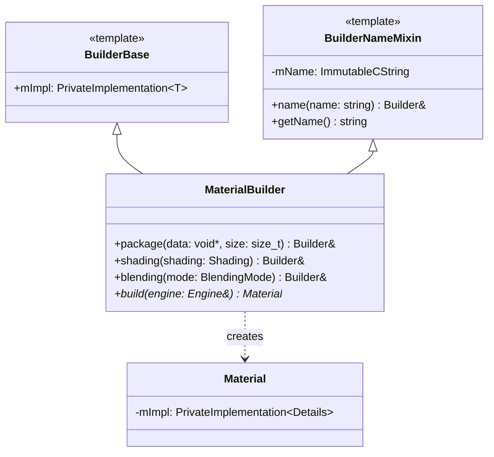
```mermaid
classDiagram
    class BuilderBase {
        <<template>>
        +mImpl: PrivateImplementation~T~
    }
    class BuilderNameMixin {
        <<template>>
        +name(name: string) Builder&
        +getName() string
        -mName: ImmutableCString
    }
    class MaterialBuilder {
        +package(data: void*, size: size_t) Builder&
        +shading(shading: Shading) Builder&
        +blending(mode: BlendingMode) Builder&
        +build(engine: Engine&) Material*
    }
    class Material {
        -mImpl: PrivateImplementation~Details~
    }
    
    BuilderBase <|-- MaterialBuilder
    BuilderNameMixin <|-- MaterialBuilder
    MaterialBuilder ..> Material : creates
```

**构建流程图**：
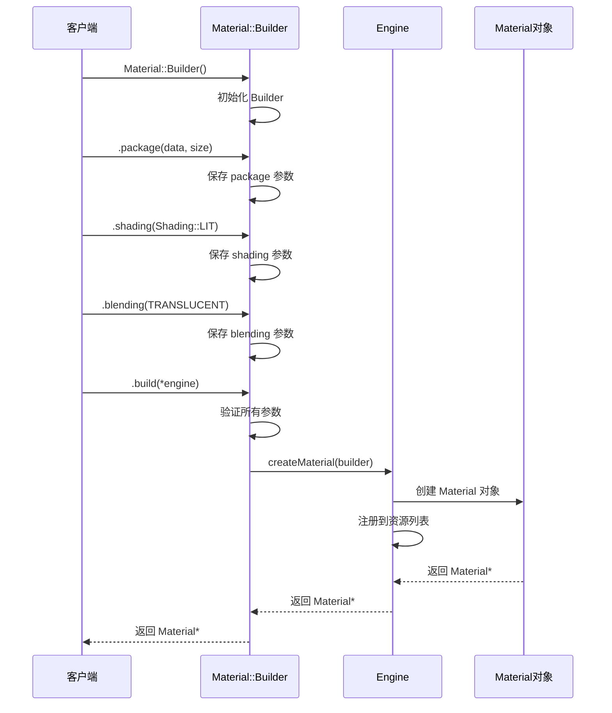
```mermaid
sequenceDiagram
    participant Client as 客户端
    participant Builder as Material::Builder
    participant Engine as Engine
    participant Material as Material对象
    
    Client->>Builder: Material::Builder()
    Builder->>Builder: 初始化 Builder
    
    Client->>Builder: .package(data, size)
    Builder->>Builder: 保存 package 参数
    
    Client->>Builder: .shading(Shading::LIT)
    Builder->>Builder: 保存 shading 参数
    
    Client->>Builder: .blending(TRANSLUCENT)
    Builder->>Builder: 保存 blending 参数
    
    Client->>Builder: .build(*engine)
    Builder->>Builder: 验证所有参数
    Builder->>Engine: createMaterial(builder)
    Engine->>Material: 创建 Material 对象
    Engine->>Engine: 注册到资源列表
    Material-->>Engine: 返回 Material*
    Engine-->>Builder: 返回 Material*
    Builder-->>Client: 返回 Material*
```

#### 设计特点

1. **方法链式调用**：每个方法返回 Builder 引用，支持链式调用
2. **参数验证**：在 `build()` 时统一验证参数
3. **延迟构建**：参数收集完成后才创建实际对象
4. **类型安全**：通过模板确保类型正确

#### 优势

- ✅ **灵活性**：可以逐步构建复杂对象
- ✅ **可读性**：代码表达清晰，易于理解
- ✅ **参数验证**：集中验证，错误处理统一
- ✅ **可选参数**：通过方法链支持可选参数

---

### 2. Factory 模式（工厂模式）

#### 概述

Factory 模式提供创建对象的接口，让子类决定实例化哪一个类。Filament 使用 Engine 作为统一的资源工厂。

#### Filament 中的应用

**Engine 作为工厂**：
```cpp
// 头文件：filament/include/filament/Engine.h
class Engine {
public:
    // 创建各种资源
    Texture* createTexture(const Texture::Builder& builder);
    Material* createMaterial(const Material::Builder& builder);
    VertexBuffer* createVertexBuffer(const VertexBuffer::Builder& builder);
    IndexBuffer* createIndexBuffer(const IndexBuffer::Builder& builder);
    Renderer* createRenderer();
    Scene* createScene();
    View* createView();
    Camera* createCamera(Entity entity);
    // ... 更多 create 方法
    
    // 销毁资源
    void destroy(const Texture* texture);
    void destroy(const Material* material);
    // ... 更多 destroy 方法
};
```

#### 架构图

**类图**：
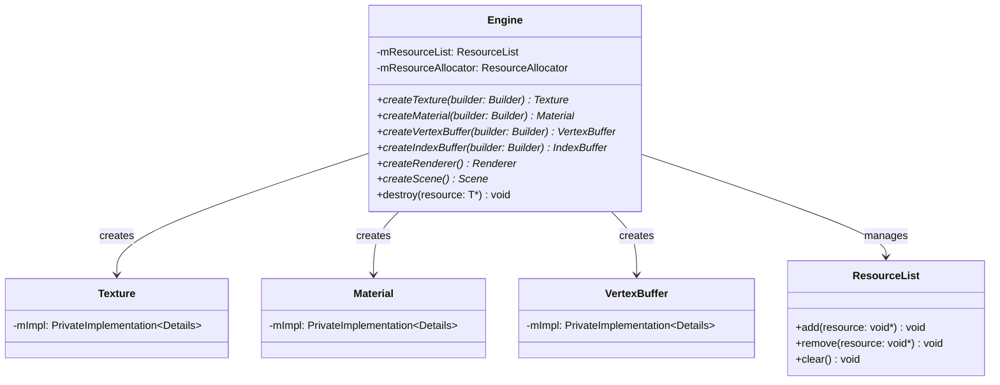
```mermaid
classDiagram
    class Engine {
        -mResourceList: ResourceList
        -mResourceAllocator: ResourceAllocator
        +createTexture(builder: Builder) Texture*
        +createMaterial(builder: Builder) Material*
        +createVertexBuffer(builder: Builder) VertexBuffer*
        +createIndexBuffer(builder: Builder) IndexBuffer*
        +createRenderer() Renderer*
        +createScene() Scene*
        +destroy(resource: T*) void
    }
    class Texture {
        -mImpl: PrivateImplementation~Details~
    }
    class Material {
        -mImpl: PrivateImplementation~Details~
    }
    class VertexBuffer {
        -mImpl: PrivateImplementation~Details~
    }
    class ResourceList {
        +add(resource: void*) void
        +remove(resource: void*) void
        +clear() void
    }
    
    Engine --> Texture : creates
    Engine --> Material : creates
    Engine --> VertexBuffer : creates
    Engine --> ResourceList : manages
```

**创建流程图**：
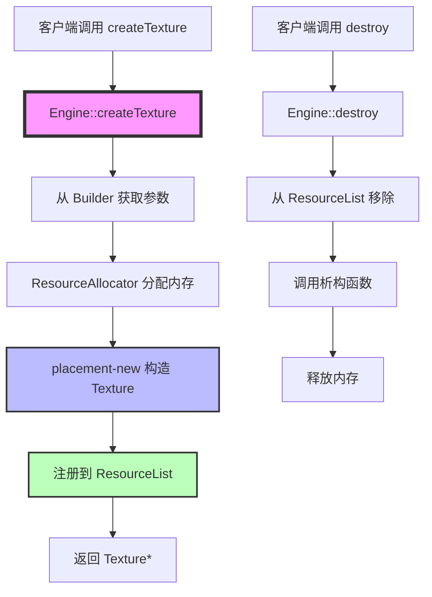
```mermaid
flowchart TD
    A[客户端调用 createTexture] --> B[Engine::createTexture]
    B --> C[从 Builder 获取参数]
    C --> D[ResourceAllocator 分配内存]
    D --> E[placement-new 构造 Texture]
    E --> F[注册到 ResourceList]
    F --> G[返回 Texture*]
    
    H[客户端调用 destroy] --> I[Engine::destroy]
    I --> J[从 ResourceList 移除]
    J --> K[调用析构函数]
    K --> L[释放内存]
    
    style B fill:#f9f,stroke:#333,stroke-width:4px
    style E fill:#bbf,stroke:#333,stroke-width:2px
    style F fill:#bfb,stroke:#333,stroke-width:2px
```

#### 实现细节

```cpp
// 实现文件：filament/src/details/Engine.cpp
Texture* Engine::createTexture(const Texture::Builder& builder) {
    // 1. 从 Builder 获取实现
    auto& impl = builder->mImpl;
    
    // 2. 创建 Texture 对象（使用 placement-new）
    Texture* texture = upcast(this)->mResourceAllocator.alloc<Texture>();
    new(texture) Texture(*this, impl);
    
    // 3. 注册到资源跟踪系统
    mResourceList.add(texture);
    
    return texture;
}
```

#### 设计特点

1. **统一接口**：所有资源通过 Engine 创建
2. **资源跟踪**：Engine 跟踪所有创建的资源
3. **生命周期管理**：资源由 Engine 统一管理
4. **类型安全**：通过模板和类型系统确保类型正确

#### 优势

- ✅ **集中管理**：所有资源创建在一个地方
- ✅ **资源跟踪**：防止资源泄漏
- ✅ **统一接口**：简化 API
- ✅ **易于扩展**：添加新资源类型容易

---

### 3. Singleton 模式（单例模式）

#### 概述

Singleton 模式确保一个类只有一个实例，并提供一个全局访问点。

#### Filament 中的应用

**EntityManager**：
```cpp
// 头文件：libs/utils/include/utils/EntityManager.h
class EntityManager {
public:
    // 获取单例实例
    static EntityManager& get() noexcept {
        static EntityManager instance;
        return instance;
    }
    
    // 禁止拷贝和移动
    EntityManager(const EntityManager&) = delete;
    EntityManager& operator=(const EntityManager&) = delete;
    
    Entity create();
    void destroy(Entity e);
    // ...
};
```

**JobSystem**：
```cpp
// JobSystem 也是单例
class JobSystem {
public:
    static JobSystem& get() noexcept {
        static JobSystem instance;
        return instance;
    }
    // ...
};
```

#### 架构图

**类图**：
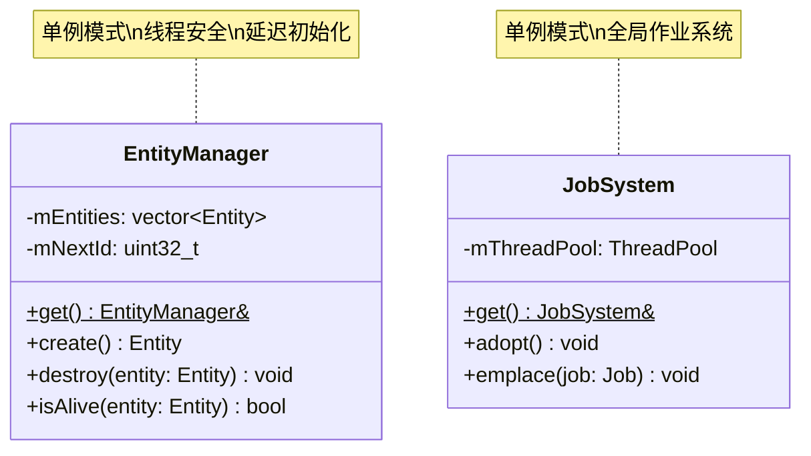
```mermaid
classDiagram
    class EntityManager {
        -mEntities: vector~Entity~
        -mNextId: uint32_t
        +get()$ EntityManager&
        +create() Entity
        +destroy(entity: Entity) void
        +isAlive(entity: Entity) bool
    }
    class JobSystem {
        -mThreadPool: ThreadPool
        +get()$ JobSystem&
        +adopt() void
        +emplace(job: Job) void
    }
    
    note for EntityManager "单例模式\n线程安全\n延迟初始化"
    note for JobSystem "单例模式\n全局作业系统"
```

**时序图**：
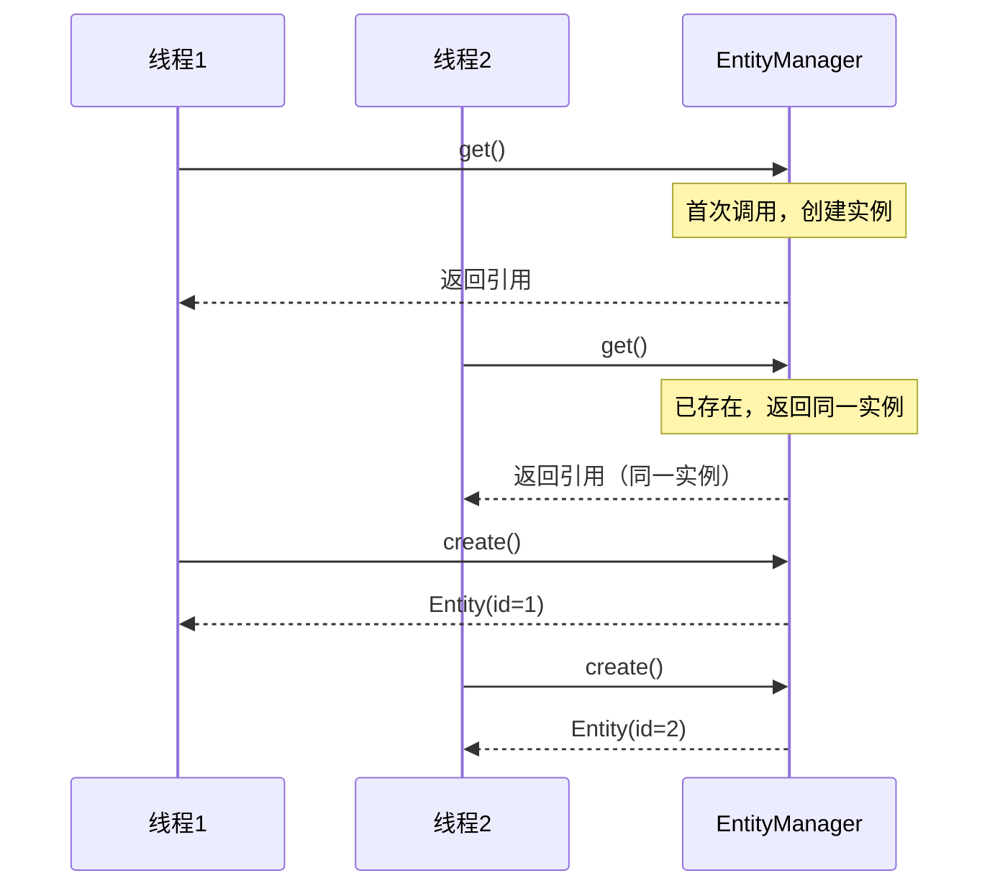
```mermaid
sequenceDiagram
    participant T1 as 线程1
    participant T2 as 线程2
    participant EM as EntityManager
    
    T1->>EM: get()
    Note over EM: 首次调用，创建实例
    EM-->>T1: 返回引用
    
    T2->>EM: get()
    Note over EM: 已存在，返回同一实例
    EM-->>T2: 返回引用（同一实例）
    
    T1->>EM: create()
    EM-->>T1: Entity(id=1)
    
    T2->>EM: create()
    EM-->>T2: Entity(id=2)
```

#### 实现方式

Filament 使用 **Meyers' Singleton**（线程安全的单例实现）：

```cpp
static EntityManager& get() noexcept {
    static EntityManager instance;  // C++11 保证线程安全
    return instance;
}
```

**C++11 保证**：
- `static` 局部变量的初始化是线程安全的
- 只初始化一次
- 延迟初始化（首次调用时初始化）

#### 优势

- ✅ **全局访问**：任何地方都可以访问
- ✅ **唯一实例**：确保只有一个实例
- ✅ **线程安全**：C++11 标准保证
- ✅ **延迟初始化**：首次使用时才创建

---

## 结构型模式

### 4. PIMPL 模式（Pointer to Implementation）

#### 概述

PIMPL 模式通过将实现细节隐藏在一个指针后面，实现接口与实现的分离。

#### Filament 中的应用

**所有 FilamentAPI 类**：
```cpp
class Texture : public FilamentAPI {
private:
    struct Details;
    utils::PrivateImplementation<Details> mImpl;
};

class Material : public FilamentAPI {
private:
    struct Details;
    utils::PrivateImplementation<Details> mImpl;
};
```

详细分析请参考：[Filament_PIMPL架构设计完整分析.md](./Filament_PIMPL架构设计完整分析.md)

#### 架构图

**类图**：
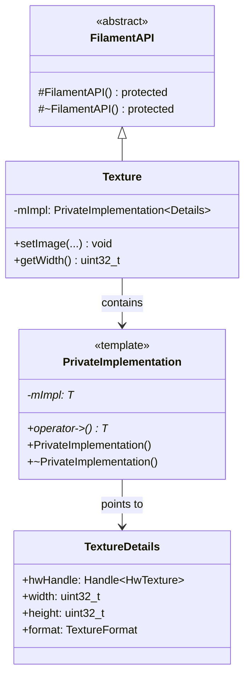
```mermaid
classDiagram
    class FilamentAPI {
        <<abstract>>
        #FilamentAPI() protected
        #~FilamentAPI() protected
    }
    class PrivateImplementation {
        <<template>>
        -mImpl: T*
        +operator->() T*
        +PrivateImplementation() 
        +~PrivateImplementation()
    }
    class Texture {
        -mImpl: PrivateImplementation~Details~
        +setImage(...) void
        +getWidth() uint32_t
    }
    class TextureDetails {
        +hwHandle: Handle~HwTexture~
        +width: uint32_t
        +height: uint32_t
        +format: TextureFormat
    }
    
    FilamentAPI <|-- Texture
    Texture --> PrivateImplementation : contains
    PrivateImplementation --> TextureDetails : points to
```

**内存布局图**：
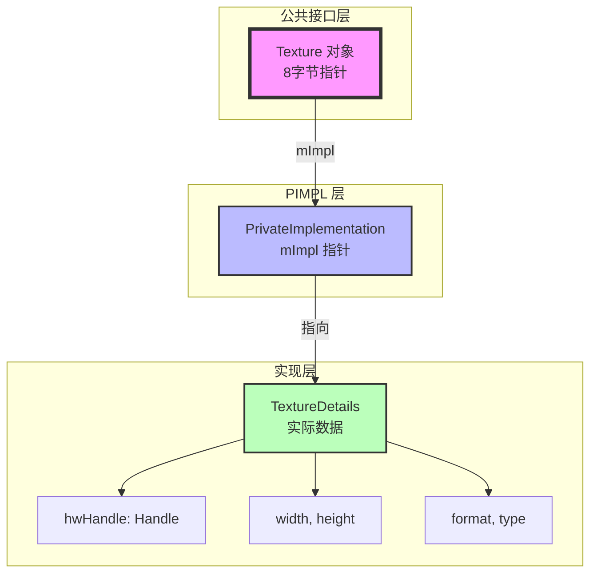
```mermaid
graph TB
    subgraph "公共接口层"
        A[Texture 对象<br/>8字节指针]
    end
    
    subgraph "PIMPL 层"
        B[PrivateImplementation<br/>mImpl 指针]
    end
    
    subgraph "实现层"
        C[TextureDetails<br/>实际数据]
        D[hwHandle: Handle]
        E[width, height]
        F[format, type]
    end
    
    A -->|mImpl| B
    B -->|指向| C
    C --> D
    C --> E
    C --> F
    
    style A fill:#f9f,stroke:#333,stroke-width:4px
    style B fill:#bbf,stroke:#333,stroke-width:2px
    style C fill:#bfb,stroke:#333,stroke-width:2px
```

#### 优势

- ✅ **ABI 兼容性**：实现变更不影响二进制文件
- ✅ **编译隔离**：减少编译依赖
- ✅ **实现隐藏**：隐藏底层细节

---

### 5. Adapter 模式（适配器模式）

#### 概述

Adapter 模式将一个类的接口转换成客户希望的另一个接口，使原本不兼容的类可以一起工作。

#### Filament 中的应用

**Driver API 适配不同后端**：
```cpp
// 统一的 Driver API
class Driver {
public:
    virtual Handle<HwTexture> createTexture(...) = 0;
    virtual void destroyTexture(Handle<HwTexture> handle) = 0;
    // ...
};

// OpenGL 适配器
class OpenGLDriver : public Driver {
public:
    Handle<HwTexture> createTexture(...) override {
        GLuint textureId;
        glGenTextures(1, &textureId);
        // 适配 OpenGL API
        return Handle<HwTexture>(textureId);
    }
};

// Vulkan 适配器
class VulkanDriver : public Driver {
public:
    Handle<HwTexture> createTexture(...) override {
        VkImage image;
        VkImageView imageView;
        // 适配 Vulkan API
        return Handle<HwTexture>(...);
    }
};
```

#### 架构图

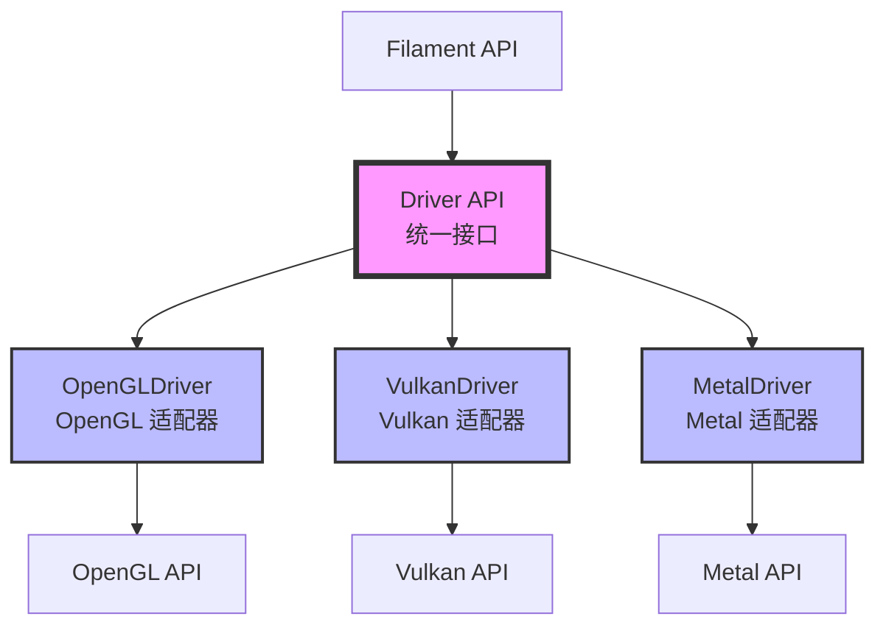
```mermaid
graph TB
    A[Filament API] --> B[Driver API<br/>统一接口]
    B --> C[OpenGLDriver<br/>OpenGL 适配器]
    B --> D[VulkanDriver<br/>Vulkan 适配器]
    B --> E[MetalDriver<br/>Metal 适配器]
    
    C --> F[OpenGL API]
    D --> G[Vulkan API]
    E --> H[Metal API]
    
    style B fill:#f9f,stroke:#333,stroke-width:4px
    style C fill:#bbf,stroke:#333,stroke-width:2px
    style D fill:#bbf,stroke:#333,stroke-width:2px
    style E fill:#bbf,stroke:#333,stroke-width:2px
```

#### 优势

- ✅ **平台无关**：应用代码不依赖特定后端
- ✅ **易于扩展**：添加新后端只需实现 Driver 接口
- ✅ **统一接口**：所有后端使用相同的 API

---

### 6. Handle 模式（句柄模式）

#### 概述

Handle 模式使用句柄（ID）而非直接指针来引用对象，提供类型安全和跨线程安全。

#### Filament 中的应用

**Handle<T> 类型系统**：
```cpp
// 头文件：filament/backend/include/backend/Handle.h
template<typename T>
class Handle {
public:
    using Type = uint32_t;
    
    Handle() noexcept : mObject(0) {}
    explicit Handle(Type id) noexcept : mObject(id) {}
    
    Type getId() const noexcept { return mObject; }
    bool isValid() const noexcept { return mObject != 0; }
    
private:
    Type mObject;  // 32位 ID
};

// 使用示例
Handle<HwTexture> textureHandle;
Handle<HwBuffer> bufferHandle;
```

#### 架构图

**类图**：
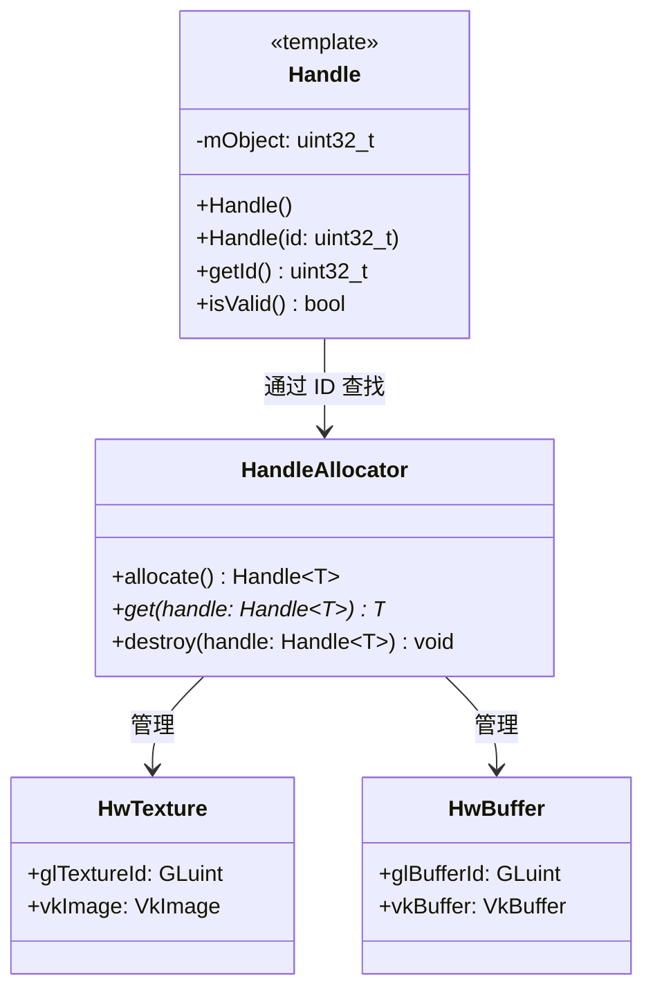
```mermaid
classDiagram
    class Handle {
        <<template>>
        -mObject: uint32_t
        +Handle() 
        +Handle(id: uint32_t)
        +getId() uint32_t
        +isValid() bool
    }
    class HandleAllocator {
        +allocate() Handle~T~
        +get(handle: Handle~T~) T*
        +destroy(handle: Handle~T~) void
    }
    class HwTexture {
        +glTextureId: GLuint
        +vkImage: VkImage
    }
    class HwBuffer {
        +glBufferId: GLuint
        +vkBuffer: VkBuffer
    }
    
    Handle --> HandleAllocator : 通过 ID 查找
    HandleAllocator --> HwTexture : 管理
    HandleAllocator --> HwBuffer : 管理
```

**关系图**：
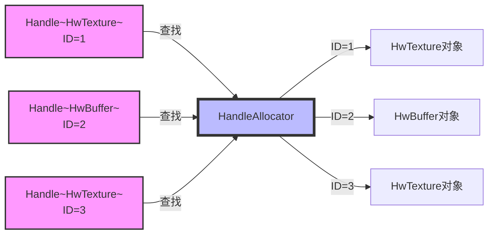
```mermaid
graph LR
    A[Handle~HwTexture~<br/>ID=1] -->|查找| B[HandleAllocator]
    C[Handle~HwBuffer~<br/>ID=2] -->|查找| B
    D[Handle~HwTexture~<br/>ID=3] -->|查找| B
    
    B -->|ID=1| E[HwTexture对象]
    B -->|ID=2| F[HwBuffer对象]
    B -->|ID=3| G[HwTexture对象]
    
    style A fill:#f9f,stroke:#333,stroke-width:2px
    style C fill:#f9f,stroke:#333,stroke-width:2px
    style D fill:#f9f,stroke:#333,stroke-width:2px
    style B fill:#bbf,stroke:#333,stroke-width:4px
```

#### 设计特点

1. **类型安全**：`Handle<HwTexture>` 和 `Handle<HwBuffer>` 是不同的类型
2. **跨线程安全**：句柄只是 ID，可以在命令流中安全传递
3. **资源管理**：资源由 Driver 统一管理，句柄只是引用
4. **调试支持**：可以通过 ID 追踪资源

#### 优势

- ✅ **类型安全**：编译时类型检查
- ✅ **线程安全**：可以安全地在线程间传递
- ✅ **轻量级**：只有 4 字节（32位系统）
- ✅ **调试友好**：ID 可以用于调试和追踪

---

## 行为型模式

### 7. Command 模式（命令模式）

#### 概述

Command 模式将请求封装为对象，从而可以用不同的请求对客户进行参数化，支持请求的排队、记录日志、撤销等操作。

#### Filament 中的应用

**CommandStream 异步渲染**：
```cpp
// 头文件：filament/backend/include/private/backend/CommandStream.h
class CommandStream {
public:
    // 命令基类
    class CommandBase {
        Execute mExecute;  // 执行函数指针
    public:
        CommandBase* execute(Driver& driver);
    };
    
    // 具体命令（模板特化）
    template<void(Driver::*METHOD)(ARGS...)>
    class Command : public CommandBase {
        std::tuple<ARGS...> mArgs;  // 保存的参数
    public:
        static void execute(Driver& driver, CommandBase* base, intptr_t* next);
    };
    
    // 执行命令流
    void execute(void* buffer);
};
```

#### 工作流程

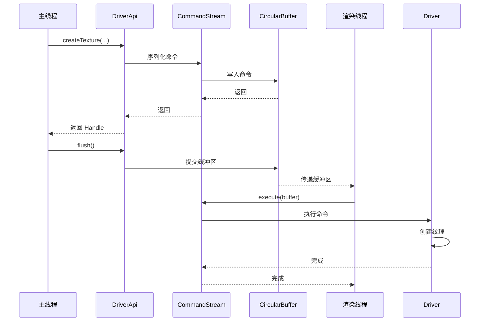
```mermaid
sequenceDiagram
    participant Main as 主线程
    participant API as DriverApi
    participant Stream as CommandStream
    participant Buffer as CircularBuffer
    participant Render as 渲染线程
    participant Driver as Driver
    
    Main->>API: createTexture(...)
    API->>Stream: 序列化命令
    Stream->>Buffer: 写入命令
    Buffer-->>Stream: 返回
    Stream-->>API: 返回
    API-->>Main: 返回 Handle
    
    Main->>API: flush()
    API->>Buffer: 提交缓冲区
    Buffer-->>Render: 传递缓冲区
    
    Render->>Stream: execute(buffer)
    Stream->>Driver: 执行命令
    Driver->>Driver: 创建纹理
    Driver-->>Stream: 完成
    Stream-->>Render: 完成
```

#### 实现细节

```cpp
// 命令执行
void CommandStream::execute(void* buffer) {
    CommandBase* cmd = static_cast<CommandBase*>(buffer);
    
    while (cmd) {
        cmd = cmd->execute(mDriver);  // 执行命令并获取下一个
    }
}

// 命令创建（通过宏生成）
#define DECL_DRIVER_API(methodName, paramsDecl, params) \
    void methodName paramsDecl override { \
        CommandType<decltype(&Driver::methodName)>::Command<&Driver::methodName> \
            cmd(mDispatcher.getExecute(), params); \
        mCurrentBuffer.allocate(cmd); \
    }
```

#### 优势

- ✅ **异步渲染**：主线程和渲染线程解耦
- ✅ **命令队列**：支持命令排队和批处理
- ✅ **延迟执行**：命令可以延迟到渲染线程执行
- ✅ **调试支持**：可以记录和重放命令

---

### 8. Strategy 模式（策略模式）

#### 概述

Strategy 模式定义一系列算法，把它们封装起来，并且使它们可以相互替换。策略模式让算法的变化独立于使用算法的客户。

#### Filament 中的应用

**多后端切换**：
```cpp
// 策略接口
class Driver {
public:
    virtual Handle<HwTexture> createTexture(...) = 0;
    virtual void destroyTexture(Handle<HwTexture> handle) = 0;
    // ...
};

// 具体策略
class OpenGLDriver : public Driver { /* OpenGL 实现 */ };
class VulkanDriver : public Driver { /* Vulkan 实现 */ };
class MetalDriver : public Driver { /* Metal 实现 */ };

// 上下文（Engine）
class Engine {
    std::unique_ptr<Driver> mDriver;  // 策略对象
    
public:
    Engine(Backend backend) {
        switch (backend) {
            case Backend::OPENGL:
                mDriver = std::make_unique<OpenGLDriver>(...);
                break;
            case Backend::VULKAN:
                mDriver = std::make_unique<VulkanDriver>(...);
                break;
            case Backend::METAL:
                mDriver = std::make_unique<MetalDriver>(...);
                break;
        }
    }
};
```

#### 架构图

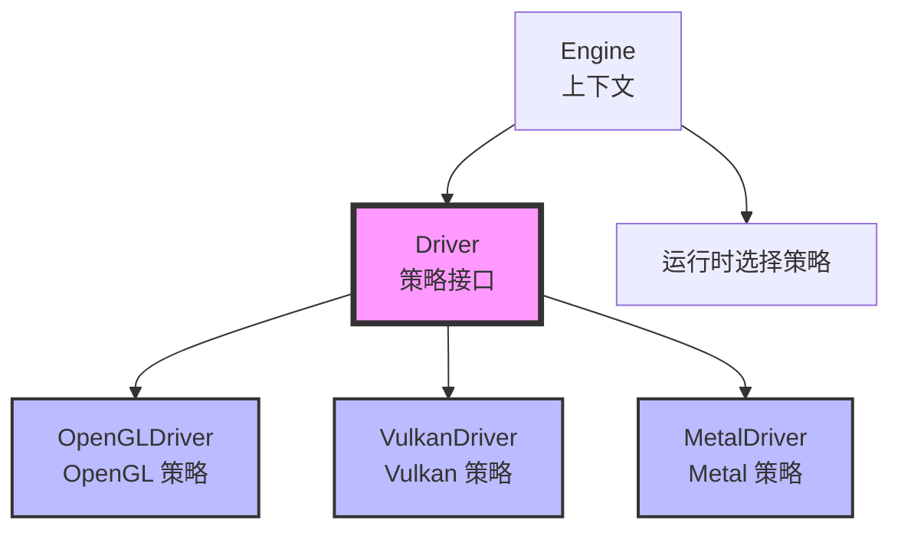
```mermaid
graph TB
    A[Engine<br/>上下文] --> B[Driver<br/>策略接口]
    B --> C[OpenGLDriver<br/>OpenGL 策略]
    B --> D[VulkanDriver<br/>Vulkan 策略]
    B --> E[MetalDriver<br/>Metal 策略]
    
    A --> F[运行时选择策略]
    
    style B fill:#f9f,stroke:#333,stroke-width:4px
    style C fill:#bbf,stroke:#333,stroke-width:2px
    style D fill:#bbf,stroke:#333,stroke-width:2px
    style E fill:#bbf,stroke:#333,stroke-width:2px
```

#### 优势

- ✅ **运行时切换**：可以在运行时选择不同的后端
- ✅ **易于扩展**：添加新后端只需实现 Driver 接口
- ✅ **代码复用**：应用代码不依赖具体后端

---

### 9. Observer 模式（观察者模式）

#### 概述

Observer 模式定义对象间一对多的依赖关系，当一个对象的状态发生改变时，所有依赖于它的对象都得到通知并自动更新。

#### Filament 中的应用

**资源生命周期管理**：
```cpp
// Engine 跟踪所有资源
class Engine {
    ResourceList mResourceList;  // 资源列表
    
public:
    template<typename T>
    T* create(const typename T::Builder& builder) {
        T* resource = /* 创建资源 */;
        mResourceList.add(resource);  // 注册观察者
        return resource;
    }
    
    template<typename T>
    void destroy(T* resource) {
        mResourceList.remove(resource);  // 移除观察者
        // 销毁资源
    }
    
    ~Engine() {
        // 自动清理所有资源
        mResourceList.clear();
    }
};
```

#### 架构图

**类图**：
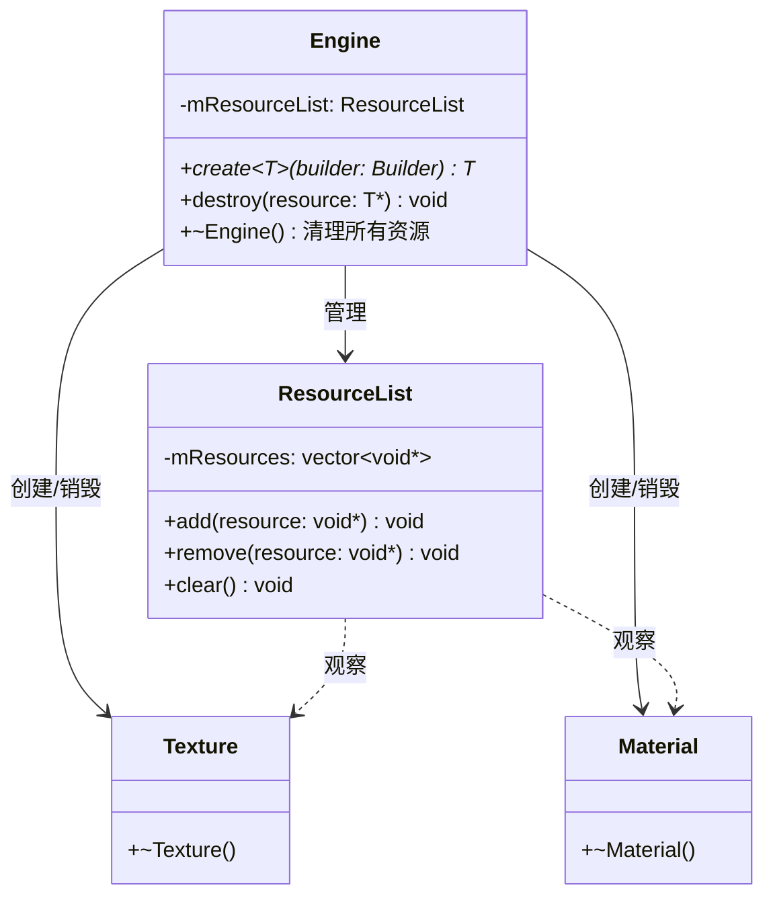
```mermaid
classDiagram
    class Engine {
        -mResourceList: ResourceList
        +create~T~(builder: Builder) T*
        +destroy(resource: T*) void
        +~Engine() 清理所有资源
    }
    class ResourceList {
        -mResources: vector~void*~
        +add(resource: void*) void
        +remove(resource: void*) void
        +clear() void
    }
    class Texture {
        +~Texture()
    }
    class Material {
        +~Material()
    }
    
    Engine --> ResourceList : 管理
    Engine --> Texture : 创建/销毁
    Engine --> Material : 创建/销毁
    ResourceList ..> Texture : 观察
    ResourceList ..> Material : 观察
```

**时序图**：
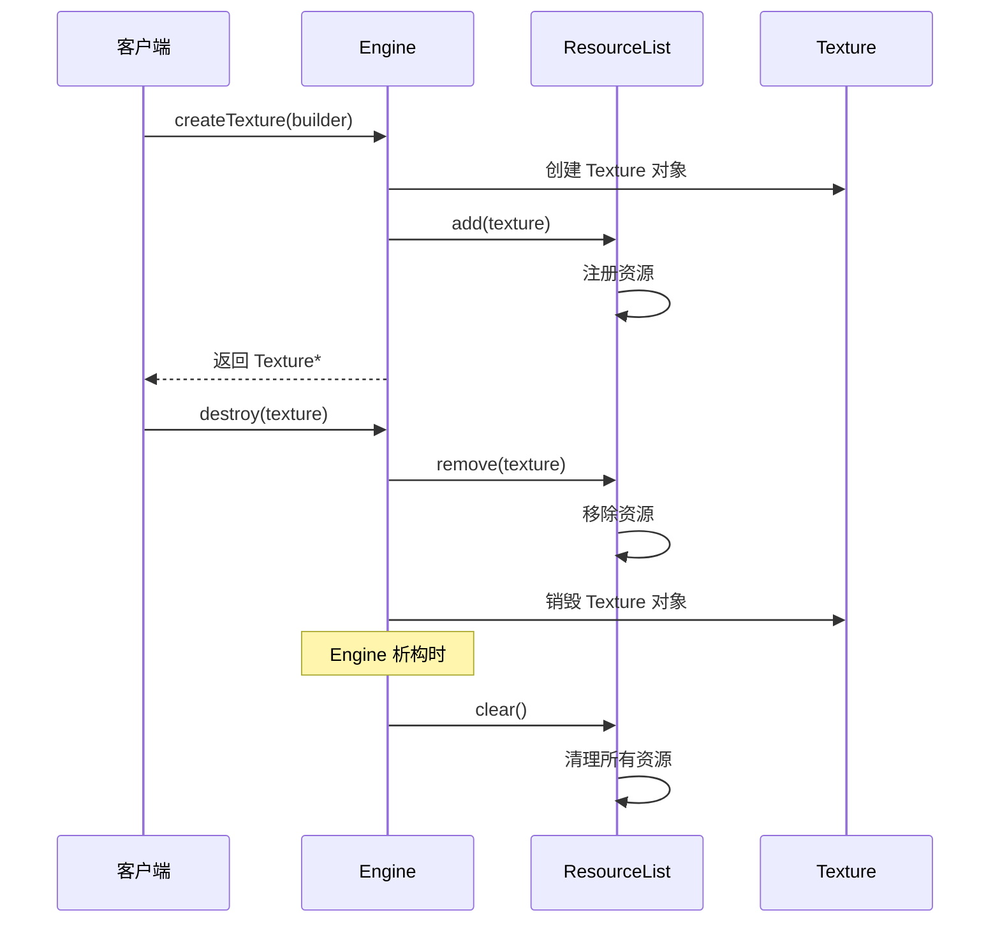
```mermaid
sequenceDiagram
    participant Client as 客户端
    participant Engine as Engine
    participant ResourceList as ResourceList
    participant Texture as Texture
    
    Client->>Engine: createTexture(builder)
    Engine->>Texture: 创建 Texture 对象
    Engine->>ResourceList: add(texture)
    ResourceList->>ResourceList: 注册资源
    Engine-->>Client: 返回 Texture*
    
    Client->>Engine: destroy(texture)
    Engine->>ResourceList: remove(texture)
    ResourceList->>ResourceList: 移除资源
    Engine->>Texture: 销毁 Texture 对象
    
    Note over Engine: Engine 析构时
    Engine->>ResourceList: clear()
    ResourceList->>ResourceList: 清理所有资源
```

#### 优势

- ✅ **自动管理**：资源自动跟踪和清理
- ✅ **防止泄漏**：确保所有资源都被正确释放
- ✅ **统一管理**：所有资源在一个地方管理

---

## 架构模式

### 10. ECS 模式（Entity-Component-System）

#### 概述

ECS 是一种软件架构模式，将游戏对象分解为三个核心概念：Entity（实体）、Component（组件）、System（系统）。

#### Filament 中的应用

**Entity-Component-System 架构**：
```cpp
// Entity：只是一个 ID
class Entity {
    uint32_t mIdentity;
};

// Component：数据容器
struct TransformComponent {
    mat4f transform;
    Entity parent;
};

struct RenderableComponent {
    VertexBuffer* vb;
    IndexBuffer* ib;
    MaterialInstance* material;
};

// System：处理逻辑
class TransformManager {
    // 管理所有 TransformComponent
    std::vector<TransformComponent> mComponents;
    
public:
    Instance create(Entity entity);
    void setTransform(Instance instance, const mat4f& transform);
};

class RenderableManager {
    // 管理所有 RenderableComponent
    std::vector<RenderableComponent> mComponents;
    
public:
    Instance create(Entity entity);
    void setGeometry(Instance instance, ...);
};
```

详细分析请参考：[Filament_ECS架构完整分析.md](./Filament_ECS架构完整分析.md)

#### 架构图

**ECS 架构图**：
```mermaid
graph TB
    subgraph "Entity 层"
        E1[Entity ID=1]
        E2[Entity ID=2]
        E3[Entity ID=3]
    end
    
    subgraph "Component 层"
        C1[TransformComponent]
        C2[RenderableComponent]
        C3[LightComponent]
    end
    
    subgraph "Manager 层"
        M1[TransformManager]
        M2[RenderableManager]
        M3[LightManager]
    end
    
    subgraph "SoA 存储"
        S1[transforms: mat4f[]]
        S2[boundingBoxes: AABB[]]
        S3[lightTypes: LightType[]]
    end
    
    E1 --> C1
    E1 --> C2
    E2 --> C1
    E2 --> C3
    E3 --> C2
    
    C1 --> M1
    C2 --> M2
    C3 --> M3
    
    M1 --> S1
    M2 --> S2
    M3 --> S3
    
    style E1 fill:#f9f,stroke:#333,stroke-width:2px
    style M1 fill:#bbf,stroke:#333,stroke-width:2px
    style S1 fill:#bfb,stroke:#333,stroke-width:2px
```

**类图**：
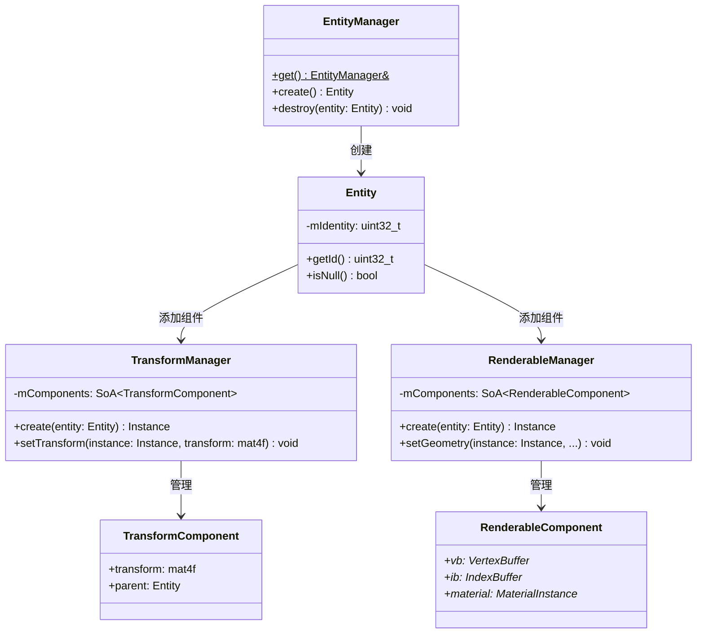
```mermaid
classDiagram
    class Entity {
        -mIdentity: uint32_t
        +getId() uint32_t
        +isNull() bool
    }
    class EntityManager {
        +get()$ EntityManager&
        +create() Entity
        +destroy(entity: Entity) void
    }
    class TransformManager {
        -mComponents: SoA~TransformComponent~
        +create(entity: Entity) Instance
        +setTransform(instance: Instance, transform: mat4f) void
    }
    class RenderableManager {
        -mComponents: SoA~RenderableComponent~
        +create(entity: Entity) Instance
        +setGeometry(instance: Instance, ...) void
    }
    class TransformComponent {
        +transform: mat4f
        +parent: Entity
    }
    class RenderableComponent {
        +vb: VertexBuffer*
        +ib: IndexBuffer*
        +material: MaterialInstance*
    }
    
    EntityManager --> Entity : 创建
    TransformManager --> TransformComponent : 管理
    RenderableManager --> RenderableComponent : 管理
    Entity --> TransformManager : 添加组件
    Entity --> RenderableManager : 添加组件
```

#### 优势

- ✅ **灵活性**：组件可以动态添加/删除
- ✅ **性能**：SoA 布局提高缓存命中率
- ✅ **可扩展性**：易于添加新组件类型
- ✅ **解耦**：组件之间相互独立

---

### 11. RAII 模式（Resource Acquisition Is Initialization）

#### 概述

RAII 是一种 C++ 编程技术，将资源的生命周期与对象的生命周期绑定，通过对象的构造和析构自动管理资源。

#### Filament 中的应用

**自动资源管理**：
```cpp
// PrivateImplementation 自动管理内存
template<typename T>
class PrivateImplementation {
    T* mImpl;
public:
    PrivateImplementation() : mImpl(new T) {}
    ~PrivateImplementation() { delete mImpl; }  // 自动释放
};

// 使用示例
{
    PrivateImplementation<MyImpl> p;  // 构造时分配
    // 使用 p
}  // 析构时自动释放
```

**FrameGraph 资源管理**：
```cpp
class FrameGraph {
public:
    template<typename T>
    Handle<T> create(const char* name, T&& desc) {
        // 创建资源
        return handle;
    }
    
    void execute() {
        // 执行渲染
        // 自动清理临时资源
    }
};
```

#### 架构图

**RAII 生命周期图**：
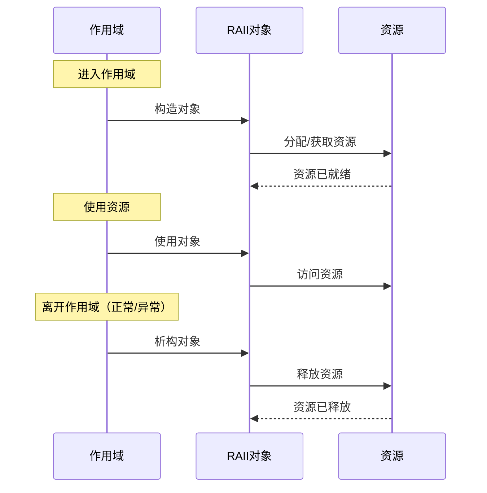
```mermaid
sequenceDiagram
    participant Scope as 作用域
    participant Object as RAII对象
    participant Resource as 资源
    
    Note over Scope: 进入作用域
    Scope->>Object: 构造对象
    Object->>Resource: 分配/获取资源
    Resource-->>Object: 资源已就绪
    
    Note over Scope: 使用资源
    Scope->>Object: 使用对象
    Object->>Resource: 访问资源
    
    Note over Scope: 离开作用域（正常/异常）
    Scope->>Object: 析构对象
    Object->>Resource: 释放资源
    Resource-->>Object: 资源已释放
```

**类图**：
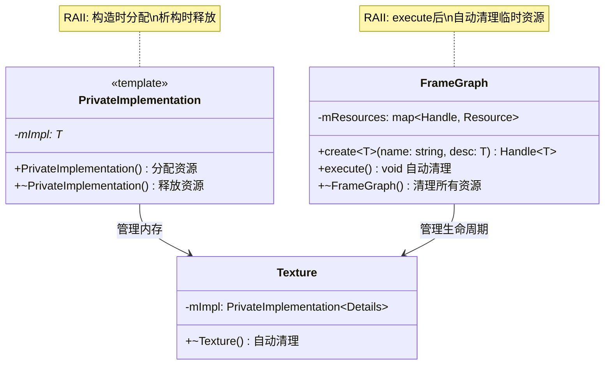
```mermaid
classDiagram
    class PrivateImplementation {
        <<template>>
        -mImpl: T*
        +PrivateImplementation() 分配资源
        +~PrivateImplementation() 释放资源
    }
    class FrameGraph {
        -mResources: map~Handle, Resource~
        +create~T~(name: string, desc: T) Handle~T~
        +execute() void 自动清理
        +~FrameGraph() 清理所有资源
    }
    class Texture {
        -mImpl: PrivateImplementation~Details~
        +~Texture() 自动清理
    }
    
    PrivateImplementation --> Texture : 管理内存
    FrameGraph --> Texture : 管理生命周期
    note for PrivateImplementation "RAII: 构造时分配\n析构时释放"
    note for FrameGraph "RAII: execute后\n自动清理临时资源"
```

**资源管理流程图**：
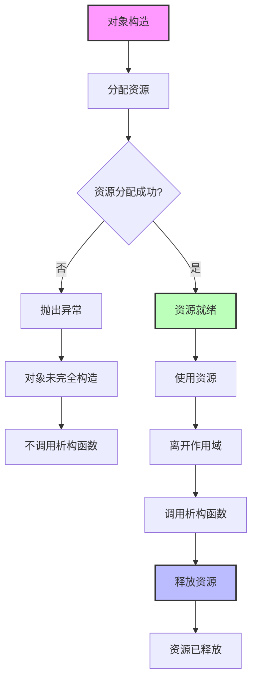
```mermaid
flowchart TD
    A[对象构造] --> B[分配资源]
    B --> C{资源分配成功?}
    C -->|是| D[资源就绪]
    C -->|否| E[抛出异常]
    E --> F[对象未完全构造]
    F --> G[不调用析构函数]
    
    D --> H[使用资源]
    H --> I[离开作用域]
    I --> J[调用析构函数]
    J --> K[释放资源]
    K --> L[资源已释放]
    
    style A fill:#f9f,stroke:#333,stroke-width:2px
    style D fill:#bfb,stroke:#333,stroke-width:2px
    style K fill:#bbf,stroke:#333,stroke-width:2px
```

#### 优势

- ✅ **自动管理**：资源自动分配和释放
- ✅ **异常安全**：即使抛出异常也能正确释放
- ✅ **防止泄漏**：确保资源被正确释放

---

## 模式组合应用

### Builder + Factory 组合

```cpp
// Builder 构建参数
Material* material = Material::Builder()
    .package(data, size)
    .build(*engine);  // Factory 创建对象

// Engine 作为 Factory
Material* Engine::createMaterial(const Material::Builder& builder) {
    // 从 Builder 获取参数并创建 Material
}
```

### PIMPL + Handle 组合

```cpp
// PIMPL 隐藏实现
class Texture : public FilamentAPI {
    utils::PrivateImplementation<Details> mImpl;
};

// Handle 引用资源
Handle<HwTexture> textureHandle = driver->createTexture(...);
```

### Command + Strategy 组合

```cpp
// Command 封装操作
class Command {
    void execute(Driver& driver);
};

// Strategy 选择后端
Driver* driver = createDriver(Backend::VULKAN);
command->execute(*driver);  // 执行命令
```

---

## 性能优化模式

### SoA 布局（Structure of Arrays）

#### 概述

SoA 是一种数据布局模式，将结构数组（AoS）转换为数组结构（SoA），提高缓存局部性。

#### Filament 中的应用

**Component 数据存储**：
```cpp
// AoS（传统方式）
struct Renderable {
    mat4 transform;
    AABB boundingBox;
    Material* material;
};
Renderable renderables[N];

// SoA（Filament 方式）
struct RenderableSoA {
    mat4 transforms[N];
    AABB boundingBoxes[N];
    Material* materials[N];
};
```

#### 架构图

**AoS vs SoA 对比图**：
```mermaid
graph TB
    subgraph "AoS: Array of Structures"
        A1[Renderable[0]<br/>transform<br/>boundingBox<br/>material]
        A2[Renderable[1]<br/>transform<br/>boundingBox<br/>material]
        A3[Renderable[2]<br/>transform<br/>boundingBox<br/>material]
        A1 --> A2
        A2 --> A3
    end
    
    subgraph "SoA: Structure of Arrays"
        B1[transforms[0..N]<br/>连续存储]
        B2[boundingBoxes[0..N]<br/>连续存储]
        B3[materials[0..N]<br/>连续存储]
    end
    
    style A1 fill:#fbb,stroke:#333,stroke-width:2px
    style B1 fill:#bfb,stroke:#333,stroke-width:2px
```

**内存布局对比**：
```mermaid
graph LR
    subgraph "AoS 内存布局"
        A1[transform 64B]
        A2[boundingBox 24B]
        A3[material 8B]
        A4[transform 64B]
        A5[boundingBox 24B]
        A6[material 8B]
        A1 --> A2 --> A3 --> A4 --> A5 --> A6
    end
    
    subgraph "SoA 内存布局"
        B1[transforms<br/>连续64B×N]
        B2[boundingBoxes<br/>连续24B×N]
        B3[materials<br/>连续8B×N]
    end
    
    style A1 fill:#fbb,stroke:#333,stroke-width:2px
    style B1 fill:#bfb,stroke:#333,stroke-width:2px
```

**性能优势图**：
```mermaid
graph TD
    A[批量处理 Transform] --> B{数据布局}
    B -->|AoS| C[访问分散<br/>缓存未命中多]
    B -->|SoA| D[访问连续<br/>缓存命中率高]
    
    C --> E[性能: 慢]
    D --> F[性能: 快]
    
    G[SIMD 优化] --> H{数据布局}
    H -->|AoS| I[难以向量化]
    H -->|SoA| J[易于向量化]
    
    I --> K[性能: 慢]
    J --> L[性能: 快]
    
    style D fill:#bfb,stroke:#333,stroke-width:2px
    style F fill:#bfb,stroke:#333,stroke-width:2px
    style J fill:#bfb,stroke:#333,stroke-width:2px
    style L fill:#bfb,stroke:#333,stroke-width:2px
```

#### 优势

- ✅ **缓存友好**：相同类型的数据连续存储
- ✅ **SIMD 优化**：便于向量化操作
- ✅ **批量处理**：可以批量处理相同类型的数据

---

## 总结

### 设计模式总结表

| 模式 | 类别 | 应用场景 | 关键优势 |
|------|------|---------|---------|
| **Builder** | 创建型 | Material、Texture 构建 | 灵活、可读性强 |
| **Factory** | 创建型 | Engine::create*() | 统一管理、资源跟踪 |
| **Singleton** | 创建型 | EntityManager、JobSystem | 全局访问、唯一实例 |
| **PIMPL** | 结构型 | 所有 FilamentAPI 类 | ABI 兼容、编译隔离 |
| **Adapter** | 结构型 | Driver API 适配 | 平台无关、易于扩展 |
| **Handle** | 结构型 | Handle<T> 资源引用 | 类型安全、线程安全 |
| **Command** | 行为型 | CommandStream 异步渲染 | 解耦、命令队列 |
| **Strategy** | 行为型 | 多后端切换 | 运行时切换、易于扩展 |
| **Observer** | 行为型 | 资源生命周期管理 | 自动管理、防止泄漏 |
| **ECS** | 架构 | Entity-Component-System | 灵活、高性能 |
| **RAII** | 架构 | 资源自动管理 | 异常安全、防止泄漏 |

### 设计原则

Filament 的设计遵循以下原则：

1. **单一职责原则**：每个类只负责一个功能
2. **开闭原则**：对扩展开放，对修改关闭
3. **依赖倒置原则**：依赖抽象而非具体实现
4. **接口隔离原则**：使用多个专门的接口
5. **里氏替换原则**：子类可以替换父类

### 最佳实践

1. **优先使用组合而非继承**：PIMPL、Handle 等
2. **使用 RAII 管理资源**：自动资源管理
3. **使用模板提高性能**：编译时多态
4. **使用设计模式提高可维护性**：清晰的架构

---

## 参考资料

- [Filament 源码](https://github.com/google/filament)
- [Filament_PIMPL架构设计完整分析.md](./Filament_PIMPL架构设计完整分析.md)
- [Filament_ECS架构完整分析.md](./Filament_ECS架构完整分析.md)
- [Filament_RHI架构完整分析.md](./Filament_RHI架构完整分析.md)
- `filament/include/filament/Engine.h`
- `filament/include/filament/FilamentAPI.h`
- `filament/backend/include/private/backend/CommandStream.h`

---

*文档生成时间：2024年*
*Filament 版本：最新*

