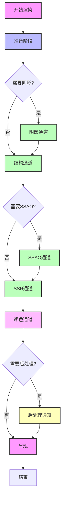
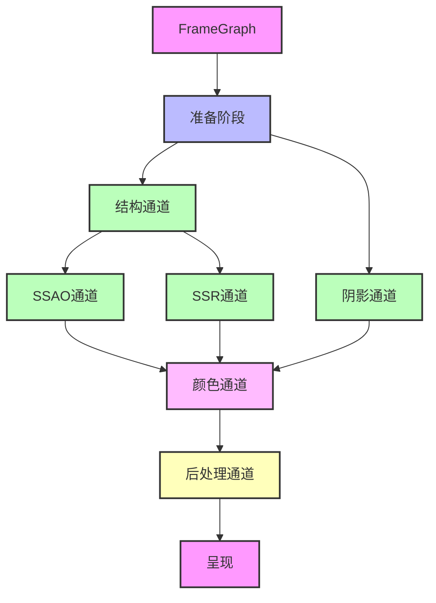
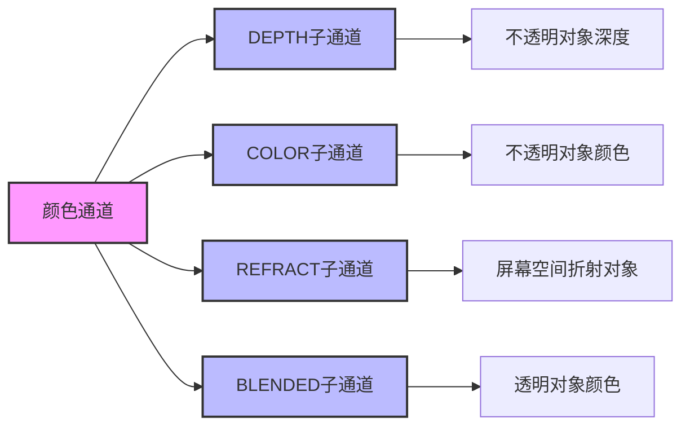
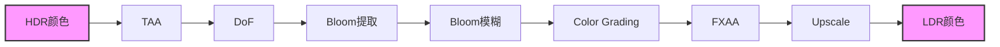

# Filament 渲染管线架构完整分析

## 目录
1. [概述](#概述)
2. [渲染管线整体流程](#渲染管线整体流程)
3. [阶段一：准备阶段（Preparation）](#阶段一准备阶段preparation)
4. [阶段二：阴影通道（Shadow Pass）](#阶段二阴影通道shadow-pass)
5. [阶段三：结构通道（Structure Pass）](#阶段三结构通道structure-pass)
6. [阶段四：SSAO 通道](#阶段四ssao-通道)
7. [阶段五：SSR 通道](#阶段五ssr-通道)
8. [阶段六：颜色通道（Color Pass）](#阶段六颜色通道color-pass)
9. [阶段七：后处理通道（Post-Processing）](#阶段七后处理通道post-processing)
10. [阶段八：呈现阶段（Presentation）](#阶段八呈现阶段presentation)
11. [渲染管线优化策略](#渲染管线优化策略)
12. [架构图](#架构图)

---

## 概述

Filament 的渲染管线是一个多通道、可配置的渲染系统，通过 FrameGraph 管理资源依赖和通道执行顺序。整个管线分为 8 个主要阶段，每个阶段都有明确的职责和优化策略。

### 核心设计原则

1. **延迟执行**：通过 FrameGraph 延迟资源分配和通道执行
2. **自动剔除**：FrameGraph 自动剔除未使用的通道和资源
3. **资源复用**：通过 FrameGraph 实现资源的高效复用
4. **并行执行**：某些通道可以并行执行（如 SSAO 和 SSR）

### 关键组件

- **FrameGraph**：资源依赖图和通道调度器
- **RenderPass**：渲染通道，包含排序后的绘制命令
- **PostProcessManager**：后处理效果管理器
- **ShadowMapManager**：阴影贴图管理器

---

## 渲染管线整体流程

### 完整流程图



### 执行顺序

```cpp
void FRenderer::renderInternal(FView const* view, bool flush) {
    // 1. 准备阶段
    view.prepare(engine, driver, rootArenaScope, svp, cameraInfo, ...);
    
    // 2. 阴影通道
    if (view.needsShadowMap()) {
        auto shadows = view.renderShadowMaps(...);
    }
    
    // 3. 结构通道
    auto [structure, picking] = ppm.structure(...);
    
    // 4. SSAO 通道
    if (aoOptions.enabled) {
        auto ssao = ppm.screenSpaceAmbientOcclusion(...);
    }
    
    // 5. SSR 通道
    if (ssReflectionsOptions.enabled) {
        auto reflections = ppm.ssr(...);
    }
    
    // 6. 颜色通道
    auto colorPassOutput = RendererUtils::colorPass(...);
    
    // 7. 后处理通道
    if (hasPostProcess) {
        // TAA, DoF, Bloom, ColorGrading, FXAA, Upscale
    }
    
    // 8. 呈现
    fg.forwardResource(fgViewRenderTarget, input);
    fg.present(fgViewRenderTarget);
    fg.compile();
    fg.execute(driver);
}
```

---

## 阶段一：准备阶段（Preparation）

### 职责

1. **视口和相机配置**：计算渲染视口、相机投影矩阵
2. **可见性剔除**：剔除不可见的渲染对象
3. **光照准备**：Froxelization（点光源剔除）
4. **UBO 更新**：更新 Uniform Buffer 数据
5. **描述符堆提交**：提交描述符堆到 GPU

### 详细流程

```cpp
void FView::prepare(FEngine& engine, DriverApi& driver,
                    RootArenaScope& rootArenaScope,
                    Viewport const& svp, CameraInfo const& cameraInfo,
                    float4 const& userTime, bool needsAlphaChannel) {
    // 1. 更新相机信息
    prepareCamera(engine, cameraInfo);
    
    // 2. 更新时间
    prepareTime(engine, userTime);
    
    // 3. 更新视口
    prepareViewport(svp, xvp);
    
    // 4. 可见性剔除
    prepareVisibleRenderables(engine, cameraInfo);
    
    // 5. Froxelization（点光源剔除）
    if (hasDynamicLighting()) {
        froxelizeLights(engine, cameraInfo);
    }
    
    // 6. 更新 UBO
    updateUBOs(driver, renderableData, visibleRenderables);
    
    // 7. 提交描述符堆
    commitUniforms(driver);
}
```

### 关键操作

#### 1. 可见性剔除

```cpp
void FScene::prepareVisibleRenderables(Range<uint32_t> visibleRenderables) {
    // 基于视锥体剔除
    // 基于遮挡剔除（如果启用）
    // 更新可见渲染对象列表
}
```

#### 2. Froxelization

```cpp
void Froxelizer::froxelizeLights(CameraInfo const& cameraInfo,
                                   LightData const& lightData) {
    // 将点光源分配到 Froxel 网格中
    // 计算每个 Froxel 的光照列表
    // 上传到 GPU 缓冲区
}
```

#### 3. UBO 更新

```cpp
void FView::updateUBOs(DriverApi& driver,
                        RenderableData const& renderableData,
                        Range<uint32_t> visibleRenderables) {
    // 为每个可见渲染对象更新 UBO
    // 包括变换矩阵、材质参数等
}
```

### 输出

- **可见渲染对象列表**：用于后续通道
- **光照数据**：Froxel 缓冲区
- **UBO 数据**：Uniform Buffer
- **描述符堆**：GPU 资源绑定

---

## 阶段二：阴影通道（Shadow Pass）

### 职责

1. **阴影贴图生成**：为每个光源生成阴影贴图
2. **阴影投射者渲染**：渲染阴影投射几何体
3. **阴影贴图打包**：将多个阴影贴图打包到纹理图集

### 详细流程

```cpp
FrameGraphId<FrameGraphTexture> ShadowMapManager::render(
        FEngine& engine, FrameGraph& fg,
        RenderPassBuilder const& passBuilder,
        FView& view, CameraInfo const& mainCameraInfo,
        float4 const& userTime) {
    
    // 1. 更新阴影贴图配置
    ShadowTechnique shadowTechnique = updateShadowMaps(...);
    
    // 2. 为每个阴影贴图创建渲染通道
    for (auto const& shadowMap : mShadowMaps) {
        // 创建阴影贴图纹理
        auto shadowTexture = builder.createTexture(...);
        
        // 创建深度纹理（用于 VSM）
        auto depthTexture = builder.createTexture(...);
        
        // 创建渲染通道
        fg.addPass<ShadowPassData>("Shadow Pass",
            [&](FrameGraph::Builder& builder, auto& data) {
                // 设置渲染目标
                builder.declareRenderPass("Shadow Target", {
                    .attachments = { .depth = data.depth },
                    .clearFlags = TargetBufferFlags::DEPTH
                });
            },
            [=](FrameGraphResources const& resources,
                auto const& data, DriverApi& driver) {
                // 渲染阴影投射者
                renderShadowCasters(shadowMap, ...);
            });
    }
    
    // 3. 打包阴影贴图到图集
    return packShadowMaps(fg, shadowTextures);
}
```

### 阴影类型

#### 1. 方向光阴影（CSM - Cascaded Shadow Maps）

```cpp
ShadowTechnique ShadowMapManager::updateCascadeShadowMaps(...) {
    // 计算级联分割
    calculateCascadeSplits(cameraInfo, shadowOptions);
    
    // 为每个级联创建阴影贴图
    for (size_t c = 0; c < shadowOptions.shadowCascades; c++) {
        // 计算级联视锥体
        calculateCascadeFrustum(c, cameraInfo);
        
        // 创建阴影贴图
        createShadowMap(c, ...);
    }
}
```

#### 2. 点光源阴影

```cpp
void ShadowMapManager::updateSpotShadowMaps(...) {
    // 为每个点光源创建 6 个面的阴影贴图
    for (auto const& light : pointLights) {
        for (uint8_t face = 0; face < 6; face++) {
            // 计算每个面的视锥体
            calculateFaceFrustum(light, face);
            
            // 创建阴影贴图
            createShadowMap(light, face, ...);
        }
    }
}
```

#### 3. 聚光灯阴影

```cpp
void ShadowMapManager::updateSpotShadowMaps(...) {
    // 为每个聚光灯创建一个阴影贴图
    for (auto const& light : spotLights) {
        // 计算聚光灯视锥体
        calculateSpotFrustum(light);
        
        // 创建阴影贴图
        createShadowMap(light, ...);
    }
}
```

### 阴影技术

#### 1. PCF（Percentage Closer Filtering）

```glsl
float shadowPCF(sampler2DShadow shadowMap, vec4 shadowCoord) {
    float shadow = 0.0;
    for (int x = -1; x <= 1; x++) {
        for (int y = -1; y <= 1; y++) {
            vec2 offset = vec2(x, y) * shadowMapSize;
            shadow += texture(shadowMap, shadowCoord.xyz + vec3(offset, 0.0));
        }
    }
    return shadow / 9.0;
}
```

#### 2. VSM（Variance Shadow Maps）

```glsl
float shadowVSM(sampler2D shadowMap, vec4 shadowCoord) {
    vec2 moments = texture(shadowMap, shadowCoord.xy).xy;
    float p = step(shadowCoord.z, moments.x);
    float variance = moments.y - moments.x * moments.x;
    float d = shadowCoord.z - moments.x;
    float p_max = variance / (variance + d * d);
    return max(p, p_max);
}
```

### 输出

- **阴影贴图纹理**：存储在 FrameGraph blackboard 中
- **阴影贴图图集**：多个阴影贴图打包到一个纹理

---

## 阶段三：结构通道（Structure Pass）

### 职责

1. **深度预通道**：生成深度缓冲区
2. **结构信息**：生成用于 SSAO 和接触阴影的结构信息
3. **拾取支持**：生成拾取缓冲区（如果启用）

### 详细流程

```cpp
std::pair<FrameGraphId<FrameGraphTexture>, FrameGraphId<FrameGraphTexture>>
PostProcessManager::structure(FrameGraph& fg,
                               RenderPassBuilder const& passBuilder,
                               RenderFlags renderFlags,
                               uint32_t width, uint32_t height,
                               StructureOptions options) {
    
    // 1. 创建结构纹理（深度）
    auto structure = fg.createTexture("Structure", {
        .width = width * options.scale,
        .height = height * options.scale,
        .format = TextureFormat::DEPTH24
    });
    
    // 2. 创建拾取纹理（如果启用）
    FrameGraphId<FrameGraphTexture> picking;
    if (options.picking) {
        picking = fg.createTexture("Picking", {
            .width = width * options.scale,
            .height = height * options.scale,
            .format = TextureFormat::RGBA8
        });
    }
    
    // 3. 创建渲染通道
    fg.addPass<StructurePassData>("Structure Pass",
        [&](FrameGraph::Builder& builder, auto& data) {
            data.structure = builder.write(structure,
                FrameGraphTexture::Usage::DEPTH_ATTACHMENT);
            if (options.picking) {
                data.picking = builder.write(picking,
                    FrameGraphTexture::Usage::COLOR_ATTACHMENT);
            }
            
            builder.declareRenderPass("Structure Target", {
                .attachments = {
                    .color = { data.picking },
                    .depth = data.structure
                },
                .clearFlags = TargetBufferFlags::DEPTH
            });
        },
        [=](FrameGraphResources const& resources,
            auto const& data, DriverApi& driver) {
            // 渲染深度预通道
            renderDepthPrepass(passBuilder, ...);
        });
    
    return { structure, picking };
}
```

### 深度预通道渲染

```cpp
void renderDepthPrepass(RenderPassBuilder const& passBuilder, ...) {
    // 使用 DEPTH_VARIANT 变体
    Variant depthVariant(Variant::DEPTH_VARIANT);
    
    // 设置命令类型标志
    passBuilder.commandTypeFlags(
        RenderPass::CommandTypeFlags::DEPTH |
        RenderPass::CommandTypeFlags::FILTER_TRANSLUCENT_OBJECTS);
    
    // 构建渲染通道
    RenderPass pass = passBuilder.build(engine, driver);
    
    // 执行渲染
    pass.getExecutor().execute(driver);
}
```

### 输出

- **结构纹理**：深度缓冲区，用于 SSAO 和接触阴影
- **拾取纹理**：对象 ID 缓冲区（如果启用）

---

## 阶段四：SSAO 通道

### 职责

1. **环境光遮蔽计算**：基于深度缓冲区计算环境光遮蔽
2. **降采样**：可以以较低分辨率计算（性能优化）
3. **模糊**：对结果进行模糊处理

### 详细流程

```cpp
FrameGraphId<FrameGraphTexture> PostProcessManager::screenSpaceAmbientOcclusion(
        FrameGraph& fg, Viewport const& svp,
        CameraInfo const& cameraInfo,
        FrameGraphId<FrameGraphTexture> structure,
        AmbientOcclusionOptions const& options) {
    
    // 1. 计算 SSAO 分辨率
    uint32_t ssaoWidth = svp.width * options.resolution;
    uint32_t ssaoHeight = svp.height * options.resolution;
    
    // 2. 创建 SSAO 纹理
    auto ssao = fg.createTexture("SSAO", {
        .width = ssaoWidth,
        .height = ssaoHeight,
        .format = TextureFormat::R8
    });
    
    // 3. 创建 SSAO 通道
    fg.addPass<SSAOPassData>("SSAO Pass",
        [&](FrameGraph::Builder& builder, auto& data) {
            // 采样结构纹理
            data.structure = builder.sample(structure);
            
            // 写入 SSAO 纹理
            data.ssao = builder.write(ssao,
                FrameGraphTexture::Usage::COLOR_ATTACHMENT);
            
            builder.declareRenderPass("SSAO Target", {
                .attachments = { .color = { data.ssao } }
            });
        },
        [=](FrameGraphResources const& resources,
            auto const& data, DriverApi& driver) {
            // 执行 SSAO 计算
            executeSSAO(resources, data, cameraInfo, options);
        });
    
    // 4. 模糊处理
    if (options.bilateralThreshold > 0.0f) {
        ssao = bilateralBlur(fg, ssao, structure, options);
    }
    
    return ssao;
}
```

### SSAO 算法

```glsl
float calculateSSAO(vec3 position, vec3 normal, sampler2D depthTexture) {
    float occlusion = 0.0;
    
    // 采样点
    const int sampleCount = 16;
    vec3 samples[sampleCount] = ...; // 预计算的采样点
    
    for (int i = 0; i < sampleCount; i++) {
        // 变换采样点到切空间
        vec3 samplePos = position + samples[i] * radius;
        
        // 投影到屏幕空间
        vec4 offset = projection * vec4(samplePos, 1.0);
        offset.xy /= offset.w;
        offset.xy = offset.xy * 0.5 + 0.5;
        
        // 采样深度
        float sampleDepth = texture(depthTexture, offset.xy).r;
        
        // 计算遮蔽
        float rangeCheck = smoothstep(0.0, 1.0, radius / abs(position.z - sampleDepth));
        occlusion += (sampleDepth >= samplePos.z + bias ? 1.0 : 0.0) * rangeCheck;
    }
    
    return 1.0 - (occlusion / sampleCount);
}
```

### 输出

- **SSAO 纹理**：单通道环境光遮蔽贴图

---

## 阶段五：SSR 通道

### 职责

1. **屏幕空间反射**：基于深度和颜色缓冲区计算反射
2. **Mipmap 生成**：为反射纹理生成 Mipmap
3. **历史帧混合**：与历史帧混合减少闪烁

### 详细流程

```cpp
FrameGraphId<FrameGraphTexture> PostProcessManager::ssr(
        FrameGraph& fg,
        RenderPassBuilder const& passBuilder,
        FrameHistory const& frameHistory,
        FrameGraphId<FrameGraphTexture> structure,
        Viewport const& svp) {
    
    // 1. 创建反射纹理
    auto reflections = fg.createTexture("SSR", {
        .width = svp.width,
        .height = svp.height,
        .format = TextureFormat::RGBA16F
    });
    
    // 2. 创建 SSR 通道
    fg.addPass<SSRPassData>("SSR Pass",
        [&](FrameGraph::Builder& builder, auto& data) {
            // 采样结构纹理
            data.structure = builder.sample(structure);
            
            // 写入反射纹理
            data.reflections = builder.write(reflections,
                FrameGraphTexture::Usage::COLOR_ATTACHMENT);
            
            builder.declareRenderPass("SSR Target", {
                .attachments = { .color = { data.reflections } }
            });
        },
        [=](FrameGraphResources const& resources,
            auto const& data, DriverApi& driver) {
            // 执行 SSR 计算
            executeSSR(resources, data, frameHistory, ...);
        });
    
    // 3. 生成 Mipmap
    if (reflections) {
        generateMipmapSSR(fg, reflections, ...);
    }
    
    return reflections;
}
```

### SSR 算法

```glsl
vec3 calculateSSR(vec3 viewPos, vec3 viewDir, vec3 normal,
                  sampler2D depthTexture, sampler2D colorTexture) {
    // 计算反射方向
    vec3 reflectDir = reflect(-viewDir, normal);
    
    // 射线步进
    vec3 rayPos = viewPos;
    float stepSize = 0.1;
    
    for (int i = 0; i < maxSteps; i++) {
        rayPos += reflectDir * stepSize;
        
        // 投影到屏幕空间
        vec4 screenPos = projection * vec4(rayPos, 1.0);
        screenPos.xy /= screenPos.w;
        screenPos.xy = screenPos.xy * 0.5 + 0.5;
        
        // 采样深度
        float sceneDepth = texture(depthTexture, screenPos.xy).r;
        
        // 深度测试
        if (abs(rayPos.z - sceneDepth) < threshold) {
            // 命中，采样颜色
            return texture(colorTexture, screenPos.xy).rgb;
        }
    }
    
    return vec3(0.0); // 未命中
}
```

### 输出

- **SSR 纹理**：屏幕空间反射贴图（带 Mipmap）

---

## 阶段六：颜色通道（Color Pass）

### 职责

1. **主渲染通道**：渲染场景中的所有可见对象
2. **PBR 计算**：执行物理基于渲染计算
3. **光照计算**：计算直接光和间接光
4. **阴影采样**：采样阴影贴图

### 详细流程

```cpp
RendererUtils::ColorPassOutput RendererUtils::colorPass(
        FrameGraph& fg, const char* name, FEngine& engine, FView const& view,
        ColorPassInput const& colorPassInput,
        FrameGraphTexture::Descriptor const& colorBufferDesc,
        ColorPassConfig const& config,
        PostProcessManager::ColorGradingConfig const colorGradingConfig,
        RenderPass::Executor passExecutor) {
    
    // 1. 创建颜色缓冲区
    auto color = fg.createTexture("Color Buffer", colorBufferDesc);
    
    // 2. 创建深度缓冲区
    auto depth = fg.createTexture("Depth Buffer", {
        .width = colorBufferDesc.width,
        .height = colorBufferDesc.height,
        .format = TextureFormat::DEPTH32F
    });
    
    // 3. 创建颜色通道
    fg.addPass<ColorPassData>("Color Pass",
        [&](FrameGraph::Builder& builder, auto& data) {
            // 采样输入纹理
            data.shadows = builder.sample(colorPassInput.shadows);
            data.ssao = builder.sample(colorPassInput.ssao);
            data.ssr = builder.sample(colorPassInput.ssr);
            data.structure = builder.sample(colorPassInput.structure);
            
            // 写入颜色和深度
            data.color = builder.write(color,
                FrameGraphTexture::Usage::COLOR_ATTACHMENT);
            data.depth = builder.write(depth,
                FrameGraphTexture::Usage::DEPTH_ATTACHMENT);
            
            builder.declareRenderPass("Color Target", {
                .attachments = {
                    .color = { data.color },
                    .depth = data.depth
                },
                .clearFlags = config.clearFlags
            });
        },
        [=](FrameGraphResources const& resources,
            auto const& data, DriverApi& driver) {
            // 设置采样器
            view.prepareSSAO(resources.getTexture(data.ssao));
            view.prepareSSR(resources.getTexture(data.ssr));
            view.prepareShadowMapping(engine,
                resources.getTexture(data.shadows));
            
            // 执行渲染通道
            passExecutor.execute(driver);
        });
    
    return { color, depth };
}
```

### RenderPass 执行

```cpp
void RenderPass::Executor::execute(DriverApi& driver) {
    // 1. 设置渲染状态
    driver.bindRenderTarget(renderTarget);
    driver.setViewport(viewport);
    driver.setScissor(scissor);
    
    // 2. 执行命令
    for (Command const* curr = mBegin; curr != mEnd; ++curr) {
        if (curr->key == Pass::SENTINEL) {
            break;
        }
        
        // 设置材质和状态
        setMaterialState(curr, driver);
        
        // 绑定资源
        bindResources(curr, driver);
        
        // 绘制
        driver.draw(curr->info.primitive, curr->info.count,
                    curr->info.instanceCount, curr->info.indexOffset);
    }
}
```

### 子通道

#### 1. DEPTH 通道

```cpp
// 深度预通道（如果启用）
if (needsDepthPrepass) {
    // 渲染不透明对象的深度
    renderDepthPrepass();
}
```

#### 2. COLOR 通道

```cpp
// 不透明对象
renderOpaqueObjects();

// 屏幕空间折射对象
if (hasScreenSpaceRefraction) {
    renderRefractionObjects();
}
```

#### 3. BLENDED 通道

```cpp
// 透明对象（按深度排序）
renderTransparentObjects();
```

### PBR 着色

```glsl
vec3 calculatePBR(vec3 albedo, vec3 normal, vec3 viewDir,
                  vec3 lightDir, vec3 lightColor,
                  float roughness, float metallic) {
    // 计算基础反射率
    vec3 F0 = mix(vec3(0.04), albedo, metallic);
    
    // 计算 Cook-Torrance BRDF
    float NDF = DistributionGGX(normal, halfDir, roughness);
    float G = GeometrySmith(normal, viewDir, lightDir, roughness);
    vec3 F = fresnelSchlick(max(dot(halfDir, viewDir), 0.0), F0);
    
    vec3 numerator = NDF * G * F;
    float denominator = 4.0 * max(dot(normal, viewDir), 0.0) *
                        max(dot(normal, lightDir), 0.0) + 0.0001;
    vec3 specular = numerator / denominator;
    
    // 计算漫反射
    vec3 kS = F;
    vec3 kD = vec3(1.0) - kS;
    kD *= 1.0 - metallic;
    
    vec3 diffuse = kD * albedo / PI;
    
    // 组合
    return (diffuse + specular) * lightColor *
           max(dot(normal, lightDir), 0.0);
}
```

### 输出

- **颜色缓冲区**：HDR 线性空间颜色
- **深度缓冲区**：深度值

---

## 阶段七：后处理通道（Post-Processing）

### 职责

1. **色调映射**：将 HDR 转换为 LDR
2. **泛光**：模拟明亮光源的泛光效果
3. **景深**：模拟相机景深效果
4. **时间抗锯齿**：减少锯齿和闪烁
5. **颜色分级**：调整颜色和对比度
6. **抗锯齿**：FXAA 或其他抗锯齿技术
7. **上采样**：动态分辨率上采样

### 详细流程

```cpp
if (hasPostProcess) {
    // 1. 解析深度缓冲区
    auto depth = ppm.resolve(fg, "Resolved Depth Buffer",
                             colorPassOutput.depth, { .levels = 1 });
    
    // 2. TAA（时间抗锯齿）
    if (taaOptions.enabled) {
        input = ppm.taa(fg, input, depth, frameHistory, ...);
    }
    
    // 3. DoF（景深）
    if (dofOptions.enabled) {
        input = ppm.dof(fg, input, depth, cameraInfo, ...);
    }
    
    // 4. Bloom（泛光）
    FrameGraphId<FrameGraphTexture> bloom, flare;
    if (bloomOptions.enabled) {
        auto [bloom_, flare_] = ppm.bloom(fg, input, ...);
        bloom = bloom_;
        flare = flare_;
    }
    
    // 5. Color Grading（颜色分级）
    if (hasColorGrading) {
        input = ppm.colorGrading(fg, input, xvp,
                                 bloom, flare, ...);
    }
    
    // 6. FXAA（快速近似抗锯齿）
    if (hasFXAA) {
        input = ppm.fxaa(fg, input, xvp, ...);
    }
    
    // 7. Upscale（上采样）
    if (scaled) {
        input = ppm.upscale(fg, needsAlphaChannel, ...);
    }
}
```

### 后处理效果详解

#### 1. TAA（Temporal Anti-Aliasing）

```cpp
FrameGraphId<FrameGraphTexture> PostProcessManager::taa(
        FrameGraph& fg,
        FrameGraphId<FrameGraphTexture> input,
        FrameGraphId<FrameGraphTexture> depth,
        FrameHistory const& frameHistory,
        TemporalAntiAliasingOptions const& options) {
    
    // 1. 获取历史帧
    auto history = frameHistory.getPrevious();
    
    // 2. 重投影历史帧
    auto reprojected = reprojectHistory(history, depth, ...);
    
    // 3. 混合当前帧和历史帧
    auto output = blendFrames(input, reprojected, options);
    
    // 4. 保存当前帧作为历史
    frameHistory.saveCurrent(input);
    
    return output;
}
```

#### 2. Bloom

```cpp
std::pair<FrameGraphId<FrameGraphTexture>, FrameGraphId<FrameGraphTexture>>
PostProcessManager::bloom(
        FrameGraph& fg,
        FrameGraphId<FrameGraphTexture> input,
        TextureFormat format,
        BloomOptions const& options) {
    
    // 1. 提取亮部
    auto bright = extractBrightness(fg, input, options.threshold);
    
    // 2. 下采样（多级）
    auto downsampled = downsampleMipChain(fg, bright, ...);
    
    // 3. 上采样并混合
    auto bloom = upsampleAndBlend(fg, downsampled, ...);
    
    // 4. 镜头光晕（可选）
    auto flare = calculateLensFlare(fg, bloom, ...);
    
    return { bloom, flare };
}
```

#### 3. DoF（Depth of Field）

```cpp
FrameGraphId<FrameGraphTexture> PostProcessManager::dof(
        FrameGraph& fg,
        FrameGraphId<FrameGraphTexture> input,
        FrameGraphId<FrameGraphTexture> depth,
        CameraInfo const& cameraInfo,
        DepthOfFieldOptions const& options) {
    
    // 1. 计算 CoC（Circle of Confusion）
    auto coc = calculateCoC(fg, depth, cameraInfo, options);
    
    // 2. 预过滤
    auto prefiltered = prefilter(fg, input, coc);
    
    // 3. Bokeh 模糊
    auto bokeh = bokehBlur(fg, prefiltered, coc, options);
    
    // 4. 后处理
    auto output = postprocess(fg, bokeh, coc);
    
    return output;
}
```

### 输出

- **后处理后的颜色缓冲区**：LDR 颜色，准备呈现

---

## 阶段八：呈现阶段（Presentation）

### 职责

1. **资源转发**：将最终结果转发到渲染目标
2. **呈现**：提交到 SwapChain
3. **编译**：FrameGraph 编译（资源分配、通道剔除）
4. **执行**：按依赖顺序执行所有通道

### 详细流程

```cpp
// 1. 转发资源到渲染目标
fg.forwardResource(fgViewRenderTarget, input);

// 2. 呈现
fg.present(fgViewRenderTarget);

// 3. 编译 FrameGraph
fg.compile();
// - 分配资源
// - 剔除未使用的通道和资源
// - 构建执行顺序

// 4. 执行所有通道
fg.execute(driver);
// - 按依赖顺序执行通道
// - 绑定资源
// - 执行渲染命令
```

### FrameGraph 编译

```cpp
void FrameGraph::compile() {
    // 1. 构建依赖图
    buildDependencyGraph();
    
    // 2. 拓扑排序
    auto executionOrder = topologicalSort();
    
    // 3. 资源分配
    allocateResources();
    
    // 4. 剔除未使用的通道
    cullUnusedPasses();
    
    // 5. 优化资源布局
    optimizeResourceLayout();
}
```

### FrameGraph 执行

```cpp
void FrameGraph::execute(DriverApi& driver) {
    // 按依赖顺序执行通道
    for (auto const& pass : mExecutionOrder) {
        // 绑定资源
        bindResources(pass, driver);
        
        // 执行通道
        pass.execute(driver);
        
        // 释放资源（如果不再使用）
        releaseResources(pass);
    }
}
```

### 输出

- **最终图像**：呈现到屏幕或渲染目标

---

## 渲染管线优化策略

### 1. 通道剔除

FrameGraph 自动剔除未使用的通道和资源：

```cpp
// 如果 SSAO 被禁用，SSAO 通道会被自动剔除
if (aoOptions.enabled) {
    auto ssao = ppm.screenSpaceAmbientOcclusion(...);
    blackboard["ssao"] = ssao;  // 只有被引用才会保留
}
```

### 2. 资源复用

FrameGraph 自动复用资源：

```cpp
// 如果两个通道使用相同的纹理，FrameGraph 会复用
auto texture1 = fg.createTexture("Texture", ...);
auto texture2 = fg.createTexture("Texture", ...);  // 复用 texture1
```

### 3. 并行执行

某些通道可以并行执行：

```cpp
// SSAO 和 SSR 可以并行执行（如果它们不相互依赖）
auto ssao = ppm.screenSpaceAmbientOcclusion(...);
auto ssr = ppm.ssr(...);
```

### 4. 动态分辨率

支持动态分辨率缩放：

```cpp
float2 scale = view.updateScale(...);
Viewport svp = {
    0, 0,
    uint32_t(vp.width * scale.x),
    uint32_t(vp.height * scale.y)
};
```

### 5. MSAA 优化

支持 MSAA 和自动解析：

```cpp
if (msaaOptions.enabled) {
    // 创建 MSAA 纹理
    auto msaaColor = fg.createTexture("MSAA Color", {
        .samples = msaaOptions.sampleCount,
        ...
    });
    
    // 自动解析（如果支持）
    if (driver.isAutoResolveSupported()) {
        // 自动解析到非 MSAA 纹理
    }
}
```

---

## 架构图

### 1. 渲染管线整体架构



### 2. 颜色通道子通道



### 3. 后处理通道流程



---

## 总结

Filament 的渲染管线通过以下设计实现了高效、灵活的渲染：

1. **多通道架构**：8 个主要阶段，每个阶段职责明确
2. **FrameGraph 管理**：自动管理资源依赖和执行顺序
3. **延迟执行**：编译时优化，运行时高效执行
4. **自动优化**：通道剔除、资源复用、并行执行
5. **可配置性**：支持多种后处理效果和渲染选项

该架构在保证渲染质量的同时，最大化利用了 GPU 资源，实现了跨平台的高性能渲染。

