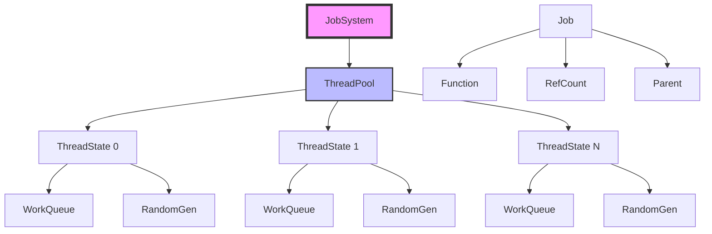
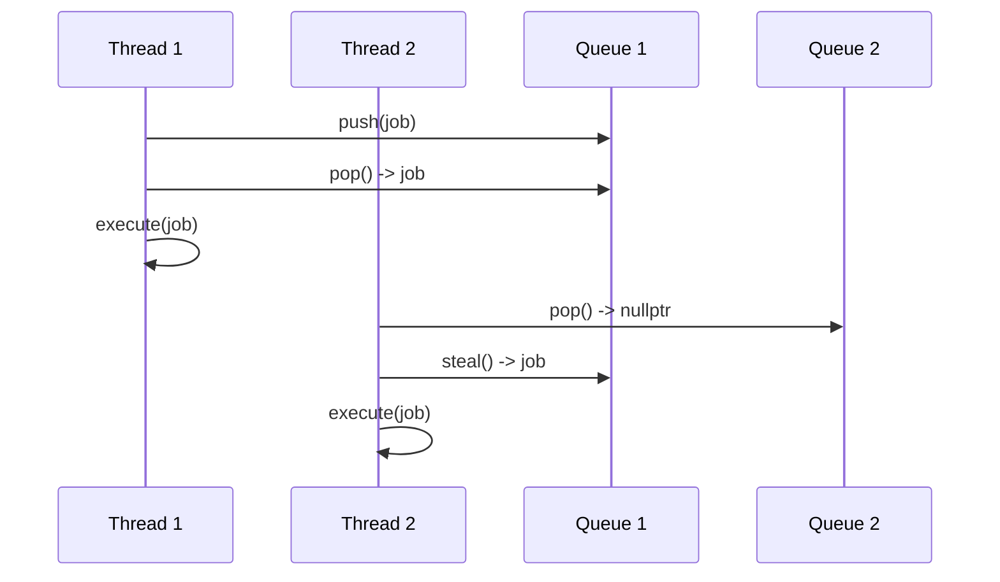

# Filament 线程池管理架构完整分析

## 目录
1. [概述](#概述)
2. [架构设计](#架构设计)
3. [JobSystem 核心](#jobsystem-核心)
4. [工作窃取算法](#工作窃取算法)
5. [线程管理](#线程管理)
6. [Job 调度](#job-调度)
7. [并行执行](#并行执行)
8. [性能优化](#性能优化)
9. [使用示例](#使用示例)

---

## 概述

Filament 使用基于工作窃取（Work-Stealing）算法的线程池系统来管理多线程任务执行。JobSystem 是 Filament 多线程调度的核心，提供了高效的并行任务执行机制。

### 核心特性
- **工作窃取算法**：每个线程有自己的队列，空闲时从其他线程窃取任务
- **自动线程数检测**：根据 CPU 核心数自动配置线程池大小
- **无锁设计**：使用原子操作和内存屏障实现无锁同步
- **任务依赖管理**：支持任务之间的依赖关系
- **并行循环**：提供 `parallel_for` 用于并行化循环

---

## 架构设计

### 架构图



### 类层次结构

```
JobSystem
  ├── ThreadState (每个线程的状态)
  │   ├── WorkStealingDequeue (工作队列)
  │   ├── RandomGen (随机数生成器)
  │   └── Thread (std::thread)
  │
  └── Job (任务对象)
      ├── Function (任务函数)
      ├── RefCount (引用计数)
      └── Parent (父任务)
```

---

## JobSystem 核心

### JobSystem 初始化

```cpp
JobSystem::JobSystem(const size_t userThreadCount, 
                     const size_t adoptableThreadsCount) {
    // 1. 计算线程池大小
    unsigned int threadPoolCount = userThreadCount;
    if (threadPoolCount == 0) {
        // 自动检测线程数
        unsigned int hwThreads = std::thread::hardware_concurrency();
        if (UTILS_HAS_HYPER_THREADING) {
            // 避免使用超线程，简化性能分析
            hwThreads = (hwThreads + 1) / 2;
        }
        // 主线程占用一个核心，所以工作线程数 = 总核心数 - 1
        threadPoolCount = hwThreads - 1;
    }
    // 确保至少有一个工作线程
    threadPoolCount = std::max(1u, threadPoolCount);
    // 限制最大线程数为 32
    threadPoolCount = std::min(32u, threadPoolCount);
    
    // 2. 初始化线程状态
    mThreadStates = aligned_vector<ThreadState>(
        threadPoolCount + adoptableThreadsCount
    );
    mThreadCount = uint16_t(threadPoolCount);
    
    // 3. 计算并行分割次数
    mParallelSplitCount = (uint8_t)std::ceil(
        std::log2f(threadPoolCount + adoptableThreadsCount)
    );
    
    // 4. 创建工作线程
    for (size_t i = 0; i < threadPoolCount; i++) {
        auto& state = mThreadStates[i];
        state.rndGen = default_random_engine(rd());
        state.js = this;
        state.thread = std::thread(&JobSystem::loop, this, &state);
    }
}
```

### 关键字段

```cpp
class JobSystem {
    // Job 对象池
    LinearAllocatorArena mJobPool;
    Job* mJobStorageBase;
    
    // 线程状态数组
    aligned_vector<ThreadState> mThreadStates;
    uint16_t mThreadCount;
    
    // 并行分割次数（用于 parallel_for）
    uint8_t mParallelSplitCount;
    
    // 同步原语
    std::atomic<bool> mExitRequested;
    std::atomic<uint32_t> mActiveJobs;
    Mutex mWaiterLock;
    Condition mWaiterCondition;
    
    // 线程映射表（用于 adopt 机制）
    std::unordered_map<std::thread::id, ThreadState*> mThreadMap;
    Mutex mThreadMapLock;
};
```

---

## 工作窃取算法

### WorkStealingDequeue

每个线程维护一个双端队列（Dequeue），支持：
- **Push**：从底部推入（当前线程使用）
- **Pop**：从底部弹出（当前线程使用）
- **Steal**：从顶部窃取（其他线程使用）

```cpp
class WorkStealingDequeue {
    static constexpr size_t MASK = SIZE - 1;
    std::atomic<Job*> mJobs[SIZE];
    std::atomic<size_t> mBottom;
    std::atomic<size_t> mTop;
    
    // 从底部推入（当前线程）
    void push(Job* job) {
        size_t b = mBottom.load();
        mJobs[b & MASK] = job;
        mBottom.store(b + 1, std::memory_order_release);
    }
    
    // 从底部弹出（当前线程）
    Job* pop() {
        size_t b = mBottom.load() - 1;
        mBottom.store(b);
        size_t t = mTop.load();
        if (t <= b) {
            // 队列不为空
            Job* job = mJobs[b & MASK];
            if (t != b) {
                // 还有更多任务
                return job;
            }
            // 最后一个任务，检查竞争
            if (mTop.compare_exchange_strong(t, t + 1)) {
                return job;
            }
            // 被窃取，返回 nullptr
            mBottom.store(b + 1);
            return nullptr;
        } else {
            // 队列为空
            mBottom.store(t);
            return nullptr;
        }
    }
    
    // 从顶部窃取（其他线程）
    Job* steal() {
        size_t t = mTop.load();
        size_t b = mBottom.load();
        if (t < b) {
            // 队列不为空
            Job* job = mJobs[t & MASK];
            if (mTop.compare_exchange_strong(t, t + 1)) {
                return job;
            }
            // 竞争失败，返回 nullptr
            return nullptr;
        }
        // 队列为空
        return nullptr;
    }
};
```

### 工作窃取流程



---

## 线程管理

### 线程状态

```cpp
struct ThreadState {
    JobSystem* js;                      // JobSystem 指针
    WorkStealingDequeue queue;         // 工作队列
    default_random_engine rndGen;      // 随机数生成器（用于工作窃取）
    std::thread thread;                // 线程对象（如果是 adoptable，则为空）
    std::atomic<bool> running;         // 运行标志
};
```

### 工作线程主循环

```cpp
void JobSystem::loop(ThreadState* state) {
    // 1. 设置线程属性
    setThreadName("JobSystem::loop");
    setThreadPriority(Priority::DISPLAY);
    
    // 2. 注册线程到映射表
    std::unique_lock lock(mThreadMapLock);
    mThreadMap.emplace(std::this_thread::get_id(), state);
    lock.unlock();
    
    // 3. 主循环
    do {
        if (!execute(*state)) {
            // 队列为空，进入等待状态
            std::unique_lock lock(mWaiterLock);
            while (!exitRequested() && !hasActiveJobs()) {
                wait(lock);  // 等待条件变量通知
            }
        }
    } while (!exitRequested());
}
```

### 线程执行任务

```cpp
bool JobSystem::execute(ThreadState& state) {
    Job* job = state.queue.pop();
    if (job) {
        // 执行任务
        run(job);
        return true;
    }
    
    // 队列为空，尝试从其他线程窃取
    const size_t threadCount = mThreadCount;
    const size_t index = state.rndGen() % threadCount;
    
    for (size_t i = 0; i < threadCount; i++) {
        size_t victimIndex = (index + i) % threadCount;
        ThreadState& victim = mThreadStates[victimIndex];
        
        if (&victim != &state) {
            job = victim.queue.steal();
            if (job) {
                run(job);
                return true;
            }
        }
    }
    
    return false;  // 没有任务可执行
}
```

---

## Job 调度

### Job 结构

```cpp
struct Job {
    JobFunction function;               // 任务函数
    std::atomic<uint32_t> runningJobCount; // 运行中的子任务计数
    Job* parent;                        // 父任务
    std::atomic<uint16_t> refCount;    // 引用计数
};
```

### 创建和提交 Job

```cpp
Job* JobSystem::create(JobSystem* js, JobFunction func, Job* parent) {
    Job* job = js->mJobPool.alloc<Job>();
    job->function = func;
    job->parent = parent;
    job->refCount.store(1, std::memory_order_relaxed);
    job->runningJobCount.store(1, std::memory_order_relaxed);
    return job;
}

void JobSystem::run(Job* job) {
    // 执行任务函数
    job->function(job, this);
    
    // 通知父任务完成
    finish(job);
}

void JobSystem::finish(Job* job) {
    // 减少运行计数
    uint32_t runningCount = job->runningJobCount.fetch_sub(1);
    
    if (runningCount == 1) {
        // 所有子任务完成
        if (job->parent) {
            finish(job->parent);  // 递归通知父任务
        }
        decRef(job);  // 减少引用计数
    }
}
```

### 等待 Job 完成

```cpp
void JobSystem::wait(Job* job) {
    ThreadState* state = getState();
    
    while (!hasJobCompleted(job)) {
        // 尝试执行其他任务
        if (!execute(*state)) {
            // 没有任务，等待
            std::unique_lock lock(mWaiterLock);
            wait(lock, job);
        }
    }
}

bool JobSystem::hasJobCompleted(Job* job) {
    return (job->runningJobCount.load(std::memory_order_acquire) & 
            JOB_COUNT_MASK) == 0;
}
```

---

## 并行执行

### parallel_for

`parallel_for` 用于并行化循环，自动将循环分割成多个任务。

```cpp
template<typename T>
void JobSystem::parallel_for(JobSystem& js, Job* parent,
        size_t first, size_t last, size_t stride,
        const T& functor, size_t minSplitSize) {
    
    const size_t count = last - first;
    if (count < minSplitSize) {
        // 任务太小，直接执行
        for (size_t i = first; i < last; i += stride) {
            functor(i);
        }
        return;
    }
    
    // 分割任务
    const size_t mid = first + count / 2;
    
    // 创建左半部分任务
    Job* left = create(&js, [&, first, mid, stride, &functor](Job*, JobSystem*) {
        parallel_for(js, parent, first, mid, stride, functor, minSplitSize);
    }, parent);
    
    // 创建右半部分任务
    Job* right = create(&js, [&, mid, last, stride, &functor](Job*, JobSystem*) {
        parallel_for(js, parent, mid, last, stride, functor, minSplitSize);
    }, parent);
    
    // 提交任务
    run(left);
    run(right);
}
```

### 并行分割策略

```cpp
// 计算最大分割深度
uint8_t mParallelSplitCount = std::ceil(
    std::log2f(threadCount)
);

// 限制分割深度
template<typename T>
void parallel_for(..., size_t maxDepth) {
    if (maxDepth == 0) {
        // 达到最大深度，直接执行
        for (size_t i = first; i < last; i += stride) {
            functor(i);
        }
        return;
    }
    
    // 继续分割
    parallel_for(..., maxDepth - 1);
}
```

---

## 性能优化

### 1. 无锁设计
- 使用原子操作和内存屏障实现无锁同步
- 减少锁竞争，提高性能

### 2. 工作窃取
- 每个线程优先处理自己的任务
- 空闲时从其他线程窃取任务，提高 CPU 利用率

### 3. 缓存友好
- 每个线程的工作队列使用缓存行对齐
- 减少 false sharing

### 4. 任务分割
- `parallel_for` 自动分割任务
- 避免任务过小导致的开销

### 5. 线程数优化
- 自动检测 CPU 核心数
- 避免超线程，简化性能分析
- 限制最大线程数，避免过度并行化

---

## 使用示例

### 基本任务提交

```cpp
// 获取 JobSystem
JobSystem& js = engine->getJobSystem();

// 创建任务
Job* job = js.createJob([](Job*, JobSystem*) {
    // 任务代码
    doWork();
});

// 提交任务
js.run(job);

// 等待完成
js.wait(job);
```

### 并行循环

```cpp
// 并行处理数组
std::vector<int> data(1000);

js.parallel_for(js, nullptr, 0, data.size(), 1,
    [&data](size_t i) {
        data[i] = process(data[i]);
    }
);
```

### 任务依赖

```cpp
// 创建父任务
Job* parent = js.createJob([](Job*, JobSystem*) {
    // 父任务代码
});

// 创建子任务
Job* child1 = js.createJob([](Job*, JobSystem*) {
    // 子任务 1
}, parent);

Job* child2 = js.createJob([](Job*, JobSystem*) {
    // 子任务 2
}, parent);

// 提交子任务
js.run(child1);
js.run(child2);

// 等待父任务完成（所有子任务完成后）
js.wait(parent);
```

### adopt 机制

```cpp
// 外部线程加入 JobSystem
JobSystem& js = engine->getJobSystem();
js.adopt();

// 现在可以在这个线程中执行任务
Job* job = js.createJob([](Job*, JobSystem*) {
    // 任务代码
});
js.run(job);
js.wait(job);

// 离开 JobSystem
js.emancipate();
```

---

## 总结

Filament 的线程池管理系统提供了高效的多线程任务执行：

1. **工作窃取算法**：每个线程有自己的队列，空闲时从其他线程窃取任务
2. **自动线程数检测**：根据 CPU 核心数自动配置线程池大小
3. **无锁设计**：使用原子操作实现无锁同步，提高性能
4. **任务依赖管理**：支持任务之间的依赖关系
5. **并行循环**：提供 `parallel_for` 用于并行化循环
6. **adopt 机制**：允许外部线程加入 JobSystem

这些机制使得 Filament 能够充分利用多核 CPU，实现高效的并行计算。

