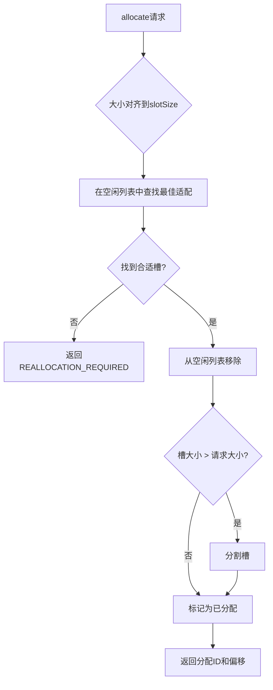
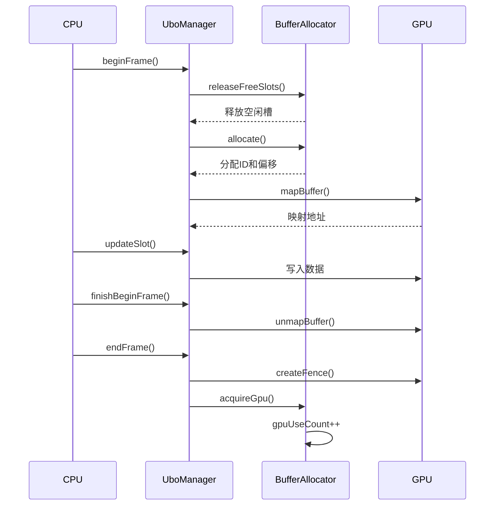
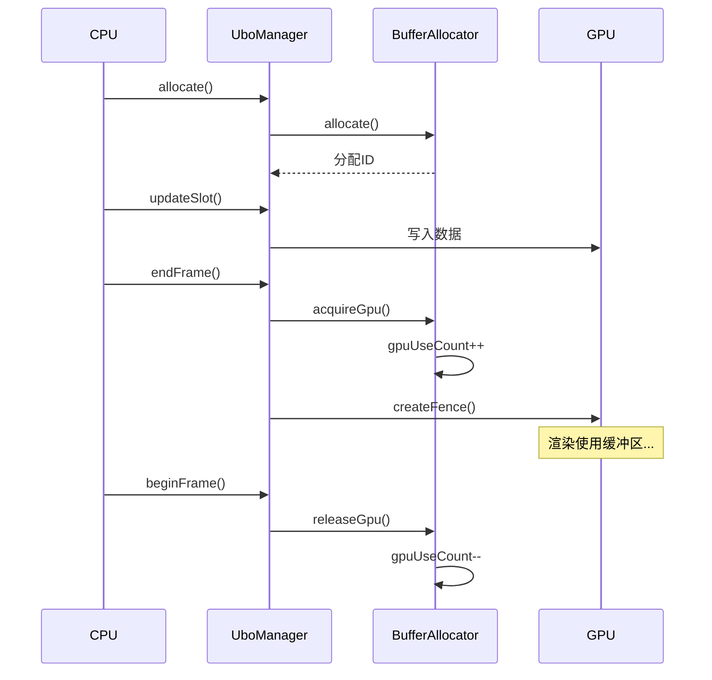
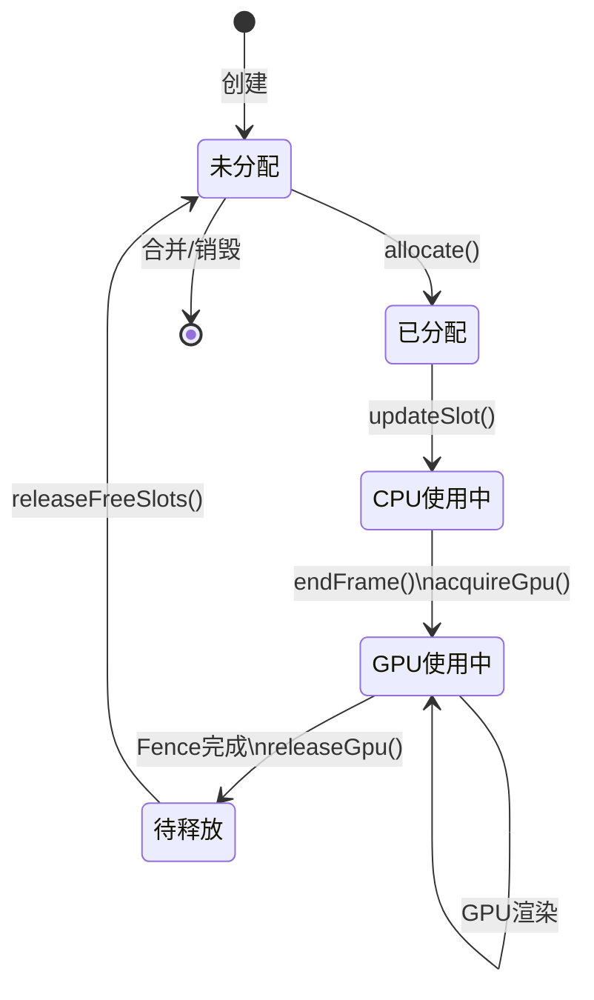
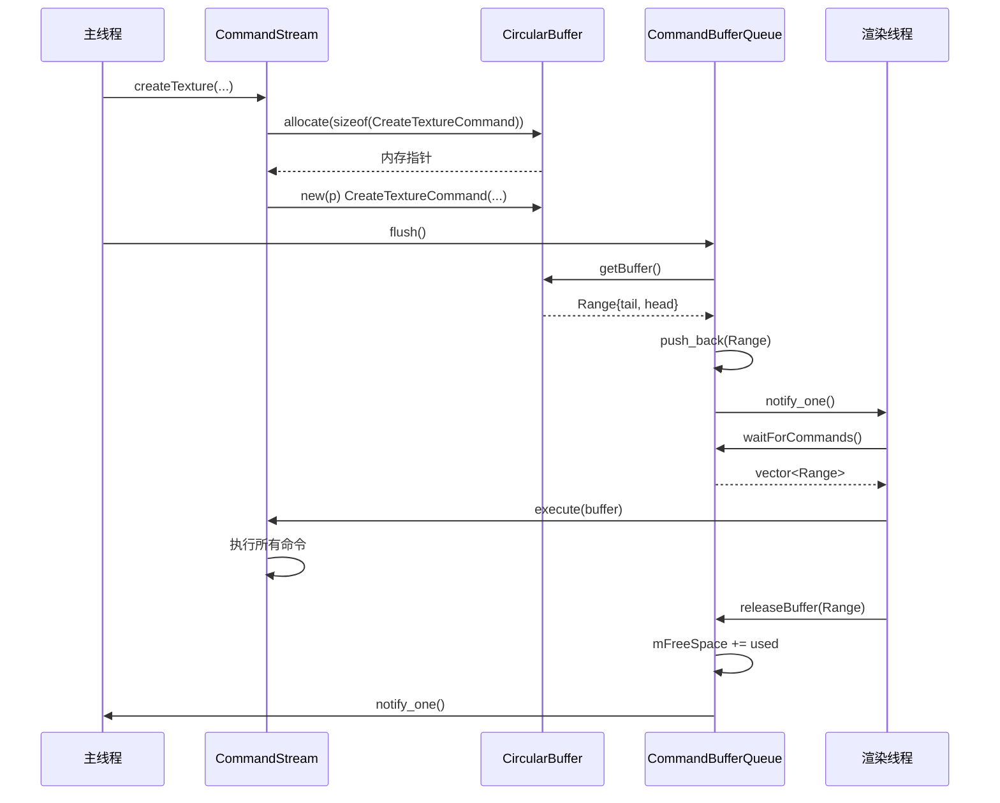
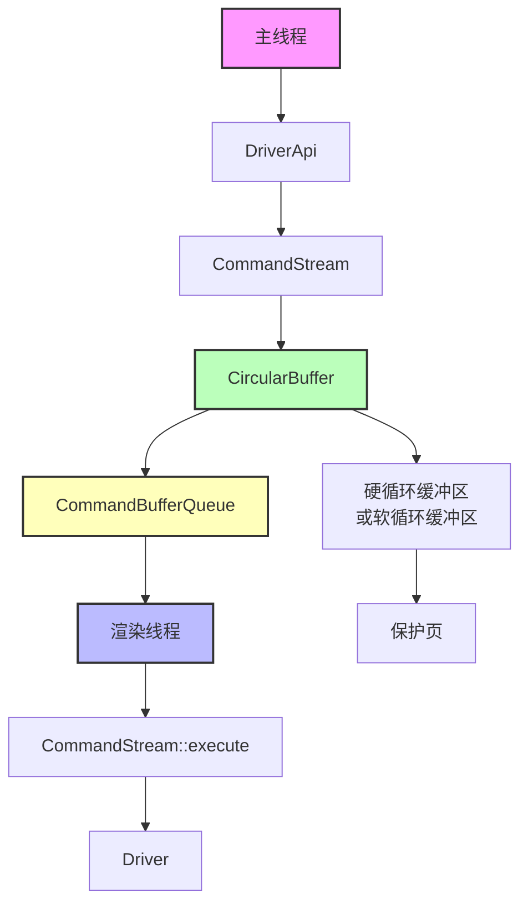
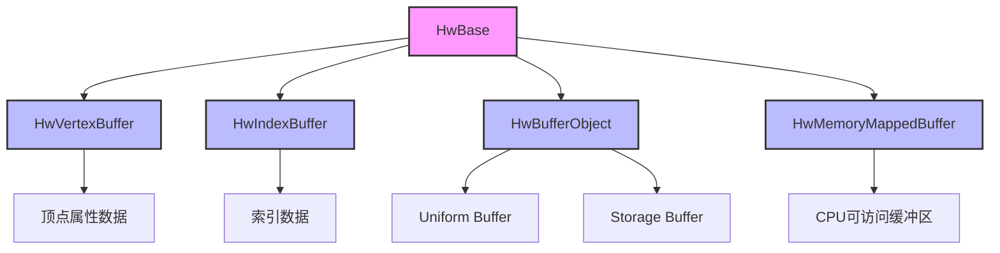
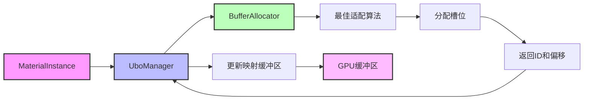
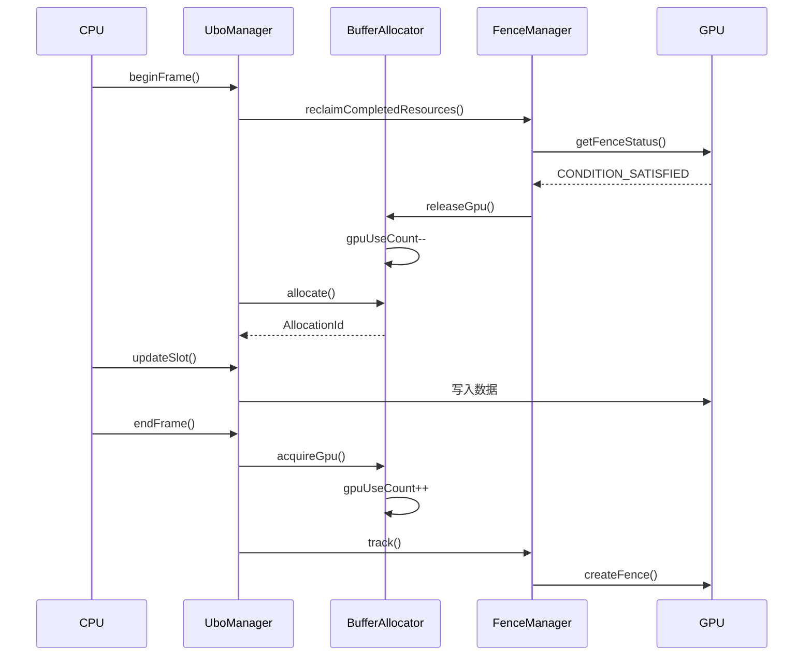
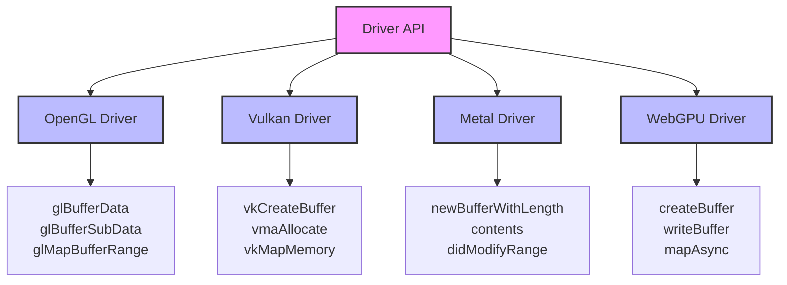

# Filament 缓冲区架构完整分析

## 目录
1. [概述](#概述)
2. [缓冲区类型体系](#缓冲区类型体系)
3. [缓冲区分配策略](#缓冲区分配策略)
4. [缓冲区更新机制](#缓冲区更新机制)
5. [缓冲区同步与生命周期](#缓冲区同步与生命周期)
6. [环形缓冲区（命令缓冲区）](#环形缓冲区命令缓冲区)
7. [后端实现差异](#后端实现差异)
8. [性能优化策略](#性能优化策略)
9. [架构图](#架构图)

---

## 概述

Filament 的缓冲区架构提供了统一的 GPU 缓冲区管理接口，支持多种缓冲区类型（顶点、索引、Uniform、Storage 等），并实现了高效的分配、更新和同步机制。

### 核心设计原则

1. **统一抽象**：通过 Driver API 抽象不同后端的缓冲区实现
2. **高效分配**：使用最佳适配算法和槽合并减少内存碎片
3. **延迟释放**：通过 GPU 使用计数和 Fence 机制实现安全的延迟释放
4. **异步更新**：支持同步和异步两种更新方式，优化性能

### 关键组件

- **BufferAllocator**：UBO 槽位分配器，使用最佳适配算法
- **UboManager**：统一缓冲区管理器，管理 MaterialInstance 的 UBO 分配
- **FenceManager**：栅栏管理器，跟踪 GPU 资源使用
- **后端驱动**：OpenGL/Vulkan/Metal/WebGPU 的具体实现

---

## 缓冲区类型体系

### 1. 顶点缓冲区（VertexBuffer）

**定义**：存储顶点属性数据（位置、法线、切线、UV 等）

**特性**：
- 支持多个缓冲区（最多 8 个）
- 支持属性交错存储（interleaved）
- 支持 BufferObject 模式（共享缓冲区）

**数据结构**：

```cpp
struct HwVertexBuffer : public HwBase {
    uint32_t vertexCount{};               // 顶点数量
    uint8_t bufferObjectsVersion{0xff};   // 缓冲区对象版本号
    bool padding[3]{};
};
```

**使用示例**：

```cpp
VertexBuffer::Builder()
    .bufferCount(1)                    // 1 个缓冲区
    .vertexCount(vertexCount)           // 顶点数量
    .attribute(VertexAttribute::POSITION, 0, 
               VertexBuffer::AttributeType::FLOAT3, 0, 0)
    .attribute(VertexAttribute::COLOR, 0,
               VertexBuffer::AttributeType::FLOAT4, 12, 0)
    .build(engine);
```

**属性布局**：
- 支持交错存储：多个属性可以在同一个缓冲区中交错
- 步长对齐：属性偏移和步长必须是 4 的倍数
- 归一化：整数类型可以自动归一化到 [0, 1]

### 2. 索引缓冲区（IndexBuffer）

**定义**：存储顶点索引数据，定义图元的连接方式

**特性**：
- 支持 16 位（USHORT）或 32 位（UINT）索引
- 最大索引数：2^27 = 134,217,728

**数据结构**：

```cpp
struct HwIndexBuffer : public HwBase {
    uint32_t count : 27;      // 索引数量
    uint32_t elementSize : 5; // 元素大小（2 或 4 字节）
};
```

**使用示例**：

```cpp
IndexBuffer::Builder()
    .indexCount(indexCount)
    .bufferType(IndexBuffer::IndexType::USHORT)
    .build(engine);
```

### 3. 缓冲区对象（BufferObject）

**定义**：通用的 GPU 缓冲区，用于 Uniform Buffer、Storage Buffer 等

**绑定类型**：
- `VERTEX`：顶点缓冲区
- `UNIFORM`：Uniform Buffer（UBO）
- `SHADER_STORAGE`：Shader Storage Buffer（SSBO）

**使用方式**：
- `STATIC`：静态数据，很少更新
- `DYNAMIC`：动态数据，频繁更新
- `STREAM`：流式数据，每帧更新

**数据结构**：

```cpp
struct HwBufferObject : public HwBase {
    uint32_t byteCount{};  // 缓冲区大小（字节）
};
```

### 4. 内存映射缓冲区（MemoryMappedBuffer）

**定义**：CPU 可直接访问的 GPU 缓冲区

**用途**：
- UBO 的 CPU 端写入
- 频繁更新的动态数据
- 零拷贝数据传输（UMA 架构）

**特性**：
- 支持 CPU 直接写入
- 需要手动同步（flush/invalidate）
- 在某些后端（如 Vulkan）需要特殊处理

---

## 缓冲区分配策略

### 1. BufferAllocator（UBO 槽位分配器）

**设计目标**：
- 在共享 UBO 中高效分配槽位
- 最小化内存碎片
- 支持动态调整大小

**核心算法**：最佳适配（Best-Fit）

**数据结构**：

```cpp
struct Slot {
    const allocation_size_t offset;  // 偏移量
    allocation_size_t slotSize;      // 槽大小
    bool isAllocated;                // 是否已分配
    uint32_t gpuUseCount;            // GPU 使用计数
};
```

**分配流程**：



**槽合并机制**：

```cpp
void BufferAllocator::releaseFreeSlots() {
    // 遍历所有槽
    for (auto curr = mSlotPool.begin(); curr != mSlotPool.end();) {
        if (!curr->slot.isFree()) {
            ++curr;
            continue;
        }
        
        // 合并连续的空闲槽
        auto next = std::next(curr);
        while (next != mSlotPool.end() && next->slot.isFree()) {
            curr->slot.slotSize += next->slot.slotSize;
            // 从映射中移除被合并的槽
            mFreeList.erase(next->freeListIterator);
            mOffsetMap.erase(next->offsetMapIterator);
            next = mSlotPool.erase(next);
        }
        
        // 更新空闲列表
        if (curr->freeListIterator != mFreeList.end()) {
            mFreeList.erase(curr->freeListIterator);
        }
        curr->freeListIterator = mFreeList.emplace(
            curr->slot.slotSize, &(*curr));
        
        curr = next;
    }
}
```

**关键特性**：
- **对齐要求**：所有分配必须对齐到 `slotSize`（通常是 256 字节）
- **GPU 使用计数**：跟踪槽是否正在被 GPU 使用
- **延迟释放**：只有在 CPU 和 GPU 都不使用时才释放

### 2. UboManager（统一缓冲区管理器）

**职责**：
- 管理 MaterialInstance 的 UBO 分配
- 动态调整 UBO 大小
- 处理帧间同步

**生命周期管理**：



**动态调整大小**：

```cpp
void UboManager::reallocate(DriverApi& driver, 
                             allocation_size_t requiredSize) {
    // 计算新大小（增长 1.5 倍）
    allocation_size_t newSize = 
        mUboSize * BUFFER_SIZE_GROWTH_MULTIPLIER;
    newSize = std::max(newSize, requiredSize);
    newSize = alignUp(newSize, mAllocator.getSlotSize());
    
    // 创建新的缓冲区
    mUbHandle = driver.createBufferObject(
        newSize, BufferObjectBinding::UNIFORM, 
        BufferUsage::DYNAMIC);
    
    // 创建内存映射缓冲区
    mMemoryMappedBufferHandle = driver.createMemoryMappedBuffer(
        mUbHandle);
    
    // 重置分配器
    mAllocator.reset(newSize);
    mUboSize = newSize;
}
```

### 3. 分配策略对比

| 策略 | 优点 | 缺点 | 适用场景 |
|------|------|------|----------|
| **最佳适配** | 减少碎片 | 查找开销 | UBO 槽位分配 |
| **首次适配** | 查找快速 | 碎片较多 | 简单场景 |
| **最差适配** | 保留大块 | 浪费空间 | 特殊需求 |

Filament 使用**最佳适配**策略，因为：
- UBO 槽位大小相对固定
- 碎片化是主要问题
- 查找开销可接受

---

## 缓冲区更新机制

### 1. 同步更新（updateBufferObject）

**实现**：直接调用驱动 API 更新缓冲区

**OpenGL 实现**：

```cpp
void OpenGLDriver::updateBufferObject(
        Handle<HwBufferObject> boh, 
        BufferDescriptor&& bd, 
        uint32_t byteOffset) {
    GLBufferObject* bo = handle_cast<GLBufferObject*>(boh);
    
    gl.bindBuffer(bo->gl.binding, bo->gl.id);
    
    if (byteOffset == 0 && bd.size == bo->byteCount) {
        // 更新整个缓冲区：使用 glBufferData（通常更快）
        glBufferData(bo->gl.binding, bd.size, bd.buffer, 
                     getBufferUsage(bo->usage));
    } else {
        // 部分更新：使用 glBufferSubData
        glBufferSubData(bo->gl.binding, byteOffset, 
                        bd.size, bd.buffer);
    }
    
    // 调度销毁缓冲区描述符（异步释放 CPU 内存）
    scheduleDestroy(std::move(bd));
}
```

**特点**：
- 阻塞 CPU，等待数据传输完成
- 适用于不频繁更新的数据
- 简单可靠

### 2. 异步更新（updateBufferObjectUnsynchronized）

**实现**：使用内存映射异步更新

**OpenGL 实现**：

```cpp
void OpenGLDriver::updateBufferObjectUnsynchronized(
        Handle<HwBufferObject> boh,
        BufferDescriptor&& bd,
        uint32_t byteOffset) {
    GLBufferObject* bo = handle_cast<GLBufferObject*>(boh);
    
    if (bo->gl.binding != GL_UNIFORM_BUFFER) {
        // 当前只支持 uniform 缓冲区
        updateBufferObject(boh, std::move(bd), byteOffset);
        return;
    }
    
    gl.bindBuffer(bo->gl.binding, bo->gl.id);
    
retry:
    // 映射缓冲区范围（不阻塞）
    void* vaddr = glMapBufferRange(bo->gl.binding, byteOffset, bd.size,
            GL_MAP_WRITE_BIT |
            GL_MAP_INVALIDATE_RANGE_BIT |
            GL_MAP_UNSYNCHRONIZED_BIT);
    
    if (vaddr) {
        // 复制数据到映射内存
        memcpy(vaddr, bd.buffer, bd.size);
        
        // 取消映射（如果失败，重试）
        if (glUnmapBuffer(bo->gl.binding) == GL_FALSE) {
            goto retry;
        }
    } else {
        // 映射失败，回退到同步更新
        glBufferSubData(bo->gl.binding, byteOffset, 
                        bd.size, bd.buffer);
    }
    
    scheduleDestroy(std::move(bd));
}
```

**特点**：
- 不阻塞 CPU
- 使用 `GL_MAP_UNSYNCHRONIZED_BIT` 避免同步
- 适用于频繁更新的数据（如每帧更新的 UBO）

### 3. 内存映射更新（MemoryMappedBuffer）

**实现**：CPU 直接写入映射内存

**UboManager 使用**：

```cpp
void UboManager::beginFrame(DriverApi& driver) {
    // 回收已完成的资源
    mFenceManager.reclaimCompletedResources(driver,
        [this](AllocationId id) {
            mAllocator.releaseGpu(id);
        });
    
    // 释放空闲槽
    mAllocator.releaseFreeSlots();
    
    // 分配新槽
    allocateAllInstances();
    
    // 映射缓冲区到 CPU
    void* mapped = driver.mapMemoryMappedBuffer(
        mMemoryMappedBufferHandle);
    
    // 保存映射地址（用于后续写入）
    mMappedBuffer = static_cast<uint8_t*>(mapped);
}

void UboManager::updateSlot(DriverApi& driver, 
                             AllocationId id,
                             BufferDescriptor bufferDescriptor) const {
    allocation_size_t offset = getAllocationOffset(id);
    
    // 直接写入映射内存
    memcpy(mMappedBuffer + offset, 
           bufferDescriptor.buffer, 
           bufferDescriptor.size);
}
```

**优势**：
- 零拷贝（UMA 架构）
- CPU 直接写入，无需驱动调用
- 适合频繁更新的小数据

### 4. 更新策略选择

| 更新方式 | 适用场景 | 性能 | 复杂度 |
|----------|----------|------|--------|
| **同步更新** | 静态/不频繁更新 | 中等 | 低 |
| **异步更新** | 频繁更新（每帧） | 高 | 中 |
| **内存映射** | 频繁更新小数据 | 最高 | 高 |

---

## 缓冲区同步与生命周期

### 1. GPU 使用计数

**目的**：跟踪缓冲区槽是否正在被 GPU 使用

**实现**：

```cpp
void BufferAllocator::acquireGpu(AllocationId id) {
    InternalSlotNode* node = getNodeById(id);
    node->slot.gpuUseCount++;  // 增加计数
}

void BufferAllocator::releaseGpu(AllocationId id) {
    InternalSlotNode* node = getNodeById(id);
    node->slot.gpuUseCount--;  // 减少计数
    
    if (node->slot.gpuUseCount == 0 && !node->slot.isAllocated) {
        mHasPendingFrees = true;  // 标记有待释放的槽
    }
}
```

**使用流程**：



### 2. Fence 机制

**目的**：确定 GPU 何时完成对资源的使用

**FenceManager 实现**：

```cpp
class FenceManager {
    using FenceAndAllocations = 
        std::pair<Handle<HwFence>, AllocationIdContainer>;
    std::vector<FenceAndAllocations> mFenceAllocationList;
    
public:
    void track(DriverApi& driver, 
               AllocationIdContainer&& allocationIds) {
        // 创建栅栏
        Handle<HwFence> fence = driver.createFence();
        
        // 关联分配 ID
        mFenceAllocationList.emplace_back(
            std::move(fence), 
            std::move(allocationIds));
    }
    
    void reclaimCompletedResources(DriverApi& driver,
            std::function<void(AllocationId)> const& onReclaimed) {
        for (auto it = mFenceAllocationList.begin(); 
             it != mFenceAllocationList.end();) {
            FenceStatus status = driver.getFenceStatus(it->first);
            
            if (status == FenceStatus::CONDITION_SATISFIED) {
                // 栅栏已完成，回收资源
                for (const AllocationId& id : it->second) {
                    onReclaimed(id);
                }
                driver.destroyFence(std::move(it->first));
                it = mFenceAllocationList.erase(it);
            } else {
                ++it;
            }
        }
    }
};
```

**工作流程**：

1. **帧结束**：创建 Fence 并关联分配 ID
2. **下一帧开始**：检查 Fence 状态
3. **Fence 完成**：回收资源，减少 GPU 使用计数
4. **释放空闲槽**：在 `releaseFreeSlots()` 中释放

### 3. 延迟释放策略

**原因**：
- GPU 异步执行，资源可能仍在使用
- 过早释放会导致数据竞争

**实现**：

```cpp
void BufferAllocator::retire(AllocationId id) {
    InternalSlotNode* node = getNodeById(id);
    node->slot.isAllocated = false;  // 标记为未分配
    
    // 不立即释放，等待 GPU 使用计数归零
    if (node->slot.gpuUseCount == 0) {
        mHasPendingFrees = true;  // 标记有待释放
    }
}

void BufferAllocator::releaseFreeSlots() {
    if (!mHasPendingFrees) {
        return;  // 没有待释放的槽
    }
    
    // 只释放既不被 CPU 也不被 GPU 使用的槽
    for (auto curr = mSlotPool.begin(); curr != mSlotPool.end();) {
        if (curr->slot.isFree()) {  // isFree = !isAllocated && gpuUseCount == 0
            // 合并连续的空闲槽
            // ...
        }
        ++curr;
    }
    
    mHasPendingFrees = false;
}
```

### 4. 生命周期图



---

## 环形缓冲区（命令缓冲区）

### 概述

Filament 使用**环形缓冲区（CircularBuffer）**作为命令缓冲区，用于在主线程和渲染线程之间传递渲染命令。这是 Filament 多线程架构的核心组件。

### 设计目标

1. **零拷贝**：主线程直接写入，渲染线程直接读取
2. **无锁设计**：通过环形缓冲区实现无锁的生产者-消费者模式
3. **高效内存利用**：循环使用缓冲区，避免频繁分配/释放
4. **溢出检测**：通过保护页检测缓冲区溢出

### CircularBuffer 架构

#### 1. 硬循环缓冲区（Hard Circular Buffer）

**原理**：使用 `mmap` 将同一块物理内存映射到两个连续的虚拟地址范围

```cpp
// 布局示例（硬循环缓冲区）
// Virtual Address Space:
//   [Data Copy 1] [Data Copy 2] [Guard Page]
//         |             |
//         +-------------+
//              |
//         Physical Memory (同一块内存)
```

**实现**：

```cpp
void* CircularBuffer::alloc(size_t size) {
    // 1. 创建 ashmem 共享内存区域
    int fd = ashmem_create_region("filament::CircularBuffer", size);
    
    // 2. 映射第一个副本
    void* vaddr = mmap(nullptr, size, PROT_READ | PROT_WRITE, 
                       MAP_PRIVATE, fd, 0);
    
    // 3. 映射第二个副本（"影子"）
    void* vaddr_shadow = mmap((char*)vaddr + size, size,
                              PROT_READ | PROT_WRITE, MAP_PRIVATE, fd, 0);
    
    // 4. 映射保护页（检测溢出）
    void* guard = mmap((char*)vaddr_shadow + size, BLOCK_SIZE, PROT_NONE,
                       MAP_PRIVATE, fd, size);
    
    return vaddr;
}
```

**优势**：
- 真正的循环：两个副本映射到同一物理内存
- 无需特殊处理：写入第一个副本，自动反映到第二个副本
- 零拷贝：主线程和渲染线程共享同一物理内存

#### 2. 软循环缓冲区（Soft Circular Buffer）

**原理**：如果无法创建硬循环缓冲区，使用两个独立的缓冲区

```cpp
// 布局示例（软循环缓冲区）
// Virtual Address Space:
//   [Buffer 1] [Buffer 2] [Guard Page]
//        |         |
//   Physical Memory (两块独立内存)
```

**实现**：

```cpp
void* CircularBuffer::alloc(size_t size) {
    // 分配两个缓冲区 + 保护页
    void* data = mmap(nullptr, size * 2 + BLOCK_SIZE,
                     PROT_READ | PROT_WRITE, 
                     MAP_PRIVATE | MAP_ANONYMOUS, -1, 0);
    
    // 设置保护页
    void* guard = (void*)(uintptr_t(data) + size * 2);
    mprotect(guard, BLOCK_SIZE, PROT_NONE);
    
    return data;
}
```

**特点**：
- 需要特殊处理：当 head 超过第一个缓冲区时，需要重置到开头
- 需要复制：如果命令跨越边界，需要复制到第二个缓冲区

#### 3. 循环化处理

```cpp
CircularBuffer::Range CircularBuffer::getBuffer() noexcept {
    Range range{ .tail = mTail, .head = mHead };
    
    char* pData = static_cast<char*>(mData);
    char const* pEnd = pData + mSize;
    char const* pHead = static_cast<char const*>(mHead);
    
    // 检查 head 是否超过第一个副本的末尾
    if (pHead >= pEnd) {
        size_t overflow = pHead - pEnd;
        
        if (mAshmemFd > 0) {
            // 硬循环：将 head 循环到第二个副本
            mHead = static_cast<void*>(pData + overflow);
        } else {
            // 软循环：将 head 重置到开头
            mHead = mData;
        }
    }
    
    mTail = mHead;  // 准备下一轮写入
    return range;
}
```

### CommandBufferQueue（命令缓冲区队列）

#### 职责

1. **管理命令缓冲区**：管理多个命令缓冲区的执行队列
2. **同步**：协调主线程和渲染线程的同步
3. **空间管理**：跟踪空闲空间，防止溢出

#### 数据结构

```cpp
class CommandBufferQueue {
    CircularBuffer mCircularBuffer;           // 环形缓冲区
    std::vector<Range> mCommandBuffersToExecute;  // 待执行的命令缓冲区
    size_t mFreeSpace;                        // 空闲空间
    size_t mRequiredSize;                    // 所需的最小空间
    mutable std::mutex mLock;                 // 互斥锁
    std::condition_variable mCondition;       // 条件变量
    bool mPaused;                             // 是否暂停
    std::atomic<uint32_t> mExitRequested;     // 退出标志
};
```

#### 工作流程



#### flush() 实现

```cpp
void CommandBufferQueue::flush() {
    CircularBuffer& circularBuffer = mCircularBuffer;
    if (circularBuffer.empty()) {
        return;  // 缓冲区为空，无需刷新
    }
    
    // 1. 添加终止命令
    new(circularBuffer.allocate(sizeof(NoopCommand))) NoopCommand(nullptr);
    
    // 2. 获取当前缓冲区范围
    auto const [begin, end] = circularBuffer.getBuffer();
    
    // 3. 计算使用的空间
    size_t used = std::distance(
        static_cast<char const*>(begin), 
        static_cast<char const*>(end));
    
    std::unique_lock lock(mLock);
    
    // 4. 检查溢出
    FILAMENT_CHECK_POSTCONDITION(used <= mFreeSpace)
        << "CommandStream overflow!";
    
    // 5. 更新空闲空间并添加到执行队列
    mFreeSpace -= used;
    mCommandBuffersToExecute.push_back({ begin, end });
    mCondition.notify_one();  // 通知渲染线程
    
    // 6. 如果空闲空间不足，等待
    if (mFreeSpace < mRequiredSize) {
        mCondition.wait(lock, [this]() {
            return mFreeSpace >= mRequiredSize;
        });
    }
}
```

#### waitForCommands() 实现

```cpp
std::vector<CommandBufferQueue::Range> 
CommandBufferQueue::waitForCommands() const {
    std::unique_lock lock(mLock);
    
    // 等待条件：
    // - 有命令可执行
    // - 且未暂停
    // - 或请求退出
    while ((mCommandBuffersToExecute.empty() || mPaused) && 
           !mExitRequested) {
        mCondition.wait(lock);
    }
    
    return std::move(mCommandBuffersToExecute);
}
```

### CommandStream（命令流）

#### 职责

1. **命令序列化**：将 Driver API 调用序列化为命令对象
2. **命令执行**：在渲染线程执行命令
3. **内存管理**：管理命令缓冲区的内存分配

#### 命令序列化

```cpp
// Driver API 调用
void CommandStream::createTexture(Handle<HwTexture> th, ...) {
    // 1. 同步调用（立即执行）
    Handle<HwTexture> result = mDriver.createTextureS(...);
    
    // 2. 分配命令内存
    using Cmd = Command<&Driver::createTextureR>;
    void* p = allocateCommand(CommandBase::align(sizeof(Cmd)));
    
    // 3. 构造命令对象（就地构造）
    new(p) Cmd(mDispatcher.createTexture_, 
               result, 
               std::move(params));
}
```

#### 命令执行

```cpp
void CommandStream::execute(void* buffer) {
    CommandBase* base = static_cast<CommandBase*>(buffer);
    
    // 循环执行所有命令
    while (base) {
        // 执行命令并获取下一个命令
        base = base->execute(mDriver);
    }
}
```

#### 命令基类

```cpp
class CommandBase {
    Execute mExecute;  // 执行函数指针
    
public:
    CommandBase* execute(Driver& driver) {
        intptr_t next;  // 下一个命令的偏移量
        mExecute(driver, this, &next);  // 调用执行函数
        // 计算下一个命令的地址
        return reinterpret_cast<CommandBase*>(
            reinterpret_cast<intptr_t>(this) + next);
    }
};
```

### 命令类型

#### 1. Driver 方法命令

```cpp
template<void (Driver::*METHOD)(ARGS...)>
class Command : public CommandBase {
    SavedParameters mArgs;  // 保存的参数
    
public:
    Command(Execute execute, ARGS... args)
        : CommandBase(execute), mArgs(std::forward<ARGS>(args)...) {}
    
    static void execute(Driver& driver, CommandBase* base, intptr_t* next) {
        Command* cmd = static_cast<Command*>(base);
        // 调用 Driver 方法
        (driver.*METHOD)(std::get<0>(cmd->mArgs), ...);
        *next = align(sizeof(Command));
    }
};
```

#### 2. 自定义命令

```cpp
class CustomCommand : public CommandBase {
    std::function<void()> mCommand;  // Lambda 函数
    
public:
    static void execute(Driver&, CommandBase* base, intptr_t* next) {
        CustomCommand* cmd = static_cast<CustomCommand*>(base);
        cmd->mCommand();  // 执行 lambda
        cmd->~CustomCommand();  // 析构
        *next = align(sizeof(CustomCommand));
    }
};
```

#### 3. 空操作命令

```cpp
class NoopCommand : public CommandBase {
public:
    NoopCommand(Execute execute) : CommandBase(execute) {}
    
    static void execute(Driver&, CommandBase*, intptr_t* next) {
        *next = 0;  // 结束标记
    }
};
```

### 内存对齐

所有命令必须对齐到 `FILAMENT_OBJECT_ALIGNMENT`（通常是 `alignof(std::max_align_t)`）：

```cpp
static constexpr size_t align(size_t v) {
    return (v + (FILAMENT_OBJECT_ALIGNMENT - 1)) & 
           ~(FILAMENT_OBJECT_ALIGNMENT - 1);
}
```

### 溢出检测

通过保护页（Guard Page）检测缓冲区溢出：

```cpp
// 在缓冲区末尾设置不可访问的页面
void* guard = (void*)(uintptr_t(data) + size * 2);
mprotect(guard, BLOCK_SIZE, PROT_NONE);  // Linux/Android
VirtualProtect(guard, BLOCK_SIZE, PAGE_NOACCESS, ...);  // Windows
```

如果写入超过缓冲区边界，会触发段错误，便于调试。

### 性能优化

#### 1. 零拷贝

- 硬循环缓冲区：主线程和渲染线程共享同一物理内存
- 无需数据复制：命令直接写入缓冲区

#### 2. 批量执行

```cpp
// 一次 flush() 可以包含多个命令
driver.createTexture(...);
driver.createBuffer(...);
driver.createProgram(...);
driver.flush();  // 批量提交
```

#### 3. 空间预分配

```cpp
// 预分配足够的空间，避免频繁等待
CommandBufferQueue queue(requiredSize, bufferSize * 3, false);
// bufferSize * 3 确保有足够的缓冲空间
```

### 多线程安全

#### 主线程（生产者）

```cpp
// 单线程写入，无需锁
void* p = circularBuffer.allocate(size);
new(p) Command(...);
```

#### 渲染线程（消费者）

```cpp
// 单线程读取，无需锁
auto buffers = queue.waitForCommands();
for (auto& buffer : buffers) {
    commandStream.execute(buffer.begin);
    queue.releaseBuffer(buffer);
}
```

#### 同步点

- **flush()**：主线程等待空闲空间（如果不足）
- **waitForCommands()**：渲染线程等待新命令
- **releaseBuffer()**：渲染线程释放缓冲区，通知主线程

### 架构图



---

## 后端实现差异

### 1. OpenGL 后端

**缓冲区创建**：

```cpp
void OpenGLDriver::createBufferObjectR(
        Handle<HwBufferObject> boh,
        uint32_t byteCount,
        BufferObjectBinding bindingType,
        BufferUsage usage) {
    GLBufferObject* bo = construct<GLBufferObject>(boh, ...);
    
    // ES 2.0 特殊处理：uniform 缓冲区使用 CPU 内存模拟
    if (bindingType == BufferObjectBinding::UNIFORM && gl.isES2()) {
        bo->gl.buffer = malloc(byteCount);
        memset(bo->gl.buffer, 0, byteCount);
    } else {
        bo->gl.binding = getBufferBindingType(bindingType);
        glGenBuffers(1, &bo->gl.id);
        gl.bindBuffer(bo->gl.binding, bo->gl.id);
        glBufferData(bo->gl.binding, byteCount, nullptr, 
                     getBufferUsage(usage));
    }
}
```

**特点**：
- ES 2.0 不支持 UBO，使用 CPU 内存模拟
- 使用 `glBufferData`/`glBufferSubData` 更新
- 支持内存映射（`glMapBufferRange`）

### 2. Vulkan 后端

**缓冲区创建**：

```cpp
VulkanGpuBuffer const* VulkanBufferCache::allocate(
        VulkanBufferBinding binding,
        uint32_t numBytes) {
    VkBufferCreateInfo bufferInfo{
        .sType = VK_STRUCTURE_TYPE_BUFFER_CREATE_INFO,
        .size = numBytes,
        .usage = getVkBufferUsage(binding) | 
                 VK_BUFFER_USAGE_TRANSFER_DST_BIT,
    };
    
    VmaAllocationCreateFlags vmaFlags = 0;
    if (mContext.isUnifiedMemoryArchitecture()) {
        vmaFlags |= VMA_ALLOCATION_CREATE_MAPPED_BIT |
                    VMA_ALLOCATION_CREATE_HOST_ACCESS_SEQUENTIAL_WRITE_BIT;
    }
    
    VmaAllocationCreateInfo allocInfo{
        .flags = vmaFlags,
        .usage = VMA_MEMORY_USAGE_AUTO,
        .requiredFlags = VK_MEMORY_PROPERTY_DEVICE_LOCAL_BIT,
    };
    
    vmaCreateBuffer(mAllocator, &bufferInfo, &allocInfo,
                    &gpuBuffer->vkbuffer, 
                    &gpuBuffer->vmaAllocation,
                    &gpuBuffer->allocationInfo);
}
```

**特点**：
- 使用 VMA（Vulkan Memory Allocator）管理内存
- UMA 架构支持内存映射
- 使用命令缓冲区更新数据

### 3. Metal 后端

**缓冲区创建**：

```cpp
MetalBuffer::MetalBuffer(MetalContext& context,
                         BufferObjectBinding bindingType,
                         BufferUsage usage,
                         size_t size,
                         bool forceGpuBuffer) {
    MTLResourceOptions options = MTLResourceStorageModePrivate;
    
    if (any(usage & BufferUsage::SHARED_WRITE_BIT)) {
#if defined(FILAMENT_IOS) || defined(__arm64__)
        // iOS 和 Apple Silicon 使用 UMA
        options = MTLResourceStorageModeShared;
#else
        // Intel Mac 需要 Managed 内存用于 CPU/GPU 同步
        options = MTLResourceStorageModeManaged;
#endif
    }
    
    mBuffer = [device newBufferWithLength:size options:options];
}
```

**特点**：
- iOS/Apple Silicon 使用 UMA（Shared 模式）
- Intel Mac 使用 Managed 模式
- 支持缓冲区池（Buffer Pool）优化

### 4. WebGPU 后端

**缓冲区创建**：

```cpp
WebGPUBufferObject::WebGPUBufferObject(
        wgpu::Device const& device,
        BufferObjectBinding bindingType,
        uint32_t byteCount)
    : HwBufferObject{byteCount},
      WebGPUBufferBase{device, 
          wgpu::BufferUsage::CopyDst | getBufferObjectUsage(bindingType),
          byteCount, "buffer_object"} {}
```

**特点**：
- 使用 WebGPU API
- 支持 CopyDst 用于更新
- 使用暂存缓冲区（Staging Buffer）传输数据

### 5. 后端对比

| 特性 | OpenGL | Vulkan | Metal | WebGPU |
|------|--------|--------|-------|--------|
| **内存映射** | ✅ | ✅ (UMA) | ✅ (UMA) | ❌ |
| **缓冲区池** | ❌ | ✅ | ✅ | ✅ |
| **异步更新** | ✅ | ✅ | ✅ | ✅ |
| **ES 2.0 支持** | ✅ (模拟) | ❌ | ❌ | ❌ |

---

## 性能优化策略

### 1. 缓冲区池（Buffer Pool）

**目的**：重用缓冲区对象，减少分配/释放开销

**Vulkan 实现**：

```cpp
class VulkanBufferCache {
    struct BufferPool {
        std::multimap<uint32_t, UnusedGpuBuffer> pool;
    };
    
    BufferPool& getPool(VulkanBufferBinding binding) {
        return mBufferPools[static_cast<size_t>(binding)];
    }
    
    VulkanGpuBuffer const* allocate(VulkanBufferBinding binding,
                                     uint32_t numBytes) {
        BufferPool& pool = getPool(binding);
        
        // 查找合适大小的缓冲区
        auto it = pool.lower_bound(numBytes);
        if (it != pool.end() && it->first == numBytes) {
            // 找到完全匹配的缓冲区
            VulkanGpuBuffer* buffer = it->second.gpuBuffer;
            pool.erase(it);
            return buffer;
        }
        
        // 创建新缓冲区
        return createNewBuffer(binding, numBytes);
    }
    
    void release(VulkanGpuBuffer const* gpuBuffer) {
        BufferPool& pool = getPool(gpuBuffer->binding);
        pool.insert(std::make_pair(gpuBuffer->numBytes, 
                                   UnusedGpuBuffer{
                                       .lastAccessed = mCurrentFrame,
                                       .gpuBuffer = gpuBuffer,
                                   }));
    }
};
```

### 2. 批量更新

**目的**：减少驱动调用次数

**实现**：使用内存映射批量写入

```cpp
void UboManager::beginFrame(DriverApi& driver) {
    // 映射整个缓冲区
    void* mapped = driver.mapMemoryMappedBuffer(
        mMemoryMappedBufferHandle);
    
    // 批量写入所有槽
    for (auto& instance : mManagedInstances) {
        AllocationId id = instance->getUboAllocationId();
        allocation_size_t offset = getAllocationOffset(id);
        
        // 直接写入映射内存
        memcpy(static_cast<uint8_t*>(mapped) + offset,
               instance->getUniformData(),
               instance->getUniformDataSize());
    }
    
    // 取消映射
    driver.unmapMemoryMappedBuffer(mMemoryMappedBufferHandle);
}
```

### 3. 对齐优化

**目的**：满足 GPU 对齐要求，提高访问效率

**对齐要求**：
- UBO 偏移：通常是 256 字节
- 顶点属性：4 字节对齐
- 索引缓冲区：4 字节对齐

**实现**：

```cpp
BufferAllocator::allocation_size_t 
BufferAllocator::alignUp(allocation_size_t size) const noexcept {
    if (size == 0) return 0;
    return (size + mSlotSize - 1) & ~(mSlotSize - 1);
}
```

### 4. 零拷贝优化（UMA）

**目的**：在统一内存架构（UMA）上实现零拷贝

**条件**：
- 设备支持 UMA（如移动 GPU、Apple Silicon）
- 使用内存映射缓冲区
- CPU 直接写入映射内存

**优势**：
- 无需 DMA 传输
- 延迟更低
- CPU 和 GPU 共享同一内存

---

## 架构图

### 1. 缓冲区类型层次结构



### 2. 缓冲区分配流程



### 3. 缓冲区同步机制



### 4. 后端抽象层



---

## 总结

Filament 的缓冲区架构通过以下设计实现了高效、可靠的 GPU 缓冲区管理：

1. **统一抽象**：Driver API 屏蔽后端差异
2. **智能分配**：最佳适配算法 + 槽合并减少碎片
3. **安全同步**：GPU 使用计数 + Fence 机制确保安全释放
4. **性能优化**：异步更新、内存映射、缓冲区池等优化策略
5. **灵活更新**：支持同步、异步、内存映射多种更新方式

该架构在保证正确性的同时，最大化利用了不同 GPU 架构的特性，实现了跨平台的高性能渲染。

