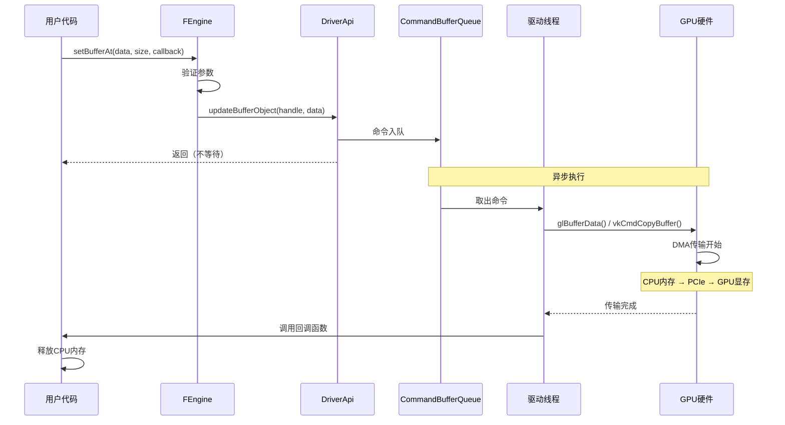
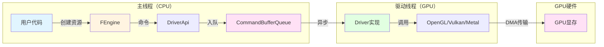
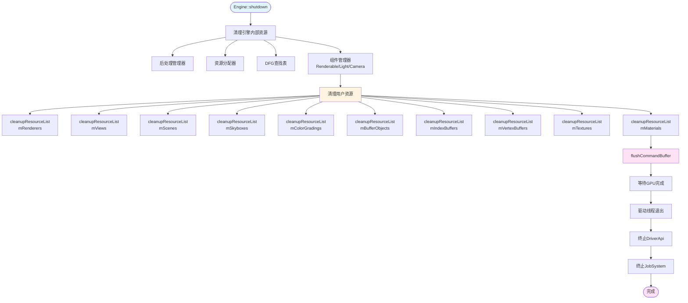
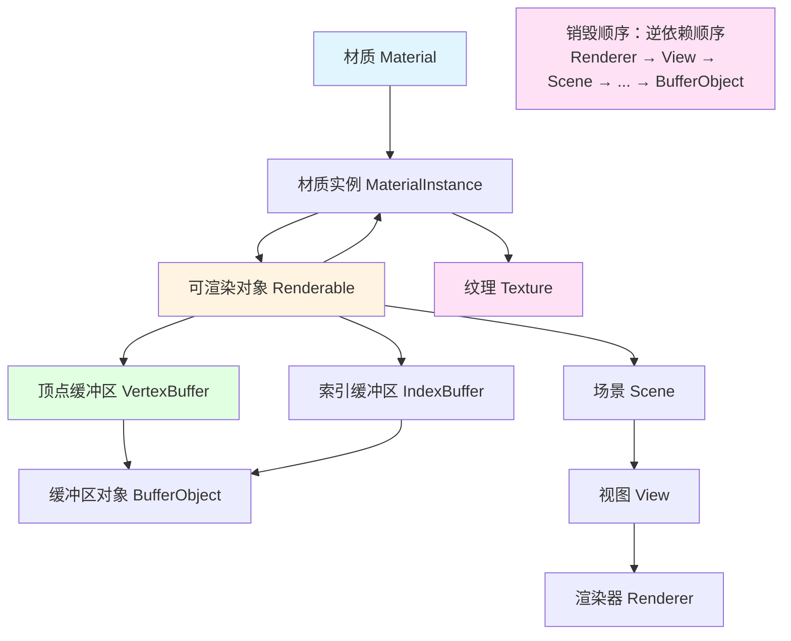

# Filament 图形数据生命周期完整流程文档

## 目录
1. [概述](#概述)
2. [资源创建流程](#资源创建流程)
3. [CPU到GPU数据传输流程](#cpu到gpu数据传输流程)
4. [资源销毁流程](#资源销毁流程)
5. [完整流程图](#完整流程图)
6. [关键代码路径](#关键代码路径)

---

## 概述

Filament 引擎中的图形数据（如顶点缓冲区、索引缓冲区、纹理等）遵循一个完整的生命周期：
1. **创建阶段**：在CPU端创建资源对象和GPU句柄
2. **上传阶段**：将CPU内存中的数据异步传输到GPU显存
3. **使用阶段**：GPU使用这些数据进行渲染
4. **销毁阶段**：清理CPU和GPU端的资源

---

## 资源创建流程

### 1. 顶点缓冲区（VertexBuffer）创建

```
用户代码
  ↓
VertexBuffer::Builder()
  .vertexCount(3)
  .bufferCount(1)
  .attribute(...)
  .build(*engine)
  ↓
FEngine::createVertexBuffer()
  ↓
FVertexBuffer 对象创建（CPU端）
  ↓
DriverApi::createVertexBuffer()
  ↓
后端驱动（OpenGL/Vulkan/Metal）
  ↓
GPU资源分配（句柄创建）
```

**关键步骤：**
- **Builder模式**：使用构建器模式配置资源参数
- **Engine创建**：通过 `Engine::create*()` 方法创建资源
- **资源列表管理**：资源被添加到 `ResourceList` 中统一管理
- **GPU句柄分配**：后端驱动分配GPU资源句柄（不立即分配显存）

**代码位置：**
- `filament/src/details/Engine.cpp` - `FEngine::createVertexBuffer()`
- `filament/src/details/VertexBuffer.cpp` - `FVertexBuffer` 实现
- `filament/backend/include/private/backend/DriverAPI.inc` - `DriverApi::createVertexBuffer()`

### 2. 纹理（Texture）创建

```
用户代码
  ↓
Texture::Builder()
  .width(512)
  .height(512)
  .format(RGBA8)
  .build(*engine)
  ↓
FEngine::createTexture()
  ↓
FTexture 对象创建（CPU端）
  ↓
DriverApi::createTexture()
  ↓
后端驱动创建GPU纹理对象
  ↓
分配GPU显存（但未填充数据）
```

**关键步骤：**
- 纹理对象在CPU端创建
- GPU端分配纹理资源（可能使用纹理缓存）
- 数据尚未上传，纹理内容未定义

**代码位置：**
- `filament/src/details/Engine.cpp` - `FEngine::createTexture()`
- `filament/src/details/Texture.cpp` - `FTexture` 实现

---

## CPU到GPU数据传输流程

### 1. 顶点缓冲区数据上传

```
用户代码
  ↓
vb->setBufferAt(*engine, 0, BufferDescriptor(data, size, callback))
  ↓
FVertexBuffer::setBufferAt()
  - 验证缓冲区索引和属性
  - 获取对应的 BufferObject 句柄
  ↓
DriverApi::updateBufferObject()
  - 将命令加入命令缓冲区队列
  ↓
命令缓冲区队列（CommandBufferQueue）
  - 异步命令队列
  ↓
后端驱动线程执行（OpenGL/Vulkan/Metal）
  ↓
OpenGL: glBufferData() / glBufferSubData()
Vulkan: vkCmdCopyBufferToBuffer()
Metal: MTLBlitCommandEncoder::copyFromBuffer()
  ↓
DMA传输（异步）
  CPU内存 → 系统总线 → PCIe → GPU显存
  ↓
传输完成后调用回调函数
  - 释放CPU端临时内存（如果提供了回调）
```

**详细流程：**

```
┌─────────────────────────────────────────────────────────────┐
│                     CPU端（主线程）                          │
├─────────────────────────────────────────────────────────────┤
│                                                               │
│  setBufferAt()                                                │
│    ↓                                                          │
│  验证参数和属性                                                │
│    ↓                                                          │
│  DriverApi::updateBufferObject()                             │
│    ↓                                                          │
│  将命令写入 CommandBufferQueue                               │
│    ↓                                                          │
│  返回（不等待GPU完成）                                        │
│                                                               │
└─────────────────────────────────────────────────────────────┘
                          ↓
                   命令缓冲区队列
                          ↓
┌─────────────────────────────────────────────────────────────┐
│                  GPU驱动线程（后台线程）                       │
├─────────────────────────────────────────────────────────────┤
│                                                               │
│  从队列中取出命令                                              │
│    ↓                                                          │
│  OpenGLDriver::updateBufferObject()                          │
│    ↓                                                          │
│  glBindBuffer(GL_ARRAY_BUFFER, vbo_id)                       │
│    ↓                                                          │
│  glBufferData(GL_ARRAY_BUFFER, size, data, usage)            │
│    ↓                                                          │
│  触发DMA传输（异步，不阻塞CPU）                               │
│    ↓                                                          │
│  数据通过PCIe总线传输到GPU显存                                │
│    ↓                                                          │
│  传输完成后，调用回调函数释放CPU内存                          │
│                                                               │
└─────────────────────────────────────────────────────────────┘
```

**关键特性：**
- **异步传输**：数据上传不会阻塞CPU线程
- **DMA加速**：使用直接内存访问（DMA）进行高效传输
- **回调机制**：传输完成后自动释放CPU内存
- **命令队列**：通过命令缓冲区队列实现多线程安全

**代码位置：**
- `filament/src/details/VertexBuffer.cpp` - `FVertexBuffer::setBufferAt()`
- `filament/backend/src/opengl/OpenGLDriver.cpp` - `OpenGLDriver::updateBufferObject()`
- `filament/backend/src/vulkan/VulkanBufferProxy.cpp` - `VulkanBufferProxy::loadFromCpu()`
- `filament/backend/src/metal/MetalBuffer.mm` - `MetalBuffer::uploadWithPoolBuffer()`

### 2. 纹理数据上传

```
用户代码
  ↓
texture->setImage(*engine, level, PixelBufferDescriptor(data, size, ...))
  ↓
FTexture::setImage()
  ↓
DriverApi::update3DImage()
  - 将命令加入命令缓冲区队列
  ↓
后端驱动线程执行
  ↓
OpenGL: glTexImage2D() / glTexSubImage2D()
Vulkan: vkCmdCopyBufferToImage()
Metal: MTLBlitCommandEncoder::copyFromBuffer()
  ↓
DMA传输纹理数据到GPU显存
  ↓
传输完成后调用回调函数
```

**Vulkan后端特殊处理：**
- 使用 **Staging Buffer** 作为中转缓冲区
- 通过 `vkCmdCopyBufferToImage` 将数据从staging buffer复制到纹理
- 在UMA（统一内存架构）设备上可能直接memcpy到映射内存

**Metal后端特殊处理：**
- 使用 **Buffer Pool** 或 **Bump Allocator** 管理staging buffer
- 通过 `MTLBlitCommandEncoder` 进行数据传输

**代码位置：**
- `filament/src/details/Texture.cpp` - `FTexture::setImage()`
- `filament/backend/src/opengl/OpenGLDriver.cpp` - `OpenGLDriver::update3DImage()`
- `filament/backend/src/vulkan/VulkanTexture.cpp` - `VulkanTexture::updateImage()`
- `filament/backend/src/metal/MetalDriver.mm` - `MetalDriver::update3DImage()`

---

## 资源销毁流程

### 1. 用户销毁资源

```
用户代码
  ↓
engine->destroy(vertexBuffer)
  ↓
FEngine::destroy(FVertexBuffer*)
  ↓
检查资源有效性
  ↓
terminateAndDestroy()
  ↓
FVertexBuffer::terminate()
  - 调用 DriverApi::destroyVertexBuffer()
  - 将销毁命令加入队列
  ↓
从 ResourceList 中移除资源
  ↓
删除 FVertexBuffer 对象（CPU端）
```

### 2. Engine关闭时的批量销毁

```
Engine::shutdown()
  ↓
清理引擎内部资源
  - 后处理管理器
  - 资源分配器
  - DFG查找表
  - 组件管理器（Renderable、Light、Camera）
  ↓
清理用户创建的资源列表
  - cleanupResourceList(mVertexBuffers)
  - cleanupResourceList(mIndexBuffers)
  - cleanupResourceList(mTextures)
  - cleanupResourceList(mBufferObjects)
  - ...（其他资源类型）
  ↓
对每个资源调用 terminate()
  ↓
DriverApi::destroy*() 命令入队
  ↓
刷新命令缓冲区
  ↓
等待GPU完成所有命令
  ↓
驱动线程退出
  ↓
销毁 DriverApi 对象
  ↓
终止 JobSystem
```

**销毁顺序（逆依赖顺序）：**
1. Renderers（渲染器）
2. Views（视图）
3. Scenes（场景）
4. Skyboxes（天空盒）
5. ColorGradings（颜色分级）
6. BufferObjects（缓冲区对象）
7. IndexBuffers（索引缓冲区）
8. VertexBuffers（顶点缓冲区）
9. Textures（纹理）
10. Materials（材质）

**代码位置：**
- `filament/src/details/Engine.cpp` - `FEngine::shutdown()`
- `filament/src/details/Engine.cpp` - `FEngine::destroy()`
- `filament/src/ResourceList.cpp` - `ResourceList::cleanup()`

---

## 完整流程图

### 顶点缓冲区完整生命周期

```
┌─────────────────────────────────────────────────────────────────┐
│                        创建阶段                                  │
├─────────────────────────────────────────────────────────────────┤
│                                                                   │
│  用户代码                                                         │
│    ↓                                                              │
│  VertexBuffer::Builder()                                         │
│    .vertexCount(3)                                               │
│    .bufferCount(1)                                               │
│    .attribute(...)                                               │
│    .build(*engine)                                                │
│    ↓                                                              │
│  FEngine::createVertexBuffer()                                    │
│    - 创建 FVertexBuffer 对象（CPU端）                            │
│    - 添加到 mVertexBuffers ResourceList                          │
│    ↓                                                              │
│  DriverApi::createVertexBuffer()                                  │
│    - 分配 GPU 句柄（Handle<HwVertexBuffer>）                    │
│    - 后端驱动创建 GPU 资源（但不分配显存）                        │
│                                                                   │
└─────────────────────────────────────────────────────────────────┘
                            ↓
┌─────────────────────────────────────────────────────────────────┐
│                        上传阶段                                  │
├─────────────────────────────────────────────────────────────────┤
│                                                                   │
│  用户代码                                                         │
│    ↓                                                              │
│  vb->setBufferAt(*engine, 0, BufferDescriptor(data, size, cb))  │
│    ↓                                                              │
│  FVertexBuffer::setBufferAt()                                    │
│    - 验证参数                                                     │
│    - 获取 BufferObject 句柄                                       │
│    ↓                                                              │
│  DriverApi::updateBufferObject()                                 │
│    - 命令入队（CommandBufferQueue）                              │
│    ↓                                                              │
│  驱动线程执行                                                     │
│    ↓                                                              │
│  glBufferData() / vkCmdCopyBuffer() / MTLBlitEncoder            │
│    ↓                                                              │
│  DMA传输：CPU内存 → GPU显存（异步）                              │
│    ↓                                                              │
│  传输完成后调用回调函数释放CPU内存                               │
│                                                                   │
└─────────────────────────────────────────────────────────────────┘
                            ↓
┌─────────────────────────────────────────────────────────────────┐
│                        使用阶段                                  │
├─────────────────────────────────────────────────────────────────┤
│                                                                   │
│  渲染循环                                                         │
│    ↓                                                              │
│  Renderer::render()                                              │
│    ↓                                                              │
│  绑定顶点缓冲区到渲染管线                                         │
│    ↓                                                              │
│  GPU读取顶点数据并渲染                                            │
│                                                                   │
└─────────────────────────────────────────────────────────────────┘
                            ↓
┌─────────────────────────────────────────────────────────────────┐
│                        销毁阶段                                  │
├─────────────────────────────────────────────────────────────────┤
│                                                                   │
│  方式1：用户主动销毁                                              │
│    engine->destroy(vertexBuffer)                                 │
│      ↓                                                            │
│    FEngine::destroy(FVertexBuffer*)                              │
│      ↓                                                            │
│    terminateAndDestroy()                                         │
│      ↓                                                            │
│    FVertexBuffer::terminate()                                    │
│      - DriverApi::destroyVertexBuffer() 命令入队                 │
│      ↓                                                            │
│    从 ResourceList 移除                                          │
│      ↓                                                            │
│    删除 FVertexBuffer 对象                                       │
│                                                                   │
│  方式2：Engine关闭时批量销毁                                     │
│    Engine::shutdown()                                            │
│      ↓                                                            │
│    cleanupResourceList(mVertexBuffers)                           │
│      ↓                                                            │
│    对每个资源调用 terminate()                                    │
│      ↓                                                            │
│    刷新命令缓冲区并等待GPU完成                                   │
│      ↓                                                            │
│    驱动线程退出                                                   │
│                                                                   │
└─────────────────────────────────────────────────────────────────┘
```

### 纹理完整生命周期

```
┌─────────────────────────────────────────────────────────────────┐
│                        创建阶段                                  │
├─────────────────────────────────────────────────────────────────┤
│                                                                   │
│  Texture::Builder()                                              │
│    .width(512).height(512)                                       │
│    .format(RGBA8)                                                │
│    .build(*engine)                                               │
│    ↓                                                              │
│  FEngine::createTexture()                                        │
│    - 创建 FTexture 对象                                           │
│    - 添加到 mTextures ResourceList                               │
│    ↓                                                              │
│  DriverApi::createTexture()                                      │
│    - 分配 GPU 纹理句柄                                            │
│    - 后端驱动创建纹理对象（可能使用缓存）                         │
│                                                                   │
└─────────────────────────────────────────────────────────────────┘
                            ↓
┌─────────────────────────────────────────────────────────────────┐
│                        上传阶段                                  │
├─────────────────────────────────────────────────────────────────┤
│                                                                   │
│  texture->setImage(*engine, level, PixelBufferDescriptor(...))  │
│    ↓                                                              │
│  FTexture::setImage()                                            │
│    ↓                                                              │
│  DriverApi::update3DImage()                                      │
│    - 命令入队                                                     │
│    ↓                                                              │
│  驱动线程执行                                                     │
│    ↓                                                              │
│  OpenGL: glTexImage2D()                                          │
│  Vulkan: vkCmdCopyBufferToImage() (通过staging buffer)           │
│  Metal: MTLBlitCommandEncoder::copyFromBuffer()                │
│    ↓                                                              │
│  DMA传输纹理数据到GPU显存                                         │
│                                                                   │
└─────────────────────────────────────────────────────────────────┘
                            ↓
┌─────────────────────────────────────────────────────────────────┐
│                        使用阶段                                  │
├─────────────────────────────────────────────────────────────────┤
│                                                                   │
│  渲染时绑定纹理到材质                                             │
│    ↓                                                              │
│  GPU采样纹理数据                                                  │
│                                                                   │
└─────────────────────────────────────────────────────────────────┘
                            ↓
┌─────────────────────────────────────────────────────────────────┐
│                        销毁阶段                                  │
├─────────────────────────────────────────────────────────────────┤
│                                                                   │
│  engine->destroy(texture)                                        │
│    ↓                                                              │
│  FEngine::destroy(FTexture*)                                     │
│    ↓                                                              │
│  FTexture::terminate()                                           │
│    - DriverApi::destroyTexture() 命令入队                        │
│    ↓                                                              │
│  从 ResourceList 移除                                             │
│    ↓                                                              │
│  删除 FTexture 对象                                               │
│                                                                   │
└─────────────────────────────────────────────────────────────────┘
```

### Mermaid 流程图（可视化版本）

> **注意**：以下流程图使用 Mermaid 语法绘制，可以在支持 Mermaid 的 Markdown 查看器中查看（如 GitHub、GitLab、VS Code 等）。如果您的查看器不支持 Mermaid，请参考上面的 ASCII 图表。

#### 1. 顶点缓冲区完整生命周期（Mermaid）

```mermaid
graph TB
    Start([用户代码]) --> Create[VertexBuffer::Builder<br/>配置参数]
    Create --> Build[.build*engine]
    Build --> EngineCreate[FEngine::createVertexBuffer]
    EngineCreate --> CPUObj[创建FVertexBuffer对象<br/>CPU端]
    CPUObj --> AddList[添加到ResourceList]
    AddList --> DriverCreate[DriverApi::createVertexBuffer]
    DriverCreate --> GPUHandle[分配GPU句柄<br/>Handle&lt;HwVertexBuffer&gt;]
    GPUHandle --> Upload[上传数据阶段]
    
    Upload --> SetBuffer[vb->setBufferAt<br/>BufferDescriptor]
    SetBuffer --> Validate[验证参数和属性]
    Validate --> UpdateBuffer[DriverApi::updateBufferObject]
    UpdateBuffer --> Enqueue[命令入队<br/>CommandBufferQueue]
    Enqueue --> DriverThread[驱动线程执行]
    DriverThread --> GLAPI[OpenGL: glBufferData<br/>Vulkan: vkCmdCopyBuffer<br/>Metal: MTLBlitEncoder]
    GLAPI --> DMA[DMA异步传输<br/>CPU内存 → GPU显存]
    DMA --> Callback[传输完成<br/>调用回调函数]
    Callback --> Use[使用阶段]
    
    Use --> Render[渲染循环<br/>Renderer::render]
    Render --> Bind[绑定顶点缓冲区]
    Bind --> GPURender[GPU读取数据渲染]
    GPURender --> Destroy[销毁阶段]
    
    Destroy --> UserDestroy[方式1: 用户销毁<br/>engine->destroy]
    Destroy --> EngineShutdown[方式2: Engine关闭<br/>Engine::shutdown]
    
    UserDestroy --> Terminate[terminateAndDestroy]
    EngineShutdown --> Cleanup[cleanupResourceList]
    Cleanup --> Terminate
    
    Terminate --> TerminateObj[FVertexBuffer::terminate]
    TerminateObj --> DestroyCmd[DriverApi::destroyVertexBuffer<br/>命令入队]
    DestroyCmd --> RemoveList[从ResourceList移除]
    RemoveList --> DeleteObj[删除CPU对象]
    DeleteObj --> GPUFree[GPU释放资源]
    GPUFree --> End([结束])
    
    style Start fill:#e1f5ff
    style End fill:#ffe1f5
    style CPUObj fill:#fff4e1
    style GPUHandle fill:#e1ffe1
    style DMA fill:#ffe1f5
    style Use fill:#e1f5ff
```



#### 2. 纹理完整生命周期（Mermaid）

```mermaid
graph TB
    Start([用户代码]) --> Create[Texture::Builder<br/>配置参数]
    Create --> Build[.build*engine]
    Build --> EngineCreate[FEngine::createTexture]
    EngineCreate --> CPUObj[创建FTexture对象<br/>CPU端]
    CPUObj --> AddList[添加到ResourceList]
    AddList --> DriverCreate[DriverApi::createTexture]
    DriverCreate --> GPUHandle[分配GPU纹理句柄<br/>可能使用缓存]
    GPUHandle --> Upload[上传数据阶段]
    
    Upload --> SetImage[texture->setImage<br/>PixelBufferDescriptor]
    SetImage --> UpdateImage[DriverApi::update3DImage]
    UpdateImage --> Enqueue[命令入队]
    Enqueue --> DriverThread[驱动线程执行]
    DriverThread --> GLAPI[OpenGL: glTexImage2D<br/>Vulkan: vkCmdCopyBufferToImage<br/>Metal: MTLBlitEncoder]
    GLAPI --> Staging{Vulkan后端?}
    Staging -->|是| StagingBuf[使用Staging Buffer中转]
    Staging -->|否| Direct[直接传输]
    StagingBuf --> DMA[DMA异步传输<br/>CPU内存 → GPU显存]
    Direct --> DMA
    DMA --> Callback[传输完成<br/>调用回调函数]
    Callback --> Use[使用阶段]
    
    Use --> BindTex[绑定纹理到材质]
    BindTex --> Sample[GPU采样纹理]
    Sample --> Destroy[销毁阶段]
    
    Destroy --> UserDestroy[engine->destroy]
    UserDestroy --> Terminate[FTexture::terminate]
    Terminate --> DestroyCmd[DriverApi::destroyTexture<br/>命令入队]
    DestroyCmd --> RemoveList[从ResourceList移除]
    RemoveList --> DeleteObj[删除CPU对象]
    DeleteObj --> GPUFree[GPU释放纹理资源]
    GPUFree --> End([结束])
    
    style Start fill:#e1f5ff
    style End fill:#ffe1f5
    style CPUObj fill:#fff4e1
    style GPUHandle fill:#e1ffe1
    style DMA fill:#ffe1f5
    style Use fill:#e1f5ff
    style Staging fill:#ffe1f5
```



#### 3. CPU到GPU数据传输详细流程（时序图）



#### 4. 多线程架构



#### 5. Engine关闭时的资源清理顺序



#### 6. 资源依赖关系图



**查看 Mermaid 流程图的方法：**
- **VS Code**：安装 "Markdown Preview Mermaid Support" 扩展
- **在线查看**：访问 https://mermaid.live/ 粘贴代码查看
- **GitHub/GitLab**：直接查看，原生支持 Mermaid

---

## 关键代码路径

### 创建流程

| 资源类型 | 用户API | Engine方法 | DriverApi方法 | 后端实现 |
|---------|---------|-----------|--------------|---------|
| VertexBuffer | `VertexBuffer::Builder().build()` | `FEngine::createVertexBuffer()` | `DriverApi::createVertexBuffer()` | `OpenGLDriver::createVertexBuffer()` |
| IndexBuffer | `IndexBuffer::Builder().build()` | `FEngine::createIndexBuffer()` | `DriverApi::createIndexBuffer()` | `OpenGLDriver::createIndexBuffer()` |
| Texture | `Texture::Builder().build()` | `FEngine::createTexture()` | `DriverApi::createTexture()` | `OpenGLDriver::createTexture()` |
| BufferObject | `BufferObject::Builder().build()` | `FEngine::createBufferObject()` | `DriverApi::createBufferObject()` | `OpenGLDriver::createBufferObject()` |

### 上传流程

| 资源类型 | 用户API | Engine方法 | DriverApi方法 | 后端实现 |
|---------|---------|-----------|--------------|---------|
| VertexBuffer | `vb->setBufferAt()` | `FVertexBuffer::setBufferAt()` | `DriverApi::updateBufferObject()` | `OpenGLDriver::updateBufferObject()` |
| IndexBuffer | `ib->setBuffer()` | `FIndexBuffer::setBuffer()` | `DriverApi::updateIndexBuffer()` | `OpenGLDriver::updateIndexBuffer()` |
| Texture | `texture->setImage()` | `FTexture::setImage()` | `DriverApi::update3DImage()` | `OpenGLDriver::update3DImage()` |

### 销毁流程

| 资源类型 | 用户API | Engine方法 | DriverApi方法 | 后端实现 |
|---------|---------|-----------|--------------|---------|
| VertexBuffer | `engine->destroy(vb)` | `FEngine::destroy(FVertexBuffer*)` | `DriverApi::destroyVertexBuffer()` | `OpenGLDriver::destroyVertexBuffer()` |
| Texture | `engine->destroy(tex)` | `FEngine::destroy(FTexture*)` | `DriverApi::destroyTexture()` | `OpenGLDriver::destroyTexture()` |

---

## 内存管理机制

### CPU端内存管理

- **BufferDescriptor**：持有CPU内存指针和数据大小
- **回调函数**：数据上传完成后自动释放CPU内存
- **ResourceList**：统一管理所有资源对象的生命周期

### GPU端内存管理

- **Handle系统**：使用句柄（Handle）引用GPU资源
- **HandleAllocator**：分配和管理GPU资源句柄
- **命令队列**：通过命令缓冲区队列异步执行GPU操作
- **资源缓存**：某些资源（如纹理）可能被缓存复用

### 多线程安全

- **命令缓冲区队列**：主线程和驱动线程之间的通信桥梁
- **ResourceList锁**：某些资源列表需要锁保护（如Fence、Sync）
- **异步执行**：GPU操作在后台线程执行，不阻塞主线程

---

## 注意事项

1. **异步操作**：数据上传是异步的，不会立即完成
2. **内存管理**：使用回调函数确保CPU内存在上传完成后释放
3. **资源依赖**：销毁资源时要注意依赖关系，按逆依赖顺序销毁
4. **线程安全**：资源创建和销毁应在主线程进行
5. **命令队列**：所有GPU操作都通过命令队列异步执行

---

## 总结

Filament 的资源生命周期管理遵循以下原则：

1. **分离关注点**：CPU端对象管理和GPU端资源管理分离
2. **异步执行**：所有GPU操作异步执行，不阻塞CPU
3. **统一管理**：通过ResourceList统一管理资源生命周期
4. **自动清理**：Engine关闭时自动清理所有资源
5. **多线程安全**：通过命令队列实现多线程安全

这种设计确保了高性能和线程安全，同时简化了资源管理。

