# Filament 渲染引擎完整框架分析

## 目录

1. [概述](#概述)
2. [整体架构](#整体架构)
3. [核心框架类详解](#核心框架类详解)
4. [组件管理器系统](#组件管理器系统)
5. [资源管理系统](#资源管理系统)
6. [渲染管线系统](#渲染管线系统)
7. [FrameGraph 系统](#framegraph-系统)
8. [后端抽象层](#后端抽象层)
9. [线程模型](#线程模型)
10. [数据流分析](#数据流分析)
11. [内存管理](#内存管理)
12. [性能优化策略](#性能优化策略)

---

## 概述

Filament 是 Google 开发的**物理基于渲染（PBR）**实时渲染引擎，采用**分层架构**设计，支持多后端（OpenGL、Vulkan、Metal、WebGPU）。

### 核心特性

- **多后端支持**：OpenGL、Vulkan、Metal、WebGPU
- **ECS架构**：Entity-Component-System 设计模式
- **高性能**：多线程渲染、异步命令提交
- **PBR渲染**：物理准确的光照和材质
- **FrameGraph**：声明式资源依赖管理

---

## 整体架构

### 分层架构图

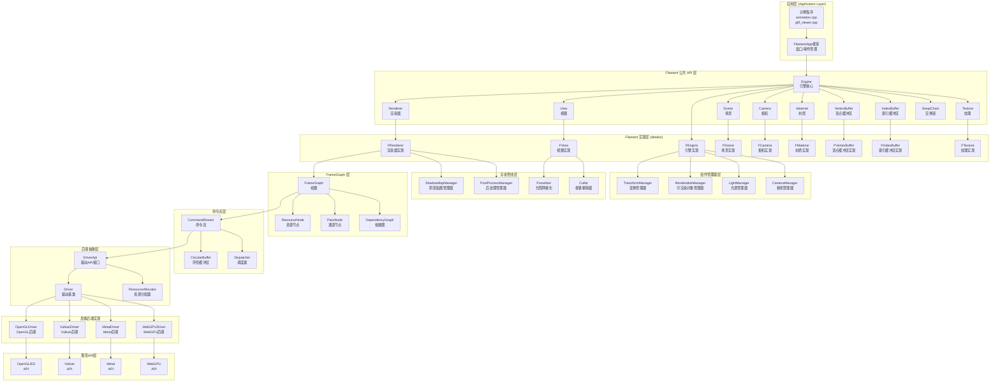

### 架构层次说明

```
┌─────────────────────────────────────────────────────────────┐
│  应用层                                                       │
│  - 用户代码（示例程序）                                       │
│  - FilamentApp 框架（窗口/事件管理）                         │
└──────────────────────┬──────────────────────────────────────┘
                       │
┌──────────────────────▼──────────────────────────────────────┐
│  公共 API 层                                                  │
│  - Engine, Renderer, View, Scene 等公共接口                  │
│  - 用户直接使用的 API                                         │
└──────────────────────┬──────────────────────────────────────┘
                       │
┌──────────────────────▼──────────────────────────────────────┐
│  实现层 (details/)                                            │
│  - FEngine, FRenderer, FView 等实现类                        │
│  - 具体功能实现                                               │
└──────────────────────┬──────────────────────────────────────┘
                       │
┌──────────────────────▼──────────────────────────────────────┐
│  组件管理器层                                                 │
│  - TransformManager, RenderableManager 等                    │
│  - ECS 架构的 System 层                                      │
└──────────────────────┬──────────────────────────────────────┘
                       │
┌──────────────────────▼──────────────────────────────────────┐
│  渲染管线层                                                   │
│  - ShadowMapManager, PostProcessManager 等                   │
│  - 各种渲染通道管理器                                         │
└──────────────────────┬──────────────────────────────────────┘
                       │
┌──────────────────────▼──────────────────────────────────────┐
│  FrameGraph 层                                                │
│  - FrameGraph, ResourceNode, PassNode                        │
│  - 资源依赖管理和生命周期                                     │
└──────────────────────┬──────────────────────────────────────┘
                       │
┌──────────────────────▼──────────────────────────────────────┐
│  命令流层                                                     │
│  - CommandStream, CircularBuffer                            │
│  - 命令序列化和线程间通信                                     │
└──────────────────────┬──────────────────────────────────────┘
                       │
┌──────────────────────▼──────────────────────────────────────┐
│  后端抽象层                                                   │
│  - DriverApi, Driver                                        │
│  - 统一的驱动接口                                             │
└──────────────────────┬──────────────────────────────────────┘
                       │
┌──────────────────────▼──────────────────────────────────────┐
│  具体后端实现                                                 │
│  - OpenGLDriver, VulkanDriver, MetalDriver, WebGPUDriver   │
│  - 各平台的驱动实现                                           │
└──────────────────────┬──────────────────────────────────────┘
                       │
┌──────────────────────▼──────────────────────────────────────┐
│  图形 API 层                                                 │
│  - OpenGL, Vulkan, Metal, WebGPU                            │
│  - 底层图形 API                                              │
└─────────────────────────────────────────────────────────────┘
```

---

## 核心框架类详解

### 1. Engine（引擎）

**位置**：
- 公共接口：`filament/include/filament/Engine.h`
- 实现：`filament/src/details/Engine.h/cpp`

**职责**：
- Filament 的**主入口点**和**资源管理器**
- 管理所有渲染资源（纹理、缓冲区、材质等）
- 管理渲染线程和驱动线程
- 提供统一的资源创建/销毁接口
- 管理组件管理器（TransformManager、RenderableManager 等）

**类结构**：

```cpp
class Engine {
public:
    // 创建和销毁
    static Engine* create();
    static void destroy(Engine** engine);
    
    // 资源创建
    Renderer* createRenderer();
    Scene* createScene();
    View* createView();
    Camera* createCamera(Entity entity);
    SwapChain* createSwapChain(void* nativeWindow);
    
    // 缓冲区创建
    VertexBuffer* createVertexBuffer(...);
    IndexBuffer* createIndexBuffer(...);
    Texture* createTexture(...);
    
    // 材质创建
    Material* createMaterial(Material::Builder& builder);
    
    // 组件管理器
    TransformManager& getTransformManager();
    RenderableManager& getRenderableManager();
    LightManager& getLightManager();
    CameraManager& getCameraManager();
    
    // 资源销毁
    void destroy(Renderer* renderer);
    void destroy(Scene* scene);
    void destroy(View* view);
    // ... 其他资源的销毁方法
    
    // 配置
    struct Config {
        uint32_t commandBufferSizeMB;
        uint32_t perRenderPassArenaSizeMB;
        uint32_t perFrameCommandsSizeMB;
        uint32_t jobSystemThreadCount;
        // ...
    };
};
```

**Engine 内部结构图**：

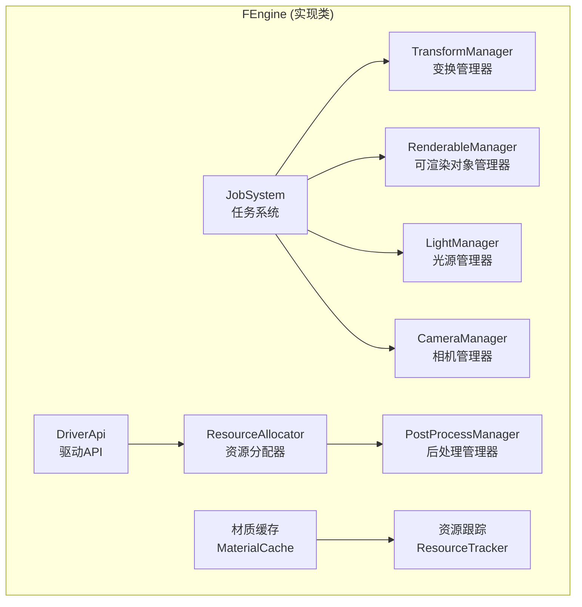

**关键特性**：

1. **资源跟踪**
   - 自动跟踪所有创建的资源
   - 销毁时检查资源泄漏并发出警告
   - 提供 `isValid()` 方法验证资源有效性

2. **线程管理**
   - **渲染线程**：执行 GPU 命令
   - **工作线程**：执行并行任务（剔除、光照计算等）
   - 线程优先级根据平台最佳实践自动设置

3. **内存管理**
   - 命令缓冲区管理（Command Buffer）
   - 每帧数据区域（Per-Render-Pass Arena）
   - 资源分配器（Resource Allocator）

**典型用法**：

```cpp
// 创建引擎
Engine* engine = Engine::create();

// 创建资源
Renderer* renderer = engine->createRenderer();
Scene* scene = engine->createScene();
View* view = engine->createView();

// 使用组件管理器
auto& tcm = engine->getTransformManager();
auto& rcm = engine->getRenderableManager();

// 销毁资源
engine->destroy(renderer);
engine->destroy(scene);
engine->destroy(view);
Engine::destroy(&engine);
```

---

### 2. Renderer（渲染器）

**位置**：
- 公共接口：`filament/include/filament/Renderer.h`
- 实现：`filament/src/details/Renderer.h/cpp`

**职责**：
- 管理**渲染窗口**（SwapChain）
- 执行**渲染循环**（beginFrame → render → endFrame）
- 协调**多线程渲染**
- 管理**帧节奏**（Frame Pacing）

**类结构**：

```cpp
class Renderer {
public:
    // 渲染循环
    bool beginFrame(SwapChain* swapChain);
    void render(View const* view);
    void endFrame();
    
    // 配置
    void setDisplayInfo(DisplayInfo const& info);
    void setFrameRateOptions(FrameRateOptions const& options);
    
    // 帧信息
    struct FrameInfo {
        uint32_t frameId;
        duration_ns gpuFrameDuration;
        time_point_ns beginFrame;
        time_point_ns endFrame;
        time_point_ns vsync;
        // ...
    };
    
    utils::FixedCapacityVector<FrameInfo> getFrameInfoHistory(size_t historySize = 1) const;
};
```

**渲染流程**：

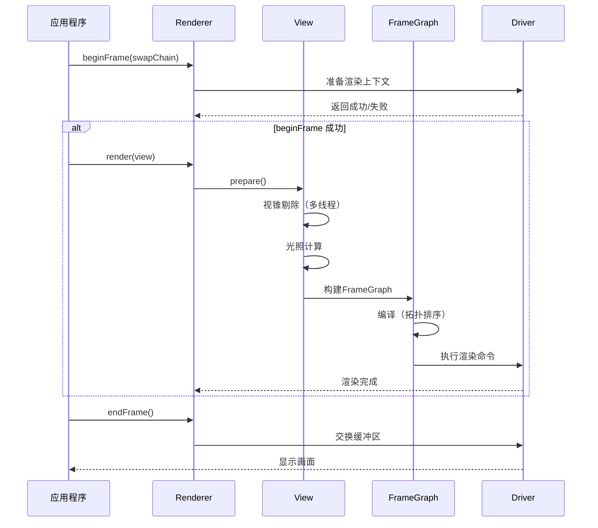

**渲染阶段**：

1. **Shadow Map Passes**（阴影贴图通道）
   - 为每个光源生成阴影贴图
   - 从光源视角渲染场景

2. **Depth Pre-Pass**（深度预通道）
   - 提前渲染深度缓冲区
   - 优化后续通道的深度测试

3. **Color Pass**（颜色通道）
   - 主渲染通道
   - PBR 材质计算
   - 光照计算（直射光 + IBL）
   - 阴影计算

4. **Post-Processing Pass**（后处理通道）
   - TAA（时间抗锯齿）
   - DoF（景深）
   - Bloom（泛光）
   - Tone Mapping（色调映射）
   - FXAA（快速近似抗锯齿）

---

### 3. View（视图）

**位置**：
- 公共接口：`filament/include/filament/View.h`
- 实现：`filament/src/details/View.h/cpp`

**职责**：
- 定义**渲染视口**（Viewport）
- 关联**场景**（Scene）和**相机**（Camera）
- 管理**渲染设置**（后处理、抗锯齿等）
- 执行**视锥剔除**（Frustum Culling）
- 管理**光照网格化**（Froxel Grid）

**类结构**：

```cpp
class View {
public:
    // 场景和相机
    void setScene(Scene* scene);
    void setCamera(Camera* camera);
    
    // 视口
    void setViewport(Viewport const& viewport);
    Viewport const& getViewport() const;
    
    // 渲染设置
    void setPostProcessingEnabled(bool enabled);
    void setAntiAliasing(AntiAliasing type);
    void setTemporalAntiAliasingOptions(TemporalAntiAliasingOptions const& options);
    void setDynamicResolutionOptions(DynamicResolutionOptions const& options);
    
    // 阴影
    void setShadowingEnabled(bool enabled);
    void setVsmShadowOptions(VsmShadowOptions const& options);
    
    // 后处理
    void setBloomOptions(BloomOptions const& options);
    void setColorGrading(ColorGrading* colorGrading);
    
    // 调试
    void setDebugCamera(Camera* camera);
};
```

**View 内部结构**：

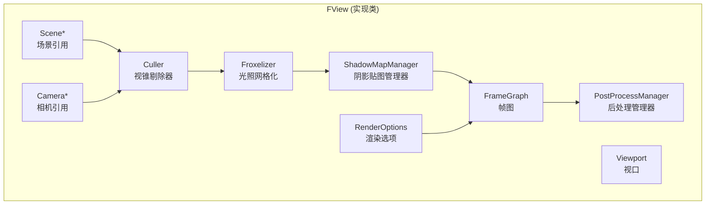

**View::prepare() 流程**：

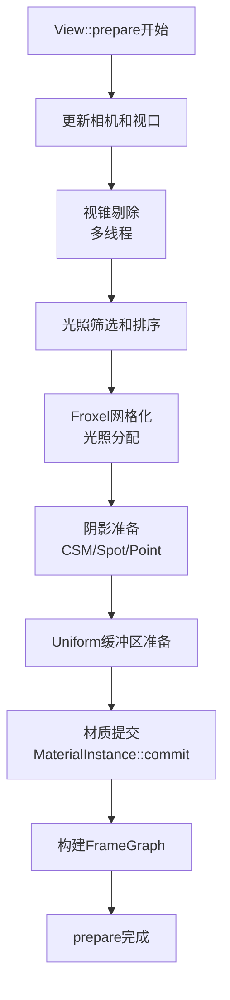

---

### 4. Scene（场景）

**位置**：
- 公共接口：`filament/include/filament/Scene.h`
- 实现：`filament/src/details/Scene.h/cpp`

**职责**：
- 包含所有**可渲染对象**（Renderables）
- 管理**光源**（Lights）
- 管理**天空盒**（Skybox）和**环境光**（IndirectLight）
- 准备渲染数据（SoA 布局）

**类结构**：

```cpp
class Scene {
public:
    // Entity 管理
    void addEntity(Entity entity);
    void remove(Entity entity);
    
    // 光源管理
    void addEntity(Entity entity, LightManager::Instance light);
    
    // 环境
    void setSkybox(Skybox* skybox);
    void setIndirectLight(IndirectLight* ibl);
    
    // 可见性
    void setVisibleLayers(uint8_t select, uint8_t values);
};
```

**Scene 数据结构**：

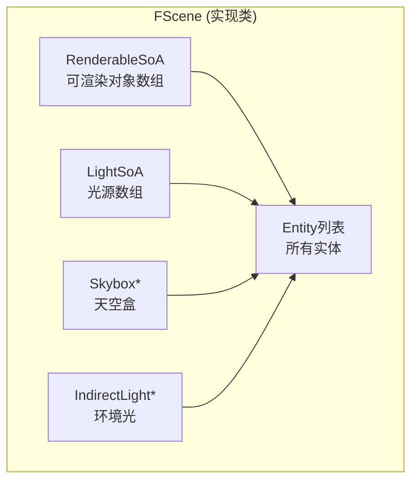

**SoA（Structure of Arrays）布局**：

```
传统 AoS (Array of Structures):
┌─────────────────────────────────────┐
│ Entity 0: [Renderable] [Transform]  │
│ Entity 1: [Renderable] [Transform]  │
│ Entity 2: [Renderable] [Transform]  │
└─────────────────────────────────────┘

Filament SoA (Structure of Arrays):
┌─────────────────────────────────────┐
│ RenderableComponent:                │
│   [Entity0, Entity1, Entity2, ...]  │
│   [VB0,    VB1,    VB2,    ...]     │
│   [IB0,    IB1,    IB2,    ...]     │
│   [Mat0,   Mat1,   Mat2,   ...]     │
├─────────────────────────────────────┤
│ TransformComponent:                 │
│   [Entity0, Entity1, Entity2, ...]  │
│   [Mat0,    Mat1,    Mat2,   ...]   │
└─────────────────────────────────────┘

优势：
- 更好的缓存局部性
- 便于SIMD优化
- 组件可以独立添加/删除
```

---

### 5. Camera（相机）

**位置**：
- 公共接口：`filament/include/filament/Camera.h`
- 实现：`filament/src/details/Camera.h/cpp`

**职责**：
- 定义**视图矩阵**（View Matrix）
- 定义**投影矩阵**（Projection Matrix）
- 控制**观察角度**和**视野**
- 管理**曝光**（Exposure）设置

**类结构**：

```cpp
class Camera {
public:
    // 视图矩阵
    void lookAt(float3 const& eye, float3 const& center, float3 const& up);
    mat4 getViewMatrix() const;
    
    // 投影矩阵
    void setProjection(Projection type, double left, double right, 
                       double bottom, double top, double near, double far);
    void setProjection(double fovInDegrees, double aspect, double near, double far, 
                       Fov direction = Fov::VERTICAL);
    mat4 getProjectionMatrix() const;
    
    // 曝光
    void setExposure(float aperture, float shutterSpeed, float sensitivity);
    float getExposure() const;
    
    // 裁剪平面
    void setNearFar(double near, double far);
    
    // 方向阴影相机
    utils::Slice<Camera const*> getDirectionalShadowCameras() const;
};
```

**相机变换**：

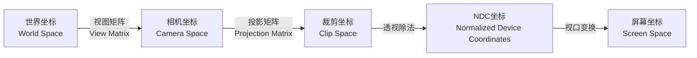

---

## 组件管理器系统

Filament 使用 **ECS（Entity-Component-System）** 架构管理场景对象。

### ECS 架构图

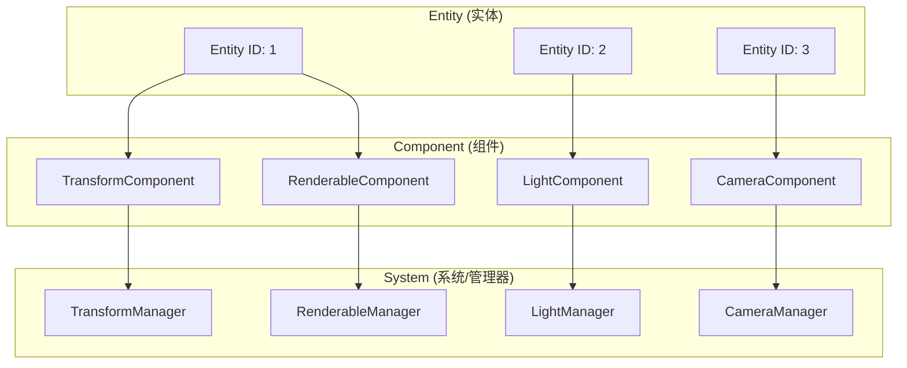

### 1. TransformManager（变换管理器）

**职责**：
- 管理实体的**变换组件**（位置、旋转、缩放）
- 提供变换矩阵的**设置和查询**接口
- 支持**父子关系**（Hierarchy）

**关键方法**：

```cpp
class TransformManager {
public:
    // 创建组件
    Instance create(Entity entity);
    Instance create(Entity entity, Instance parent, mat4f const& localTransform);
    
    // 设置变换
    void setTransform(Instance instance, mat4f const& transform);
    void setTransform(Instance instance, float3 const& translation, 
                      quatf const& rotation, float3 const& scale);
    
    // 查询变换
    mat4f const& getTransform(Instance instance) const;
    mat4f getWorldTransform(Instance instance) const;
    
    // 父子关系
    void setParent(Instance instance, Instance parent);
    Instance getParent(Instance instance) const;
};
```

**变换矩阵计算**：

```
世界变换 = 父变换 × 本地变换

WorldTransform = ParentTransform × LocalTransform
```

### 2. RenderableManager（可渲染对象管理器）

**职责**：
- 管理实体的**可渲染组件**
- 配置**几何数据**（VertexBuffer、IndexBuffer）
- 配置**材质实例**（MaterialInstance）
- 管理**渲染选项**（剔除、阴影等）

**关键方法**：

```cpp
class RenderableManager {
public:
    // 创建组件
    Instance create(Entity entity);
    
    // 构建器模式
    class Builder {
    public:
        Builder& geometry(uint8_t index, PrimitiveType type,
                         VertexBuffer* vertices, IndexBuffer* indices,
                         uint32_t offset, uint32_t count);
        Builder& material(uint8_t index, MaterialInstance* materialInstance);
        Builder& boundingBox(Box const& aabb);
        Builder& culling(bool enabled);
        Builder& castShadows(bool enabled);
        Builder& receiveShadows(bool enabled);
        Instance build(Engine& engine, Entity entity);
    };
    
    // 查询
    MaterialInstance* getMaterialInstanceAt(Instance instance, uint8_t primitiveIndex) const;
    Box getAxisAlignedBoundingBox(Instance instance) const;
};
```

**Renderable 结构**：

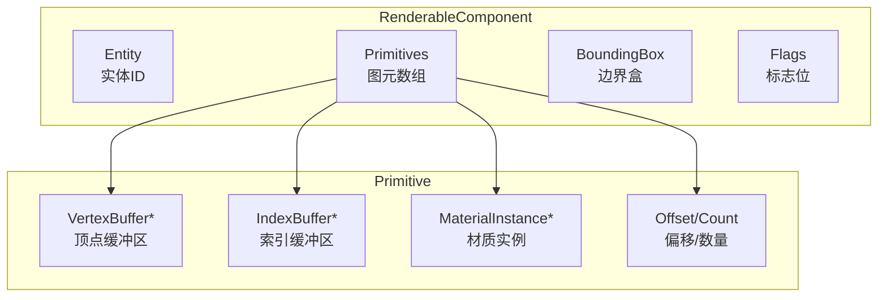

### 3. LightManager（光源管理器）

**职责**：
- 管理场景中的**光源**
- 支持多种光源类型（方向光、点光源、聚光灯）
- 管理光源参数（颜色、强度、范围等）

**关键方法**：

```cpp
class LightManager {
public:
    enum class Type {
        SUN,        // 方向光（太阳光）
        DIRECTIONAL,// 方向光
        POINT,      // 点光源
        FOCUSED_SPOT, // 聚光灯
        SPOT        // 聚光灯
    };
    
    // 创建组件
    Instance create(Entity entity);
    
    // 构建器模式
    class Builder {
    public:
        Builder& type(Type type);
        Builder& color(float3 const& linearColor);
        Builder& intensity(float intensity);
        Builder& direction(float3 const& direction);
        Builder& position(float3 const& position);
        Builder& falloff(float radius);
        Builder& spotLightCone(float inner, float outer);
        Instance build(Engine& engine, Entity entity);
    };
    
    // 查询
    Type getType(Instance instance) const;
    float3 getColor(Instance instance) const;
    float getIntensity(Instance instance) const;
};
```

**光源类型**：

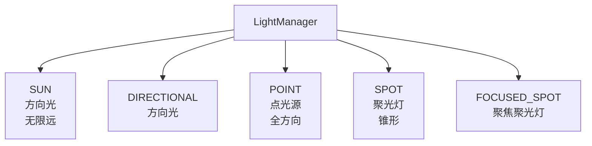

---

## 资源管理系统

### 资源类层次结构

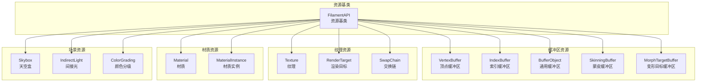

### 1. VertexBuffer（顶点缓冲区）

**职责**：
- 存储**顶点数据**（位置、颜色、法线、UV等）
- 管理**GPU缓冲区**
- 提供**数据更新**接口

**关键方法**：

```cpp
class VertexBuffer {
public:
    class Builder {
    public:
        Builder& vertexCount(uint32_t vertexCount);
        Builder& bufferCount(uint8_t bufferCount);
        Builder& attribute(VertexAttribute attribute, uint8_t bufferIndex,
                          AttributeType type, uint32_t byteOffset, uint8_t byteStride);
        Builder& normalized(VertexAttribute attribute);
        VertexBuffer* build(Engine& engine);
    };
    
    void setBufferAt(Engine& engine, uint8_t bufferIndex, 
                     BufferDescriptor const& buffer, uint32_t byteOffset = 0);
    void setBufferObjectAt(Engine& engine, uint8_t bufferIndex, BufferObject* bufferObject);
};
```

**顶点属性类型**：

```cpp
enum class VertexAttribute {
    POSITION,    // 位置
    TANGENTS,    // 切线
    COLOR,       // 颜色
    UV0,         // UV坐标0
    UV1,         // UV坐标1
    BONE_INDICES,// 骨骼索引
    BONE_WEIGHTS // 骨骼权重
};
```

### 2. IndexBuffer（索引缓冲区）

**职责**：
- 定义**顶点的连接顺序**
- 支持**索引重用**（一个顶点可被多个三角形共享）

**关键方法**：

```cpp
class IndexBuffer {
public:
    enum class IndexType {
        UINT,    // 32位无符号整数
        USHORT,  // 16位无符号短整型
        UBYTE    // 8位无符号字节
    };
    
    class Builder {
    public:
        Builder& indexCount(uint32_t indexCount);
        Builder& bufferType(IndexType indexType);
        IndexBuffer* build(Engine& engine);
    };
    
    void setBuffer(Engine& engine, BufferDescriptor const& buffer, 
                   uint32_t byteOffset = 0);
};
```

### 3. Material（材质）

**职责**：
- 定义**渲染外观**
- 包含着色器代码和参数
- 管理材质变体（Variants）

**关键方法**：

```cpp
class Material {
public:
    class Builder {
    public:
        Builder& package(void const* data, size_t size);
        Material* build(Engine& engine);
    };
    
    MaterialInstance* getDefaultInstance();
    MaterialInstance* createInstance(const char* name = nullptr);
    
    // 参数查询
    size_t getParameterCount() const;
    ParameterInfo getParameterInfo(size_t parameterIndex) const;
};
```

**材质系统**：

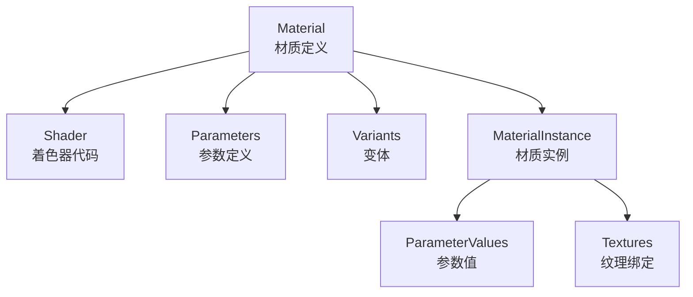

---

## 渲染管线系统

### 完整渲染管线

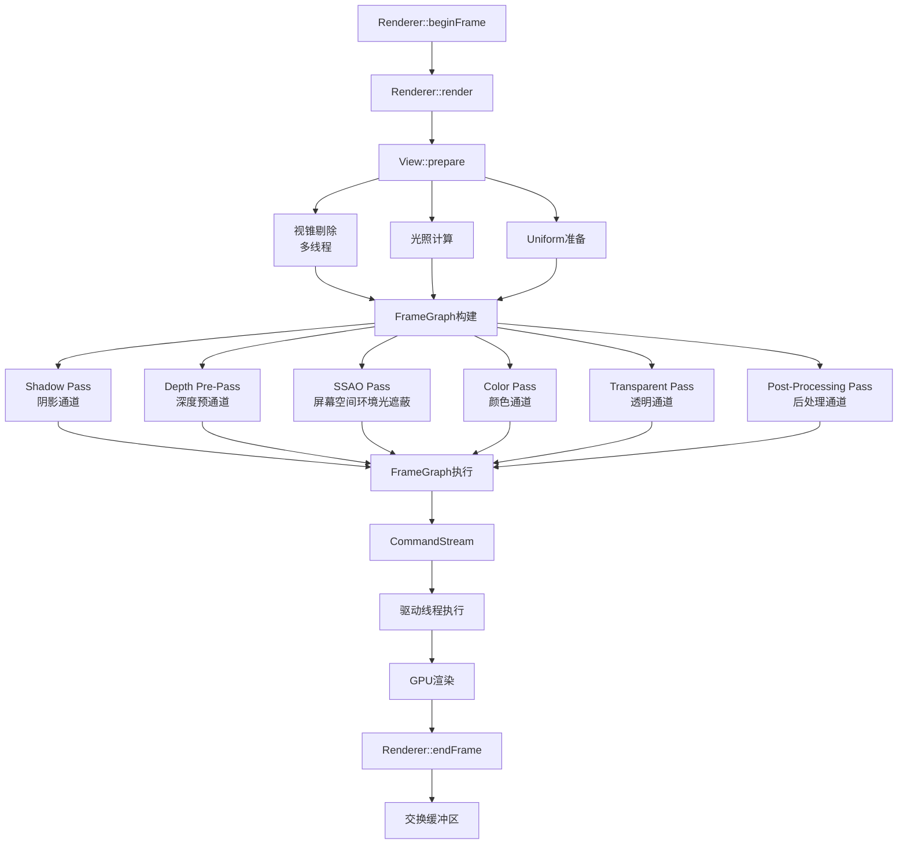

### 渲染通道详解

#### 1. Shadow Pass（阴影通道）

**目的**：为每个光源生成阴影贴图

**流程**：
```
1. 从光源视角渲染场景
2. 存储深度值到纹理（Shadow Map）
3. 在Color Pass中使用阴影贴图
```

**阴影类型**：
- **CSM（Cascaded Shadow Maps）**：级联阴影贴图（方向光）
- **Spot Shadow Maps**：聚光灯阴影贴图
- **Point Shadow Maps**：点光源阴影贴图（Cube Map）

#### 2. Depth Pre-Pass（深度预通道）

**目的**：提前渲染深度缓冲区，优化后续通道

**优势**：
- 减少不必要的片段着色器调用
- 优化深度测试性能
- 支持Early-Z优化

#### 3. Color Pass（颜色通道）

**目的**：主渲染通道，计算最终颜色

**步骤**：
1. **几何渲染**：渲染所有不透明对象
2. **PBR计算**：
   - 漫反射（Diffuse）
   - 镜面反射（Specular）
   - 法线贴图（Normal Mapping）
3. **光照计算**：
   - 直射光（Direct Light）
   - IBL环境光（Indirect Light）
   - 阴影（Shadow）
4. **输出**：GBuffer（几何缓冲区）

#### 4. Post-Processing Pass（后处理通道）

**步骤**：
1. **TAA（Temporal Anti-Aliasing）**：时间抗锯齿
2. **DoF（Depth of Field）**：景深
3. **Bloom**：泛光效果
4. **Tone Mapping**：色调映射
5. **Color Grading**：颜色分级
6. **FXAA**：快速近似抗锯齿

---

## FrameGraph 系统

### FrameGraph 概述

**目的**：管理渲染资源的**依赖关系**和**生命周期**

**核心概念**：
- **Resource（资源）**：纹理、缓冲区等
- **Pass（通道）**：渲染或计算过程
- **Dependency（依赖）**：资源之间的依赖关系

### FrameGraph 节点类型

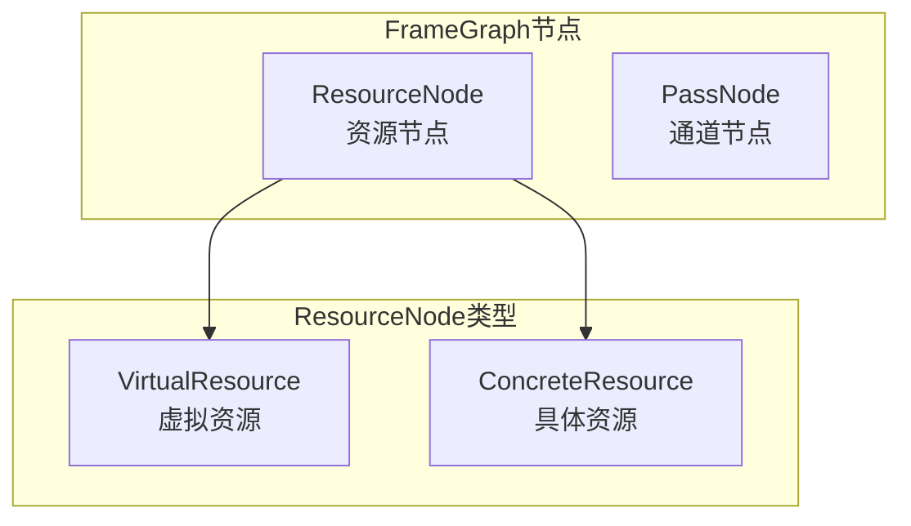

### 依赖关系

```
Resource → Pass  : 读取依赖（Pass 读取 Resource）
Pass → Resource  : 写入依赖（Pass 写入 Resource）
Resource → Resource : 资源关系（如 Mipmap 层级）
```

### FrameGraph 执行流程

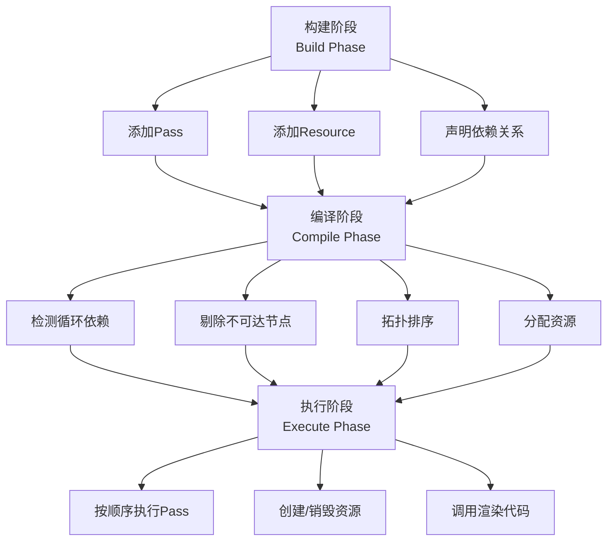

### FrameGraph 示例

**阴影渲染示例**：

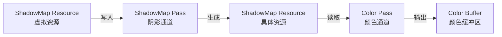

---

## 后端抽象层

### DriverApi（驱动API接口）

**职责**：
- 提供**统一的驱动接口**
- 抽象底层图形API差异
- 管理GPU资源

**关键接口**：

```cpp
class DriverApi {
public:
    // 缓冲区操作
    Handle<HwBufferObject> createBufferObject(...);
    void updateBufferObject(Handle<HwBufferObject> handle, 
                            BufferDescriptor const& data, ...);
    void destroyBufferObject(Handle<HwBufferObject> handle);
    
    // 纹理操作
    Handle<HwTexture> createTexture(...);
    void updateTexture(Handle<HwTexture> handle, ...);
    void destroyTexture(Handle<HwTexture> handle);
    
    // 渲染操作
    void beginRenderPass(RenderTargetHandle rt, ...);
    void draw(PipelineState const& pipeline, ...);
    void endRenderPass();
    
    // 同步操作
    void flush();
    void finish();
    Fence* createFence();
};
```

### 后端实现

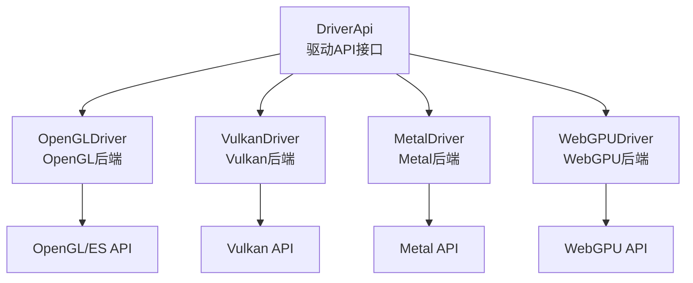

---

## 线程模型

### 多线程架构

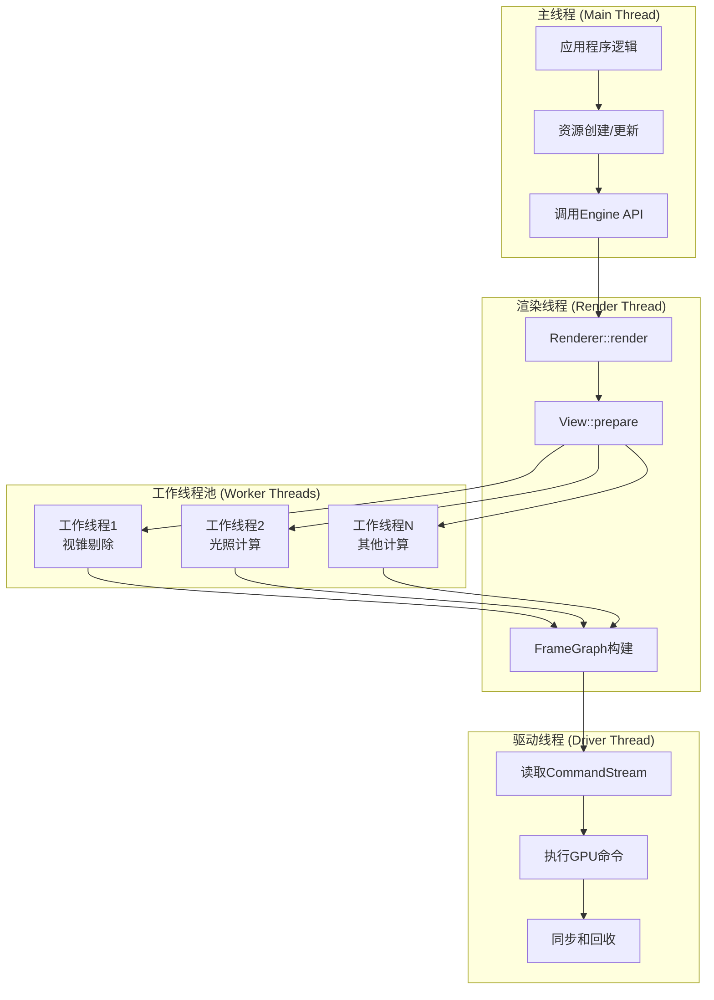

### 线程同步

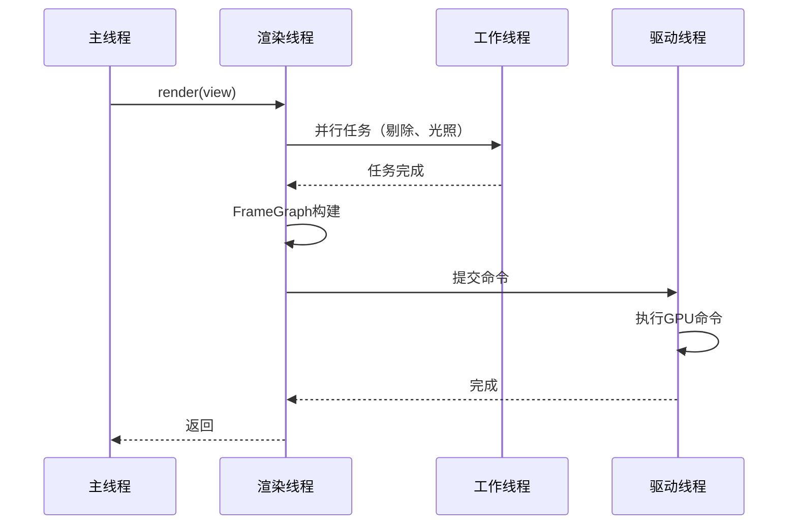

---

## 数据流分析

### 顶点数据流

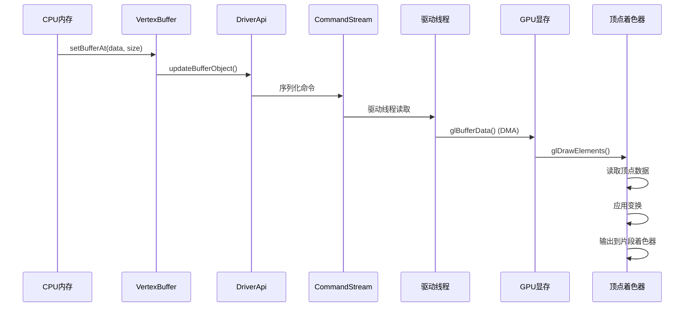

### 渲染命令流

```mermaid
graph LR
    A[应用程序] -->|1. 创建资源| B[Engine API]
    B -->|2. 序列化命令| C[CommandStream]
    C -->|3. 写入| D[CircularBuffer]
    D -->|4. 读取| E[驱动线程]
    E -->|5. 执行| F[后端API]
    F -->|6. GPU命令| G[GPU硬件]
```

---

## 内存管理

### 内存布局

```
┌─────────────────────────────────────────────────────────┐
│  Engine 内存布局                                          │
├─────────────────────────────────────────────────────────┤
│  Command Buffer Arena (默认 3MB)                         │
│  ┌───────────────────────────────────────────────────┐ │
│  │  Command Buffer 1 (minCommandBufferSizeMB)          │ │
│  ├───────────────────────────────────────────────────┤ │
│  │  Command Buffer 2 (minCommandBufferSizeMB)          │ │
│  ├───────────────────────────────────────────────────┤ │
│  │  Command Buffer 3 (minCommandBufferSizeMB)          │ │
│  └───────────────────────────────────────────────────┘ │
├─────────────────────────────────────────────────────────┤
│  Per-Render-Pass Arena (默认 3MB)                        │
│  ┌───────────────────────────────────────────────────┐ │
│  │  Per-Frame Commands (默认 2MB)                      │ │
│  ├───────────────────────────────────────────────────┤ │
│  │  Froxel Data                                        │ │
│  ├───────────────────────────────────────────────────┤ │
│  │  其他每帧数据                                        │ │
│  └───────────────────────────────────────────────────┘ │
├─────────────────────────────────────────────────────────┤
│  Driver Handle Arena (平台相关)                          │
│  - GPU资源句柄                                           │
│  - 纹理、缓冲区等                                        │
└─────────────────────────────────────────────────────────┘
```

### 资源生命周期

```mermaid
graph LR
    A[创建 Create] --> B[使用 Use]
    B --> C[更新 Update<br/>可选]
    C --> D[销毁 Destroy]
    B --> D
```

---

## 性能优化策略

### 1. 资源管理优化

- **批量更新**：批量更新变换矩阵
- **实例化渲染**：使用InstanceBuffer减少Draw Call
- **资源复用**：复用纹理、材质等资源

### 2. 渲染优化

- **视锥剔除**：自动剔除视锥外的对象
- **遮挡剔除**：使用遮挡查询优化
- **LOD系统**：根据距离使用不同细节级别

### 3. 内存优化

- **合理配置Arena大小**：根据应用需求调整
- **及时释放资源**：避免资源泄漏
- **使用资源池**：复用临时资源

### 4. 多线程优化

- **并行剔除**：多线程执行视锥剔除
- **异步上传**：异步上传顶点/纹理数据
- **命令批处理**：批量提交GPU命令

---

## 总结

### Filament 架构特点

1. **分层设计**
   - 清晰的层次划分
   - 每层职责明确
   - 易于维护和扩展

2. **多后端支持**
   - 统一的 Driver API
   - 支持 OpenGL/Vulkan/Metal/WebGPU
   - 平台无关的应用代码

3. **高性能**
   - 多线程渲染
   - 异步命令提交
   - SoA数据布局
   - 高效的资源管理

4. **ECS架构**
   - Entity-Component-System设计
   - 灵活的组件组合
   - 高效的组件查询

5. **FrameGraph系统**
   - 声明式资源依赖
   - 自动资源生命周期管理
   - 优化的渲染顺序

### 关键框架类总结

| 类名 | 职责 | 位置 |
|------|------|------|
| Engine | 引擎核心，资源管理 | `filament/include/filament/Engine.h` |
| Renderer | 渲染器，执行渲染循环 | `filament/include/filament/Renderer.h` |
| View | 视图，管理渲染视口和设置 | `filament/include/filament/View.h` |
| Scene | 场景，包含渲染对象 | `filament/include/filament/Scene.h` |
| Camera | 相机，控制视图和投影 | `filament/include/filament/Camera.h` |
| TransformManager | 变换管理器 | `filament/include/filament/TransformManager.h` |
| RenderableManager | 可渲染对象管理器 | `filament/include/filament/RenderableManager.h` |
| LightManager | 光源管理器 | `filament/include/filament/LightManager.h` |
| Material | 材质 | `filament/include/filament/Material.h` |
| VertexBuffer | 顶点缓冲区 | `filament/include/filament/VertexBuffer.h` |
| IndexBuffer | 索引缓冲区 | `filament/include/filament/IndexBuffer.h` |
| FrameGraph | 帧图系统 | `filament/src/fg/FrameGraph.h` |
| DriverApi | 驱动API接口 | `filament/backend/include/backend/DriverApi.h` |

---

**文档版本**：1.0  
**最后更新**：2024年  
**作者**：Filament学习文档

