# Filament 渲染引擎整体架构分析文档

## 目录

1. [架构概述](#架构概述)
2. [核心组件](#核心组件)
3. [系统架构图](#系统架构图)
4. [渲染管线](#渲染管线)
5. [线程模型](#线程模型)
6. [后端抽象层](#后端抽象层)
7. [资源管理](#资源管理)
8. [FrameGraph 系统](#framegraph-系统)
9. [数据流分析](#数据流分析)
10. [关键设计模式](#关键设计模式)
11. [性能优化策略](#性能优化策略)

---

## 架构概述

Filament 是 Google 开发的**物理基于渲染（PBR）**实时渲染引擎，采用**分层架构**设计，支持多后端（OpenGL、Vulkan、Metal、WebGPU）。

### 核心特性

- ✅ **多后端支持**：OpenGL、Vulkan、Metal、WebGPU
- ✅ **PBR 渲染**：基于物理的材质和光照模型
- ✅ **高性能**：多线程渲染、异步命令提交
- ✅ **现代特性**：延迟渲染、后处理、阴影系统
- ✅ **跨平台**：Android、iOS、Windows、Linux、macOS、Web

---

## 核心组件

### 1. Engine（引擎）

**职责**：
- Filament 的**主入口点**和**资源管理器**
- 管理所有渲染资源（纹理、缓冲区、材质等）
- 管理渲染线程和驱动线程
- 提供统一的资源创建/销毁接口

**关键特性**：
- **单例模式**：每个应用通常只有一个 Engine 实例
- **资源跟踪**：自动跟踪所有创建的资源，防止内存泄漏
- **线程管理**：创建并管理渲染线程和工作线程

**代码位置**：
- 公共接口：`filament/include/filament/Engine.h`
- 实现：`filament/src/details/Engine.h/cpp`

**典型用法**：
```cpp
Engine* engine = Engine::create();
// ... 创建资源
Engine::destroy(&engine);
```

### 2. Renderer（渲染器）

**职责**：
- 管理**渲染窗口**（SwapChain）
- 执行**渲染循环**（beginFrame → render → endFrame）
- 协调**多线程渲染**

**关键方法**：
```cpp
bool beginFrame(SwapChain* swapChain);  // 开始一帧
void render(View const* view);          // 渲染视图
void endFrame();                        // 结束一帧
```

**代码位置**：
- 公共接口：`filament/include/filament/Renderer.h`
- 实现：`filament/src/details/Renderer.h/cpp`

### 3. View（视图）

**职责**：
- 定义**渲染视口**（Viewport）
- 关联**场景**（Scene）和**相机**（Camera）
- 管理**渲染设置**（后处理、抗锯齿等）
- 执行**视锥剔除**（Frustum culling）

**关键组件**：
- `FView::prepare()`: 准备渲染数据（多线程执行）
- `Culler`: 视锥剔除器
- `Froxelizer`: 光照网格化（用于延迟渲染）
- `ShadowMapManager`: 阴影贴图管理

**代码位置**：
- 公共接口：`filament/include/filament/View.h`
- 实现：`filament/src/details/View.h/cpp`

### 4. Scene（场景）

**职责**：
- 包含所有**可渲染对象**（Renderables）
- 管理**光源**（Lights）
- 管理**天空盒**（Skybox）和**环境光**（IndirectLight）

**数据结构**：
- **Structure of Arrays (SoA)**：使用 SoA 布局存储渲染数据，提高缓存效率
- **可见性掩码**：每个渲染对象都有可见性掩码，用于多通道渲染

**代码位置**：
- 公共接口：`filament/include/filament/Scene.h`
- 实现：`filament/src/details/Scene.h/cpp`

### 5. Camera（相机）

**职责**：
- 定义**视图矩阵**（View matrix）
- 定义**投影矩阵**（Projection matrix）
- 控制**观察角度**和**视野**

**代码位置**：
- 公共接口：`filament/include/filament/Camera.h`
- 实现：`filament/src/details/Camera.h/cpp`

---

## 系统架构图

### 整体架构层次图

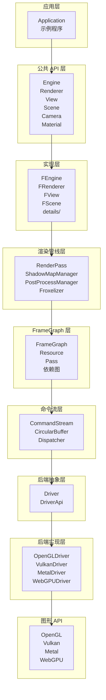

### 组件关系图

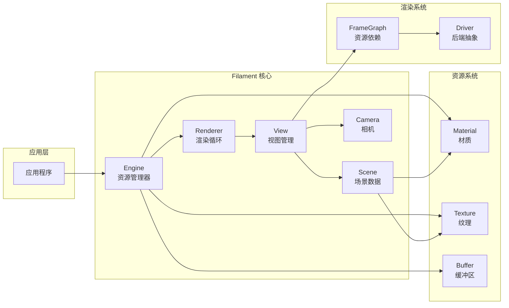

---

## 渲染管线

### 标准渲染流程

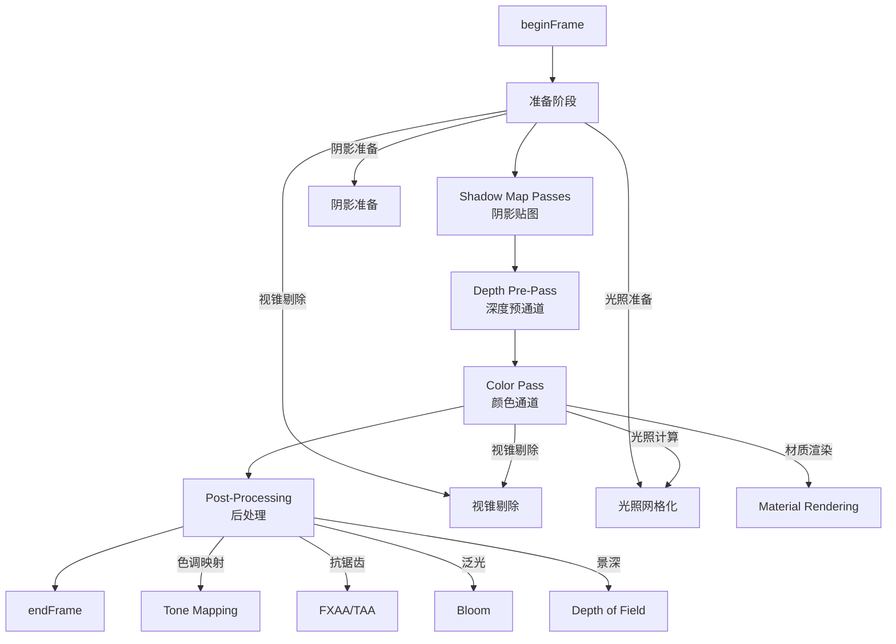

### 渲染管线详细说明

#### 1. Shadow Map Passes（阴影贴图通道）

**目的**：为每个需要阴影的光源生成阴影贴图

**流程**：
- 从光源视角渲染场景
- 存储深度值到纹理
- 在颜色通道中使用阴影贴图

**实现**：
- `ShadowMapManager`: 管理所有阴影贴图
- 支持级联阴影贴图（Cascaded Shadow Maps）

#### 2. Depth Pre-Pass（深度预通道）

**目的**：提前渲染深度缓冲区，优化后续渲染

**优势**：
- 减少像素着色器的执行次数
- 提高深度测试效率

#### 3. Color Pass（颜色通道）

**核心步骤**：

**a) 视锥剔除（Frustum Culling）**
```cpp
// FView::prepare() 中执行
Culler::Result cullingResult = culler.cull(
    viewFrustum, 
    renderables
);
```

**b) 光照网格化（Froxelization）**
- 将场景空间划分为网格（Froxels）
- 每个 Froxel 包含影响它的光源列表
- 用于延迟渲染的光照计算

**c) 渲染对象排序**
- 按材质分组
- 按深度排序（透明对象）
- 减少状态切换

**d) 绘制调用（Draw Calls）**
- 绑定材质和纹理
- 设置 Uniform 缓冲区
- 调用 `glDrawElements()` 等

#### 4. Post-Processing（后处理）

**常见效果**：
- **色调映射**：HDR → LDR 转换
- **抗锯齿**：FXAA（快速近似抗锯齿）或 TAA（时间抗锯齿）
- **泛光**：高光溢出效果
- **景深**：模拟相机焦点效果
- **环境光遮蔽**：SSAO/GTAO
- **屏幕空间反射**：SSR

**实现**：
- `PostProcessManager`: 管理所有后处理效果
- 使用 FrameGraph 管理资源依赖

---

## 线程模型

### 线程架构图

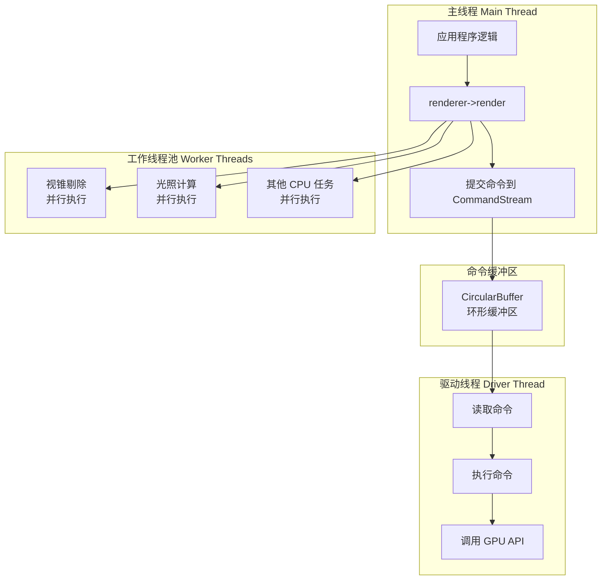

### 线程通信机制

**CommandStream（命令流）**：
- 主线程将命令序列化到 `CircularBuffer`
- 驱动线程从缓冲区读取并执行命令
- 实现**异步渲染**，主线程不阻塞

**关键代码流程**：
```cpp
// 主线程：提交命令
driverApi.updateBufferObject(handle, buffer, offset);

// 内部：序列化到 CircularBuffer
CommandStream::updateBufferObject(...) {
    // 创建命令对象并添加到缓冲区
}

// 驱动线程：执行命令
Driver::execute(buffer) {
    // 遍历命令并执行
    cmd->execute(*this);
}
```

### 线程安全规则

- **Engine API 不是线程安全的**：必须在同一线程调用
- **命令提交是线程安全的**：通过 CommandStream 实现
- **资源创建/销毁**：必须在主线程进行

---

## 后端抽象层

### 后端架构图

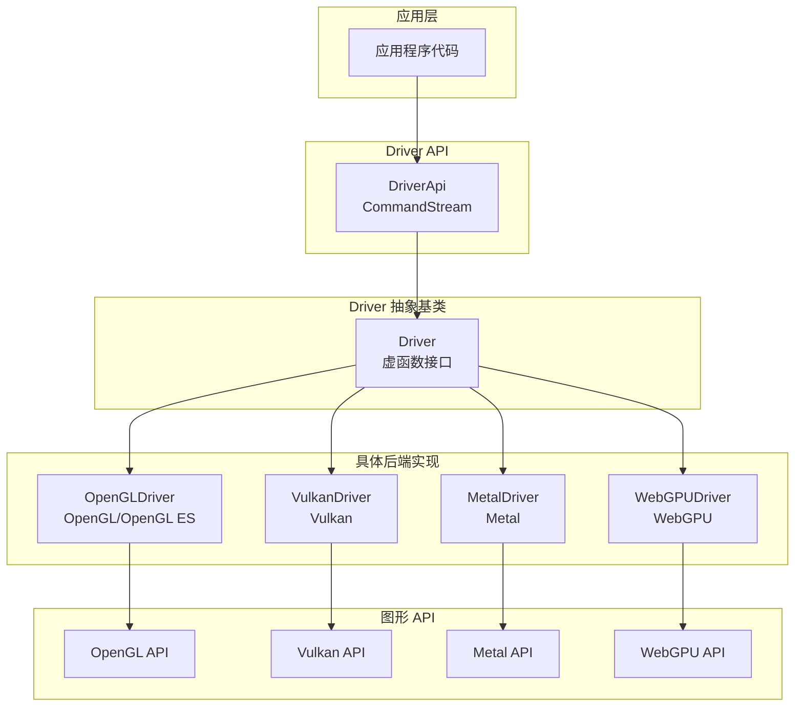

### Driver API 设计

**设计模式**：**命令模式** + **模板特化**

**关键组件**：

1. **Driver（抽象基类）**
   - 定义所有后端必须实现的接口
   - 位置：`filament/backend/include/private/backend/Driver.h`

2. **CommandStream（命令流）**
   - 类型别名：`using DriverApi = CommandStream`
   - 将 API 调用序列化为命令
   - 位置：`filament/backend/include/private/backend/CommandStream.h`

3. **Dispatcher（分发器）**
   - 将命令路由到具体后端
   - 使用函数指针表实现
   - 位置：`filament/backend/src/CommandStreamDispatcher.h`

4. **具体后端实现**
   - `OpenGLDriver`: OpenGL/OpenGL ES 实现
   - `VulkanDriver`: Vulkan 实现
   - `MetalDriver`: Metal 实现
   - `WebGPUDriver`: WebGPU 实现

### 后端切换

**优势**：
- **统一接口**：应用代码无需修改即可切换后端
- **性能优化**：每个后端可以针对特定 API 优化
- **平台支持**：不同平台使用最适合的后端

**示例**：
```cpp
// 创建引擎时选择后端
Engine* engine = Engine::create(Engine::Backend::OPENGL);
// 或
Engine* engine = Engine::create(Engine::Backend::VULKAN);
```

---

## 资源管理

### 资源类型

1. **缓冲区资源**
   - `VertexBuffer`: 顶点缓冲区
   - `IndexBuffer`: 索引缓冲区
   - `BufferObject`: 通用缓冲区对象

2. **纹理资源**
   - `Texture`: 2D/3D/Cube 纹理
   - 支持多种格式和采样器

3. **材质资源**
   - `Material`: 材质定义
   - `MaterialInstance`: 材质实例（可配置参数）

4. **渲染目标**
   - `RenderTarget`: 离屏渲染目标
   - `SwapChain`: 交换链（窗口）

### 资源生命周期

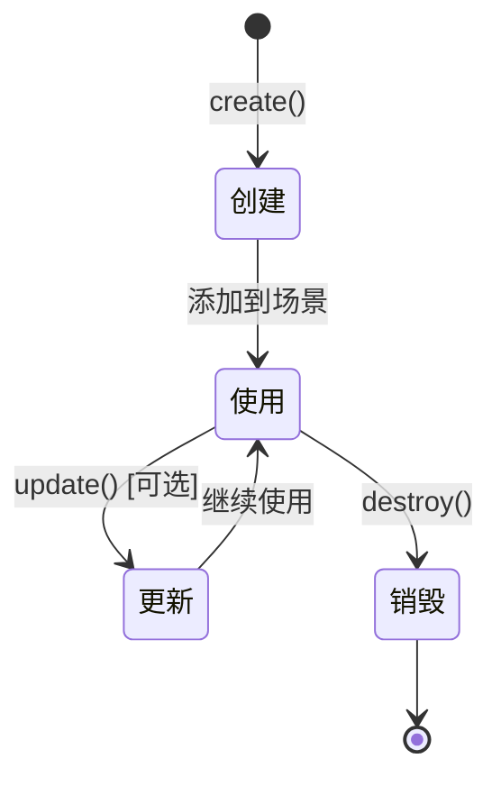

**资源跟踪**：
- Engine 跟踪所有创建的资源
- 销毁 Engine 时自动清理泄漏的资源
- 提供调试信息

### 句柄系统（Handle System）

**目的**：类型安全的资源标识符

**实现**：
```cpp
template<typename T>
class Handle {
    uint32_t mId;  // 资源ID
};
```

**优势**：
- **类型安全**：不同资源类型不能混用
- **有效性检查**：可以检测资源是否有效
- **生命周期管理**：支持资源自动清理

---

## FrameGraph 系统

### FrameGraph 概述

**目的**：管理渲染资源的**依赖关系**和**生命周期**

**核心概念**：
- **Resource（资源）**：纹理、缓冲区等
- **Pass（通道）**：渲染或计算过程
- **Dependency（依赖）**：资源之间的依赖关系

### FrameGraph 节点类型

1. **Resource Node（资源节点）**
   - 表示一个资源（通常是纹理）
   - 可以是虚拟资源（Virtual Resource）或具体资源（Concrete Resource）

2. **Pass Node（通道节点）**
   - 表示一个渲染或计算过程
   - 读取输入资源，写入输出资源

### FrameGraph 依赖关系图

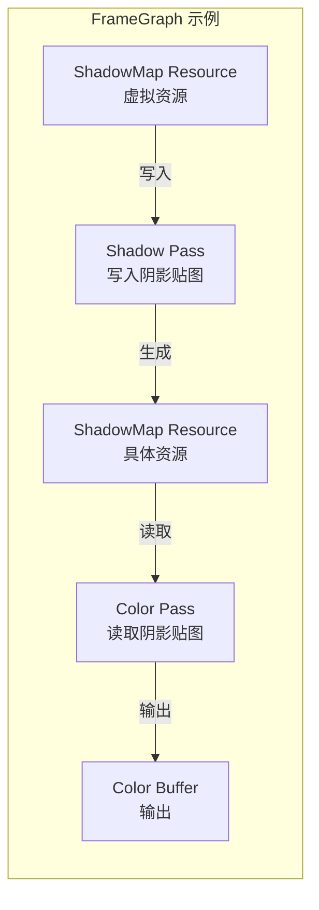

### FrameGraph 执行流程

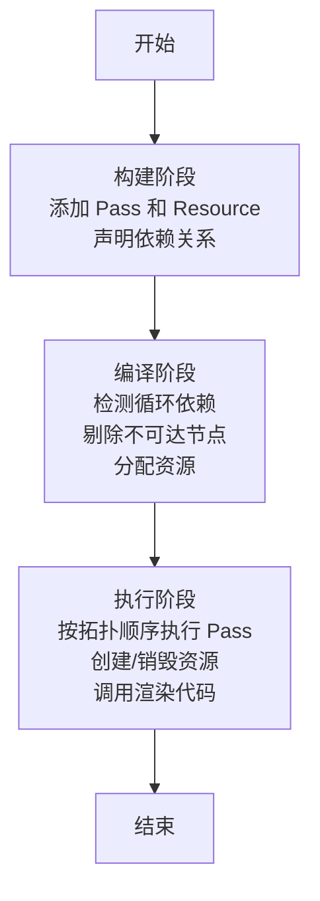

### FrameGraph 示例代码

```cpp
FrameGraph fg;

// 添加阴影贴图通道
auto shadowMap = fg.addPass("ShadowMap", [&](FrameGraph::Builder& builder) {
    auto output = builder.createTexture("ShadowMap", ...);
    builder.write(output);
    return output;
});

// 添加颜色通道
fg.addPass("Color", [&](FrameGraph::Builder& builder) {
    builder.read(shadowMap);  // 读取阴影贴图
    // ... 渲染代码
});

fg.execute(driver);
```

---

## 数据流分析

### 完整数据流图

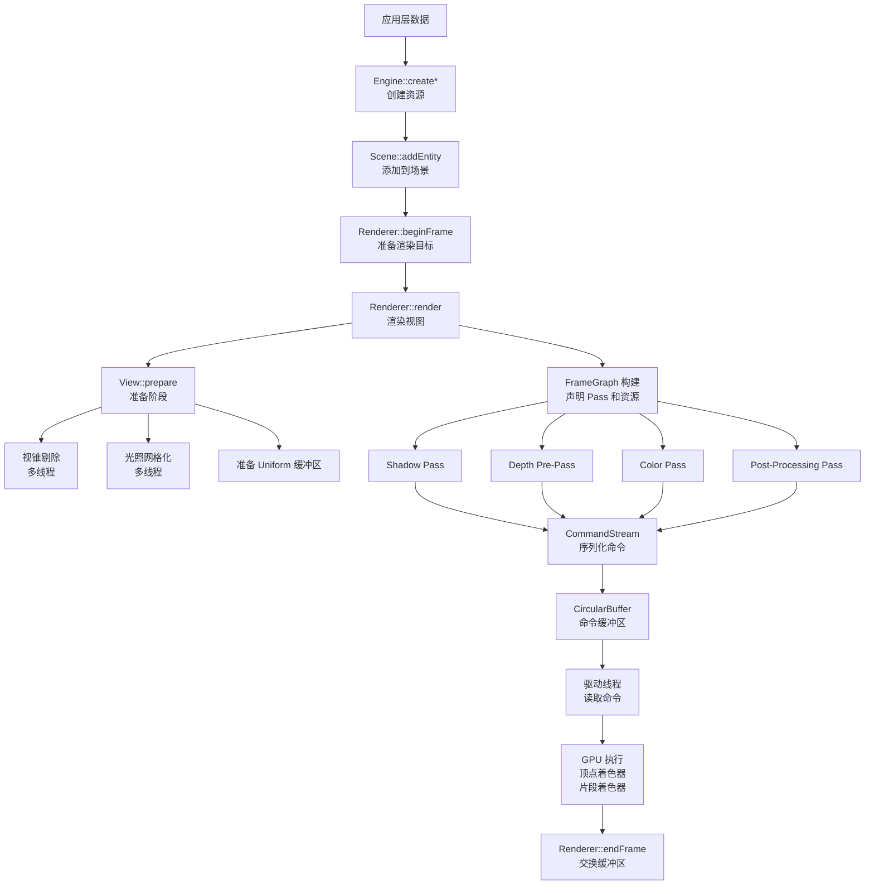

### 关键数据路径

#### 1. 顶点数据流

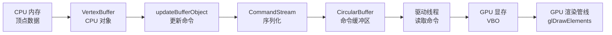

#### 2. 渲染命令流

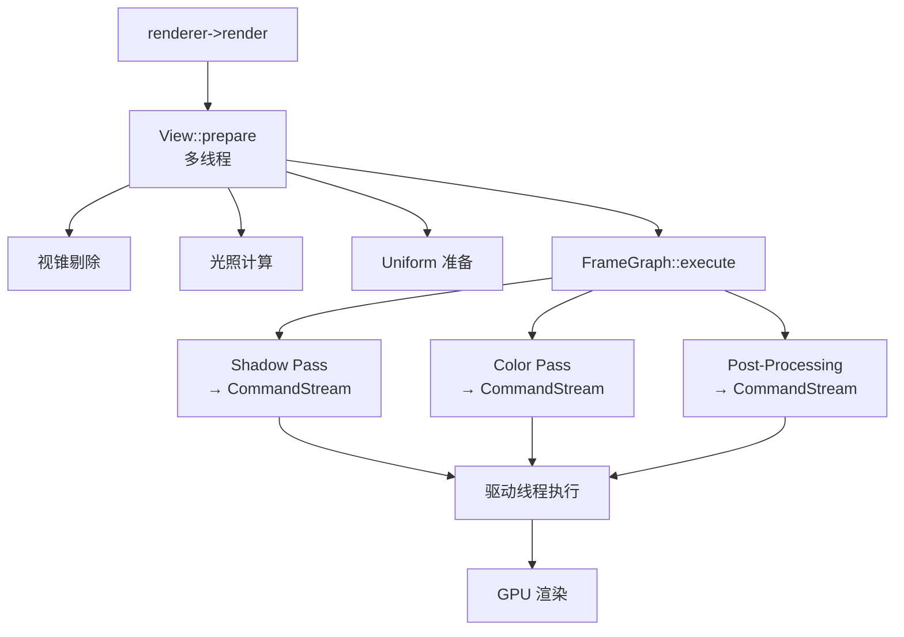

---

## 关键设计模式

### 1. 命令模式（Command Pattern）

**应用**：CommandStream 实现异步渲染

**优势**：
- 解耦命令的发起和执行
- 支持命令队列和撤销
- 实现异步渲染

### 2. 工厂模式（Factory Pattern）

**应用**：资源创建接口

**示例**：
```cpp
Engine::createTexture()
Engine::createMaterial()
Engine::createBuffer()
```

### 3. 观察者模式（Observer Pattern）

**应用**：资源生命周期管理

**实现**：Engine 跟踪所有资源，自动清理

### 4. 策略模式（Strategy Pattern）

**应用**：多后端切换

**实现**：Driver 抽象基类，具体后端实现

### 5. 模板特化（Template Specialization）

**应用**：类型安全的 API

**示例**：
```cpp
template<typename T>
Handle<T> createResource();
```

---

## 性能优化策略

### 1. 多线程并行

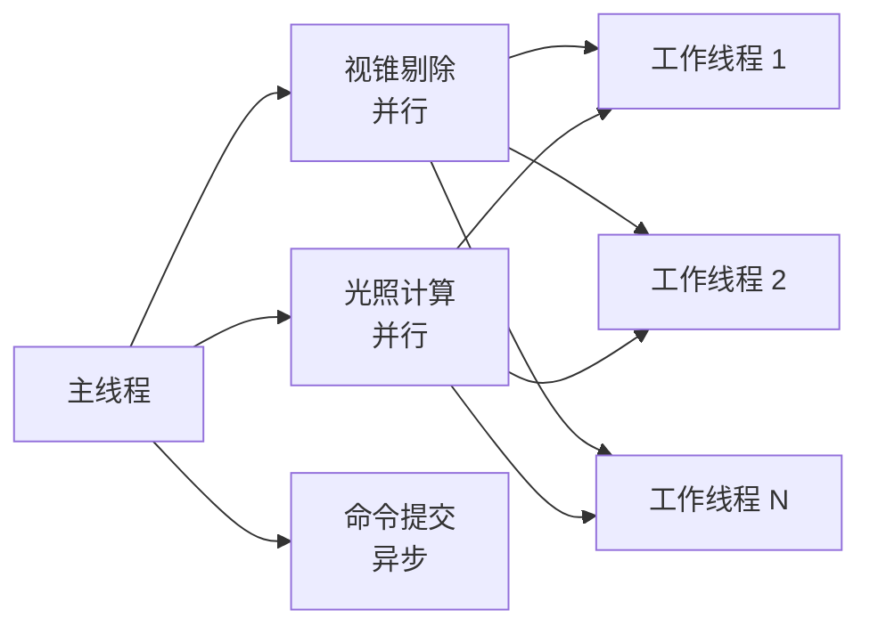

**优化点**：
- 视锥剔除并行化
- 光照计算并行化
- 命令提交异步化

### 2. 数据结构优化

**SoA（Structure of Arrays）布局**：
```cpp
// AoS (Array of Structures) - 传统方式
struct Renderable {
    mat4 transform;
    AABB boundingBox;
    Material* material;
};
Renderable renderables[N];

// SoA (Structure of Arrays) - Filament 方式
struct RenderableSoA {
    mat4 transforms[N];
    AABB boundingBoxes[N];
    Material* materials[N];
};
```

**优势**：
- 提高缓存效率
- 便于 SIMD 优化
- 减少内存碎片

### 3. 渲染优化

**优化技术**：
- **深度预通道**：提前渲染深度，减少像素着色器执行
- **视锥剔除**：剔除视锥外的对象
- **材质排序**：减少状态切换
- **实例化渲染**：批量渲染相同对象

### 4. 资源管理优化

**优化策略**：
- **资源池化**：重用资源对象
- **延迟分配**：按需创建资源
- **自动回收**：FrameGraph 自动管理资源生命周期

---

## 总结

### Filament 架构特点

1. **分层设计**
   - 清晰的层次划分
   - 每层职责明确
   - 易于维护和扩展

2. **多后端支持**
   - 统一的 Driver API
   - 支持 OpenGL/Vulkan/Metal/WebGPU
   - 平台无关的应用代码

3. **高性能**
   - 多线程渲染
   - 异步命令提交
   - 高效的资源管理

4. **灵活的资源管理**
   - FrameGraph 管理资源依赖
   - 自动资源分配和释放
   - 支持虚拟资源

5. **现代渲染特性**
   - PBR 材质
   - 延迟渲染
   - 后处理效果
   - 阴影和光照

### 关键设计模式总结

| 设计模式 | 应用场景 | 优势 |
|---------|---------|------|
| 命令模式 | CommandStream | 异步渲染、命令队列 |
| 工厂模式 | 资源创建 | 统一接口、资源管理 |
| 观察者模式 | 资源生命周期 | 自动清理、内存安全 |
| 策略模式 | 多后端切换 | 平台无关、易于扩展 |
| 模板特化 | 类型安全 API | 编译时检查、性能优化 |

### 性能优化总结

| 优化策略 | 实现方式 | 效果 |
|---------|---------|------|
| 多线程并行 | JobSystem、并行剔除 | 提高 CPU 利用率 |
| 数据结构优化 | SoA 布局 | 提高缓存效率 |
| 渲染优化 | 深度预通道、剔除 | 减少 GPU 负载 |
| 资源管理 | FrameGraph、资源池 | 减少内存分配 |

---

## 参考资料

- [Filament 官方文档](https://google.github.io/filament/)
- [FrameGraph 文档](docs_src/src_mdbook/src/notes/framegraph.md)
- **源码位置**：
  - Engine: `filament/src/details/Engine.h/cpp`
  - Renderer: `filament/src/details/Renderer.h/cpp`
  - View: `filament/src/details/View.h/cpp`
  - Scene: `filament/src/details/Scene.h/cpp`
  - FrameGraph: `filament/src/fg/FrameGraph.h/cpp`
  - Backend: `filament/backend/src/`

---

**文档版本**: 1.0  
**最后更新**: 2024  
**作者**: Filament 架构分析

