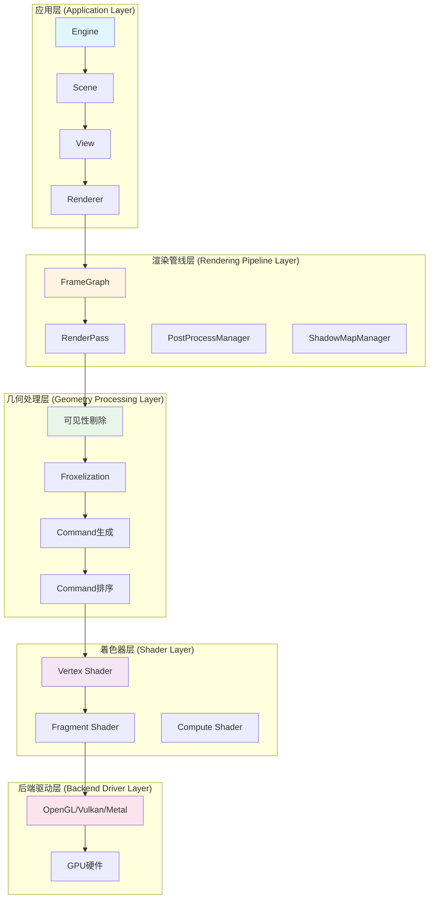
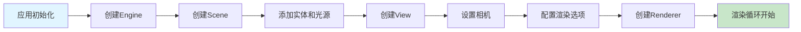
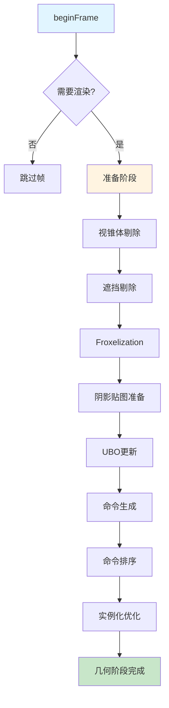
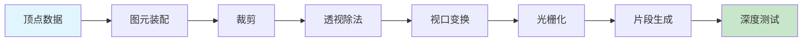
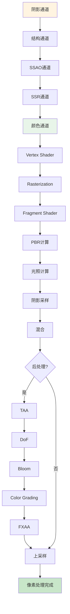
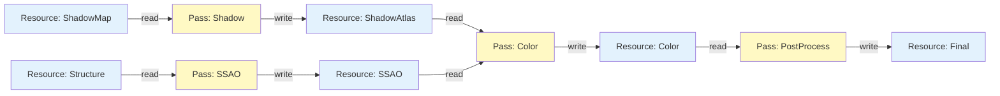
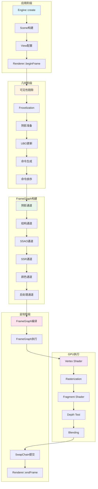
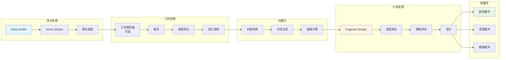

# Filament 渲染管线完整架构分析

## 目录

1. [概述](#概述)
2. [渲染管线整体架构](#渲染管线整体架构)
3. [应用阶段（Application Stage）](#应用阶段application-stage)
4. [几何阶段（Geometry Stage）](#几何阶段geometry-stage)
5. [光栅化阶段（Rasterization Stage）](#光栅化阶段rasterization-stage)
6. [像素处理阶段（Pixel Processing Stage）](#像素处理阶段pixel-processing-stage)
7. [渲染管线详细流程](#渲染管线详细流程)
8. [FrameGraph 资源管理](#framegraph-资源管理)
9. [完整流程图](#完整流程图)

---

## 概述

Filament 是一个跨平台的实时渲染引擎，其渲染管线采用现代 GPU 渲染架构，从应用层到底层驱动层形成完整的渲染流水线。本文档详细描述从应用阶段到最终呈现的完整渲染流程。

### 渲染管线核心概念

- **应用阶段**：场景管理、对象更新、可见性剔除
- **几何阶段**：顶点处理、图元装配、几何着色
- **光栅化阶段**：图元光栅化、片段生成
- **像素处理阶段**：片段着色、混合、后处理
- **呈现阶段**：帧缓冲交换、显示输出

---

## 渲染管线整体架构

### 架构层次图



---

## 应用阶段（Application Stage）

应用阶段是渲染管线的起始阶段，负责场景管理、对象更新和渲染准备工作。

### 1. Engine 初始化

```cpp
// 创建 Engine 实例
Engine* engine = Engine::create(backend, nullptr);

// Engine 负责：
// - 后端驱动管理（OpenGL/Vulkan/Metal）
// - 资源分配器管理
// - 多线程任务调度
// - 材质系统管理
```

### 2. Scene 场景构建

```cpp
Scene* scene = engine->createScene();

// 添加实体到场景
Entity entity = EntityManager::get().create();
scene->addEntity(entity);

// 添加渲染对象（Renderable）
RenderableManager::Builder(1)
    .boundingBox({{0, 0, 0}, {1, 1, 1}})
    .geometry(0, RenderableManager::PrimitiveType::TRIANGLES, vb, ib)
    .material(0, materialInstance)
    .build(*engine, entity);

// 添加光源
LightManager::Builder(LightManager::Type::SUN)
    .color(Color::toLinear<ACCURATE>({1.0f, 0.9f, 0.8f}))
    .intensity(100000.0f)
    .direction({0.0f, -1.0f, 0.0f})
    .castShadows(true)
    .build(*engine, lightEntity);

scene->addEntity(lightEntity);
```

### 3. View 视图设置

```cpp
View* view = engine->createView();

// 设置场景
view->setScene(scene);

// 设置相机
view->setCamera(camera);

// 配置渲染选项
view->setAntiAliasing(View::AntiAliasing::FXAA);
view->setToneMapping(View::ToneMapping::ACES);
view->setBloomOptions({
    .enabled = true,
    .strength = 0.5f,
    .resolution = 256,
    .levels = 5
});
```

### 4. Renderer 渲染器配置

```cpp
Renderer* renderer = engine->createRenderer();

// 设置显示信息
renderer->setDisplayInfo({
    .refreshRate = 60.0f
});

// 设置帧率选项
renderer->setFrameRateOptions({
    .headRoomRatio = 0.0f,
    .scaleRate = 1.0f / 8.0f,
    .history = 15,
    .interval = 1
});
```

### 应用阶段流程图



---

## 几何阶段（Geometry Stage）

几何阶段处理场景中的几何数据，包括可见性剔除、光照准备和渲染命令生成。

### 1. 帧开始（beginFrame）

```cpp
void renderLoop(Renderer* renderer, SwapChain* swapChain) {
    if (renderer->beginFrame(swapChain)) {
        // beginFrame 执行的操作：
        // 1. 帧节奏控制（Frame Pacing）
        // 2. SwapChain 资源准备
        // 3. 返回是否需要渲染当前帧
        renderer->render(view);
        renderer->endFrame();
    }
}
```

### 2. 可见性剔除（Culling）

```cpp
// FView::prepare() 中执行
void FView::prepareVisibleRenderables(FEngine& engine,
                                      CameraInfo const& cameraInfo) {
    // 1. 视锥体剔除（Frustum Culling）
    // 基于相机视锥体剔除不可见对象
    FScene::cullFrustum(renderableData, cameraInfo, visibleRenderables);
    
    // 2. 遮挡剔除（Occlusion Culling，如果启用）
    if (occlusionCullingEnabled) {
        FScene::cullOcclusion(renderableData, visibleRenderables);
    }
    
    // 3. 距离剔除（Distance Culling）
    // 剔除超出渲染距离的对象
    
    // 输出：可见渲染对象列表（Range<uint32_t>）
}
```

### 3. 光照准备（Lighting Preparation）

#### 3.1 Froxelization（点光源剔除）

```cpp
void Froxelizer::froxelize(FEngine& engine,
                           CameraInfo const& cameraInfo,
                           LightData const& lightData) {
    // 1. 将视锥体划分为 Froxel 网格
    //    通常为 16x9x24 的 3D 网格
    
    // 2. 对每个点光源：
    for (auto const& light : pointLights) {
        // 计算光源影响的 Froxel 范围
        auto froxelRange = calculateFroxelRange(light, cameraInfo);
        
        // 将光源添加到相应 Froxel 的光照列表
        for (auto froxel : froxelRange) {
            froxels[froxel].addLight(light);
        }
    }
    
    // 3. 上传 Froxel 数据到 GPU 缓冲区
    uploadFroxelBuffer(engine);
}
```

#### 3.2 阴影贴图准备

```cpp
void ShadowMapManager::update(FEngine& engine,
                              FView& view,
                              CameraInfo const& cameraInfo) {
    // 1. 方向光阴影（CSM - Cascaded Shadow Maps）
    if (hasDirectionalLight) {
        // 计算级联分割
        calculateCascadeSplits(cameraInfo, shadowOptions);
        
        // 为每个级联创建阴影贴图
        for (size_t c = 0; c < shadowCascades; c++) {
            createCascadeShadowMap(c, cameraInfo);
        }
    }
    
    // 2. 点光源阴影（6 面体阴影贴图）
    for (auto const& light : pointLights) {
        if (light.castShadows) {
            createPointLightShadowMap(light);
        }
    }
    
    // 3. 聚光灯阴影
    for (auto const& light : spotLights) {
        if (light.castShadows) {
            createSpotLightShadowMap(light);
        }
    }
}
```

### 4. UBO 更新（Uniform Buffer Update）

```cpp
void FView::updateUBOs(DriverApi& driver,
                       RenderableData const& renderableData,
                       Range<uint32_t> visibleRenderables) {
    // 为每个可见渲染对象更新 UBO
    for (uint32_t index : visibleRenderables) {
        auto& renderable = renderableData.elementAt<FScene::VISIBLE_MASK>(index);
        
        // 更新对象变换矩阵
        PerRenderableUib ubo;
        ubo.objectFromWorldMatrix = renderable.worldTransform;
        ubo.worldFromObjectMatrix = inverse(renderable.worldTransform);
        // ... 其他矩阵和参数
        
        // 写入 UBO
        driver.updateBufferObject(renderable.ubh, &ubo, sizeof(ubo), 0);
    }
}
```

### 5. 渲染命令生成（Command Generation）

```cpp
RenderPass RenderPassBuilder::build(FEngine& engine,
                                    DriverApi& driver) {
    // 1. 分配命令缓冲区
    size_t commandCount = calculateCommandCount(visibleRenderables);
    Command* commands = arena.alloc<Command>(commandCount);
    
    // 2. 生成渲染命令
    for (uint32_t index : visibleRenderables) {
        auto& renderable = renderableData.elementAt(index);
        
        // 创建绘制命令
        Command& cmd = commands[cmdIndex++];
        cmd.primitive = renderable.primitiveHandle;
        cmd.material = renderable.materialInstance;
        cmd.sortKey = calculateSortKey(renderable, variant);
        // ... 其他命令参数
    }
    
    // 3. 排序命令
    std::sort(commands, commands + commandCount,
              [](Command const& a, Command const& b) {
                  return a.sortKey < b.sortKey;
              });
    
    // 4. 实例化优化（Instanceify）
    instanceify(driver, commands, commandCount);
    
    return RenderPass(commands, commandCount);
}
```

### 几何阶段流程图



---

## 光栅化阶段（Rasterization Stage）

光栅化阶段将几何图元转换为像素片段，包括图元装配、裁剪、光栅化和深度测试。

### 1. 图元装配（Primitive Assembly）

GPU 硬件自动执行：
- 将顶点连接成图元（三角形）
- 执行裁剪（Clipping）
- 执行透视除法（Perspective Divide）
- 视口变换（Viewport Transform）

### 2. 光栅化（Rasterization）

GPU 硬件自动执行：
- 扫描转换（Scan Conversion）
- 片段生成（Fragment Generation）
- 插值计算（Interpolation）

### 3. 深度测试（Depth Testing）

```glsl
// Fragment Shader 中
void main() {
    // 深度值在硬件中自动处理
    // GPU 比较片段深度与深度缓冲区
    // 如果测试失败，片段被丢弃
}
```

### 光栅化阶段流程图



---

## 像素处理阶段（Pixel Processing Stage）

像素处理阶段执行片段着色、混合和后处理操作。

### 1. 阴影通道（Shadow Pass）

```cpp
FrameGraphId<FrameGraphTexture> ShadowMapManager::render(
        FEngine& engine, FrameGraph& fg,
        RenderPassBuilder const& passBuilder,
        FView& view, CameraInfo const& cameraInfo) {
    
    // 1. 为每个阴影贴图创建渲染通道
    for (auto const& shadowMap : mShadowMaps) {
        fg.addPass<ShadowPassData>("Shadow Pass",
            [&](FrameGraph::Builder& builder, auto& data) {
                // 创建阴影贴图纹理
                data.shadowTexture = builder.createTexture({
                    .width = shadowMapSize,
                    .height = shadowMapSize,
                    .format = TextureFormat::DEPTH24
                });
                
                builder.declareRenderPass("Shadow Target", {
                    .attachments = { .depth = data.shadowTexture },
                    .clearFlags = TargetBufferFlags::DEPTH
                });
            },
            [=](FrameGraphResources const& resources,
                auto const& data, DriverApi& driver) {
                // 渲染阴影投射者
                renderShadowCasters(shadowMap, passBuilder, driver);
            });
    }
    
    // 2. 打包阴影贴图到图集
    return packShadowMaps(fg, shadowTextures);
}
```

### 2. 结构通道（Structure Pass）

```cpp
std::pair<FrameGraphId<FrameGraphTexture>, FrameGraphId<FrameGraphTexture>>
PostProcessManager::structure(FrameGraph& fg,
                               RenderPassBuilder const& passBuilder,
                               RenderFlags renderFlags,
                               uint32_t width, uint32_t height) {
    
    // 创建深度纹理
    auto structure = fg.createTexture("Structure", {
        .width = width,
        .height = height,
        .format = TextureFormat::DEPTH24
    });
    
    // 深度预通道
    fg.addPass<StructurePassData>("Structure Pass",
        [&](FrameGraph::Builder& builder, auto& data) {
            data.structure = builder.write(structure,
                FrameGraphTexture::Usage::DEPTH_ATTACHMENT);
            
            builder.declareRenderPass("Structure Target", {
                .attachments = { .depth = data.structure },
                .clearFlags = TargetBufferFlags::DEPTH
            });
        },
        [=](FrameGraphResources const& resources,
            auto const& data, DriverApi& driver) {
            // 使用 DEPTH_VARIANT 渲染深度
            RenderPass depthPass = passBuilder
                .commandTypeFlags(CommandTypeFlags::DEPTH)
                .variant(Variant::DEPTH_VARIANT)
                .build(engine, driver);
            
            depthPass.getExecutor().execute(driver);
        });
    
    return { structure, picking };
}
```

### 3. SSAO 通道（Screen Space Ambient Occlusion）

```cpp
FrameGraphId<FrameGraphTexture> PostProcessManager::screenSpaceAmbientOcclusion(
        FrameGraph& fg, Viewport const& svp,
        CameraInfo const& cameraInfo,
        FrameGraphId<FrameGraphTexture> structure,
        AmbientOcclusionOptions const& options) {
    
    // 创建 SSAO 纹理
    auto ssao = fg.createTexture("SSAO", {
        .width = svp.width * options.resolution,
        .height = svp.height * options.resolution,
        .format = TextureFormat::R8
    });
    
    // SSAO 计算通道
    fg.addPass<SSAOPassData>("SSAO Pass",
        [&](FrameGraph::Builder& builder, auto& data) {
            data.structure = builder.sample(structure);
            data.ssao = builder.write(ssao,
                FrameGraphTexture::Usage::COLOR_ATTACHMENT);
        },
        [=](FrameGraphResources const& resources,
            auto const& data, DriverApi& driver) {
            // 执行 SSAO 计算（基于深度的环境光遮蔽）
            executeSSAO(resources, data, cameraInfo, options);
        });
    
    // 双边模糊
    if (options.bilateralThreshold > 0.0f) {
        ssao = bilateralBlur(fg, ssao, structure, options);
    }
    
    return ssao;
}
```

### 4. 颜色通道（Color Pass）

#### 4.1 Vertex Shader 处理

```glsl
// surface_main.vs
void main() {
    // 1. 顶点变换
    vec4 position = objectUniforms.objectFromWorldMatrix * vertex_position;
    vec4 worldPosition = vec4(position.xyz, 1.0);
    
    // 2. 视图变换
    vec4 viewPosition = frameUniforms.viewFromWorldMatrix * worldPosition;
    
    // 3. 投影变换
    gl_Position = frameUniforms.clipFromViewMatrix * viewPosition;
    
    // 4. 法线变换
    vertex_normal = mat3(objectUniforms.normalFromWorldMatrix) * vertex_normal;
    
    // 5. 切线变换（如果存在）
    vertex_tangent = mat3(objectUniforms.normalFromWorldMatrix) * vertex_tangent;
    
    // 6. UV 坐标传递
    vertex_uv01 = vertex_uv0;
}
```

#### 4.2 Fragment Shader 处理

```glsl
// surface_main.fs
void main() {
    // 1. 材质参数初始化
    MaterialInputs material;
    initMaterial(material);
    
    // 2. 用户材质代码执行
    material(material);
    
    // 3. PBR 计算
    vec3 color = calculatePBR(
        material.baseColor.rgb,
        vertex_normal,
        getWorldPosition(),
        material.roughness,
        material.metallic,
        material.ambientOcclusion
    );
    
    // 4. 光照计算
    // 方向光
    color += calculateDirectionalLight(
        material.baseColor.rgb,
        material.roughness,
        material.metallic,
        vertex_normal
    );
    
    // 点光源（Froxel）
    color += calculatePointLights(
        material.baseColor.rgb,
        material.roughness,
        material.metallic,
        vertex_normal,
        getWorldPosition()
    );
    
    // 5. 阴影采样
    float shadow = sampleShadowMap(
        shadowUniforms.shadowMap,
        shadowPosition
    );
    color *= shadow;
    
    // 6. SSAO 采样
    float ao = texture(ssaoTexture, screenUV).r;
    color *= ao;
    
    // 7. SSR 采样（如果启用）
    vec3 reflection = texture(ssrTexture, screenUV).rgb;
    color = mix(color, reflection, material.reflectance);
    
    // 8. 输出颜色
    colorOutput = vec4(color, material.baseColor.a);
}
```

#### 4.3 颜色通道执行

```cpp
RendererUtils::ColorPassOutput RendererUtils::colorPass(
        FrameGraph& fg, const char* name, FEngine& engine, FView const& view,
        ColorPassInput const& colorPassInput,
        FrameGraphTexture::Descriptor const& colorBufferDesc,
        ColorPassConfig const& config,
        PostProcessManager::ColorGradingConfig const colorGradingConfig,
        RenderPass::Executor passExecutor) {
    
    // 创建颜色和深度缓冲区
    auto color = fg.createTexture("Color Buffer", colorBufferDesc);
    auto depth = fg.createTexture("Depth Buffer", {
        .width = colorBufferDesc.width,
        .height = colorBufferDesc.height,
        .format = TextureFormat::DEPTH32F
    });
    
    // 颜色通道
    fg.addPass<ColorPassData>("Color Pass",
        [&](FrameGraph::Builder& builder, auto& data) {
            // 采样输入纹理
            data.shadows = builder.sample(colorPassInput.shadows);
            data.ssao = builder.sample(colorPassInput.ssao);
            data.ssr = builder.sample(colorPassInput.ssr);
            data.structure = builder.sample(colorPassInput.structure);
            
            // 写入颜色和深度
            data.color = builder.write(color,
                FrameGraphTexture::Usage::COLOR_ATTACHMENT);
            data.depth = builder.write(depth,
                FrameGraphTexture::Usage::DEPTH_ATTACHMENT);
            
            builder.declareRenderPass("Color Target", {
                .attachments = {
                    .color = { data.color },
                    .depth = data.depth
                },
                .clearFlags = config.clearFlags
            });
        },
        [=](FrameGraphResources const& resources,
            auto const& data, DriverApi& driver) {
            // 绑定资源
            view.prepareSSAO(resources.getTexture(data.ssao));
            view.prepareSSR(resources.getTexture(data.ssr));
            view.prepareShadowMapping(engine,
                resources.getTexture(data.shadows));
            
            // 执行渲染通道
            passExecutor.execute(driver);
        });
    
    return { color, depth };
}
```

### 5. 后处理通道（Post-Processing Pass）

#### 5.1 TAA（Temporal Anti-Aliasing）

```cpp
FrameGraphId<FrameGraphTexture> PostProcessManager::taa(
        FrameGraph& fg,
        FrameGraphId<FrameGraphTexture> input,
        FrameGraphId<FrameGraphTexture> depth,
        FrameHistory const& frameHistory,
        TemporalAntiAliasingOptions const& options) {
    
    // 1. 获取历史帧
    auto history = frameHistory.getPrevious();
    
    // 2. 重投影历史帧到当前帧
    auto reprojected = reprojectHistory(history, depth, cameraInfo);
    
    // 3. 混合当前帧和历史帧
    auto output = blendFrames(input, reprojected, options);
    
    // 4. 保存当前帧作为历史
    frameHistory.saveCurrent(input);
    
    return output;
}
```

#### 5.2 Bloom（泛光）

```cpp
std::pair<FrameGraphId<FrameGraphTexture>, FrameGraphId<FrameGraphTexture>>
PostProcessManager::bloom(
        FrameGraph& fg,
        FrameGraphId<FrameGraphTexture> input,
        TextureFormat format,
        BloomOptions const& options) {
    
    // 1. 提取亮部
    auto bright = extractBrightness(fg, input, options.threshold);
    
    // 2. 多级下采样
    auto downsampled = downsampleMipChain(fg, bright, options.levels);
    
    // 3. 上采样并混合
    auto bloom = upsampleAndBlend(fg, downsampled, options);
    
    // 4. 镜头光晕（可选）
    auto flare = calculateLensFlare(fg, bloom, options);
    
    return { bloom, flare };
}
```

#### 5.3 颜色分级（Color Grading）

```cpp
FrameGraphId<FrameGraphTexture> PostProcessManager::colorGrading(
        FrameGraph& fg,
        FrameGraphId<FrameGraphTexture> input,
        Viewport const& viewport,
        FrameGraphId<FrameGraphTexture> bloom,
        FrameGraphId<FrameGraphTexture> flare,
        ColorGrading* colorGrading,
        ColorGradingConfig const& config,
        BloomOptions const& bloomOptions,
        VignetteOptions const& vignetteOptions) {
    
    // 1. 色调映射（Tone Mapping）
    // 将 HDR 转换为 LDR
    
    // 2. Bloom 混合
    // 将泛光效果混合到颜色中
    
    // 3. 颜色分级 LUT 应用
    // 使用颜色分级查找表调整颜色
    
    // 4. 暗角（Vignette）应用
    // 应用暗角效果
    
    // 5. 抖动（Dithering）
    // 减少颜色条带
    
    return output;
}
```

### 像素处理阶段流程图



---

## 渲染管线详细流程

### 完整渲染循环

```cpp
void renderLoop(Renderer* renderer, SwapChain* swapChain, View* view) {
    while (!quit) {
        // ========== 应用阶段 ==========
        // 1. 更新场景（应用程序负责）
        updateScene(scene);
        
        // 2. 开始帧
        if (renderer->beginFrame(swapChain)) {
            // ========== 几何阶段 ==========
            // 3. 渲染 View
            renderer->render(view);
            // 内部执行：
            //   - 可见性剔除
            //   - Froxelization
            //   - 阴影贴图生成
            //   - UBO 更新
            //   - 命令生成和排序
            //   - FrameGraph 构建
            
            // ========== 光栅化和像素处理 ==========
            // 4. 结束帧（提交到 GPU）
            renderer->endFrame();
            // 内部执行：
            //   - FrameGraph 编译
            //   - FrameGraph 执行
            //   - GPU 命令提交
        }
    }
}
```

### render() 函数详细流程

```cpp
void FRenderer::renderInternal(FView const* view, bool flush) {
    // ========== 1. 准备阶段 ==========
    // 1.1 配置渲染选项
    bool hasPostProcess = view->hasPostProcessPass();
    float2 scale = view->updateScale(...);
    auto msaaOptions = view->getMultiSampleAntiAliasingOptions();
    
    // 1.2 计算相机信息
    CameraInfo cameraInfo = view->computeCameraInfo(engine);
    
    // 1.3 创建 FrameGraph
    FrameGraph fg(*mResourceAllocator);
    auto& blackboard = fg.getBlackboard();
    
    // ========== 2. View 准备 ==========
    view->prepare(engine, driver, rootArenaScope, svp, cameraInfo, ...);
    // 内部执行：
    //   - 可见性剔除
    //   - Froxelization
    //   - UBO 更新
    //   - 描述符堆提交
    
    // ========== 3. 阴影通道 ==========
    if (view->needsShadowMap()) {
        auto shadows = view->renderShadowMaps(engine, fg, cameraInfo, ...);
        blackboard["shadows"] = shadows;
    }
    
    // ========== 4. 结构通道 ==========
    auto [structure, picking] = ppm.structure(fg, passBuilder, ...);
    
    // ========== 5. SSAO 通道 ==========
    if (aoOptions.enabled) {
        auto ssao = ppm.screenSpaceAmbientOcclusion(fg, svp, cameraInfo, structure, aoOptions);
        blackboard["ssao"] = ssao;
    }
    
    // ========== 6. SSR 通道 ==========
    if (ssReflectionsOptions.enabled) {
        auto reflections = ppm.ssr(fg, passBuilder, ...);
        generateMipmapSSR(fg, reflections, ...);
    }
    
    // ========== 7. 颜色通道 ==========
    // 7.1 构建 RenderPass
    RenderPassBuilder passBuilder(commandArena);
    passBuilder.renderFlags(renderFlags);
    passBuilder.variant(variant);
    passBuilder.camera(cameraInfo.getPosition(), cameraInfo.getForwardVector());
    passBuilder.geometry(scene->getRenderableData(), view->getVisibleRenderables());
    passBuilder.commandTypeFlags(CommandTypeFlags::COLOR);
    
    RenderPass pass = passBuilder.build(engine, driver);
    
    // 7.2 执行颜色通道
    auto colorPassOutput = RendererUtils::colorPass(fg, "Color Pass", engine, view, {
        .shadows = blackboard.get<FrameGraphTexture>("shadows"),
        .ssao = blackboard.get<FrameGraphTexture>("ssao"),
        .ssr = ssrConfig.ssr,
        .structure = structure
    }, colorBufferDesc, config, colorGradingConfig, pass.getExecutor());
    
    // ========== 8. 后处理通道 ==========
    FrameGraphId<FrameGraphTexture> input = colorPassOutput.linearColor;
    
    if (hasPostProcess) {
        // 8.1 解析深度缓冲
        auto depth = ppm.resolve(fg, "Resolved Depth Buffer", colorPassOutput.depth, ...);
        
        // 8.2 TAA
        if (taaOptions.enabled) {
            input = ppm.taa(fg, input, depth, view->getFrameHistory(), ...);
        }
        
        // 8.3 DoF
        if (dofOptions.enabled) {
            input = ppm.dof(fg, input, depth, cameraInfo, ...);
        }
        
        // 8.4 Bloom
        FrameGraphId<FrameGraphTexture> bloom, flare;
        if (bloomOptions.enabled) {
            auto [bloom_, flare_] = ppm.bloom(fg, input, ...);
            bloom = bloom_;
            flare = flare_;
        }
        
        // 8.5 Color Grading
        if (hasColorGrading) {
            input = ppm.colorGrading(fg, input, xvp, bloom, flare, ...);
        }
        
        // 8.6 FXAA
        if (hasFXAA) {
            input = ppm.fxaa(fg, input, xvp, ...);
        }
        
        // 8.7 上采样
        if (scaled) {
            input = ppm.upscale(fg, needsAlphaChannel, ...);
        }
    }
    
    // ========== 9. 呈现阶段 ==========
    // 9.1 转发资源到渲染目标
    fg.forwardResource(fgViewRenderTarget, input);
    
    // 9.2 呈现
    fg.present(fgViewRenderTarget);
    
    // 9.3 编译 FrameGraph
    fg.compile();
    // 内部执行：
    //   - 构建依赖图
    //   - 拓扑排序
    //   - 资源分配
    //   - 通道剔除
    
    // 9.4 执行 FrameGraph
    fg.execute(driver);
    // 内部执行：
    //   - 按依赖顺序执行所有通道
    //   - 绑定资源
    //   - 执行渲染命令
}
```

---

## FrameGraph 资源管理

### FrameGraph 核心概念

FrameGraph 是一个资源依赖图，用于管理渲染管线中的资源分配和执行顺序。

#### 1. 资源节点（Resource Node）

```cpp
// 资源节点表示一个纹理资源
FrameGraphId<FrameGraphTexture> texture = fg.createTexture("My Texture", {
    .width = 1920,
    .height = 1080,
    .format = TextureFormat::RGBA16F
});
```

#### 2. 通道节点（Pass Node）

```cpp
// 通道节点表示一个渲染或计算过程
fg.addPass<MyPassData>("My Pass",
    // 声明阶段：声明资源依赖
    [&](FrameGraph::Builder& builder, auto& data) {
        // 读取资源
        data.input = builder.sample(inputTexture);
        // 写入资源
        data.output = builder.write(outputTexture,
            FrameGraphTexture::Usage::COLOR_ATTACHMENT);
        // 声明渲染目标
        builder.declareRenderPass("My Target", {
            .attachments = { .color = { data.output } }
        });
    },
    // 执行阶段：实际执行渲染
    [=](FrameGraphResources const& resources,
        auto const& data, DriverApi& driver) {
        // 获取实际资源
        auto texture = resources.get(data.output);
        // 执行渲染
        renderSomething(driver, texture);
    });
```

#### 3. 依赖关系



#### 4. FrameGraph 编译

```cpp
void FrameGraph::compile() {
    // 1. 构建依赖图
    buildDependencyGraph();
    
    // 2. 剔除不可达节点
    dependencyGraph.cull();
    
    // 3. 拓扑排序
    auto executionOrder = topologicalSort();
    
    // 4. 资源分配
    allocateResources();
    // 优化：复用相同大小的资源
    
    // 5. 构建执行计划
    buildExecutionPlan();
}
```

#### 5. FrameGraph 执行

```cpp
void FrameGraph::execute(DriverApi& driver) {
    // 按拓扑顺序执行所有通道
    for (auto const& passNode : mExecutionOrder) {
        // 1. 绑定资源
        bindResources(passNode, driver);
        
        // 2. 执行通道
        passNode.execute(driver);
        
        // 3. 释放资源（如果不再使用）
        releaseResources(passNode);
    }
}
```

---

## 完整流程图

### 整体渲染管线流程图



### 详细渲染通道流程图

```mermaid
graph TD
    Start[Renderer::render] --> Prep[准备阶段]
    
    Prep --> Shadow{需要阴影?}
    Shadow -->|是| ShadowPass[阴影通道]
    Shadow -->|否| Structure
    ShadowPass --> Structure[结构通道]
    
    Structure --> SSAO{需要SSAO?}
    SSAO -->|是| SSAOPass[SSAO通道]
    SSAO -->|否| SSR
    SSAOPass --> SSR{需要SSR?}
    SSR -->|是| SSRPass[SSR通道]
    SSR -->|否| Color
    SSRPass --> Color[颜色通道]
    
    Color --> ColorDepth[深度子通道]
    ColorDepth --> ColorOpaque[不透明对象]
    ColorOpaque --> ColorRefract{屏幕空间折射?}
    ColorRefract -->|是| ColorRefractPass[折射对象]
    ColorRefract -->|否| ColorBlend
    ColorRefractPass --> ColorBlend[透明对象]
    
    ColorBlend --> PostProcess{需要后处理?}
    PostProcess -->|是| PostStart[后处理开始]
    PostProcess -->|否| Present
    
    PostStart --> TAA{需要TAA?}
    TAA -->|是| TAAPass[TAA通道]
    TAA -->|否| DoF
    TAAPass --> DoF{需要DoF?}
    DoF -->|是| DoFPass[DoF通道]
    DoF -->|否| Bloom
    DoFPass --> Bloom{需要Bloom?}
    Bloom -->|是| BloomPass[Bloom通道]
    Bloom -->|否| ColorGrading
    BloomPass --> ColorGrading[颜色分级]
    ColorGrading --> FXAA{需要FXAA?}
    FXAA -->|是| FXAAPass[FXAA通道]
    FXAA -->|否| Upscale
    FXAAPass --> Upscale{需要上采样?}
    Upscale -->|是| UpscalePass[上采样通道]
    Upscale -->|否| Present
    UpscalePass --> Present[呈现阶段]
    
    Present --> FrameGraphCompile[FrameGraph编译]
    FrameGraphCompile --> FrameGraphExecute[FrameGraph执行]
    FrameGraphExecute --> End[结束]
    
    style Start fill:#e1f5ff
    style Color fill:#fff4e1
    style PostStart fill:#e8f5e9
    style Present fill:#f3e5f5
    style End fill:#c8e6c9
```



### GPU 渲染管线详细流程图



---

## 总结

Filament 的渲染管线是一个完整的、分层的渲染系统，从应用层的场景管理到底层的 GPU 执行，形成了清晰的流水线：

1. **应用阶段**：负责场景构建、对象管理和渲染配置
2. **几何阶段**：执行可见性剔除、光照准备和命令生成
3. **光栅化阶段**：GPU 硬件自动处理图元到片段的转换
4. **像素处理阶段**：执行片段着色、混合和后处理
5. **呈现阶段**：FrameGraph 管理资源依赖和执行顺序

### 关键特性

- **FrameGraph**：自动管理资源依赖，优化资源分配
- **多通道架构**：清晰的通道划分，便于优化和扩展
- **延迟执行**：编译时优化，运行时高效
- **自动优化**：通道剔除、资源复用、命令排序和实例化

该架构在保证渲染质量的同时，最大化利用了 GPU 资源，实现了跨平台的高性能渲染。

---

## 参考

- Filament 源代码：`filament/src/details/Renderer.cpp`
- FrameGraph 实现：`filament/src/fg/FrameGraph.cpp`
- RenderPass 实现：`filament/src/RenderPass.cpp`
- PostProcessManager：`filament/src/PostProcessManager.cpp`

