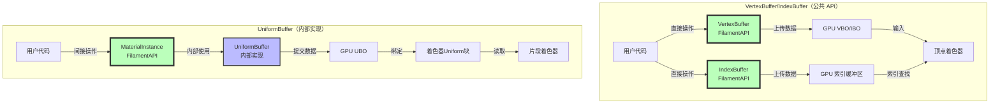
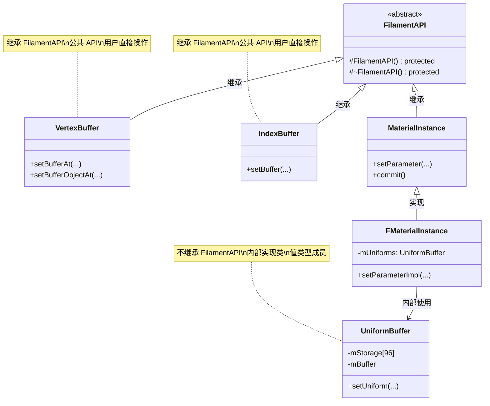
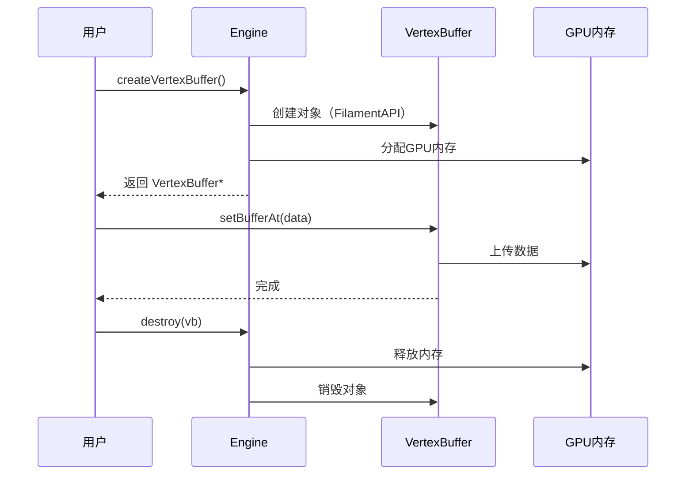
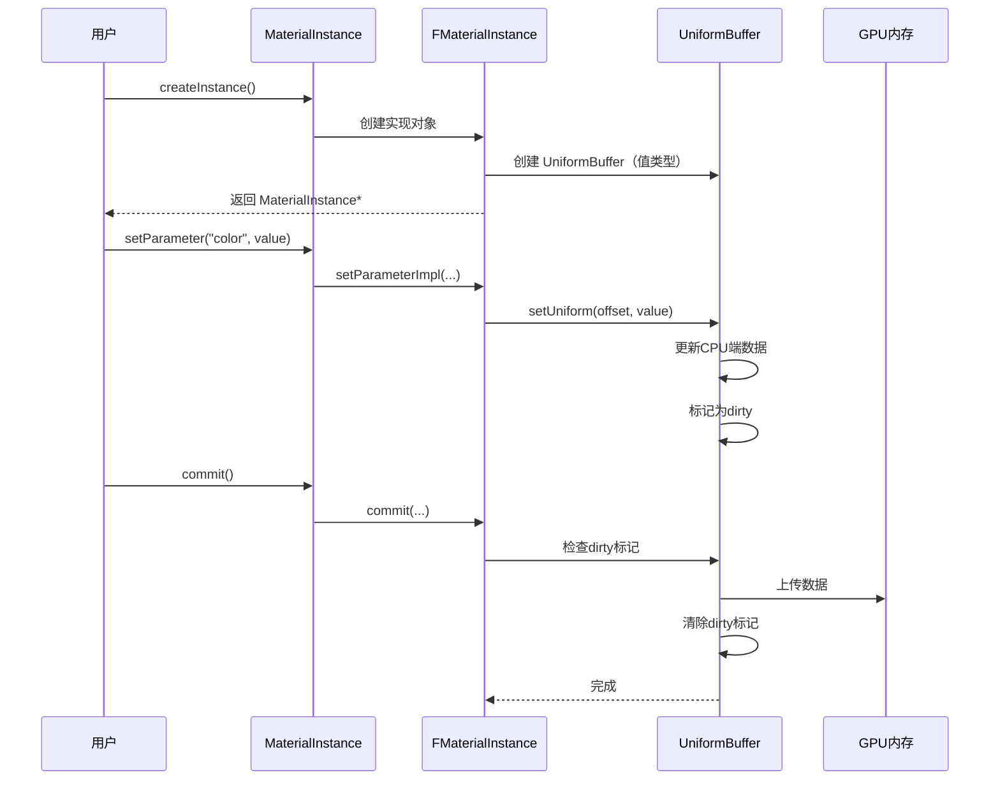
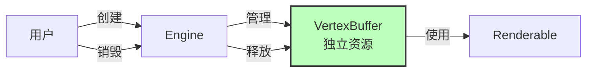
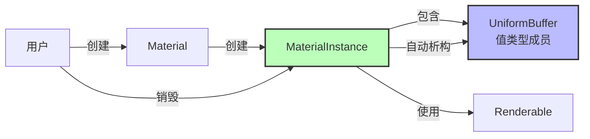
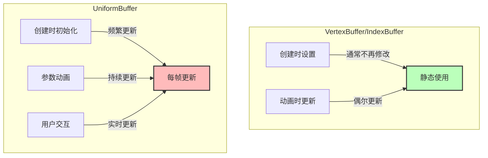

# 为什么 UniformBuffer 不设计成公共 API

## 目录
1. [概述](#概述)
2. [UniformBuffer vs VBO/IBO 核心区别](#uniformbuffer-vs-vboibo-核心区别)
3. [UniformBuffer 的设计定位](#uniformbuffer-的设计定位)
4. [为什么不设计成公共 API](#为什么不设计成公共-api)
5. [架构对比分析](#架构对比分析)
6. [设计对比分析](#设计对比分析)
7. [架构设计原则](#架构设计原则)
8. [实际使用场景分析](#实际使用场景分析)
9. [如果设计成公共 API 的问题](#如果设计成公共-api-的问题)
10. [最佳实践总结](#最佳实践总结)

---

## 概述

`UniformBuffer` 是 Filament 渲染引擎中的一个内部实现类，用于管理着色器统一缓冲区（UBO）的数据。虽然它在引擎内部起着重要作用，但它**不应该**暴露为公共 API。本文档详细分析这一设计决策的原因，并与 VertexBuffer（VBO）和 IndexBuffer（IBO）进行对比。

### 核心问题

**为什么 UniformBuffer 不继承 FilamentAPI？为什么它不是公共 API？它与 VBO/IBO 有什么区别？**

### 快速答案

1. **UniformBuffer 是内部实现细节**，不是用户需要直接操作的对象
2. **封装复杂性**：隐藏 std140 布局、对齐规则等底层细节
3. **提供高级抽象**：用户通过 `MaterialInstance::setParameter()` 操作，更简单、更安全
4. **API 稳定性**：内部实现可以随时优化，不影响用户代码
5. **类型安全**：公共 API 提供编译时类型检查
6. **与 VBO/IBO 的区别**：使用场景、更新频率、布局要求、用户操作方式完全不同

---

## UniformBuffer vs VBO/IBO 核心区别

### 快速对比表

| 特性 | VertexBuffer | IndexBuffer | UniformBuffer |
|------|-------------|-------------|---------------|
| **用途** | 存储顶点数据 | 存储索引数据 | 存储 uniform 参数 |
| **数据内容** | 位置、法线、UV等 | 索引数组 | 材质参数、矩阵等 |
| **访问模式** | 只读（顶点着色器输入） | 只读（索引查找） | 可读可写（着色器参数） |
| **更新频率** | 低（通常静态） | 低（通常静态） | 高（频繁更新） |
| **绑定方式** | VAO（顶点数组对象） | VAO | 描述符集/绑定点 |
| **大小限制** | 无（可很大） | 无（可很大） | 有限（64KB） |
| **布局要求** | 自定义布局 | 简单（索引数组） | std140 标准布局 |
| **用户操作** | 直接设置数据 | 直接设置数据 | 通过 MaterialInstance |
| **继承关系** | 继承 FilamentAPI | 继承 FilamentAPI | 不继承（内部实现） |
| **资源管理** | Engine 管理 | Engine 管理 | MaterialInstance 管理 |
| **性能特点** | 大容量、低更新 | 大容量、低更新 | 小容量、高更新 |

### 架构对比图



### 类继承关系对比



### 数据流对比

**VertexBuffer/IndexBuffer 数据流**：


**UniformBuffer 数据流**：


---

## UniformBuffer 的设计定位

### 文件位置

```cpp
// 内部实现（不暴露给用户）
filament/src/UniformBuffer.h
class UniformBuffer { ... };

// 公共 API（用户可见）
filament/include/filament/MaterialInstance.h
class MaterialInstance : public FilamentAPI { ... };

// 对比：公共 API
filament/include/filament/VertexBuffer.h
class VertexBuffer : public FilamentAPI { ... };

filament/include/filament/IndexBuffer.h
class IndexBuffer : public FilamentAPI { ... };
```

### 类定义

```cpp
/**
 * 统一缓冲区
 * 
 * 用于管理着色器统一缓冲区（UBO）的数据。
 * 支持小缓冲区的本地存储优化（96 字节），大缓冲区使用堆分配。
 * 
 * 特性：
 * - 脏标记机制（仅更新修改的部分）
 * - 支持 std140 布局对齐
 * - 类型安全的 uniform 设置
 * - 支持数组（考虑 std140 对齐）
 */
class UniformBuffer {
public:
    UniformBuffer() noexcept = default;
    explicit UniformBuffer(size_t size) noexcept;
    
    // 禁止拷贝（因为很重）
    UniformBuffer(const UniformBuffer& rhs) = delete;
    UniformBuffer& operator=(const UniformBuffer& rhs) = delete;
    
    // 支持移动语义
    UniformBuffer(UniformBuffer&& rhs) noexcept;
    UniformBuffer& operator=(UniformBuffer&& rhs) noexcept;
    
    // 设置 uniform 值（类型化）
    template<typename T>
    void setUniform(size_t offset, const T& value) noexcept;
    
    // 设置 uniform 数组
    template<typename T>
    void setUniformArray(size_t offset, const T* values, size_t count) noexcept;
    
    // 脏标记管理
    bool isDirty() const noexcept { return mSomethingDirty; }
    void clean() const noexcept { mSomethingDirty = false; }
    
private:
    char mStorage[96];              // 本地存储（小缓冲区优化）
    void* mBuffer = nullptr;       // 缓冲区指针
    uint32_t mSize = 0;            // 缓冲区大小
    mutable bool mSomethingDirty;   // 脏标记
};
```

### 在 MaterialInstance 中的使用

```cpp
// MaterialInstance 内部使用 UniformBuffer
class FMaterialInstance : public MaterialInstance {
private:
    UniformBuffer mUniforms;  // 值类型成员，栈上分配
    
    void setParameterImpl(std::string_view name, const T& value) {
        // 1. 从 Material 获取字段偏移量
        ssize_t offset = mMaterial->getUniformInterfaceBlock()
            .getFieldOffset(name, 0);
        
        // 2. 设置 UniformBuffer 中的值
        if (offset >= 0) {
            mUniforms.setUniform(size_t(offset), value);
        }
    }
};
```

---

## 为什么不设计成公共 API

### 1. 抽象层次和封装性

#### 设计原则：隐藏实现细节，提供高级抽象

**当前设计（正确）**：

```cpp
// ✅ 用户代码：简单、直观、类型安全
MaterialInstance* mi = material->createInstance();
mi->setParameter("baseColor", float4(1.0f, 0.0f, 0.0f, 1.0f));
mi->setParameter("roughness", 0.5f);
mi->setParameter("metallic", 0.8f);
```

**如果暴露 UniformBuffer（错误）**：

```cpp
// ❌ 用户代码：复杂、容易出错、需要了解底层细节
// 1. 需要知道 UBO 的大小
size_t uboSize = material->getUniformInterfaceBlock().getSize();
UniformBuffer* ub = engine->createUniformBuffer(uboSize);

// 2. 需要手动计算每个字段的偏移量
size_t baseColorOffset = material->getUniformInterfaceBlock()
    .getFieldOffset("baseColor", 0);
size_t roughnessOffset = material->getUniformInterfaceBlock()
    .getFieldOffset("roughness", 0);
size_t metallicOffset = material->getUniformInterfaceBlock()
    .getFieldOffset("metallic", 0);

// 3. 需要手动设置值（容易出错）
ub->setUniform(baseColorOffset, &float4(1.0f, 0.0f, 0.0f, 1.0f), sizeof(float4));
ub->setUniform(roughnessOffset, &0.5f, sizeof(float));
ub->setUniform(metallicOffset, &0.8f, sizeof(float));

// 4. 需要手动关联到 MaterialInstance
mi->setUniformBuffer(ub);
```

#### 对比 VBO/IBO：用户需要直接操作

**VertexBuffer/IndexBuffer（正确）**：

```cpp
// ✅ 用户需要直接设置几何数据
VertexBuffer* vb = VertexBuffer::Builder()
    .vertexCount(vertexCount)
    .bufferCount(1)
    .attribute(VertexAttribute::POSITION, 0, FLOAT3, 0, 0)
    .build(*engine);

// 用户直接设置顶点数据
vb->setBufferAt(*engine, 0, 
    VertexBuffer::BufferDescriptor(vertexData, dataSize, nullptr));
```

**区别**：
- **VBO/IBO**：用户需要**直接操作**几何数据（这是用户的工作）
- **UniformBuffer**：用户**不需要**直接操作，由 MaterialInstance 管理（这是引擎的工作）

#### 问题分析

| 问题 | 说明 | 影响 |
|------|------|------|
| **需要了解偏移量** | 用户必须知道每个 uniform 字段的偏移量 | 增加学习成本 |
| **容易出错** | 偏移量计算错误导致渲染错误 | 难以调试 |
| **代码冗长** | 需要多行代码完成简单操作 | 降低可读性 |
| **类型不安全** | 运行时才能发现类型错误 | 增加调试难度 |

### 2. 复杂性隐藏

#### UniformBuffer 涉及的底层细节

**std140 布局规则**：

```cpp
// std140 布局规则（OpenGL/Vulkan 标准）
struct UniformBlock {
    float scalar;           // 偏移量 0，大小 4
    vec2 vector2;           // 偏移量 8（对齐到 8 字节）
    vec3 vector3;           // 偏移量 16（对齐到 16 字节）
    vec4 vector4;           // 偏移量 32（对齐到 16 字节）
    mat3 matrix3;           // 偏移量 48（对齐到 16 字节，占用 3×16=48 字节）
    mat4 matrix4;           // 偏移量 96（对齐到 16 字节）
    float array[10];        // 偏移量 160（每个元素对齐到 16 字节）
};
```

**对比 VBO/IBO**：

**VertexBuffer**：
```cpp
// 用户可以自由定义布局
VertexBuffer::Builder()
    .attribute(VertexAttribute::POSITION, 0, FLOAT3, 0, 32)   // 偏移 0，步长 32
    .attribute(VertexAttribute::NORMAL, 0, FLOAT3, 12, 32)     // 偏移 12，步长 32
    .attribute(VertexAttribute::UV0, 0, FLOAT2, 24, 32)       // 偏移 24，步长 32
    .build(*engine);
// 布局灵活，用户完全控制
```

**IndexBuffer**：
```cpp
// 简单的索引数组，无特殊布局要求
IndexBuffer::Builder()
    .indexCount(count)
    .bufferType(IndexBuffer::IndexType::USHORT)
    .build(*engine);
// 非常简单，无布局复杂性
```

**UniformBuffer**：
```cpp
// 必须遵守 std140 标准布局
// 用户不需要了解，由引擎自动处理
MaterialInstance* mi = material->createInstance();
mi->setParameter("baseColor", float4(1, 0, 0, 1));
// 引擎内部自动处理 std140 布局和对齐
```

**UniformBuffer 的实现细节**：

```cpp
class UniformBuffer {
    // 1. 本地存储优化（96字节）
    // 小缓冲区使用栈上存储，避免堆分配
    char mStorage[96];
    
    // 2. 脏标记机制
    // 只更新修改的部分，减少 GPU 传输
    mutable bool mSomethingDirty;
    
    // 3. 类型特化优化
    // 对常见大小（4, 8, 12, 16, 64 字节）进行特化
    template<size_t Size>
    static void setUniformUntyped(void* addr, const void* value);
    
    // 4. std140 对齐处理
    // 自动处理 vec3、mat3 等类型的对齐
    static size_t align(size_t offset, size_t alignment);
};
```

**如果暴露为公共 API**：

用户需要理解：
- ✅ std140 布局规则
- ✅ 字段对齐规则
- ✅ 数组元素对齐
- ✅ 结构体成员对齐
- ✅ 脏标记机制
- ✅ 性能优化细节

**学习成本**：从简单的参数设置变成需要深入理解 GPU 内存布局

### 3. API 稳定性

#### 内部实现可以随时改变

**当前实现**：

```cpp
class UniformBuffer {
    char mStorage[96];      // 本地存储
    void* mBuffer;          // 堆分配
    bool mSomethingDirty;   // 脏标记
};
```

**未来可能的优化**：

```cpp
// 优化 1：使用内存池
class UniformBuffer {
    PoolAllocator* mPool;   // 内存池
    // ...
};

// 优化 2：改变对齐策略
class UniformBuffer {
    // 使用更激进的对齐策略
    // ...
};

// 优化 3：优化脏标记算法
class UniformBuffer {
    BitSet mDirtyBits;      // 位图脏标记（更精确）
    // ...
};

// 优化 4：改变存储布局
class UniformBuffer {
    // SoA 布局优化
    // ...
};
```

**如果暴露为公共 API**：

- ❌ 必须保持 ABI 兼容性
- ❌ 不能随意改变成员变量
- ❌ 不能改变方法签名
- ❌ 限制了优化空间

**作为内部实现**：

- ✅ 可以随时优化
- ✅ 可以改变实现细节
- ✅ 不影响用户代码
- ✅ 保持 API 稳定

### 4. 使用场景不匹配

#### UniformBuffer 的使用场景

**内部使用（值类型）**：

```cpp
// MaterialInstance 内部使用
class FMaterialInstance {
    UniformBuffer mUniforms;  // 值类型成员，栈上分配
    
    void setParameterImpl(...) {
        // 内部使用，不需要用户关心
        mUniforms.setUniform(offset, value);
    }
    
    void commit(DriverApi& driver) {
        // 提交到 GPU
        if (mUniforms.isDirty()) {
            driver.updateBufferObject(handle, 
                mUniforms.toBufferDescriptor(driver));
            mUniforms.clean();
        }
    }
};
```

**用户的使用场景**：

```cpp
// 用户不需要直接操作 UniformBuffer
// 用户只需要设置材质参数
MaterialInstance* mi = material->createInstance();

// 简单、直观、类型安全
mi->setParameter("baseColor", float4(1, 0, 0, 1));
mi->setParameter("roughness", 0.5f);

// 不需要知道 UniformBuffer 的存在
```

#### 对比其他 Buffer 类

| 类 | 继承 FilamentAPI | 原因 |
|---|-----------------|------|
| **VertexBuffer** | ✅ 是 | 用户需要直接设置顶点数据 |
| **IndexBuffer** | ✅ 是 | 用户需要直接设置索引数据 |
| **UniformBuffer** | ❌ 否 | 用户通过 MaterialInstance 间接使用 |

**区别**：

- **VertexBuffer/IndexBuffer**：用户需要**直接操作**数据（几何数据是用户提供的）
- **UniformBuffer**：用户**不需要**直接操作，由 MaterialInstance 管理（参数设置是高级操作）

### 5. 类型安全和错误处理

#### 公共 API 提供类型安全

**当前设计（类型安全）**：

```cpp
// ✅ 编译时类型检查
MaterialInstance* mi = material->createInstance();

mi->setParameter("baseColor", float4(1, 0, 0, 1));  // ✅ 正确
mi->setParameter("baseColor", 123);                  // ❌ 编译错误
mi->setParameter("baseColor", "string");             // ❌ 编译错误

// 模板特化确保类型正确
template<typename T>
void MaterialInstance::setParameter(const char* name, const T& value) {
    // 编译时检查 T 是否支持
    static_assert(is_supported_parameter_t<T>::value);
    // ...
}
```

**如果暴露 UniformBuffer（运行时错误）**：

```cpp
// ❌ 运行时才能发现错误
UniformBuffer* ub = engine->createUniformBuffer(size);

// 可能的问题：
ub->setUniform(offset, &value, sizeof(value));
// - 偏移量错误：渲染错误，难以调试
// - 大小不匹配：数据损坏
// - 类型不匹配：运行时错误
// - 对齐错误：GPU 读取错误
```

#### 错误对比

| 错误类型 | 当前设计 | 暴露 UniformBuffer |
|---------|---------|-------------------|
| **类型错误** | 编译时发现 | 运行时发现 |
| **偏移量错误** | 不可能（自动计算） | 可能（手动计算） |
| **大小错误** | 不可能（自动处理） | 可能（手动指定） |
| **对齐错误** | 不可能（自动处理） | 可能（手动处理） |

---

## 架构对比分析

### 完整架构对比图

```mermaid
graph TB
    subgraph "VertexBuffer/IndexBuffer 架构"
        A1[用户代码] -->|createVertexBuffer| A2[Engine<br/>Factory]
        A2 -->|创建| A3[VertexBuffer<br/>FilamentAPI]
        A3 -->|setBufferAt| A4[GPU VBO<br/>大容量静态]
        A4 -->|输入| A5[顶点着色器]
        
        B1[用户代码] -->|createIndexBuffer| B2[Engine<br/>Factory]
        B2 -->|创建| B3[IndexBuffer<br/>FilamentAPI]
        B3 -->|setBuffer| B4[GPU IBO<br/>大容量静态]
        B4 -->|索引查找| B5[顶点着色器]
    end
    
    subgraph "UniformBuffer 架构"
        C1[用户代码] -->|createInstance| C2[Material<br/>Factory]
        C2 -->|创建| C3[MaterialInstance<br/>FilamentAPI]
        C3 -->|setParameter| C4[FMaterialInstance<br/>内部实现]
        C4 -->|管理| C5[UniformBuffer<br/>内部实现]
        C5 -->|提交| C6[GPU UBO<br/>小容量动态]
        C6 -->|绑定| C7[着色器Uniform块]
    end
    
    style A3 fill:#bfb,stroke:#333,stroke-width:4px
    style B3 fill:#bfb,stroke:#333,stroke-width:4px
    style C3 fill:#bfb,stroke:#333,stroke-width:4px
    style C5 fill:#bbf,stroke:#333,stroke-width:2px
```



### 资源管理对比

**VertexBuffer/IndexBuffer（独立资源）**：



**UniformBuffer（MaterialInstance 的一部分）**：



### 更新频率对比



---

## 设计对比分析

### 当前设计 vs 暴露 UniformBuffer

#### 代码对比

**当前设计（正确）**：

```cpp
// 用户代码：3 行，简单清晰
MaterialInstance* mi = material->createInstance();
mi->setParameter("baseColor", float4(1, 0, 0, 1));
mi->setParameter("roughness", 0.5f);

// 内部实现：自动处理所有细节
void FMaterialInstance::setParameterImpl(const char* name, const float4& value) {
    // 1. 自动查找偏移量
    ssize_t offset = mMaterial->getUniformInterfaceBlock()
        .getFieldOffset(name, 0);
    
    // 2. 自动处理对齐
    // 3. 自动设置值
    // 4. 自动标记脏位
    if (offset >= 0) {
        mUniforms.setUniform(size_t(offset), value);
    }
}
```

**如果暴露 UniformBuffer（错误）**：

```cpp
// 用户代码：10+ 行，复杂易错
// 1. 创建 UniformBuffer
size_t uboSize = material->getUniformInterfaceBlock().getSize();
UniformBuffer* ub = engine->createUniformBuffer(uboSize);

// 2. 手动查找偏移量
size_t baseColorOffset = material->getUniformInterfaceBlock()
    .getFieldOffset("baseColor", 0);
size_t roughnessOffset = material->getUniformInterfaceBlock()
    .getFieldOffset("roughness", 0);

// 3. 手动设置值（容易出错）
float4 color(1, 0, 0, 1);
ub->setUniform(baseColorOffset, &color, sizeof(float4));

float roughness = 0.5f;
ub->setUniform(roughnessOffset, &roughness, sizeof(float));

// 4. 手动关联
mi->setUniformBuffer(ub);

// 5. 手动提交（如果忘记会导致不更新）
mi->commit();
```

#### 复杂度对比

| 方面 | 当前设计 | 暴露 UniformBuffer | VBO/IBO |
|------|---------|-------------------|---------|
| **代码行数** | 3 行 | 10+ 行 | 5-10 行 |
| **需要了解的概念** | MaterialInstance API | UniformBuffer、偏移量、对齐、std140 | 顶点数据、索引数据 |
| **错误可能性** | 低（类型安全） | 高（手动计算） | 中（数据结构） |
| **调试难度** | 低 | 高 | 中 |
| **学习曲线** | 平缓 | 陡峭 | 中等 |

### 性能对比

#### 当前设计

```cpp
// 用户代码：简单
mi->setParameter("color", color);

// 内部实现：优化后的路径
void FMaterialInstance::setParameterImpl(const char* name, const float4& value) {
    // 1. 快速查找偏移量（O(1) 哈希查找）
    ssize_t offset = mMaterial->getUniformInterfaceBlock()
        .getFieldOffset(name, 0);
    
    // 2. 内联设置（模板特化优化）
    if (offset >= 0) {
        mUniforms.setUniform<16>(size_t(offset), value);  // 16字节特化
    }
}
```

#### 如果暴露 UniformBuffer

```cpp
// 用户代码：需要多次查找
size_t offset1 = material->getUniformInterfaceBlock()
    .getFieldOffset("color", 0);
size_t offset2 = material->getUniformInterfaceBlock()
    .getFieldOffset("roughness", 0);
// ... 每次设置都需要查找

// 性能问题：
// - 重复查找偏移量
// - 无法内联优化
// - 用户代码路径更长
```

---

## 架构设计原则

### 1. 最小知识原则（Law of Demeter）

**原则**：对象应该只与其直接的朋友通信，不应该了解间接的对象。

**应用**：

```cpp
// ✅ 正确：用户只与 MaterialInstance 通信
mi->setParameter("color", color);

// ❌ 错误：用户需要了解 UniformBuffer
ub->setUniform(offset, &color, sizeof(color));
mi->setUniformBuffer(ub);
```

**对比 VBO/IBO**：

```cpp
// ✅ 正确：用户直接操作 VertexBuffer（这是用户的工作）
vb->setBufferAt(*engine, 0, BufferDescriptor(data, size, nullptr));
```

### 2. 封装原则

**原则**：隐藏对象的内部状态和实现细节，只暴露必要的接口。

**应用**：

```cpp
// ✅ 正确：UniformBuffer 是内部实现
class FMaterialInstance {
private:
    UniformBuffer mUniforms;  // 隐藏实现
public:
    void setParameter(...);   // 暴露接口
};

// ❌ 错误：暴露内部实现
class MaterialInstance {
public:
    UniformBuffer* getUniformBuffer();  // 暴露实现细节
};
```

**对比 VBO/IBO**：

```cpp
// ✅ 正确：VertexBuffer 是公共 API（用户需要直接操作）
class VertexBuffer : public FilamentAPI {
public:
    void setBufferAt(...);  // 暴露接口
};
```

### 3. 单一职责原则

**原则**：一个类应该只有一个引起它变化的原因。

**应用**：

- **MaterialInstance**：负责材质参数管理（用户接口）
- **UniformBuffer**：负责 UBO 数据存储（内部实现）
- **VertexBuffer**：负责顶点数据管理（用户接口）
- **IndexBuffer**：负责索引数据管理（用户接口）

### 4. 依赖倒置原则

**原则**：高层模块不应该依赖低层模块，两者都应该依赖抽象。

**应用**：

```cpp
// ✅ 正确：用户依赖 MaterialInstance 抽象
MaterialInstance* mi = material->createInstance();
mi->setParameter("color", color);

// MaterialInstance 内部使用 UniformBuffer
// 用户可以不知道 UniformBuffer 的存在

// ❌ 错误：用户直接依赖 UniformBuffer
UniformBuffer* ub = engine->createUniformBuffer(size);
// 用户必须了解 UniformBuffer 的细节
```

**对比 VBO/IBO**：

```cpp
// ✅ 正确：用户依赖 VertexBuffer 抽象（这是合理的）
VertexBuffer* vb = engine->createVertexBuffer(builder);
// 用户需要了解顶点数据，这是合理的抽象层次
```

---

## 实际使用场景分析

### 场景 1：设置材质参数

**当前设计**：

```cpp
// 简单、直观
MaterialInstance* mi = material->createInstance();
mi->setParameter("baseColor", float4(1, 0, 0, 1));
mi->setParameter("roughness", 0.5f);
mi->setParameter("metallic", 0.8f);
```

**如果暴露 UniformBuffer**：

```cpp
// 复杂、容易出错
UniformBuffer* ub = engine->createUniformBuffer(uboSize);

// 需要知道每个字段的偏移量
size_t offsets[3];
offsets[0] = material->getUniformInterfaceBlock()
    .getFieldOffset("baseColor", 0);
offsets[1] = material->getUniformInterfaceBlock()
    .getFieldOffset("roughness", 0);
offsets[2] = material->getUniformInterfaceBlock()
    .getFieldOffset("metallic", 0);

// 手动设置（容易出错）
ub->setUniform(offsets[0], &float4(1, 0, 0, 1), sizeof(float4));
ub->setUniform(offsets[1], &0.5f, sizeof(float));
ub->setUniform(offsets[2], &0.8f, sizeof(float));

mi->setUniformBuffer(ub);
```

**对比 VBO/IBO**：

```cpp
// VBO/IBO：用户需要直接设置数据（这是合理的）
VertexBuffer* vb = VertexBuffer::Builder()...build(*engine);
vb->setBufferAt(*engine, 0, BufferDescriptor(vertexData, size, nullptr));
// 用户提供几何数据，这是用户的工作
```

### 场景 2：批量设置参数

**当前设计**：

```cpp
// 简单、类型安全
MaterialInstance* mi = material->createInstance();
mi->setParameter("baseColor", float4(1, 0, 0, 1));
mi->setParameter("roughness", 0.5f);
mi->setParameter("metallic", 0.8f);
mi->setParameter("normalScale", 1.0f);
// ... 可以继续添加
```

**如果暴露 UniformBuffer**：

```cpp
// 需要预先知道所有字段
// 如果材质定义改变，用户代码需要修改
UniformBuffer* ub = engine->createUniformBuffer(uboSize);

// 必须一次性设置所有字段
// 如果遗漏某个字段，可能导致渲染错误
```

### 场景 3：材质参数动画

**当前设计**：

```cpp
// 简单、直观
void animateMaterial(MaterialInstance* mi, float time) {
    float roughness = 0.5f + 0.3f * sin(time);
    mi->setParameter("roughness", roughness);
}
```

**如果暴露 UniformBuffer**：

```cpp
// 需要保持偏移量引用
void animateMaterial(UniformBuffer* ub, size_t roughnessOffset, float time) {
    float roughness = 0.5f + 0.3f * sin(time);
    ub->setUniform(roughnessOffset, &roughness, sizeof(float));
    // 需要手动提交
}
```

---

## 如果设计成公共 API 的问题

### 问题 1：学习曲线陡峭

**用户需要学习**：

1. **std140 布局规则**
   ```cpp
   // vec3 对齐到 16 字节
   // mat3 需要特殊处理
   // 数组元素对齐规则
   ```

2. **偏移量计算**
   ```cpp
   // 需要理解字段在 UBO 中的位置
   size_t offset = calculateOffset(fieldName);
   ```

3. **对齐处理**
   ```cpp
   // 需要手动处理对齐
   size_t alignedOffset = align(offset, 16);
   ```

4. **脏标记机制**
   ```cpp
   // 需要理解何时需要提交
   if (ub->isDirty()) {
       ub->commit();
   }
   ```

**对比 VBO/IBO**：

- **VBO/IBO**：用户只需要理解顶点数据结构（这是合理的）
- **UniformBuffer**：用户需要理解 GPU 内存布局（这是不合理的）

**学习成本**：从简单的参数设置变成需要深入理解 GPU 内存布局

### 问题 2：容易出错

**常见错误**：

1. **偏移量错误**
   ```cpp
   // 错误：使用了错误的偏移量
   ub->setUniform(wrongOffset, &value, sizeof(value));
   // 结果：渲染错误，难以调试
   ```

2. **大小不匹配**
   ```cpp
   // 错误：大小错误
   ub->setUniform(offset, &value, wrongSize);
   // 结果：数据损坏
   ```

3. **类型不匹配**
   ```cpp
   // 错误：类型错误
   ub->setUniform(offset, &intValue, sizeof(int));
   // 但着色器期望 float
   // 结果：运行时错误
   ```

4. **对齐错误**
   ```cpp
   // 错误：未考虑对齐
   ub->setUniform(unalignedOffset, &vec3Value, sizeof(vec3));
   // 结果：GPU 读取错误
   ```

**对比 VBO/IBO**：

- **VBO/IBO**：错误通常是数据结构问题（容易发现）
- **UniformBuffer**：错误是布局和对齐问题（难以发现）

### 问题 3：代码维护困难

**问题代码**：

```cpp
// 如果材质定义改变，用户代码需要修改
UniformBuffer* ub = engine->createUniformBuffer(oldSize);  // ❌ 大小可能改变

size_t offset1 = material->getFieldOffset("field1", 0);  // ❌ 偏移量可能改变
size_t offset2 = material->getFieldOffset("field2", 0);  // ❌ 偏移量可能改变

ub->setUniform(offset1, &value1, sizeof(value1));
ub->setUniform(offset2, &value2, sizeof(value2));
```

**维护成本**：
- 材质定义改变时，用户代码需要同步修改
- 难以重构
- 容易产生遗留代码

**对比 VBO/IBO**：

- **VBO/IBO**：数据结构改变时，用户代码需要修改（这是合理的）
- **UniformBuffer**：材质定义改变时，用户代码需要修改（这是不合理的）

### 问题 4：性能问题

**问题**：

1. **重复查找偏移量**
   ```cpp
   // 每次设置都需要查找
   size_t offset = material->getFieldOffset(name, 0);
   ub->setUniform(offset, &value, sizeof(value));
   ```

2. **无法内联优化**
   ```cpp
   // 用户代码路径长，无法内联
   ub->setUniform(offset, &value, sizeof(value));
   ```

3. **额外的函数调用**
   ```cpp
   // 需要额外的函数调用
   ub->setUniform(...);
   mi->setUniformBuffer(ub);
   mi->commit();
   ```

---

## 最佳实践总结

### 设计原则

1. **隐藏复杂性**
   - UniformBuffer 的复杂性应该被 MaterialInstance 封装
   - 用户只需要关心材质参数的值

2. **提供高级抽象**
   - 用户通过 `setParameter()` 操作
   - 不需要了解底层实现

3. **类型安全**
   - 编译时类型检查
   - 避免运行时错误

4. **API 稳定性**
   - 内部实现可以优化
   - 公共 API 保持稳定

### 设计模式

**UniformBuffer 的设计体现了以下模式**：

1. **封装模式（Encapsulation）**
   - 隐藏实现细节
   - 提供简单接口

2. **外观模式（Facade）**
   - MaterialInstance 作为 UniformBuffer 的外观
   - 简化用户操作

3. **策略模式（Strategy）**
   - UniformBuffer 内部使用不同的优化策略
   - 用户不需要了解策略细节

### 对比总结

| 方面 | 当前设计（正确） | 暴露 UniformBuffer（错误） | VBO/IBO（正确） |
|------|----------------|---------------------------|----------------|
| **代码复杂度** | 低 | 高 | 中 |
| **学习曲线** | 平缓 | 陡峭 | 中等 |
| **错误可能性** | 低 | 高 | 中 |
| **类型安全** | 编译时 | 运行时 | 编译时 |
| **API 稳定性** | 高 | 低 | 高 |
| **性能** | 优化后 | 未优化 | 优化后 |
| **可维护性** | 高 | 低 | 高 |

### 结论

**UniformBuffer 不应该设计成公共 API**，因为：

1. ✅ **封装复杂性**：隐藏 std140 布局、对齐等底层细节
2. ✅ **提供高级抽象**：用户通过 MaterialInstance 操作，更简单
3. ✅ **类型安全**：编译时类型检查，避免运行时错误
4. ✅ **API 稳定性**：内部实现可以优化，不影响用户代码
5. ✅ **易用性**：减少学习成本，提高开发效率
6. ✅ **使用场景不同**：与 VBO/IBO 的使用场景完全不同

**设计哲学**：

> "好的 API 应该让简单的事情简单，让复杂的事情可能。UniformBuffer 的复杂性应该被 MaterialInstance 封装，用户只需要关心材质参数的值，而不需要关心这些值如何存储在 GPU 缓冲区中。这与 VertexBuffer/IndexBuffer 不同，因为用户需要直接提供几何数据，这是用户的工作。"

这是良好的软件设计实践：**隐藏实现细节，提供高级抽象**。

---

## 参考资料

- [Filament 源码](https://github.com/google/filament)
- `filament/src/UniformBuffer.h`
- `filament/include/filament/MaterialInstance.h`
- `filament/include/filament/VertexBuffer.h`
- `filament/include/filament/IndexBuffer.h`
- `filament/src/details/MaterialInstance.h`
- [OpenGL std140 布局规范](https://www.khronos.org/registry/OpenGL/specs/gl/glspec45.core.pdf)
- [Vulkan 统一缓冲区规范](https://www.khronos.org/registry/vulkan/specs/1.3-extensions/html/vkspec.html#interfaces-resources-layout)

---

*文档生成时间：2024年*
*Filament 版本：最新*
