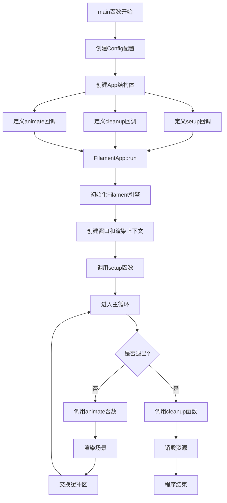
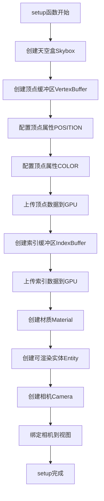
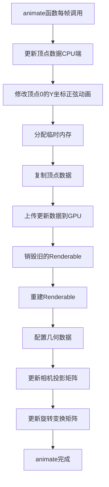
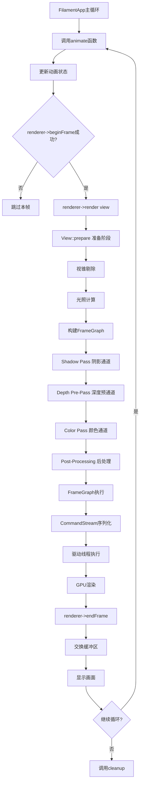
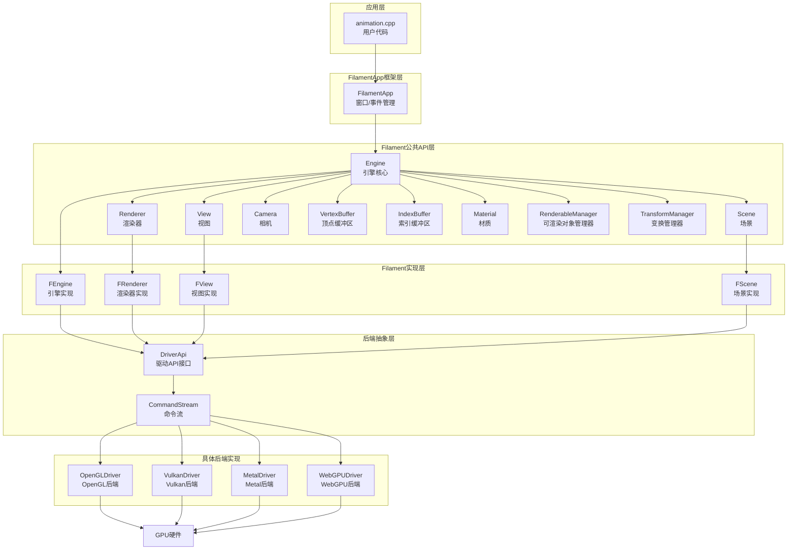
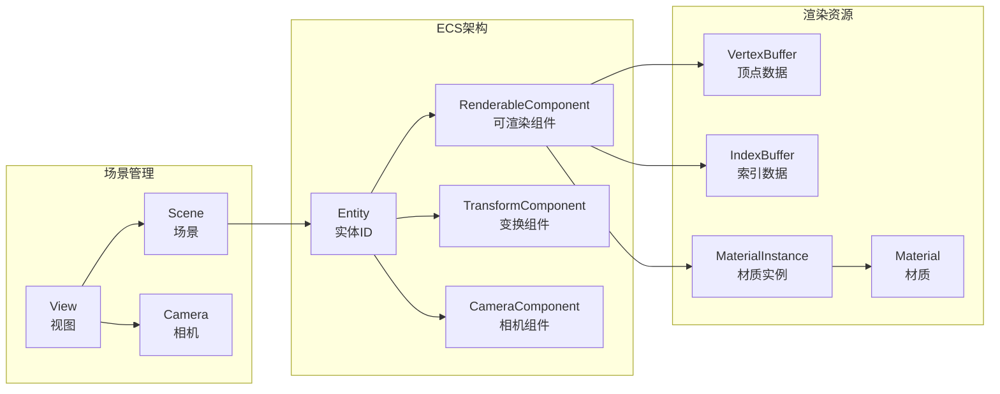
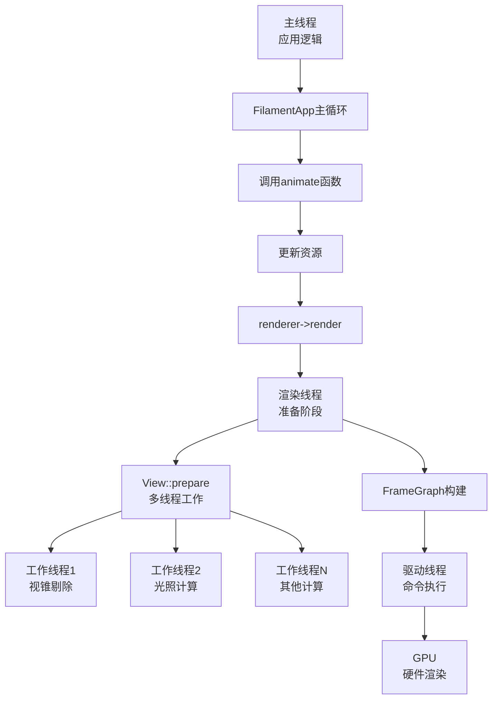
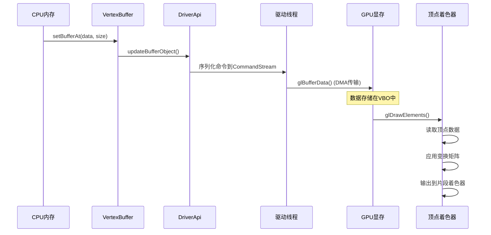
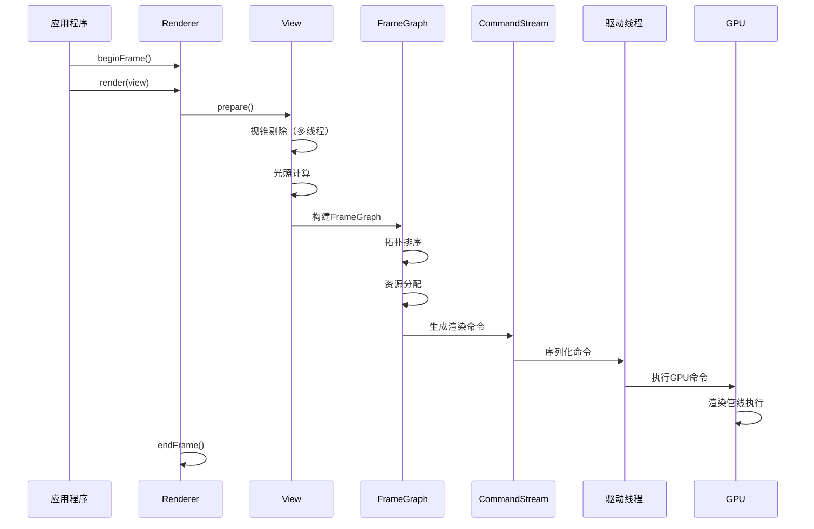
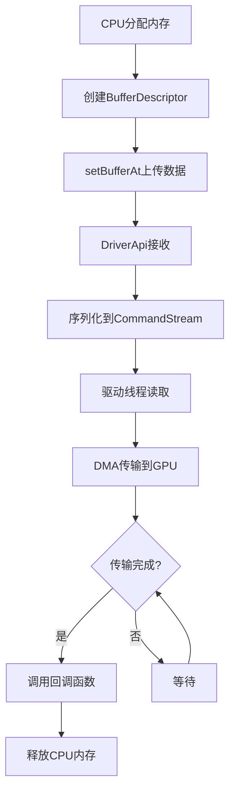

# Filament Animation 示例全流程分析

## 目录

1. [概述](#概述)
2. [程序入口与初始化](#程序入口与初始化)
3. [资源创建流程（Setup阶段）](#资源创建流程setup阶段)
4. [动画循环流程（Animate阶段）](#动画循环流程animate阶段)
5. [渲染流程](#渲染流程)
6. [Filament框架架构](#filament框架架构)
7. [数据流分析](#数据流分析)
8. [关键组件详解](#关键组件详解)
9. [性能优化建议](#性能优化建议)
10. [总结](#总结)

---

## 概述

`animation.cpp` 是 Filament 渲染引擎的一个基础示例，演示了如何创建一个动态动画的彩色三角形。这个示例涵盖了 Filament 的核心概念：

- **顶点缓冲区（VertexBuffer）**：存储顶点数据
- **索引缓冲区（IndexBuffer）**：定义顶点连接顺序
- **材质（Material）**：定义渲染外观
- **可渲染对象（Renderable）**：组合几何和材质
- **变换（Transform）**：控制对象的位置、旋转、缩放
- **相机（Camera）**：控制视图和投影
- **场景（Scene）**：包含所有渲染对象
- **视图（View）**：定义渲染视口

### 示例功能

1. **顶点位置动画**：顶点0的Y坐标按正弦波变化
2. **旋转变换动画**：整个三角形绕Z轴持续旋转
3. **实时数据更新**：每帧更新顶点数据并上传到GPU

---

## 程序入口与初始化

### 程序流程图



### 代码结构

```cpp
int main(int argc, char** argv) {
    // 1. 配置应用程序
    Config config;
    config.title = "animation";
    config.backend = samples::parseArgumentsForBackend(argc, argv);
    
    // 2. 应用程序状态
    App app;
    
    // 3. 定义初始化函数
    auto setup = [&app](Engine* engine, View* view, Scene* scene) {
        // 创建所有渲染资源
    };
    
    // 4. 定义清理函数
    auto cleanup = [&app](Engine* engine, View*, Scene*) {
        // 销毁所有资源
    };
    
    // 5. 定义动画函数
    FilamentApp::get().animate([&app](Engine* engine, View* view, double now) {
        // 每帧更新动画
    });
    
    // 6. 运行应用程序
    FilamentApp::get().run(config, setup, cleanup);
    
    return 0;
}
```

### FilamentApp 框架职责

`FilamentApp` 是一个封装了 Filament 渲染循环的应用框架，它负责：

1. **窗口管理**：创建和管理 SDL 窗口
2. **引擎初始化**：创建 Filament Engine 实例
3. **渲染上下文**：创建 SwapChain 和 Renderer
4. **事件循环**：处理窗口事件（鼠标、键盘等）
5. **渲染循环**：调用用户定义的 animate 函数，然后渲染场景
6. **资源清理**：在退出时调用 cleanup 函数

---

## 资源创建流程（Setup阶段）

### Setup 阶段流程图



### 详细步骤分析

#### 1. 创建天空盒（Skybox）

```cpp
app.skybox = Skybox::Builder()
    .color({0.1, 0.125, 0.25, 1.0})  // 深蓝色背景
    .build(*engine);
scene->setSkybox(app.skybox);
```

**作用**：
- 设置场景的背景颜色
- 提供环境光的基础颜色

#### 2. 创建顶点缓冲区（VertexBuffer）

顶点缓冲区是存储顶点数据的GPU缓冲区。每个顶点包含：
- **位置（Position）**：2D坐标 (x, y)，8字节（float2）
- **颜色（Color）**：ARGB格式，4字节（ubyte4）

**内存布局**：
```
顶点0: [position(8字节)] [color(4字节)] = 12字节
顶点1: [position(8字节)] [color(4字节)] = 12字节
顶点2: [position(8字节)] [color(4字节)] = 12字节
总计: 36字节
```

**配置代码**：
```cpp
app.vb = VertexBuffer::Builder()
    .vertexCount(3)                    // 3个顶点
    .bufferCount(1)                     // 1个缓冲区
    .attribute(
        VertexAttribute::POSITION,      // 位置属性
        0,                              // 缓冲区索引
        VertexBuffer::AttributeType::FLOAT2,  // 2个float
        0,                              // 字节偏移：0
        12                              // 顶点步长：12字节
    )
    .attribute(
        VertexAttribute::COLOR,         // 颜色属性
        0,                              // 缓冲区索引
        VertexBuffer::AttributeType::UBYTE4,  // 4个无符号字节
        8,                              // 字节偏移：8（position之后）
        12                              // 顶点步长：12字节
    )
    .normalized(VertexAttribute::COLOR) // 颜色归一化（0-255 → 0.0-1.0）
    .build(*engine);
```

**顶点数据**：
```cpp
static Vertex TRIANGLE_VERTICES[3] = {
    {{1, 0}, 0xffff0000u},              // 顶点0：右侧，红色
    {{cos(M_PI * 2 / 3), sin(M_PI * 2 / 3)}, 0xff00ff00u},  // 顶点1：左上，绿色
    {{cos(M_PI * 4 / 3), sin(M_PI * 4 / 3)}, 0xff0000ffu},  // 顶点2：左下，蓝色
};
```

#### 3. 上传顶点数据到GPU

```cpp
app.vb->setBufferAt(*engine, 0,
    VertexBuffer::BufferDescriptor(TRIANGLE_VERTICES, 36, nullptr));
```

**数据传输流程**：
```
CPU内存 (TRIANGLE_VERTICES)
    ↓ setBufferAt()
FVertexBuffer::setBufferAt()
    ↓ DriverApi::updateBufferObject()
OpenGLDriver::updateBufferObject()
    ↓ glBufferData() / glBufferSubData()
DMA传输 (CPU内存 → GPU显存)
    ↓
GPU显存 (VBO - Vertex Buffer Object)
```

**关键点**：
- 数据传输是**异步**的，通过DMA（直接内存访问）完成
- 不会阻塞CPU，GPU驱动在适当时机完成传输
- 数据从CPU内存 → 系统总线 → PCIe → GPU显存

#### 4. 创建索引缓冲区（IndexBuffer）

```cpp
app.ib = IndexBuffer::Builder()
    .indexCount(3)                              // 3个索引
    .bufferType(IndexBuffer::IndexType::USHORT)  // 16位无符号短整型
    .build(*engine);

app.ib->setBuffer(*engine,
    IndexBuffer::BufferDescriptor(TRIANGLE_INDICES, 6, nullptr));
```

**索引数据**：
```cpp
static constexpr uint16_t TRIANGLE_INDICES[3] = { 0, 1, 2 };
```

**作用**：
- 定义顶点的连接顺序：使用顶点0、1、2按顺序形成三角形
- 允许顶点重用（一个顶点可以被多个三角形共享）

#### 5. 创建材质（Material）

```cpp
app.mat = Material::Builder()
    .package(RESOURCES_BAKEDCOLOR_DATA, RESOURCES_BAKEDCOLOR_SIZE)
    .build(*engine);
```

**材质说明**：
- `BakedColor` 材质直接使用顶点颜色，不需要额外的纹理或光照计算
- 材质数据是预编译的（`.mat` 文件），包含着色器代码和参数

#### 6. 创建可渲染实体（Renderable）

```cpp
app.renderable = EntityManager::get().create();  // 创建实体ID
scene->addEntity(app.renderable);                 // 添加到场景
```

**注意**：此时实体还没有配置渲染数据，需要在 animate 函数中配置。

#### 7. 创建相机（Camera）

```cpp
app.camera = utils::EntityManager::get().create();  // 创建相机实体ID
app.cam = engine->createCamera(app.camera);          // 创建相机组件
view->setCamera(app.cam);                            // 绑定到视图
```

**相机作用**：
- 定义**视图矩阵**（从哪个角度观察场景）
- 定义**投影矩阵**（如何将3D坐标投影到2D屏幕）

---

## 动画循环流程（Animate阶段）

### Animate 阶段流程图



### 详细步骤分析

#### 1. 更新顶点数据（CPU端）

```cpp
void* verts = malloc(36);
TRIANGLE_VERTICES[0].position.y = sin(now * 4);  // 正弦动画
memcpy(verts, TRIANGLE_VERTICES, 36);
```

**动画效果**：
- `sin(now * 4)`：频率为4（每秒4个周期）
- 范围：-1 到 1
- 顶点0的Y坐标会上下波动

#### 2. 上传更新数据到GPU

```cpp
vb->setBufferAt(*engine, 0, 
    VertexBuffer::BufferDescriptor(verts, 36,
        (VertexBuffer::BufferDescriptor::Callback) free));
```

**内存管理**：
- 使用 `free` 作为回调函数
- 数据上传完成后自动释放临时内存
- 确保数据不会过早释放（可能还在传输中）

#### 3. 重建可渲染对象

```cpp
auto& rcm = engine->getRenderableManager();
rcm.destroy(app.renderable);  // 销毁旧的

RenderableManager::Builder(1)  // 1个渲染图元
    .boundingBox({{ -1, -1, -1 }, { 1, 1, 1 }})  // 边界盒
    .material(0, app.mat->getDefaultInstance())   // 材质实例
    .geometry(0, 
        RenderableManager::PrimitiveType::TRIANGLES,  // 三角形图元
        app.vb,                                        // 顶点缓冲区
        app.ib,                                        // 索引缓冲区
        0,                                             // 索引起始位置
        3)                                             // 使用3个索引
    .culling(false)          // 禁用背面剔除
    .receiveShadows(false)   // 不接收阴影
    .castShadows(false)      // 不投射阴影
    .build(*engine, app.renderable);
```

**注意**：每帧重建 Renderable 不是最佳实践，这里可能是为了演示目的。更好的做法是：
- 只在初始化时创建一次
- 只更新变换矩阵（通过 TransformManager）

#### 4. 更新相机投影矩阵

```cpp
constexpr float ZOOM = 1.5f;
const uint32_t w = view->getViewport().width;
const uint32_t h = view->getViewport().height;
const float aspect = (float) w / h;

app.cam->setProjection(Camera::Projection::ORTHO,
    -aspect * ZOOM,   // 左边界
    aspect * ZOOM,    // 右边界
    -ZOOM,            // 下边界
    ZOOM,             // 上边界
    0,                // 近平面
    1);               // 远平面
```

**正交投影特点**：
- 平行投影，没有透视效果
- 物体大小不随距离变化
- 适合2D渲染或等距视图

#### 5. 更新旋转变换

```cpp
auto& tcm = engine->getTransformManager();
tcm.setTransform(
    tcm.getInstance(app.renderable),
    filament::math::mat4f::rotation(
        now,                          // 旋转角度（弧度）
        filament::math::float3{ 0, 0, 1 }  // 旋转轴（Z轴）
    )
);
```

**变换矩阵作用**：
- 在顶点着色器中，每个顶点位置会乘以这个矩阵
- 实现物体的旋转、平移、缩放等变换
- 这里实现绕Z轴持续旋转

---

## 渲染流程

### 完整渲染流程图



### 渲染管线详细说明

#### 1. beginFrame()

```cpp
if (renderer->beginFrame(swapChain)) {
    // 可以开始渲染
}
```

**作用**：
- 准备渲染上下文
- 设置 SwapChain
- 记录时间戳
- 返回是否可以进行渲染

#### 2. render(view)

**主要步骤**：

1. **View::prepare()** - 准备阶段（CPU，多线程）
   - 视锥剔除（Frustum Culling）
   - 阴影剔除（Shadow Culling）
   - 光照筛选和排序
   - Froxel/Tile 光分配
   - Uniform 缓冲区准备

2. **FrameGraph 构建** - 声明渲染通道
   - Shadow Pass（阴影贴图）
   - Depth Pre-Pass（深度预通道）
   - Color Pass（颜色通道）
   - Post-Processing Pass（后处理）

3. **FrameGraph 编译**
   - 拓扑排序
   - 剔除未使用的 Pass
   - 资源生命周期管理（first/last use）

4. **FrameGraph 执行**
   - 按顺序执行所有 Pass
   - 每个 Pass 生成渲染命令
   - 命令序列化到 CommandStream

#### 3. endFrame()

```cpp
renderer->endFrame();
```

**作用**：
- 提交渲染命令到GPU
- 交换缓冲区
- 显示画面
- 同步和回收资源

---

## Filament框架架构

### 整体架构图



### 核心组件关系图



### 线程模型



**线程说明**：
- **主线程**：应用逻辑、资源更新
- **渲染线程**：渲染准备、FrameGraph构建
- **工作线程**：并行计算（剔除、光照等）
- **驱动线程**：执行GPU命令

---

## 数据流分析

### 顶点数据流



### 渲染命令流



### 内存管理流程



---

## 关键组件详解

### 1. Engine（引擎）

**职责**：
- 管理所有渲染资源
- 管理渲染线程和工作线程
- 提供资源创建和销毁接口
- 跟踪资源生命周期

**关键方法**：
```cpp
Engine* engine = Engine::create();
VertexBuffer* vb = engine->createVertexBuffer(...);
Material* mat = engine->createMaterial(...);
engine->destroy(vb);
Engine::destroy(&engine);
```

### 2. Renderer（渲染器）

**职责**：
- 执行渲染循环
- 管理 SwapChain
- 协调渲染通道

**关键方法**：
```cpp
Renderer* renderer = engine->createRenderer();
if (renderer->beginFrame(swapChain)) {
    renderer->render(view);
    renderer->endFrame();
}
```

### 3. View（视图）

**职责**：
- 定义渲染视口
- 绑定相机和场景
- 准备渲染数据（剔除、光照等）

**关键方法**：
```cpp
View* view = engine->createView();
view->setViewport({0, 0, width, height});
view->setCamera(camera);
view->setScene(scene);
```

### 4. Scene（场景）

**职责**：
- 包含所有可渲染对象
- 管理光源
- 管理天空盒和环境光

**关键方法**：
```cpp
Scene* scene = engine->createScene();
scene->addEntity(renderable);
scene->setSkybox(skybox);
```

### 5. VertexBuffer（顶点缓冲区）

**职责**：
- 存储顶点数据（位置、颜色、法线、UV等）
- 管理GPU缓冲区
- 提供数据更新接口

**关键方法**：
```cpp
VertexBuffer* vb = VertexBuffer::Builder()
    .vertexCount(count)
    .bufferCount(1)
    .attribute(...)
    .build(*engine);
    
vb->setBufferAt(*engine, 0, BufferDescriptor(data, size, callback));
```

### 6. Material（材质）

**职责**：
- 定义渲染外观
- 包含着色器代码
- 管理材质参数

**关键方法**：
```cpp
Material* mat = Material::Builder()
    .package(data, size)
    .build(*engine);
    
MaterialInstance* mi = mat->getDefaultInstance();
```

### 7. RenderableManager（可渲染对象管理器）

**职责**：
- 管理可渲染组件
- 配置几何和材质
- ECS架构中的组件管理器

**关键方法**：
```cpp
RenderableManager::Builder(1)
    .boundingBox(box)
    .material(0, materialInstance)
    .geometry(0, type, vb, ib, offset, count)
    .build(*engine, entity);
```

### 8. TransformManager（变换管理器）

**职责**：
- 管理变换组件
- 提供变换矩阵设置接口
- ECS架构中的组件管理器

**关键方法**：
```cpp
auto& tcm = engine->getTransformManager();
tcm.setTransform(
    tcm.getInstance(entity),
    transformMatrix
);
```

---

## 性能优化建议

### 1. 避免每帧重建Renderable

**当前实现**（不推荐）：
```cpp
// 每帧都销毁并重建
rcm.destroy(app.renderable);
RenderableManager::Builder(1)...build(*engine, app.renderable);
```

**优化方案**：
```cpp
// 只在初始化时创建一次
// setup函数中：
RenderableManager::Builder(1)...build(*engine, app.renderable);

// animate函数中：
// 只更新变换，不重建Renderable
auto& tcm = engine->getTransformManager();
tcm.setTransform(tcm.getInstance(app.renderable), transform);
```

### 2. 使用双缓冲更新顶点数据

**当前实现**：
```cpp
void* verts = malloc(36);
memcpy(verts, TRIANGLE_VERTICES, 36);
vb->setBufferAt(*engine, 0, BufferDescriptor(verts, 36, free));
```

**优化方案**：
```cpp
// 使用双缓冲，避免每帧分配内存
static Vertex buffer[2][3];
static int currentBuffer = 0;

currentBuffer = 1 - currentBuffer;
buffer[currentBuffer][0].position.y = sin(now * 4);
// ... 更新其他顶点
vb->setBufferAt(*engine, 0, 
    BufferDescriptor(buffer[currentBuffer], 36, nullptr));
```

### 3. 批量更新资源

如果场景中有多个对象需要更新，应该：
- 批量更新变换矩阵
- 使用实例化渲染（Instancing）
- 减少状态切换

### 4. 合理使用剔除

- 启用视锥剔除（默认启用）
- 使用遮挡剔除（Occlusion Culling）
- 合理设置边界盒（BoundingBox）

---

## 总结

### Animation示例的核心知识点

1. **资源创建流程**：
   - VertexBuffer → IndexBuffer → Material → Renderable → Camera
   - 每个资源都有明确的创建和配置步骤

2. **数据上传机制**：
   - CPU内存 → VertexBuffer → DriverApi → GPU显存
   - 异步DMA传输，不阻塞CPU

3. **动画更新流程**：
   - 每帧更新顶点数据
   - 更新变换矩阵
   - 重建或更新Renderable

4. **渲染流程**：
   - beginFrame() → render(view) → endFrame()
   - View::prepare() 准备数据
   - FrameGraph 构建和执行
   - GPU渲染管线执行

### Filament框架特点

1. **分层架构**：
   - 应用层 → API层 → 实现层 → 后端层
   - 清晰的职责划分

2. **ECS架构**：
   - Entity（实体）+ Component（组件）+ System（系统）
   - 灵活的组件组合

3. **多后端支持**：
   - OpenGL / Vulkan / Metal / WebGPU
   - 统一的DriverApi接口

4. **高性能**：
   - 多线程渲染
   - 异步命令提交
   - 高效的资源管理

### 学习路径建议

1. **基础阶段**：
   - 理解animation示例的完整流程
   - 掌握核心组件的使用方法
   - 理解数据流和渲染流程

2. **进阶阶段**：
   - 学习其他示例（hellotriangle, hellopbr等）
   - 理解材质系统和着色器
   - 学习光照和阴影系统

3. **高级阶段**：
   - 深入FrameGraph系统
   - 理解后端抽象层
   - 性能优化和调试

### 相关文档

- `samples/animation.cpp` - 本示例源码
- `filament/include/filament/` - 公共API头文件
- `filament/src/details/` - 实现层源码
- `fenxi/Filament整体架构分析.md` - 整体架构分析
- `fenxi/Filament_渲染管线详细分析.md` - 渲染管线分析

---

**文档版本**：1.0  
**最后更新**：2024年  
**作者**：Filament学习文档

