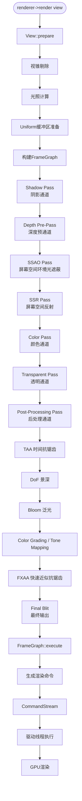
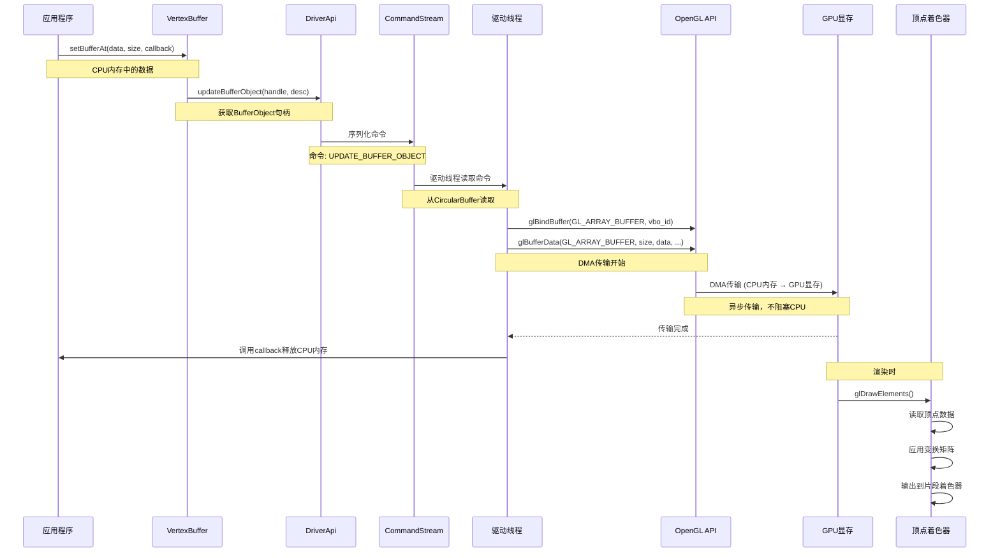
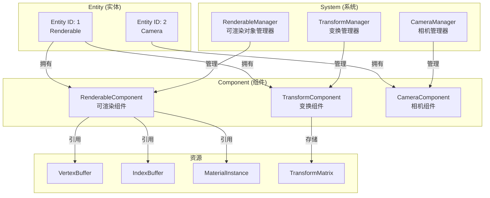
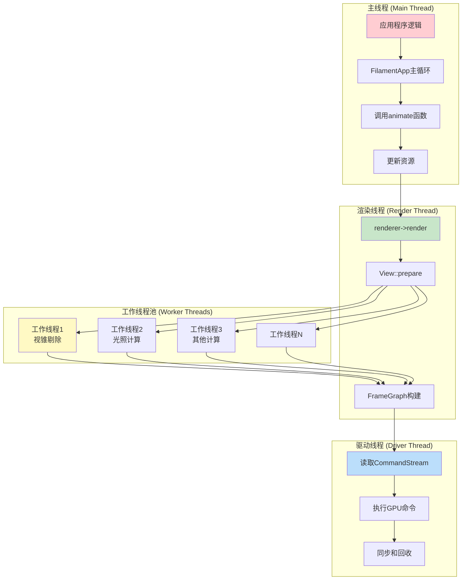
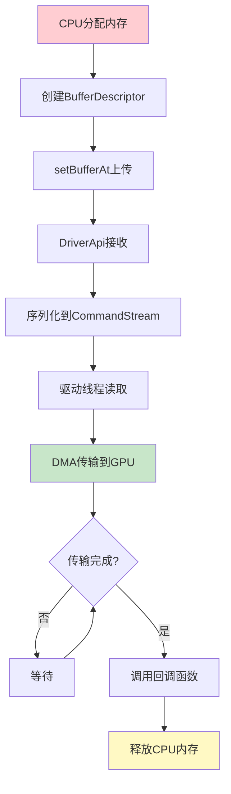

# Filament Animation 示例架构图详解

本文档提供 Animation 示例的详细架构图和组件关系图，帮助深入理解 Filament 框架。

## 目录

1. [Filament 整体架构层次图](#filament-整体架构层次图)
2. [Animation 示例执行流程图](#animation-示例执行流程图)
3. [资源创建详细流程图](#资源创建详细流程图)
4. [渲染管线架构图](#渲染管线架构图)
5. [数据流架构图](#数据流架构图)
6. [ECS 架构关系图](#ecs-架构关系图)
7. [线程模型架构图](#线程模型架构图)
8. [内存管理架构图](#内存管理架构图)

---

## Filament 整体架构层次图

### 分层架构

```
┌─────────────────────────────────────────────────────────────┐
│                    应用层 (Application Layer)                 │
│  ┌───────────────────────────────────────────────────────┐  │
│  │  animation.cpp                                         │  │
│  │  - 用户代码                                            │  │
│  │  - 资源创建和管理                                      │  │
│  │  - 动画逻辑                                            │  │
│  └───────────────────────────────────────────────────────┘  │
└──────────────────────┬────────────────────────────────────────┘
                       │
┌──────────────────────▼────────────────────────────────────────┐
│              FilamentApp 框架层 (Framework Layer)             │
│  ┌───────────────────────────────────────────────────────┐  │
│  │  FilamentApp                                          │  │
│  │  - 窗口管理 (SDL)                                     │  │
│  │  - 事件循环                                           │  │
│  │  - 渲染循环协调                                        │  │
│  │  - 资源生命周期管理                                    │  │
│  └───────────────────────────────────────────────────────┘  │
└──────────────────────┬────────────────────────────────────────┘
                       │
┌──────────────────────▼────────────────────────────────────────┐
│              Filament 公共 API 层 (Public API Layer)          │
│  ┌──────────┐  ┌──────────┐  ┌──────────┐  ┌──────────┐   │
│  │ Engine   │  │ Renderer │  │   View   │  │  Scene   │   │
│  └──────────┘  └──────────┘  └──────────┘  └──────────┘   │
│  ┌──────────┐  ┌──────────┐  ┌──────────┐  ┌──────────┐   │
│  │ Camera   │  │Material  │  │VertexBuf │  │IndexBuf  │   │
│  └──────────┘  └──────────┘  └──────────┘  └──────────┘   │
│  ┌──────────┐  ┌──────────┐  ┌──────────┐                 │
│  │Renderable│  │Transform │  │  Skybox  │                 │
│  │ Manager  │  │ Manager  │  │          │                 │
│  └──────────┘  └──────────┘  └──────────┘                 │
└──────────────────────┬────────────────────────────────────────┘
                       │
┌──────────────────────▼────────────────────────────────────────┐
│          Filament 实现层 (Implementation Layer)               │
│  ┌──────────┐  ┌──────────┐  ┌──────────┐  ┌──────────┐   │
│  │ FEngine  │  │FRenderer │  │  FView    │  │  FScene  │   │
│  └──────────┘  └──────────┘  └──────────┘  └──────────┘   │
│  ┌──────────┐  ┌──────────┐  ┌──────────┐                 │
│  │FCamera   │  │FMaterial │  │FVertexBuf│                 │
│  └──────────┘  └──────────┘  └──────────┘                 │
└──────────────────────┬────────────────────────────────────────┘
                       │
┌──────────────────────▼────────────────────────────────────────┐
│              后端抽象层 (Backend Abstraction Layer)           │
│  ┌───────────────────────────────────────────────────────┐  │
│  │  DriverApi                                             │  │
│  │  - 统一的驱动接口                                       │  │
│  │  - 命令序列化                                          │  │
│  │  - 资源管理                                            │  │
│  └───────────────────────────────────────────────────────┘  │
│  ┌───────────────────────────────────────────────────────┐  │
│  │  CommandStream                                         │  │
│  │  - 命令缓冲区                                           │  │
│  │  - 线程间通信                                          │  │
│  └───────────────────────────────────────────────────────┘  │
└──────────────────────┬────────────────────────────────────────┘
                       │
┌──────────────────────▼────────────────────────────────────────┐
│              具体后端实现 (Backend Implementations)           │
│  ┌──────────┐  ┌──────────┐  ┌──────────┐  ┌──────────┐   │
│  │OpenGL    │  │ Vulkan   │  │  Metal   │  │ WebGPU   │   │
│  │Driver    │  │ Driver   │  │ Driver   │  │ Driver   │   │
│  └──────────┘  └──────────┘  └──────────┘  └──────────┘   │
└──────────────────────┬────────────────────────────────────────┘
                       │
┌──────────────────────▼────────────────────────────────────────┐
│                      GPU 硬件层                               │
│  ┌───────────────────────────────────────────────────────┐  │
│  │  GPU 渲染管线                                          │  │
│  │  - 顶点着色器                                          │  │
│  │  - 片段着色器                                          │  │
│  │  - 光栅化                                              │  │
│  │  - 输出到帧缓冲区                                      │  │
│  └───────────────────────────────────────────────────────┘  │
└───────────────────────────────────────────────────────────────┘
```

### 组件依赖关系

```
Engine (核心)
  ├── Renderer (渲染器)
  │     ├── SwapChain (交换链)
  │     └── FrameGraph (渲染图)
  │
  ├── View (视图)
  │     ├── Camera (相机)
  │     └── Scene (场景)
  │
  ├── Scene (场景)
  │     ├── Renderable (可渲染对象)
  │     ├── Light (光源)
  │     └── Skybox (天空盒)
  │
  ├── Renderable (可渲染对象)
  │     ├── VertexBuffer (顶点缓冲区)
  │     ├── IndexBuffer (索引缓冲区)
  │     └── MaterialInstance (材质实例)
  │
  └── Material (材质)
        └── Shader (着色器)
```

---

## Animation 示例执行流程图

### 完整执行流程

```mermaid
graph TB
    Start([程序启动]) --> Init[初始化阶段]
    
    Init --> Config[创建Config配置]
    Config --> App[创建App结构体]
    App --> SetupDef[定义setup回调]
    App --> CleanupDef[定义cleanup回调]
    App --> AnimateDef[定义animate回调]
    
    SetupDef --> Run[FilamentApp::run]
    CleanupDef --> Run
    AnimateDef --> Run
    
    Run --> EngineInit[初始化Engine]
    EngineInit --> Window[创建窗口]
    Window --> Context[创建渲染上下文]
    Context --> SwapChain[创建SwapChain]
    SwapChain --> Renderer[创建Renderer]
    Renderer --> Scene[创建Scene]
    Scene --> View[创建View]
    
    View --> Setup[调用setup函数]
    
    Setup --> Skybox[创建Skybox]
    Skybox --> VB[创建VertexBuffer]
    VB --> UploadVB[上传顶点数据]
    UploadVB --> IB[创建IndexBuffer]
    IB --> UploadIB[上传索引数据]
    UploadIB --> Mat[创建Material]
    Mat --> Entity[创建Entity]
    Entity --> Camera[创建Camera]
    Camera --> Bind[绑定Camera到View]
    
    Bind --> Loop[进入主循环]
    
    Loop --> Event[处理窗口事件]
    Event --> Animate[调用animate函数]
    
    Animate --> UpdateVB[更新顶点数据]
    UpdateVB --> UploadVB2[上传到GPU]
    UploadVB2 --> Rebuild[重建Renderable]
    Rebuild --> UpdateProj[更新投影矩阵]
    UpdateProj --> UpdateTrans[更新变换矩阵]
    
    UpdateTrans --> Render[渲染场景]
    
    Render --> BeginFrame[beginFrame]
    BeginFrame --> Prepare[View::prepare]
    Prepare --> Cull[视锥剔除]
    Cull --> Light[光照计算]
    Light --> BuildFG[构建FrameGraph]
    BuildFG --> ExecuteFG[执行FrameGraph]
    ExecuteFG --> EndFrame[endFrame]
    EndFrame --> Swap[交换缓冲区]
    
    Swap --> Check{继续?}
    Check -->|是| Loop
    Check -->|否| Cleanup[调用cleanup函数]
    
    Cleanup --> DestroyVB[销毁VertexBuffer]
    DestroyVB --> DestroyIB[销毁IndexBuffer]
    DestroyIB --> DestroyMat[销毁Material]
    DestroyMat --> DestroyEntity[销毁Entity]
    DestroyEntity --> DestroyCamera[销毁Camera]
    DestroyCamera --> DestroySkybox[销毁Skybox]
    DestroySkybox --> DestroyEngine[销毁Engine]
    DestroyEngine --> End([程序结束])
```



---

## 资源创建详细流程图

### Setup 函数详细流程

```mermaid
graph TD
    Start([setup函数开始]) --> Skybox[1. 创建Skybox]
    
    Skybox --> SkyboxBuilder[Skybox::Builder]
    SkyboxBuilder --> SkyboxColor[设置颜色 0.1, 0.125, 0.25, 1.0]
    SkyboxColor --> SkyboxBuild[build engine]
    SkyboxBuild --> SkyboxSet[scene->setSkybox]
    
    SkyboxSet --> VB[2. 创建VertexBuffer]
    
    VB --> VBBuilder[VertexBuffer::Builder]
    VBBuilder --> VBVertexCount[vertexCount 3]
    VBVertexCount --> VBBufferCount[bufferCount 1]
    VBBufferCount --> VBAttrPos[attribute POSITION]
    VBAttrPos --> VBAttrPosType[FLOAT2, offset 0, stride 12]
    VBAttrPosType --> VBAttrColor[attribute COLOR]
    VBAttrColor --> VBAttrColorType[UBYTE4, offset 8, stride 12]
    VBAttrColorType --> VBNormalized[normalized COLOR]
    VBNormalized --> VBBuild[build engine]
    
    VBBuild --> UploadVB[3. 上传顶点数据]
    
    UploadVB --> VBSetBuffer[setBufferAt engine, 0]
    VBSetBuffer --> VBDesc[BufferDescriptor data, 36, nullptr]
    VBDesc --> VBDriver[DriverApi::updateBufferObject]
    VBDriver --> VBGPU[GPU显存 VBO]
    
    VBGPU --> IB[4. 创建IndexBuffer]
    
    IB --> IBBuilder[IndexBuffer::Builder]
    IBBuilder --> IBIndexCount[indexCount 3]
    IBIndexCount --> IBType[IndexType USHORT]
    IBType --> IBBuild[build engine]
    
    IBBuild --> UploadIB[5. 上传索引数据]
    
    UploadIB --> IBSetBuffer[setBuffer engine]
    IBSetBuffer --> IBDesc[BufferDescriptor indices, 6, nullptr]
    IBDesc --> IBGPU[GPU显存 IBO]
    
    IBGPU --> Mat[6. 创建Material]
    
    Mat --> MatBuilder[Material::Builder]
    MatBuilder --> MatPackage[package BakedColor data]
    MatPackage --> MatBuild[build engine]
    
    MatBuild --> Entity[7. 创建Entity]
    
    Entity --> EntityCreate[EntityManager::create]
    EntityCreate --> EntityAdd[scene->addEntity]
    
    EntityAdd --> Camera[8. 创建Camera]
    
    Camera --> CameraEntity[EntityManager::create]
    CameraEntity --> CameraCreate[engine->createCamera]
    CameraCreate --> CameraBind[view->setCamera]
    
    CameraBind --> End([setup完成])
```



### 顶点数据结构

```
顶点缓冲区内存布局（每个顶点12字节）：

┌─────────────────────────────────────────┐
│  顶点 0                                  │
├─────────────────────────────────────────┤
│  [0-7]   : position (float2) = 8字节    │
│  [8-11]  : color (ubyte4) = 4字节       │
└─────────────────────────────────────────┘
┌─────────────────────────────────────────┐
│  顶点 1                                  │
├─────────────────────────────────────────┤
│  [0-7]   : position (float2) = 8字节    │
│  [8-11]  : color (ubyte4) = 4字节       │
└─────────────────────────────────────────┘
┌─────────────────────────────────────────┐
│  顶点 2                                  │
├─────────────────────────────────────────┤
│  [0-7]   : position (float2) = 8字节    │
│  [8-11]  : color (ubyte4) = 4字节       │
└─────────────────────────────────────────┘

总计：36字节
```

---

## 渲染管线架构图

### FrameGraph 渲染管线



### 渲染通道详细说明

```
┌─────────────────────────────────────────────────────────┐
│  Shadow Pass (阴影通道)                                  │
│  ┌───────────────────────────────────────────────────┐  │
│  │  从光源视角渲染场景                                │  │
│  │  生成阴影贴图 (Shadow Map)                         │  │
│  │  存储深度值到纹理                                 │  │
│  └───────────────────────────────────────────────────┘  │
└─────────────────────────────────────────────────────────┘
                        ↓
┌─────────────────────────────────────────────────────────┐
│  Depth Pre-Pass (深度预通道)                            │
│  ┌───────────────────────────────────────────────────┐  │
│  │  提前渲染深度缓冲区                                │  │
│  │  优化后续通道的深度测试                            │  │
│  │  减少不必要的片段着色器调用                        │  │
│  └───────────────────────────────────────────────────┘  │
└─────────────────────────────────────────────────────────┘
                        ↓
┌─────────────────────────────────────────────────────────┐
│  Color Pass (颜色通道)                                   │
│  ┌───────────────────────────────────────────────────┐  │
│  │  主渲染通道                                        │  │
│  │  - PBR材质计算                                     │  │
│  │  - 直射光 + IBL环境光                              │  │
│  │  - 阴影计算                                        │  │
│  │  - 输出到GBuffer                                   │  │
│  └───────────────────────────────────────────────────┘  │
└─────────────────────────────────────────────────────────┘
                        ↓
┌─────────────────────────────────────────────────────────┐
│  Post-Processing Pass (后处理通道)                       │
│  ┌───────────────────────────────────────────────────┐  │
│  │  TAA → DoF → Bloom → Tone Mapping → FXAA         │  │
│  │  最终输出到SwapChain                               │  │
│  └───────────────────────────────────────────────────┘  │
└─────────────────────────────────────────────────────────┘
```

---

## 数据流架构图

### 顶点数据流



### 渲染命令流


---

## ECS 架构关系图

### Entity-Component-System 架构



### ECS 数据布局

```
传统AoS (Array of Structures):
┌─────────────────────────────────────┐
│ Entity 0: [Renderable] [Transform]  │
│ Entity 1: [Renderable] [Transform]  │
│ Entity 2: [Renderable] [Transform]  │
└─────────────────────────────────────┘

Filament SoA (Structure of Arrays):
┌─────────────────────────────────────┐
│ RenderableComponent:                │
│   [Entity0, Entity1, Entity2, ...]  │
│   [VB0,    VB1,    VB2,    ...]     │
│   [IB0,    IB1,    IB2,    ...]     │
│   [Mat0,   Mat1,   Mat2,   ...]     │
├─────────────────────────────────────┤
│ TransformComponent:                 │
│   [Entity0, Entity1, Entity2, ...]  │
│   [Mat0,    Mat1,    Mat2,   ...]   │
└─────────────────────────────────────┘

优势：
- 更好的缓存局部性
- 便于SIMD优化
- 组件可以独立添加/删除
```

---

## 线程模型架构图

### 多线程架构



### 线程同步点

```
主线程                   渲染线程                   驱动线程
  │                         │                         │
  │─── animate() ──────────>│                         │
  │                         │                         │
  │                         │─── prepare() ──────────>│
  │                         │   (多线程工作)           │
  │                         │                         │
  │                         │<── 工作完成 ─────────────│
  │                         │                         │
  │<── render() 返回 ───────│                         │
  │                         │                         │
  │                         │─── FrameGraph执行 ─────>│
  │                         │                         │─── GPU命令
  │                         │                         │
  │<── endFrame() 返回 ──────│<── 执行完成 ────────────│
  │                         │                         │
```

---

## 内存管理架构图

### 内存生命周期



### 内存管理策略

```
┌─────────────────────────────────────────────────────────┐
│  内存分配策略                                            │
├─────────────────────────────────────────────────────────┤
│  1. CPU内存 (应用程序)                                   │
│     - malloc/new 分配                                    │
│     - BufferDescriptor 持有指针                          │
│     - 回调函数负责释放                                   │
│                                                          │
│  2. GPU显存 (驱动管理)                                   │
│     - glBufferData / vkCreateBuffer 分配                │
│     - Engine 跟踪所有资源                                │
│     - destroy() 时自动释放                                │
│                                                          │
│  3. 命令缓冲区 (CircularBuffer)                         │
│     - 环形缓冲区，避免频繁分配                            │
│     - 多帧复用                                           │
│     - 自动回收                                           │
└─────────────────────────────────────────────────────────┘
```

---

## 总结

本文档提供了 Animation 示例的详细架构图，包括：

1. **整体架构层次**：从应用层到GPU硬件层的完整架构
2. **执行流程**：程序从启动到结束的完整流程
3. **资源创建**：每个资源的详细创建步骤
4. **渲染管线**：FrameGraph 渲染管线的完整流程
5. **数据流**：顶点数据和渲染命令的数据流
6. **ECS架构**：Entity-Component-System 的详细关系
7. **线程模型**：多线程渲染的架构和同步
8. **内存管理**：内存分配和释放的完整生命周期

这些架构图帮助理解 Filament 的设计理念和实现细节，为进一步学习和优化提供基础。

---

**文档版本**：1.0  
**最后更新**：2024年  
**相关文档**：`animation全流程分析.md`

